# AI Integration Layer

<cite>
**Referenced Files in This Document**
- [JevClient.kt](file://app/src/main/java/com/jev/probe/jev/JevClient.kt)
- [JudgeClient.kt](file://app/src/main/java/com/jev/probe/jev/JudgeClient.kt)
- [ReplyClient.kt](file://app/src/main/java/com/jev/probe/jev/ReplyClient.kt)
- [ResponseShape.kt](file://app/src/main/java/com/jev/probe/jev/ResponseShape.kt)
- [HttpJson.kt](file://app/src/main/java/com/jev/probe/jev/HttpJson.kt)
- [JevQuestions.kt](file://app/src/main/java/com/jev/probe/jev/JevQuestions.kt)
- [Prefs.kt](file://app/src/main/java/com/jev/probe/core/Prefs.kt)
- [ChatModels.kt](file://app/src/main/java/com/jev/probe/core/ChatModels.kt)
- [ContextBuilder.kt](file://app/src/main/java/com/jev/probe/core/kb/ContextBuilder.kt)
- [KbModels.kt](file://app/src/main/java/com/jev/probe/core/kb/KbModels.kt)
</cite>

## Table of Contents
1. [Introduction](#introduction)
2. [Project Structure](#project-structure)
3. [Core Components](#core-components)
4. [Architecture Overview](#architecture-overview)
5. [Detailed Component Analysis](#detailed-component-analysis)
6. [Dependency Analysis](#dependency-analysis)
7. [Performance Considerations](#performance-considerations)
8. [Troubleshooting Guide](#troubleshooting-guide)
9. [Conclusion](#conclusion)

## Introduction
This document explains the AI integration layer that powers judgment and reply generation for the application. The layer is centered on `JevClient`, which coordinates two specialized clients:

- **Judge route**: a structured decision endpoint that evaluates intent, risk, timing, action type, and related signals.
- **Reply route**: an OpenAI-compatible chat completion endpoint that drafts three candidate replies.

The system supports multiple providers through configuration, normalizes heterogeneous responses into a shared protocol, enriches prompts with local knowledge, and applies a ranking step to select the most appropriate reply.

## Project Structure
The AI integration layer lives under the `jev` package and depends on core data models and a local knowledge base:

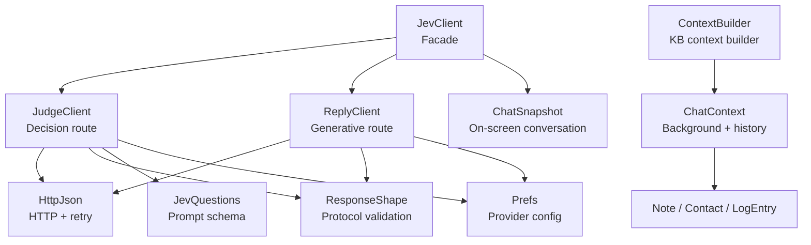

**Diagram sources**
- [JevClient.kt:14-43](file://app/src/main/java/com/jev/probe/jev/JevClient.kt#L14-L43)
- [JudgeClient.kt:19-143](file://app/src/main/java/com/jev/probe/jev/JudgeClient.kt#L19-L143)
- [ReplyClient.kt:15-94](file://app/src/main/java/com/jev/probe/jev/ReplyClient.kt#L15-L94)
- [ResponseShape.kt:25-140](file://app/src/main/java/com/jev/probe/jev/ResponseShape.kt#L25-L140)
- [HttpJson.kt:54-203](file://app/src/main/java/com/jev/probe/jev/HttpJson.kt#L54-L203)
- [JevQuestions.kt:14-224](file://app/src/main/java/com/jev/probe/jev/JevQuestions.kt#L14-L224)
- [Prefs.kt:71-303](file://app/src/main/java/com/jev/probe/core/Prefs.kt#L71-L303)
- [ContextBuilder.kt:16-63](file://app/src/main/java/com/jev/probe/core/kb/ContextBuilder.kt#L16-L63)
- [KbModels.kt:12-85](file://app/src/main/java/com/jev/probe/core/kb/KbModels.kt#L12-L85)
- [ChatModels.kt:27-58](file://app/src/main/java/com/jev/probe/core/ChatModels.kt#L27-L58)

**Section sources**
- [JevClient.kt:14-43](file://app/src/main/java/com/jev/probe/jev/JevClient.kt#L14-L43)
- [Prefs.kt:71-303](file://app/src/main/java/com/jev/probe/core/Prefs.kt#L71-L303)

## Core Components
- **JevClient**: single entry point that owns one analysis ID and delegates to judge and reply clients. It exposes:
  - Judgment-only flow.
  - Draft-and-rank flow.
  - Full analyze flow combining judgment and ranked replies.
- **JudgeClient**: calls the decisions endpoint, parses structured answers, and ranks draft candidates.
- **ReplyClient**: calls an OpenAI-compatible `/chat/completions` endpoint to generate three candidate replies and summarize text.
- **ResponseShape**: validates provider responses, extracts assistant content, enforces the decisions protocol, and normalizes candidate lists.
- **HttpJson**: low-level HTTP client with exponential backoff, rate-limit handling, gateway error unwrapping, and normalized exceptions.
- **JevQuestions**: defines the fixed judgment question set, state construction, and ranking prompt.
- **Prefs**: central configuration for judge, reply, vision endpoints, keys, models, hosted mode, and context behavior.
- **ContextBuilder and KbModels**: build local knowledge context from contacts, notes, and recent chat history.

**Section sources**
- [JevClient.kt:14-43](file://app/src/main/java/com/jev/probe/jev/JevClient.kt#L14-L43)
- [JudgeClient.kt:19-143](file://app/src/main/java/com/jev/probe/jev/JudgeClient.kt#L19-L143)
- [ReplyClient.kt:15-94](file://app/src/main/java/com/jev/probe/jev/ReplyClient.kt#L15-L94)
- [ResponseShape.kt:25-140](file://app/src/main/java/com/jev/probe/jev/ResponseShape.kt#L25-L140)
- [HttpJson.kt:54-203](file://app/src/main/java/com/jev/probe/jev/HttpJson.kt#L54-L203)
- [JevQuestions.kt:14-224](file://app/src/main/java/com/jev/probe/jev/JevQuestions.kt#L14-L224)
- [Prefs.kt:71-303](file://app/src/main/java/com/jev/probe/core/Prefs.kt#L71-L303)
- [ContextBuilder.kt:16-63](file://app/src/main/java/com/jev/probe/core/kb/ContextBuilder.kt#L16-L63)
- [KbModels.kt:12-85](file://app/src/main/java/com/jev/probe/core/kb/KbModels.kt#L12-L85)

## Architecture Overview
The AI pipeline is a two-stage process:

1. **Judgment stage**: evaluate intent, danger level, whether to reply now, best action, tension resolution, and literal-question signal.
2. **Reply stage**: generate three candidate replies and rank them using the judgment model.

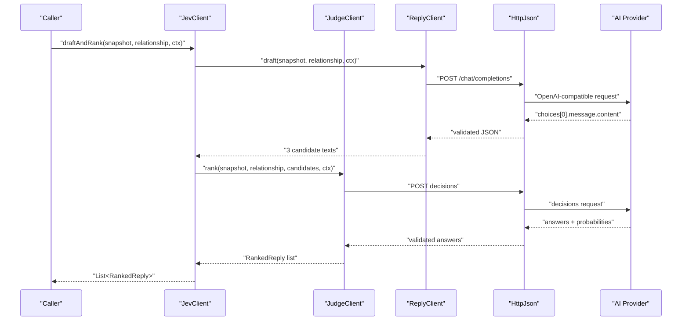

**Diagram sources**
- [JevClient.kt:27-34](file://app/src/main/java/com/jev/probe/jev/JevClient.kt#L27-L34)
- [ReplyClient.kt:28-38](file://app/src/main/java/com/jev/probe/jev/ReplyClient.kt#L28-L38)
- [JudgeClient.kt:58-68](file://app/src/main/java/com/jev/probe/jev/JudgeClient.kt#L58-L68)
- [HttpJson.kt:62-130](file://app/src/main/java/com/jev/probe/jev/HttpJson.kt#L62-L130)

## Detailed Component Analysis

### JevClient: Orchestration Facade
`JevClient` creates one analysis ID per call chain so hosted metering can group judge, draft, and rank calls. It provides:

- `judge`: returns structured analysis without replies.
- `draftAndRank`: generates three candidates then ranks them.
- `analyze`: runs judgment first; if successful, attempts draft-and-rank and attaches ranked replies.

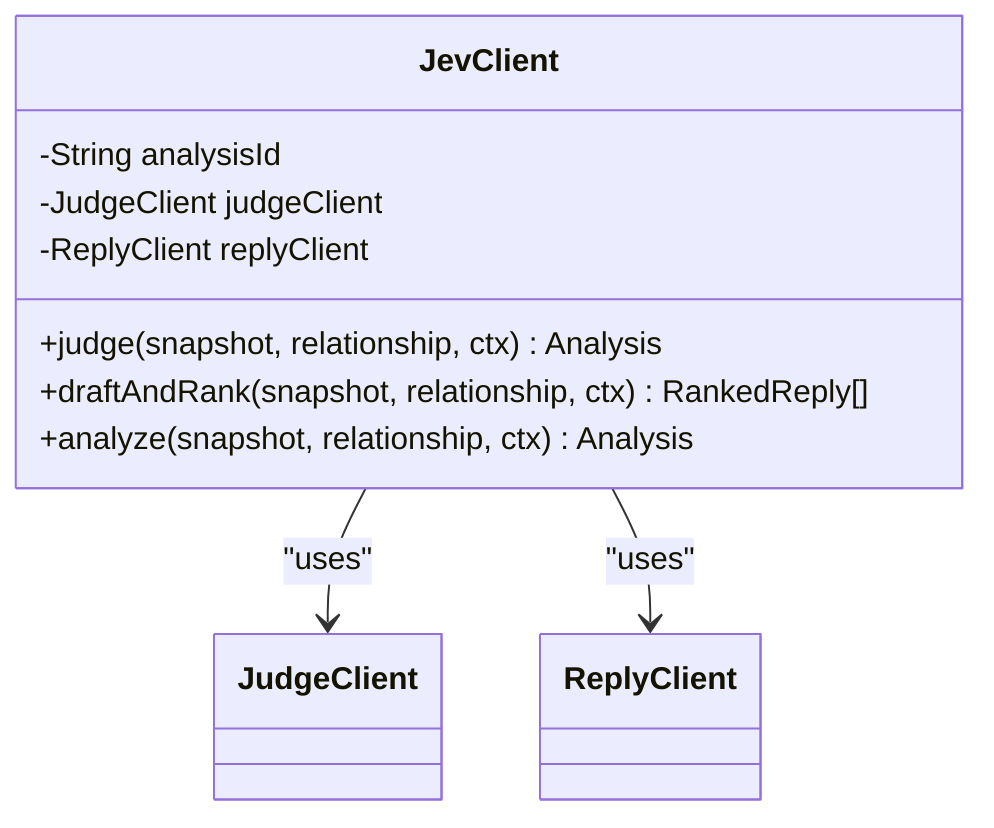

**Diagram sources**
- [JevClient.kt:14-43](file://app/src/main/java/com/jev/probe/jev/JevClient.kt#L14-L43)

**Section sources**
- [JevClient.kt:14-43](file://app/src/main/java/com/jev/probe/jev/JevClient.kt#L14-L43)

### JudgeClient: Judgment and Ranking
`JudgeClient` implements the decisions protocol:

- Builds state from `ChatSnapshot`, optional background, and optional history.
- Posts the seven judgment questions or the ranking question.
- Parses structured answers into `Choice`, `Score`, and `RankedReply`.
- Retries once without background/history when the enriched request fails with a non-gateway 4xx.

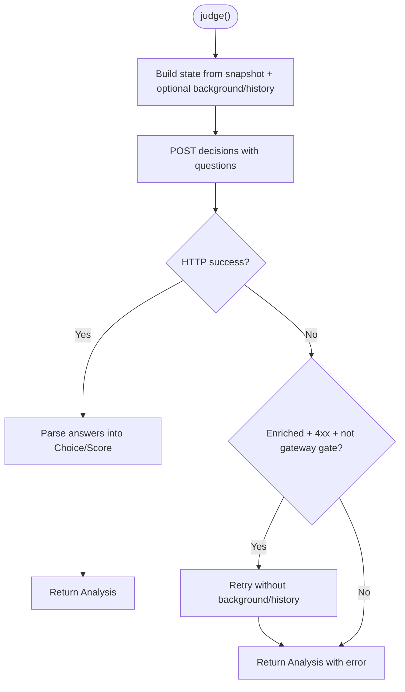

**Diagram sources**
- [JudgeClient.kt:31-55](file://app/src/main/java/com/jev/probe/jev/JudgeClient.kt#L31-L55)
- [JudgeClient.kt:79-98](file://app/src/main/java/com/jev/probe/jev/JudgeClient.kt#L79-L98)
- [JudgeClient.kt:130-137](file://app/src/main/java/com/jev/probe/jev/JudgeClient.kt#L130-L137)

**Section sources**
- [JudgeClient.kt:19-143](file://app/src/main/java/com/jev/probe/jev/JudgeClient.kt#L19-L143)

### ReplyClient: Generative Reply Drafting
`ReplyClient` targets any OpenAI-compatible `/chat/completions` endpoint:

- Constructs a system prompt asking for exactly three varied Chinese replies.
- Appends knowledge context when available.
- Uses temperature 0.8 for diversity.
- Normalizes output via `ResponseShape.threeCandidates`.

It also supports:

- Connectivity ping.
- Text summarization for D-stage auto-summary.

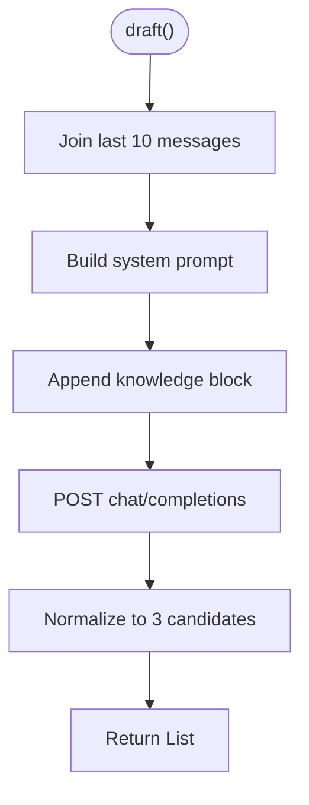

**Diagram sources**
- [ReplyClient.kt:28-38](file://app/src/main/java/com/jev/probe/jev/ReplyClient.kt#L28-L38)
- [ReplyClient.kt:41-58](file://app/src/main/java/com/jev/probe/jev/ReplyClient.kt#L41-L58)
- [ReplyClient.kt:81-93](file://app/src/main/java/com/jev/probe/jev/ReplyClient.kt#L81-L93)

**Section sources**
- [ReplyClient.kt:15-94](file://app/src/main/java/com/jev/probe/jev/ReplyClient.kt#L15-L94)

### ResponseShape: Protocol Compatibility
`ResponseShape` is the compatibility layer between heterogeneous AI providers and the app’s internal protocol:

- Validates generic 2xx bodies and rejects business errors embedded in success status codes.
- Extracts assistant content from OpenAI-compatible `choices[0].message.content`.
- Detects incompatible Anthropic Messages API responses and reports a clear error.
- Enforces the Jev decisions protocol by requiring an `answers` object.
- Parses three candidate replies from either a JSON array or numbered/bulleted lines.
- Throws `ApiException` instead of returning empty stand-ins, ensuring UI shows real failure reasons.

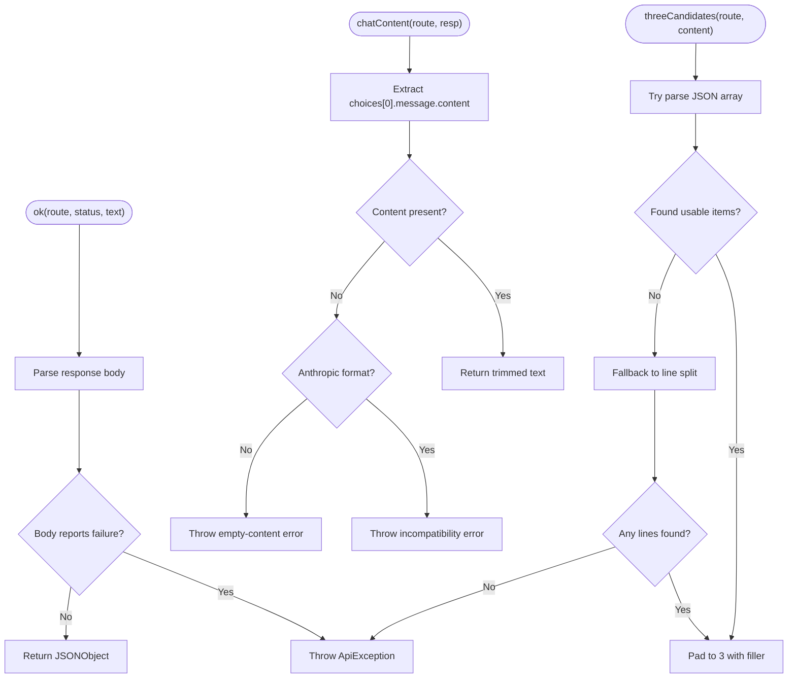

**Diagram sources**
- [ResponseShape.kt:35-43](file://app/src/main/java/com/jev/probe/jev/ResponseShape.kt#L35-L43)
- [ResponseShape.kt:50-64](file://app/src/main/java/com/jev/probe/jev/ResponseShape.kt#L50-L64)
- [ResponseShape.kt:71-75](file://app/src/main/java/com/jev/probe/jev/ResponseShape.kt#L71-L75)
- [ResponseShape.kt:84-94](file://app/src/main/java/com/jev/probe/jev/ResponseShape.kt#L84-L94)
- [ResponseShape.kt:98-140](file://app/src/main/java/com/jev/probe/jev/ResponseShape.kt#L98-L140)

**Section sources**
- [ResponseShape.kt:25-140](file://app/src/main/java/com/jev/probe/jev/ResponseShape.kt#L25-L140)

### HttpJson: Rate Limiting, Retry, and Error Handling
`HttpJson` is the transport layer:

- Sets `Authorization: Bearer <key>` and `Content-Type: application/json`.
- Adds provider-specific headers (e.g., OpenRouter attribution).
- Retries up to three times with exponential backoff for transient conditions.
- Treats 429/529 as retryable unless the gateway explicitly marks it as a hard cap.
- Unwraps hosted gateway errors while preserving third-party provider error bodies.
- Normalizes all failures into `ApiException`, including transport timeouts, DNS failures, connection refusals, and SSL issues.

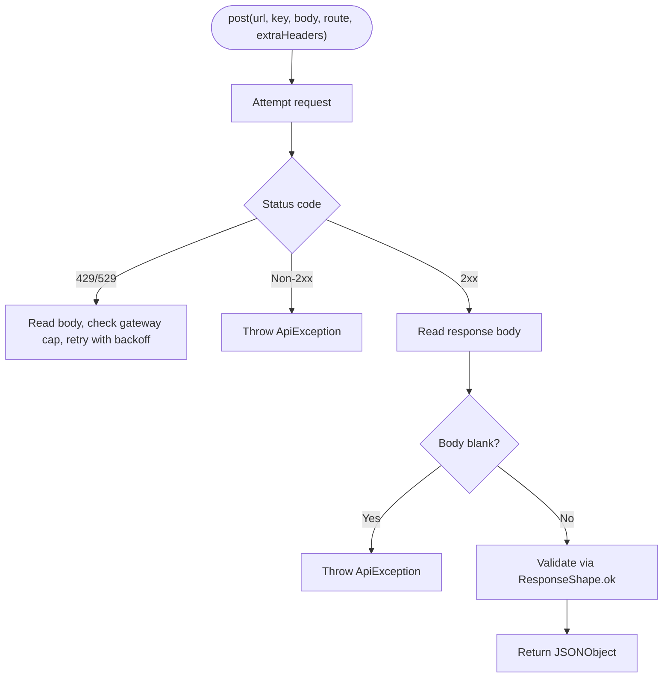

**Diagram sources**
- [HttpJson.kt:62-130](file://app/src/main/java/com/jev/probe/jev/HttpJson.kt#L62-L130)
- [HttpJson.kt:137-149](file://app/src/main/java/com/jev/probe/jev/HttpJson.kt#L137-L149)
- [HttpJson.kt:186-202](file://app/src/main/java/com/jev/probe/jev/HttpJson.kt#L186-L202)

**Section sources**
- [HttpJson.kt:54-203](file://app/src/main/java/com/jev/probe/jev/HttpJson.kt#L54-L203)

### JevQuestions: Judgment Schema and State Construction
`JevQuestions` defines:

- Seven judgment questions covering intent, danger level, timing, action type, needs, tension, and literal meaning.
- A ranking question over three candidate replies.
- State construction that includes the last ten messages, relationship, optional background, and optional history.

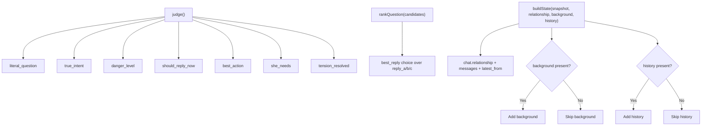

**Diagram sources**
- [JevQuestions.kt:43-167](file://app/src/main/java/com/jev/probe/jev/JevQuestions.kt#L43-L167)
- [JevQuestions.kt:180-203](file://app/src/main/java/com/jev/probe/jev/JevQuestions.kt#L180-L203)
- [JevQuestions.kt:206-223](file://app/src/main/java/com/jev/probe/jev/JevQuestions.kt#L206-L223)

**Section sources**
- [JevQuestions.kt:14-224](file://app/src/main/java/com/jev/probe/jev/JevQuestions.kt#L14-L224)

### Configuration and Provider Support
`Prefs` centralizes configuration for judge, reply, and vision routes:

- Supported judge providers: OpenRouter, TypeSafe, Vercel, OpenCode Zen, Bocha, and custom.
- Default endpoints and models are defined per provider.
- Hosted mode overrides judge and reply endpoints and credentials when active.
- Reply key falls back to judge key; vision key falls back to reply then judge key.
- Context settings control whether contact history is recorded and injected.

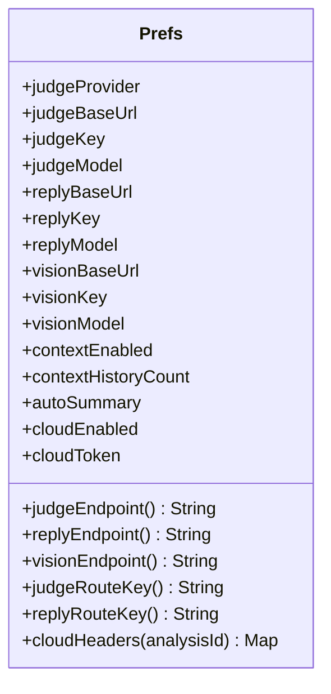

**Diagram sources**
- [Prefs.kt:71-303](file://app/src/main/java/com/jev/probe/core/Prefs.kt#L71-L303)
- [Prefs.kt:318-400](file://app/src/main/java/com/jev/probe/core/Prefs.kt#L318-L400)

**Section sources**
- [Prefs.kt:71-303](file://app/src/main/java/com/jev/probe/core/Prefs.kt#L71-L303)
- [Prefs.kt:318-400](file://app/src/main/java/com/jev/probe/core/Prefs.kt#L318-L400)

### Data Models: Analysis, Choice, Score, RankedReply
The core data structures represent judgment results and ranked replies:

- `Analysis`: holds judgment fields, ranked replies, latency, error, and paywall flag.
- `Choice`: represents a selected option with confidence and probability map.
- `Score`: represents a numeric rating with confidence and legend maximum.
- `RankedReply`: pairs candidate text with its ranking probability.

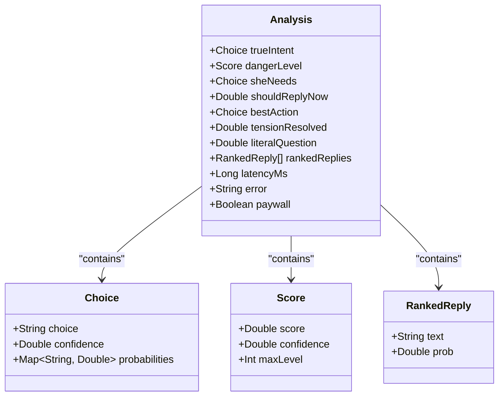

**Diagram sources**
- [ChatModels.kt:40-58](file://app/src/main/java/com/jev/probe/core/ChatModels.kt#L40-L58)

**Section sources**
- [ChatModels.kt:40-58](file://app/src/main/java/com/jev/probe/core/ChatModels.kt#L40-L58)

### Knowledge Base Integration
The knowledge base enriches both judgment and reply prompts:

- `ContextBuilder` builds `ChatContext` from contact matching, note keyword matching, and recent chat history.
- `ChatContext.background` produces a concise background string containing relationship, contact notes, auto-summary, and matched notes.
- History is de-duplicated against on-screen messages and bounded by character budget and configured count.

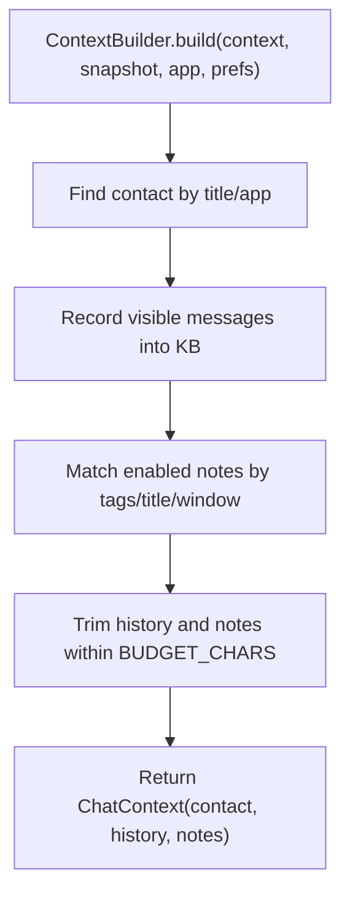

**Diagram sources**
- [ContextBuilder.kt:35-63](file://app/src/main/java/com/jev/probe/core/kb/ContextBuilder.kt#L35-L63)
- [ContextBuilder.kt:70-91](file://app/src/main/java/com/jev/probe/core/kb/ContextBuilder.kt#L70-L91)
- [ContextBuilder.kt:98-116](file://app/src/main/java/com/jev/probe/core/kb/ContextBuilder.kt#L98-L116)
- [KbModels.kt:48-85](file://app/src/main/java/com/jev/probe/core/kb/KbModels.kt#L48-L85)

**Section sources**
- [ContextBuilder.kt:16-124](file://app/src/main/java/com/jev/probe/core/kb/ContextBuilder.kt#L16-L124)
- [KbModels.kt:12-85](file://app/src/main/java/com/jev/probe/core/kb/KbModels.kt#L12-L85)

## Dependency Analysis
The AI integration layer has clear separation of concerns:

- `JevClient` depends on `JudgeClient` and `ReplyClient`.
- Both clients depend on `HttpJson` for transport and on `ResponseShape` for protocol normalization.
- `JudgeClient` uses `JevQuestions` for structured prompts and `Prefs` for endpoint/key/model configuration.
- `ReplyClient` uses `Prefs` for generative endpoint configuration.
- `ContextBuilder` and `KbModels` provide local knowledge context consumed by both clients.

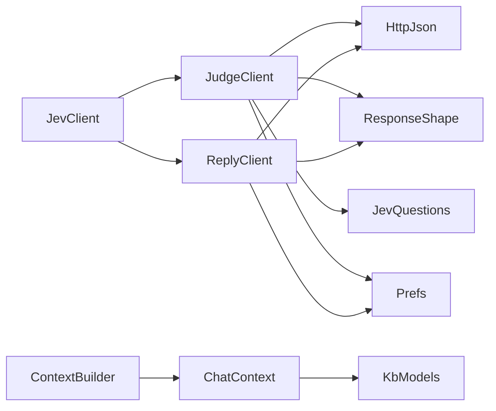

**Diagram sources**
- [JevClient.kt:14-43](file://app/src/main/java/com/jev/probe/jev/JevClient.kt#L14-L43)
- [JudgeClient.kt:19-143](file://app/src/main/java/com/jev/probe/jev/JudgeClient.kt#L19-L143)
- [ReplyClient.kt:15-94](file://app/src/main/java/com/jev/probe/jev/ReplyClient.kt#L15-L94)
- [ResponseShape.kt:25-140](file://app/src/main/java/com/jev/probe/jev/ResponseShape.kt#L25-L140)
- [HttpJson.kt:54-203](file://app/src/main/java/com/jev/probe/jev/HttpJson.kt#L54-L203)
- [JevQuestions.kt:14-224](file://app/src/main/java/com/jev/probe/jev/JevQuestions.kt#L14-L224)
- [Prefs.kt:71-303](file://app/src/main/java/com/jev/probe/core/Prefs.kt#L71-L303)
- [ContextBuilder.kt:16-63](file://app/src/main/java/com/jev/probe/core/kb/ContextBuilder.kt#L16-L63)
- [KbModels.kt:48-85](file://app/src/main/java/com/jev/probe/core/kb/KbModels.kt#L48-L85)

**Section sources**
- [JevClient.kt:14-43](file://app/src/main/java/com/jev/probe/jev/JevClient.kt#L14-L43)
- [JudgeClient.kt:19-143](file://app/src/main/java/com/jev/probe/jev/JudgeClient.kt#L19-L143)
- [ReplyClient.kt:15-94](file://app/src/main/java/com/jev/probe/jev/ReplyClient.kt#L15-L94)

## Performance Considerations
- **Judgment latency**: the judgment route is designed to be fast (~1 second), and `Analysis.latencyMs` records execution time.
- **Candidate generation**: temperature 0.8 encourages variety among the three replies.
- **Context budget**: knowledge injection is limited to a character budget and a capped number of notes and history entries to avoid oversized prompts.
- **Retry strategy**: exponential backoff avoids aggressive retries on transient network issues while limiting unnecessary round trips for permanent errors.
- **Hosted metering**: sharing one analysis ID groups judge, draft, and rank calls for efficient billing in hosted mode.

[No sources needed since this section provides general guidance]

## Troubleshooting Guide
Common issues and their handling:

- **Wrong provider endpoint**: `ResponseShape.chatContent` detects Anthropic Messages API responses and reports that only OpenAI-compatible chat completions are supported.
- **Missing answers field**: `ResponseShape.jevAnswers` throws when the decisions endpoint does not return an `answers` object.
- **No usable candidates**: `ResponseShape.threeCandidates` throws when neither JSON array nor line-split parsing yields usable replies.
- **Gateway vs provider errors**: `HttpJson.httpError` unwraps hosted gateway errors but preserves third-party provider bodies.
- **Paywall detection**: `ApiException.isPaywall` and `Analysis.paywall` indicate hosted quota or subscription issues rather than ordinary failures.
- **Network problems**: `HttpJson.describe` maps common transport errors to user-friendly messages such as timeout, DNS failure, connection refused, and SSL certificate issues.
- **Offline fallback**: there is no offline model fallback in the analyzed files; failures surface as errors with descriptive messages.

**Section sources**
- [ResponseShape.kt:50-64](file://app/src/main/java/com/jev/probe/jev/ResponseShape.kt#L50-L64)
- [ResponseShape.kt:71-75](file://app/src/main/java/com/jev/probe/jev/ResponseShape.kt#L71-L75)
- [ResponseShape.kt:84-94](file://app/src/main/java/com/jev/probe/jev/ResponseShape.kt#L84-L94)
- [HttpJson.kt:137-149](file://app/src/main/java/com/jev/probe/jev/HttpJson.kt#L137-L149)
- [HttpJson.kt:192-202](file://app/src/main/java/com/jev/probe/jev/HttpJson.kt#L192-L202)
- [ChatModels.kt:40-58](file://app/src/main/java/com/jev/probe/core/ChatModels.kt#L40-L58)

## Conclusion
The AI integration layer provides a robust, provider-agnostic pipeline for relationship-aware communication assistance. `JevClient` orchestrates a judgment-first workflow followed by contextual reply drafting and ranking. `ResponseShape` ensures protocol compatibility across heterogeneous providers, while `HttpJson` handles rate limiting, retries, and normalized errors. Configuration in `Prefs` supports multiple endpoints and authentication methods, and the local knowledge base enriches prompts with contact information, notes, and recent history. The design prioritizes clear error reporting, predictable behavior, and extensibility for additional providers through configuration rather than code changes.