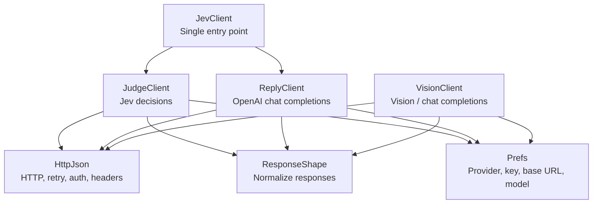
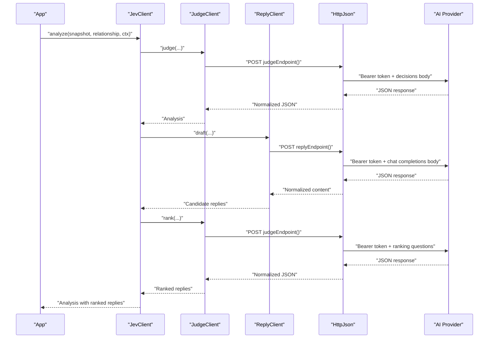
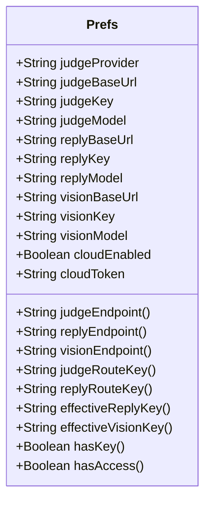
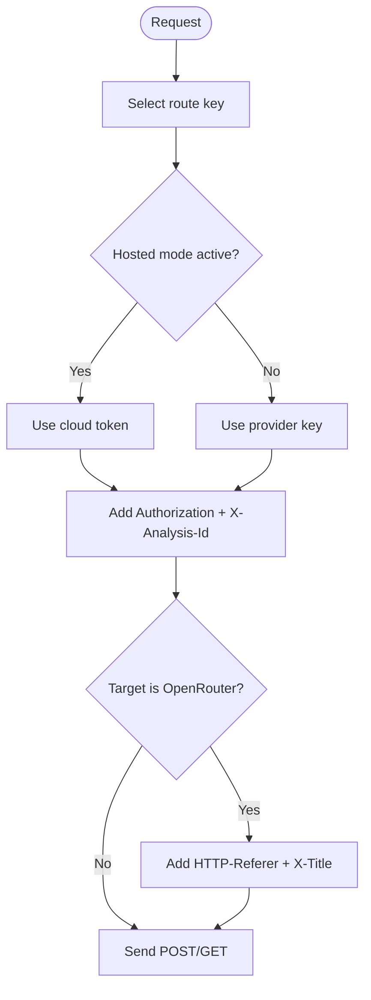
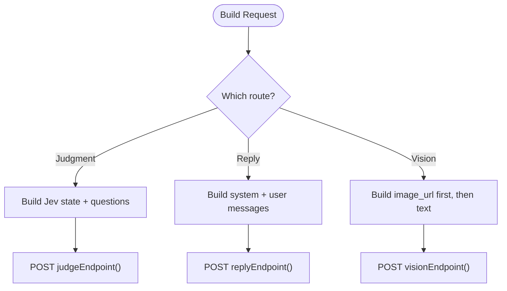
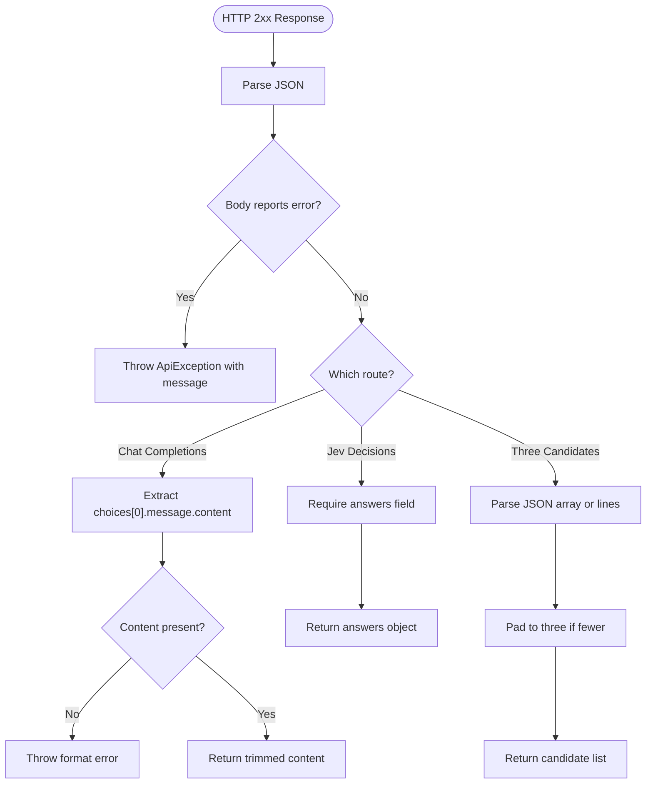
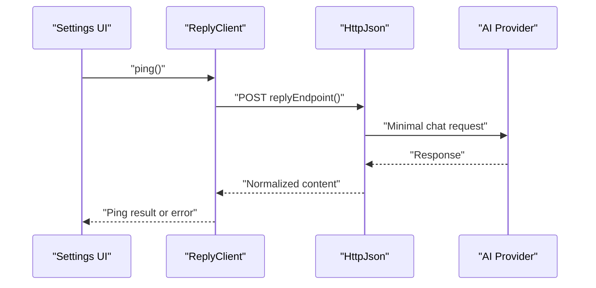
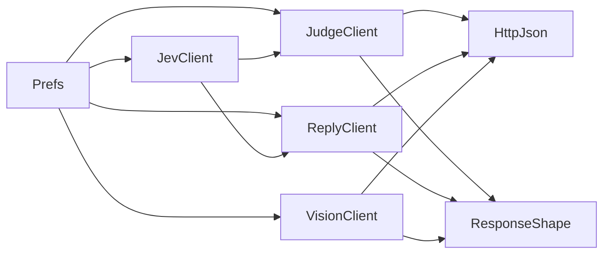
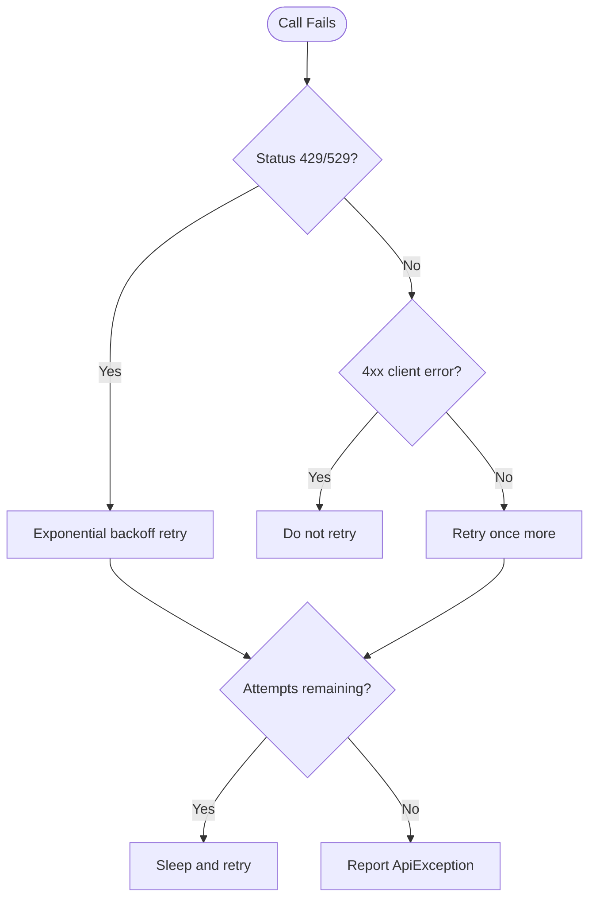

# AI Provider Integration

<cite>
**Referenced Files in This Document**
- [Prefs.kt](file://app/src/main/java/com/jev/probe/core/Prefs.kt)
- [JevClient.kt](file://app/src/main/java/com/jev/probe/jev/JevClient.kt)
- [JudgeClient.kt](file://app/src/main/java/com/jev/probe/jev/JudgeClient.kt)
- [ReplyClient.kt](file://app/src/main/java/com/jev/probe/jev/ReplyClient.kt)
- [VisionClient.kt](file://app/src/main/java/com/jev/probe/jev/VisionClient.kt)
- [HttpJson.kt](file://app/src/main/java/com/jev/probe/jev/HttpJson.kt)
- [ResponseShape.kt](file://app/src/main/java/com/jev/probe/jev/ResponseShape.kt)
- [SettingsActivity.kt](file://app/src/main/java/com/jev/probe/SettingsActivity.kt)
- [privacy.html](file://site/privacy.html)
</cite>

## Table of Contents
1. [Introduction](#introduction)
2. [Project Structure](#project-structure)
3. [Core Components](#core-components)
4. [Architecture Overview](#architecture-overview)
5. [Detailed Component Analysis](#detailed-component-analysis)
6. [Dependency Analysis](#dependency-analysis)
7. [Performance Considerations](#performance-considerations)
8. [Troubleshooting Guide](#troubleshooting-guide)
9. [Conclusion](#conclusion)

## Introduction
This document explains the multi-provider AI integration used by the application. The system supports a judgment route for relationship analysis and two OpenAI-compatible routes for generative replies and vision-based transcription. It is designed around three provider families:

- Judgment providers: OpenRouter, TypeSafe, Vercel, OpenCode Zen, Bocha, and custom endpoints.
- Reply providers: any OpenAI-compatible `/chat/completions` endpoint, with built-in presets for OpenRouter and DeepSeek.
- Vision providers: OpenAI-compatible vision endpoints that accept image content, with OpenRouter as the default and explicit handling for providers such as DashScope and DeepSeek.

The configuration system lives in `Prefs`, which stores API keys, base URLs, model names, provider selection, and optional hosted gateway behavior. Authentication is performed through an `Authorization: Bearer` header, while request bodies differ between the Jev decisions protocol and the OpenAI-compatible chat completions protocol. Responses are normalized through `ResponseShape` so that different providers can be consumed uniformly.

## Project Structure
The AI integration spans a small set of focused classes:

- `Prefs`: central configuration store for provider selection, credentials, endpoints, models, and hosted gateway mode.
- `JevClient`: single entry point that coordinates judgment, reply drafting, and ranking.
- `JudgeClient`: calls the Jev decisions endpoint to analyze intent, risk, action, and to rank candidate replies.
- `ReplyClient`: calls an OpenAI-compatible chat completions endpoint to draft candidate replies or summarize text.
- `VisionClient`: calls an OpenAI-compatible vision endpoint to transcribe screenshots into chat text.
- `HttpJson`: shared HTTP layer with timeouts, retries, rate-limit handling, error normalization, and provider-specific headers.
- `ResponseShape`: response contract validation and normalization across all routes.
- `SettingsActivity`: UI wiring for provider selection, defaults, and connectivity testing.

**Diagram sources**
- [JevClient.kt:14-43](file://app/src/main/java/com/jev/probe/jev/JevClient.kt#L14-L43)
- [JudgeClient.kt:19-112](file://app/src/main/java/com/jev/probe/jev/JudgeClient.kt#L19-L112)
- [ReplyClient.kt:15-93](file://app/src/main/java/com/jev/probe/jev/ReplyClient.kt#L15-L93)
- [VisionClient.kt:26-57](file://app/src/main/java/com/jev/probe/jev/VisionClient.kt#L26-L57)
- [HttpJson.kt:54-130](file://app/src/main/java/com/jev/probe/jev/HttpJson.kt#L54-L130)
- [ResponseShape.kt:25-94](file://app/src/main/java/com/jev/probe/jev/ResponseShape.kt#L25-L94)
- [Prefs.kt:71-131](file://app/src/main/java/com/jev/probe/core/Prefs.kt#L71-L131)

**Section sources**
- [JevClient.kt:9-43](file://app/src/main/java/com/jev/probe/jev/JevClient.kt#L9-L43)
- [Prefs.kt:6-13](file://app/src/main/java/com/jev/probe/core/Prefs.kt#L6-L13)

## Core Components
The core components form a layered architecture:

- Configuration layer: `Prefs` holds provider identity, credentials, endpoints, models, and hosted gateway state.
- Client layer: `JevClient` orchestrates calls; `JudgeClient`, `ReplyClient`, and `VisionClient` implement provider-specific request formatting.
- Transport layer: `HttpJson` handles network I/O, authentication, retries, and error classification.
- Normalization layer: `ResponseShape` validates and converts provider responses into stable internal shapes.

Key responsibilities:

| Component | Responsibility |
|---|---|
| `Prefs` | Stores and resolves judge, reply, and vision provider settings; computes final endpoints and effective keys; supports hosted gateway routing. |
| `JevClient` | Provides `judge`, `draftAndRank`, and `analyze`; shares an analysis ID for metering. |
| `JudgeClient` | Formats Jev decisions requests, parses answers, ranks candidates, and degrades gracefully when enriched context is rejected. |
| `ReplyClient` | Formats OpenAI-compatible chat requests, drafts three candidate replies, summarizes text, and pings the reply route. |
| `VisionClient` | Formats vision requests with image-first content parts, encodes JPEGs, and detects unsupported vision providers. |
| `HttpJson` | Sends POST/GET requests, applies bearer tokens, adds provider-specific headers, retries on transient errors, and normalizes errors. |
| `ResponseShape` | Validates JSON structure, rejects 2xx business failures, extracts chat content, and ensures usable outputs. |

**Section sources**
- [Prefs.kt:71-131](file://app/src/main/java/com/jev/probe/core/Prefs.kt#L71-L131)
- [Prefs.kt:273-316](file://app/src/main/java/com/jev/probe/core/Prefs.kt#L273-L316)
- [JevClient.kt:14-43](file://app/src/main/java/com/jev/probe/jev/JevClient.kt#L14-L43)
- [JudgeClient.kt:31-112](file://app/src/main/java/com/jev/probe/jev/JudgeClient.kt#L31-L112)
- [ReplyClient.kt:28-93](file://app/src/main/java/com/jev/probe/jev/ReplyClient.kt#L28-L93)
- [VisionClient.kt:28-57](file://app/src/main/java/com/jev/probe/jev/VisionClient.kt#L28-L57)
- [HttpJson.kt:54-130](file://app/src/main/java/com/jev/probe/jev/HttpJson.kt#L54-L130)
- [ResponseShape.kt:25-94](file://app/src/main/java/com/jev/probe/jev/ResponseShape.kt#L25-L94)

## Architecture Overview
The application uses a split-route architecture:

- Judgment route: Jev’s decision protocol, returning structured fields such as true intent, danger level, best action, and other signals.
- Reply route: OpenAI-compatible chat completions for drafting candidate replies and summarizing contact history.
- Vision route: OpenAI-compatible chat completions extended with image content for screenshot transcription.

**Diagram sources**
- [JevClient.kt:23-42](file://app/src/main/java/com/jev/probe/jev/JevClient.kt#L23-L42)
- [JudgeClient.kt:31-112](file://app/src/main/java/com/jev/probe/jev/JudgeClient.kt#L31-L112)
- [ReplyClient.kt:28-93](file://app/src/main/java/com/jev/probe/jev/ReplyClient.kt#L28-L93)
- [HttpJson.kt:62-130](file://app/src/main/java/com/jev/probe/jev/HttpJson.kt#L62-L130)

## Detailed Component Analysis

### Configuration System: Prefs
`Prefs` is the single source of truth for provider configuration. It manages:

- Judge provider selection: OpenRouter, TypeSafe, Vercel, OpenCode Zen, Bocha, and custom.
- Base URLs and paths per provider.
- API keys with fallback chains: judge key, reply key falling back to judge key, vision key falling back to reply then judge.
- Model selections per route.
- Hosted gateway mode, which overrides endpoints and credentials with a cloud token and adds metering headers.
- Readiness checks: whether a judge key exists and whether hosted mode is active.

**Diagram sources**
- [Prefs.kt:71-131](file://app/src/main/java/com/jev/probe/core/Prefs.kt#L71-L131)
- [Prefs.kt:260-316](file://app/src/main/java/com/jev/probe/core/Prefs.kt#L260-L316)

#### Provider Endpoints and Models
The supported judgment providers share the same Jev decisions protocol but may use different base URLs and model identifiers:

| Provider | Judgment Path | Default Base URL | Default Model | Notes |
|---|---|---|---|---|
| OpenRouter | `/alpha/decisions` | `https://openrouter.ai/api` | `typesafe/jev-1.13` | Default judgment provider. |
| TypeSafe | `/v1/systemone` | `https://api.typesafe.ai` | `jev-latest` | TypeSafe-compatible gateway. |
| Vercel | `/v1/systemone` | `https://ai-gateway.vercel.sh/typesafe` | `typesafe-ai/jev` | TypeSafe-compatible gateway via Vercel. |
| OpenCode Zen | `/v1/systemone` | `https://opencode.ai/zen` | `jev-1.13` | TypeSafe-compatible gateway; pricing notes exist in comments. |
| Bocha | `/v1/systemone` | `https://jev.bocha.cn` | `bocha-jev-v1` | Limited-time free option. |
| Custom | Full user-supplied URL | User-provided | User-provided | For self-hosted or third-party compatible endpoints. |

For the reply and vision routes, the app expects OpenAI-compatible chat completions. Built-in presets include OpenRouter, DeepSeek, and DashScope-compatible bases and models.

**Section sources**
- [Prefs.kt:281-303](file://app/src/main/java/com/jev/probe/core/Prefs.kt#L281-L303)
- [Prefs.kt:368-397](file://app/src/main/java/com/jev/probe/core/Prefs.kt#L368-L397)

#### Key Fallback Chain
- Reply key falls back to judge key when blank.
- Vision key falls back to reply key, then judge key.
- In hosted mode, both judge and reply route keys become the cloud token.

**Section sources**
- [Prefs.kt:275-279](file://app/src/main/java/com/jev/probe/core/Prefs.kt#L275-L279)
- [Prefs.kt:260-264](file://app/src/main/java/com/jev/probe/core/Prefs.kt#L260-L264)

### Authentication Mechanisms
Authentication is uniform at the transport layer:

- Every request sets `Authorization: Bearer <key>`.
- Keys come from `Prefs.judgeRouteKey()` or `Prefs.replyRouteKey()` or `Prefs.effectiveVisionKey()`.
- Hosted mode injects `X-Analysis-Id` for metering and billing grouping.
- OpenRouter receives attribution headers only when the target URL contains its domain.

**Diagram sources**
- [HttpJson.kt:75-83](file://app/src/main/java/com/jev/probe/jev/HttpJson.kt#L75-L83)
- [HttpJson.kt:186-190](file://app/src/main/java/com/jev/probe/jev/HttpJson.kt#L186-L190)
- [Prefs.kt:260-271](file://app/src/main/java/com/jev/probe/core/Prefs.kt#L260-L271)

**Section sources**
- [HttpJson.kt:75-83](file://app/src/main/java/com/jev/probe/jev/HttpJson.kt#L75-L83)
- [HttpJson.kt:186-190](file://app/src/main/java/com/jev/probe/jev/HttpJson.kt#L186-L190)
- [Prefs.kt:260-271](file://app/src/main/java/com/jev/probe/core/Prefs.kt#L260-L271)

### Request Formatting Differences
The three routes use different request formats:

| Route | Endpoint Pattern | Body Shape | Model Field | Special Behavior |
|---|---|---|---|---|
| Judgment | `judgeEndpoint()` | `{ model, state, questions }` | `prefs.judgeModel` | Uses Jev decisions protocol; enriched context may degrade if rejected. |
| Reply | `replyEndpoint()` | `{ model, messages, temperature }` | `prefs.replyModel` | OpenAI-compatible chat completions. |
| Vision | `visionEndpoint()` | `{ model, messages, temperature }` | `prefs.visionModel` | Image content part comes before text; JPEG base64 without wrapping. |

**Diagram sources**
- [JudgeClient.kt:100-112](file://app/src/main/java/com/jev/probe/jev/JudgeClient.kt#L100-L112)
- [ReplyClient.kt:81-93](file://app/src/main/java/com/jev/probe/jev/ReplyClient.kt#L81-L93)
- [VisionClient.kt:41-57](file://app/src/main/java/com/jev/probe/jev/VisionClient.kt#L41-L57)

**Section sources**
- [JudgeClient.kt:100-112](file://app/src/main/java/com/jev/probe/jev/JudgeClient.kt#L100-L112)
- [ReplyClient.kt:81-93](file://app/src/main/java/com/jev/probe/jev/ReplyClient.kt#L81-L93)
- [VisionClient.kt:41-57](file://app/src/main/java/com/jev/probe/jev/VisionClient.kt#L41-L57)

### Response Normalization
`ResponseShape` ensures that provider differences do not leak into the UI:

- `ok` rejects 2xx responses that contain business errors.
- `chatContent` extracts assistant text from OpenAI-compatible responses and throws clear errors for incompatible formats.
- `jevAnswers` requires the Jev decisions response to contain `answers`.
- `threeCandidates` parses either a JSON array or numbered/bulleted lines and pads to three items when needed.

**Diagram sources**
- [ResponseShape.kt:35-94](file://app/src/main/java/com/jev/probe/jev/ResponseShape.kt#L35-L94)

**Section sources**
- [ResponseShape.kt:35-94](file://app/src/main/java/com/jev/probe/jev/ResponseShape.kt#L35-L94)

### Setup Instructions for Each Supported Provider

#### OpenRouter
- Judgment provider: select OpenRouter; default base URL points to OpenRouter’s API.
- Reply provider: default base URL points to OpenRouter’s `/v1`; default model uses an OpenRouter model identifier.
- Vision provider: default base URL points to OpenRouter’s `/v1`; default model uses a vision-capable model.
- Authentication: provide an OpenRouter API key; attribution headers are added automatically.

Recommended steps:
1. Obtain an OpenRouter API key.
2. Set judgment provider to OpenRouter.
3. Keep reply base URL at the default OpenRouter `/v1`.
4. Keep vision base URL at the default OpenRouter `/v1`.
5. Test connectivity using the settings page.

**Section sources**
- [Prefs.kt:368-397](file://app/src/main/java/com/jev/probe/core/Prefs.kt#L368-L397)
- [HttpJson.kt:186-190](file://app/src/main/java/com/jev/probe/jev/HttpJson.kt#L186-L190)

#### DeepSeek
- Reply provider: use DeepSeek’s OpenAI-compatible base URL and model identifier.
- Vision provider: DeepSeek’s official API does not support vision; avoid pointing the vision route at DeepSeek.
- Authentication: provide a DeepSeek API key.

Recommended steps:
1. Obtain a DeepSeek API key.
2. Set reply base URL to DeepSeek’s compatible base URL.
3. Set reply model to DeepSeek’s model identifier.
4. Do not use DeepSeek for the vision route.
5. Test connectivity using the settings page.

**Section sources**
- [Prefs.kt:386-392](file://app/src/main/java/com/jev/probe/core/Prefs.kt#L386-L392)
- [VisionClient.kt:67-70](file://app/src/main/java/com/jev/probe/jev/VisionClient.kt#L67-L70)

#### TypeSafe
- Judgment provider: select TypeSafe; default base URL points to TypeSafe’s API.
- Reply provider: can use any OpenAI-compatible endpoint, including OpenRouter or another gateway.
- Vision provider: must support vision; OpenRouter is recommended.
- Authentication: provide a TypeSafe API key for judgment; reply/vision keys fall back to judge key when blank.

Recommended steps:
1. Obtain a TypeSafe API key.
2. Set judgment provider to TypeSafe.
3. Leave reply and vision base URLs at defaults unless you have a specific OpenAI-compatible endpoint.
4. Test connectivity using the settings page.

**Section sources**
- [Prefs.kt:374-375](file://app/src/main/java/com/jev/probe/core/Prefs.kt#L374-L375)
- [Prefs.kt:281-303](file://app/src/main/java/com/jev/probe/core/Prefs.kt#L281-L303)

#### Vercel
- Judgment provider: select Vercel; default base URL points to Vercel’s TypeSafe-compatible gateway.
- Reply provider: can use any OpenAI-compatible endpoint.
- Vision provider: must support vision; OpenRouter is recommended.
- Authentication: provide a Vercel gateway key or use hosted mode.

Recommended steps:
1. Obtain a Vercel AI Gateway key.
2. Set judgment provider to Vercel.
3. Keep reply and vision base URLs at defaults unless you have a specific endpoint.
4. Test connectivity using the settings page.

**Section sources**
- [Prefs.kt:376-379](file://app/src/main/java/com/jev/probe/core/Prefs.kt#L376-L379)

#### OpenCode Zen
- Judgment provider: select Zen; default base URL points to OpenCode Zen’s TypeSafe-compatible gateway.
- Reply provider: can use any OpenAI-compatible endpoint.
- Vision provider: must support vision; OpenRouter is recommended.
- Authentication: provide an OpenCode Zen key.

Recommended steps:
1. Obtain an OpenCode Zen API key.
2. Set judgment provider to Zen.
3. Keep reply and vision base URLs at defaults unless you have a specific endpoint.
4. Test connectivity using the settings page.

**Section sources**
- [Prefs.kt:380-384](file://app/src/main/java/com/jev/probe/core/Prefs.kt#L380-L384)

#### Custom Provider
- Judgment provider: select custom; supply the full endpoint URL.
- Reply provider: supply an OpenAI-compatible base URL ending at `/v1`.
- Vision provider: supply an OpenAI-compatible vision base URL ending at `/v1`.
- Authentication: supply the appropriate API key per route.

Recommended steps:
1. Prepare your own compatible endpoints.
2. Set judgment provider to custom and enter the full judgment URL.
3. Enter reply base URL up to `/v1`; the client appends `/chat/completions`.
4. Enter vision base URL up to `/v1`; the client appends `/chat/completions`.
5. Provide API keys and test connectivity.

**Section sources**
- [Prefs.kt:281-303](file://app/src/main/java/com/jev/probe/core/Prefs.kt#L281-L303)
- [SettingsActivity.kt:167-172](file://app/src/main/java/com/jev/probe/SettingsActivity.kt#L167-L172)

### Connectivity Testing and Error Reporting
Connectivity tests exercise the actual request path:

- Reply client includes a ping method that sends a minimal chat completion request.
- Settings activity wires provider selection and default values.
- Errors are reported as `ApiException` with route labels, status codes, snippets, and paywall detection.

**Diagram sources**
- [ReplyClient.kt:65-66](file://app/src/main/java/com/jev/probe/jev/ReplyClient.kt#L65-L66)
- [HttpJson.kt:62-130](file://app/src/main/java/com/jev/probe/jev/HttpJson.kt#L62-L130)

**Section sources**
- [ReplyClient.kt:65-66](file://app/src/main/java/com/jev/probe/jev/ReplyClient.kt#L65-L66)
- [HttpJson.kt:25-47](file://app/src/main/java/com/jev/probe/jev/HttpJson.kt#L25-L47)

## Dependency Analysis
The dependency graph shows how configuration flows into clients, how clients depend on the HTTP layer, and how response normalization protects callers from provider inconsistencies.

**Diagram sources**
- [JevClient.kt:14-43](file://app/src/main/java/com/jev/probe/jev/JevClient.kt#L14-L43)
- [JudgeClient.kt:19-112](file://app/src/main/java/com/jev/probe/jev/JudgeClient.kt#L19-L112)
- [ReplyClient.kt:15-93](file://app/src/main/java/com/jev/probe/jev/ReplyClient.kt#L15-L93)
- [VisionClient.kt:26-57](file://app/src/main/java/com/jev/probe/jev/VisionClient.kt#L26-L57)
- [HttpJson.kt:54-130](file://app/src/main/java/com/jev/probe/jev/HttpJson.kt#L54-L130)
- [ResponseShape.kt:25-94](file://app/src/main/java/com/jev/probe/jev/ResponseShape.kt#L25-L94)

**Section sources**
- [JevClient.kt:14-43](file://app/src/main/java/com/jev/probe/jev/JevClient.kt#L14-L43)
- [Prefs.kt:71-131](file://app/src/main/java/com/jev/probe/core/Prefs.kt#L71-L131)

## Performance Considerations
The current implementation includes several performance-related behaviors:

- Timeouts: connect timeout is 15 seconds; read timeout is 40 seconds for POST and 20 seconds for GET.
- Retries: exponential backoff for 429 and 529 responses, plus generic exceptions, up to three attempts.
- Fast-fail for non-retryable errors: wrong endpoints, incompatible protocols, and client errors do not burn retries.
- Lightweight judgment call: the judgment route is described as fast, around one second.
- Vision payload optimization: JPEG encoding without line wrapping avoids oversized payloads and malformed data URLs.
- Context window control: D-stage context history count is configurable and coerced to safe bounds.

Optimization recommendations:

- Prefer OpenRouter for unified access when you want a single key across multiple models.
- Use DeepSeek for cost-sensitive text generation if latency and capability meet your needs.
- Avoid vision on providers that reject image content, such as DeepSeek’s official API.
- Limit injected context history to reduce token usage when auto-summary is enabled.
- Use hosted mode when available to group metering under a single analysis ID.

**Section sources**
- [HttpJson.kt:75-79](file://app/src/main/java/com/jev/probe/jev/HttpJson.kt#L75-L79)
- [HttpJson.kt:87-96](file://app/src/main/java/com/jev/probe/jev/HttpJson.kt#L87-L96)
- [HttpJson.kt:113-124](file://app/src/main/java/com/jev/probe/jev/HttpJson.kt#L113-L124)
- [JudgeClient.kt:25-29](file://app/src/main/java/com/jev/probe/jev/JudgeClient.kt#L25-L29)
- [VisionClient.kt:19-25](file://app/src/main/java/com/jev/probe/jev/VisionClient.kt#L19-L25)
- [VisionClient.kt:60-65](file://app/src/main/java/com/jev/probe/jev/VisionClient.kt#L60-L65)
- [Prefs.kt:144-147](file://app/src/main/java/com/jev/probe/core/Prefs.kt#L144-L147)

## Troubleshooting Guide

### Common Connectivity Issues
- Domain resolution failure: indicates a wrong base URL or no network.
- Connection refused: indicates an unreachable host or incorrect port/path.
- HTTPS certificate failure: indicates SSL/TLS issues.
- Timeout: indicates slow or blocked network paths.

These are surfaced through `HttpJson.describe`, which maps common exception messages to user-friendly text.

**Section sources**
- [HttpJson.kt:192-202](file://app/src/main/java/com/jev/probe/jev/HttpJson.kt#L192-L202)

### Rate Limiting and Throttling
- 429 and 529 trigger exponential backoff retries.
- If the gateway returns a hard daily cap signal, the code treats it as non-retryable and surfaces a clear error.
- Paywall detection uses HTTP 402 to guide the UI toward paid flow rather than generic failure.

**Section sources**
- [HttpJson.kt:87-96](file://app/src/main/java/com/jev/probe/jev/HttpJson.kt#L87-L96)
- [HttpJson.kt:39-40](file://app/src/main/java/com/jev/probe/jev/HttpJson.kt#L39-L40)

### Wrong Endpoint or Protocol
- Pointing the judgment route at a generic LLM endpoint produces missing `answers`.
- Pointing the reply route at Anthropic’s Messages API produces incompatible response shape.
- These cases throw non-retryable `ApiException` with explanatory messages.

**Section sources**
- [ResponseShape.kt:66-75](file://app/src/main/java/com/jev/probe/jev/ResponseShape.kt#L66-L75)
- [ResponseShape.kt:50-64](file://app/src/main/java/com/jev/probe/jev/ResponseShape.kt#L50-L64)

### Fallback Strategies When Primary Providers Fail
- Retry strategy: limited retries for transient network and server-busy conditions.
- Judgment degradation: if enriched context causes a 4xx, the client retries without background/history.
- Key fallback chain: reply key falls back to judge key; vision key falls back to reply then judge.
- Hosted mode override: when active, hosted endpoints and token replace BYOK settings without losing them.

**Diagram sources**
- [HttpJson.kt:87-96](file://app/src/main/java/com/jev/probe/jev/HttpJson.kt#L87-L96)
- [HttpJson.kt:113-124](file://app/src/main/java/com/jev/probe/jev/HttpJson.kt#L113-L124)
- [JudgeClient.kt:90-97](file://app/src/main/java/com/jev/probe/jev/JudgeClient.kt#L90-L97)

**Section sources**
- [HttpJson.kt:87-96](file://app/src/main/java/com/jev/probe/jev/HttpJson.kt#L87-L96)
- [HttpJson.kt:113-124](file://app/src/main/java/com/jev/probe/jev/HttpJson.kt#L113-L124)
- [JudgeClient.kt:90-97](file://app/src/main/java/com/jev/probe/jev/JudgeClient.kt#L90-L97)
- [Prefs.kt:275-279](file://app/src/main/java/com/jev/probe/core/Prefs.kt#L275-L279)
- [Prefs.kt:260-264](file://app/src/main/java/com/jev/probe/core/Prefs.kt#L260-L264)

### Cost Optimization Techniques
- Choose cheaper models for drafting and summarization where acceptable.
- Use OpenRouter for flexible model routing and attribution.
- Use DeepSeek for cost-sensitive text generation when latency and quality fit your workflow.
- Limit injected context history to reduce token consumption.
- Enable auto-summary to compress contact history instead of sending large raw histories repeatedly.
- Use hosted mode when available to benefit from centralized metering and billing controls.

**Section sources**
- [Prefs.kt:144-152](file://app/src/main/java/com/jev/probe/core/Prefs.kt#L144-L152)
- [Prefs.kt:386-397](file://app/src/main/java/com/jev/probe/core/Prefs.kt#L386-L397)
- [Prefs.kt:253-271](file://app/src/main/java/com/jev/probe/core/Prefs.kt#L253-L271)

### Privacy and Data Flow
API keys are sent only to the configured endpoint as a bearer token. Screenshot images are processed locally for OCR where applicable, and privacy policies of downstream providers apply independently.

**Section sources**
- [privacy.html:179-190](file://site/privacy.html#L179-L190)

## Conclusion
The AI provider integration is built around a clean separation of concerns: configuration, client orchestration, transport, and response normalization. It supports multiple judgment providers through a shared Jev decisions protocol and multiple reply/vision providers through OpenAI-compatible endpoints. The `Prefs` class centralizes provider selection, credentials, endpoints, and models, while `HttpJson` and `ResponseShape` ensure robust connectivity, rate-limit handling, and consistent error reporting.

For most users, OpenRouter provides the simplest setup because it unifies model access and attribution. DeepSeek is a strong option for cost-sensitive text generation, provided vision is not required. TypeSafe, Vercel, and OpenCode Zen offer alternative judgment gateways with compatible protocols. Custom endpoints allow self-hosted or third-party compatibility, but require careful endpoint and model configuration.

When troubleshooting, start with the settings connectivity test, verify base URLs and keys, confirm provider capabilities for vision, and review error messages produced by `ApiException`. For performance and cost, tune context history, choose appropriate models, and consider hosted mode when available.