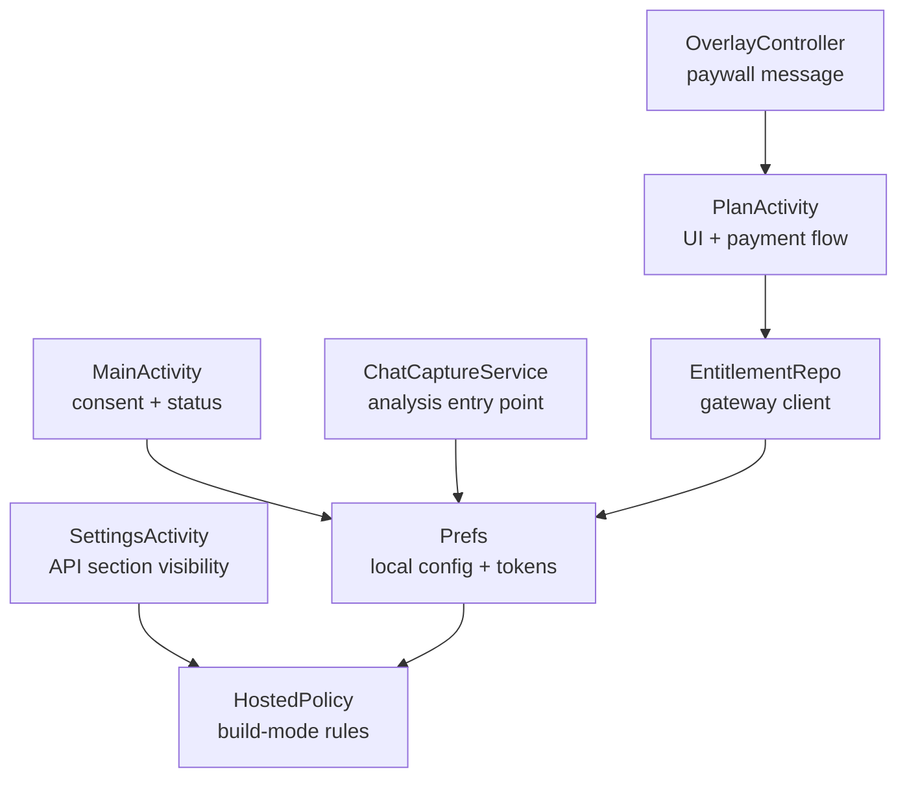
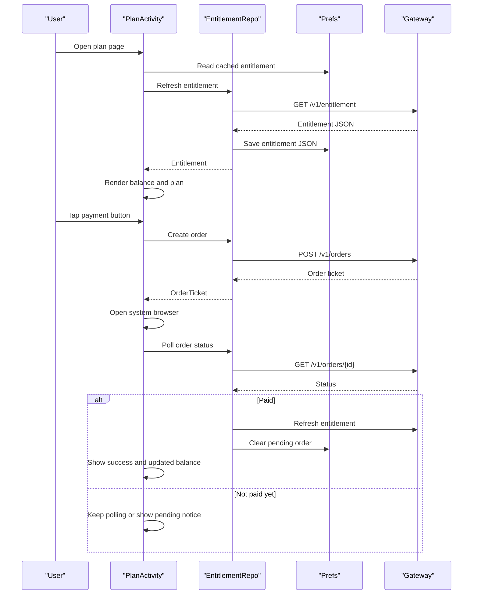
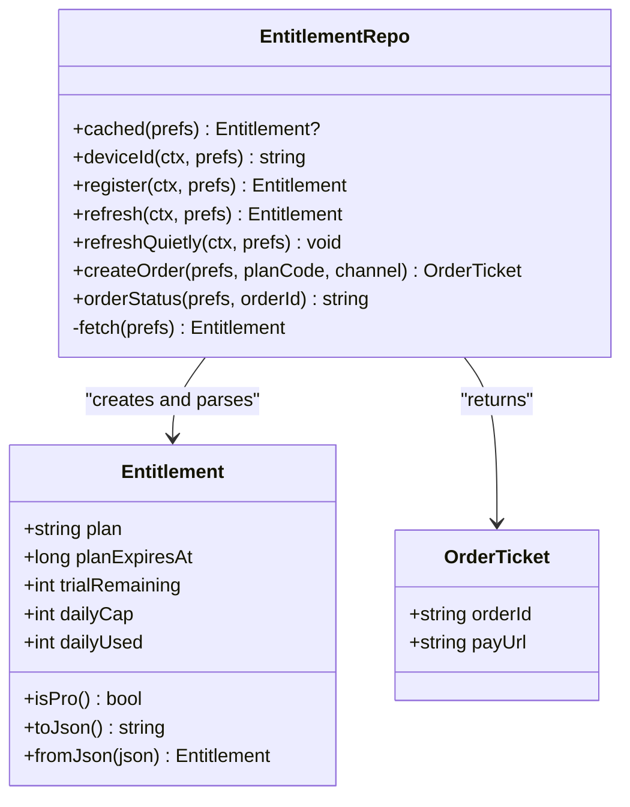
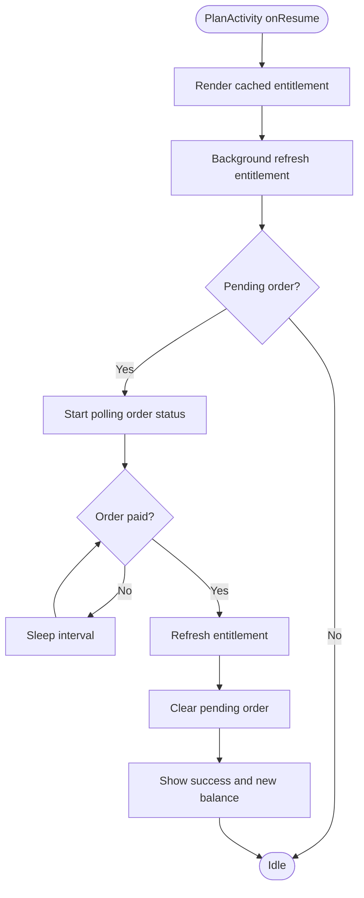
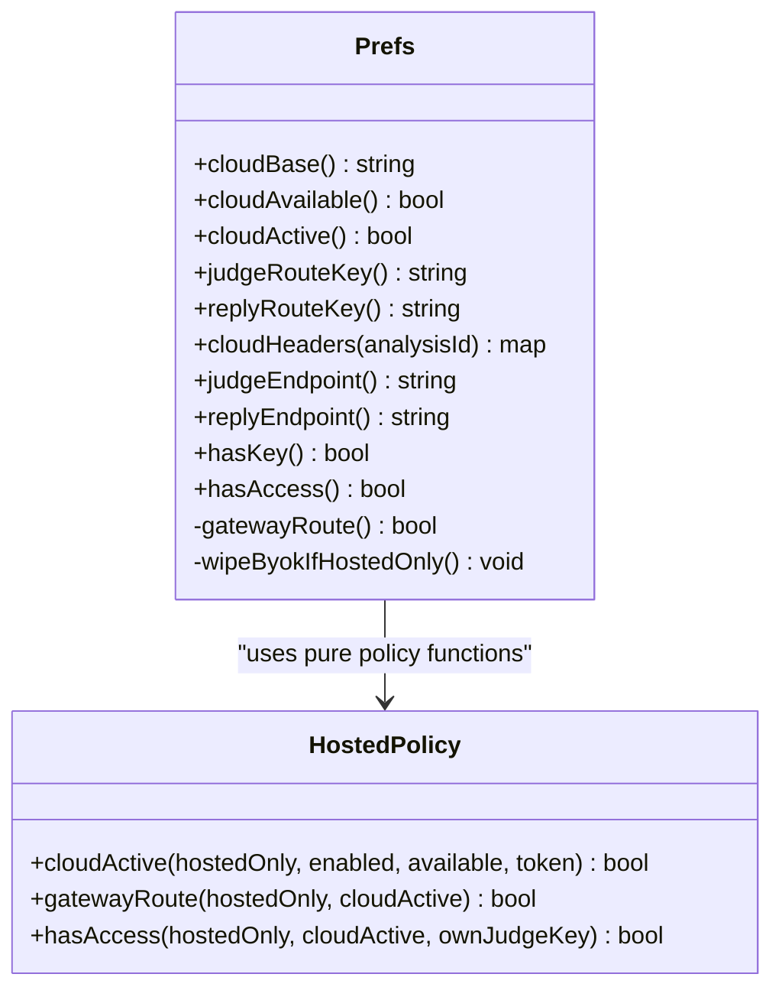
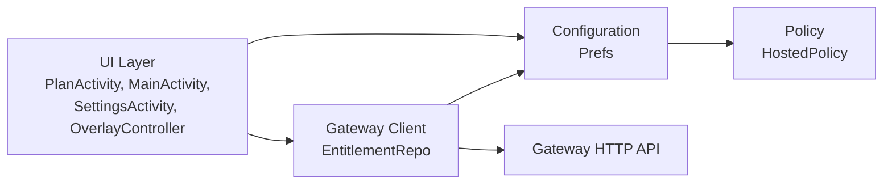

# Billing and Subscription System

<cite>
**Referenced Files in This Document**   
- [EntitlementRepo.kt](file://app/src/main/java/com/jev/probe/billing/EntitlementRepo.kt)
- [PlanActivity.kt](file://app/src/main/java/com/jev/probe/billing/PlanActivity.kt)
- [HostedPolicy.kt](file://app/src/main/java/com/jev/probe/core/HostedPolicy.kt)
- [Prefs.kt](file://app/src/main/java/com/jev/probe/core/Prefs.kt)
- [MainActivity.kt](file://app/src/main/java/com/jev/probe/MainActivity.kt)
- [SettingsActivity.kt](file://app/src/main/java/com/jev/probe/SettingsActivity.kt)
- [ChatCaptureService.kt](file://app/src/main/java/com/jev/probe/capture/ChatCaptureService.kt)
- [OverlayController.kt](file://app/src/main/java/com/jev/probe/overlay/OverlayController.kt)
- [2026-10-02-hosted-only.md](file://docs/superpowers/plans/2026-10-02-hosted-only.md)
</cite>

## Table of Contents
1. [Introduction](#introduction)
2. [Project Structure](#project-structure)
3. [Core Components](#core-components)
4. [Architecture Overview](#architecture-overview)
5. [Detailed Component Analysis](#detailed-component-analysis)
6. [Dependency Analysis](#dependency-analysis)
7. [Performance Considerations](#performance-considerations)
8. [Troubleshooting Guide](#troubleshooting-guide)
9. [Conclusion](#conclusion)

## Introduction
This document explains the billing and subscription system implemented in the Android application. The system supports two build modes:

- **Open-source build**: users can configure their own API keys; hosted mode is optional.
- **Subscription (hosted-only) build**: a gateway URL is baked into the build, the app cannot use user-provided keys, and all analysis traffic goes through the official gateway after consent and registration.

The core responsibilities are:

- Decide whether hosted mode is available and active.
- Register the device with the gateway and store a bearer token.
- Read and display entitlements such as plan type, trial credits, daily cap, and usage.
- Create payment orders for a monthly pass.
- Open the system browser to complete payment via Alipay or WeChat.
- Poll order status until the gateway confirms payment.
- Update local entitlement state and UI after successful payment.

## Project Structure
The billing and subscription logic lives primarily under `com.jev.probe.billing` and integrates with configuration and policy code under `com.jev.probe.core`. It also touches several UI and service components that gate access based on subscription state.

**Diagram sources**
- [PlanActivity.kt:25-33](file://app/src/main/java/com/jev/probe/billing/PlanActivity.kt#L25-L33)
- [EntitlementRepo.kt:13-49](file://app/src/main/java/com/jev/probe/billing/EntitlementRepo.kt#L13-L49)
- [Prefs.kt:231-289](file://app/src/main/java/com/jev/probe/core/Prefs.kt#L231-L289)
- [HostedPolicy.kt:3-18](file://app/src/main/java/com/jev/probe/core/HostedPolicy.kt#L3-L18)
- [MainActivity.kt:103-236](file://app/src/main/java/com/jev/probe/MainActivity.kt#L103-L236)
- [SettingsActivity.kt:70-159](file://app/src/main/java/com/jev/probe/SettingsActivity.kt#L70-L159)
- [ChatCaptureService.kt:400-401](file://app/src/main/java/com/jev/probe/capture/ChatCaptureService.kt#L400-L401)
- [OverlayController.kt:377-378](file://app/src/main/java/com/jev/probe/overlay/OverlayController.kt#L377-L378)

**Section sources**
- [EntitlementRepo.kt:1-149](file://app/src/main/java/com/jev/probe/billing/EntitlementRepo.kt#L1-L149)
- [PlanActivity.kt:1-209](file://app/src/main/java/com/jev/probe/billing/PlanActivity.kt#L1-L209)
- [HostedPolicy.kt:1-19](file://app/src/main/java/com/jev/probe/core/HostedPolicy.kt#L1-L19)
- [Prefs.kt:1-421](file://app/src/main/java/com/jev/probe/core/Prefs.kt#L1-L421)

## Core Components
The billing system is built around four main parts:

| Component | Role | Key Behavior |
|---|---|---|
| `Entitlement` | Data model for server-reported subscription state | Holds plan type, expiration, trial credits, daily cap, and daily usage. |
| `EntitlementRepo` | Gateway client | Registers devices, refreshes entitlements, creates orders, checks order status, and caches JSON locally. |
| `PlanActivity` | Payment UI | Shows current balance, monthly plan description, payment buttons, pending-order notice, and polls for payment completion. |
| `HostedPolicy` | Build-mode access rules | Pure functions deciding whether hosted mode is active, whether routes go through the gateway, and whether analysis is allowed. |
| `Prefs` | Local configuration | Stores gateway base URL, token, consent, entitlement JSON, pending order ID, device fallback ID, and BYOK fields. |

**Section sources**
- [EntitlementRepo.kt:18-43](file://app/src/main/java/com/jev/probe/billing/EntitlementRepo.kt#L18-L43)
- [EntitlementRepo.kt:50-148](file://app/src/main/java/com/jev/probe/billing/EntitlementRepo.kt#L50-L148)
- [PlanActivity.kt:25-33](file://app/src/main/java/com/jev/probe/billing/PlanActivity.kt#L25-L33)
- [HostedPolicy.kt:3-18](file://app/src/main/java/com/jev/probe/core/HostedPolicy.kt#L3-L18)
- [Prefs.kt:231-289](file://app/src/main/java/com/jev/probe/core/Prefs.kt#L231-L289)

## Architecture Overview
At runtime, the billing system coordinates between UI, local preferences, and the gateway.

**Diagram sources**
- [PlanActivity.kt:69-78](file://app/src/main/java/com/jev/probe/billing/PlanActivity.kt#L69-L78)
- [PlanActivity.kt:139-155](file://app/src/main/java/com/jev/probe/billing/PlanActivity.kt#L139-L155)
- [PlanActivity.kt:161-181](file://app/src/main/java/com/jev/probe/billing/PlanActivity.kt#L161-L181)
- [EntitlementRepo.kt:95-104](file://app/src/main/java/com/jev/probe/billing/EntitlementRepo.kt#L95-L104)
- [EntitlementRepo.kt:123-137](file://app/src/main/java/com/jev/probe/billing/EntitlementRepo.kt#L123-L137)
- [EntitlementRepo.kt:139-144](file://app/src/main/java/com/jev/probe/billing/EntitlementRepo.kt#L139-L144)

## Detailed Component Analysis

### Entitlement Model and Repository
`Entitlement` represents the server’s view of the device’s subscription state. It includes:

- Plan type: pro, trial, or none.
- Subscription expiration time.
- Remaining trial credits.
- Daily fair-use cap.
- Daily usage count.

`EntitlementRepo` is the only component that talks directly to the gateway. Its responsibilities include:

- Reading and writing cached entitlement JSON.
- Generating a stable device identity using `ANDROID_ID` with a random fallback.
- Registering the device and storing the bearer token.
- Refreshing entitlements and re-registering on 401.
- Creating payment orders and validating returned payment URLs.
- Polling order status.
- Silently refreshing entitlements when background sync is allowed.

Important safety properties:

- Network calls block; callers must not invoke them from the main thread.
- The bearer token is stored in `Prefs` and never logged.
- The server is the authority for granting access; local entitlement data is for rendering and screen selection only.
- Consent is required before registering or silently refreshing.

**Diagram sources**
- [EntitlementRepo.kt:18-43](file://app/src/main/java/com/jev/probe/billing/EntitlementRepo.kt#L18-L43)
- [EntitlementRepo.kt:50-148](file://app/src/main/java/com/jev/probe/billing/EntitlementRepo.kt#L50-L148)

**Section sources**
- [EntitlementRepo.kt:13-49](file://app/src/main/java/com/jev/probe/billing/EntitlementRepo.kt#L13-L49)
- [EntitlementRepo.kt:54-148](file://app/src/main/java/com/jev/probe/billing/EntitlementRepo.kt#L54-L148)

### PlanActivity Payment Flow
`PlanActivity` is the hosted-service plan page. It shows:

- Current subscription status.
- Trial remaining or trial exhaustion.
- Daily usage when applicable.
- Monthly plan description.
- Payment buttons for Alipay, WeChat, and a debug mock channel.
- Pending order notice.
- A free alternative hint in open-source builds.

Key behaviors:

- On resume, it renders cached entitlement and starts a background refresh.
- If there is a pending order, it begins polling.
- Payment creation runs on a worker thread and opens the system browser.
- Polling stops when the activity pauses or when a newer poll generation starts.
- When the gateway reports an order as paid, it refreshes entitlements, clears the pending order, and updates the UI.

**Diagram sources**
- [PlanActivity.kt:69-78](file://app/src/main/java/com/jev/probe/billing/PlanActivity.kt#L69-L78)
- [PlanActivity.kt:139-155](file://app/src/main/java/com/jev/probe/billing/PlanActivity.kt#L139-L155)
- [PlanActivity.kt:161-181](file://app/src/main/java/com/jev/probe/billing/PlanActivity.kt#L161-L181)

**Section sources**
- [PlanActivity.kt:25-33](file://app/src/main/java/com/jev/probe/billing/PlanActivity.kt#L25-L33)
- [PlanActivity.kt:50-78](file://app/src/main/java/com/jev/probe/billing/PlanActivity.kt#L50-L78)
- [PlanActivity.kt:85-127](file://app/src/main/java/com/jev/probe/billing/PlanActivity.kt#L85-L127)
- [PlanActivity.kt:139-181](file://app/src/main/java/com/jev/probe/billing/PlanActivity.kt#L139-L181)

### Hosted Policy and Build Mode
`HostedPolicy` centralizes the rules for hosted-only builds. It ensures that:

- In hosted-only mode, the “enable hosted” switch is ignored, but a valid token is still required.
- In hosted-only mode, all endpoints and credentials route through the gateway.
- In hosted-only mode, a user-provided judge key cannot grant access.

`Prefs` uses this policy to:

- Determine whether hosted mode is available (`cloudAvailable`).
- Determine whether hosted mode is active (`cloudActive`).
- Route judge and reply endpoints through the gateway when appropriate.
- Provide gateway-specific headers for metering.
- Disable BYOK readiness in hosted-only builds.
- Wipe legacy user-provided keys on first launch of a hosted-only build.

**Diagram sources**
- [HostedPolicy.kt:3-18](file://app/src/main/java/com/jev/probe/core/HostedPolicy.kt#L3-L18)
- [Prefs.kt:71-84](file://app/src/main/java/com/jev/probe/core/Prefs.kt#L71-L84)
- [Prefs.kt:268-334](file://app/src/main/java/com/jev/probe/core/Prefs.kt#L268-L334)

**Section sources**
- [HostedPolicy.kt:1-19](file://app/src/main/java/com/jev/probe/core/HostedPolicy.kt#L1-L19)
- [Prefs.kt:71-84](file://app/src/main/java/com/jev/probe/core/Prefs.kt#L71-L84)
- [Prefs.kt:231-334](file://app/src/main/java/com/jev/probe/core/Prefs.kt#L231-L334)

### UI and Access Gating
Several non-billing components participate in the subscription experience:

| Component | Billing-related behavior |
|---|---|
| `MainActivity` | Shows hosted vs BYOK labels, hides BYOK options in hosted-only builds, changes consent messaging, and shows privacy hints for hosted mode. |
| `SettingsActivity` | Hides the API configuration section in hosted-only builds. |
| `ChatCaptureService` | Blocks analysis when access is denied and shows different guidance depending on build mode. |
| `OverlayController` | Shows a paywall with a link to the plan page and hides the BYOK hint in hosted-only builds. |

**Section sources**
- [MainActivity.kt:103-236](file://app/src/main/java/com/jev/probe/MainActivity.kt#L103-L236)
- [SettingsActivity.kt:70-159](file://app/src/main/java/com/jev/probe/SettingsActivity.kt#L70-L159)
- [ChatCaptureService.kt:400-401](file://app/src/main/java/com/jev/probe/capture/ChatCaptureService.kt#L400-L401)
- [OverlayController.kt:377-378](file://app/src/main/java/com/jev/probe/overlay/OverlayController.kt#L377-L378)

## Dependency Analysis
The billing system has clear layering:

- UI layer: `PlanActivity`, `MainActivity`, `SettingsActivity`, `OverlayController`.
- Policy layer: `HostedPolicy`.
- Configuration layer: `Prefs`.
- Gateway client layer: `EntitlementRepo`.
- External dependency: gateway HTTP endpoints.

**Diagram sources**
- [PlanActivity.kt:20-23](file://app/src/main/java/com/jev/probe/billing/PlanActivity.kt#L20-L23)
- [EntitlementRepo.kt:6-11](file://app/src/main/java/com/jev/probe/billing/EntitlementRepo.kt#L6-L11)
- [Prefs.kt:231-334](file://app/src/main/java/com/jev/probe/core/Prefs.kt#L231-L334)
- [HostedPolicy.kt:3-18](file://app/src/main/java/com/jev/probe/core/HostedPolicy.kt#L3-L18)

**Section sources**
- [EntitlementRepo.kt:1-149](file://app/src/main/java/com/jev/probe/billing/EntitlementRepo.kt#L1-L149)
- [PlanActivity.kt:1-209](file://app/src/main/java/com/jev/probe/billing/PlanActivity.kt#L1-L209)
- [Prefs.kt:1-421](file://app/src/main/java/com/jev/probe/core/Prefs.kt#L1-L421)
- [HostedPolicy.kt:1-19](file://app/src/main/java/com/jev/probe/core/HostedPolicy.kt#L1-L19)

## Performance Considerations
- Network calls in `EntitlementRepo` are blocking and should be executed off the main thread.
- `PlanActivity` performs background refresh and polling on worker threads.
- Polling is bounded by a fixed number of attempts and interval, preventing infinite loops.
- Cached entitlement JSON avoids unnecessary network requests for UI rendering.
- Background refresh is suppressed when consent is missing or when hosted mode is unavailable.
- Polling stops when the activity pauses, reducing work while the system browser handles payment.

[No sources needed since this section provides general guidance]

## Troubleshooting Guide

### No hosted gateway configured
- Symptom: Registration or refresh fails because the build has no hosted gateway.
- Cause: `cloudBase()` is empty or not HTTPS.
- Resolution: Configure the gateway URL at build time so `HOSTED_ONLY` becomes true.

**Section sources**
- [EntitlementRepo.kt:79-81](file://app/src/main/java/com/jev/probe/billing/EntitlementRepo.kt#L79-L81)
- [Prefs.kt:268-271](file://app/src/main/java/com/jev/probe/core/Prefs.kt#L268-L271)

### Missing user consent
- Symptom: Registration refuses to proceed.
- Cause: The user has not accepted hosted mode.
- Resolution: Require consent before calling register or silent refresh.

**Section sources**
- [EntitlementRepo.kt:79-81](file://app/src/main/java/com/jev/probe/billing/EntitlementRepo.kt#L79-L81)
- [EntitlementRepo.kt:107-112](file://app/src/main/java/com/jev/probe/billing/EntitlementRepo.kt#L107-L112)

### Invalid or missing payment link
- Symptom: Order creation throws an error about an invalid payment link.
- Cause: Gateway did not return a valid HTTPS payment URL.
- Resolution: Treat this as a non-retryable gateway response and inform the user.

**Section sources**
- [EntitlementRepo.kt:123-133](file://app/src/main/java/com/jev/probe/billing/EntitlementRepo.kt#L123-L133)

### Order remains pending
- Symptom: The plan page shows a pending order ID but does not activate the subscription.
- Cause: The gateway has not reported the order as paid, or the user canceled payment.
- Resolution: Keep the order ID visible for support; do not treat absence of “paid” as failure.

**Section sources**
- [PlanActivity.kt:118-122](file://app/src/main/java/com/jev/probe/billing/PlanActivity.kt#L118-L122)
- [PlanActivity.kt:157-181](file://app/src/main/java/com/jev/probe/billing/PlanActivity.kt#L157-L181)

### Analysis blocked in hosted-only build
- Symptom: Analysis cannot start and the app asks the user to enable hosted mode.
- Cause: `hasAccess()` returns false because hosted mode is not active and BYOK is disabled in hosted-only builds.
- Resolution: Complete registration and obtain a token; then refresh entitlements.

**Section sources**
- [ChatCaptureService.kt:400-401](file://app/src/main/java/com/jev/probe/capture/ChatCaptureService.kt#L400-L401)
- [Prefs.kt:330-334](file://app/src/main/java/com/jev/probe/core/Prefs.kt#L330-L334)
- [HostedPolicy.kt:15-17](file://app/src/main/java/com/jev/probe/core/HostedPolicy.kt#L15-L17)

## Conclusion
The billing and subscription system separates concerns cleanly:

- `HostedPolicy` defines immutable build-mode rules.
- `Prefs` manages local state and routing decisions.
- `EntitlementRepo` encapsulates all gateway interactions.
- `PlanActivity` orchestrates the user-facing payment workflow.
- Other UI and service components gate features based on subscription state.

The design emphasizes security and clarity: the server controls entitlements, credentials are stored locally without logging, payment happens outside the app, and hosted-only builds cannot fall back to user-provided keys.

[No sources needed since this section summarizes without analyzing specific files]