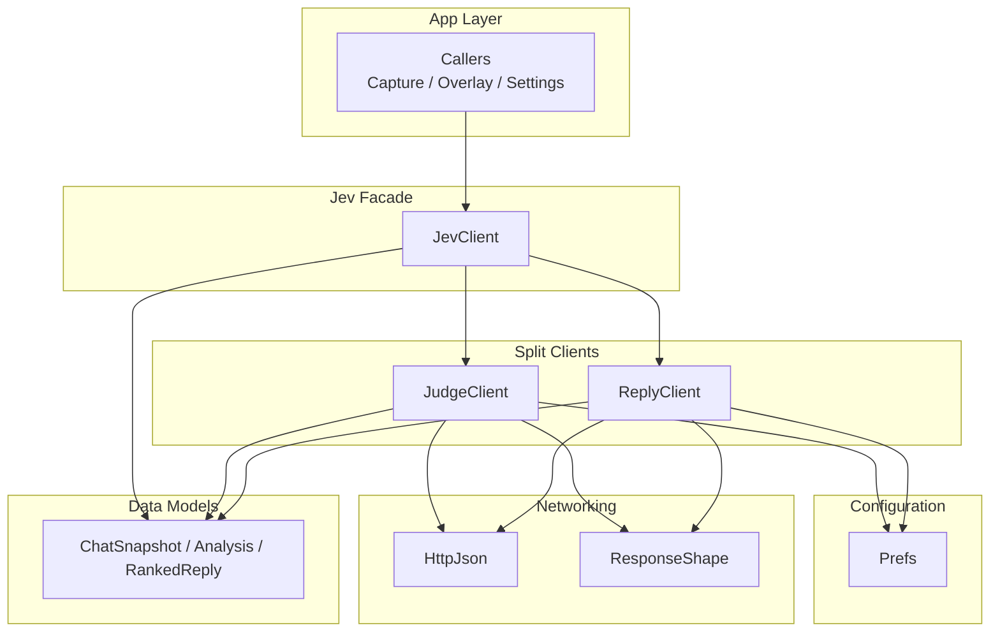
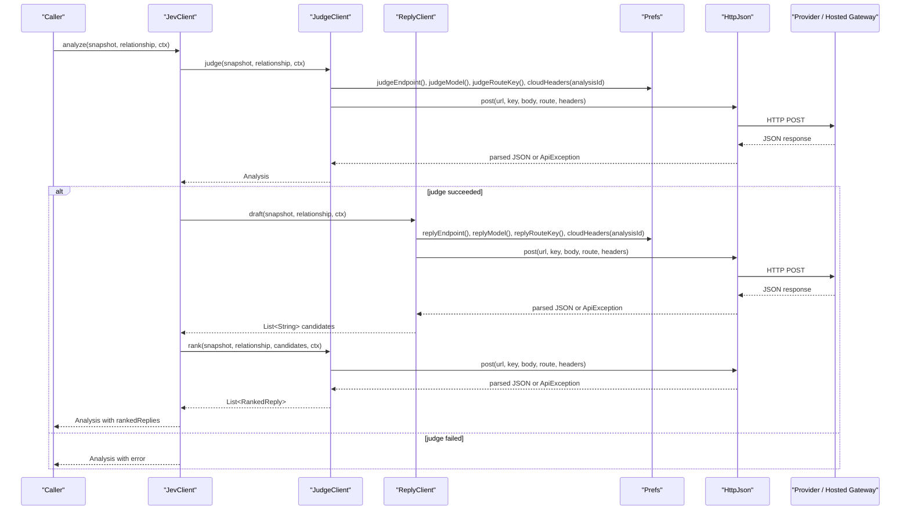
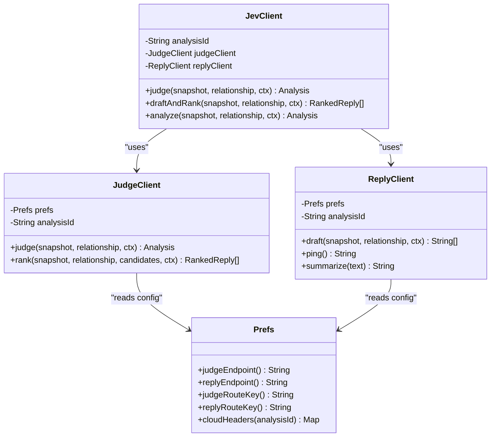
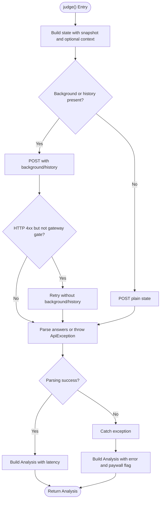
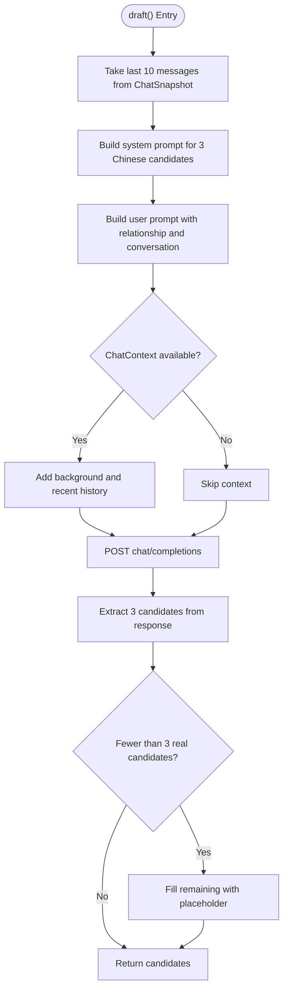
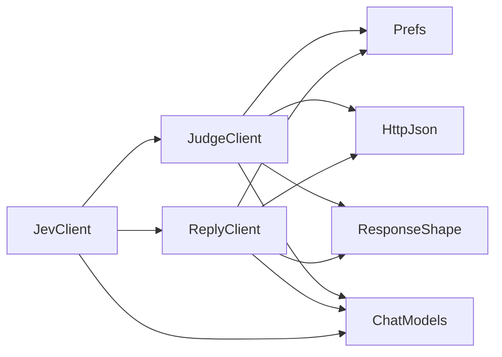

# JevClient Architecture

<cite>
**Referenced Files in This Document**
- [JevClient.kt](file://app/src/main/java/com/jev/probe/jev/JevClient.kt)
- [JudgeClient.kt](file://app/src/main/java/com/jev/probe/jev/JudgeClient.kt)
- [ReplyClient.kt](file://app/src/main/java/com/jev/probe/jev/ReplyClient.kt)
- [Prefs.kt](file://app/src/main/java/com/jev/probe/core/Prefs.kt)
- [ResponseShape.kt](file://app/src/main/java/com/jev/probe/jev/ResponseShape.kt)
- [HttpJson.kt](file://app/src/main/java/com/jev/probe/jev/HttpJson.kt)
- [ChatModels.kt](file://app/src/main/java/com/jev/probe/core/ChatModels.kt)
</cite>

## Table of Contents
1. [Introduction](#introduction)
2. [Project Structure](#project-structure)
3. [Core Components](#core-components)
4. [Architecture Overview](#architecture-overview)
5. [Detailed Component Analysis](#detailed-component-analysis)
6. [Dependency Analysis](#dependency-analysis)
7. [Performance Considerations](#performance-considerations)
8. [Troubleshooting Guide](#troubleshooting-guide)
9. [Conclusion](#conclusion)

## Introduction
JevClient is the single entry point for AI operations in this Android application. It does not implement network logic itself; instead, it acts as a thin facade over two specialized clients:
- JudgeClient: handles intent recognition and reply ranking through the Jev decisions route.
- ReplyClient: generates candidate replies through an OpenAI-compatible chat completions endpoint.

The design keeps callers simple while allowing provider switching without recreating clients. A UUID-based analysisId ties all API calls belonging to one user interaction together so that hosted billing can treat them as one unit.

## Project Structure
The Jev-related code lives under `app/src/main/java/com/jev/probe/jev`, with shared data models and configuration under `app/src/main/java/com/jev/probe/core`.

**Diagram sources**
- [JevClient.kt:9-43](file://app/src/main/java/com/jev/probe/jev/JevClient.kt#L9-L43)
- [JudgeClient.kt:14-143](file://app/src/main/java/com/jev/probe/jev/JudgeClient.kt#L14-L143)
- [ReplyClient.kt:10-94](file://app/src/main/java/com/jev/probe/jev/ReplyClient.kt#L10-L94)
- [Prefs.kt:6-317](file://app/src/main/java/com/jev/probe/core/Prefs.kt#L6-L317)
- [HttpJson.kt:10-203](file://app/src/main/java/com/jev/probe/jev/HttpJson.kt#L10-L203)
- [ResponseShape.kt:6-140](file://app/src/main/java/com/jev/probe/jev/ResponseShape.kt#L6-L140)
- [ChatModels.kt:27-58](file://app/src/main/java/com/jev/probe/core/ChatModels.kt#L27-L58)

**Section sources**
- [JevClient.kt:9-43](file://app/src/main/java/com/jev/probe/jev/JevClient.kt#L9-L43)
- [Prefs.kt:6-317](file://app/src/main/java/com/jev/probe/core/Prefs.kt#L6-L317)

## Core Components
JevClient owns three responsibilities:
- Provide one public surface for judgment, reply generation, and combined analysis.
- Generate and share a single analysisId across all calls in one analysis session.
- Delegate protocol-specific work to JudgeClient and ReplyClient while reading runtime configuration from Prefs.

Key behaviors:
- judge() returns an Analysis containing seven judgment fields plus latency. Errors are placed into Analysis.error rather than thrown.
- draftAndRank() first drafts three candidate replies, then ranks them using the judge route.
- analyze() runs judge() and then draftAndRank() sequentially, returning an Analysis that may include rankedReplies when the second stage succeeds.

**Section sources**
- [JevClient.kt:9-43](file://app/src/main/java/com/jev/probe/jev/JevClient.kt#L9-L43)
- [ChatModels.kt:40-58](file://app/src/main/java/com/jev/probe/core/ChatModels.kt#L40-L58)

## Architecture Overview
At runtime, JevClient constructs JudgeClient and ReplyClient once per instance. Both split clients receive the same analysisId, which is attached to cloud headers when hosted mode is active. Configuration such as base URLs, keys, models, and provider selection is read from Prefs on each request, so changing settings takes effect immediately without recreating JevClient.

**Diagram sources**
- [JevClient.kt:14-42](file://app/src/main/java/com/jev/probe/jev/JevClient.kt#L14-L42)
- [JudgeClient.kt:31-112](file://app/src/main/java/com/jev/probe/jev/JudgeClient.kt#L31-L112)
- [ReplyClient.kt:28-93](file://app/src/main/java/com/jev/probe/jev/ReplyClient.kt#L28-L93)
- [Prefs.kt:260-303](file://app/src/main/java/com/jev/probe/core/Prefs.kt#L260-L303)
- [HttpJson.kt:62-130](file://app/src/main/java/com/jev/probe/jev/HttpJson.kt#L62-L130)

## Detailed Component Analysis

### JevClient: Unified Facade
JevClient is intentionally small. Its constructor creates:
- One random analysisId.
- One JudgeClient bound to that analysisId.
- One ReplyClient bound to that analysisId.

This means every call made during one analysis shares the same identifier. In hosted mode, Prefs.cloudHeaders adds an X-Analysis-Id header only when the gateway is active, keeping third-party providers from seeing billing metadata.

Public methods:
- judge(): delegates to JudgeClient.judge().
- draftAndRank(): delegates to ReplyClient.draft() followed by JudgeClient.rank().
- analyze(): combines both stages sequentially and catches exceptions from the ranking stage so connectivity tests still return a usable Analysis.

**Diagram sources**
- [JevClient.kt:14-43](file://app/src/main/java/com/jev/probe/jev/JevClient.kt#L14-L43)
- [JudgeClient.kt:19-68](file://app/src/main/java/com/jev/probe/jev/JudgeClient.kt#L19-L68)
- [ReplyClient.kt:15-93](file://app/src/main/java/com/jev/probe/jev/ReplyClient.kt#L15-L93)
- [Prefs.kt:260-303](file://app/src/main/java/com/jev/probe/core/Prefs.kt#L260-L303)

**Section sources**
- [JevClient.kt:9-43](file://app/src/main/java/com/jev/probe/jev/JevClient.kt#L9-L43)

### JudgeClient: Intent Recognition and Ranking
JudgeClient implements the Jev decisions protocol:
- judge() posts seven judgment questions and parses trueIntent, dangerLevel, sheNeeds, shouldReplyNow, bestAction, tensionResolved, and literalQuestion.
- rank() posts a ranking question over already-drafted candidate replies and returns RankedReply objects sorted by probability.

Important implementation details:
- Errors from judge() are wrapped into Analysis.error rather than propagated, making it safe for UI display.
- postDecisions() tries sending background and history context first. If the server responds with a 4xx that is not a gateway gate (401, 402, 429), it retries once without the enriched context.
- send() builds the request URL, model, state, and questions from Prefs and attaches cloud headers when hosted.

**Diagram sources**
- [JudgeClient.kt:31-98](file://app/src/main/java/com/jev/probe/jev/JudgeClient.kt#L31-L98)
- [ResponseShape.kt:71-75](file://app/src/main/java/com/jev/probe/jev/ResponseShape.kt#L71-L75)
- [HttpJson.kt:62-130](file://app/src/main/java/com/jev/probe/jev/HttpJson.kt#L62-L130)

**Section sources**
- [JudgeClient.kt:14-143](file://app/src/main/java/com/jev/probe/jev/JudgeClient.kt#L14-L143)

### ReplyClient: Candidate Reply Generation
ReplyClient targets an OpenAI-compatible chat completions endpoint:
- draft() builds a system prompt asking for exactly three Chinese candidate replies, optionally prepends knowledge context, and extracts three candidates from the model output.
- ping() performs a lightweight connectivity test.
- summarize() condenses text for D-stage contact auto-summary.

Drafting behavior:
- Uses the last ten messages from ChatSnapshot.
- Adds a knowledge block when ChatContext contains background or history.
- Falls back to line-splitting if the model ignores the JSON-array instruction.

**Diagram sources**
- [ReplyClient.kt:28-93](file://app/src/main/java/com/jev/probe/jev/ReplyClient.kt#L28-L93)
- [ResponseShape.kt:84-94](file://app/src/main/java/com/jev/probe/jev/ResponseShape.kt#L84-L94)

**Section sources**
- [ReplyClient.kt:10-94](file://app/src/main/java/com/jev/probe/jev/ReplyClient.kt#L10-L94)

### Configuration via Prefs
Prefs centralizes all provider configuration:
- Provider selection: judgeProvider controls whether the judge route uses bocha, openrouter, typesafe, vercel, zen, or custom.
- Base URLs and endpoints: judgeBaseUrl, replyBaseUrl, visionBaseUrl, plus computed judgeEndpoint() and replyEndpoint().
- Keys and models: judgeKey, judgeModel, replyKey, replyModel, visionKey, visionModel.
- Hosted mode: cloudEnabled, cloudToken, cloudAvailable(), cloudActive(), judgeRouteKey(), replyRouteKey(), and cloudHeaders(analysisId).
- Migration and defaults: legacy key migration, provider seeding rules, and default values.

Provider switching works because JevClient reads Prefs on each request rather than caching endpoints or keys inside the client instances.

**Section sources**
- [Prefs.kt:6-317](file://app/src/main/java/com/jev/probe/core/Prefs.kt#L6-L317)

### Data Models
ChatSnapshot represents the captured conversation. Analysis represents the result of judgment and ranking. Choice and Score represent structured outputs from the judge route. RankedReply represents a candidate reply with its ranking probability.

These models keep the networking layer separate from the UI and business logic.

**Section sources**
- [ChatModels.kt:27-58](file://app/src/main/java/com/jev/probe/core/ChatModels.kt#L27-L58)

## Dependency Analysis
The dependency graph shows how JevClient depends on split clients, which in turn depend on configuration, networking, and response parsing.

**Diagram sources**
- [JevClient.kt:14-43](file://app/src/main/java/com/jev/probe/jev/JevClient.kt#L14-L43)
- [JudgeClient.kt:19-112](file://app/src/main/java/com/jev/probe/jev/JudgeClient.kt#L19-L112)
- [ReplyClient.kt:15-93](file://app/src/main/java/com/jev/probe/jev/ReplyClient.kt#L15-L93)
- [Prefs.kt:260-303](file://app/src/main/java/com/jev/probe/core/Prefs.kt#L260-L303)
- [HttpJson.kt:62-130](file://app/src/main/java/com/jev/probe/jev/HttpJson.kt#L62-L130)
- [ResponseShape.kt:35-94](file://app/src/main/java/com/jev/probe/jev/ResponseShape.kt#L35-L94)
- [ChatModels.kt:27-58](file://app/src/main/java/com/jev/probe/core/ChatModels.kt#L27-L58)

**Section sources**
- [JevClient.kt:14-43](file://app/src/main/java/com/jev/probe/jev/JevClient.kt#L14-L43)
- [HttpJson.kt:62-130](file://app/src/main/java/com/jev/probe/jev/HttpJson.kt#L62-L130)

## Performance Considerations
Sequential vs parallel processing:
- analyze() runs judge() first and then draftAndRank(). This guarantees that a failed judgment does not waste tokens on reply drafting.
- draftAndRank() is inherently sequential: draft() must complete before rank() can run because ranking requires candidate texts.
- The current JevClient does not parallelize draft() and rank() across multiple candidates; it sends all three candidates in one ranking request.

Latency characteristics:
- judge() measures round-trip time and stores it in Analysis.latencyMs.
- HttpJson.post applies exponential backoff for transient errors like 429 and 529, up to three attempts.
- JudgeClient.postDecisions retries once without background/history when the server rejects enriched context with a non-gateway 4xx.

Recommendations:
- Keep analyze() sequential when correctness matters more than speed.
- Avoid calling analyze() repeatedly in tight loops; batch UI updates and debounce rapid message changes.
- Use judge() alone when you only need intent recognition and want to skip generative costs.
- Use draftAndRank() when you need ranked reply suggestions.
- For connectivity testing, prefer ReplyClient.ping() or JevClient.analyze() only when you also want to exercise the full pipeline.

[No sources needed since this section provides general guidance]

## Troubleshooting Guide
Common issues and their handling:

- Wrong endpoint or incompatible protocol:
  - ResponseShape throws ApiException when the response lacks expected fields such as answers or choices[0].message.content.
  - The error includes the route name so users can distinguish judge vs reply failures.

- Empty or malformed model output:
  - threeCandidates() treats no usable candidates as an error rather than silently returning placeholders.
  - chatContent() treats empty assistant content as an error.

- Network timeouts and DNS failures:
  - HttpJson.describe() converts transport exceptions into human-readable messages such as timeout, DNS failure, connection refused, or SSL certificate failure.

- Throttling and rate limits:
  - HttpJson.post retries on 429 and 529 with exponential backoff.
  - Gateway 429 with a gateway marker is treated as non-retryable after reading the body.

- Paywall and hosted billing:
  - ApiException.isPaywall is true for HTTP 402.
  - JudgeClient wraps paywall information into Analysis.paywall so the UI can show subscription prompts instead of generic errors.

- Enriched context compatibility:
  - If the judge endpoint rejects background/history with a 4xx, JudgeClient retries without those fields.

Usage patterns:
- Connectivity test: use ReplyClient.ping() for a minimal reply-route check.
- Full pipeline test: use JevClient.analyze() to validate both judge and reply routes.
- Judgment-only flow: use JevClient.judge() when ranking is unnecessary.
- Draft-and-rank flow: use JevClient.draftAndRank() when you want ranked reply suggestions.

**Section sources**
- [ResponseShape.kt:35-94](file://app/src/main/java/com/jev/probe/jev/ResponseShape.kt#L35-L94)
- [HttpJson.kt:62-203](file://app/src/main/java/com/jev/probe/jev/HttpJson.kt#L62-L203)
- [JudgeClient.kt:31-98](file://app/src/main/java/com/jev/probe/jev/JudgeClient.kt#L31-L98)
- [ChatModels.kt:40-58](file://app/src/main/java/com/jev/probe/core/ChatModels.kt#L40-L58)

## Conclusion
JevClient provides a clean, unified interface for AI operations while delegating protocol-specific work to JudgeClient and ReplyClient. Its design supports:
- Single-entry-point usage.
- UUID-based analysisId for hosted billing and tracking.
- Runtime provider switching through Prefs without client recreation.
- Clear separation between judgment, reply generation, and combined analysis.
- Robust error handling that distinguishes configuration errors, network failures, throttling, and paywall conditions.

For most production flows, use analyze() for end-to-end validation, judge() for fast intent checks, and draftAndRank() when ranked reply suggestions are required.

[No sources needed since this section summarizes without analyzing specific files]