# Judge and Reply Pipeline

<cite>
**Referenced Files in This Document**
- [JevClient.kt](file://app/src/main/java/com/jev/probe/jev/JevClient.kt)
- [JudgeClient.kt](file://app/src/main/java/com/jev/probe/jev/JudgeClient.kt)
- [ReplyClient.kt](file://app/src/main/java/com/jev/probe/jev/ReplyClient.kt)
- [JevQuestions.kt](file://app/src/main/java/com/jev/probe/jev/JevQuestions.kt)
- [ResponseShape.kt](file://app/src/main/java/com/jev/probe/jev/ResponseShape.kt)
- [ChatModels.kt](file://app/src/main/java/com/jev/probe/core/ChatModels.kt)
- [ContextBuilder.kt](file://app/src/main/java/com/jev/probe/core/kb/ContextBuilder.kt)
- [KbStore.kt](file://app/src/main/java/com/jev/probe/core/kb/KbStore.kt)
- [ConversationSession.kt](file://app/src/main/java/com/jev/probe/capture/ConversationSession.kt)
</cite>

## Table of Contents
1. [Introduction](#introduction)
2. [Project Structure](#project-structure)
3. [Core Components](#core-components)
4. [Architecture Overview](#architecture-overview)
5. [Detailed Component Analysis](#detailed-component-analysis)
6. [Dependency Analysis](#dependency-analysis)
7. [Performance Considerations](#performance-considerations)
8. [Troubleshooting Guide](#troubleshooting-guide)
9. [Conclusion](#conclusion)

## Introduction
This document explains the two-stage AI pipeline used to turn a captured chat snapshot into actionable reply guidance. The system separates candidate generation from judgment:

- **Stage 1 (generation):** `ReplyClient` drafts three varied Chinese reply candidates based on the current conversation, relationship label, and optional knowledge-base context.
- **Stage 2 (judgment and ranking):** `JudgeClient` evaluates the conversation through seven predefined judgment questions and ranks the generated candidates against the inferred intent, risk level, and recommended action.

The pipeline is exposed through `JevClient`, which also manages shared analysis identifiers for hosted billing and provides both a pure judgment path and the full draft-and-rank workflow.

## Project Structure
The relevant code lives under the `jev` and `core` packages:

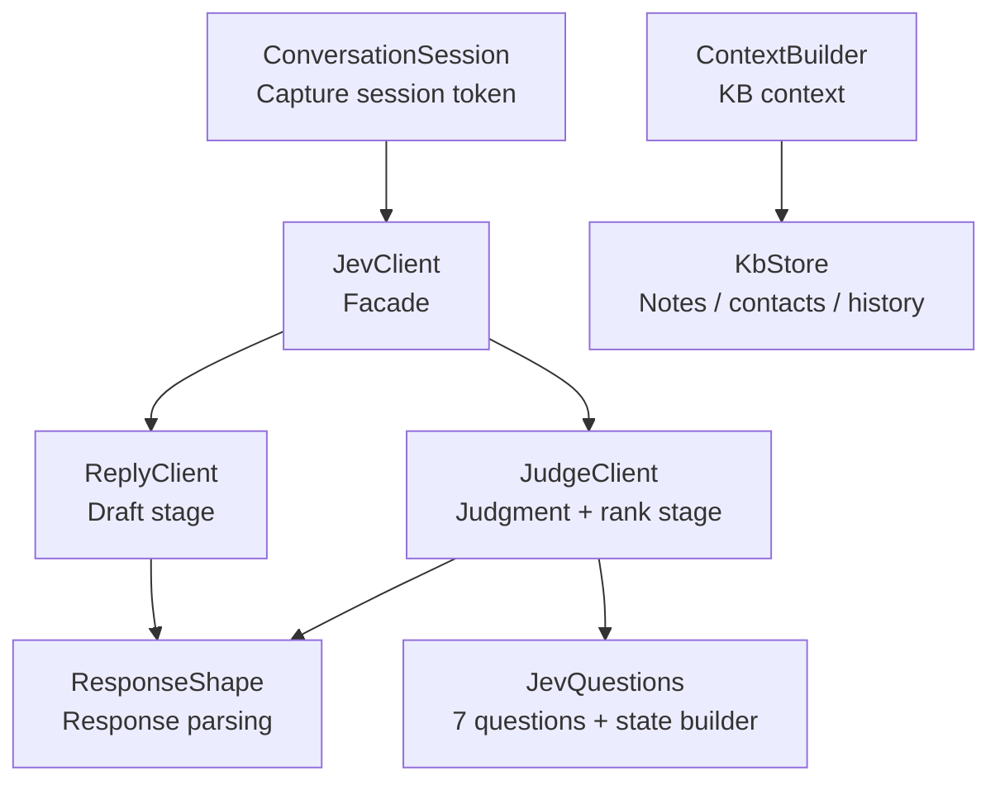

**Diagram sources**
- [JevClient.kt:14-43](file://app/src/main/java/com/jev/probe/jev/JevClient.kt#L14-L43)
- [ReplyClient.kt:15-94](file://app/src/main/java/com/jev/probe/jev/ReplyClient.kt#L15-L94)
- [JudgeClient.kt:19-143](file://app/src/main/java/com/jev/probe/jev/JudgeClient.kt#L19-L143)
- [JevQuestions.kt:14-224](file://app/src/main/java/com/jev/probe/jev/JevQuestions.kt#L14-L224)
- [ResponseShape.kt:25-140](file://app/src/main/java/com/jev/probe/jev/ResponseShape.kt#L25-L140)
- [ContextBuilder.kt:16-63](file://app/src/main/java/com/jev/probe/core/kb/ContextBuilder.kt#L16-L63)
- [KbStore.kt:24-540](file://app/src/main/java/com/jev/probe/core/kb/KbStore.kt#L24-L540)
- [ConversationSession.kt:4-35](file://app/src/main/java/com/jev/probe/capture/ConversationSession.kt#L4-L35)

**Section sources**
- [JevClient.kt:14-43](file://app/src/main/java/com/jev/probe/jev/JevClient.kt#L14-L43)
- [ReplyClient.kt:15-94](file://app/src/main/java/com/jev/probe/jev/ReplyClient.kt#L15-L94)
- [JudgeClient.kt:19-143](file://app/src/main/java/com/jev/probe/jev/JudgeClient.kt#L19-L143)

## Core Components
The pipeline has four primary responsibilities:

| Component | Responsibility | Key Inputs | Key Outputs |
|---|---|---|---|
| `JevClient` | Facade over judge and reply routes; owns one analysis ID per call chain | `ChatSnapshot`, relationship string, optional `ChatContext` | `Analysis` or ranked replies |
| `ReplyClient` | Generates exactly three candidate replies using an OpenAI-compatible chat endpoint | Snapshot messages, relationship, optional knowledge context | List of three candidate strings |
| `JudgeClient` | Sends seven judgment questions and ranks candidate replies | Snapshot, relationship, optional knowledge context | `Analysis` with judgment fields and ranked replies |
| `ContextBuilder` | Builds lightweight knowledge context from notes, contacts, and recent history | App package name, snapshot, preferences | `ChatContext` with background text and trimmed history |

**Section sources**
- [JevClient.kt:14-43](file://app/src/main/java/com/jev/probe/jev/JevClient.kt#L14-L43)
- [ReplyClient.kt:15-38](file://app/src/main/java/com/jev/probe/jev/ReplyClient.kt#L15-L38)
- [JudgeClient.kt:19-68](file://app/src/main/java/com/jev/probe/jev/JudgeClient.kt#L19-L68)
- [ContextBuilder.kt:16-63](file://app/src/main/java/com/jev/probe/core/kb/ContextBuilder.kt#L16-L63)

## Architecture Overview
At runtime, the capture layer produces a `ChatSnapshot`. The knowledge base may add relationship notes and older message history. The pipeline then chooses between:

1. **Pure judgment:** Ask whether the latest message is literal, what the other person’s true intent is, how risky it is, what they need, and what action is best.
2. **Draft and rank:** Generate three reply candidates, then ask the judge route which candidate is most appropriate.

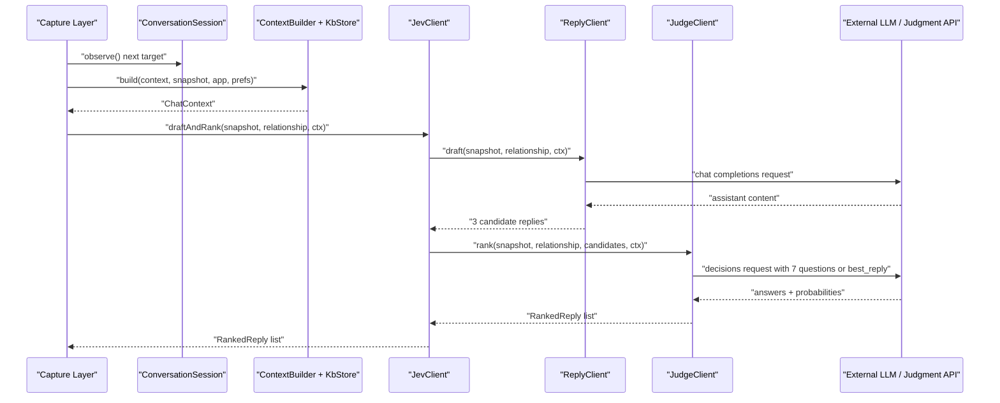

**Diagram sources**
- [ConversationSession.kt:17-34](file://app/src/main/java/com/jev/probe/capture/ConversationSession.kt#L17-L34)
- [ContextBuilder.kt:35-63](file://app/src/main/java/com/jev/probe/core/kb/ContextBuilder.kt#L35-L63)
- [JevClient.kt:27-34](file://app/src/main/java/com/jev/probe/jev/JevClient.kt#L27-L34)
- [ReplyClient.kt:28-38](file://app/src/main/java/com/jev/probe/jev/ReplyClient.kt#L28-L38)
- [JudgeClient.kt:58-68](file://app/src/main/java/com/jev/probe/jev/JudgeClient.kt#L58-L68)

## Detailed Component Analysis

### JudgeClient: Intent Recognition, Risk Assessment, and Action Recommendations
`JudgeClient` implements the non-generative judgment route. It does not generate free-form replies itself; instead, it sends structured questions to a dedicated decisions endpoint.

#### Seven Judgment Questions
The question set covers:

| Question Field | Purpose | Output Type |
|---|---|---|
| `true_intent` | Classifies the other person’s underlying intent | Choice with confidence and probabilities |
| `danger_level` | Rates how close the conversation is to conflict or rupture | Score with confidence and legend max level |
| `she_needs` | Identifies what the other person needs now | Choice such as apology, action, explanation, care, or nothing |
| `should_reply_now` | Decides whether the next message should contain substantive facts, plans, or admissions | Boolean-like decision |
| `best_action` | Recommends the type of next action without deciding timing | Choice such as check history, apologize, give commitment, explain, acknowledge, say less, make plan |
| `tension_resolved` | Indicates whether interpersonal tension has already been resolved | Boolean-like decision |
| `literal_question` | Judges whether the latest message is purely literal with no subtext | Boolean-like decision |

These questions are defined in `JevQuestions.judge()` and are sent together in one request.

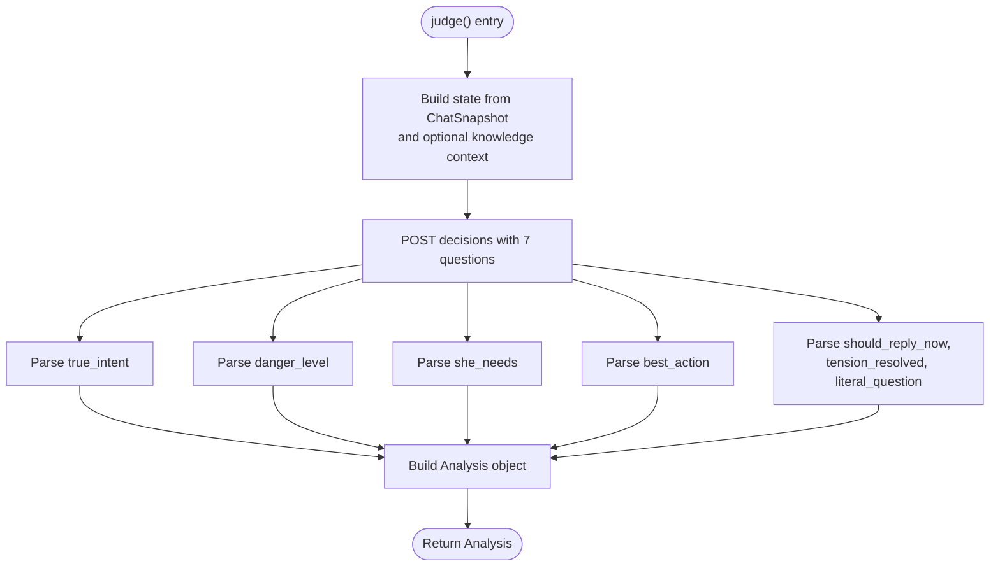

**Diagram sources**
- [JudgeClient.kt:31-55](file://app/src/main/java/com/jev/probe/jev/JudgeClient.kt#L31-L55)
- [JevQuestions.kt:43-167](file://app/src/main/java/com/jev/probe/jev/JevQuestions.kt#L43-L167)

#### Candidate Ranking
After candidates are generated, `JudgeClient.rank()` asks the same decisions endpoint to choose the best among exactly three candidates. The response probabilities are mapped back to the original candidate texts and sorted by descending probability.

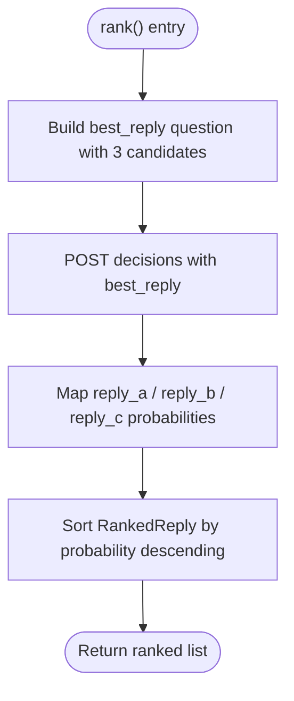

**Diagram sources**
- [JudgeClient.kt:58-68](file://app/src/main/java/com/jev/probe/jev/JudgeClient.kt#L58-L68)
- [JudgeClient.kt:130-137](file://app/src/main/java/com/jev/probe/jev/JudgeClient.kt#L130-L137)
- [JevQuestions.kt:205-223](file://app/src/main/java/com/jev/probe/jev/JevQuestions.kt#L205-L223)

#### Defensive Retry for Knowledge Context
When D-stage knowledge context is present, `JudgeClient` first sends a request including background and history. If the gateway returns a client error that is not a gateway gate (401, 402, 429), it retries once without those extra fields. This prevents an unverified body field from breaking the entire analysis while still allowing richer context when supported.

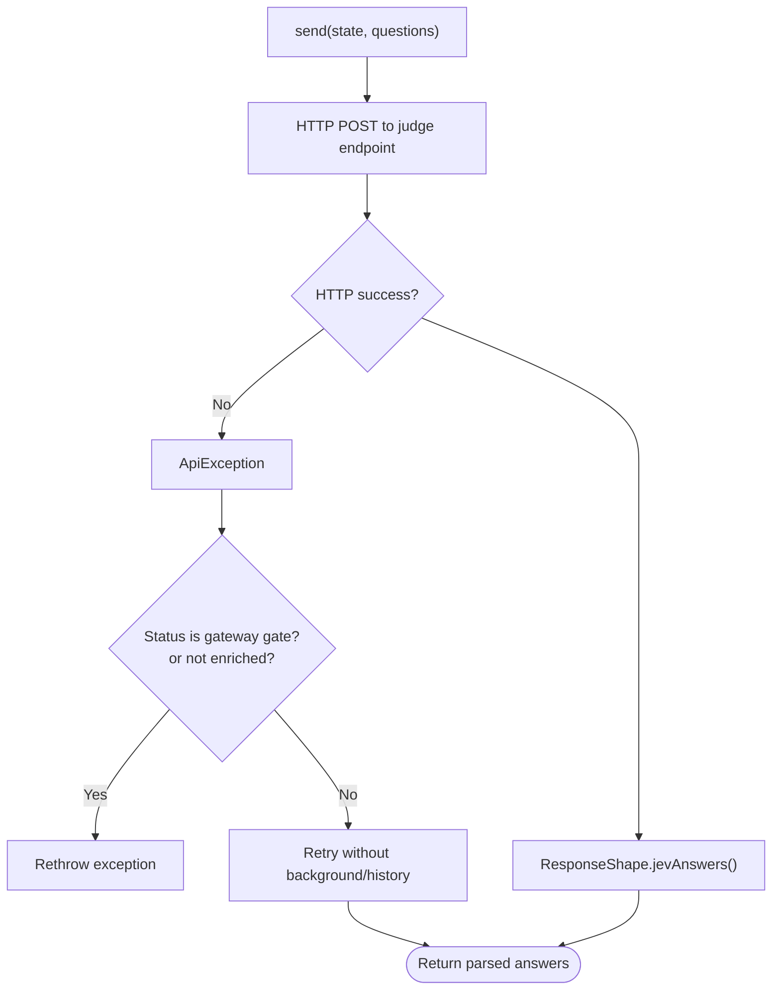

**Diagram sources**
- [JudgeClient.kt:79-98](file://app/src/main/java/com/jev/probe/jev/JudgeClient.kt#L79-L98)
- [JudgeClient.kt:100-112](file://app/src/main/java/com/jev/probe/jev/JudgeClient.kt#L100-L112)

**Section sources**
- [JudgeClient.kt:19-143](file://app/src/main/java/com/jev/probe/jev/JudgeClient.kt#L19-L143)
- [JevQuestions.kt:43-167](file://app/src/main/java/com/jev/probe/jev/JevQuestions.kt#L43-L167)
- [JevQuestions.kt:205-223](file://app/src/main/java/com/jev/probe/jev/JevQuestions.kt#L205-L223)

### ReplyClient: Contextual Candidate Generation
`ReplyClient` calls an OpenAI-compatible `/chat/completions` endpoint. Its main job is to produce three distinct Chinese reply candidates.

#### Candidate Generation Workflow
- Takes the last ten messages from the snapshot.
- Builds a system prompt instructing the model to output exactly three Chinese reply candidates with different strategies.
- Optionally prepends knowledge context so replies stay consistent with known facts and do not invent information.
- Parses the assistant content into a list of three candidates, padding with a filler if fewer than three usable candidates are returned.

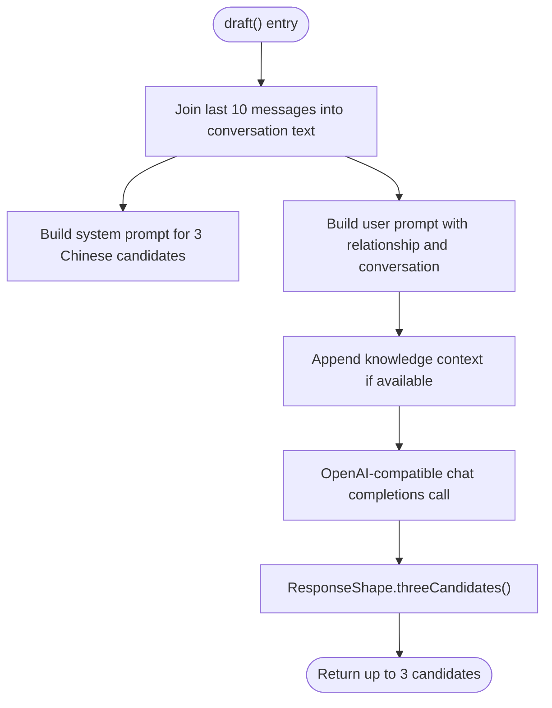

**Diagram sources**
- [ReplyClient.kt:28-38](file://app/src/main/java/com/jev/probe/jev/ReplyClient.kt#L28-L38)
- [ReplyClient.kt:40-58](file://app/src/main/java/com/jev/probe/jev/ReplyClient.kt#L40-L58)
- [ReplyClient.kt:81-93](file://app/src/main/java/com/jev/probe/jev/ReplyClient.kt#L81-L93)
- [ResponseShape.kt:84-94](file://app/src/main/java/com/jev/probe/jev/ResponseShape.kt#L84-L94)

#### Knowledge Context Integration
When `ChatContext` is provided:
- Relationship background and matched notes are included.
- Recent history is appended, limited by preference and capped at 100 entries.
- The prompt explicitly tells the model to stay consistent with the knowledge base and avoid inventing facts.

**Section sources**
- [ReplyClient.kt:15-94](file://app/src/main/java/com/jev/probe/jev/ReplyClient.kt#L15-L94)
- [ResponseShape.kt:84-94](file://app/src/main/java/com/jev/probe/jev/ResponseShape.kt#L84-L94)

### JevClient: Pipeline Facade and Two-Stage Workflow
`JevClient` is the single entry point for callers. It owns one UUID per analysis so hosted billing can group judge, draft, and rank calls.

#### Primary Workflows
| Method | Behavior |
|---|---|
| `judge()` | Runs only the seven judgment questions and returns `Analysis`. Errors are embedded in `Analysis.error`. |
| `draftAndRank()` | First generates three candidates via `ReplyClient`, then ranks them via `JudgeClient`. |
| `analyze()` | Sequential judge plus draft-and-rank; used mainly for connectivity testing. If judgment fails early, it returns immediately. If ranking throws, it returns the judgment result with an empty ranked list. |

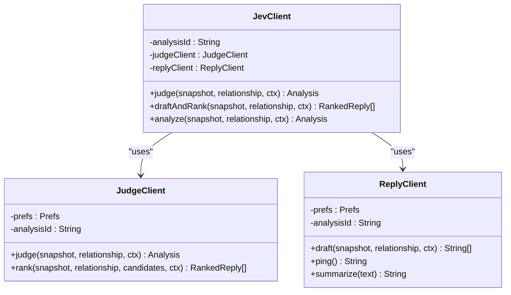

**Diagram sources**
- [JevClient.kt:14-43](file://app/src/main/java/com/jev/probe/jev/JevClient.kt#L14-L43)
- [JudgeClient.kt:19-68](file://app/src/main/java/com/jev/probe/jev/JudgeClient.kt#L19-L68)
- [ReplyClient.kt:15-38](file://app/src/main/java/com/jev/probe/jev/ReplyClient.kt#L15-L38)

**Section sources**
- [JevClient.kt:14-43](file://app/src/main/java/com/jev/probe/jev/JevClient.kt#L14-L43)

### Conversation Session Management
`ConversationSession` tracks the active chat target and invalidates stale requests when the user switches conversations or the screen changes. A new request always begins with a fresh token; old tokens are rejected.

Key behaviors:
- `observe()` updates the target and invalidates previous work.
- `begin()` creates a new token for a fresh analysis.
- `accepts(token)` ensures the token still matches the current target and revision.

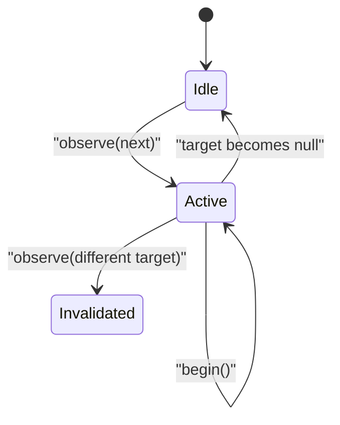

**Diagram sources**
- [ConversationSession.kt:4-35](file://app/src/main/java/com/jev/probe/capture/ConversationSession.kt#L4-L35)

**Section sources**
- [ConversationSession.kt:4-35](file://app/src/main/java/com/jev/probe/capture/ConversationSession.kt#L4-L35)

### Context Building from Knowledge Base
`ContextBuilder` turns a live chat snapshot into lightweight context for the AI models. It performs exact name matching, plain substring note matching, and hard character budget trimming.

#### Context Construction Steps
1. Find the contact by normalized title and app package.
2. Record visible messages into per-contact history if enabled.
3. Select always-on notes and keyword-matched notes.
4. Trim history first, then notes, until the total cost stays within the character budget.
5. Return `ChatContext` containing the contact, trimmed history, and matched notes.

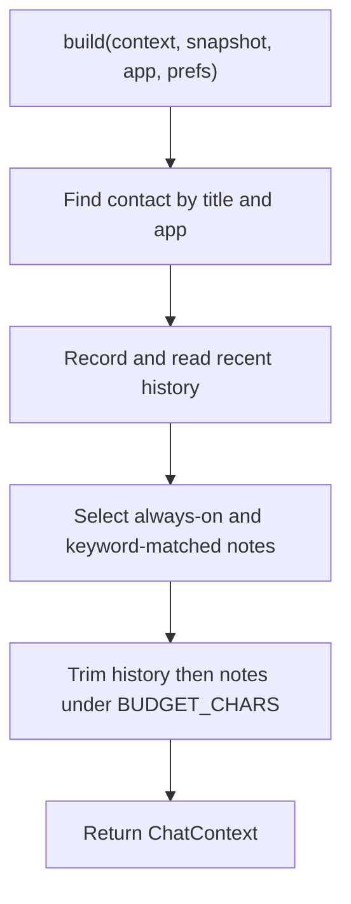

**Diagram sources**
- [ContextBuilder.kt:35-63](file://app/src/main/java/com/jev/probe/core/kb/ContextBuilder.kt#L35-L63)
- [ContextBuilder.kt:70-91](file://app/src/main/java/com/jev/probe/core/kb/ContextBuilder.kt#L70-L91)
- [ContextBuilder.kt:98-116](file://app/src/main/java/com/jev/probe/core/kb/ContextBuilder.kt#L98-L116)
- [ContextBuilder.kt:118-120](file://app/src/main/java/com/jev/probe/core/kb/ContextBuilder.kt#L118-L120)

#### Knowledge Store Details
`KbStore` persists notes, contacts, and per-contact logs under the app’s files directory. It uses atomic file writes, caches, deduplication against the current screen, and a maximum log size.

Important characteristics:
- Notes and contacts are JSON arrays stored in `kb/notes.json` and `kb/contacts.json`.
- Per-contact history is stored in `kb/logs/<contactId>.json`.
- Screen deduplication avoids recording identical visible screens repeatedly.
- Corrupt files are preserved rather than silently overwritten.

**Section sources**
- [ContextBuilder.kt:16-124](file://app/src/main/java/com/jev/probe/core/kb/ContextBuilder.kt#L16-L124)
- [KbStore.kt:12-23](file://app/src/main/java/com/jev/probe/core/kb/KbStore.kt#L12-L23)
- [KbStore.kt:149-221](file://app/src/main/java/com/jev/probe/core/kb/KbStore.kt#L149-L221)
- [KbStore.kt:401-459](file://app/src/main/java/com/jev/probe/core/kb/KbStore.kt#L401-L459)

### Data Models
The pipeline uses simple data classes to represent chat input, judgment results, and ranked outputs.

| Model | Fields | Meaning |
|---|---|---|
| `ChatSnapshot` | `title`, `messages`, `bubbleRects`, `note` | Current conversation view |
| `Msg` | `side`, `text` | One chat bubble |
| `Analysis` | `trueIntent`, `dangerLevel`, `sheNeeds`, `shouldReplyNow`, `bestAction`, `tensionResolved`, `literalQuestion`, `rankedReplies`, `latencyMs`, `error`, `paywall` | Judgment result plus ranked replies |
| `Choice` | `choice`, `confidence`, `probabilities` | Categorical judgment with probabilities |
| `Score` | `score`, `confidence`, `maxLevel` | Numeric risk or severity score |
| `RankedReply` | `text`, `prob` | Candidate reply with ranking probability |

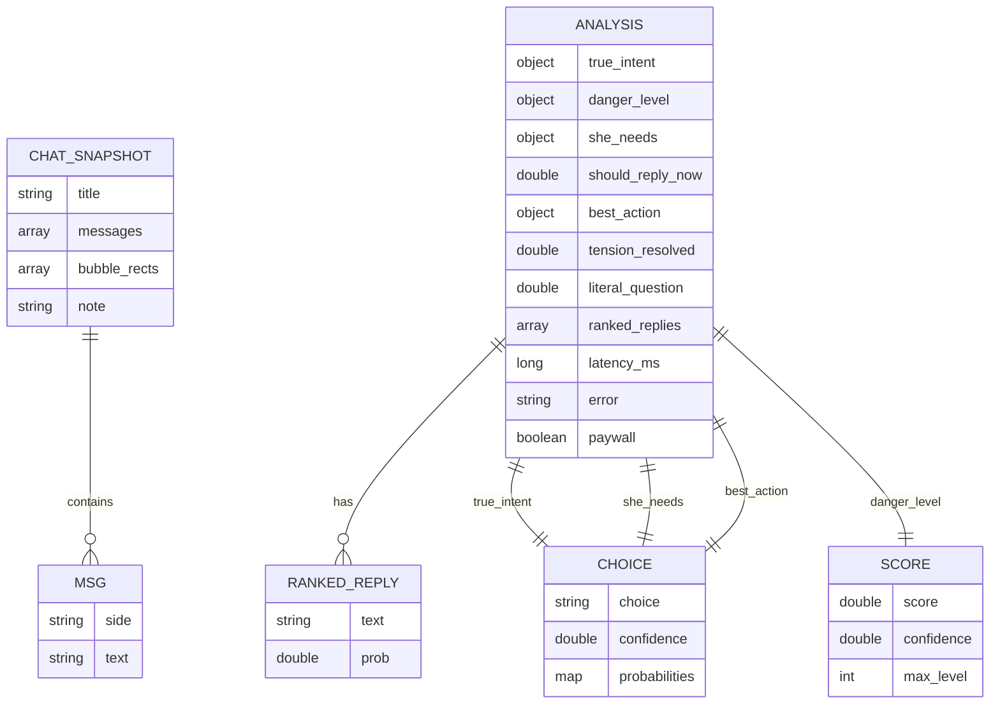

**Diagram sources**
- [ChatModels.kt:5-58](file://app/src/main/java/com/jev/probe/core/ChatModels.kt#L5-L58)

**Section sources**
- [ChatModels.kt:5-58](file://app/src/main/java/com/jev/probe/core/ChatModels.kt#L5-L58)

## Dependency Analysis
The pipeline has clear separation between generation, judgment, and persistence:

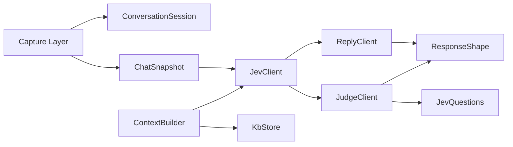

**Diagram sources**
- [ConversationSession.kt:4-35](file://app/src/main/java/com/jev/probe/capture/ConversationSession.kt#L4-L35)
- [ChatModels.kt:27-38](file://app/src/main/java/com/jev/probe/core/ChatModels.kt#L27-L38)
- [ContextBuilder.kt:16-63](file://app/src/main/java/com/jev/probe/core/kb/ContextBuilder.kt#L16-L63)
- [KbStore.kt:24-540](file://app/src/main/java/com/jev/probe/core/kb/KbStore.kt#L24-L540)
- [JevClient.kt:14-43](file://app/src/main/java/com/jev/probe/jev/JevClient.kt#L14-L43)
- [ReplyClient.kt:15-94](file://app/src/main/java/com/jev/probe/jev/ReplyClient.kt#L15-L94)
- [JudgeClient.kt:19-143](file://app/src/main/java/com/jev/probe/jev/JudgeClient.kt#L19-L143)
- [JevQuestions.kt:14-224](file://app/src/main/java/com/jev/probe/jev/JevQuestions.kt#L14-L224)
- [ResponseShape.kt:25-140](file://app/src/main/java/com/jev/probe/jev/ResponseShape.kt#L25-L140)

### Coupling and Cohesion
- `JevClient` is cohesive around orchestrating one analysis lifecycle.
- `ReplyClient` is focused on generative candidate drafting.
- `JudgeClient` is focused on structured judgment and ranking.
- `ContextBuilder` is independent of network calls and only prepares local knowledge context.
- `ResponseShape` centralizes protocol validation and error translation.

### External Dependencies
- OpenAI-compatible chat completion endpoints for candidate generation.
- Jev decisions endpoint for judgment and ranking.
- Local JSON storage for notes, contacts, and chat history.

**Section sources**
- [JevClient.kt:14-43](file://app/src/main/java/com/jev/probe/jev/JevClient.kt#L14-L43)
- [ReplyClient.kt:15-94](file://app/src/main/java/com/jev/probe/jev/ReplyClient.kt#L15-L94)
- [JudgeClient.kt:19-143](file://app/src/main/java/com/jev/probe/jev/JudgeClient.kt#L19-L143)
- [ResponseShape.kt:25-140](file://app/src/main/java/com/jev/probe/jev/ResponseShape.kt#L25-L140)

## Performance Considerations
- **Message windowing:** Both draft and judgment use the last ten messages, limiting prompt size and reducing latency.
- **Knowledge budget:** Context construction caps total characters and trims oldest history before dropping notes.
- **History cap:** Per-contact logs are bounded at 300 lines; context injection limits history to 100 entries.
- **Single analysis ID:** Shared analysis ID groups related calls for hosted billing and avoids redundant overhead.
- **Defensive retry:** JudgeClient retries once without enriched context when a client error suggests unsupported fields, avoiding repeated failures on incompatible gateways.

[No sources needed since this section provides general guidance]

## Troubleshooting Guide

### Error Propagation
Errors are handled differently depending on the stage:

| Stage | Error Handling |
|---|---|
| `JudgeClient.judge()` | Catches exceptions and returns `Analysis` with `error` and optional `paywall` flag. |
| `JudgeClient.rank()` | Throws on failure; callers must handle exceptions if they want graceful degradation. |
| `ReplyClient.draft()` | Throws when the response cannot be parsed into usable candidates. |
| `ResponseShape` | Converts malformed or business-error responses into `ApiException` with descriptive messages. |

Common error signals:
- Missing `answers` field on the judge route indicates a wrong endpoint.
- Empty assistant content on the reply route indicates a malformed chat-completion response.
- No usable candidates triggers a descriptive error rather than silently returning placeholders.

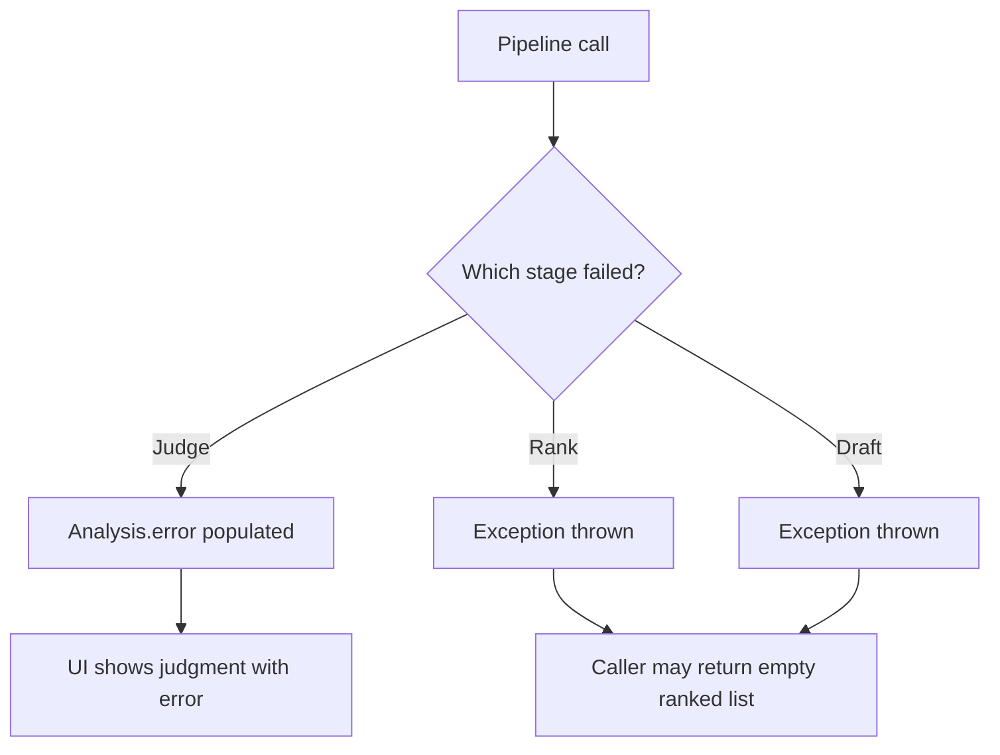

**Diagram sources**
- [JudgeClient.kt:31-55](file://app/src/main/java/com/jev/probe/jev/JudgeClient.kt#L31-L55)
- [ResponseShape.kt:35-43](file://app/src/main/java/com/jev/probe/jev/ResponseShape.kt#L35-L43)
- [ResponseShape.kt:50-64](file://app/src/main/java/com/jev/probe/jev/ResponseShape.kt#L50-L64)
- [ResponseShape.kt:71-75](file://app/src/main/java/com/jev/probe/jev/ResponseShape.kt#L71-L75)
- [ResponseShape.kt:84-94](file://app/src/main/java/com/jev/probe/jev/ResponseShape.kt#L84-L94)

### Retry Mechanisms
- **JudgeClient defensive retry:** When enriched context causes a client error that is not a gateway gate, the request is retried without background/history.
- **ResponseShape parsing:** Malformed JSON bodies are treated as parse errors so lower-level HTTP retry logic can act on truncated responses.
- **Connectivity test:** `JevClient.analyze()` catches ranking exceptions and returns an empty ranked list, allowing the judgment result to still surface during tests.

**Section sources**
- [JudgeClient.kt:79-98](file://app/src/main/java/com/jev/probe/jev/JudgeClient.kt#L79-L98)
- [ResponseShape.kt:35-43](file://app/src/main/java/com/jev/probe/jev/ResponseShape.kt#L35-L43)
- [JevClient.kt:37-42](file://app/src/main/java/com/jev/probe/jev/JevClient.kt#L37-L42)

### Timeout Handling
The analyzed source files do not define explicit timeout configuration inside the pipeline components. Timeouts are expected to be handled at the HTTP transport layer used by `HttpJson.post()`. Observers should treat network timeouts as part of the broader exception handling path and rely on the existing error propagation behavior.

[No sources needed since this section provides general guidance]

## Conclusion
The two-stage pipeline cleanly separates candidate generation from judgment:

- `ReplyClient` focuses on producing three diverse, context-aware reply candidates.
- `JudgeClient` focuses on structured interpretation of intent, risk, and action, plus ranking the generated candidates.
- `JevClient` provides a stable facade, shared analysis identity, and multiple workflows for different usage patterns.
- `ContextBuilder` and `KbStore` provide lightweight, deterministic knowledge context without embedding or network calls.
- Error handling is layered: judgment wraps failures gracefully, response parsing converts protocol mismatches into explicit errors, and defensive retries protect against unsupported context fields.

This design makes the system robust across different chat scenarios, supports incremental knowledge-base growth, and keeps the AI interaction predictable and auditable through fixed judgment questions and ranked candidate outputs.