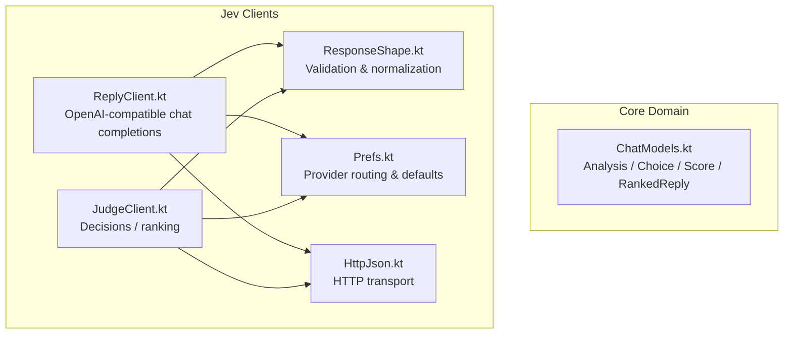
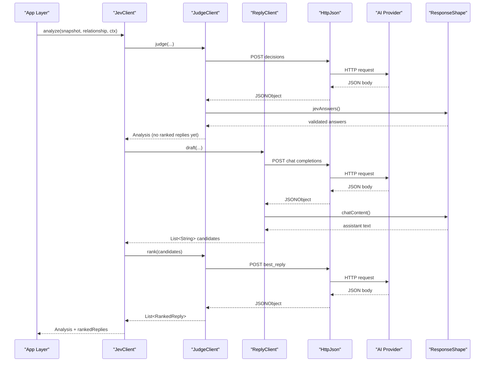
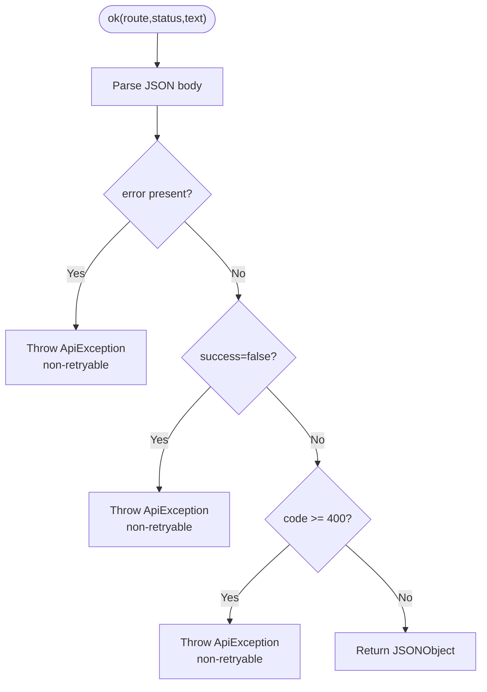
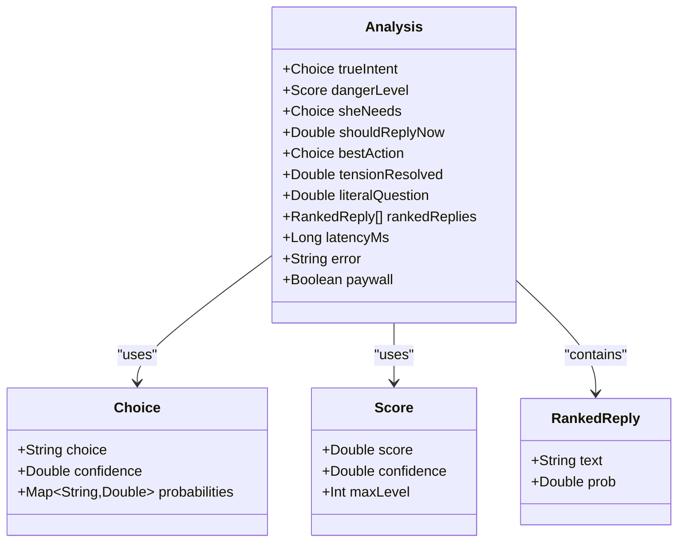
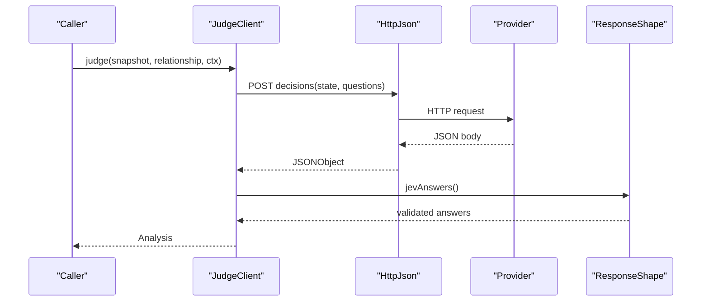
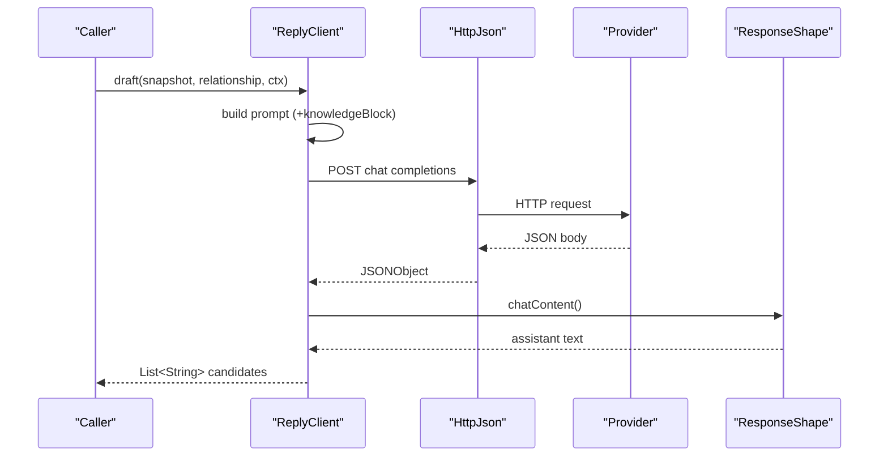
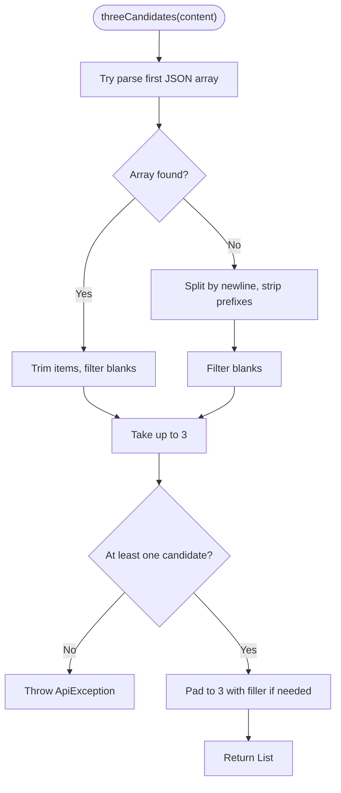
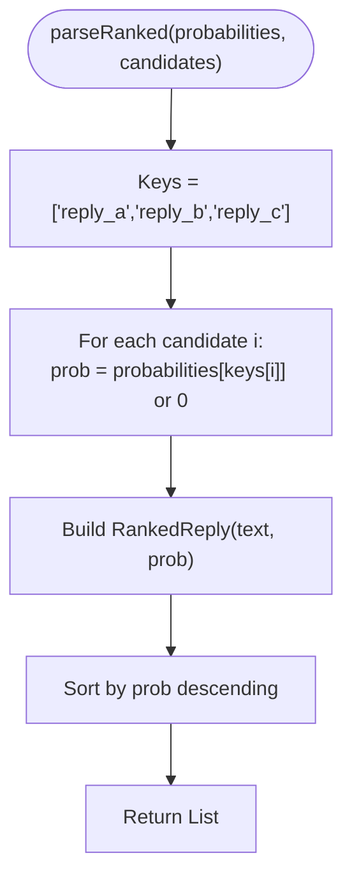
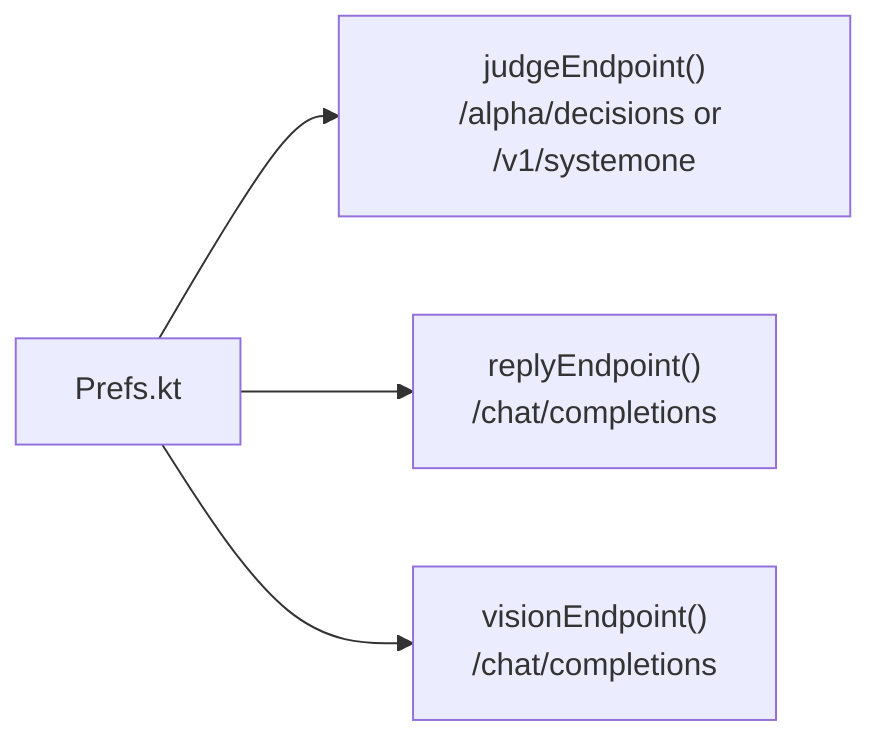
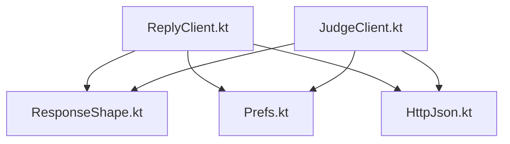

# Response Shape Models

<cite>
**Referenced Files in This Document**
- [ResponseShape.kt](file://app/src/main/java/com/jev/probe/jev/ResponseShape.kt)
- [ChatModels.kt](file://app/src/main/java/com/jev/probe/core/ChatModels.kt)
- [JudgeClient.kt](file://app/src/main/java/com/jev/probe/jev/JudgeClient.kt)
- [ReplyClient.kt](file://app/src/main/java/com/jev/probe/jev/ReplyClient.kt)
- [Prefs.kt](file://app/src/main/java/com/jev/probe/core/Prefs.kt)
- [HttpJson.kt](file://app/src/main/java/com/jev/probe/jev/HttpJson.kt)
- [ResponseShapeTest.kt](file://app/src/test/java/com/jev/probe/jev/ResponseShapeTest.kt)
</cite>

## Table of Contents
1. [Introduction](#introduction)
2. [Project Structure](#project-structure)
3. [Core Components](#core-components)
4. [Architecture Overview](#architecture-overview)
5. [Detailed Component Analysis](#detailed-component-analysis)
6. [Dependency Analysis](#dependency-analysis)
7. [Performance Considerations](#performance-considerations)
8. [Troubleshooting Guide](#troubleshooting-guide)
9. [Conclusion](#conclusion)

## Introduction
This document explains the standardized response shape and data models used to normalize outputs from multiple AI providers, including OpenRouter, DeepSeek, TypeSafe, Vercel, and OpenCode Zen. It focuses on:
- The unified response contract that prevents silent failures when providers return HTTP 200 with error bodies or malformed JSON.
- The Analysis model representing judgment results, error states, and ranked replies.
- The RankedReply structure with scoring and metadata.
- Protocol versioning, field validation rules, and backward compatibility considerations.
- How provider-specific payloads are normalized into the standard format.

The goal is to make the protocol clear for both developers integrating new providers and users configuring existing ones.

## Project Structure
The relevant implementation lives under two packages:
- com.jev.probe.core: Core domain models such as Analysis, Choice, Score, and RankedReply.
- com.jev.probe.jev: Client code and normalization logic for judge and reply routes, plus response shape validation.

**Diagram sources**
- [ChatModels.kt:40-58](file://app/src/main/java/com/jev/probe/core/ChatModels.kt#L40-L58)
- [ReplyClient.kt:10-93](file://app/src/main/java/com/jev/probe/jev/ReplyClient.kt#L10-L93)
- [JudgeClient.kt:14-143](file://app/src/main/java/com/jev/probe/jev/JudgeClient.kt#L14-L143)
- [ResponseShape.kt:25-140](file://app/src/main/java/com/jev/probe/jev/ResponseShape.kt#L25-L140)
- [Prefs.kt:281-303](file://app/src/main/java/com/jev/probe/core/Prefs.kt#L281-L303)
- [HttpJson.kt:14-20](file://app/src/main/java/com/jev/probe/jev/HttpJson.kt#L14-L20)

**Section sources**
- [ChatModels.kt:40-58](file://app/src/main/java/com/jev/probe/core/ChatModels.kt#L40-L58)
- [ReplyClient.kt:10-93](file://app/src/main/java/com/jev/probe/jev/ReplyClient.kt#L10-L93)
- [JudgeClient.kt:14-143](file://app/src/main/java/com/jev/probe/jev/JudgeClient.kt#L14-L143)
- [ResponseShape.kt:25-140](file://app/src/main/java/com/jev/probe/jev/ResponseShape.kt#L25-L140)
- [Prefs.kt:281-303](file://app/src/main/java/com/jev/probe/core/Prefs.kt#L281-L303)

## Core Components
- ResponseShape: Validates and normalizes provider responses before they reach UI or business logic. It rejects 2xx bodies that report errors internally, enforces OpenAI-compatible chat completion shapes, validates decisions endpoints, and extracts candidate replies.
- Analysis: A structured result containing seven judgment fields (choices, scores, and numeric signals), a list of ranked replies, latency, error state, and paywall flag.
- RankedReply: Represents a candidate reply with its probability score.
- JudgeClient: Implements the decisions protocol, parses answers into Analysis, and ranks candidates.
- ReplyClient: Calls any OpenAI-compatible chat completions endpoint to draft three candidate replies.
- Prefs: Encodes provider routing, base URLs, keys, models, and hosted gateway behavior.

**Section sources**
- [ResponseShape.kt:25-140](file://app/src/main/java/com/jev/probe/jev/ResponseShape.kt#L25-L140)
- [ChatModels.kt:40-58](file://app/src/main/java/com/jev/probe/core/ChatModels.kt#L40-L58)
- [JudgeClient.kt:31-68](file://app/src/main/java/com/jev/probe/jev/JudgeClient.kt#L31-L68)
- [ReplyClient.kt:28-93](file://app/src/main/java/com/jev/probe/jev/ReplyClient.kt#L28-L93)
- [Prefs.kt:281-303](file://app/src/main/java/com/jev/probe/core/Prefs.kt#L281-L303)

## Architecture Overview
The system uses two distinct protocols:
- Decisions protocol (judge route): Returns structured answers for intent, danger level, needs, actionability, tension resolution, and literal question interpretation.
- Chat completions protocol (reply route): OpenAI-compatible chat completions returning assistant text content.

**Diagram sources**
- [JudgeClient.kt:31-68](file://app/src/main/java/com/jev/probe/jev/JudgeClient.kt#L31-L68)
- [ReplyClient.kt:28-93](file://app/src/main/java/com/jev/probe/jev/ReplyClient.kt#L28-L93)
- [ResponseShape.kt:35-94](file://app/src/main/java/com/jev/probe/jev/ResponseShape.kt#L35-L94)
- [Prefs.kt:281-303](file://app/src/main/java/com/jev/probe/core/Prefs.kt#L281-L303)

## Detailed Component Analysis

### ResponseShape Contract
ResponseShape defines the canonical validation layer:
- ok(route, status, text): Accepts only well-formed success bodies; throws ApiException for internal errors even when HTTP status is 2xx.
- chatContent(route, resp): Extracts trimmed assistant text from OpenAI-compatible choices[0].message.content; rejects Anthropic message shapes and empty content.
- jevAnswers(route, resp): Requires an answers object; otherwise throws ApiException indicating the address is not a decisions endpoint.
- threeCandidates(route, content): Parses either a JSON array or numbered/bulleted lines into up to three candidates; pads fewer than three with a filler string; throws if no usable candidates exist.

**Diagram sources**
- [ResponseShape.kt:35-43](file://app/src/main/java/com/jev/probe/jev/ResponseShape.kt#L35-L43)
- [ResponseShape.kt:98-116](file://app/src/main/java/com/jev/probe/jev/ResponseShape.kt#L98-L116)

**Section sources**
- [ResponseShape.kt:35-94](file://app/src/main/java/com/jev/probe/jev/ResponseShape.kt#L35-L94)
- [ResponseShape.kt:98-140](file://app/src/main/java/com/jev/probe/jev/ResponseShape.kt#L98-L140)

### Analysis Model
Analysis aggregates judgment outcomes and ranked replies:
- trueIntent: Choice
- dangerLevel: Score
- sheNeeds: Choice
- shouldReplyNow: Double?
- bestAction: Choice
- tensionResolved: Double?
- literalQuestion: Double?
- rankedReplies: List<RankedReply>
- latencyMs: Long
- error: String?
- paywall: Boolean

Choice and Score provide confidence and probabilities or legend-derived max levels. RankedReply pairs candidate text with a probability score.

**Diagram sources**
- [ChatModels.kt:40-58](file://app/src/main/java/com/jev/probe/core/ChatModels.kt#L40-L58)

**Section sources**
- [ChatModels.kt:40-58](file://app/src/main/java/com/jev/probe/core/ChatModels.kt#L40-L58)

### JudgeClient Decisions Flow
JudgeClient implements the decisions protocol:
- judge(): Sends state and questions, parses answers into Analysis, measures latency, and returns errors via Analysis.error rather than throwing.
- rank(): Sends best_reply question over candidates, parses probabilities, and returns sorted RankedReply list.
- postDecisions(): Adds optional background/history context; retries without enriched fields on 4xx unless it is a gateway gate (401/402/429).

**Diagram sources**
- [JudgeClient.kt:31-68](file://app/src/main/java/com/jev/probe/jev/JudgeClient.kt#L31-L68)
- [JudgeClient.kt:79-112](file://app/src/main/java/com/jev/probe/jev/JudgeClient.kt#L79-L112)
- [ResponseShape.kt:71-75](file://app/src/main/java/com/jev/probe/jev/ResponseShape.kt#L71-L75)

**Section sources**
- [JudgeClient.kt:31-68](file://app/src/main/java/com/jev/probe/jev/JudgeClient.kt#L31-L68)
- [JudgeClient.kt:79-112](file://app/src/main/java/com/jev/probe/jev/JudgeClient.kt#L79-L112)

### ReplyClient Drafting Flow
ReplyClient drafts three candidate replies using OpenAI-compatible chat completions:
- Builds system and user prompts, optionally injecting knowledge context.
- Posts messages and temperature to the configured endpoint.
- Normalizes assistant text through ResponseShape.chatContent.

**Diagram sources**
- [ReplyClient.kt:28-93](file://app/src/main/java/com/jev/probe/jev/ReplyClient.kt#L28-L93)
- [ResponseShape.kt:50-64](file://app/src/main/java/com/jev/probe/jev/ResponseShape.kt#L50-L64)

**Section sources**
- [ReplyClient.kt:28-93](file://app/src/main/java/com/jev/probe/jev/ReplyClient.kt#L28-L93)

### Candidate Extraction Logic
threeCandidates supports two formats:
- JSON array: First JSON array block in the text; trims each item; filters blanks; takes up to three.
- Line fallback: Numbered or bulleted lines; strips common prefixes; filters blanks.

Fewer than three real candidates are padded with a filler string; zero usable candidates throw an error.

**Diagram sources**
- [ResponseShape.kt:84-94](file://app/src/main/java/com/jev/probe/jev/ResponseShape.kt#L84-L94)
- [ResponseShape.kt:121-140](file://app/src/main/java/com/jev/probe/jev/ResponseShape.kt#L121-L140)

**Section sources**
- [ResponseShape.kt:84-94](file://app/src/main/java/com/jev/probe/jev/ResponseShape.kt#L84-L94)
- [ResponseShape.kt:121-140](file://app/src/main/java/com/jev/probe/jev/ResponseShape.kt#L121-L140)

### Ranking Logic
rank parses best_reply probabilities keyed by reply_a, reply_b, reply_c and maps them to the original candidate texts, then sorts descending by probability.

**Diagram sources**
- [JudgeClient.kt:130-137](file://app/src/main/java/com/jev/probe/jev/JudgeClient.kt#L130-L137)

**Section sources**
- [JudgeClient.kt:130-137](file://app/src/main/java/com/jev/probe/jev/JudgeClient.kt#L130-L137)

### Provider Routing and Defaults
Prefs configures provider routing:
- Judge route presets: openrouter, typesafe, vercel, zen, bocha, custom.
- Default bases and models per provider.
- Hosted mode overrides endpoints and headers.
- Reply route uses OpenAI-compatible chat completions path.

**Diagram sources**
- [Prefs.kt:281-303](file://app/src/main/java/com/jev/probe/core/Prefs.kt#L281-L303)
- [Prefs.kt:358-397](file://app/src/main/java/com/jev/probe/core/Prefs.kt#L358-L397)

**Section sources**
- [Prefs.kt:281-303](file://app/src/main/java/com/jev/probe/core/Prefs.kt#L281-L303)
- [Prefs.kt:358-397](file://app/src/main/java/com/jev/probe/core/Prefs.kt#L358-L397)

## Dependency Analysis
Key dependencies:
- ReplyClient depends on HttpJson for transport and ResponseShape for normalization.
- JudgeClient depends on HttpJson and ResponseShape for decisions validation.
- Both clients depend on Prefs for routing and credentials.
- ResponseShape throws ApiException for non-retryable protocol mismatches and internal errors.

**Diagram sources**
- [ReplyClient.kt:10-93](file://app/src/main/java/com/jev/probe/jev/ReplyClient.kt#L10-L93)
- [JudgeClient.kt:14-143](file://app/src/main/java/com/jev/probe/jev/JudgeClient.kt#L14-L143)
- [ResponseShape.kt:25-140](file://app/src/main/java/com/jev/probe/jev/ResponseShape.kt#L25-L140)
- [Prefs.kt:281-303](file://app/src/main/java/com/jev/probe/core/Prefs.kt#L281-L303)
- [HttpJson.kt:14-20](file://app/src/main/java/com/jev/probe/jev/HttpJson.kt#L14-L20)

**Section sources**
- [ReplyClient.kt:10-93](file://app/src/main/java/com/jev/probe/jev/ReplyClient.kt#L10-L93)
- [JudgeClient.kt:14-143](file://app/src/main/java/com/jev/probe/jev/JudgeClient.kt#L14-L143)
- [ResponseShape.kt:25-140](file://app/src/main/java/com/jev/probe/jev/ResponseShape.kt#L25-L140)
- [Prefs.kt:281-303](file://app/src/main/java/com/jev/probe/core/Prefs.kt#L281-L303)

## Performance Considerations
- Latency tracking: Analysis.latencyMs captures judge call duration.
- Minimal retries: Non-retryable protocol errors avoid repeated failures; transport-level truncation remains retryable.
- Context injection: Optional background/history can degrade gracefully on 4xx by retrying without enriched fields.
- Candidate padding: Ensures UI stability with fixed rows even when fewer candidates are returned.

[No sources needed since this section provides general guidance]

## Troubleshooting Guide
Common issues and their handling:
- Gateway soft 404 with HTTP 200: ok() detects code/msg/success patterns and throws ApiException with non-retryable flag.
- Error envelope as object or string: ok() extracts message fields and throws.
- Empty or blank assistant content: chatContent() throws instead of returning empty strings.
- Wrong protocol (Anthropic messages vs OpenAI chat completions): chatContent() hints at mismatch.
- Missing answers in decisions: jevAnswers() throws with protocol hint.
- No usable candidates: threeCandidates() throws when parsing yields nothing.

Tests validate these behaviors explicitly.

**Section sources**
- [ResponseShapeTest.kt:23-81](file://app/src/test/java/com/jev/probe/jev/ResponseShapeTest.kt#L23-L81)
- [ResponseShapeTest.kt:85-113](file://app/src/test/java/com/jev/probe/jev/ResponseShapeTest.kt#L85-L113)
- [ResponseShapeTest.kt:117-128](file://app/src/test/java/com/jev/probe/jev/ResponseShapeTest.kt#L117-L128)
- [ResponseShapeTest.kt:132-156](file://app/src/test/java/com/jev/probe/jev/ResponseShapeTest.kt#L132-L156)

## Conclusion
The ResponseShape contracts and core models ensure consistent, safe, and interoperable behavior across diverse AI providers. By enforcing strict validation, providing clear error signaling, and normalizing provider-specific payloads into Analysis and RankedReply structures, the system avoids silent failures and maintains predictable UI experiences. Provider routing via Prefs allows flexible configuration while preserving backward compatibility and graceful degradation.

[No sources needed since this section summarizes without analyzing specific files]