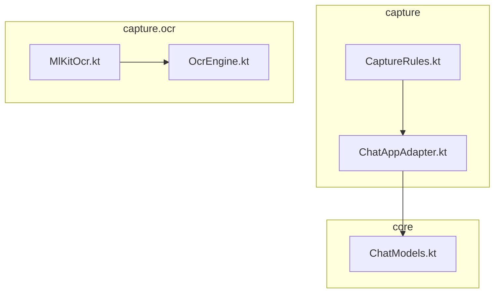
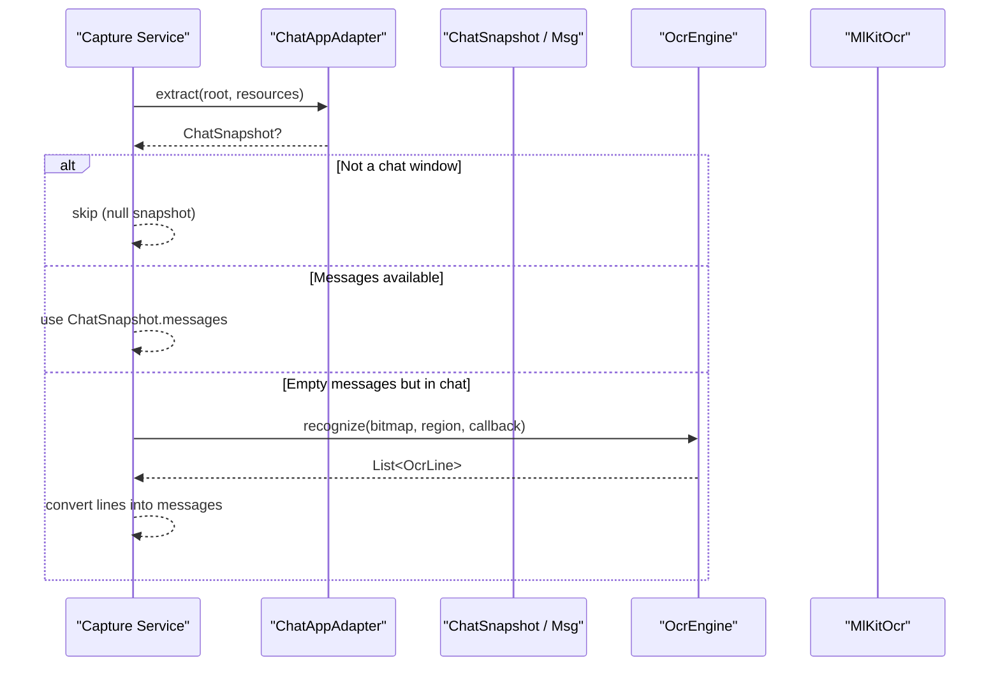
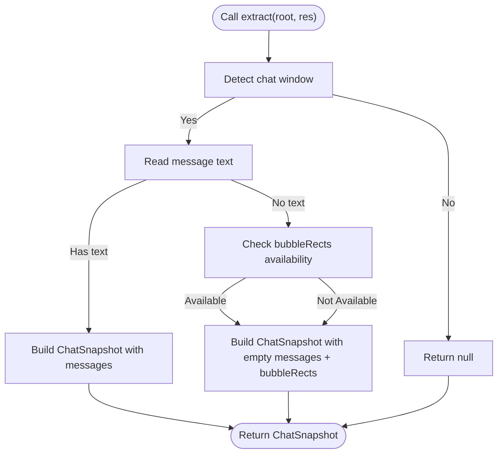
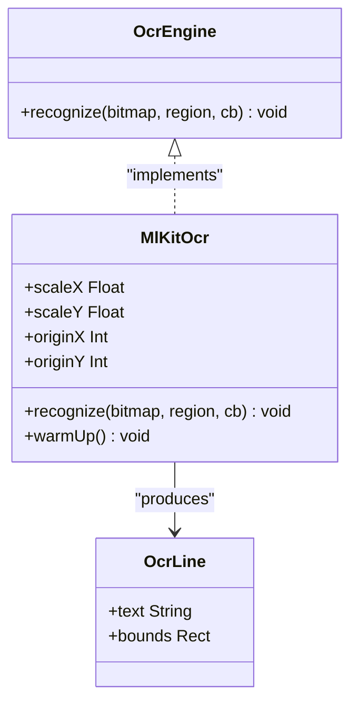
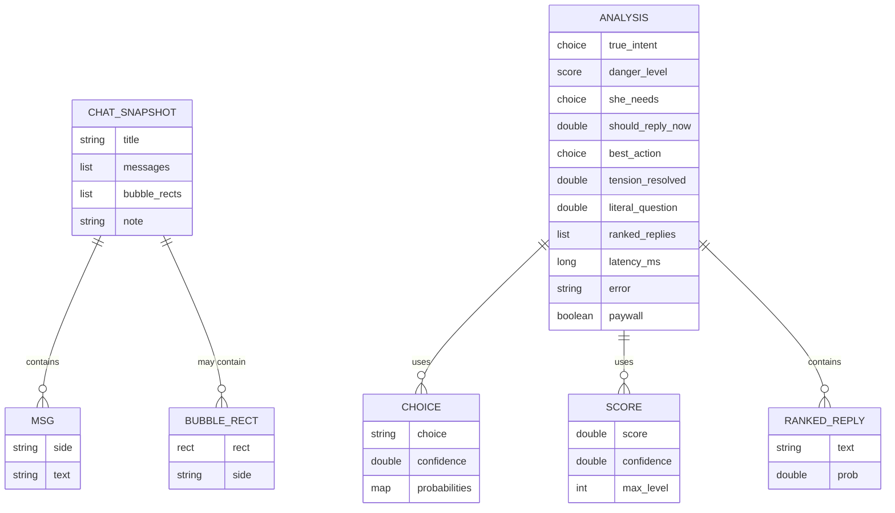
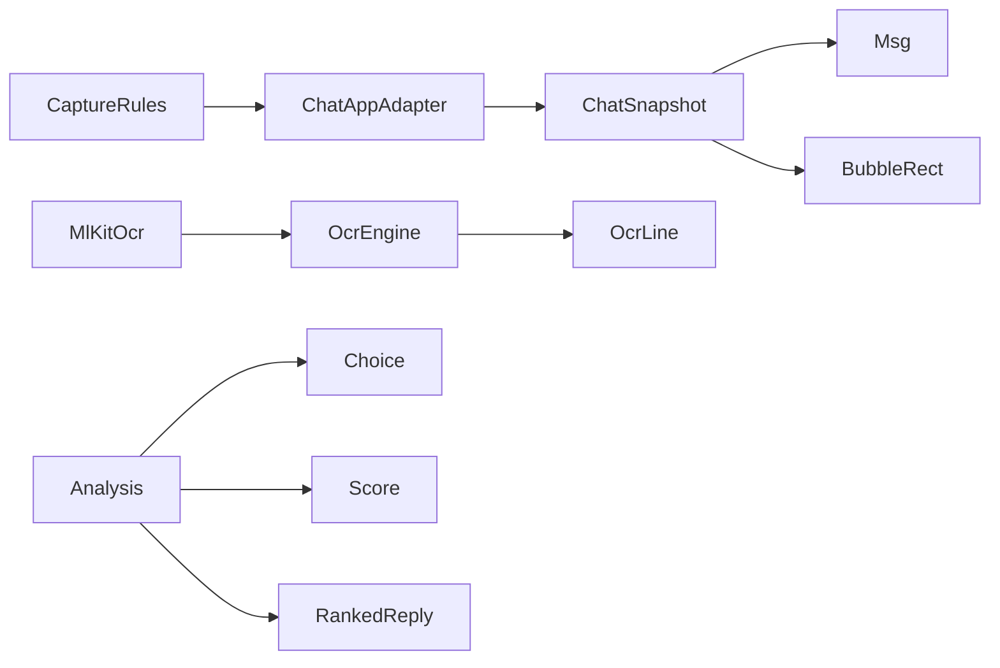

# API Reference

<cite>
**Referenced Files in This Document**
- [ChatAppAdapter.kt](file://app/src/main/java/com/jev/probe/capture/ChatAppAdapter.kt)
- [OcrEngine.kt](file://app/src/main/java/com/jev/probe/capture/ocr/OcrEngine.kt)
- [MlKitOcr.kt](file://app/src/main/java/com/jev/probe/capture/ocr/MlKitOcr.kt)
- [ChatModels.kt](file://app/src/main/java/com/jev/probe/core/ChatModels.kt)
- [CaptureRules.kt](file://app/src/main/java/com/jev/probe/capture/CaptureRules.kt)
</cite>

## Table of Contents
1. [Introduction](#introduction)
2. [Project Structure](#project-structure)
3. [Core Components](#core-components)
4. [Architecture Overview](#architecture-overview)
5. [Detailed Component Analysis](#detailed-component-analysis)
6. [Dependency Analysis](#dependency-analysis)
7. [Performance Considerations](#performance-considerations)
8. [Troubleshooting Guide](#troubleshooting-guide)
9. [Conclusion](#conclusion)

## Introduction
This document describes the public-facing extension points and data contracts used by Jev Chat Jarvis to capture chat conversations, extract text from screenshots, and represent conversation state for downstream AI processing. It focuses on:

- The `ChatAppAdapter` interface for per-app chat extraction.
- The `OcrEngine` interface for custom OCR implementations.
- The core data models: `Msg`, `ChatSnapshot`, `BubbleRect`, `Analysis`, `Choice`, `Score`, and `RankedReply`.
- Parameter semantics, return-value conventions, null handling, exception behavior, and recommended patterns for extending platform support.

The goal is to help third-party integrators implement new app adapters or OCR engines while respecting internal API boundaries and stability guarantees.

## Project Structure
The relevant code lives under three packages:

- `com.jev.probe.capture`: App-specific adapters and capture rules.
- `com.jev.probe.capture.ocr`: OCR engine abstraction and ML Kit implementation.
- `com.jev.probe.core`: Shared data models for messages, snapshots, and analysis results.

**Diagram sources**
- [ChatAppAdapter.kt:10-30](file://app/src/main/java/com/jev/probe/capture/ChatAppAdapter.kt#L10-L30)
- [OcrEngine.kt:6-22](file://app/src/main/java/com/jev/probe/capture/ocr/OcrEngine.kt#L6-L22)
- [MlKitOcr.kt:13-25](file://app/src/main/java/com/jev/probe/capture/ocr/MlKitOcr.kt#L13-L25)
- [ChatModels.kt:5-38](file://app/src/main/java/com/jev/probe/core/ChatModels.kt#L5-L38)
- [CaptureRules.kt:1-11](file://app/src/main/java/com/jev/probe/capture/CaptureRules.kt#L1-L11)

**Section sources**
- [ChatAppAdapter.kt:10-30](file://app/src/main/java/com/jev/probe/capture/ChatAppAdapter.kt#L10-L30)
- [OcrEngine.kt:6-22](file://app/src/main/java/com/jev/probe/capture/ocr/OcrEngine.kt#L6-L22)
- [ChatModels.kt:5-38](file://app/src/main/java/com/jev/probe/core/ChatModels.kt#L5-L38)
- [CaptureRules.kt:1-11](file://app/src/main/java/com/jev/probe/capture/CaptureRules.kt#L1-L11)

## Core Components
This section summarizes the extension points and shared data structures that integrators should focus on when adding support for a new chat application or OCR backend.

- `ChatAppAdapter`: Extracts a neutral `ChatSnapshot` from an accessibility tree.
- `OcrEngine`: Recognizes text from a screenshot bitmap, optionally within a region.
- `ChatSnapshot`, `Msg`, `BubbleRect`, `Analysis`, `Choice`, `Score`, `RankedReply`: Stable data contracts between capture, OCR, and AI layers.

**Section sources**
- [ChatAppAdapter.kt:10-30](file://app/src/main/java/com/jev/probe/capture/ChatAppAdapter.kt#L10-L30)
- [OcrEngine.kt:6-22](file://app/src/main/java/com/jev/probe/capture/ocr/OcrEngine.kt#L6-L22)
- [ChatModels.kt:5-59](file://app/src/main/java/com/jev/probe/core/ChatModels.kt#L5-L59)

## Architecture Overview
At runtime, the service selects a `ChatAppAdapter` based on the foreground package, calls `extract(root, res)`, and then either uses the returned messages directly or falls back to OCR using an `OcrEngine` when the adapter reports no readable text.

**Diagram sources**
- [ChatAppAdapter.kt:10-30](file://app/src/main/java/com/jev/probe/capture/ChatAppAdapter.kt#L10-L30)
- [OcrEngine.kt:9-22](file://app/src/main/java/com/jev/probe/capture/ocr/OcrEngine.kt#L9-L22)
- [MlKitOcr.kt:39-95](file://app/src/main/java/com/jev/probe/capture/ocr/MlKitOcr.kt#L39-L95)
- [ChatModels.kt:5-38](file://app/src/main/java/com/jev/probe/core/ChatModels.kt#L5-L38)

## Detailed Component Analysis

### ChatAppAdapter Interface
`ChatAppAdapter` is the primary extension point for supporting a new messaging application. Its contract centers on the `extract` method.

#### Method Signature
- `extract(root: AccessibilityNodeInfo, res: Resources): ChatSnapshot?`

#### Parameters
- `root`: The root accessibility node of the current screen. Adapters traverse this tree to detect chat windows and message bubbles.
- `res`: Android `Resources`, used to read display metrics and resource identifiers.

#### Return Value Semantics
- `null`: The current screen is not a chat window for this app. The service must do nothing with this result.
- Non-null `ChatSnapshot` with non-empty `messages`: Normal capture path; downstream logic can use sender side and message text.
- Non-null `ChatSnapshot` with empty `messages`: The adapter recognizes it is inside a chat window, but the accessibility tree does not expose readable text. This is the explicit cue for the service to fall back to OCR. In this case, `bubbleRects` may be populated so the service can crop and OCR specific bubble regions.

#### Null Handling and Error Behavior
- Adapters should never throw unexpected exceptions during normal traversal; they should return `null` when the screen is not a chat window.
- If the adapter detects a chat window but cannot read any text, it should return an empty-message `ChatSnapshot`, not `null`.

#### Example Usage Pattern
To add a new app adapter:
1. Implement `ChatAppAdapter`.
2. Set `pkg` to the target app’s package name.
3. In `extract`, determine whether the current tree represents a chat window.
4. If not, return `null`.
5. If yes, collect `Msg` objects with `side` set to `"me"` or `"other"`.
6. If no readable text is available but geometry is known, populate `bubbleRects` and return a snapshot with an empty `messages` list.

**Diagram sources**
- [ChatAppAdapter.kt:10-30](file://app/src/main/java/com/jev/probe/capture/ChatAppAdapter.kt#L10-L30)
- [ChatModels.kt:5-38](file://app/src/main/java/com/jev/probe/core/ChatModels.kt#L5-L38)

**Section sources**
- [ChatAppAdapter.kt:10-30](file://app/src/main/java/com/jev/probe/capture/ChatAppAdapter.kt#L10-L30)
- [ChatModels.kt:5-38](file://app/src/main/java/com/jev/probe/core/ChatModels.kt#L5-L38)

### OcrEngine Interface
`OcrEngine` abstracts text recognition over a screenshot. It is designed so that callers do not need to handle OCR threading or failure details.

#### Method Signature
- `recognize(bitmap: Bitmap, region: Rect?, cb: (List<OcrLine>) -> Unit)`

#### Parameters
- `bitmap`: The screenshot bitmap passed to the OCR engine.
- `region`: Optional rectangle in bitmap coordinates. `null` means the whole bitmap. Callers typically scale node rectangles by the screenshot’s scale factors before passing them here.
- `cb`: Callback invoked on the main thread. It receives a list of recognized lines.

#### Return Value Semantics
- The method itself does not return results synchronously; results are delivered through `cb`.
- On success, `cb` receives a list of `OcrLine` objects.
- On failure, `cb` still fires with an empty list rather than throwing an exception to the caller.

#### Data Model
- `OcrLine{text: String, bounds: Rect}`: Each recognized line includes trimmed text and its bounding rectangle already converted to screen coordinates.

#### Implementation Notes
- The default implementation `MlKitOcr` uses ML Kit’s bundled Chinese recognizer.
- Coordinates are transformed from bitmap space to screen space using `scaleX`, `scaleY`, `originX`, and `originY`.
- The callback is always posted to the main thread.

**Diagram sources**
- [OcrEngine.kt:6-22](file://app/src/main/java/com/jev/probe/capture/ocr/OcrEngine.kt#L6-L22)
- [MlKitOcr.kt:13-25](file://app/src/main/java/com/jev/probe/capture/ocr/MlKitOcr.kt#L13-L25)
- [MlKitOcr.kt:26-35](file://app/src/main/java/com/jev/probe/capture/ocr/MlKitOcr.kt#L26-L35)
- [MlKitOcr.kt:39-95](file://app/src/main/java/com/jev/probe/capture/ocr/MlKitOcr.kt#L39-L95)

**Section sources**
- [OcrEngine.kt:6-22](file://app/src/main/java/com/jev/probe/capture/ocr/OcrEngine.kt#L6-L22)
- [MlKitOcr.kt:13-25](file://app/src/main/java/com/jev/probe/capture/ocr/MlKitOcr.kt#L13-L25)
- [MlKitOcr.kt:26-35](file://app/src/main/java/com/jev/probe/capture/ocr/MlKitOcr.kt#L26-L35)
- [MlKitOcr.kt:39-95](file://app/src/main/java/com/jev/probe/capture/ocr/MlKitOcr.kt#L39-L95)

### ChatModels Data Structures
These models define the stable data exchanged between adapters, OCR, and AI processing.

#### Msg
Represents one captured chat bubble.

- `side`: Sender identification string. Expected values include `"me"` and `"other"`.
- `text`: Message body text extracted from the accessibility tree or OCR.

Complexity:
- Construction is constant time.
- Equality and hashing are based on both fields.

#### BubbleRect
Represents a bubble that can be located geometrically but not read from the accessibility tree.

- `rect`: Rectangle in screen coordinates.
- `side`: Best-effort sender inference derived from UI chrome or geometry.

Usage:
- Populated when an adapter knows where bubbles are but cannot read their text.
- Used by the service to crop and OCR each bubble individually.

#### ChatSnapshot
Represents the current conversation state exposed by an adapter.

Fields:
- `title`: Optional conversation title.
- `messages`: Ordered list of `Msg`.
- `bubbleRects`: Optional list of `BubbleRect` for OCR fallback.
- `note`: Optional caveat shown verbatim in the analysis panel.

Computed properties:
- `latestFrom`: Returns the `side` of the last message, or `null` if there are no messages.
- `signature()`: Produces a stable signature from the last few messages for change detection.

Contract:
- `null` from `extract` means “not a chat window.”
- Empty `messages` means “in a chat window, but no readable text,” which triggers OCR fallback.

#### Analysis and Related Types
- `Analysis`: Aggregates AI judgment results, ranked replies, latency, error information, and paywall signaling.
- `Choice`: Represents a classified choice with confidence and probability distribution.
- `Score`: Represents a numeric score with confidence and maximum level.
- `RankedReply`: Represents a candidate reply with associated probability.

**Diagram sources**
- [ChatModels.kt:5-59](file://app/src/main/java/com/jev/probe/core/ChatModels.kt#L5-L59)

**Section sources**
- [ChatModels.kt:5-59](file://app/src/main/java/com/jev/probe/core/ChatModels.kt#L5-L59)

### Internal API Boundaries and Recommended Patterns
- Do not depend on internal helper functions such as `findTitleInActionBar`, `findWeChatTitle`, or `collectFeishuBubbleRects`; these are marked internal and may change without notice.
- Use `ChatSnapshot` as the single source of truth for conversation state.
- Treat `null` from `ChatAppAdapter.extract` as “skip this screen.”
- Treat empty `ChatSnapshot.messages` as “OCR fallback required.”
- For OCR integration, implement `OcrEngine` and ensure:
  - The callback is invoked on the main thread.
  - Failures return an empty list instead of throwing.
  - Returned `OcrLine.bounds` are in screen coordinates.
- Use `CaptureRules` only for internal decision logic; external integrators should not assume its behavior is part of the public API.

**Section sources**
- [ChatAppAdapter.kt:10-30](file://app/src/main/java/com/jev/probe/capture/ChatAppAdapter.kt#L10-L30)
- [OcrEngine.kt:9-22](file://app/src/main/java/com/jev/probe/capture/ocr/OcrEngine.kt#L9-L22)
- [CaptureRules.kt:1-11](file://app/src/main/java/com/jev/probe/capture/CaptureRules.kt#L1-L11)

## Dependency Analysis
The following diagram shows how the public interfaces and models relate to each other.

**Diagram sources**
- [ChatAppAdapter.kt:10-30](file://app/src/main/java/com/jev/probe/capture/ChatAppAdapter.kt#L10-L30)
- [ChatModels.kt:5-59](file://app/src/main/java/com/jev/probe/core/ChatModels.kt#L5-L59)
- [OcrEngine.kt:6-22](file://app/src/main/java/com/jev/probe/capture/ocr/OcrEngine.kt#L6-L22)
- [MlKitOcr.kt:26-35](file://app/src/main/java/com/jev/probe/capture/ocr/MlKitOcr.kt#L26-L35)
- [CaptureRules.kt:1-11](file://app/src/main/java/com/jev/probe/capture/CaptureRules.kt#L1-L11)

**Section sources**
- [ChatAppAdapter.kt:10-30](file://app/src/main/java/com/jev/probe/capture/ChatAppAdapter.kt#L10-L30)
- [ChatModels.kt:5-59](file://app/src/main/java/com/jev/probe/core/ChatModels.kt#L5-L59)
- [OcrEngine.kt:6-22](file://app/src/main/java/com/jev/probe/capture/ocr/OcrEngine.kt#L6-L22)
- [MlKitOcr.kt:26-35](file://app/src/main/java/com/jev/probe/capture/ocr/MlKitOcr.kt#L26-L35)
- [CaptureRules.kt:1-11](file://app/src/main/java/com/jev/probe/capture/CaptureRules.kt#L1-L11)

## Performance Considerations
- Prefer returning `null` quickly when the current screen is not a chat window to avoid unnecessary work.
- Avoid deep or unbounded tree traversal; existing adapters use guarded loops to prevent excessive scanning.
- When implementing OCR, reuse recognizers where possible and pre-warm heavy initialization off the main thread.
- Keep `OcrLine` lists small and sorted by vertical position to minimize downstream processing cost.
- Use `bubbleRects` only when necessary; cropping and OCR are more expensive than reading accessible text.

[No sources needed since this section provides general guidance]

## Troubleshooting Guide
Common issues and their expected behaviors:

- **Adapter returns `null`**: The service treats this as “not a chat window” and skips processing. Verify your app’s package name and chat-window detection logic.
- **Adapter returns empty messages**: The service interprets this as “in a chat window but no readable text,” triggering OCR fallback. Ensure `bubbleRects` are provided when geometry is known.
- **OCR callback never fires**: This should not happen; failures are converted to empty lists. Check that the callback is invoked and that `scaleX`/`scaleY`/`originX`/`originY` are configured correctly.
- **Wrong coordinate space**: `OcrLine.bounds` must be in screen coordinates. Confirm that bitmap-to-screen transformations are applied consistently.
- **Manual analysis blocked**: Use `CaptureRules.manualBlock` to understand why manual analysis cannot run. Reasons include disabled feature, ongoing analysis, or missing snapshot.

**Section sources**
- [ChatAppAdapter.kt:10-30](file://app/src/main/java/com/jev/probe/capture/ChatAppAdapter.kt#L10-L30)
- [OcrEngine.kt:9-22](file://app/src/main/java/com/jev/probe/capture/ocr/OcrEngine.kt#L9-L22)
- [MlKitOcr.kt:39-95](file://app/src/main/java/com/jev/probe/capture/ocr/MlKitOcr.kt#L39-L95)
- [CaptureRules.kt:27-38](file://app/src/main/java/com/jev/probe/capture/CaptureRules.kt#L27-L38)

## Conclusion
Jev Chat Jarvis exposes two clear extension points:

- Implement `ChatAppAdapter` to support new chat applications by converting their accessibility trees into neutral `ChatSnapshot` objects.
- Implement `OcrEngine` to provide alternative text recognition backends while preserving the same callback-based contract and coordinate-space guarantees.

By adhering to the documented return-value semantics, null-handling rules, and model contracts, third-party integrations can extend platform support safely and predictably.

[No sources needed since this section summarizes without analyzing specific files]