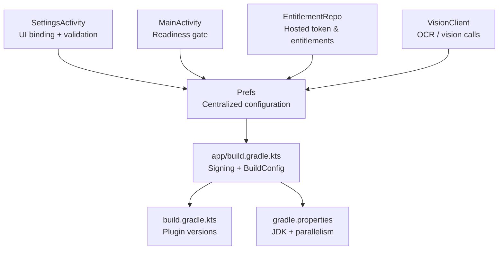
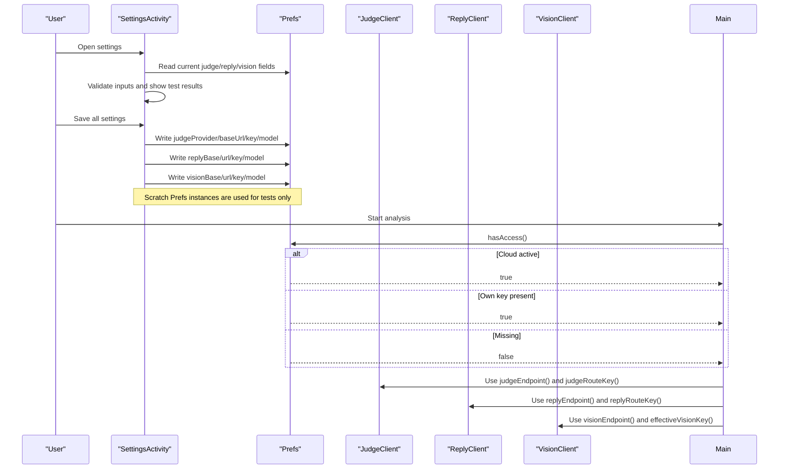
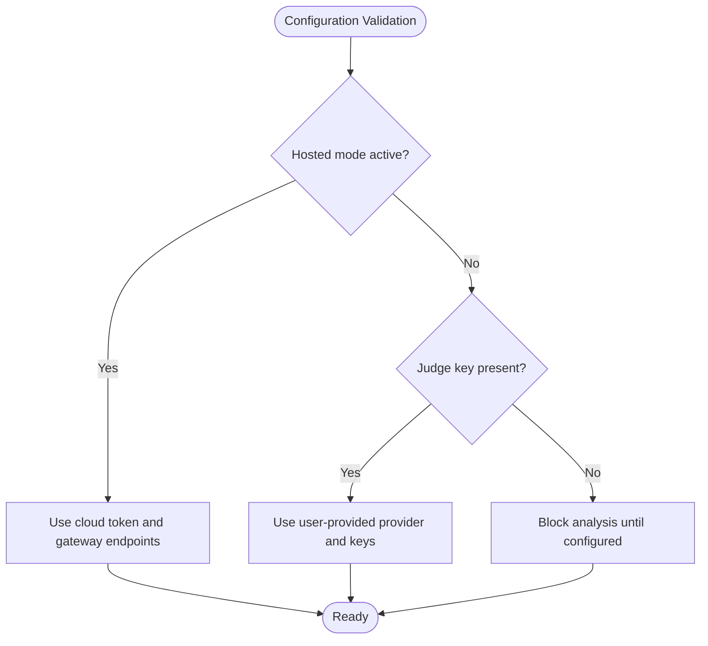
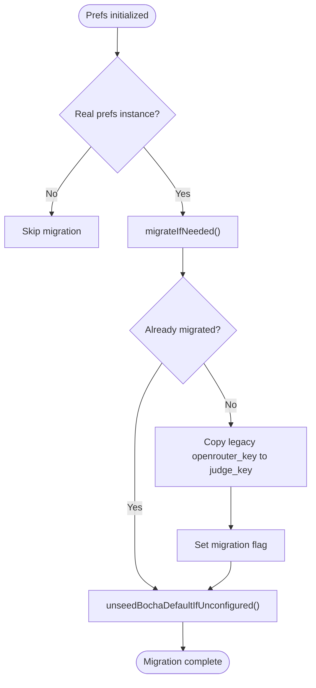
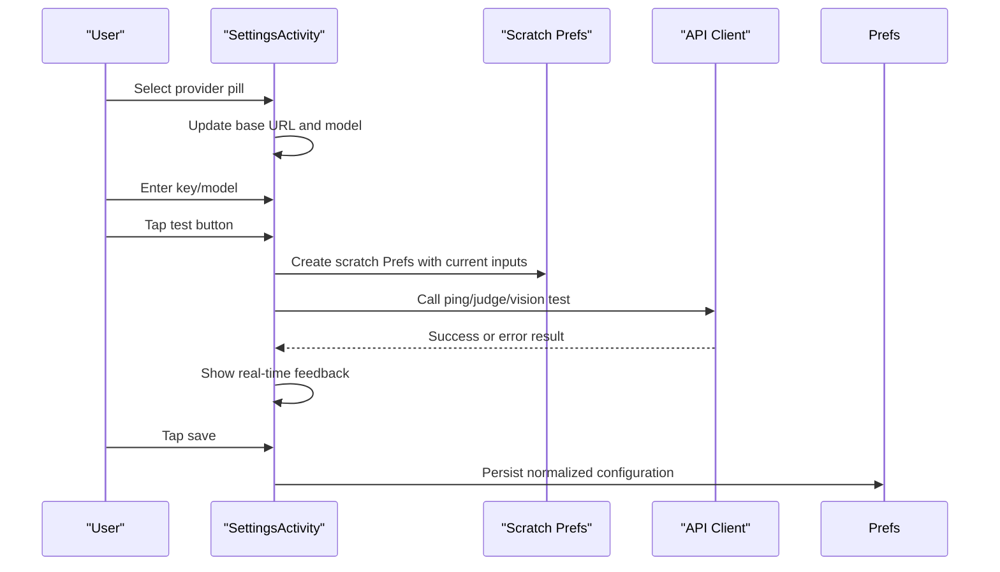
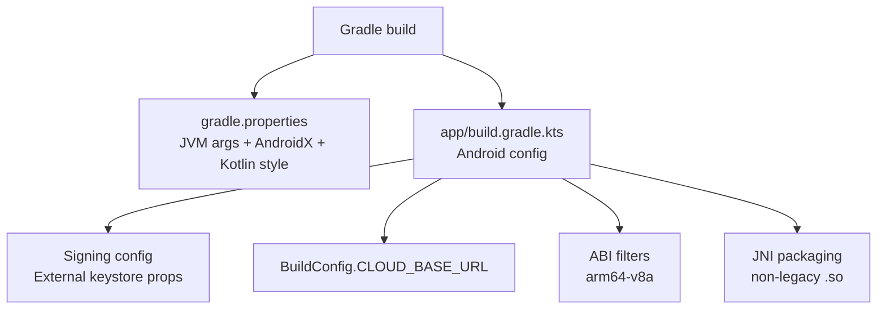
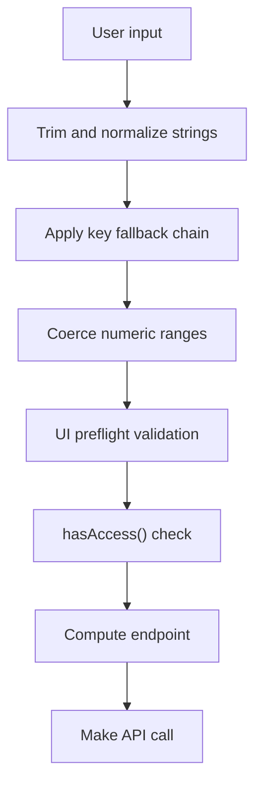
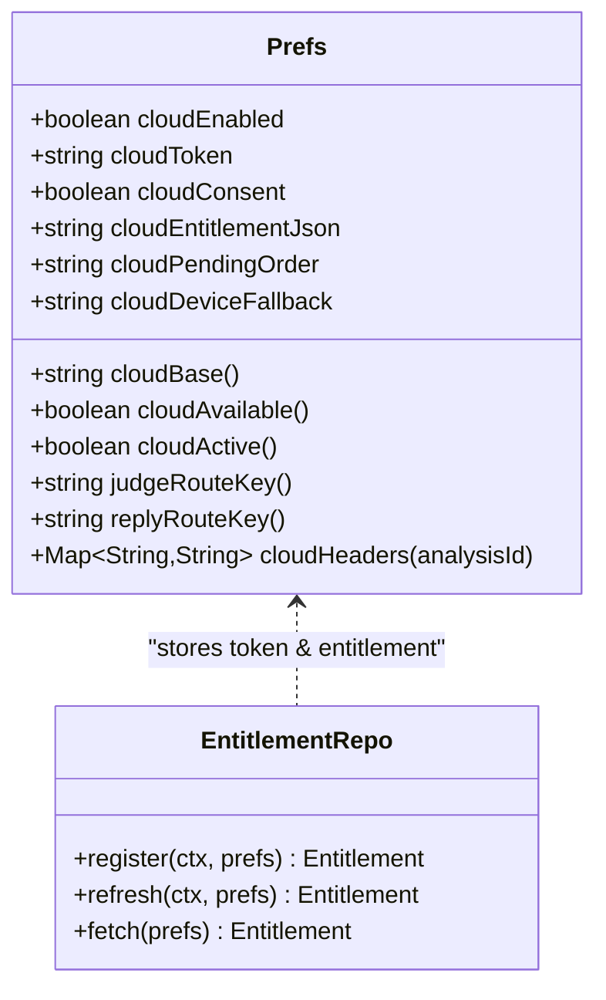
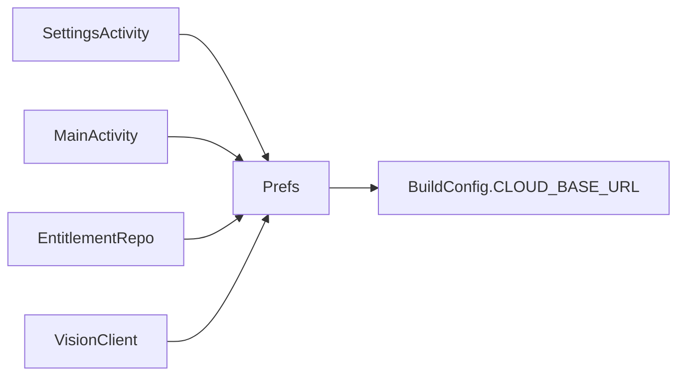

# Configuration Management

<cite>
**Referenced Files in This Document**
- [Prefs.kt](file://app/src/main/java/com/jev/probe/core/Prefs.kt)
- [SettingsActivity.kt](file://app/src/main/java/com/jev/probe/SettingsActivity.kt)
- [MainActivity.kt](file://app/src/main/java/com/jev/probe/MainActivity.kt)
- [EntitlementRepo.kt](file://app/src/main/java/com/jev/probe/billing/EntitlementRepo.kt)
- [VisionClient.kt](file://app/src/main/java/com/jev/probe/jev/VisionClient.kt)
- [app/build.gradle.kts](file://app/build.gradle.kts)
- [build.gradle.kts](file://build.gradle.kts)
- [gradle.properties](file://gradle.properties)
</cite>

## Table of Contents
1. [Introduction](#introduction)
2. [Project Structure](#project-structure)
3. [Core Components](#core-components)
4. [Architecture Overview](#architecture-overview)
5. [Detailed Component Analysis](#detailed-component-analysis)
6. [Dependency Analysis](#dependency-analysis)
7. [Performance Considerations](#performance-considerations)
8. [Troubleshooting Guide](#troubleshooting-guide)
9. [Conclusion](#conclusion)

## Introduction
This document explains the configuration management sub-component that centralizes application settings for API endpoints, authentication keys, model selections, and feature toggles. The primary implementation is the `Prefs` class, which provides typed accessors backed by Android’s private `SharedPreferences`. It also covers build-time configuration through Gradle files, including signing properties, build variants, environment-specific gateway URLs, and runtime validation mechanisms used by the Settings UI and core clients.

The goal is to make it clear how configuration flows from user input into secure storage, how defaults and migrations work, how hosted/cloud mode changes routing behavior, and how the UI validates and tests configuration before saving or using it.

## Project Structure
Configuration-related code lives primarily under the app module:

- Core configuration store: `com.jev.probe.core.Prefs`
- Configuration UI and test buttons: `com.jev.probe.SettingsActivity`
- Runtime readiness checks: `com.jev.probe.MainActivity`
- Hosted-mode entitlements and token handling: `com.jev.probe.billing.EntitlementRepo`
- Vision client usage of effective keys: `com.jev.probe.jev.VisionClient`
- App-level Gradle configuration: `app/build.gradle.kts`
- Top-level Gradle plugin versions: `build.gradle.kts`
- Global Gradle options: `gradle.properties`

**Diagram sources**
- [Prefs.kt:14-400](file://app/src/main/java/com/jev/probe/core/Prefs.kt#L14-L400)
- [SettingsActivity.kt:35-447](file://app/src/main/java/com/jev/probe/SettingsActivity.kt#L35-L447)
- [MainActivity.kt:76-167](file://app/src/main/java/com/jev/probe/MainActivity.kt#L76-L167)
- [EntitlementRepo.kt:79-103](file://app/src/main/java/com/jev/probe/billing/EntitlementRepo.kt#L79-L103)
- [VisionClient.kt:55](file://app/src/main/java/com/jev/probe/jev/VisionClient.kt#L55)
- [app/build.gradle.kts:9-62](file://app/build.gradle.kts#L9-L62)

**Section sources**
- [Prefs.kt:1-400](file://app/src/main/java/com/jev/probe/core/Prefs.kt#L1-L400)
- [SettingsActivity.kt:1-682](file://app/src/main/java/com/jev/probe/SettingsActivity.kt#L1-L682)
- [MainActivity.kt:76-167](file://app/src/main/java/com/jev/probe/MainActivity.kt#L76-L167)
- [app/build.gradle.kts:1-96](file://app/build.gradle.kts#L1-L96)

## Core Components
The configuration subsystem centers on `Prefs`, with supporting roles in the UI and build system:

| Area | Responsibility | Key Implementation Details |
| --- | --- | --- |
| Central store | Provides typed getters/setters for judge, reply, vision, OCR, context, overlay, whitelist, relationship, and hosted-mode fields | Uses `SharedPreferences` with `MODE_PRIVATE`; trims string values; coerces numeric ranges where needed |
| Endpoint resolution | Computes final POST URLs per provider and hosted mode | Separate base URLs for judge, reply, and vision; hosted mode overrides endpoints |
| Access control | Determines whether analysis can run | Requires either an active hosted session or a non-blank judge key |
| Migration | Migrates legacy keys and corrects early auto-seeded defaults | Runs once per install via flags stored in preferences |
| UI binding | Reads current values, fills inputs, and saves validated values | Provider pills, preset URL/model mapping, scratch `Prefs` for live testing |
| Build-time config | Injects cloud gateway URL and defines signing behavior | `BuildConfig.CLOUD_BASE_URL` from Gradle property; optional release keystore file |

**Section sources**
- [Prefs.kt:14-400](file://app/src/main/java/com/jev/probe/core/Prefs.kt#L14-L400)
- [SettingsActivity.kt:72-447](file://app/src/main/java/com/jev/probe/SettingsActivity.kt#L72-L447)
- [app/build.gradle.kts:21-62](file://app/build.gradle.kts#L21-L62)

## Architecture Overview
The configuration architecture separates three concerns:

1. **Storage and schema**: `Prefs` owns all preference keys, default values, migration logic, and endpoint computation.
2. **User interaction and validation**: `SettingsActivity` binds UI controls to `Prefs`, performs preflight checks, and uses scratch configurations for safe testing.
3. **Runtime consumption**: Other components read `Prefs` to determine endpoints, credentials, and feature availability.

**Diagram sources**
- [SettingsActivity.kt:158-307](file://app/src/main/java/com/jev/probe/SettingsActivity.kt#L158-L307)
- [SettingsActivity.kt:403-447](file://app/src/main/java/com/jev/probe/SettingsActivity.kt#L403-L447)
- [MainActivity.kt:76-167](file://app/src/main/java/com/jev/probe/MainActivity.kt#L76-L167)
- [Prefs.kt:254-316](file://app/src/main/java/com/jev/probe/core/Prefs.kt#L254-L316)

## Detailed Component Analysis

### Prefs: Centralized Configuration Store
`Prefs` is the single source of truth for application configuration. It encapsulates:

- **Judgment API configuration**: provider, base URL, key, and model.
- **Reply API configuration**: base URL, key, and model.
- **Vision API configuration**: base URL, key, and model.
- **Feature toggles**: context recording, OCR engine selection, fallback behavior, auto-analyze, overlay opacity, bubble position, relationship description, conversation whitelist, and master enabled flag.
- **Hosted/cloud mode**: gateway base URL, token, consent, entitlement JSON, pending order, device fallback ID, and route key resolution.

#### Preference Schema
The following table summarizes the main preference groups and their semantics:

| Group | Fields | Default Behavior | Notes |
| --- | --- | --- | --- |
| Judgment | `judgeProvider`, `judgeBaseUrl`, `judgeKey`, `judgeModel` | Defaults to OpenRouter base and model unless overridden | Legacy `openRouterKey` migrates to `judgeKey` |
| Reply | `replyBaseUrl`, `replyKey`, `replyModel` | Defaults to OpenRouter-compatible chat completions base | Blank key falls back to judge key |
| Vision | `visionBaseUrl`, `visionKey`, `visionModel` | Defaults to OpenRouter vision base and model | Blank key falls back to reply key then judge key |
| Context | `contextEnabled`, `contextHistoryCount`, `autoSummary` | Off by default | Opt-in history storage |
| OCR | `ocrEngine`, `ocrForUnknownApps`, `ocrFallback`, `ocrAutoAnalyze` | ML Kit engine; fallback and unknown-app behavior configurable | OCR runs locally |
| Overlay/UI | `overlayOpacity`, `bubbleX`, `bubbleY` | Opacity 60–100%; bubble positions remembered | Coerced range for opacity |
| Conversation | `relationship`, `whitelist`, `autoAnalyze`, `enabled` | Relationship text defaults to Chinese prompt; whitelist empty means all conversations | Whitelist matches titles |
| Hosted | `cloudEnabled`, `cloudToken`, `cloudConsent`, `cloudEntitlementJson`, `cloudPendingOrder`, `cloudDeviceFallback` | Disabled unless configured at build time and activated by user | Gateway URL comes from `BuildConfig.CLOUD_BASE_URL` |

**Section sources**
- [Prefs.kt:71-316](file://app/src/main/java/com/jev/probe/core/Prefs.kt#L71-L316)
- [Prefs.kt:318-400](file://app/src/main/java/com/jev/probe/core/Prefs.kt#L318-L400)

#### Validation and Readiness Logic
Validation is split between UI-side preflight checks and runtime readiness gates:

- `hasKey()` requires a non-blank judge key.
- `hasAccess()` allows operation when either hosted mode is active or a judge key exists.
- Effective key helpers resolve fallback chains:
  - `effectiveReplyKey()` returns reply key if set, otherwise judge key.
  - `effectiveVisionKey()` returns vision key if set, otherwise reply/judge chain.
- Endpoint builders compute final URLs based on provider and hosted mode.

**Diagram sources**
- [Prefs.kt:254-316](file://app/src/main/java/com/jev/probe/core/Prefs.kt#L254-L316)
- [MainActivity.kt:76-167](file://app/src/main/java/com/jev/probe/MainActivity.kt#L76-L167)

**Section sources**
- [Prefs.kt:254-316](file://app/src/main/java/com/jev/probe/core/Prefs.kt#L254-L316)
- [MainActivity.kt:76-167](file://app/src/main/java/com/jev/probe/MainActivity.kt#L76-L167)

#### Migration Support
Migration occurs during initialization of the real configuration instance:

- A v1.2-to-v1.3 migration copies the legacy `openrouter_key` into the new `judge_key` if the current judge key is blank.
- A v1.4.1 correction removes an earlier auto-seeded Bocha Jev default when no real user choice exists.
- Migration flags ensure these operations run exactly once.

**Diagram sources**
- [Prefs.kt:23-69](file://app/src/main/java/com/jev/probe/core/Prefs.kt#L23-L69)

**Section sources**
- [Prefs.kt:23-69](file://app/src/main/java/com/jev/probe/core/Prefs.kt#L23-L69)

#### Secure Storage of Sensitive Data
Sensitive data such as API keys and tokens are handled with explicit security considerations:

- Stored in app-private `SharedPreferences`, not world-readable.
- Keys are never logged; only key lengths are logged for diagnostics.
- Keys are trimmed but not encrypted at rest; they remain local to the app’s private storage.
- Hosted token is treated like an API key and follows the same logging policy.

**Section sources**
- [Prefs.kt:6-16](file://app/src/main/java/com/jev/probe/core/Prefs.kt#L6-L16)
- [Prefs.kt:228-231](file://app/src/main/java/com/jev/probe/core/Prefs.kt#L228-L231)

#### Default Configuration Values
Defaults are defined in the companion object and used by both `Prefs` and the UI:

- Judgment defaults include OpenRouter base URL and model, plus presets for Bocha Jev, TypeSafe, Vercel, and OpenCode Zen.
- Reply defaults use an OpenRouter-compatible base and a DeepSeek model.
- Vision defaults use an OpenRouter base and a Qwen vision model.
- Relationship defaults provide a Chinese-language prompt describing message sender roles.

These defaults ensure the app works out-of-the-box while allowing full customization.

**Section sources**
- [Prefs.kt:368-399](file://app/src/main/java/com/jev/probe/core/Prefs.kt#L368-L399)

#### Backup and Restore
The current implementation does not expose explicit backup or restore APIs for preferences. Preferences are persisted in Android’s private `SharedPreferences`, which means:

- They survive app restarts.
- They are tied to the installed app instance.
- There is no built-in export/import mechanism in `Prefs`.
- Users should rely on Android system backups or manual device migration if needed.

[No sources needed since this section summarizes behavior without analyzing specific files]

### SettingsActivity: Configuration UI Binding and Real-Time Validation
`SettingsActivity` provides the user-facing configuration interface. It binds UI elements to `Prefs`, supports provider presets, and offers live test buttons for each API route.

#### UI Binding Flow
- On creation, it reads current `Prefs` values and populates inputs.
- Provider pills update base URLs and models according to presets.
- Custom provider handling preserves user-typed URLs and models.
- Saving writes all fields back to `Prefs`, normalizing blanks to provider defaults where appropriate.

**Diagram sources**
- [SettingsActivity.kt:117-195](file://app/src/main/java/com/jev/probe/SettingsActivity.kt#L117-L195)
- [SettingsActivity.kt:225-307](file://app/src/main/java/com/jev/probe/SettingsActivity.kt#L225-L307)
- [SettingsActivity.kt:403-447](file://app/src/main/java/com/jev/probe/SettingsActivity.kt#L403-L447)

#### Real-Time Validation Feedback
Each test button performs preflight validation before making network calls:

- Judgment test requires a key and, for custom providers, a full URL and model name.
- Reply test requires an effective reply key (explicit reply key or judge key).
- Vision test checks whether the selected base supports vision and requires an effective vision key.
- Results display success, failure, latency, and short response details.

**Section sources**
- [SettingsActivity.kt:158-195](file://app/src/main/java/com/jev/probe/SettingsActivity.kt#L158-L195)
- [SettingsActivity.kt:225-307](file://app/src/main/java/com/jev/probe/SettingsActivity.kt#L225-L307)
- [SettingsActivity.kt:506-516](file://app/src/main/java/com/jev/probe/SettingsActivity.kt#L506-L516)

### Build-Time Configuration in Gradle Files
Gradle configuration controls signing, build variants, and environment-specific settings relevant to configuration management.

#### Signing Properties
Release signing reads an external properties file containing keystore path, password, alias, and key password. The keystore path can be overridden via an environment variable. Without the file, release builds remain unsigned.

#### Build Variants and Environment-Specific Settings
- `CLOUD_BASE_URL` is injected into `BuildConfig` from a Gradle project property.
- If blank, hosted/paywall features are hidden, keeping the open-source build behavior unchanged.
- NDK ABI filtering keeps only `arm64-v8a` to reduce native library size.
- Packaging disables legacy `.so` packaging for Android 15+ compatibility.

**Diagram sources**
- [app/build.gradle.kts:9-71](file://app/build.gradle.kts#L9-L71)
- [gradle.properties:1-13](file://gradle.properties#L1-L13)

**Section sources**
- [app/build.gradle.kts:9-71](file://app/build.gradle.kts#L9-L71)
- [build.gradle.kts:1-6](file://build.gradle.kts#L1-L6)
- [gradle.properties:1-13](file://gradle.properties#L1-L13)

### Configuration Validation Mechanisms
Validation occurs at multiple layers:

1. **Schema-level coercion**: Numeric fields like overlay opacity are coerced into valid ranges.
2. **Key fallback rules**: Reply and vision keys fall back to previous layers if blank.
3. **Endpoint normalization**: Base URLs are trimmed and normalized before constructing final endpoints.
4. **UI preflight checks**: Test buttons validate required fields before calling clients.
5. **Runtime readiness checks**: `hasKey()` and `hasAccess()` gate analysis execution.

**Diagram sources**
- [Prefs.kt:196-204](file://app/src/main/java/com/jev/probe/core/Prefs.kt#L196-L204)
- [Prefs.kt:275-316](file://app/src/main/java/com/jev/probe/core/Prefs.kt#L275-L316)
- [SettingsActivity.kt:158-307](file://app/src/main/java/com/jev/probe/SettingsActivity.kt#L158-L307)

**Section sources**
- [Prefs.kt:196-204](file://app/src/main/java/com/jev/probe/core/Prefs.kt#L196-L204)
- [Prefs.kt:275-316](file://app/src/main/java/com/jev/probe/core/Prefs.kt#L275-L316)
- [SettingsActivity.kt:158-307](file://app/src/main/java/com/jev/probe/SettingsActivity.kt#L158-L307)

### Hosted Mode and Cloud Configuration
Hosted mode changes how endpoints and credentials are resolved:

- When active, judge and reply routes go through the official gateway instead of user-configured providers.
- The cloud token replaces user keys for authenticated calls.
- Metering headers are added only for hosted calls.
- Entitlement registration and refresh manage the token and subscription state.

**Diagram sources**
- [Prefs.kt:216-271](file://app/src/main/java/com/jev/probe/core/Prefs.kt#L216-L271)
- [EntitlementRepo.kt:79-103](file://app/src/main/java/com/jev/probe/billing/EntitlementRepo.kt#L79-L103)

**Section sources**
- [Prefs.kt:216-271](file://app/src/main/java/com/jev/probe/core/Prefs.kt#L216-L271)
- [EntitlementRepo.kt:79-103](file://app/src/main/java/com/jev/probe/billing/EntitlementRepo.kt#L79-L103)

## Dependency Analysis
Configuration dependencies form a clear hierarchy:

- `SettingsActivity` depends on `Prefs` for reading and writing configuration.
- `MainActivity` depends on `Prefs` for readiness checks.
- `EntitlementRepo` depends on `Prefs` for cloud base URL and token storage.
- `VisionClient` depends on `Prefs` for effective vision key resolution.
- `Prefs` depends on `BuildConfig.CLOUD_BASE_URL` for hosted mode.

**Diagram sources**
- [SettingsActivity.kt:35-54](file://app/src/main/java/com/jev/probe/SettingsActivity.kt#L35-L54)
- [MainActivity.kt:76-167](file://app/src/main/java/com/jev/probe/MainActivity.kt#L76-L167)
- [EntitlementRepo.kt:79-103](file://app/src/main/java/com/jev/probe/billing/EntitlementRepo.kt#L79-L103)
- [VisionClient.kt:55](file://app/src/main/java/com/jev/probe/jev/VisionClient.kt#L55)
- [Prefs.kt:254-256](file://app/src/main/java/com/jev/probe/core/Prefs.kt#L254-L256)

**Section sources**
- [SettingsActivity.kt:35-54](file://app/src/main/java/com/jev/probe/SettingsActivity.kt#L35-L54)
- [MainActivity.kt:76-167](file://app/src/main/java/com/jev/probe/MainActivity.kt#L76-L167)
- [EntitlementRepo.kt:79-103](file://app/src/main/java/com/jev/probe/billing/EntitlementRepo.kt#L79-L103)
- [VisionClient.kt:55](file://app/src/main/java/com/jev/probe/jev/VisionClient.kt#L55)
- [Prefs.kt:254-256](file://app/src/main/java/com/jev/probe/core/Prefs.kt#L254-L256)

## Performance Considerations
Configuration access patterns have modest performance implications:

- `SharedPreferences` reads and writes are lightweight for small configuration sets.
- String trimming and null coalescing occur on every getter/setter.
- Endpoint computation is simple string concatenation and conditional branching.
- UI test buttons run network calls on a background executor and post results to the main thread.
- No caching layer is implemented around `Prefs`; callers read fresh values.

Recommendations:

- Avoid frequent repeated reads in tight loops; cache derived values like endpoint strings when appropriate.
- Keep preference keys minimal and stable to avoid unnecessary migration overhead.
- Prefer nullable defaults and explicit validation rather than expensive parsing.

[No sources needed since this section provides general guidance]

## Troubleshooting Guide
Common configuration issues and their likely causes:

| Symptom | Likely Cause | Resolution |
| --- | --- | --- |
| Analysis blocked | Missing judge key and inactive hosted mode | Configure judge key or activate hosted mode |
| Reply test fails with missing key | Reply key blank and judge key also blank | Fill reply key or judge key |
| Vision test reports unsupported vision | Selected base does not support vision models | Switch to OpenRouter or DashScope-compatible base |
| Custom judgment endpoint misrouted | Custom provider left with preset host or missing full URL | Provide full URL including path |
| Hosted features hidden | `jevCloudBase` not set in Gradle | Pass `-PjevCloudBase=https://gw.example.com` |
| Release build unsigned | Keystore properties file missing | Provide keystore properties via environment variable or default path |

**Section sources**
- [SettingsActivity.kt:158-307](file://app/src/main/java/com/jev/probe/SettingsActivity.kt#L158-L307)
- [MainActivity.kt:76-167](file://app/src/main/java/com/jev/probe/MainActivity.kt#L76-L167)
- [app/build.gradle.kts:9-32](file://app/build.gradle.kts#L9-L32)

## Conclusion
The configuration management sub-component is centered on `Prefs`, which provides a robust, typed, and secure interface to application settings. It supports multiple API providers, fallback credential resolution, migration from legacy keys, and hosted-mode routing. The Settings UI binds to `Prefs`, validates inputs, and provides real-time test feedback. Gradle configuration injects environment-specific settings and manages signing. Together, these pieces form a cohesive configuration system that balances flexibility, safety, and usability.

[No sources needed since this section summarizes without analyzing specific files]