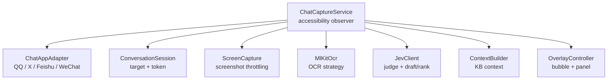
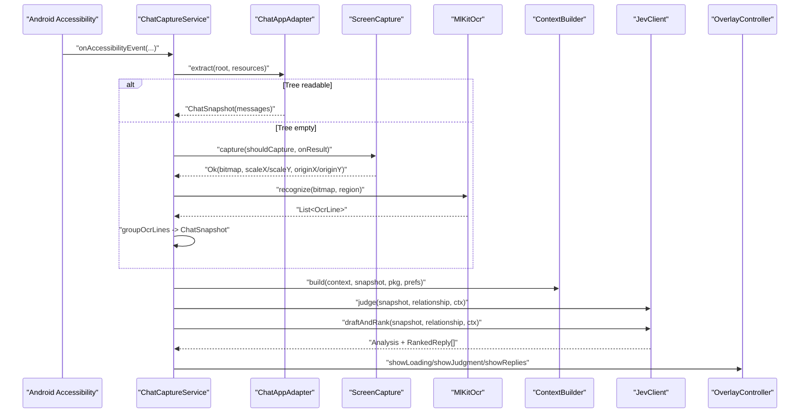
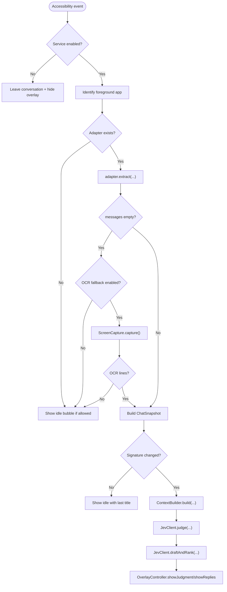
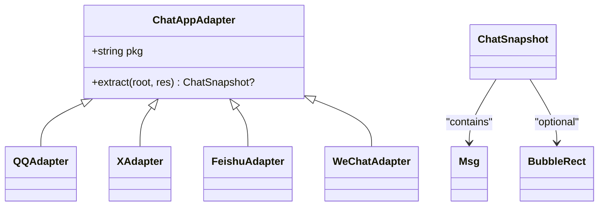
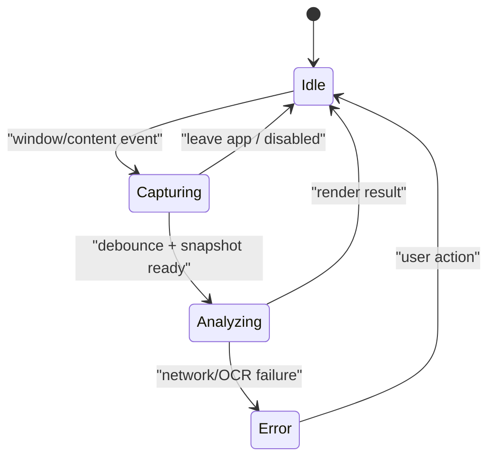
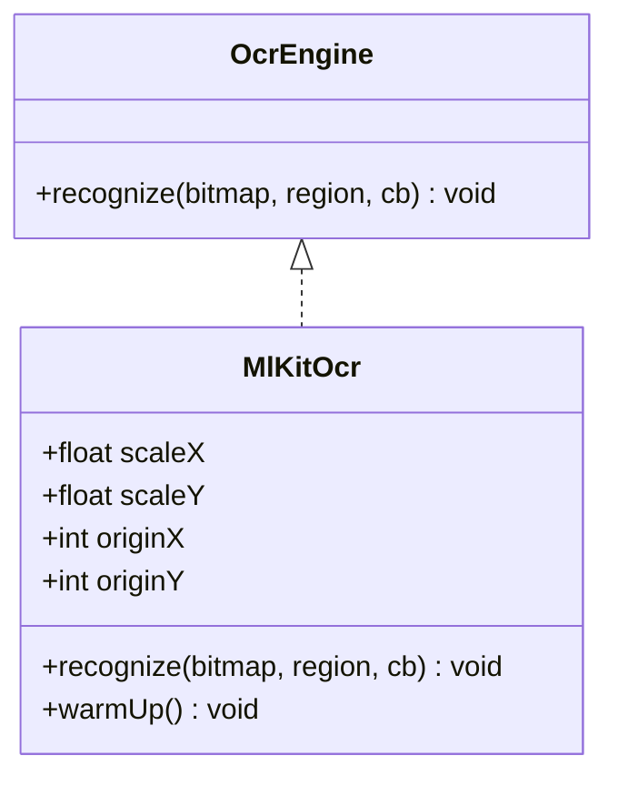
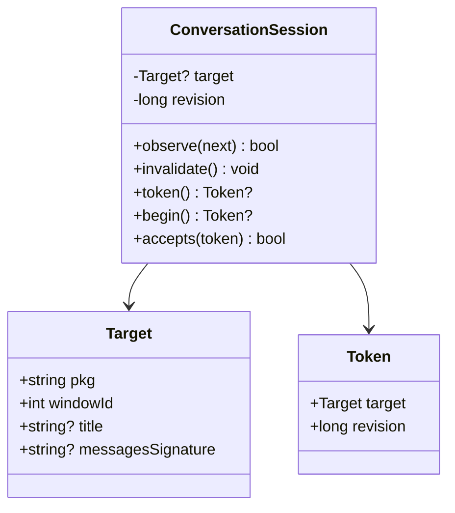
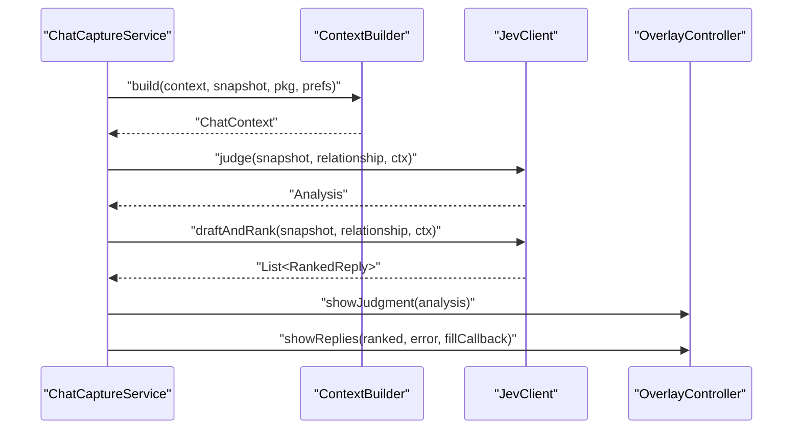
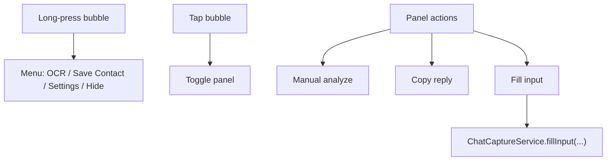
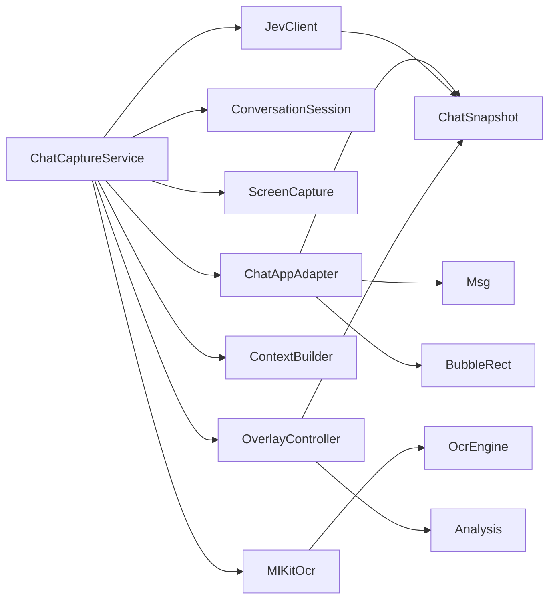

# Component Relationships

<cite>
**Referenced Files in This Document**
- [ChatCaptureService.kt](file://app/src/main/java/com/jev/probe/capture/ChatCaptureService.kt)
- [ChatAppAdapter.kt](file://app/src/main/java/com/jev/probe/capture/ChatAppAdapter.kt)
- [ConversationSession.kt](file://app/src/main/java/com/jev/probe/capture/ConversationSession.kt)
- [OcrEngine.kt](file://app/src/main/java/com/jev/probe/capture/ocr/OcrEngine.kt)
- [MlKitOcr.kt](file://app/src/main/java/com/jev/probe/capture/ocr/MlKitOcr.kt)
- [ScreenCapture.kt](file://app/src/main/java/com/jev/probe/capture/ocr/ScreenCapture.kt)
- [ChatModels.kt](file://app/src/main/java/com/jev/probe/core/ChatModels.kt)
- [JevClient.kt](file://app/src/main/java/com/jev/probe/jev/JevClient.kt)
- [ContextBuilder.kt](file://app/src/main/java/com/jev/probe/core/kb/ContextBuilder.kt)
- [OverlayController.kt](file://app/src/main/java/com/jev/probe/overlay/OverlayController.kt)
</cite>

## Table of Contents
1. [Introduction](#introduction)
2. [Project Structure](#project-structure)
3. [Core Components](#core-components)
4. [Architecture Overview](#architecture-overview)
5. [Detailed Component Analysis](#detailed-component-analysis)
6. [Dependency Analysis](#dependency-analysis)
7. [Performance Considerations](#performance-considerations)
8. [Troubleshooting Guide](#troubleshooting-guide)
9. [Conclusion](#conclusion)

## Introduction
This document explains how Jev Chat Jarvis orchestrates real-time chat capture, OCR fallback, AI analysis, and user feedback. The central coordinator is `ChatCaptureService`, which listens to Android accessibility events, selects a per-app adapter, builds a normalized conversation snapshot, optionally runs OCR on a screenshot, enriches the request with knowledge-base context, calls the AI client, and drives the floating overlay.

The codebase uses three key design patterns:
- Adapter pattern for supporting multiple chat platforms through one unified interface.
- Observer pattern via Android’s `AccessibilityService` for event-driven monitoring.
- Strategy pattern for OCR engines, currently implemented by ML Kit but designed to accept other backends.

## Project Structure
The relevant runtime components live under `com.jev.probe`:
- `capture`: service orchestration, adapters, session state, and OCR.
- `core`: shared data models and knowledge-base helpers.
- `jev`: AI client facade.
- `overlay`: floating UI controller.



**Diagram sources**
- [ChatCaptureService.kt:43-800](file://app/src/main/java/com/jev/probe/capture/ChatCaptureService.kt#L43-L800)
- [ChatAppAdapter.kt:27-511](file://app/src/main/java/com/jev/probe/capture/ChatAppAdapter.kt#L27-L511)
- [ConversationSession.kt:4-35](file://app/src/main/java/com/jev/probe/capture/ConversationSession.kt#L4-L35)
- [ScreenCapture.kt:35-221](file://app/src/main/java/com/jev/probe/capture/ocr/ScreenCapture.kt#L35-L221)
- [MlKitOcr.kt:26-114](file://app/src/main/java/com/jev/probe/capture/ocr/MlKitOcr.kt#L26-L114)
- [JevClient.kt:14-44](file://app/src/main/java/com/jev/probe/jev/JevClient.kt#L14-L44)
- [ContextBuilder.kt:16-124](file://app/src/main/java/com/jev/probe/core/kb/ContextBuilder.kt#L16-L124)
- [OverlayController.kt:38-608](file://app/src/main/java/com/jev/probe/overlay/OverlayController.kt#L38-L608)

**Section sources**
- [ChatCaptureService.kt:29-42](file://app/src/main/java/com/jev/probe/capture/ChatCaptureService.kt#L29-L42)
- [ChatAppAdapter.kt:10-30](file://app/src/main/java/com/jev/probe/capture/ChatAppAdapter.kt#L10-L30)

## Core Components
- `ChatCaptureService`: main-thread observer, worker pool, session manager, OCR pipeline, AI call coordination, and overlay control.
- `ChatAppAdapter` plus QQ/X/Feishu/WeChat implementations: normalize each app’s tree into `ChatSnapshot`.
- `ConversationSession`: tracks the active target and validates that background tasks still belong to the same conversation.
- `OcrEngine` and `MlKitOcr`: strategy interface and current ML Kit implementation.
- `ScreenCapture`: safe, throttled screenshot helper returning bitmap metadata and human-readable error codes.
- `ChatSnapshot`, `Msg`, `BubbleRect`, `Analysis`: shared data structures passed between layers.
- `JevClient`: facade over judgment and reply ranking endpoints.
- `ContextBuilder`: lightweight knowledge-base context builder.
- `OverlayController`: bubble menu, loading states, judgment display, candidate replies, and input-filling callbacks.

**Section sources**
- [ChatCaptureService.kt:43-800](file://app/src/main/java/com/jev/probe/capture/ChatCaptureService.kt#L43-L800)
- [ChatAppAdapter.kt:27-511](file://app/src/main/java/com/jev/probe/capture/ChatAppAdapter.kt#L27-L511)
- [ConversationSession.kt:4-35](file://app/src/main/java/com/jev/probe/capture/ConversationSession.kt#L4-L35)
- [OcrEngine.kt:6-22](file://app/src/main/java/com/jev/probe/capture/ocr/OcrEngine.kt#L6-L22)
- [MlKitOcr.kt:26-114](file://app/src/main/java/com/jev/probe/capture/ocr/MlKitOcr.kt#L26-L114)
- [ScreenCapture.kt:35-221](file://app/src/main/java/com/jev/probe/capture/ocr/ScreenCapture.kt#L35-L221)
- [ChatModels.kt:5-59](file://app/src/main/java/com/jev/probe/core/ChatModels.kt#L5-L59)
- [JevClient.kt:14-44](file://app/src/main/java/com/jev/probe/jev/JevClient.kt#L14-L44)
- [ContextBuilder.kt:16-124](file://app/src/main/java/com/jev/probe/core/kb/ContextBuilder.kt#L16-L124)
- [OverlayController.kt:38-608](file://app/src/main/java/com/jev/probe/overlay/OverlayController.kt#L38-L608)

## Architecture Overview
At runtime, `ChatCaptureService` is an `AccessibilityService`. It observes window changes and content updates, identifies the foreground app, delegates tree parsing to the matching `ChatAppAdapter`, and produces a `ChatSnapshot`. If the tree has no message text, it falls back to `ScreenCapture` + `MlKitOcr`. Once a snapshot is ready, it builds KB context, calls `JevClient` for judgment and ranked replies, and renders results through `OverlayController`.



**Diagram sources**
- [ChatCaptureService.kt:239-455](file://app/src/main/java/com/jev/probe/capture/ChatCaptureService.kt#L239-L455)
- [ChatAppAdapter.kt:27-30](file://app/src/main/java/com/jev/probe/capture/ChatAppAdapter.kt#L27-L30)
- [ScreenCapture.kt:65-93](file://app/src/main/java/com/jev/probe/capture/ocr/ScreenCapture.kt#L65-L93)
- [MlKitOcr.kt:39-95](file://app/src/main/java/com/jev/probe/capture/ocr/MlKitOcr.kt#L39-L95)
- [ContextBuilder.kt:35-63](file://app/src/main/java/com/jev/probe/core/kb/ContextBuilder.kt#L35-L63)
- [JevClient.kt:23-34](file://app/src/main/java/com/jev/probe/jev/JevClient.kt#L23-L34)
- [OverlayController.kt:331-416](file://app/src/main/java/com/jev/probe/overlay/OverlayController.kt#L331-L416)

## Detailed Component Analysis

### ChatCaptureService: Pipeline Orchestrator
`ChatCaptureService` is the single entry point for the capture pipeline. Responsibilities include:
- Maintaining a fixed worker pool for off-main analysis work.
- Selecting the correct `ChatAppAdapter` by package name.
- Debouncing rapid content changes before analysis.
- Managing `ConversationSession` tokens so stale network or OCR work does not overwrite newer conversations.
- Switching between direct tree capture and OCR fallback.
- Invoking `JevClient` for judgment and reply ranking.
- Driving `OverlayController` for idle, loading, paywall, error, judgment, and reply states.

Key behaviors:
- Automatic capture triggers only when the newest message is from the other side and auto-analyze is enabled; otherwise the bubble shows an idle prompt.
- Manual capture bypasses strict liveness checks and can operate even when the tree cannot be read.
- OCR fallback is gated by preference, screen signature deduplication, and a busy flag.
- Input filling uses `GuardedInputWriter` with retry, focus, paste, and clipboard fallbacks.



**Diagram sources**
- [ChatCaptureService.kt:239-455](file://app/src/main/java/com/jev/probe/capture/ChatCaptureService.kt#L239-L455)
- [ChatCaptureService.kt:465-702](file://app/src/main/java/com/jev/probe/capture/ChatCaptureService.kt#L465-L702)

**Section sources**
- [ChatCaptureService.kt:43-800](file://app/src/main/java/com/jev/probe/capture/ChatCaptureService.kt#L43-L800)

### Adapter Pattern: ChatAppAdapter Implementations
`ChatAppAdapter` defines a uniform contract:
- `pkg`: package identifier.
- `extract(root, res)`: returns `null` when not in a chat window, an empty-message `ChatSnapshot` when in a chat but the tree carries no text, or a populated `ChatSnapshot` otherwise.

Implementations:
- `QQAdapter`: reads stable view IDs, detects input presence, infers sender side by avatar edge geometry.
- `XAdapter`: parses Compose DM rows from `contentDescription`, strips timestamps and read receipts, guards against DM list screens.
- `FeishuAdapter`: treats message bodies as drawn text; provides bubble rectangles for rect-by-rect OCR while extracting what little text the tree exposes.
- `WeChatAdapter`: relies on a stable bubble container ID; handles obfuscated trees where text may be stripped, making OCR fallback essential.

Shared utilities:
- `findTitleInActionBar`: finds a plausible top-bar title above the first bubble.
- `findWeChatTitle`: stricter title selection for WeChat group chats.
- `collectFeishuBubbleRects`: extracts bubble geometry and inferred side for OCR targeting.



**Diagram sources**
- [ChatAppAdapter.kt:27-511](file://app/src/main/java/com/jev/probe/capture/ChatAppAdapter.kt#L27-L511)
- [ChatModels.kt:5-38](file://app/src/main/java/com/jev/probe/core/ChatModels.kt#L5-L38)

**Section sources**
- [ChatAppAdapter.kt:10-30](file://app/src/main/java/com/jev/probe/capture/ChatAppAdapter.kt#L10-L30)
- [ChatAppAdapter.kt:139-179](file://app/src/main/java/com/jev/probe/capture/ChatAppAdapter.kt#L139-L179)
- [ChatAppAdapter.kt:197-247](file://app/src/main/java/com/jev/probe/capture/ChatAppAdapter.kt#L197-L247)
- [ChatAppAdapter.kt:319-376](file://app/src/main/java/com/jev/probe/capture/ChatAppAdapter.kt#L319-L376)
- [ChatAppAdapter.kt:440-510](file://app/src/main/java/com/jev/probe/capture/ChatAppAdapter.kt#L440-L510)

### Observer Pattern: Accessibility Event Handling
`ChatCaptureService` extends `AccessibilityService` and overrides `onAccessibilityEvent`. It reacts to:
- Window state changes to detect leaving or entering a chat app.
- Content changes and scrolls to trigger debounced capture.
- Foreground package mismatches to park or hide the overlay.

The observer logic also distinguishes:
- Automatic mode, which requires both a valid adapter and a readable title.
- Manual mode, which holds onto the original window even when the adapter cannot confirm a chat window.



**Diagram sources**
- [ChatCaptureService.kt:239-360](file://app/src/main/java/com/jev/probe/capture/ChatCaptureService.kt#L239-L360)

**Section sources**
- [ChatCaptureService.kt:239-360](file://app/src/main/java/com/jev/probe/capture/ChatCaptureService.kt#L239-L360)

### Strategy Pattern: OCR Engine Implementations
`OcrEngine` defines a simple strategy interface:
- `recognize(bitmap, region, callback)`
- Callback delivers recognized lines on the main thread.
- Failures return an empty list rather than throwing.

`MlKitOcr` is the current strategy:
- Uses bundled Chinese ML Kit recognizer.
- Converts bitmap-region coordinates back to screen coordinates.
- Warms up the recognizer during service connection to avoid first-use latency.



**Diagram sources**
- [OcrEngine.kt:6-22](file://app/src/main/java/com/jev/probe/capture/ocr/OcrEngine.kt#L6-L22)
- [MlKitOcr.kt:26-114](file://app/src/main/java/com/jev/probe/capture/ocr/MlKitOcr.kt#L26-L114)

**Section sources**
- [OcrEngine.kt:6-22](file://app/src/main/java/com/jev/probe/capture/ocr/OcrEngine.kt#L6-L22)
- [MlKitOcr.kt:13-25](file://app/src/main/java/com/jev/probe/capture/ocr/MlKitOcr.kt#L13-L25)
- [MlKitOcr.kt:39-95](file://app/src/main/java/com/jev/probe/capture/ocr/MlKitOcr.kt#L39-L95)

### Session State and Liveness Tokens
`ConversationSession` prevents stale analysis results from being applied after the user switches apps or leaves the conversation. It exposes:
- `observe(next)`: updates the active target and invalidates pending work.
- `token()`: captures the current target and revision.
- `begin()`: increments revision for a new analysis round.
- `accepts(token)`: validates that the token still matches the current target and revision.

This is used throughout `ChatCaptureService` to guard screenshot callbacks, OCR callbacks, and AI responses.



**Diagram sources**
- [ConversationSession.kt:4-35](file://app/src/main/java/com/jev/probe/capture/ConversationSession.kt#L4-L35)

**Section sources**
- [ConversationSession.kt:4-35](file://app/src/main/java/com/jev/probe/capture/ConversationSession.kt#L4-L35)
- [ChatCaptureService.kt:89-104](file://app/src/main/java/com/jev/probe/capture/ChatCaptureService.kt#L89-L104)
- [ChatCaptureService.kt:389-455](file://app/src/main/java/com/jev/probe/capture/ChatCaptureService.kt#L389-L455)

### Data Models Passed Between Layers
`ChatSnapshot` is the primary payload moving from adapters and OCR into context building and AI clients:
- `title`: conversation title.
- `messages`: ordered list of `Msg` with side `"me"` or `"other"`.
- `bubbleRects`: optional geometry for Feishu-style OCR.
- `note`: caveat string, such as when OCR was used.
- `signature()`: stable hash of recent messages used for deduplication.

`Analysis` carries judgment results and ranked replies back to the overlay.

```mermaid
erDiagram
CHAT_SNAPSHOT {
string? title
array messages
array bubble_rects
string? note
}
MSG {
string side
string text
}
BUBBLE_RECT {
int left
int top
int right
int bottom
string side
}
ANALYSIS {
Choice true_intent
Score danger_level
Choice she_needs
double should_reply_now
Choice best_action
double tension_resolved
double literal_question
array ranked_replies
long latency_ms
string? error
bool paywall
}
CHAT_SNAPSHOT ||--o{ MSG : "contains"
CHAT_SNAPSHOT ||--o{ BUBBLE_RECT : "optional"
```

**Diagram sources**
- [ChatModels.kt:5-59](file://app/src/main/java/com/jev/probe/core/ChatModels.kt#L5-L59)

**Section sources**
- [ChatModels.kt:5-59](file://app/src/main/java/com/jev/probe/core/ChatModels.kt#L5-L59)

### AI Client Facade and Context Building
`JevClient` hides split concerns:
- `judge`: sends the snapshot and relationship to the judgment endpoint.
- `draftAndRank`: drafts candidate replies and ranks them using the judgment route.
- `analyze`: sequential convenience method used for connectivity testing.

`ContextBuilder` turns the snapshot into lightweight knowledge-base context:
- Finds a contact by title/app.
- Appends recent history and filters out on-screen duplicates.
- Matches notes by tags/title against conversation title and recent messages.
- Enforces a character budget across notes and history.



**Diagram sources**
- [ChatCaptureService.kt:404-455](file://app/src/main/java/com/jev/probe/capture/ChatCaptureService.kt#L404-L455)
- [ContextBuilder.kt:35-63](file://app/src/main/java/com/jev/probe/core/kb/ContextBuilder.kt#L35-L63)
- [JevClient.kt:23-42](file://app/src/main/java/com/jev/probe/jev/JevClient.kt#L23-L42)
- [OverlayController.kt:405-416](file://app/src/main/java/com/jev/probe/overlay/OverlayController.kt#L405-L416)

**Section sources**
- [JevClient.kt:9-44](file://app/src/main/java/com/jev/probe/jev/JevClient.kt#L9-L44)
- [ContextBuilder.kt:8-15](file://app/src/main/java/com/jev/probe/core/kb/ContextBuilder.kt#L8-L15)
- [ContextBuilder.kt:35-124](file://app/src/main/java/com/jev/probe/core/kb/ContextBuilder.kt#L35-L124)

### Overlay Controller: User Interaction Surface
`OverlayController` manages:
- Draggable bubble with long-press menu.
- Expanded panel showing judgment, context usage, OCR caveats, danger badge, and candidate replies.
- Actions: manual analyze, save contact, OCR capture, settings navigation, copy, and fill input.
- States: idle, loading, error, paywall, notice, judgment, and replies.

It never sends messages; it only copies or fills the input box, leaving sending to the user.



**Diagram sources**
- [OverlayController.kt:198-249](file://app/src/main/java/com/jev/probe/overlay/OverlayController.kt#L198-L249)
- [OverlayController.kt:288-416](file://app/src/main/java/com/jev/probe/overlay/OverlayController.kt#L288-L416)
- [ChatCaptureService.kt:732-763](file://app/src/main/java/com/jev/probe/capture/ChatCaptureService.kt#L732-L763)

**Section sources**
- [OverlayController.kt:29-37](file://app/src/main/java/com/jev/probe/overlay/OverlayController.kt#L29-L37)
- [OverlayController.kt:198-249](file://app/src/main/java/com/jev/probe/overlay/OverlayController.kt#L198-L249)
- [OverlayController.kt:288-416](file://app/src/main/java/com/jev/probe/overlay/OverlayController.kt#L288-L416)

## Dependency Analysis
The following diagram maps runtime dependencies among core classes:



**Diagram sources**
- [ChatCaptureService.kt:43-800](file://app/src/main/java/com/jev/probe/capture/ChatCaptureService.kt#L43-L800)
- [ChatAppAdapter.kt:27-511](file://app/src/main/java/com/jev/probe/capture/ChatAppAdapter.kt#L27-L511)
- [ConversationSession.kt:4-35](file://app/src/main/java/com/jev/probe/capture/ConversationSession.kt#L4-L35)
- [ScreenCapture.kt:35-221](file://app/src/main/java/com/jev/probe/capture/ocr/ScreenCapture.kt#L35-L221)
- [MlKitOcr.kt:26-114](file://app/src/main/java/com/jev/probe/capture/ocr/MlKitOcr.kt#L26-L114)
- [OcrEngine.kt:6-22](file://app/src/main/java/com/jev/probe/capture/ocr/OcrEngine.kt#L6-L22)
- [ContextBuilder.kt:16-124](file://app/src/main/java/com/jev/probe/core/kb/ContextBuilder.kt#L16-L124)
- [JevClient.kt:14-44](file://app/src/main/java/com/jev/probe/jev/JevClient.kt#L14-L44)
- [OverlayController.kt:38-608](file://app/src/main/java/com/jev/probe/overlay/OverlayController.kt#L38-L608)
- [ChatModels.kt:5-59](file://app/src/main/java/com/jev/probe/core/ChatModels.kt#L5-L59)

**Section sources**
- [ChatCaptureService.kt:43-800](file://app/src/main/java/com/jev/probe/capture/ChatCaptureService.kt#L43-L800)
- [ChatAppAdapter.kt:27-511](file://app/src/main/java/com/jev/probe/capture/ChatAppAdapter.kt#L27-L511)
- [ChatModels.kt:5-59](file://app/src/main/java/com/jev/probe/core/ChatModels.kt#L5-L59)

## Performance Considerations
- Worker pool: `ChatCaptureService` uses a fixed-size executor for analysis tasks, keeping UI responsive.
- Debounce: content-change events are coalesced with an 800ms delay to avoid repeated analysis.
- Signature deduplication: `ChatSnapshot.signature()` compares recent messages to skip unchanged conversations.
- OCR throttle: `ScreenCapture` enforces a minimum interval and exponential backoff on failures.
- Model warm-up: ML Kit recognizer is warmed up during service connection to reduce first-use latency.
- Context budget: `ContextBuilder` caps notes and history at a fixed character limit and trims oldest entries first.
- Overlay redraw cost: the overlay avoids unnecessary rebuilds and reuses last judgment/reply state until a new conversation begins.

[No sources needed since this section provides general guidance]

## Troubleshooting Guide
Common issues and their handling:

- No accessible tree:
  - Manual OCR path logs when `rootInActiveWindow` is null and tells the user to toggle accessibility.
  - When an adapter finds no chat window, the service logs node IDs and counts without logging message content.

- Screenshot failures:
  - `ScreenCapture` returns structured error codes: throttled, timeout, internal, protected window, etc.
  - Human-readable messages are shown to the user; transient timing errors are suppressed for automatic paths.

- OCR empty results:
  - OCR fallback clears its busy flag and either shows an error for manual taps or silently retries later.
  - For automatic Feishu-style captures, the signature is reset so future events can retry.

- AI errors and paywall:
  - Judgment errors are displayed in the overlay.
  - Paywall responses open the billing flow and refresh entitlements asynchronously.
  - Reply drafting errors are surfaced as a non-fatal note in the panel.

- Stale conversation writes:
  - `ConversationSession` tokens prevent writing into a different chat after the user switches apps.
  - If the target becomes invalid, input filling falls back to copying text to the clipboard.

**Section sources**
- [ChatCaptureService.kt:465-524](file://app/src/main/java/com/jev/probe/capture/ChatCaptureService.kt#L465-L524)
- [ChatCaptureService.kt:548-702](file://app/src/main/java/com/jev/probe/capture/ChatCaptureService.kt#L548-L702)
- [ChatCaptureService.kt:732-792](file://app/src/main/java/com/jev/probe/capture/ChatCaptureService.kt#L732-L792)
- [ScreenCapture.kt:65-93](file://app/src/main/java/com/jev/probe/capture/ocr/ScreenCapture.kt#L65-L93)
- [ScreenCapture.kt:155-176](file://app/src/main/java/com/jev/probe/capture/ocr/ScreenCapture.kt#L155-L176)
- [ScreenCapture.kt:208-218](file://app/src/main/java/com/jev/probe/capture/ocr/ScreenCapture.kt#L208-L218)
- [ChatCaptureService.kt:404-455](file://app/src/main/java/com/jev/probe/capture/ChatCaptureService.kt#L404-L455)

## Conclusion
Jev Chat Jarvis combines an observer-driven accessibility pipeline with an adapter-based multi-platform capture layer, a strategy-based OCR fallback, and a clean AI client facade. `ChatCaptureService` is the central orchestrator, ensuring that platform differences are isolated, OCR failures are handled gracefully, stale work is invalidated, and the user always sees actionable feedback through the overlay. The design makes it straightforward to add new chat platforms by implementing `ChatAppAdapter`, swap OCR backends by implementing `OcrEngine`, and extend AI behavior by composing additional routes through `JevClient`.

[No sources needed since this section summarizes without analyzing specific files]