# Core Architecture

<cite>
**Referenced Files in This Document**
- [ChatCaptureService.kt](file://app/src/main/java/com/jev/probe/capture/ChatCaptureService.kt)
- [ChatAppAdapter.kt](file://app/src/main/java/com/jev/probe/capture/ChatAppAdapter.kt)
- [ConversationSession.kt](file://app/src/main/java/com/jev/probe/capture/ConversationSession.kt)
- [OcrEngine.kt](file://app/src/main/java/com/jev/probe/capture/ocr/OcrEngine.kt)
- [MlKitOcr.kt](file://app/src/main/java/com/jev/probe/capture/ocr/MlKitOcr.kt)
- [ChatModels.kt](file://app/src/main/java/com/jev/probe/core/ChatModels.kt)
- [ContextBuilder.kt](file://app/src/main/java/com/jev/probe/core/kb/ContextBuilder.kt)
- [JevClient.kt](file://app/src/main/java/com/jev/probe/jev/JevClient.kt)
- [JudgeClient.kt](file://app/src/main/java/com/jev/probe/jev/JudgeClient.kt)
- [ReplyClient.kt](file://app/src/main/java/com/jev/probe/jev/ReplyClient.kt)
- [OverlayController.kt](file://app/src/main/java/com/jev/probe/overlay/OverlayController.kt)
- [GuardedInputWriter.kt](file://app/src/main/java/com/jev/probe/capture/GuardedInputWriter.kt)
- [MainActivity.kt](file://app/src/main/java/com/jev/probe/MainActivity.kt)
- [KnowledgeActivity.kt](file://app/src/main/java/com/jev/probe/KnowledgeActivity.kt)
</cite>

## Table of Contents
1. [Introduction](#introduction)
2. [Project Structure](#project-structure)
3. [Core Components](#core-components)
4. [Architecture Overview](#architecture-overview)
5. [Detailed Component Analysis](#detailed-component-analysis)
6. [Dependency Analysis](#dependency-analysis)
7. [Performance Considerations](#performance-considerations)
8. [Troubleshooting Guide](#troubleshooting-guide)
9. [Conclusion](#conclusion)

## Introduction
This document describes the core architecture of Jev Chat Jarvis, an Android assistant that observes chat conversations through an accessibility service, captures messages from multiple apps, runs local OCR when needed, builds contextual knowledge, and calls external AI endpoints to produce judgment and candidate replies. The system is organized into clear layers:

- Presentation layer: Activities and a floating overlay for user interaction.
- Service layer: An accessibility-based background service that listens for UI changes and orchestrates capture.
- Business logic layer: Conversation session management, context building, and analysis orchestration.
- Data layer: Local knowledge base, preferences, and conversation history.
- Integration layer: HTTP clients for judgment, reply generation, and optional hosted billing.

The design emphasizes privacy-first processing: OCR runs locally using a bundled model, screenshots are not uploaded, and sensitive data stays on device unless the user explicitly enables hosted mode.

## Project Structure
The relevant source code lives under `app/src/main/java/com/jev/probe`. Key packages:

- `capture`: Accessibility service, per-app adapters, OCR engine abstraction, conversation session state, and input writing helpers.
- `core`: Shared models such as message snapshots, analysis results, and preference access.
- `core.kb`: Knowledge base context builder and related data types.
- `jev`: External API integration facade and split clients for judgment and generative replies.
- `overlay`: Floating bubble and panel controller.
- Top-level activities: main setup screen and knowledge base manager.

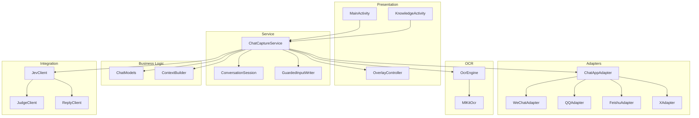

**Diagram sources**
- [MainActivity.kt:26-113](file://app/src/main/java/com/jev/probe/MainActivity.kt#L26-L113)
- [KnowledgeActivity.kt:24-74](file://app/src/main/java/com/jev/probe/KnowledgeActivity.kt#L24-L74)
- [ChatCaptureService.kt:29-42](file://app/src/main/java/com/jev/probe/capture/ChatCaptureService.kt#L29-L42)
- [ChatAppAdapter.kt:10-30](file://app/src/main/java/com/jev/probe/capture/ChatAppAdapter.kt#L10-L30)
- [OcrEngine.kt:9-22](file://app/src/main/java/com/jev/probe/capture/ocr/OcrEngine.kt#L9-L22)
- [ChatModels.kt:5-58](file://app/src/main/java/com/jev/probe/core/ChatModels.kt#L5-L58)
- [ContextBuilder.kt:8-15](file://app/src/main/java/com/jev/probe/core/kb/ContextBuilder.kt#L8-L15)
- [JevClient.kt:9-18](file://app/src/main/java/com/jev/probe/jev/JevClient.kt#L9-L18)

**Section sources**
- [MainActivity.kt:26-113](file://app/src/main/java/com/jev/probe/MainActivity.kt#L26-L113)
- [KnowledgeActivity.kt:24-74](file://app/src/main/java/com/jev/probe/KnowledgeActivity.kt#L24-L74)
- [ChatCaptureService.kt:29-42](file://app/src/main/java/com/jev/probe/capture/ChatCaptureService.kt#L29-L42)

## Core Components
The core runtime is centered around `ChatCaptureService`, which implements Android’s accessibility service contract. It:

- Observes window and content events.
- Selects the correct per-app adapter based on the foreground package.
- Builds a neutral `ChatSnapshot` representing the current conversation.
- Falls back to screenshot + OCR when the app hides message text.
- Builds knowledge context from the local knowledge base.
- Calls the Jev analysis pipeline.
- Drives the floating overlay with judgment, danger signals, and ranked reply candidates.
- Writes suggested replies into the target chat input without sending them automatically.

Key responsibilities by component:

| Component | Responsibility | Layer |
|---|---|---|
| `ChatCaptureService` | Accessibility event handling, session tracking, OCR coordination, analysis orchestration, overlay control | Service |
| `ChatAppAdapter` | Per-app extraction contract and implementations | Integration / Presentation bridge |
| `ConversationSession` | Target identity and token-based request lifecycle | Business Logic |
| `OcrEngine` / `MlKitOcr` | On-device text recognition over screenshots | Service / Data |
| `ChatModels` | Neutral snapshot, bubble geometry, analysis result shapes | Business Logic |
| `ContextBuilder` | Contact matching, note matching, history injection, budgeting | Business Logic |
| `JevClient` | Unified entry point for judgment and reply generation | Integration |
| `JudgeClient` | Judgment questions and ranking | Integration |
| `ReplyClient` | Generative reply drafting | Integration |
| `OverlayController` | Bubble, menu, panel rendering, user actions | Presentation |
| `GuardedInputWriter` | Safe, retrying input fill with clipboard fallback | Service |
| `MainActivity` | Setup, permissions, hosted mode consent | Presentation |
| `KnowledgeActivity` | Notes and contacts editing | Presentation / Data |

**Section sources**
- [ChatCaptureService.kt:29-42](file://app/src/main/java/com/jev/probe/capture/ChatCaptureService.kt#L29-L42)
- [ChatAppAdapter.kt:10-30](file://app/src/main/java/com/jev/probe/capture/ChatAppAdapter.kt#L10-L30)
- [ConversationSession.kt:3-35](file://app/src/main/java/com/jev/probe/capture/ConversationSession.kt#L3-L35)
- [OcrEngine.kt:9-22](file://app/src/main/java/com/jev/probe/capture/ocr/OcrEngine.kt#L9-L22)
- [MlKitOcr.kt:13-25](file://app/src/main/java/com/jev/probe/capture/ocr/MlKitOcr.kt#L13-L25)
- [ChatModels.kt:5-58](file://app/src/main/java/com/jev/probe/core/ChatModels.kt#L5-L58)
- [ContextBuilder.kt:8-15](file://app/src/main/java/com/jev/probe/core/kb/ContextBuilder.kt#L8-L15)
- [JevClient.kt:9-18](file://app/src/main/java/com/jev/probe/jev/JevClient.kt#L9-L18)
- [JudgeClient.kt:14-18](file://app/src/main/java/com/jev/probe/jev/JudgeClient.kt#L14-L18)
- [ReplyClient.kt:10-18](file://app/src/main/java/com/jev/probe/jev/ReplyClient.kt#L10-L18)
- [OverlayController.kt:29-37](file://app/src/main/java/com/jev/probe/overlay/OverlayController.kt#L29-L37)
- [GuardedInputWriter.kt:3-15](file://app/src/main/java/com/jev/probe/capture/GuardedInputWriter.kt#L3-L15)
- [MainActivity.kt:26-37](file://app/src/main/java/com/jev/probe/MainActivity.kt#L26-L37)
- [KnowledgeActivity.kt:24-31](file://app/src/main/java/com/jev/probe/KnowledgeActivity.kt#L24-L31)

## Architecture Overview
At runtime, the system follows this flow:

1. Android invokes the accessibility service when the user enables it.
2. `ChatCaptureService` registers callbacks for window and content changes.
3. For each relevant event, it asks the matched `ChatAppAdapter` to extract a `ChatSnapshot`.
4. If the adapter cannot read message text, it returns an empty message list; the service then triggers a screenshot and OCR.
5. Once a stable snapshot exists, the service debounces rapid events and decides whether to show an idle bubble or start analysis.
6. Context is built from the knowledge base and recent history.
7. The Jev client calls judgment and reply generation off the main thread.
8. Results update the overlay, where users can copy or fill suggested replies.

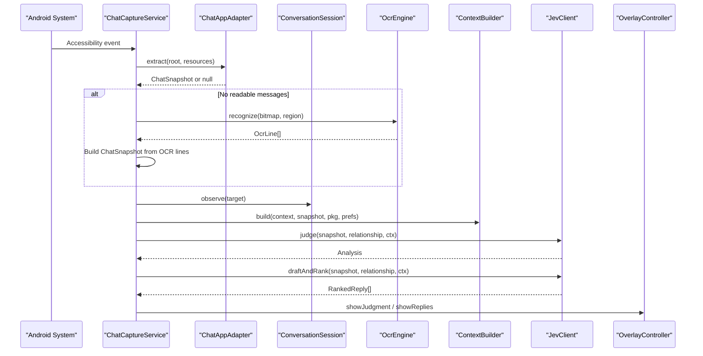

**Diagram sources**
- [ChatCaptureService.kt:239-360](file://app/src/main/java/com/jev/probe/capture/ChatCaptureService.kt#L239-L360)
- [ChatAppAdapter.kt:10-30](file://app/src/main/java/com/jev/probe/capture/ChatAppAdapter.kt#L10-L30)
- [ConversationSession.kt:17-34](file://app/src/main/java/com/jev/probe/capture/ConversationSession.kt#L17-L34)
- [OcrEngine.kt:20-22](file://app/src/main/java/com/jev/probe/capture/ocr/OcrEngine.kt#L20-L22)
- [ContextBuilder.kt:35-62](file://app/src/main/java/com/jev/probe/core/kb/ContextBuilder.kt#L35-L62)
- [JevClient.kt:22-42](file://app/src/main/java/com/jev/probe/jev/JevClient.kt#L22-L42)
- [OverlayController.kt:405-416](file://app/src/main/java/com/jev/probe/overlay/OverlayController.kt#L405-L416)

## Detailed Component Analysis

### Accessibility Service and Event Handling
`ChatCaptureService` is the central orchestrator. It:

- Maintains a fixed worker pool for analysis tasks.
- Tracks the active conversation through `ConversationSession`.
- Debounces rapid content changes before analysis.
- Handles both automatic capture and manual capture triggered from the overlay.
- Coordinates OCR via `ScreenCapture` and `MlKitOcr`.
- Updates the overlay with loading, judgment, replies, errors, and paywall states.
- Safely writes suggested replies into the target chat input.

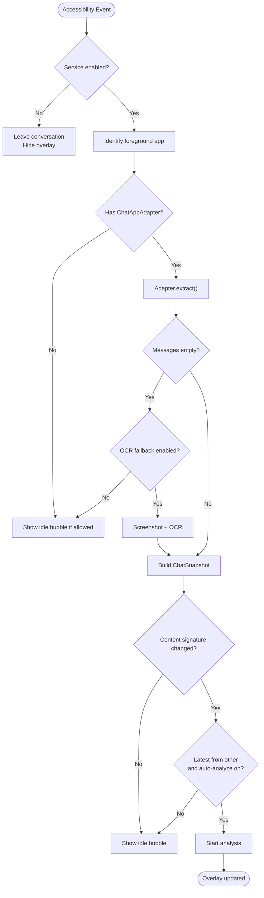

**Diagram sources**
- [ChatCaptureService.kt:239-360](file://app/src/main/java/com/jev/probe/capture/ChatCaptureService.kt#L239-L360)
- [ChatCaptureService.kt:389-455](file://app/src/main/java/com/jev/probe/capture/ChatCaptureService.kt#L389-L455)

**Section sources**
- [ChatCaptureService.kt:43-76](file://app/src/main/java/com/jev/probe/capture/ChatCaptureService.kt#L43-L76)
- [ChatCaptureService.kt:239-360](file://app/src/main/java/com/jev/probe/capture/ChatCaptureService.kt#L239-L360)
- [ChatCaptureService.kt:389-455](file://app/src/main/java/com/jev/probe/capture/ChatCaptureService.kt#L389-L455)

### Adapter Pattern for Multi-Platform Chat Support
The adapter pattern isolates per-app UI differences behind a single interface. Each adapter knows how to detect whether the current window is a chat, extract the title, identify message bubbles, and infer sender side.

Supported adapters include:

- WeChat adapter: detects bubble containers and uses horizontal position to infer sender side.
- QQ adapter: reads plain message nodes and avatar-edge geometry.
- Feishu adapter: extracts bubble rectangles because message text is drawn rather than exposed as views.
- X adapter: parses message rows from content descriptions and strips timestamps/read receipts.

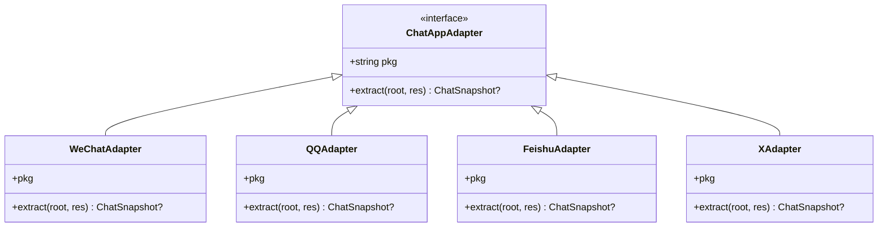

**Diagram sources**
- [ChatAppAdapter.kt:27-30](file://app/src/main/java/com/jev/probe/capture/ChatAppAdapter.kt#L27-L30)
- [ChatAppAdapter.kt:139-179](file://app/src/main/java/com/jev/probe/capture/ChatAppAdapter.kt#L139-L179)
- [ChatAppAdapter.kt:197-247](file://app/src/main/java/com/jev/probe/capture/ChatAppAdapter.kt#L197-L247)
- [ChatAppAdapter.kt:319-376](file://app/src/main/java/com/jev/probe/capture/ChatAppAdapter.kt#L319-L376)
- [ChatAppAdapter.kt:440-510](file://app/src/main/java/com/jev/probe/capture/ChatAppAdapter.kt#L440-L510)

**Section sources**
- [ChatAppAdapter.kt:10-30](file://app/src/main/java/com/jev/probe/capture/ChatAppAdapter.kt#L10-L30)
- [ChatAppAdapter.kt:139-179](file://app/src/main/java/com/jev/probe/capture/ChatAppAdapter.kt#L139-L179)
- [ChatAppAdapter.kt:197-247](file://app/src/main/java/com/jev/probe/capture/ChatAppAdapter.kt#L197-L247)
- [ChatAppAdapter.kt:319-376](file://app/src/main/java/com/jev/probe/capture/ChatAppAdapter.kt#L319-L376)
- [ChatAppAdapter.kt:440-510](file://app/src/main/java/com/jev/probe/capture/ChatAppAdapter.kt#L440-L510)

### Observer Pattern for Accessibility Events
`ChatCaptureService` extends `AccessibilityService` and implements the observer pattern by reacting to specific event types:

- Window state changes determine whether the service should leave a conversation or park an idle bubble.
- Content changes and scroll events trigger potential capture.
- The service validates the live foreground window rather than trusting the event’s package alone.

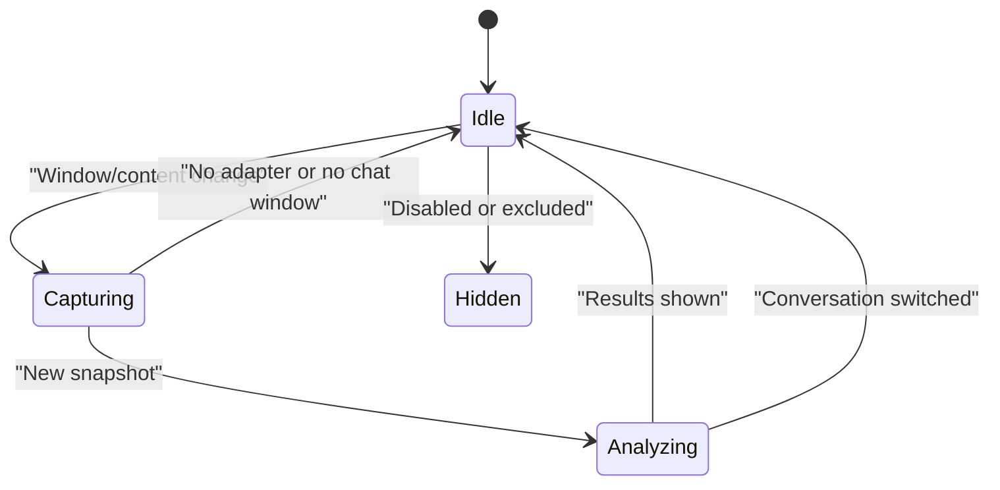

**Diagram sources**
- [ChatCaptureService.kt:239-273](file://app/src/main/java/com/jev/probe/capture/ChatCaptureService.kt#L239-L273)
- [ChatCaptureService.kt:275-360](file://app/src/main/java/com/jev/probe/capture/ChatCaptureService.kt#L275-L360)

**Section sources**
- [ChatCaptureService.kt:239-273](file://app/src/main/java/com/jev/probe/capture/ChatCaptureService.kt#L239-L273)
- [ChatCaptureService.kt:275-360](file://app/src/main/java/com/jev/probe/capture/ChatCaptureService.kt#L275-L360)

### Strategy Pattern for OCR Engine Implementations
The OCR path is abstracted through `OcrEngine`. Currently, `MlKitOcr` is the only implementation, but the interface allows future engines to be swapped without changing the service logic.

Key characteristics:

- Recognizes text over a bitmap, optionally over a cropped region.
- Converts ML Kit bitmap coordinates back to screen coordinates.
- Posts results to the main thread.
- Uses a bundled Chinese recognizer so OCR works without Google Play services.

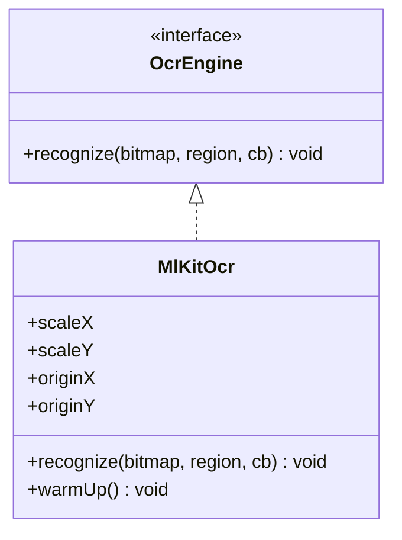

**Diagram sources**
- [OcrEngine.kt:9-22](file://app/src/main/java/com/jev/probe/capture/ocr/OcrEngine.kt#L9-L22)
- [MlKitOcr.kt:26-112](file://app/src/main/java/com/jev/probe/capture/ocr/MlKitOcr.kt#L26-L112)

**Section sources**
- [OcrEngine.kt:9-22](file://app/src/main/java/com/jev/probe/capture/ocr/OcrEngine.kt#L9-L22)
- [MlKitOcr.kt:13-25](file://app/src/main/java/com/jev/probe/capture/ocr/MlKitOcr.kt#L13-L25)
- [MlKitOcr.kt:39-95](file://app/src/main/java/com/jev/probe/capture/ocr/MlKitOcr.kt#L39-L95)

### Data Flow from Message Capture to Response Generation
The full pipeline connects capture, OCR, context, analysis, and presentation:

1. `ChatCaptureService` receives accessibility events.
2. It selects the correct adapter and extracts a `ChatSnapshot`.
3. If the tree has no message text, it takes a screenshot and runs OCR.
4. It deduplicates snapshots using a signature of recent messages.
5. It builds context from the knowledge base and recent history.
6. It calls judgment and reply generation concurrently.
7. It updates the overlay with judgment, danger level, intent, needs, action advice, and ranked replies.
8. Users can copy or fill replies; filling never sends automatically.

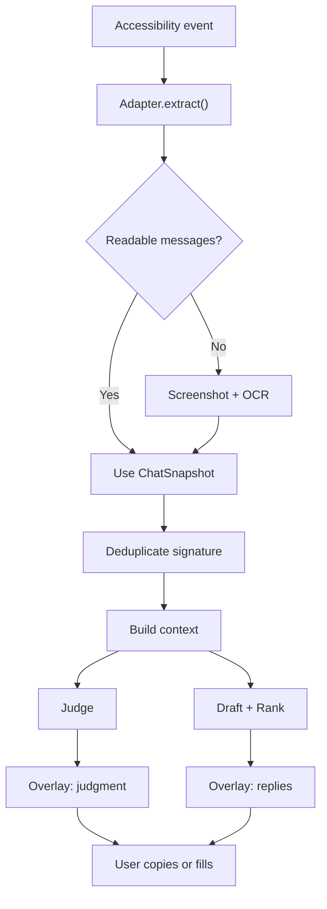

**Diagram sources**
- [ChatCaptureService.kt:275-360](file://app/src/main/java/com/jev/probe/capture/ChatCaptureService.kt#L275-L360)
- [ChatCaptureService.kt:389-455](file://app/src/main/java/com/jev/probe/capture/ChatCaptureService.kt#L389-L455)
- [ContextBuilder.kt:35-62](file://app/src/main/java/com/jev/probe/core/kb/ContextBuilder.kt#L35-L62)
- [JevClient.kt:22-42](file://app/src/main/java/com/jev/probe/jev/JevClient.kt#L22-L42)
- [OverlayController.kt:405-416](file://app/src/main/java/com/jev/probe/overlay/OverlayController.kt#L405-L416)

**Section sources**
- [ChatCaptureService.kt:275-360](file://app/src/main/java/com/jev/probe/capture/ChatCaptureService.kt#L275-L360)
- [ChatCaptureService.kt:389-455](file://app/src/main/java/com/jev/probe/capture/ChatCaptureService.kt#L389-L455)
- [ContextBuilder.kt:35-62](file://app/src/main/java/com/jev/probe/core/kb/ContextBuilder.kt#L35-L62)
- [JevClient.kt:22-42](file://app/src/main/java/com/jev/probe/jev/JevClient.kt#L22-L42)

### Component Relationships and Orchestration
`ChatCaptureService` is the hub:

- It owns the list of adapters keyed by package name.
- It creates and configures `ScreenCapture` and `MlKitOcr`.
- It manages `ConversationSession` tokens to avoid stale analysis after conversation switches.
- It constructs `JevClient` with current preferences.
- It drives `OverlayController` for all user-facing states.
- It uses `GuardedInputWriter` to safely write replies into the target app’s input field.

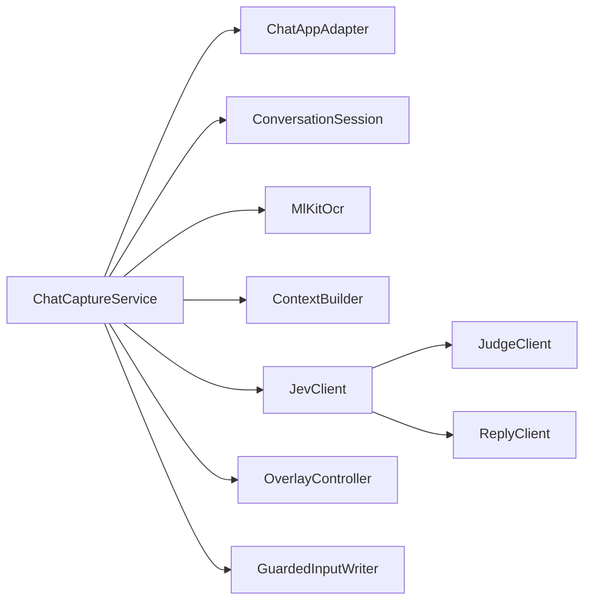

**Diagram sources**
- [ChatCaptureService.kt:43-76](file://app/src/main/java/com/jev/probe/capture/ChatCaptureService.kt#L43-L76)
- [ChatCaptureService.kt:190-196](file://app/src/main/java/com/jev/probe/capture/ChatCaptureService.kt#L190-L196)
- [ChatCaptureService.kt:404-455](file://app/src/main/java/com/jev/probe/capture/ChatCaptureService.kt#L404-L455)
- [ChatCaptureService.kt:732-763](file://app/src/main/java/com/jev/probe/capture/ChatCaptureService.kt#L732-L763)
- [JevClient.kt:14-34](file://app/src/main/java/com/jev/probe/jev/JevClient.kt#L14-L34)

**Section sources**
- [ChatCaptureService.kt:43-76](file://app/src/main/java/com/jev/probe/capture/ChatCaptureService.kt#L43-L76)
- [ChatCaptureService.kt:190-196](file://app/src/main/java/com/jev/probe/capture/ChatCaptureService.kt#L190-L196)
- [ChatCaptureService.kt:404-455](file://app/src/main/java/com/jev/probe/capture/ChatCaptureService.kt#L404-L455)
- [ChatCaptureService.kt:732-763](file://app/src/main/java/com/jev/probe/capture/ChatCaptureService.kt#L732-L763)
- [JevClient.kt:14-34](file://app/src/main/java/com/jev/probe/jev/JevClient.kt#L14-L34)

### Presentation Layer
`MainActivity` is the setup and readiness screen. It shows whether accessibility, overlay, and API access are ready, guides the user through permissions, and handles hosted-mode consent.

`KnowledgeActivity` manages notes and contacts stored locally. These items enrich analysis context but are not uploaded.

`OverlayController` renders the floating bubble and panel. It exposes callbacks for manual analysis, saving contacts, and manual OCR capture.

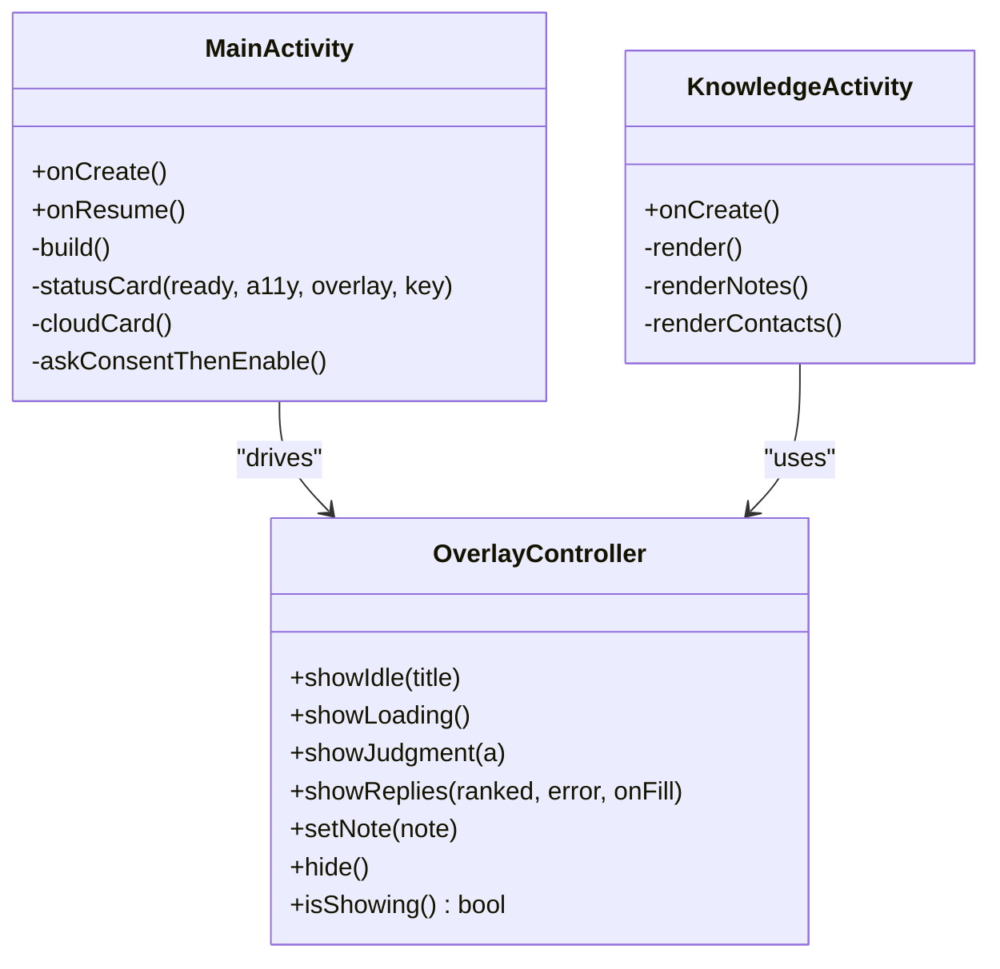

**Diagram sources**
- [MainActivity.kt:26-113](file://app/src/main/java/com/jev/probe/MainActivity.kt#L26-L113)
- [KnowledgeActivity.kt:24-74](file://app/src/main/java/com/jev/probe/KnowledgeActivity.kt#L24-L74)
- [OverlayController.kt:29-37](file://app/src/main/java/com/jev/probe/overlay/OverlayController.kt#L29-L37)
- [OverlayController.kt:286-416](file://app/src/main/java/com/jev/probe/overlay/OverlayController.kt#L286-L416)

**Section sources**
- [MainActivity.kt:26-113](file://app/src/main/java/com/jev/probe/MainActivity.kt#L26-L113)
- [KnowledgeActivity.kt:24-74](file://app/src/main/java/com/jev/probe/KnowledgeActivity.kt#L24-L74)
- [OverlayController.kt:29-37](file://app/src/main/java/com/jev/probe/overlay/OverlayController.kt#L29-L37)
- [OverlayController.kt:286-416](file://app/src/main/java/com/jev/probe/overlay/OverlayController.kt#L286-L416)

### Business Logic Layer
The business logic layer transforms raw UI observations into structured analysis inputs:

- `ChatSnapshot` represents a neutral view of a conversation, including optional bubble geometry for OCR.
- `Analysis` carries judgment results, scores, confidence, ranked replies, latency, and error/paywall flags.
- `ContextBuilder` matches contacts, injects recent history, applies knowledge notes, and enforces a character budget.

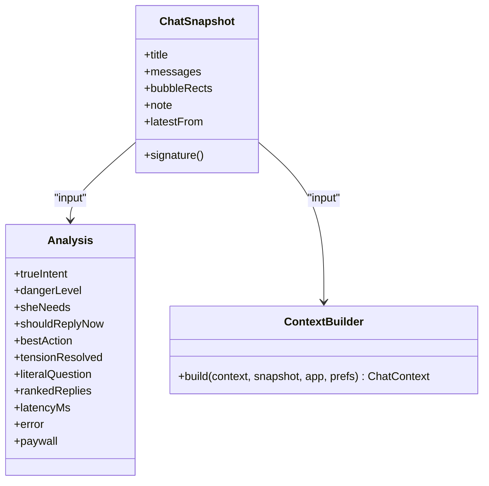

**Diagram sources**
- [ChatModels.kt:5-58](file://app/src/main/java/com/jev/probe/core/ChatModels.kt#L5-L58)
- [ContextBuilder.kt:35-62](file://app/src/main/java/com/jev/probe/core/kb/ContextBuilder.kt#L35-L62)

**Section sources**
- [ChatModels.kt:5-58](file://app/src/main/java/com/jev/probe/core/ChatModels.kt#L5-L58)
- [ContextBuilder.kt:35-62](file://app/src/main/java/com/jev/probe/core/kb/ContextBuilder.kt#L35-L62)

### Integration Layer
The integration layer provides a unified client for external AI services:

- `JevClient` groups judgment and reply generation under one analysis ID.
- `JudgeClient` posts decision questions and ranks candidate replies.
- `ReplyClient` drafts three varied candidate replies against an OpenAI-compatible endpoint.
- Both clients read configuration from `Prefs` and support hosted mode headers.

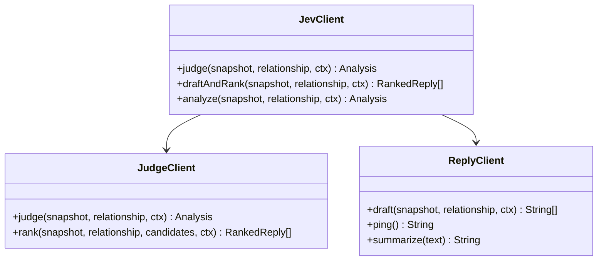

**Diagram sources**
- [JevClient.kt:14-42](file://app/src/main/java/com/jev/probe/jev/JevClient.kt#L14-L42)
- [JudgeClient.kt:19-68](file://app/src/main/java/com/jev/probe/jev/JudgeClient.kt#L19-L68)
- [ReplyClient.kt:15-38](file://app/src/main/java/com/jev/probe/jev/ReplyClient.kt#L15-L38)

**Section sources**
- [JevClient.kt:9-18](file://app/src/main/java/com/jev/probe/jev/JevClient.kt#L9-L18)
- [JevClient.kt:22-42](file://app/src/main/java/com/jev/probe/jev/JevClient.kt#L22-L42)
- [JudgeClient.kt:14-18](file://app/src/main/java/com/jev/probe/jev/JudgeClient.kt#L14-L18)
- [JudgeClient.kt:31-68](file://app/src/main/java/com/jev/probe/jev/JudgeClient.kt#L31-L68)
- [ReplyClient.kt:10-18](file://app/src/main/java/com/jev/probe/jev/ReplyClient.kt#L10-L18)
- [ReplyClient.kt:28-38](file://app/src/main/java/com/jev/probe/jev/ReplyClient.kt#L28-L38)

## Dependency Analysis
The main dependency relationships are:

- `ChatCaptureService` depends on adapters, OCR, session state, overlay, preferences, knowledge context, and Jev clients.
- Adapters depend on Android accessibility APIs and shared helper functions.
- OCR depends on ML Kit and bitmap coordinate transformations.
- Context builder depends on the local knowledge store and preferences.
- Jev clients depend on HTTP utilities, response shape parsing, and preferences.
- Overlay depends on Android window manager and preferences.

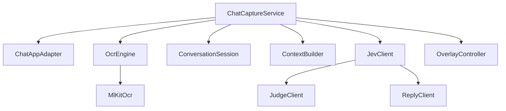

**Diagram sources**
- [ChatCaptureService.kt:43-76](file://app/src/main/java/com/jev/probe/capture/ChatCaptureService.kt#L43-L76)
- [ChatAppAdapter.kt:10-30](file://app/src/main/java/com/jev/probe/capture/ChatAppAdapter.kt#L10-L30)
- [OcrEngine.kt:20-22](file://app/src/main/java/com/jev/probe/capture/ocr/OcrEngine.kt#L20-L22)
- [MlKitOcr.kt:26-112](file://app/src/main/java/com/jev/probe/capture/ocr/MlKitOcr.kt#L26-L112)
- [JevClient.kt:14-42](file://app/src/main/java/com/jev/probe/jev/JevClient.kt#L14-L42)

**Section sources**
- [ChatCaptureService.kt:43-76](file://app/src/main/java/com/jev/probe/capture/ChatCaptureService.kt#L43-L76)
- [ChatAppAdapter.kt:10-30](file://app/src/main/java/com/jev/probe/capture/ChatAppAdapter.kt#L10-L30)
- [OcrEngine.kt:20-22](file://app/src/main/java/com/jev/probe/capture/ocr/OcrEngine.kt#L20-L22)
- [MlKitOcr.kt:26-112](file://app/src/main/java/com/jev/probe/capture/ocr/MlKitOcr.kt#L26-L112)
- [JevClient.kt:14-42](file://app/src/main/java/com/jev/probe/jev/JevClient.kt#L14-L42)

## Performance Considerations
The system includes several performance-oriented design choices:

- **Debouncing**: Rapid content-change events are coalesced before analysis starts.
- **Worker pools**: Analysis tasks run off the main thread using a fixed executor.
- **Concurrent calls**: Judgment and reply generation are submitted separately so they can overlap.
- **Signature deduplication**: Snapshots are compared by a stable signature of recent messages to avoid redundant work.
- **OCR throttling**: Screenshot and OCR paths include guards against repeated shots and failed retries.
- **Model warm-up**: The bundled OCR model is warmed up during service connection to avoid first-use latency on the main thread.
- **Overlay visibility control**: The overlay is hidden temporarily during screenshots to avoid capturing itself.
- **Budgeted context**: Knowledge context is trimmed to a character budget to keep prompts manageable.

[No sources needed since this section provides general guidance]

## Troubleshooting Guide
Common issues and their architectural causes:

- **No bubble appears**: The service may be disabled, the foreground app may be excluded, or the adapter may not recognize the current window as a chat.
- **OCR fails repeatedly**: Screenshot throttling, permission issues, or ML Kit failures can cause empty OCR results. Manual OCR shows explicit errors, while automatic OCR suppresses transient timing-related messages.
- **Stale analysis after switching chats**: `ConversationSession` tokens prevent old requests from updating the overlay once the target changes.
- **Reply fill fails**: `GuardedInputWriter` retries focus, set-text, and paste operations; if all fail, it copies to clipboard instead of leaving the text lost.
- **Hosted trial ends**: The overlay shows a paywall state and refreshes entitlement information asynchronously.
- **Privacy concern about cloud mode**: Hosted mode requires explicit consent and explains that chat text goes to the operator’s gateway, while screenshots remain local.

**Section sources**
- [ChatCaptureService.kt:239-360](file://app/src/main/java/com/jev/probe/capture/ChatCaptureService.kt#L239-L360)
- [ChatCaptureService.kt:457-702](file://app/src/main/java/com/jev/probe/capture/ChatCaptureService.kt#L457-L702)
- [ConversationSession.kt:3-35](file://app/src/main/java/com/jev/probe/capture/ConversationSession.kt#L3-L35)
- [GuardedInputWriter.kt:17-43](file://app/src/main/java/com/jev/probe/capture/GuardedInputWriter.kt#L17-L43)
- [OverlayController.kt:364-380](file://app/src/main/java/com/jev/probe/overlay/OverlayController.kt#L364-L380)
- [MainActivity.kt:199-215](file://app/src/main/java/com/jev/probe/MainActivity.kt#L199-L215)

## Conclusion
Jev Chat Jarvis uses a layered Android architecture that separates concerns cleanly:

- The presentation layer focuses on setup, permissions, knowledge management, and overlay interaction.
- The service layer handles accessibility observation, session state, OCR, and safe input writing.
- The business logic layer defines neutral data models and builds lightweight, budgeted context.
- The data layer keeps knowledge base entries and conversation history on device.
- The integration layer encapsulates external AI calls behind a unified client.

Patterns such as adapter, observer, and strategy make the system extensible and resilient across different chat apps and OCR implementations. The privacy-first design ensures that OCR happens locally and sensitive data remains on device unless the user explicitly opts into hosted mode.

[No sources needed since this section summarizes without analyzing specific files]