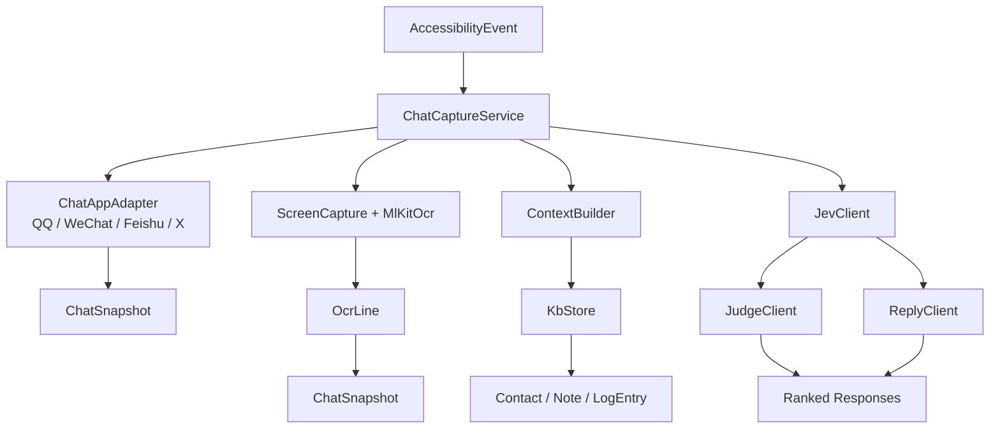
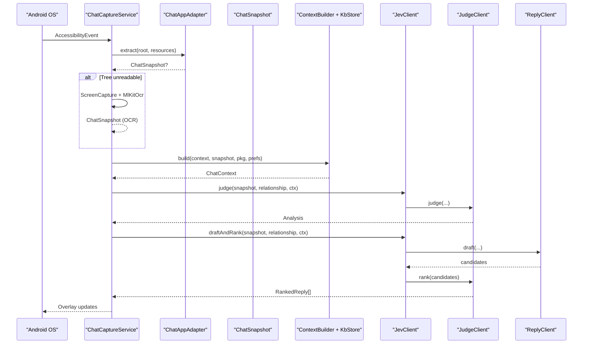
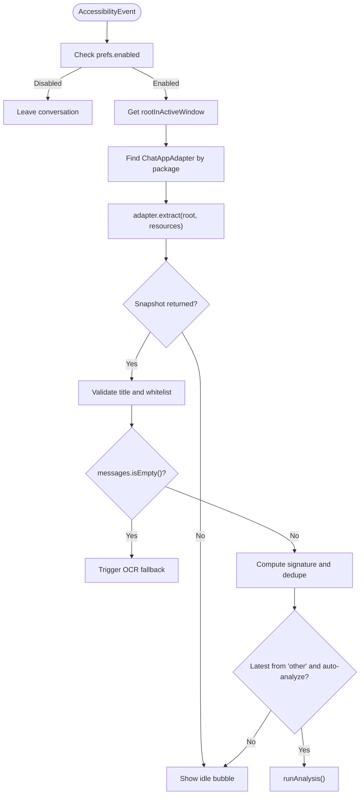
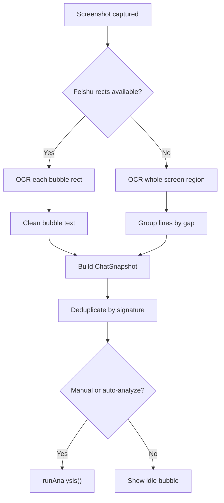
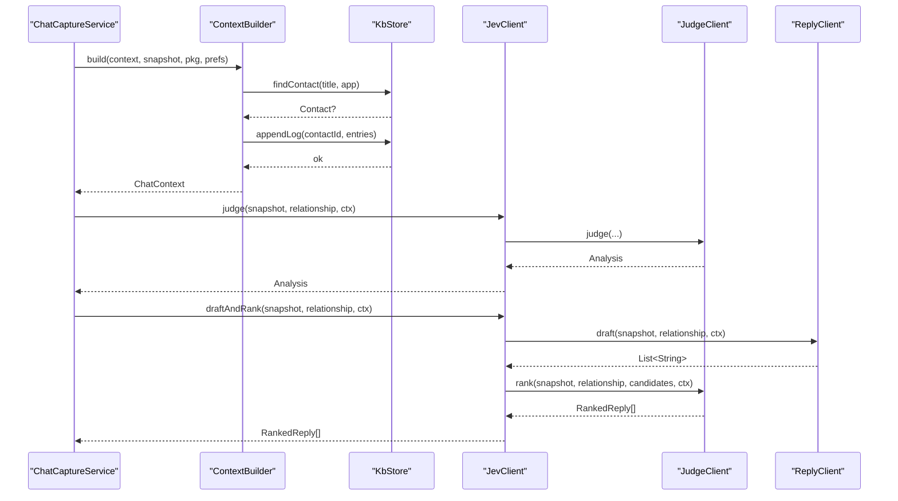
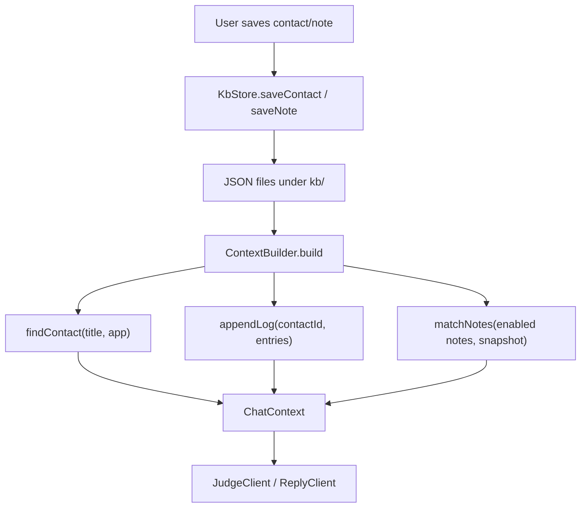
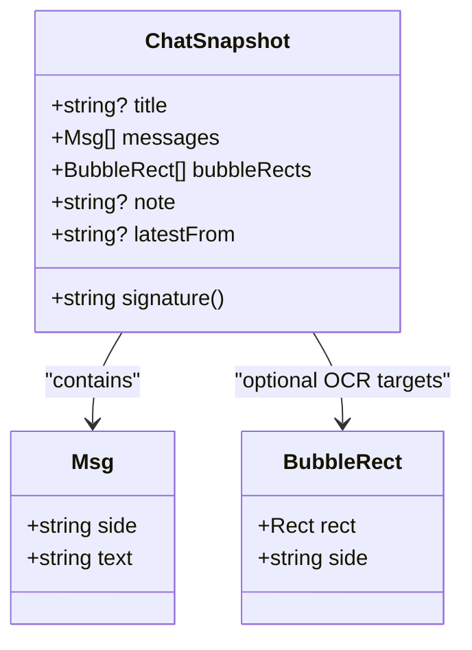
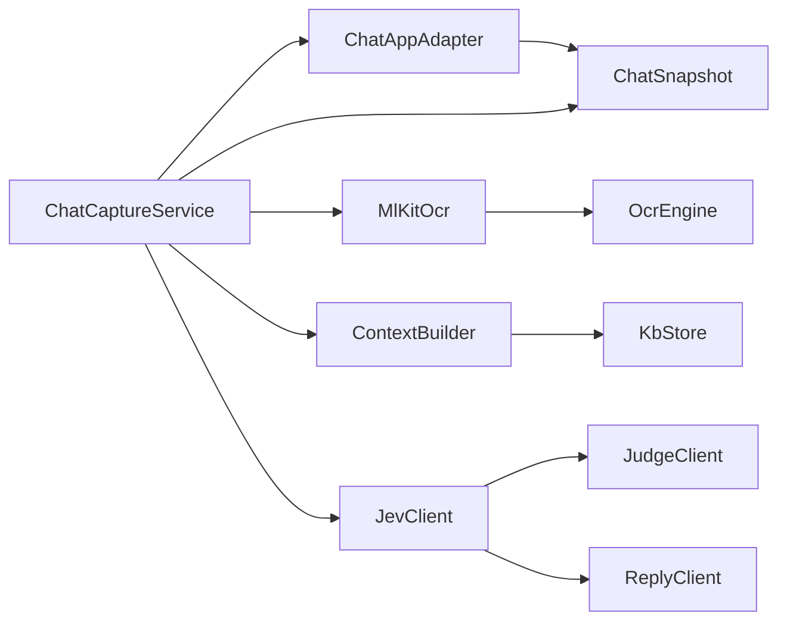

# Data Flow Architecture

<cite>
**Referenced Files in This Document**
- [ChatCaptureService.kt](file://app/src/main/java/com/jev/probe/capture/ChatCaptureService.kt)
- [ChatModels.kt](file://app/src/main/java/com/jev/probe/core/ChatModels.kt)
- [MlKitOcr.kt](file://app/src/main/java/com/jev/probe/capture/ocr/MlKitOcr.kt)
- [OcrEngine.kt](file://app/src/main/java/com/jev/probe/capture/ocr/OcrEngine.kt)
- [JudgeClient.kt](file://app/src/main/java/com/jev/probe/jev/JudgeClient.kt)
- [ReplyClient.kt](file://app/src/main/java/com/jev/probe/jev/ReplyClient.kt)
- [JevClient.kt](file://app/src/main/java/com/jev/probe/jev/JevClient.kt)
- [KbStore.kt](file://app/src/main/java/com/jev/probe/core/kb/KbStore.kt)
- [ContextBuilder.kt](file://app/src/main/java/com/jev/probe/core/kb/ContextBuilder.kt)
- [KbModels.kt](file://app/src/main/java/com/jev/probe/core/kb/KbModels.kt)
- [ChatAppAdapter.kt](file://app/src/main/java/com/jev/probe/capture/ChatAppAdapter.kt)
- [ConversationSession.kt](file://app/src/main/java/com/jev/probe/capture/ConversationSession.kt)
</cite>

## Table of Contents
1. [Introduction](#introduction)
2. [Project Structure](#project-structure)
3. [Core Components](#core-components)
4. [Architecture Overview](#architecture-overview)
5. [Detailed Component Analysis](#detailed-component-analysis)
6. [Dependency Analysis](#dependency-analysis)
7. [Performance Considerations](#performance-considerations)
8. [Troubleshooting Guide](#troubleshooting-guide)
9. [Conclusion](#conclusion)

## Introduction
This document explains the complete data flow architecture for Jev Chat Jarvis, focusing on how live chat conversations are captured, transformed into a stable conversation model, enriched with local knowledge, analyzed by AI services, and turned into ranked reply candidates. It covers four primary flows:

- Message Capture Flow: Accessibility event → app adapter → `ChatSnapshot` → analysis pipeline.
- OCR Flow: Screenshot → ML Kit OCR → text lines → `ChatSnapshot`.
- AI Processing Flow: `ChatSnapshot` → Judge Client → Reply Client → ranked responses.
- Knowledge Flow: User input → `KbStore` → `ContextBuilder` → AI analysis.

The central data structure is `ChatSnapshot`, which represents the current conversation state, including title, message list, optional bubble rectangles for OCR, and an explanatory note about how the snapshot was produced.

## Project Structure
At runtime, the Android accessibility service observes UI events, delegates to per-app adapters, builds `ChatSnapshot` objects, optionally triggers OCR, enriches the snapshot with knowledge context, and calls the AI clients. The knowledge store persists contacts, notes, and recent conversation history locally.

**Diagram sources**
- [ChatCaptureService.kt:239-455](file://app/src/main/java/com/jev/probe/capture/ChatCaptureService.kt#L239-L455)
- [ChatAppAdapter.kt:10-30](file://app/src/main/java/com/jev/probe/capture/ChatAppAdapter.kt#L10-L30)
- [ChatModels.kt:27-38](file://app/src/main/java/com/jev/probe/core/ChatModels.kt#L27-L38)
- [MlKitOcr.kt:39-95](file://app/src/main/java/com/jev/probe/capture/ocr/MlKitOcr.kt#L39-L95)
- [ContextBuilder.kt:35-63](file://app/src/main/java/com/jev/probe/core/kb/ContextBuilder.kt#L35-L63)
- [KbStore.kt:12-23](file://app/src/main/java/com/jev/probe/core/kb/KbStore.kt#L12-L23)
- [JevClient.kt:14-34](file://app/src/main/java/com/jev/probe/jev/JevClient.kt#L14-L34)

**Section sources**
- [ChatCaptureService.kt:29-42](file://app/src/main/java/com/jev/probe/capture/ChatCaptureService.kt#L29-L42)
- [ChatAppAdapter.kt:10-30](file://app/src/main/java/com/jev/probe/capture/ChatAppAdapter.kt#L10-L30)
- [ChatModels.kt:27-38](file://app/src/main/java/com/jev/probe/core/ChatModels.kt#L27-L38)

## Core Components
- `ChatCaptureService`: Main orchestrator. Listens to accessibility events, selects the active chat window, builds or falls back to OCR snapshots, debounces bursts, runs analysis off the main thread, and drives the overlay UI.
- `ChatAppAdapter`: Per-app contract that turns a foreground window into a neutral `ChatSnapshot`. Returns null when not in a chat window; returns empty messages when in a chat but the tree has no readable text.
- `ChatSnapshot`: Central conversation model containing title, ordered messages, optional bubble rectangles, and a note describing capture caveats.
- `MlKitOcr` and `OcrEngine`: On-device Chinese OCR over screenshots, returning screen-coordinate text lines grouped into messages.
- `ContextBuilder` and `KbStore`: Local knowledge system. `KbStore` persists contacts, notes, and recent logs; `ContextBuilder` builds a bounded `ChatContext` from contact identity, matched notes, and recent history.
- `JevClient`, `JudgeClient`, `ReplyClient`: AI integration layer. `JudgeClient` performs judgment questions; `ReplyClient` drafts candidate replies; `JevClient` coordinates both and ranks candidates.

**Section sources**
- [ChatCaptureService.kt:43-68](file://app/src/main/java/com/jev/probe/capture/ChatCaptureService.kt#L43-L68)
- [ChatAppAdapter.kt:10-30](file://app/src/main/java/com/jev/probe/capture/ChatAppAdapter.kt#L10-L30)
- [ChatModels.kt:27-59](file://app/src/main/java/com/jev/probe/core/ChatModels.kt#L27-L59)
- [MlKitOcr.kt:13-25](file://app/src/main/java/com/jev/probe/capture/ocr/MlKitOcr.kt#L13-L25)
- [OcrEngine.kt:6-22](file://app/src/main/java/com/jev/probe/capture/ocr/OcrEngine.kt#L6-L22)
- [ContextBuilder.kt:8-15](file://app/src/main/java/com/jev/probe/core/kb/ContextBuilder.kt#L8-L15)
- [KbStore.kt:12-23](file://app/src/main/java/com/jev/probe/core/kb/KbStore.kt#L12-L23)
- [JevClient.kt:9-18](file://app/src/main/java/com/jev/probe/jev/JevClient.kt#L9-L18)

## Architecture Overview
The system separates concerns across capture, OCR, knowledge enrichment, and AI processing. `ChatSnapshot` is the canonical representation passed between stages.

**Diagram sources**
- [ChatCaptureService.kt:239-455](file://app/src/main/java/com/jev/probe/capture/ChatCaptureService.kt#L239-L455)
- [ChatAppAdapter.kt:10-30](file://app/src/main/java/com/jev/probe/capture/ChatAppAdapter.kt#L10-L30)
- [ContextBuilder.kt:35-63](file://app/src/main/java/com/jev/probe/core/kb/ContextBuilder.kt#L35-L63)
- [JevClient.kt:22-34](file://app/src/main/java/com/jev/probe/jev/JevClient.kt#L22-L34)
- [JudgeClient.kt:31-55](file://app/src/main/java/com/jev/probe/jev/JudgeClient.kt#L31-L55)
- [ReplyClient.kt:28-38](file://app/src/main/java/com/jev/probe/jev/ReplyClient.kt#L28-L38)

## Detailed Component Analysis

### Message Capture Flow
Accessibility events trigger `maybeCapture`, which:
- Validates the active window and selected package.
- Selects the appropriate `ChatAppAdapter`.
- Calls `adapter.extract(...)` to obtain a `ChatSnapshot`.
- If the snapshot has no messages but is still inside a chat window, it may fall back to OCR.
- Debounces rapid content changes and only analyzes when the newest message is from the other person and auto-analyze is enabled.

Validation rules include:
- Excluded foreground apps are ignored.
- Transient titles are rejected.
- Allowed-title checks prevent unauthorized chats from being processed.
- Conversation liveness is enforced via `ConversationSession.Token`.

Error handling includes:
- Leaving the conversation if the target changes.
- Showing idle overlay bubbles when no chat window is detected.
- Logging node IDs when an adapted app fails to match its expected tree shape.

**Diagram sources**
- [ChatCaptureService.kt:239-360](file://app/src/main/java/com/jev/probe/capture/ChatCaptureService.kt#L239-L360)
- [ChatAppAdapter.kt:10-30](file://app/src/main/java/com/jev/probe/capture/ChatAppAdapter.kt#L10-L30)

**Section sources**
- [ChatCaptureService.kt:239-360](file://app/src/main/java/com/jev/probe/capture/ChatCaptureService.kt#L239-L360)
- [ChatAppAdapter.kt:10-30](file://app/src/main/java/com/jev/probe/capture/ChatAppAdapter.kt#L10-L30)

### OCR Flow
When the tree cannot provide message text, the service captures a screenshot and uses ML Kit OCR:
- For Feishu, it re-measures bubble rectangles after the shot and OCRs each rectangle individually.
- For other apps, it OCRs the whole screen area minus top and bottom chrome, then groups recognized lines into pseudo-bubbles based on vertical gaps.
- Recognized lines are cleaned (removing read receipts and timestamps), sorted by position, and converted into `Msg` objects.
- The resulting `ChatSnapshot` is deduplicated and either analyzed automatically or parked as an idle bubble.

Validation and transformation rules include:
- Empty regions or tiny crops return empty line lists.
- Only non-blank lines survive.
- Time-only lines are filtered out during grouping.
- Bubble text is trimmed and stripped of known suffixes.

**Diagram sources**
- [ChatCaptureService.kt:548-702](file://app/src/main/java/com/jev/probe/capture/ChatCaptureService.kt#L548-L702)
- [MlKitOcr.kt:39-95](file://app/src/main/java/com/jev/probe/capture/ocr/MlKitOcr.kt#L39-L95)

**Section sources**
- [ChatCaptureService.kt:548-702](file://app/src/main/java/com/jev/probe/capture/ChatCaptureService.kt#L548-L702)
- [MlKitOcr.kt:39-95](file://app/src/main/java/com/jev/probe/capture/ocr/MlKitOcr.kt#L39-L95)
- [OcrEngine.kt:6-22](file://app/src/main/java/com/jev/probe/capture/ocr/OcrEngine.kt#L6-L22)

### AI Processing Flow
Once a valid `ChatSnapshot` is ready, the service constructs knowledge context and calls the AI pipeline:
- `ContextBuilder.build(...)` produces a `ChatContext` with contact identity, recent history, and matched notes.
- `JevClient.judge(...)` sends seven judgment questions to the judge route and returns an `Analysis`.
- `JevClient.draftAndRank(...)` first drafts three candidate replies using `ReplyClient`, then ranks them using `JudgeClient.rank(...)`.
- Results are posted back to the main thread to update the overlay panel.

Validation and error handling include:
- Paywall detection routes to a paywall UI rather than a generic error.
- HTTP errors like 401/402/429 are treated as gateway gates and do not retry without background/history.
- Drafting exceptions are caught and surfaced as a reply error while still allowing judgment results.

**Diagram sources**
- [ChatCaptureService.kt:389-455](file://app/src/main/java/com/jev/probe/capture/ChatCaptureService.kt#L389-L455)
- [ContextBuilder.kt:35-63](file://app/src/main/java/com/jev/probe/core/kb/ContextBuilder.kt#L35-L63)
- [KbStore.kt:172-220](file://app/src/main/java/com/jev/probe/core/kb/KbStore.kt#L172-L220)
- [JevClient.kt:22-34](file://app/src/main/java/com/jev/probe/jev/JevClient.kt#L22-L34)
- [JudgeClient.kt:31-55](file://app/src/main/java/com/jev/probe/jev/JudgeClient.kt#L31-L55)
- [ReplyClient.kt:28-38](file://app/src/main/java/com/jev/probe/jev/ReplyClient.kt#L28-L38)

**Section sources**
- [ChatCaptureService.kt:389-455](file://app/src/main/java/com/jev/probe/capture/ChatCaptureService.kt#L389-L455)
- [JevClient.kt:22-34](file://app/src/main/java/com/jev/probe/jev/JevClient.kt#L22-L34)
- [JudgeClient.kt:31-55](file://app/src/main/java/com/jev/probe/jev/JudgeClient.kt#L31-L55)
- [ReplyClient.kt:28-38](file://app/src/main/java/com/jev/probe/jev/ReplyClient.kt#L28-L38)

### Knowledge Flow
The knowledge flow connects user-maintained data with live conversation analysis:
- Users save contacts and notes through the overlay menu or settings.
- `KbStore` persists contacts, notes, and per-contact log histories under `filesDir/kb`.
- `ContextBuilder` matches the current conversation title to a contact, retrieves recent history, and matches notes by tags/title against the conversation title and recent messages.
- A character budget limits injected context to avoid overwhelming the AI prompt.

Data transformation and validation rules include:
- Contact matching normalizes names and supports aliases.
- History is appended with deduplication logic to avoid duplicate screens.
- Notes are filtered by enabled status and keyword presence.
- Budget trimming removes oldest history first, then oldest notes, preserving always-on notes.

**Diagram sources**
- [KbStore.kt:12-23](file://app/src/main/java/com/jev/probe/core/kb/KbStore.kt#L12-L23)
- [KbStore.kt:122-145](file://app/src/main/java/com/jev/probe/core/kb/KbStore.kt#L122-L145)
- [KbStore.kt:172-220](file://app/src/main/java/com/jev/probe/core/kb/KbStore.kt#L172-L220)
- [ContextBuilder.kt:35-63](file://app/src/main/java/com/jev/probe/core/kb/ContextBuilder.kt#L35-L63)
- [ContextBuilder.kt:98-116](file://app/src/main/java/com/jev/probe/core/kb/ContextBuilder.kt#L98-L116)

**Section sources**
- [KbStore.kt:12-23](file://app/src/main/java/com/jev/probe/core/kb/KbStore.kt#L12-L23)
- [KbStore.kt:122-145](file://app/src/main/java/com/jev/probe/core/kb/KbStore.kt#L122-L145)
- [KbStore.kt:172-220](file://app/src/main/java/com/jev/probe/core/kb/KbStore.kt#L172-L220)
- [ContextBuilder.kt:35-63](file://app/src/main/java/com/jev/probe/core/kb/ContextBuilder.kt#L35-L63)
- [ContextBuilder.kt:98-116](file://app/src/main/java/com/jev/probe/core/kb/ContextBuilder.kt#L98-L116)

### ChatSnapshot Model
`ChatSnapshot` is the central data structure representing conversation state:
- `title`: Optional conversation title.
- `messages`: Ordered list of `Msg` objects with side ("me"/"other") and text.
- `bubbleRects`: Optional list of screen rectangles used for targeted OCR.
- `note`: Optional caveat explaining capture limitations.
- `latestFrom`: Convenience property indicating who sent the last message.
- `signature()`: Stable hash of the last few messages used for deduplication.

**Diagram sources**
- [ChatModels.kt:5-38](file://app/src/main/java/com/jev/probe/core/ChatModels.kt#L5-L38)

**Section sources**
- [ChatModels.kt:5-38](file://app/src/main/java/com/jev/probe/core/ChatModels.kt#L5-L38)

## Dependency Analysis
The following diagram shows key dependencies among core components:

**Diagram sources**
- [ChatCaptureService.kt:239-455](file://app/src/main/java/com/jev/probe/capture/ChatCaptureService.kt#L239-L455)
- [ChatAppAdapter.kt:10-30](file://app/src/main/java/com/jev/probe/capture/ChatAppAdapter.kt#L10-L30)
- [MlKitOcr.kt:39-95](file://app/src/main/java/com/jev/probe/capture/ocr/MlKitOcr.kt#L39-L95)
- [OcrEngine.kt:6-22](file://app/src/main/java/com/jev/probe/capture/ocr/OcrEngine.kt#L6-L22)
- [ContextBuilder.kt:35-63](file://app/src/main/java/com/jev/probe/core/kb/ContextBuilder.kt#L35-L63)
- [KbStore.kt:12-23](file://app/src/main/java/com/jev/probe/core/kb/KbStore.kt#L12-L23)
- [JevClient.kt:14-34](file://app/src/main/java/com/jev/probe/jev/JevClient.kt#L14-L34)

**Section sources**
- [ChatCaptureService.kt:239-455](file://app/src/main/java/com/jev/probe/capture/ChatCaptureService.kt#L239-L455)
- [JevClient.kt:14-34](file://app/src/main/java/com/jev/probe/jev/JevClient.kt#L14-L34)

## Performance Considerations
- Concurrency: `ChatCaptureService` uses a fixed worker pool for analysis tasks and posts results back to the main thread. This avoids blocking UI operations and allows parallel judgment and drafting/ranking.
- Debouncing: Content-changed events are debounced to reduce redundant analysis during rapid UI updates.
- Deduplication: `ChatSnapshot.signature()` compares the last few messages to avoid reprocessing identical content.
- OCR throttling: Automatic OCR is gated by a signature based on bubble rectangles and title, preventing repeated screenshots for transient UI changes.
- Memory management: Bitmaps created for OCR are recycled after use. ML Kit recognizer is lazily initialized and warmed up on service connect to avoid main-thread delays.
- Knowledge budget: `ContextBuilder` enforces a character budget for injected context, trimming history and notes to keep prompts manageable.
- Large conversations: Only the last 10 messages are included in reply drafts, and history retrieval is limited to a configurable count capped at 100.

[No sources needed since this section provides general guidance]

## Troubleshooting Guide
Common issues and their handling:
- No accessible tree: Manual OCR shows an error instructing users to toggle accessibility and re-enter the conversation.
- Foreground not capturable: Toast informs the user that the current interface should not be recognized.
- OCR failed: Screenshot failures show human-readable messages; transient throttle codes are suppressed.
- Empty OCR result: Manual OCR reports no recognized text; automatic OCR parks the bubble instead of crashing.
- Conversation changed mid-analysis: Token-based liveness checks prevent writing into the wrong window and copy text to clipboard as a fallback.
- Paywall or API error: Judgment errors surface paywall UI or generic error messages; entitlement refresh is triggered for cloud-related issues.

**Section sources**
- [ChatCaptureService.kt:465-524](file://app/src/main/java/com/jev/probe/capture/ChatCaptureService.kt#L465-L524)
- [ChatCaptureService.kt:548-702](file://app/src/main/java/com/jev/probe/capture/ChatCaptureService.kt#L548-L702)
- [ChatCaptureService.kt:732-792](file://app/src/main/java/com/jev/probe/capture/ChatCaptureService.kt#L732-L792)
- [JudgeClient.kt:49-54](file://app/src/main/java/com/jev/probe/jev/JudgeClient.kt#L49-L54)

## Conclusion
Jev Chat Jarvis implements a robust, layered data flow architecture that transforms raw accessibility events and screenshots into structured conversation snapshots, enriches them with local knowledge, and processes them through specialized AI endpoints. The design emphasizes stability through session tokens, deduplication signatures, and careful error handling, while balancing performance with concurrency, throttling, and memory management. `ChatSnapshot` serves as the central contract enabling app-agnostic processing, OCR fallback, and consistent AI integration.

[No sources needed since this section summarizes without analyzing specific files]