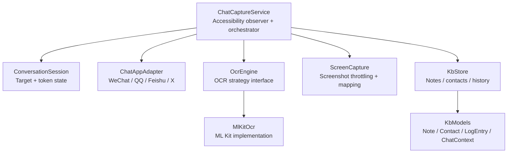
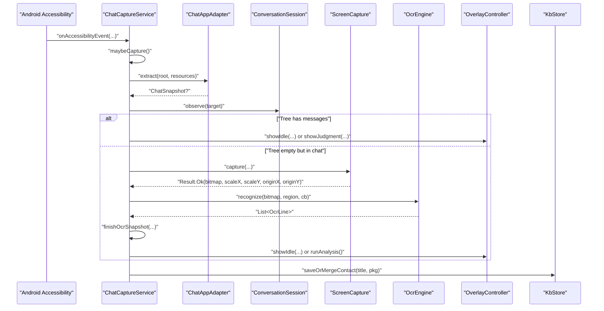
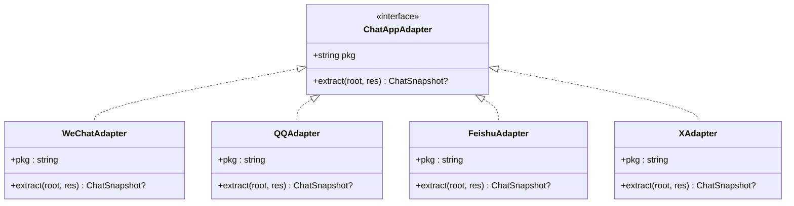
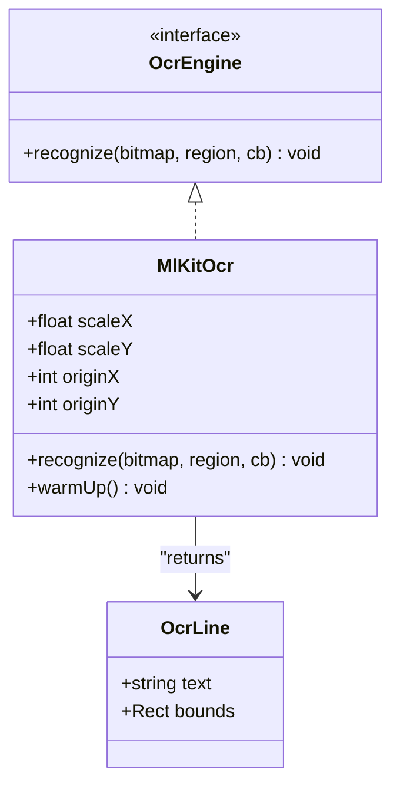
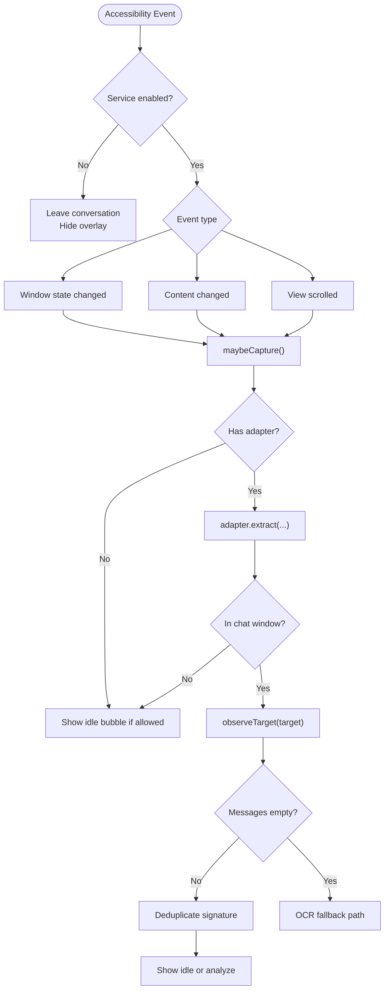
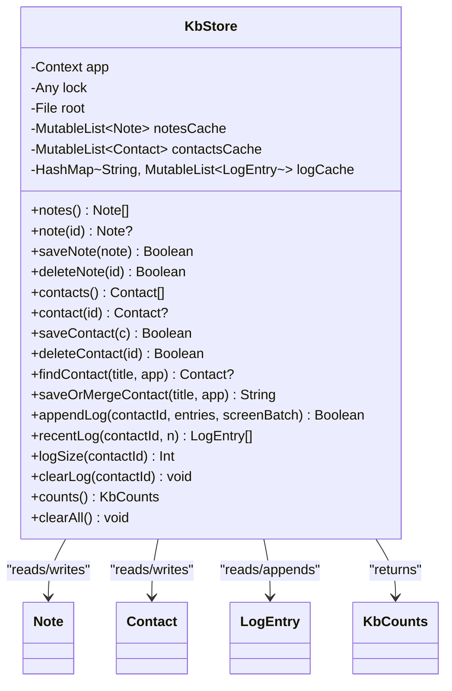
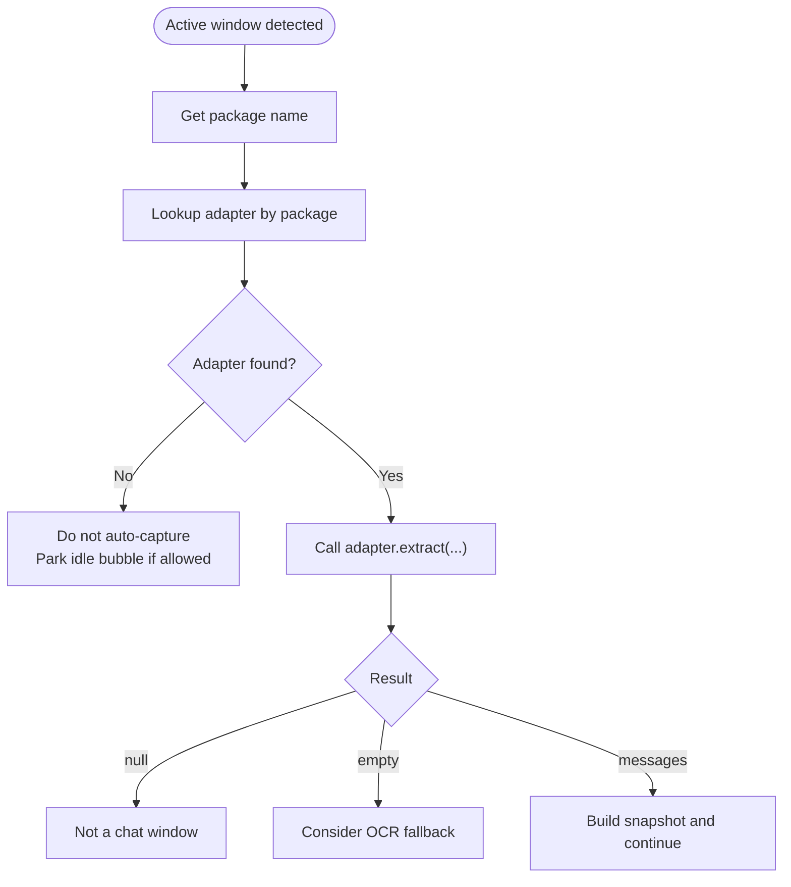
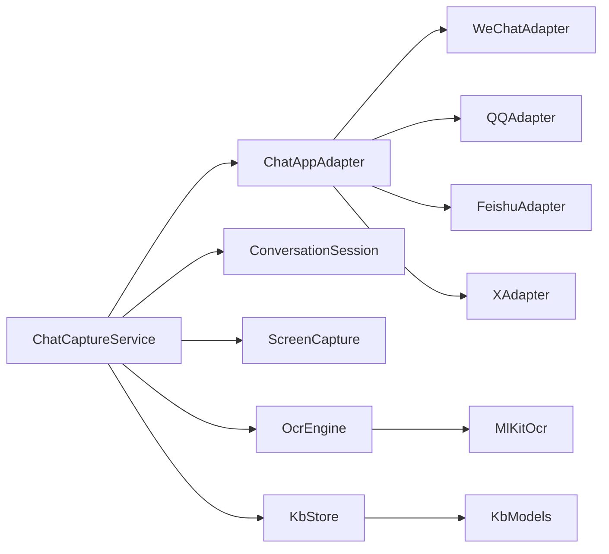

# Design Patterns

<cite>
**Referenced Files in This Document**   
- [ChatAppAdapter.kt](file://app/src/main/java/com/jev/probe/capture/ChatAppAdapter.kt)
- [ChatCaptureService.kt](file://app/src/main/java/com/jev/probe/capture/ChatCaptureService.kt)
- [ConversationSession.kt](file://app/src/main/java/com/jev/probe/capture/ConversationSession.kt)
- [OcrEngine.kt](file://app/src/main/java/com/jev/probe/capture/ocr/OcrEngine.kt)
- [MlKitOcr.kt](file://app/src/main/java/com/jev/probe/capture/ocr/MlKitOcr.kt)
- [ScreenCapture.kt](file://app/src/main/java/com/jev/probe/capture/ocr/ScreenCapture.kt)
- [KbStore.kt](file://app/src/main/java/com/jev/probe/core/kb/KbStore.kt)
- [KbModels.kt](file://app/src/main/java/com/jev/probe/core/kb/KbModels.kt)
</cite>

## Table of Contents
1. [Introduction](#introduction)
2. [Project Structure](#project-structure)
3. [Core Components](#core-components)
4. [Architecture Overview](#architecture-overview)
5. [Detailed Component Analysis](#detailed-component-analysis)
6. [Dependency Analysis](#dependency-analysis)
7. [Performance Considerations](#performance-considerations)
8. [Troubleshooting Guide](#troubleshooting-guide)
9. [Conclusion](#conclusion)

## Introduction
This document explains the design patterns implemented in Jev Chat Jarvis and how they make the app maintainable, testable, and extensible. The key patterns are:

- **Adapter Pattern**: `ChatAppAdapter` abstracts per-app chat UI differences so the rest of the service stays platform-agnostic.
- **Strategy Pattern**: `OcrEngine` lets multiple OCR backends be swapped without changing capture logic; ML Kit is the current implementation.
- **Observer Pattern**: `ChatCaptureService` observes Android accessibility events to detect conversation changes and drive real-time overlay updates.
- **Repository Pattern**: `KbStore` centralizes all local knowledge-base access, persistence, deduplication, and atomic writes.
- **Factory Pattern**: `ChatCaptureService` selects the correct `ChatAppAdapter` based on the detected foreground application package.

These patterns separate concerns: adapters handle app-specific UI parsing, OCR strategies handle recognition, the service handles event-driven orchestration, and the repository isolates data storage.

## Project Structure
The relevant code lives under three packages:

- `com.jev.probe.capture`: live accessibility capture, adapter implementations, session state, and OCR orchestration.
- `com.jev.probe.capture.ocr`: OCR abstraction, ML Kit backend, and screenshot capture.
- `com.jev.probe.core.kb`: knowledge-base models and centralized store.

**Diagram sources**
- [ChatCaptureService.kt:43-53](file://app/src/main/java/com/jev/probe/capture/ChatCaptureService.kt#L43-L53)
- [ConversationSession.kt:4-35](file://app/src/main/java/com/jev/probe/capture/ConversationSession.kt#L4-L35)
- [ChatAppAdapter.kt:27-30](file://app/src/main/java/com/jev/probe/capture/ChatAppAdapter.kt#L27-L30)
- [OcrEngine.kt:20-22](file://app/src/main/java/com/jev/probe/capture/ocr/OcrEngine.kt#L20-L22)
- [MlKitOcr.kt:26-26](file://app/src/main/java/com/jev/probe/capture/ocr/MlKitOcr.kt#L26-L26)
- [ScreenCapture.kt:35-39](file://app/src/main/java/com/jev/probe/capture/ocr/ScreenCapture.kt#L35-L39)
- [KbStore.kt:24-37](file://app/src/main/java/com/jev/probe/core/kb/KbStore.kt#L24-L37)
- [KbModels.kt:12-52](file://app/src/main/java/com/jev/probe/core/kb/KbModels.kt#L12-L52)

**Section sources**
- [ChatCaptureService.kt:29-42](file://app/src/main/java/com/jev/probe/capture/ChatCaptureService.kt#L29-L42)
- [ChatAppAdapter.kt:10-30](file://app/src/main/java/com/jev/probe/capture/ChatAppAdapter.kt#L10-L30)
- [OcrEngine.kt:9-22](file://app/src/main/java/com/jev/probe/capture/ocr/OcrEngine.kt#L9-L22)
- [KbStore.kt:12-23](file://app/src/main/java/com/jev/probe/core/kb/KbStore.kt#L12-L23)

## Core Components
This section summarizes the five patterns and their roles.

| Pattern | Primary Artifact | Responsibility | Extension Point |
|---|---|---|---|
| Adapter | `ChatAppAdapter` and its implementations | Convert one messaging app’s accessibility tree into a neutral `ChatSnapshot`. | Add a new class implementing `ChatAppAdapter` and register it by package name. |
| Strategy | `OcrEngine` and `MlKitOcr` | Recognize text from screenshots with a callback-based API. | Implement another `OcrEngine` and inject it where `MlKitOcr` is used. |
| Observer | `ChatCaptureService.onAccessibilityEvent` | React to window/content/scroll events and update the overlay or analysis pipeline. | Extend event handling or add new liveness rules for manual vs automatic captures. |
| Repository | `KbStore` | Centralized read/write for notes, contacts, and per-contact logs. | Add new entity types or persistence methods while keeping thread-safety and atomicity. |
| Factory | `ChatCaptureService.adapters` map | Select the correct adapter based on the active app package. | Register additional package-to-adapter mappings. |

**Section sources**
- [ChatAppAdapter.kt:27-30](file://app/src/main/java/com/jev/probe/capture/ChatAppAdapter.kt#L27-L30)
- [OcrEngine.kt:20-22](file://app/src/main/java/com/jev/probe/capture/ocr/OcrEngine.kt#L20-L22)
- [ChatCaptureService.kt:239-273](file://app/src/main/java/com/jev/probe/capture/ChatCaptureService.kt#L239-L273)
- [KbStore.kt:24-37](file://app/src/main/java/com/jev/probe/core/kb/KbStore.kt#L24-L37)
- [ChatCaptureService.kt:52-53](file://app/src/main/java/com/jev/probe/capture/ChatCaptureService.kt#L52-L53)

## Architecture Overview
At runtime, the accessibility service observes system events, identifies the active chat app through an adapter, builds a normalized snapshot, optionally takes a screenshot, runs OCR, and then drives the floating overlay and background analysis.

**Diagram sources**
- [ChatCaptureService.kt:239-360](file://app/src/main/java/com/jev/probe/capture/ChatCaptureService.kt#L239-L360)
- [ChatCaptureService.kt:548-702](file://app/src/main/java/com/jev/probe/capture/ChatCaptureService.kt#L548-L702)
- [ChatAppAdapter.kt:139-178](file://app/src/main/java/com/jev/probe/capture/ChatAppAdapter.kt#L139-L178)
- [ScreenCapture.kt:66-93](file://app/src/main/java/com/jev/probe/capture/ocr/ScreenCapture.kt#L66-L93)
- [MlKitOcr.kt:39-95](file://app/src/main/java/com/jev/probe/capture/ocr/MlKitOcr.kt#L39-L95)
- [KbStore.kt:122-145](file://app/src/main/java/com/jev/probe/core/kb/KbStore.kt#L122-L145)

## Detailed Component Analysis

### Adapter Pattern: Multi-Platform Chat Support
The adapter pattern separates per-app UI parsing from the rest of the system. `ChatAppAdapter` defines a single contract: given an accessibility root and resources, return either `null`, an empty chat snapshot, or a populated `ChatSnapshot`.

Key responsibilities:
- Identify whether the current window is a chat window.
- Extract conversation title.
- Extract message bubbles with side (`me` or `other`).
- Provide bubble geometry when text is drawn rather than exposed as nodes.

Implemented adapters:
- `WeChatAdapter`: Uses a stable bubble resource id and horizontal position to determine sender side.
- `QQAdapter`: Uses plain node ids and avatar-edge geometry to infer sender side.
- `FeishuAdapter`: Reads bubble rectangles and uses a read-receipt strip to infer sender side; relies on OCR for body text.
- `XAdapter`: Parses Compose rows from `contentDescription` and strips timestamps/read receipts.

**Diagram sources**
- [ChatAppAdapter.kt:27-30](file://app/src/main/java/com/jev/probe/capture/ChatAppAdapter.kt#L27-L30)
- [ChatAppAdapter.kt:139-178](file://app/src/main/java/com/jev/probe/capture/ChatAppAdapter.kt#L139-L178)
- [ChatAppAdapter.kt:197-247](file://app/src/main/java/com/jev/probe/capture/ChatAppAdapter.kt#L197-L247)
- [ChatAppAdapter.kt:319-376](file://app/src/main/java/com/jev/probe/capture/ChatAppAdapter.kt#L319-L376)
- [ChatAppAdapter.kt:440-510](file://app/src/main/java/com/jev/probe/capture/ChatAppAdapter.kt#L440-L510)

Benefits:
- New platforms can be added without modifying the capture service.
- Each adapter owns its own stability assumptions about view ids, geometry, and obfuscated trees.
- The service remains app-agnostic and focuses on flow control, deduplication, and overlay behavior.

Extension point:
- Create a new class implementing `ChatAppAdapter`.
- Return `null` when not in a chat window.
- Return an empty `ChatSnapshot` when in a chat window but no readable text is available.
- Register the adapter in the service’s package-to-adapter map.

**Section sources**
- [ChatAppAdapter.kt:10-30](file://app/src/main/java/com/jev/probe/capture/ChatAppAdapter.kt#L10-L30)
- [ChatAppAdapter.kt:139-178](file://app/src/main/java/com/jev/probe/capture/ChatAppAdapter.kt#L139-L178)
- [ChatAppAdapter.kt:197-247](file://app/src/main/java/com/jev/probe/capture/ChatAppAdapter.kt#L197-L247)
- [ChatAppAdapter.kt:319-376](file://app/src/main/java/com/jev/probe/capture/ChatAppAdapter.kt#L319-L376)
- [ChatAppAdapter.kt:440-510](file://app/src/main/java/com/jev/probe/capture/ChatAppAdapter.kt#L440-L510)
- [ChatCaptureService.kt:52-53](file://app/src/main/java/com/jev/probe/capture/ChatCaptureService.kt#L52-L53)

### Strategy Pattern: OCR Engine Abstraction
The OCR strategy defines a simple callback-based interface: pass a bitmap and optional region, receive recognized lines with screen coordinates. `MlKitOcr` is the current strategy.

Key responsibilities:
- Crop or use the full bitmap.
- Run recognition off the main thread.
- Post results back to the main thread.
- Convert bitmap-space bounding boxes to screen-space coordinates.
- Handle failures gracefully by returning an empty list instead of throwing.

**Diagram sources**
- [OcrEngine.kt:6-22](file://app/src/main/java/com/jev/probe/capture/ocr/OcrEngine.kt#L6-L22)
- [MlKitOcr.kt:26-112](file://app/src/main/java/com/jev/probe/capture/ocr/MlKitOcr.kt#L26-L112)

Benefits:
- OCR backend can be replaced without changing screenshot or overlay logic.
- Failure paths are uniform: callers always receive a callback with a list of lines.
- Coordinate transformation is isolated inside the implementation.

Extension point:
- Implement `OcrEngine`.
- Inject it where `MlKitOcr` is currently created.
- Keep the same callback contract and coordinate semantics.

**Section sources**
- [OcrEngine.kt:9-22](file://app/src/main/java/com/jev/probe/capture/ocr/OcrEngine.kt#L9-L22)
- [MlKitOcr.kt:13-25](file://app/src/main/java/com/jev/probe/capture/ocr/MlKitOcr.kt#L13-L25)
- [MlKitOcr.kt:39-95](file://app/src/main/java/com/jev/probe/capture/ocr/MlKitOcr.kt#L39-L95)
- [ChatCaptureService.kt:190-196](file://app/src/main/java/com/jev/probe/capture/ChatCaptureService.kt#L190-L196)

### Observer Pattern: Accessibility Events and Real-Time UI Updates
`ChatCaptureService` extends Android’s accessibility service and reacts to window state changes, content changes, and scroll events. It maintains a `ConversationSession` to track the active target and invalidate ongoing analysis when the conversation changes.

**Diagram sources**
- [ChatCaptureService.kt:239-360](file://app/src/main/java/com/jev/probe/capture/ChatCaptureService.kt#L239-L360)
- [ConversationSession.kt:4-35](file://app/src/main/java/com/jev/probe/capture/ConversationSession.kt#L4-L35)

Benefits:
- Real-time responsiveness to user navigation and chat updates.
- Clear separation between event observation and business logic.
- Manual and automatic capture paths share most of the flow but differ in liveness rules.

Extension point:
- Add new event types or filtering rules.
- Introduce new overlay states or haptic feedback triggers.
- Extend `ConversationSession` to support more complex target tracking.

**Section sources**
- [ChatCaptureService.kt:239-360](file://app/src/main/java/com/jev/probe/capture/ChatCaptureService.kt#L239-L360)
- [ConversationSession.kt:4-35](file://app/src/main/java/com/jev/probe/capture/ConversationSession.kt#L4-L35)

### Repository Pattern: KbStore for Centralized Data Access
`KbStore` is the single source of truth for notes, contacts, and per-contact chat logs. It provides:
- Thread-safe access via a shared lock.
- In-memory caches invalidated after failed writes.
- Atomic file writes using temp files plus rename.
- Deduplicated log appending that avoids recording repeated screens.
- Name normalization for contact matching across apps.

**Diagram sources**
- [KbStore.kt:24-37](file://app/src/main/java/com/jev/probe/core/kb/KbStore.kt#L24-L37)
- [KbStore.kt:44-96](file://app/src/main/java/com/jev/probe/core/kb/KbStore.kt#L44-L96)
- [KbStore.kt:122-145](file://app/src/main/java/com/jev/probe/core/kb/KbStore.kt#L122-L145)
- [KbStore.kt:172-241](file://app/src/main/java/com/jev/probe/core/kb/KbStore.kt#L172-L241)
- [KbStore.kt:271-290](file://app/src/main/java/com/jev/probe/core/kb/KbStore.kt#L271-L290)
- [KbStore.kt:438-459](file://app/src/main/java/com/jev/probe/core/kb/KbStore.kt#L438-L459)
- [KbModels.kt:12-52](file://app/src/main/java/com/jev/probe/core/kb/KbModels.kt#L12-L52)

Benefits:
- All persistence logic is centralized and testable behind a single class.
- File corruption is handled safely by backing up unreadable files.
- Atomic writes prevent half-written JSON documents.
- Caching improves performance while remaining consistent with disk state.

Extension point:
- Add new entity types such as settings snapshots or export formats.
- Add migration helpers for schema evolution.
- Replace JSON serialization with a typed library while preserving the repository contract.

**Section sources**
- [KbStore.kt:12-23](file://app/src/main/java/com/jev/probe/core/kb/KbStore.kt#L12-L23)
- [KbStore.kt:44-96](file://app/src/main/java/com/jev/probe/core/kb/KbStore.kt#L44-L96)
- [KbStore.kt:172-241](file://app/src/main/java/com/jev/probe/core/kb/KbStore.kt#L172-L241)
- [KbStore.kt:438-459](file://app/src/main/java/com/jev/probe/core/kb/KbStore.kt#L438-L459)
- [KbModels.kt:12-52](file://app/src/main/java/com/jev/probe/core/kb/KbModels.kt#L12-L52)

### Factory Pattern: Adapter Selection by Detected Application
`ChatCaptureService` maintains a map from package names to adapter instances. When a new window is observed, the service looks up the adapter by the active package. If no adapter exists, the service does not automatically capture but still parks an idle bubble where appropriate.

**Diagram sources**
- [ChatCaptureService.kt:52-53](file://app/src/main/java/com/jev/probe/capture/ChatCaptureService.kt#L52-L53)
- [ChatCaptureService.kt:107-122](file://app/src/main/java/com/jev/probe/capture/ChatCaptureService.kt#L107-L122)
- [ChatCaptureService.kt:275-300](file://app/src/main/java/com/jev/probe/capture/ChatCaptureService.kt#L275-L300)

Benefits:
- Adding a new chat app requires only registering a new package-to-adapter entry.
- Unknown apps do not break the service; they fall back to manual OCR.
- The factory logic is simple and localized.

Extension point:
- Add new package mappings.
- Introduce dynamic discovery or configuration-based registration.
- Add fallback detection heuristics for unadapted apps.

**Section sources**
- [ChatCaptureService.kt:52-53](file://app/src/main/java/com/jev/probe/capture/ChatCaptureService.kt#L52-L53)
- [ChatCaptureService.kt:107-122](file://app/src/main/java/com/jev/probe/capture/ChatCaptureService.kt#L107-L122)
- [ChatCaptureService.kt:275-300](file://app/src/main/java/com/jev/probe/capture/ChatCaptureService.kt#L275-L300)

## Dependency Analysis
The following diagram shows how the main components depend on each other.

**Diagram sources**
- [ChatCaptureService.kt:43-53](file://app/src/main/java/com/jev/probe/capture/ChatCaptureService.kt#L43-L53)
- [ChatAppAdapter.kt:139-178](file://app/src/main/java/com/jev/probe/capture/ChatAppAdapter.kt#L139-L178)
- [ChatAppAdapter.kt:197-247](file://app/src/main/java/com/jev/probe/capture/ChatAppAdapter.kt#L197-L247)
- [ChatAppAdapter.kt:319-376](file://app/src/main/java/com/jev/probe/capture/ChatAppAdapter.kt#L319-L376)
- [ChatAppAdapter.kt:440-510](file://app/src/main/java/com/jev/probe/capture/ChatAppAdapter.kt#L440-L510)
- [OcrEngine.kt:20-22](file://app/src/main/java/com/jev/probe/capture/ocr/OcrEngine.kt#L20-L22)
- [MlKitOcr.kt:26-26](file://app/src/main/java/com/jev/probe/capture/ocr/MlKitOcr.kt#L26-L26)
- [KbStore.kt:24-37](file://app/src/main/java/com/jev/probe/core/kb/KbStore.kt#L24-L37)
- [KbModels.kt:12-52](file://app/src/main/java/com/jev/probe/core/kb/KbModels.kt#L12-L52)

Coupling and cohesion observations:
- `ChatCaptureService` is the highest-level orchestrator and depends on many subsystems, which is expected for a service that coordinates UI, capture, OCR, and persistence.
- Adapters are cohesive around one app’s UI structure and do not leak into the service.
- OCR strategy is decoupled from screenshot capture and service logic.
- `KbStore` encapsulates all persistence details and exposes clean domain operations.

Potential risks:
- The service holds significant state and lifecycle logic; tests should mock `ChatAppAdapter`, `OcrEngine`, `ScreenCapture`, and `KbStore` rather than exercising the full Android environment.
- Package-name coupling is explicit and intentional; it makes extension straightforward but requires updates when app internals change.

**Section sources**
- [ChatCaptureService.kt:43-68](file://app/src/main/java/com/jev/probe/capture/ChatCaptureService.kt#L43-L68)
- [ChatAppAdapter.kt:27-30](file://app/src/main/java/com/jev/probe/capture/ChatAppAdapter.kt#L27-L30)
- [OcrEngine.kt:20-22](file://app/src/main/java/com/jev/probe/capture/ocr/OcrEngine.kt#L20-L22)
- [KbStore.kt:24-37](file://app/src/main/java/com/jev/probe/core/kb/KbStore.kt#L24-L37)

## Performance Considerations
- **Debouncing**: Content-change events are debounced before analysis to avoid redundant network calls.
- **Signature-based deduplication**: Both the tree path and OCR path compare signatures to avoid reprocessing unchanged conversations.
- **OCR throttling**: `ScreenCapture` enforces a minimum interval and exponential backoff on repeated failures.
- **Main-thread callbacks**: OCR and screenshot callbacks are posted to the main thread so overlay updates do not require extra threading.
- **Model warm-up**: ML Kit’s bundled model is warmed up asynchronously so the first OCR call does not block the screenshot callback.
- **Caching**: `KbStore` caches loaded entities and invalidates caches only when writes fail.

[No sources needed since this section provides general guidance]

## Troubleshooting Guide
Common issues and how the patterns help diagnose them:

| Issue | Likely Area | What to Check | Pattern Benefit |
|---|---|---|---|
| A new chat app is not captured automatically | Adapter registration | Verify package name and adapter mapping. | Factory pattern makes missing adapters easy to spot. |
| Tree reads empty even though messages are visible | Adapter extraction | Check whether the adapter returns `null` or an empty snapshot. | Adapter pattern isolates app-specific parsing. |
| OCR never runs or runs too often | Screenshot throttling | Check `ScreenCapture` failure streak and interval. | Strategy and capture layer provide clear error codes. |
| OCR recognizes wrong area | Region mapping | Check `scaleX`, `scaleY`, `originX`, `originY`. | Coordinate transformation is isolated in the OCR strategy. |
| Knowledge base loses data | Persistence | Check unreadable-file backup and atomic write behavior. | Repository pattern centralizes durability guarantees. |
| Overlay flickers or disappears unexpectedly | Observer/liveness | Check `isCurrent`, `isSameWindowLive`, and session token acceptance. | Observer pattern separates event observation from state validation. |

**Section sources**
- [ChatCaptureService.kt:239-360](file://app/src/main/java/com/jev/probe/capture/ChatCaptureService.kt#L239-L360)
- [ChatCaptureService.kt:548-702](file://app/src/main/java/com/jev/probe/capture/ChatCaptureService.kt#L548-L702)
- [ScreenCapture.kt:66-93](file://app/src/main/java/com/jev/probe/capture/ocr/ScreenCapture.kt#L66-L93)
- [ScreenCapture.kt:208-218](file://app/src/main/java/com/jev/probe/capture/ocr/ScreenCapture.kt#L208-L218)
- [KbStore.kt:412-459](file://app/src/main/java/com/jev/probe/core/kb/KbStore.kt#L412-L459)

## Conclusion
Jev Chat Jarvis uses well-defined design patterns to keep a complex Android accessibility workflow manageable:

- The **Adapter Pattern** makes multi-platform chat support modular and testable.
- The **Strategy Pattern** allows OCR backends to be swapped without touching capture logic.
- The **Observer Pattern** cleanly connects system events to UI and analysis flows.
- The **Repository Pattern** centralizes data access, durability, and consistency.
- The **Factory Pattern** keeps adapter selection simple and extensible.

Together, these patterns reduce coupling, improve testability, and make it straightforward for developers to add new chat platforms, OCR engines, or data features without destabilizing the core service.

[No sources needed since this section summarizes without analyzing specific files]