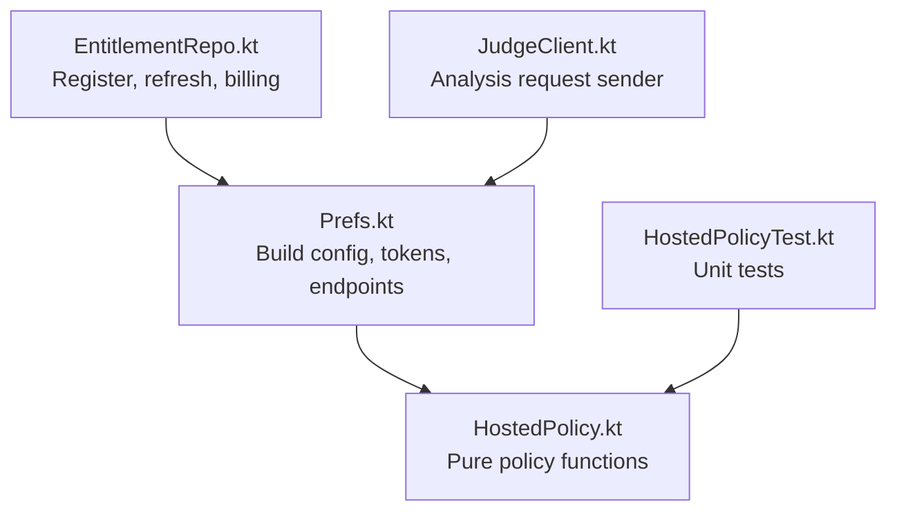
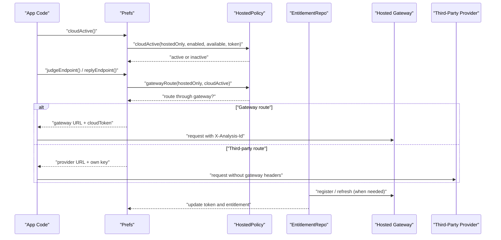
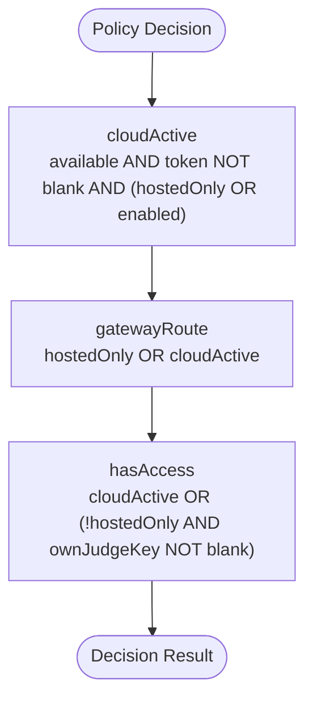
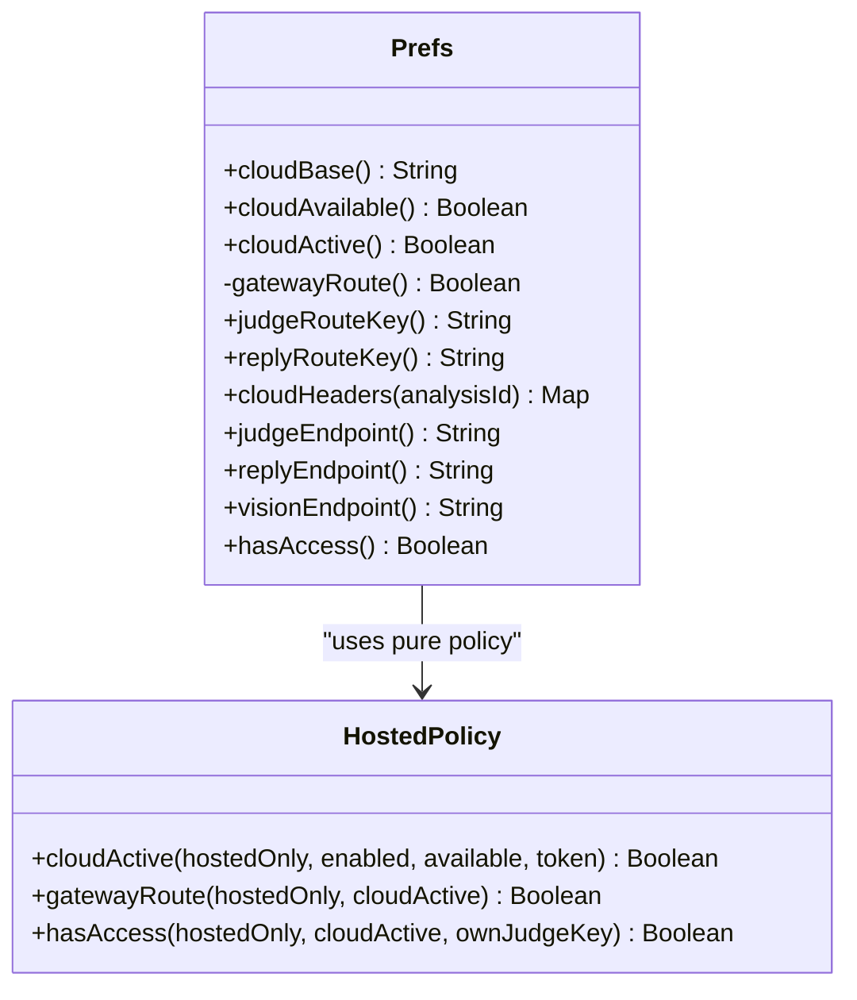
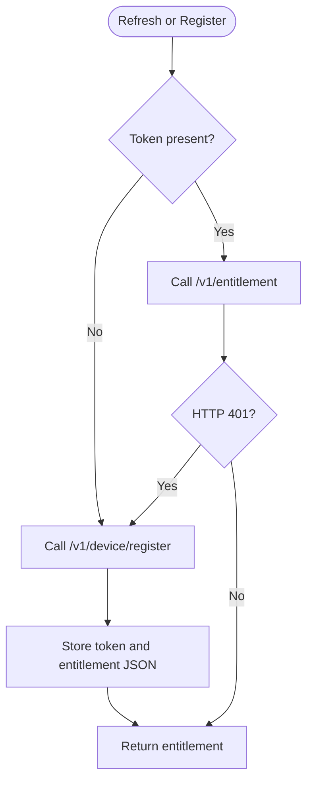
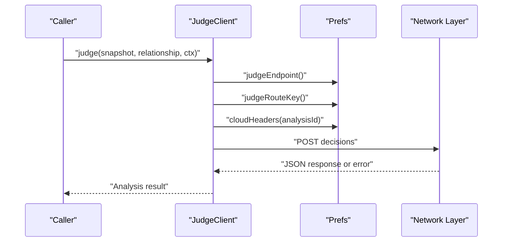
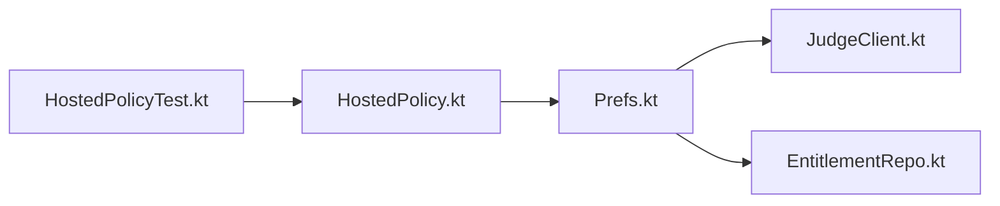

# Hosted Mode Policy and Routing

<cite>
**Referenced Files in This Document**
- [HostedPolicy.kt](file://app/src/main/java/com/jev/probe/core/HostedPolicy.kt)
- [HostedPolicyTest.kt](file://app/src/test/java/com/jev/probe/core/HostedPolicyTest.kt)
- [Prefs.kt](file://app/src/main/java/com/jev/probe/core/Prefs.kt)
- [EntitlementRepo.kt](file://app/src/main/java/com/jev/probe/billing/EntitlementRepo.kt)
- [JudgeClient.kt](file://app/src/main/java/com/jev/probe/jev/JudgeClient.kt)
</cite>

## Table of Contents
1. [Introduction](#introduction)
2. [Project Structure](#project-structure)
3. [Core Components](#core-components)
4. [Architecture Overview](#architecture-overview)
5. [Detailed Component Analysis](#detailed-component-analysis)
6. [Dependency Analysis](#dependency-analysis)
7. [Performance Considerations](#performance-considerations)
8. [Troubleshooting Guide](#troubleshooting-guide)
9. [Conclusion](#conclusion)

## Introduction
This document explains the hosted mode policy and routing logic used by the application to decide whether chat-related requests should go through the hosted gateway or fall back to third-party providers. The central invariant is that, in subscription-only builds, user chat text must never be sent directly to a third-party provider; instead, all such traffic is routed through the hosted gateway, even when the session token is temporarily missing.

The policy is implemented as pure functions so it can be tested without Android dependencies. Higher-level components then use these policies to select endpoints, credentials, headers, and feature access.

## Project Structure
The hosted mode logic spans a small set of focused files:

- `HostedPolicy.kt` defines the pure policy functions.
- `Prefs.kt` adapts build-time configuration, user preferences, and entitlement state into routing decisions.
- `EntitlementRepo.kt` handles device registration, token refresh, and billing-related gateway calls.
- `JudgeClient.kt` consumes the routing configuration to send analysis requests.
- `HostedPolicyTest.kt` documents the expected behavior through unit tests.

**Diagram sources**
- [HostedPolicy.kt:7-17](file://app/src/main/java/com/jev/probe/core/HostedPolicy.kt#L7-L17)
- [Prefs.kt:268-334](file://app/src/main/java/com/jev/probe/core/Prefs.kt#L268-L334)
- [EntitlementRepo.kt:74-104](file://app/src/main/java/com/jev/probe/billing/EntitlementRepo.kt#L74-L104)
- [JudgeClient.kt:19-112](file://app/src/main/java/com/jev/probe/jev/JudgeClient.kt#L19-L112)
- [HostedPolicyTest.kt:8-32](file://app/src/test/java/com/jev/probe/core/HostedPolicyTest.kt#L8-L32)

**Section sources**
- [HostedPolicy.kt:1-18](file://app/src/main/java/com/jev/probe/core/HostedPolicy.kt#L1-L18)
- [Prefs.kt:268-334](file://app/src/main/java/com/jev/probe/core/Prefs.kt#L268-L334)
- [EntitlementRepo.kt:74-104](file://app/src/main/java/com/jev/probe/billing/EntitlementRepo.kt#L74-L104)
- [JudgeClient.kt:19-112](file://app/src/main/java/com/jev/probe/jev/JudgeClient.kt#L19-L112)
- [HostedPolicyTest.kt:8-32](file://app/src/test/java/com/jev/probe/core/HostedPolicyTest.kt#L8-L32)

## Core Components
The hosted mode system has three main responsibilities:

1. Decide whether a hosted cloud session is active.
2. Decide whether network endpoints and credentials should route through the hosted gateway.
3. Decide whether analysis features are allowed for the current build and session state.

These responsibilities are encapsulated in `HostedPolicy`, while `Prefs` exposes them to callers and translates them into concrete endpoint URLs, credential values, and headers.

**Section sources**
- [HostedPolicy.kt:7-17](file://app/src/main/java/com/jev/probe/core/HostedPolicy.kt#L7-L17)
- [Prefs.kt:273-334](file://app/src/main/java/com/jev/probe/core/Prefs.kt#L273-L334)

## Architecture Overview
At runtime, the flow is:

- Build configuration determines whether this app variant includes a hosted gateway URL.
- User consent and optional manual enablement determine whether hosted mode may be used.
- Device registration obtains a gateway token.
- `Prefs` computes whether hosted mode is active and whether routing should go through the gateway.
- Clients like `JudgeClient` use the computed routing to choose endpoints and credentials.

**Diagram sources**
- [Prefs.kt:273-315](file://app/src/main/java/com/jev/probe/core/Prefs.kt#L273-L315)
- [HostedPolicy.kt:9-17](file://app/src/main/java/com/jev/probe/core/HostedPolicy.kt#L9-L17)
- [EntitlementRepo.kt:79-104](file://app/src/main/java/com/jev/probe/billing/EntitlementRepo.kt#L79-L104)
- [JudgeClient.kt:100-112](file://app/src/main/java/com/jev/probe/jev/JudgeClient.kt#L100-L112)

## Detailed Component Analysis

### HostedPolicy: Pure Access and Routing Rules
`HostedPolicy` is an object containing three pure functions:

| Function | Purpose | Key Behavior |
|---|---|---|
| `cloudActive` | Determines whether a hosted session is active | Requires availability and a non-blank token; in hosted-only builds, ignores the manual enable switch |
| `gatewayRoute` | Determines whether endpoints and credentials should go through the gateway | Always true in hosted-only builds; otherwise true when hosted session is active |
| `hasAccess` | Determines whether analysis features are allowed | In hosted-only builds, only an active hosted session grants access; in open-source builds, a user-provided judge key can also grant access |

The core invariant is enforced here: in hosted-only mode, user chat text is never sent to a third-party provider, and a user-provided key cannot bypass the hosted requirement.

**Diagram sources**
- [HostedPolicy.kt:9-17](file://app/src/main/java/com/jev/probe/core/HostedPolicy.kt#L9-L17)

**Section sources**
- [HostedPolicy.kt:3-17](file://app/src/main/java/com/jev/probe/core/HostedPolicy.kt#L3-L17)

### Prefs: Configuration, Routing, and Endpoint Selection
`Prefs` is the integration layer between build-time configuration, stored preferences, and the pure policy. It:

- Exposes whether the hosted gateway is available based on the build-time base URL.
- Wraps `HostedPolicy.cloudActive` as `cloudActive`.
- Uses `HostedPolicy.gatewayRoute` to select gateway or third-party endpoints.
- Selects credentials per route: gateway token for gateway routes, user keys for third-party routes.
- Adds metering headers only for gateway routes.
- Exposes `hasAccess` as the readiness gate for analysis features.

Important routing behaviors:

- `judgeEndpoint` returns the gateway `/v1/judge` URL when routing through the gateway; otherwise it selects a provider-specific endpoint.
- `replyEndpoint` returns the gateway `/v1/chat` URL when routing through the gateway; otherwise it uses the configured OpenAI-compatible provider endpoint.
- `cloudHeaders` adds `X-Analysis-Id` only when routing through the gateway.

**Diagram sources**
- [Prefs.kt:268-334](file://app/src/main/java/com/jev/probe/core/Prefs.kt#L268-L334)
- [HostedPolicy.kt:7-17](file://app/src/main/java/com/jev/probe/core/HostedPolicy.kt#L7-L17)

**Section sources**
- [Prefs.kt:268-334](file://app/src/main/java/com/jev/probe/core/Prefs.kt#L268-L334)

### EntitlementRepo: Token Lifecycle and Billing Integration
`EntitlementRepo` manages the hosted gateway lifecycle:

- Generates or retrieves a stable device identifier.
- Registers the device with the gateway and stores the returned token.
- Refreshes entitlement data, retrying registration on 401 responses.
- Skips background refresh unless the build supports hosted mode and the user has consented.
- Creates payment orders and checks order status.

This component does not itself decide whether hosted mode is enabled; it assumes the caller has already validated availability and consent.

**Diagram sources**
- [EntitlementRepo.kt:79-104](file://app/src/main/java/com/jev/probe/billing/EntitlementRepo.kt#L79-L104)

**Section sources**
- [EntitlementRepo.kt:60-104](file://app/src/main/java/com/jev/probe/billing/EntitlementRepo.kt#L60-L104)

### JudgeClient: Using Routing for Analysis Requests
`JudgeClient` sends analysis requests to either the hosted gateway or a third-party provider, depending on `Prefs`:

- Uses `prefs.judgeEndpoint()` to select the URL.
- Uses `prefs.judgeRouteKey()` to select the credential.
- Adds `X-Analysis-Id` via `prefs.cloudHeaders(analysisId)` only when routing through the gateway.
- Treats gateway-specific HTTP errors (such as 401, 402, 429) as paywall or authorization failures rather than payload issues.

**Diagram sources**
- [JudgeClient.kt:31-112](file://app/src/main/java/com/jev/probe/jev/JudgeClient.kt#L31-L112)
- [Prefs.kt:278-289](file://app/src/main/java/com/jev/probe/core/Prefs.kt#L278-L289)

**Section sources**
- [JudgeClient.kt:14-112](file://app/src/main/java/com/jev/probe/jev/JudgeClient.kt#L14-L112)

### Unit Tests: Behavioral Contract
`HostedPolicyTest` documents the expected behavior:

- Open-source builds require both the manual enable switch and a valid token.
- Hosted-only builds ignore the manual enable switch but still require availability and a non-blank token.
- Gateway routing is always enabled in hosted-only builds.
- A user-provided judge key cannot grant access in hosted-only builds.

These tests serve as the behavioral contract for hosted mode policy changes.

**Section sources**
- [HostedPolicyTest.kt:8-32](file://app/src/test/java/com/jev/probe/core/HostedPolicyTest.kt#L8-L32)

## Dependency Analysis
The dependency relationships are intentionally shallow:

- `HostedPolicy` has no Android or network dependencies.
- `Prefs` depends on `HostedPolicy` and on build-time configuration.
- `EntitlementRepo` depends on `Prefs` for gateway configuration and storage.
- `JudgeClient` depends on `Prefs` for routing decisions.
- Tests depend on `HostedPolicy` to verify policy behavior.

**Diagram sources**
- [HostedPolicy.kt:7-17](file://app/src/main/java/com/jev/probe/core/HostedPolicy.kt#L7-L17)
- [Prefs.kt:273-334](file://app/src/main/java/com/jev/probe/core/Prefs.kt#L273-L334)
- [EntitlementRepo.kt:79-104](file://app/src/main/java/com/jev/probe/billing/EntitlementRepo.kt#L79-L104)
- [JudgeClient.kt:100-112](file://app/src/main/java/com/jev/probe/jev/JudgeClient.kt#L100-L112)
- [HostedPolicyTest.kt:8-32](file://app/src/test/java/com/jev/probe/core/HostedPolicyTest.kt#L8-L32)

**Section sources**
- [HostedPolicy.kt:7-17](file://app/src/main/java/com/jev/probe/core/HostedPolicy.kt#L7-L17)
- [Prefs.kt:273-334](file://app/src/main/java/com/jev/probe/core/Prefs.kt#L273-L334)
- [EntitlementRepo.kt:79-104](file://app/src/main/java/com/jev/probe/billing/EntitlementRepo.kt#L79-L104)
- [JudgeClient.kt:100-112](file://app/src/main/java/com/jev/probe/jev/JudgeClient.kt#L100-L112)
- [HostedPolicyTest.kt:8-32](file://app/src/test/java/com/jev/probe/core/HostedPolicyTest.kt#L8-L32)

## Performance Considerations
- Policy evaluation is constant time and free of I/O, making it suitable for frequent decision points.
- Gateway routing avoids unnecessary third-party calls in hosted-only builds, reducing exposure of user data and simplifying billing.
- Metering via `X-Analysis-Id` groups related analysis calls under one billed unit when using the gateway.
- Token refresh retries once on 401, avoiding repeated expensive registration flows.

[No sources needed since this section provides general guidance]

## Troubleshooting Guide
Common scenarios and their likely causes:

| Symptom | Likely Cause | Recommended Check |
|---|---|---|
| Hosted mode appears disabled even though the user registered | Missing token, unavailable gateway, or consent not granted | Verify `cloudAvailable`, `cloudConsent`, and `cloudToken` |
| Analysis fails with a paywall-style error | Gateway rejected the request due to authorization, quota, or rate limits | Inspect HTTP status codes such as 401, 402, 429 |
| Third-party provider is called in hosted-only build | Policy or routing logic was changed incorrectly | Confirm `gatewayRoute` is true in hosted-only mode |
| Own judge key does not work in hosted-only build | Hosted-only mode forbids BYOK access | Use an active hosted session instead |

**Section sources**
- [HostedPolicy.kt:3-17](file://app/src/main/java/com/jev/probe/core/HostedPolicy.kt#L3-L17)
- [Prefs.kt:268-334](file://app/src/main/java/com/jev/probe/core/Prefs.kt#L268-L334)
- [EntitlementRepo.kt:79-104](file://app/src/main/java/com/jev/probe/billing/EntitlementRepo.kt#L79-L104)
- [JudgeClient.kt:88-112](file://app/src/main/java/com/jev/probe/jev/JudgeClient.kt#L88-L112)

## Conclusion
The hosted mode policy separates business rules from platform and network concerns. `HostedPolicy` enforces the security invariant that hosted-only builds never send chat text to third-party providers. `Prefs` translates those rules into concrete routing, credentials, and headers. `EntitlementRepo` manages the gateway token lifecycle, while `JudgeClient` consumes the routing configuration to perform analysis. The unit tests provide a clear behavioral contract that protects this design against regression.

[No sources needed since this section summarizes without analyzing specific files]