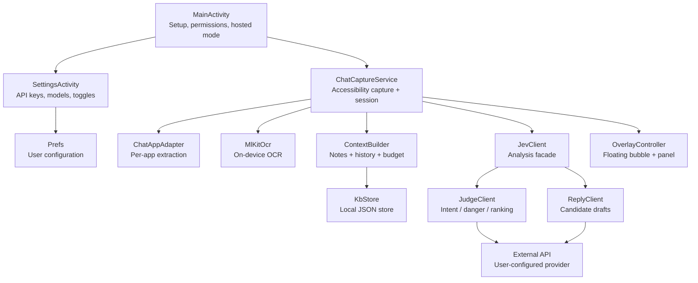
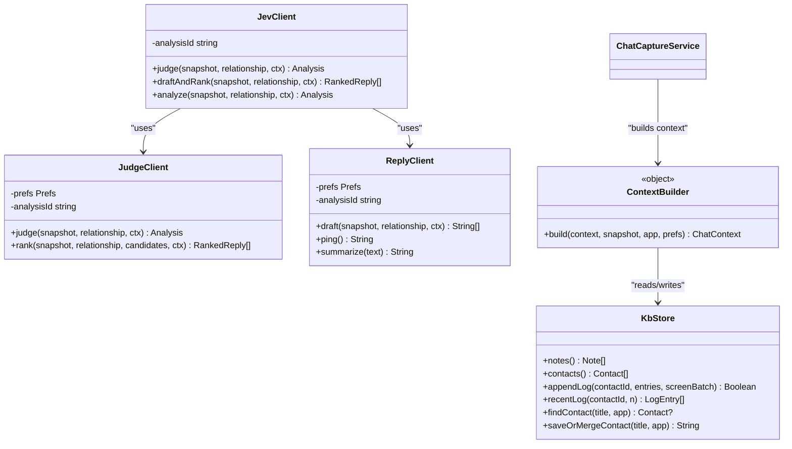
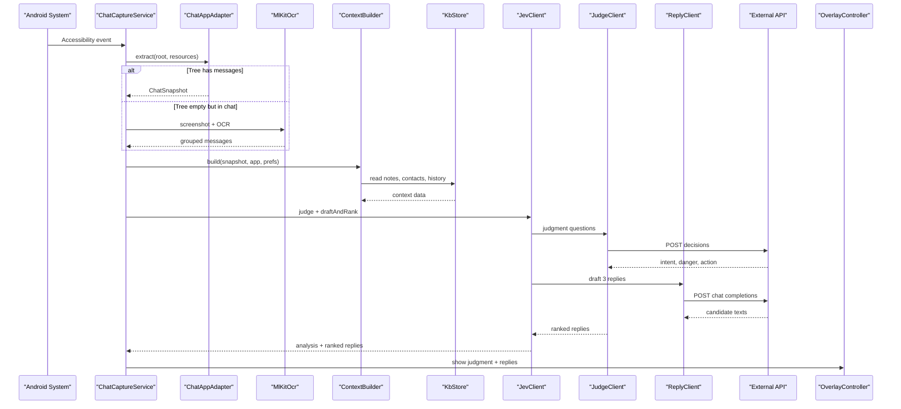
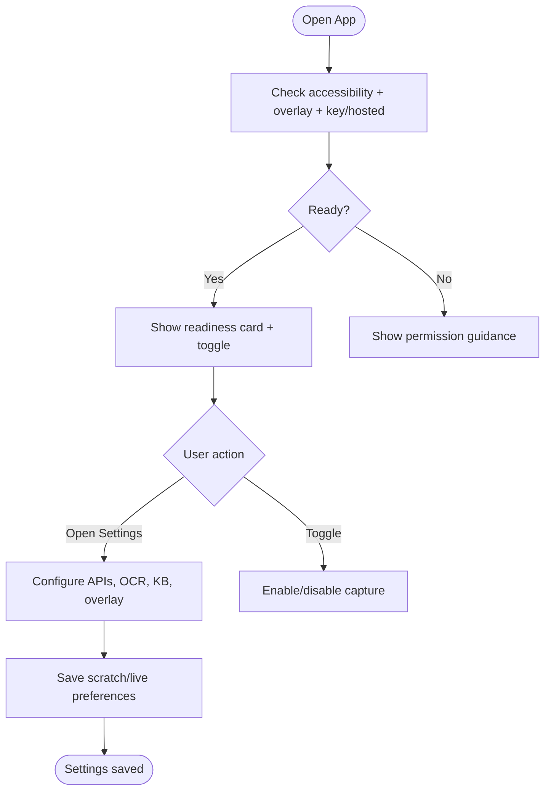
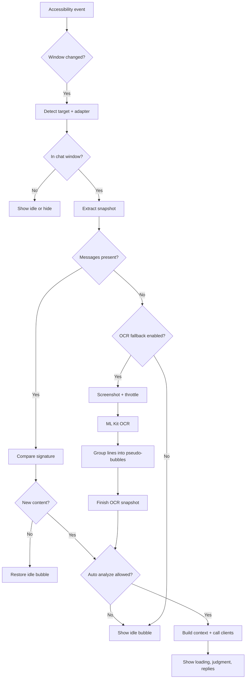
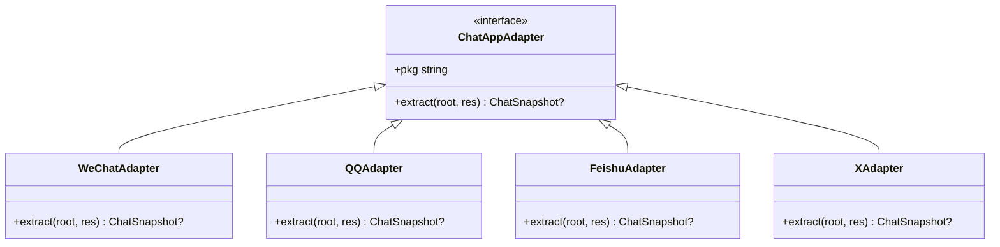
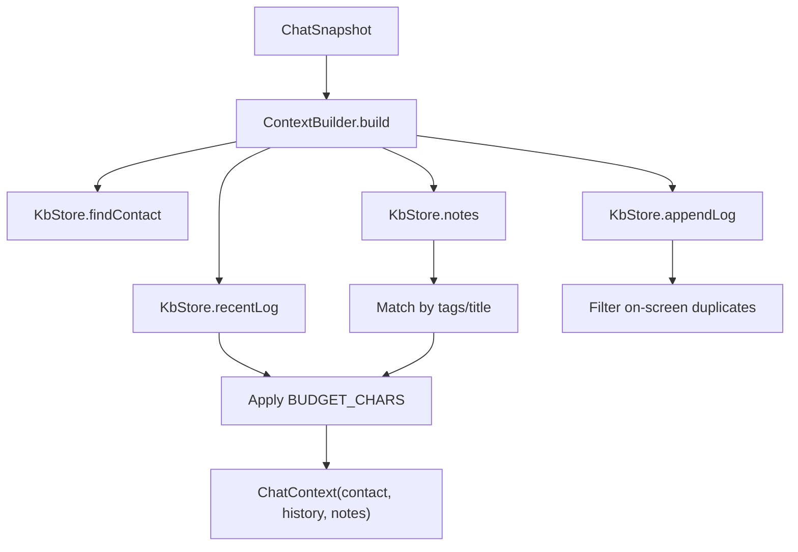
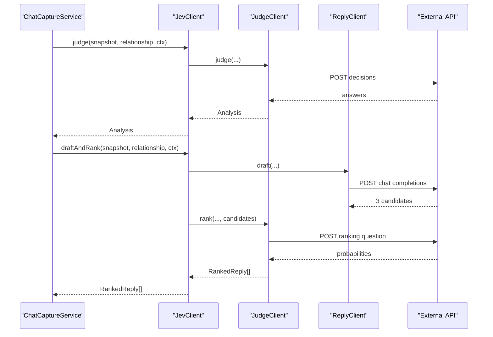
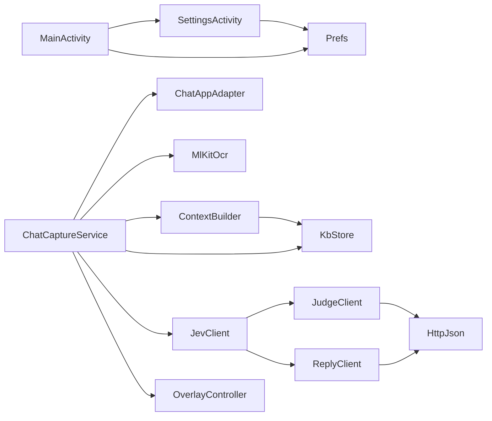

# System Overview

<cite>
**Referenced Files in This Document**   
- [MainActivity.kt](file://app/src/main/java/com/jev/probe/MainActivity.kt)
- [SettingsActivity.kt](file://app/src/main/java/com/jev/probe/SettingsActivity.kt)
- [ChatCaptureService.kt](file://app/src/main/java/com/jev/probe/capture/ChatCaptureService.kt)
- [ChatAppAdapter.kt](file://app/src/main/java/com/jev/probe/capture/ChatAppAdapter.kt)
- [MlKitOcr.kt](file://app/src/main/java/com/jev/probe/capture/ocr/MlKitOcr.kt)
- [KbStore.kt](file://app/src/main/java/com/jev/probe/core/kb/KbStore.kt)
- [ContextBuilder.kt](file://app/src/main/java/com/jev/probe/core/kb/ContextBuilder.kt)
- [OverlayController.kt](file://app/src/main/java/com/jev/probe/overlay/OverlayController.kt)
- [JevClient.kt](file://app/src/main/java/com/jev/probe/jev/JevClient.kt)
- [JudgeClient.kt](file://app/src/main/java/com/jev/probe/jev/JudgeClient.kt)
- [ReplyClient.kt](file://app/src/main/java/com/jev/probe/jev/ReplyClient.kt)
- [README.md](file://README.md)
</cite>

## Table of Contents
1. [Introduction](#introduction)
2. [Project Structure](#project-structure)
3. [Core Components](#core-components)
4. [Architecture Overview](#architecture-overview)
5. [Detailed Component Analysis](#detailed-component-analysis)
6. [Dependency Analysis](#dependency-analysis)
7. [Performance Considerations](#performance-considerations)
8. [Troubleshooting Guide](#troubleshooting-guide)
9. [Conclusion](#conclusion)

## Introduction
Jev Chat Jarvis is an Android assistant that observes supported chat applications, analyzes incoming messages locally and via user-configured AI endpoints, and presents risk-aware intent judgments plus ranked reply candidates through a floating overlay. The system separates presentation (Activities), background capture (Accessibility service), business logic (analysis pipeline and knowledge context), data persistence (local JSON store), and integration (external API clients). It emphasizes privacy: message capture and OCR run on the device; screenshots are not uploaded; sending replies is always manual.

The README describes the app as a “chat copilot” that reads screen content through Android’s accessibility interface, sends analysis requests to model providers configured by the user, and never auto-sends messages. It also documents platform support, setup steps, privacy boundaries, and known limitations such as ROM-level process freezing and OCR constraints.

**Section sources**
- [README.md:1-309](file://README.md#L1-L309)

## Project Structure
At a high level, the Android application is organized into feature-oriented packages under `com.jev.probe`:

| Layer | Responsibility | Key files |
|---|---|---|
| Presentation | User-facing screens for setup, configuration, billing, and knowledge management | `MainActivity.kt`, `SettingsActivity.kt` |
| Service | Background capture, session tracking, OCR fallback, overlay coordination | `ChatCaptureService.kt` |
| Capture adapters | Per-app rules turning a chat window into a neutral snapshot | `ChatAppAdapter.kt` |
| OCR | On-device text recognition from screenshots | `MlKitOcr.kt` |
| Business logic | Knowledge context assembly and analysis orchestration | `ContextBuilder.kt`, `JevClient.kt` |
| Data layer | Local notes, contacts, and per-contact chat history | `KbStore.kt` |
| Integration | HTTP clients for judgment, reply generation, vision, and shared JSON transport | `JudgeClient.kt`, `ReplyClient.kt`, `JevClient.kt` |
| Overlay | Floating bubble and translucent panel showing results and actions | `OverlayController.kt` |

**Diagram sources**
- [MainActivity.kt:26-113](file://app/src/main/java/com/jev/probe/MainActivity.kt#L26-L113)
- [SettingsActivity.kt:35-448](file://app/src/main/java/com/jev/probe/SettingsActivity.kt#L35-L448)
- [ChatCaptureService.kt:29-43](file://app/src/main/java/com/jev/probe/capture/ChatCaptureService.kt#L29-L43)
- [ChatAppAdapter.kt:10-30](file://app/src/main/java/com/jev/probe/capture/ChatAppAdapter.kt#L10-L30)
- [MlKitOcr.kt:13-25](file://app/src/main/java/com/jev/probe/capture/ocr/MlKitOcr.kt#L13-L25)
- [ContextBuilder.kt:8-19](file://app/src/main/java/com/jev/probe/core/kb/ContextBuilder.kt#L8-L19)
- [KbStore.kt:12-23](file://app/src/main/java/com/jev/probe/core/kb/KbStore.kt#L12-L23)
- [JevClient.kt:9-18](file://app/src/main/java/com/jev/probe/jev/JevClient.kt#L9-L18)
- [JudgeClient.kt:14-23](file://app/src/main/java/com/jev/probe/jev/JudgeClient.kt#L14-L23)
- [ReplyClient.kt:10-19](file://app/src/main/java/com/jev/probe/jev/ReplyClient.kt#L10-L19)
- [OverlayController.kt:29-38](file://app/src/main/java/com/jev/probe/overlay/OverlayController.kt#L29-L38)

**Section sources**
- [README.md:223-241](file://README.md#L223-L241)

## Core Components
This section summarizes the main architectural roles and how they interact during normal operation.

### Presentation Layer
- `MainActivity` is the home screen. It shows readiness status, permission guidance, optional hosted-mode enrollment, and a master toggle. It opens `SettingsActivity` and handles consent flows when enabling hosted analysis.
- `SettingsActivity` configures three API routes: judgment, reply, and vision. Each route supports preset providers or custom endpoints, stores keys and models, and provides connectivity tests. It also controls analysis behavior, OCR fallback, knowledge-base recording, and overlay appearance.

Key responsibilities:
- Permission and entitlement UX.
- Provider selection and endpoint resolution.
- Saving user preferences consumed by the service and clients.

**Section sources**
- [MainActivity.kt:26-113](file://app/src/main/java/com/jev/probe/MainActivity.kt#L26-L113)
- [SettingsActivity.kt:35-448](file://app/src/main/java/com/jev/probe/SettingsActivity.kt#L35-L448)

### Service Layer
`ChatCaptureService` is the central runtime component. It runs as an Android Accessibility service, watches foreground windows, identifies supported chat apps, extracts conversation snapshots, manages conversation sessions, triggers analysis, coordinates OCR fallback, and drives the overlay.

Key responsibilities:
- Listening to accessibility events and detecting window changes.
- Selecting the correct `ChatAppAdapter` by package name.
- Debouncing and deduplicating snapshots.
- Managing automatic vs manual analysis.
- Running judgment and reply generation off the main thread.
- Handling OCR screenshot capture, throttling, and failure backoff.
- Filling input fields safely without sending messages.

**Section sources**
- [ChatCaptureService.kt:29-43](file://app/src/main/java/com/jev/probe/capture/ChatCaptureService.kt#L29-L43)
- [ChatCaptureService.kt:239-360](file://app/src/main/java/com/jev/probe/capture/ChatCaptureService.kt#L239-L360)
- [ChatCaptureService.kt:389-455](file://app/src/main/java/com/jev/probe/capture/ChatCaptureService.kt#L389-L455)

### Business Logic Layer
The business logic layer transforms raw chat snapshots into actionable AI analysis.

- `ContextBuilder` builds lightweight knowledge context: matched contact, recent history, and matching notes. It enforces a character budget and avoids semantic search or embeddings.
- `JevClient` is a facade over `JudgeClient` and `ReplyClient`. It shares an analysis ID so hosted billing can group calls.
- `JudgeClient` posts structured judgment questions and parses intent, danger score, action advice, and reply ranking.
- `ReplyClient` posts OpenAI-compatible chat completions to draft three candidate replies.

**Diagram sources**
- [JevClient.kt:9-43](file://app/src/main/java/com/jev/probe/jev/JevClient.kt#L9-L43)
- [JudgeClient.kt:14-68](file://app/src/main/java/com/jev/probe/jev/JudgeClient.kt#L14-L68)
- [ReplyClient.kt:10-74](file://app/src/main/java/com/jev/probe/jev/ReplyClient.kt#L10-L74)
- [ContextBuilder.kt:8-63](file://app/src/main/java/com/jev/probe/core/kb/ContextBuilder.kt#L8-L63)
- [KbStore.kt:12-23](file://app/src/main/java/com/jev/probe/core/kb/KbStore.kt#L12-L23)

**Section sources**
- [ContextBuilder.kt:8-63](file://app/src/main/java/com/jev/probe/core/kb/ContextBuilder.kt#L8-L63)
- [JevClient.kt:9-43](file://app/src/main/java/com/jev/probe/jev/JevClient.kt#L9-L43)
- [JudgeClient.kt:14-68](file://app/src/main/java/com/jev/probe/jev/JudgeClient.kt#L14-L68)
- [ReplyClient.kt:10-74](file://app/src/main/java/com/jev/probe/jev/ReplyClient.kt#L10-L74)

### Data Layer
`KbStore` persists notes, contacts, and per-contact chat history under the app’s private files directory. It uses hand-written JSON serialization, atomic file writes, caches, and deduplication rules to avoid duplicate history lines and protect against partial writes.

Key characteristics:
- Notes and contacts are managed explicitly by the user.
- History is opt-in and bounded to a maximum number of lines.
- Name normalization removes zero-width characters and trailing member counts.
- Clear operations remove only knowledge data, leaving API keys and settings intact.

**Section sources**
- [KbStore.kt:12-23](file://app/src/main/java/com/jev/probe/core/kb/KbStore.kt#L12-L23)
- [KbStore.kt:147-241](file://app/src/main/java/com/jev/probe/core/kb/KbStore.kt#L147-L241)
- [KbStore.kt:430-459](file://app/src/main/java/com/jev/probe/core/kb/KbStore.kt#L430-L459)

### Integration Layer
Integration is split by purpose:
- Judgment: structured decision questions sent to a user-configured endpoint.
- Reply: generative OpenAI-compatible `/chat/completions` endpoint.
- Vision: optional vision endpoint used for testing and future OCR-related flows.
- Shared transport: JSON HTTP helpers, response shape parsing, and cloud headers.

Security considerations:
- Keys are stored in app preferences and passed to clients.
- Hosted mode adds an analysis ID header so the gateway can bill one analysis as a unit.
- The README clarifies that with a user-provided key, the author does not operate a transit server; with hosted mode, chat text passes through the operator’s gateway before reaching the model provider.

**Section sources**
- [JudgeClient.kt:79-112](file://app/src/main/java/com/jev/probe/jev/JudgeClient.kt#L79-L112)
- [ReplyClient.kt:81-92](file://app/src/main/java/com/jev/probe/jev/ReplyClient.kt#L81-L92)
- [README.md:62-70](file://README.md#L62-L70)
- [README.md:122-130](file://README.md#L122-L130)

## Architecture Overview
The end-to-end flow starts with Android accessibility events, moves through per-app adapters, optionally falls back to OCR, builds local knowledge context, calls external AI endpoints, and renders results in a floating overlay.

**Diagram sources**
- [ChatCaptureService.kt:239-360](file://app/src/main/java/com/jev/probe/capture/ChatCaptureService.kt#L239-L360)
- [ChatCaptureService.kt:389-455](file://app/src/main/java/com/jev/probe/capture/ChatCaptureService.kt#L389-L455)
- [ChatAppAdapter.kt:10-30](file://app/src/main/java/com/jev/probe/capture/ChatAppAdapter.kt#L10-L30)
- [MlKitOcr.kt:39-95](file://app/src/main/java/com/jev/probe/capture/ocr/MlKitOcr.kt#L39-L95)
- [ContextBuilder.kt:35-63](file://app/src/main/java/com/jev/probe/core/kb/ContextBuilder.kt#L35-L63)
- [KbStore.kt:147-241](file://app/src/main/java/com/jev/probe/core/kb/KbStore.kt#L147-L241)
- [JevClient.kt:22-34](file://app/src/main/java/com/jev/probe/jev/JevClient.kt#L22-L34)
- [JudgeClient.kt:31-55](file://app/src/main/java/com/jev/probe/jev/JudgeClient.kt#L31-L55)
- [ReplyClient.kt:28-38](file://app/src/main/java/com/jev/probe/jev/ReplyClient.kt#L28-L38)
- [OverlayController.kt:405-483](file://app/src/main/java/com/jev/probe/overlay/OverlayController.kt#L405-L483)

## Detailed Component Analysis

### Presentation Layer: MainActivity and SettingsActivity
`MainActivity` focuses on user readiness and consent. It checks accessibility, overlay permission, and whether the user has either a direct API key or an active hosted session. It exposes guided permission links, a master toggle, and hosted-mode enrollment with explicit consent.

`SettingsActivity` is the configuration hub. It supports multiple providers for each route, resolves base URLs and models, validates inputs, and performs connectivity tests using dedicated scratch preferences so live settings are not mutated by tests.

Important design points:
- Privacy hints explain where data goes depending on hosted vs self-hosted mode.
- API keys are masked in UI.
- Tests use isolated SharedPreferences instances.
- OCR fallback and knowledge history are configurable toggles.

**Diagram sources**
- [MainActivity.kt:67-113](file://app/src/main/java/com/jev/probe/MainActivity.kt#L67-L113)
- [SettingsActivity.kt:52-448](file://app/src/main/java/com/jev/probe/SettingsActivity.kt#L52-L448)

**Section sources**
- [MainActivity.kt:67-113](file://app/src/main/java/com/jev/probe/MainActivity.kt#L67-L113)
- [SettingsActivity.kt:52-448](file://app/src/main/java/com/jev/probe/SettingsActivity.kt#L52-L448)

### Service Layer: ChatCaptureService
`ChatCaptureService` implements the core runtime loop:

1. **Event handling**: reacts to window state, content change, and scroll events.
2. **Target detection**: determines the current app, title, and whether it is a chat window.
3. **Session management**: tracks tokens, liveness, and conversation switches.
4. **Deduplication**: compares signatures to avoid re-analyzing unchanged content.
5. **Automatic vs manual flow**: auto-analyze only when the latest message is from the other person and the setting is enabled; otherwise show an idle bubble.
6. **OCR fallback**: when the tree has no text, take a screenshot and run ML Kit OCR, with throttling and failure backoff.
7. **Analysis execution**: build context, call judgment and reply clients, update overlay, and handle paywall or error states.
8. **Input filling**: resolve the originating chat’s input node, write text, or fall back to clipboard.

**Diagram sources**
- [ChatCaptureService.kt:239-360](file://app/src/main/java/com/jev/probe/capture/ChatCaptureService.kt#L239-L360)
- [ChatCaptureService.kt:457-702](file://app/src/main/java/com/jev/probe/capture/ChatCaptureService.kt#L457-L702)
- [ChatCaptureService.kt:704-792](file://app/src/main/java/com/jev/probe/capture/ChatCaptureService.kt#L704-L792)

**Section sources**
- [ChatCaptureService.kt:239-360](file://app/src/main/java/com/jev/probe/capture/ChatCaptureService.kt#L239-L360)
- [ChatCaptureService.kt:389-455](file://app/src/main/java/com/jev/probe/capture/ChatCaptureService.kt#L389-L455)
- [ChatCaptureService.kt:457-702](file://app/src/main/java/com/jev/probe/capture/ChatCaptureService.kt#L457-L702)
- [ChatCaptureService.kt:704-792](file://app/src/main/java/com/jev/probe/capture/ChatCaptureService.kt#L704-L792)

### Capture Adapters: ChatAppAdapter Implementations
Each adapter converts a specific app’s accessibility tree into a neutral `ChatSnapshot`. The contract is:
- Return `null` if not in a chat window.
- Return a snapshot with an empty message list if in a chat window but the tree has no readable text.
- Return a snapshot with messages when normal extraction succeeds.

Supported implementations include:
- WeChat: uses a stable bubble id and side-by-side geometry; relies on OCR when text is hidden.
- QQ: uses message body ids and avatar-edge geometry to determine sender side.
- Feishu: returns bubble rectangles for targeted OCR because bodies are drawn rather than exposed as text nodes.
- X/Twitter: parses Compose row descriptions to extract sender and body.

**Diagram sources**
- [ChatAppAdapter.kt:10-30](file://app/src/main/java/com/jev/probe/capture/ChatAppAdapter.kt#L10-L30)
- [ChatAppAdapter.kt:139-179](file://app/src/main/java/com/jev/probe/capture/ChatAppAdapter.kt#L139-L179)
- [ChatAppAdapter.kt:197-247](file://app/src/main/java/com/jev/probe/capture/ChatAppAdapter.kt#L197-L247)
- [ChatAppAdapter.kt:319-376](file://app/src/main/java/com/jev/probe/capture/ChatAppAdapter.kt#L319-L376)
- [ChatAppAdapter.kt:440-510](file://app/src/main/java/com/jev/probe/capture/ChatAppAdapter.kt#L440-L510)

**Section sources**
- [ChatAppAdapter.kt:10-30](file://app/src/main/java/com/jev/probe/capture/ChatAppAdapter.kt#L10-L30)
- [ChatAppAdapter.kt:139-179](file://app/src/main/java/com/jev/probe/capture/ChatAppAdapter.kt#L139-L179)
- [ChatAppAdapter.kt:197-247](file://app/src/main/java/com/jev/probe/capture/ChatAppAdapter.kt#L197-L247)
- [ChatAppAdapter.kt:319-376](file://app/src/main/java/com/jev/probe/capture/ChatAppAdapter.kt#L319-L376)
- [ChatAppAdapter.kt:440-510](file://app/src/main/java/com/jev/probe/capture/ChatAppAdapter.kt#L440-L510)

### OCR Engine: MlKitOcr
`MlKitOcr` wraps Google ML Kit’s bundled Chinese recognizer. It:
- Accepts a bitmap and an optional region.
- Crops safely and handles invalid regions.
- Converts ML Kit line boxes from bitmap space to screen coordinates.
- Posts callbacks to the main thread.
- Warms up the recognizer off the main thread to avoid first-use latency.

Privacy note: the bundled model ships inside the APK and does not require Google Play services; screenshots are processed locally.

**Section sources**
- [MlKitOcr.kt:13-25](file://app/src/main/java/com/jev/probe/capture/ocr/MlKitOcr.kt#L13-L25)
- [MlKitOcr.kt:39-95](file://app/src/main/java/com/jev/probe/capture/ocr/MlKitOcr.kt#L39-L95)
- [MlKitOcr.kt:97-112](file://app/src/main/java/com/jev/probe/capture/ocr/MlKitOcr.kt#L97-L112)

### Data Layer: KbStore and ContextBuilder
`KbStore` manages:
- Notes: title, content, tags, always-on flag, enabled flag, timestamp.
- Contacts: name, aliases, apps, relationship, notes, auto-summary flag.
- Per-contact logs: side, text, timestamp, app, bounded size.
- Atomic writes and corruption handling.

`ContextBuilder` composes:
- Matched contact.
- Recent history filtered against on-screen messages.
- Matching notes based on title and recent messages.
- A strict character budget that trims history first, then notes.

**Diagram sources**
- [ContextBuilder.kt:35-63](file://app/src/main/java/com/jev/probe/core/kb/ContextBuilder.kt#L35-L63)
- [ContextBuilder.kt:70-91](file://app/src/main/java/com/jev/probe/core/kb/ContextBuilder.kt#L70-L91)
- [ContextBuilder.kt:93-116](file://app/src/main/java/com/jev/probe/core/kb/ContextBuilder.kt#L93-L116)
- [KbStore.kt:147-241](file://app/src/main/java/com/jev/probe/core/kb/KbStore.kt#L147-L241)

**Section sources**
- [ContextBuilder.kt:8-63](file://app/src/main/java/com/jev/probe/core/kb/ContextBuilder.kt#L8-L63)
- [ContextBuilder.kt:70-116](file://app/src/main/java/com/jev/probe/core/kb/ContextBuilder.kt#L70-L116)
- [KbStore.kt:12-23](file://app/src/main/java/com/jev/probe/core/kb/KbStore.kt#L12-L23)
- [KbStore.kt:147-241](file://app/src/main/java/com/jev/probe/core/kb/KbStore.kt#L147-L241)

### Integration Layer: JevClient, JudgeClient, ReplyClient
`JevClient` orchestrates one analysis:
- Judgment: fast structured decision questions.
- Draft and rank: generate three replies, then rank them.
- Sequential analyze helper for settings tests.

`JudgeClient` posts structured questions and parses choices, scores, and ranked replies. It retries enriched requests once if unknown fields cause a client error, while preserving gateway-specific errors like authentication or rate limits.

`ReplyClient` posts OpenAI-compatible chat completions, injects knowledge context when available, and supports ping and summarization utilities.

**Diagram sources**
- [JevClient.kt:22-43](file://app/src/main/java/com/jev/probe/jev/JevClient.kt#L22-L43)
- [JudgeClient.kt:31-68](file://app/src/main/java/com/jev/probe/jev/JudgeClient.kt#L31-L68)
- [JudgeClient.kt:79-112](file://app/src/main/java/com/jev/probe/jev/JudgeClient.kt#L79-L112)
- [ReplyClient.kt:28-38](file://app/src/main/java/com/jev/probe/jev/ReplyClient.kt#L28-L38)
- [ReplyClient.kt:81-92](file://app/src/main/java/com/jev/probe/jev/ReplyClient.kt#L81-L92)

**Section sources**
- [JevClient.kt:9-43](file://app/src/main/java/com/jev/probe/jev/JevClient.kt#L9-L43)
- [JudgeClient.kt:14-112](file://app/src/main/java/com/jev/probe/jev/JudgeClient.kt#L14-L112)
- [ReplyClient.kt:10-92](file://app/src/main/java/com/jev/probe/jev/ReplyClient.kt#L10-L92)

### Overlay: Floating Bubble and Panel
`OverlayController` manages:
- A draggable floating bubble.
- An expandable translucent panel.
- Idle, loading, error, paywall, notice, judgment, and reply states.
- Copy and fill actions.
- Hiding itself during screenshots so the captured image does not include the overlay.

It deliberately never sends messages. All user actions are copy, fill, open settings, save contact, or trigger OCR.

**Section sources**
- [OverlayController.kt:29-38](file://app/src/main/java/com/jev/probe/overlay/OverlayController.kt#L29-L38)
- [OverlayController.kt:95-188](file://app/src/main/java/com/jev/probe/overlay/OverlayController.kt#L95-L188)
- [OverlayController.kt:196-284](file://app/src/main/java/com/jev/probe/overlay/OverlayController.kt#L196-L284)
- [OverlayController.kt:286-483](file://app/src/main/java/com/jev/probe/overlay/OverlayController.kt#L286-L483)

## Dependency Analysis
The system exhibits clear layering with controlled coupling:

- Activities depend on `Prefs` and launch each other; they do not directly perform capture or network I/O.
- `ChatCaptureService` depends on adapters, OCR, context builder, store, overlay, and clients.
- `ContextBuilder` depends only on `KbStore` and `Prefs`; it contains no network code.
- Clients depend on `Prefs` and shared HTTP/response utilities; they encapsulate protocol details.
- `OverlayController` is driven by the service and remains UI-only.

**Diagram sources**
- [MainActivity.kt:26-113](file://app/src/main/java/com/jev/probe/MainActivity.kt#L26-L113)
- [SettingsActivity.kt:35-448](file://app/src/main/java/com/jev/probe/SettingsActivity.kt#L35-L448)
- [ChatCaptureService.kt:29-43](file://app/src/main/java/com/jev/probe/capture/ChatCaptureService.kt#L29-L43)
- [ChatAppAdapter.kt:10-30](file://app/src/main/java/com/jev/probe/capture/ChatAppAdapter.kt#L10-L30)
- [MlKitOcr.kt:13-25](file://app/src/main/java/com/jev/probe/capture/ocr/MlKitOcr.kt#L13-L25)
- [ContextBuilder.kt:8-19](file://app/src/main/java/com/jev/probe/core/kb/ContextBuilder.kt#L8-L19)
- [KbStore.kt:12-23](file://app/src/main/java/com/jev/probe/core/kb/KbStore.kt#L12-L23)
- [JevClient.kt:9-18](file://app/src/main/java/com/jev/probe/jev/JevClient.kt#L9-L18)
- [JudgeClient.kt:14-23](file://app/src/main/java/com/jev/probe/jev/JudgeClient.kt#L14-L23)
- [ReplyClient.kt:10-19](file://app/src/main/java/com/jev/probe/jev/ReplyClient.kt#L10-L19)
- [OverlayController.kt:29-38](file://app/src/main/java/com/jev/probe/overlay/OverlayController.kt#L29-L38)

**Section sources**
- [ChatCaptureService.kt:29-43](file://app/src/main/java/com/jev/probe/capture/ChatCaptureService.kt#L29-L43)
- [JevClient.kt:9-18](file://app/src/main/java/com/jev/probe/jev/JevClient.kt#L9-L18)

## Performance Considerations
Several mechanisms reduce unnecessary work and keep the UI responsive:

- **Debounced analysis**: content-change events are coalesced with a delay to avoid repeated analysis during rapid UI updates.
- **Signature-based deduplication**: unchanged snapshots do not re-run analysis or recreate overlay content.
- **Background threads**: analysis tasks run on worker pools; main-thread callbacks update the overlay.
- **OCR throttling**: screenshot capture includes throttling and failure backoff to prevent continuous scanning.
- **Model warm-up**: ML Kit recognizer is warmed up after service connection to move model loading off the first screenshot callback.
- **Bounded history**: per-contact log size is limited, and recent history injection respects a configurable cap.
- **Character budget**: knowledge context is trimmed to stay within a fixed budget before being sent to AI endpoints.
- **Overlay opacity**: adjustable transparency reduces visual obstruction without changing processing cost.

These strategies address common Android challenges such as process freezing on certain ROMs, expensive OCR, and slow network calls.

**Section sources**
- [ChatCaptureService.kt:168-180](file://app/src/main/java/com/jev/probe/capture/ChatCaptureService.kt#L168-L180)
- [ChatCaptureService.kt:351-360](file://app/src/main/java/com/jev/probe/capture/ChatCaptureService.kt#L351-L360)
- [ChatCaptureService.kt:227-236](file://app/src/main/java/com/jev/probe/capture/ChatCaptureService.kt#L227-L236)
- [MlKitOcr.kt:100-112](file://app/src/main/java/com/jev/probe/capture/ocr/MlKitOcr.kt#L100-L112)
- [KbStore.kt:147-241](file://app/src/main/java/com/jev/probe/core/kb/KbStore.kt#L147-L241)
- [ContextBuilder.kt:18-28](file://app/src/main/java/com/jev/probe/core/kb/ContextBuilder.kt#L18-L28)
- [OverlayController.kt:83-87](file://app/src/main/java/com/jev/probe/overlay/OverlayController.kt#L83-L87)
- [README.md:243-254](file://README.md#L243-L254)

## Troubleshooting Guide
Common operational issues and their architectural causes:

| Symptom | Likely cause | Recommended action |
|---|---|---|
| Overlay disappears or messages stop analyzing | ROM freezes background processes | Enable accessibility, overlay, auto-start, and battery optimization exemption; reopen the chat to recover. |
| No text from Feishu | Message bodies are drawn, not exposed in the accessibility tree | Use OCR fallback; the adapter reports bubble rectangles for targeted OCR. |
| Manual OCR fails | Accessibility service cannot capture the screen or the app blocks screenshots | Re-enable accessibility; some protected windows cannot be captured. |
| Judgment test fails | Missing or invalid API key, wrong provider path, or unsupported endpoint | Verify base URL, key, model, and provider selection; use the built-in test button. |
| Reply test fails | Missing reply key or non-OpenAI-compatible endpoint | Fill reply base URL, key, and model; inherit from judgment key if appropriate. |
| Vision test says unsupported | Selected provider does not support vision images | Switch to a provider that supports vision or leave vision blank. |
| Knowledge history grows unexpectedly | History recording is enabled and deduplication did not skip identical screens | Review history count and deduplication behavior; clear knowledge data if needed. |

Security and privacy reminders:
- The app does not send messages automatically.
- Screenshots are processed locally; they are not uploaded.
- With a user-provided key, the author does not operate a transit server.
- With hosted mode, chat text passes through the operator’s gateway before reaching the model provider.

**Section sources**
- [README.md:139-188](file://README.md#L139-L188)
- [README.md:243-254](file://README.md#L243-L254)
- [SettingsActivity.kt:158-307](file://app/src/main/java/com/jev/probe/SettingsActivity.kt#L158-L307)
- [ChatCaptureService.kt:457-702](file://app/src/main/java/com/jev/probe/capture/ChatCaptureService.kt#L457-L702)

## Conclusion
Jev Chat Jarvis follows a clean, layered Android architecture:

- **Presentation** surfaces setup, configuration, and privacy choices.
- **Service** owns lifecycle, capture, session state, OCR fallback, and orchestration.
- **Business logic** builds lightweight knowledge context and coordinates structured judgment with generative reply drafting.
- **Data layer** keeps notes, contacts, and history local, auditable, and bounded.
- **Integration layer** isolates external API concerns behind typed clients.

The system boundary is clear: capture and OCR happen on the device; analysis requests go to user-configured providers; sending remains manual. Security considerations center on accessibility permissions, overlay permissions, local-only OCR, and explicit consent for hosted mode. Performance optimizations focus on debouncing, deduplication, background execution, throttled OCR, bounded context, and responsive overlay rendering.