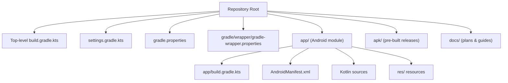
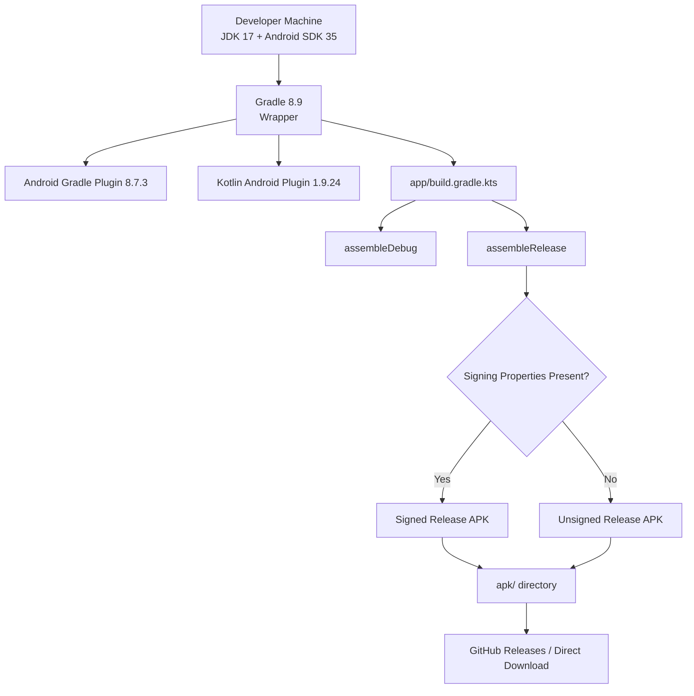
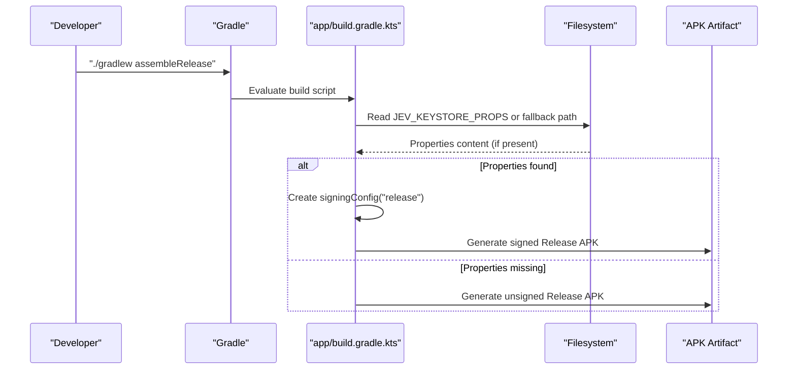
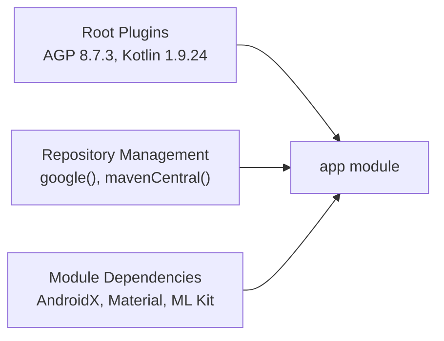

# Deployment & Distribution

<cite>
**Referenced Files in This Document**
- [build.gradle.kts](file://build.gradle.kts)
- [app/build.gradle.kts](file://app/build.gradle.kts)
- [gradle.properties](file://gradle.properties)
- [settings.gradle.kts](file://settings.gradle.kts)
- [gradle-wrapper.properties](file://gradle/wrapper/gradle-wrapper.properties)
- [README.md](file://README.md)
- [v1.3-plan.md](file://docs/v1.3-plan.md)
</cite>

## Table of Contents
1. [Introduction](#introduction)
2. [Project Structure](#project-structure)
3. [Core Components](#core-components)
4. [Architecture Overview](#architecture-overview)
5. [Detailed Component Analysis](#detailed-component-analysis)
6. [Dependency Analysis](#dependency-analysis)
7. [Performance Considerations](#performance-considerations)
8. [Troubleshooting Guide](#troubleshooting-guide)
9. [Conclusion](#conclusion)
10. [Appendices](#appendices)

## Introduction
This document explains the deployment and distribution sub-component for the Android application. It covers how Gradle builds debug and release APKs, how signing is configured, how versioning works, where pre-built artifacts are published, and what build environment is required. It also documents security considerations for release builds, code obfuscation status, resource optimization choices, and guidance for future production hardening such as ProGuard/R8, performance profiling, and official app store distribution.

## Project Structure
The Android module is a single `:app` module under an Android Gradle project. The top-level build file declares shared plugins, while the module build file configures SDK versions, signing, packaging, Java/Kotlin targets, and dependencies. Gradle wrapper and repository configuration live in standard locations.

**Diagram sources**
- [build.gradle.kts:1-6](file://build.gradle.kts#L1-L6)
- [settings.gradle.kts:1-19](file://settings.gradle.kts#L1-L19)
- [gradle.properties:1-13](file://gradle.properties#L1-L13)
- [gradle-wrapper.properties:1-8](file://gradle/wrapper/gradle-wrapper.properties#L1-L8)
- [app/build.gradle.kts:1-96](file://app/build.gradle.kts#L1-L96)

**Section sources**
- [build.gradle.kts:1-6](file://build.gradle.kts#L1-L6)
- [settings.gradle.kts:1-19](file://settings.gradle.kts#L1-L19)
- [gradle.properties:1-13](file://gradle.properties#L1-L13)
- [gradle-wrapper.properties:1-8](file://gradle/wrapper/gradle-wrapper.properties#L1-L8)
- [app/build.gradle.kts:1-96](file://app/build.gradle.kts#L1-L96)

## Core Components
- Top-level Gradle plugin declarations define Android and Kotlin plugin versions used by the project.
- Module-level Gradle script defines:
  - Application ID, namespace, compile/target/min SDK levels.
  - Versioning via `versionCode` and `versionName`.
  - Signing configuration loaded from an external properties file controlled by an environment variable.
  - Release build type with optional signing and minification toggle.
  - Packaging options for native libraries.
  - Java and Kotlin target compatibility.
  - Dependencies including ML Kit Chinese OCR.
- Repository management centralizes Maven repositories and disables per-project repository overrides.
- README documents direct APK download links and basic build commands.

**Section sources**
- [build.gradle.kts:1-6](file://build.gradle.kts#L1-L6)
- [app/build.gradle.kts:1-96](file://app/build.gradle.kts#L1-L96)
- [settings.gradle.kts:1-19](file://settings.gradle.kts#L1-L19)
- [README.md:22-24](file://README.md#L22-L24)
- [README.md:86-92](file://README.md#L86-L92)
- [README.md:224-240](file://README.md#L224-L240)

## Architecture Overview
The build and distribution pipeline is centered on Gradle and the Android Gradle Plugin. Debug builds are straightforward; release builds require an external keystore properties file. Pre-signed APKs are committed to the repository’s `apk/` directory and linked from the README.

**Diagram sources**
- [build.gradle.kts:1-6](file://build.gradle.kts#L1-L6)
- [app/build.gradle.kts:9-15](file://app/build.gradle.kts#L9-L15)
- [app/build.gradle.kts:46-62](file://app/build.gradle.kts#L46-L62)
- [gradle-wrapper.properties:1-8](file://gradle/wrapper/gradle-wrapper.properties#L1-L8)
- [README.md:86-92](file://README.md#L86-L92)

## Detailed Component Analysis

### Build System and Environment
- Gradle wrapper uses Gradle 8.9.
- Android Gradle Plugin 8.7.3 and Kotlin Android Plugin 1.9.24 are declared at the root level.
- Project-wide JVM arguments enable parallel execution and caching.
- AndroidX is enabled and non-transitive R class is turned on.
- JDK 17 is required for both Java and Kotlin compilation targets.

Recommended environment:
- JDK 17 (pointed to via `JAVA_HOME`).
- Android SDK platform 35 and build tools 35.
- Gradle 8.9 (managed by wrapper).

**Section sources**
- [gradle-wrapper.properties:1-8](file://gradle/wrapper/gradle-wrapper.properties#L1-L8)
- [build.gradle.kts:1-6](file://build.gradle.kts#L1-L6)
- [gradle.properties:1-13](file://gradle.properties#L1-L13)
- [README.md:224-231](file://README.md#L224-L231)

### Debug Builds
- Command: `./gradlew assembleDebug`.
- Output path: `app/build/outputs/apk/debug/app-debug.apk`.
- No signing configuration is applied to debug builds in the module script; they are typically signed automatically by IDE or ADB install flows.

Use cases:
- Local development and testing.
- CI smoke tests without needing release credentials.

**Section sources**
- [README.md:224-231](file://README.md#L224-L231)

### Release Builds and Signing Configuration
- Command: `./gradlew assembleRelease`.
- Signing is conditional:
  - The module reads a keystore properties file from a path determined by `JEV_KEYSTORE_PROPS`, falling back to a local machine path if not set.
  - If the properties file exists, a `release` signing config is created with store file, password, key alias, and key password.
  - The release build type applies this signing config when present.
- Without the properties file, the release build remains unsigned.

Security notes:
- Keystore credentials must never be committed to the repository.
- Use environment variables or secure secret managers to supply the properties path and contents.
- Keep the keystore file outside the repo and restrict access.

**Diagram sources**
- [app/build.gradle.kts:9-15](file://app/build.gradle.kts#L9-L15)
- [app/build.gradle.kts:46-62](file://app/build.gradle.kts#L46-L62)

**Section sources**
- [app/build.gradle.kts:9-15](file://app/build.gradle.kts#L9-L15)
- [app/build.gradle.kts:46-62](file://app/build.gradle.kts#L46-L62)
- [README.md:224-231](file://README.md#L224-L231)

### APK Generation and Packaging
- Debug APK: produced by `assembleDebug`.
- Release APK: produced by `assembleRelease`; may be signed depending on keystore properties.
- Native library packaging:
  - NDK ABI filter is restricted to `arm64-v8a`.
  - Legacy packaging is disabled so `.so` files are uncompressed and page-aligned, improving Android 15+ behavior and allowing memory-mapped loading of ML Kit natives.

Implications:
- APK size is larger due to bundled ML Kit Chinese OCR model.
- Only ARM64 devices are supported by the release artifact.

**Section sources**
- [app/build.gradle.kts:37-40](file://app/build.gradle.kts#L37-L40)
- [app/build.gradle.kts:64-71](file://app/build.gradle.kts#L64-L71)
- [README.md:253-254](file://README.md#L253-L254)

### Versioning and Changelog Maintenance
- Version identifiers:
  - `versionCode = 5`
  - `versionName = "1.4"`
- Historical planning indicates that version bumps should increment `versionCode` and update `versionName`, while keeping `targetSdk` stable unless intentionally raised.
- The README references a changelog link and current version badge.

Recommended workflow:
- Increment `versionCode` for each publishable release.
- Update `versionName` to match semantic versioning.
- Maintain a CHANGELOG or equivalent release notes aligned with GitHub Releases.

**Section sources**
- [app/build.gradle.kts:21-27](file://app/build.gradle.kts#L21-L27)
- [docs/v1.3-plan.md:132-134](file://docs/v1.3-plan.md#L132-L134)
- [README.md:11-14](file://README.md#L11-L14)

### Distribution Channels
- Direct APK downloads:
  - The README provides a direct raw GitHub URL to the v1.4 release APK.
  - The `apk/` directory contains pre-signed release APKs.
- GitHub Releases:
  - The README points to GitHub Releases for historical versions and release notes.
- Official app stores:
  - Not currently implemented in the analyzed build scripts; would require additional Play Store-specific configuration and publishing automation.

Intended use cases:
- Direct APKs for quick installation on compatible devices.
- GitHub Releases for versioned, documented distributions.
- Future Play Store publication can be added alongside existing channels.

**Section sources**
- [README.md:22-24](file://README.md#L22-L24)
- [README.md:86-92](file://README.md#L86-L92)
- [README.md:239-240](file://README.md#L239-L240)

### Security Considerations for Release Builds
- Do not commit keystore files or passwords.
- Use `JEV_KEYSTORE_PROPS` to point to a secure location outside the repository.
- Restrict filesystem permissions on the keystore and properties file.
- Avoid logging secrets; ensure CI pipelines inject secrets securely.
- Verify signatures before distributing APKs.

**Section sources**
- [app/build.gradle.kts:9-15](file://app/build.gradle.kts#L9-L15)
- [app/build.gradle.kts:46-62](file://app/build.gradle.kts#L46-L62)

### Code Obfuscation and Resource Optimization
- Current state:
  - Minification is disabled in the release build type (`isMinifyEnabled = false`).
- Implications:
  - Faster builds but larger APK and less protection against reverse engineering.
- Recommendations for production:
  - Enable R8/ProGuard (`isMinifyEnabled = true`) and configure rules for third-party libraries.
  - Enable resource shrinking and compression selectively.
  - Validate functionality after enabling minification.

**Section sources**
- [app/build.gradle.kts:57-62](file://app/build.gradle.kts#L57-L62)

### Performance Profiling for Production Releases
- Use Android Studio Profiler (CPU, Memory, Network, Energy) on release builds to validate performance characteristics.
- Profile ML Kit OCR paths and network calls to identify bottlenecks.
- Monitor APK size and runtime memory usage post-minification.

[No sources needed since this section provides general guidance]

## Dependency Analysis
The project centralizes dependency resolution and plugin versions:
- Root build file pins Android and Kotlin plugin versions.
- Module build file declares AndroidX, Material, ConstraintLayout, and ML Kit dependencies.
- Repository management disallows per-module repository overrides, ensuring consistent dependency sources.

**Diagram sources**
- [build.gradle.kts:1-6](file://build.gradle.kts#L1-L6)
- [settings.gradle.kts:1-19](file://settings.gradle.kts#L1-L19)
- [app/build.gradle.kts:83-95](file://app/build.gradle.kts#L83-L95)

**Section sources**
- [build.gradle.kts:1-6](file://build.gradle.kts#L1-L6)
- [settings.gradle.kts:1-19](file://settings.gradle.kts#L1-L19)
- [app/build.gradle.kts:83-95](file://app/build.gradle.kts#L83-L95)

## Performance Considerations
- APK size:
  - ML Kit Chinese OCR increases APK size significantly; only `arm64-v8a` is included.
- Native packaging:
  - Disabling legacy packaging improves load time and reduces unpack overhead on modern Android versions.
- Build speed:
  - Parallel execution and Gradle cache are enabled.
- Future optimizations:
  - Enable minification and resource shrinking for production.
  - Profile OCR and network I/O to reduce latency and memory pressure.

**Section sources**
- [app/build.gradle.kts:37-40](file://app/build.gradle.kts#L37-L40)
- [app/build.gradle.kts:64-71](file://app/build.gradle.kts#L64-L71)
- [gradle.properties:5-7](file://gradle.properties#L5-L7)
- [README.md:253-254](file://README.md#L253-L254)

## Troubleshooting Guide
Common issues and resolutions:
- Missing keystore properties:
  - Set `JEV_KEYSTORE_PROPS` to point to a valid properties file containing keystore details.
  - Without it, release builds remain unsigned.
- Signature mismatch during installation:
  - Uninstall any previously installed debug or differently signed release APK before installing a new release.
- Android 15+ native loading issues:
  - Ensure legacy packaging is disabled and ABI filters are correct.
- Large APK size:
  - Expect increased size due to bundled OCR model; consider enabling minification later.

**Section sources**
- [app/build.gradle.kts:9-15](file://app/build.gradle.kts#L9-L15)
- [app/build.gradle.kts:46-62](file://app/build.gradle.kts#L46-L62)
- [app/build.gradle.kts:64-71](file://app/build.gradle.kts#L64-L71)
- [README.md:86-102](file://README.md#L86-L102)
- [README.md:253-254](file://README.md#L253-L254)

## Conclusion
The project uses a clean Gradle-based build with explicit plugin versions, centralized repository management, and a secure, externalized signing configuration for release builds. Debug builds are straightforward, while release builds require a keystore properties file supplied via environment variable. Pre-signed APKs are distributed directly through GitHub and linked from the README. For production readiness, consider enabling minification, adding automated changelog and release workflows, and evaluating official app store distribution.

[No sources needed since this section summarizes without analyzing specific files]

## Appendices

### Build Commands Reference
- Debug build: `./gradlew assembleDebug`
- Release build: `./gradlew assembleRelease`

**Section sources**
- [README.md:224-231](file://README.md#L224-L231)

### Environment Requirements Summary
- JDK 17
- Android SDK platform 35 and build tools 35
- Gradle 8.9 (via wrapper)

**Section sources**
- [README.md:224-231](file://README.md#L224-L231)
- [gradle-wrapper.properties:1-8](file://gradle/wrapper/gradle-wrapper.properties#L1-L8)