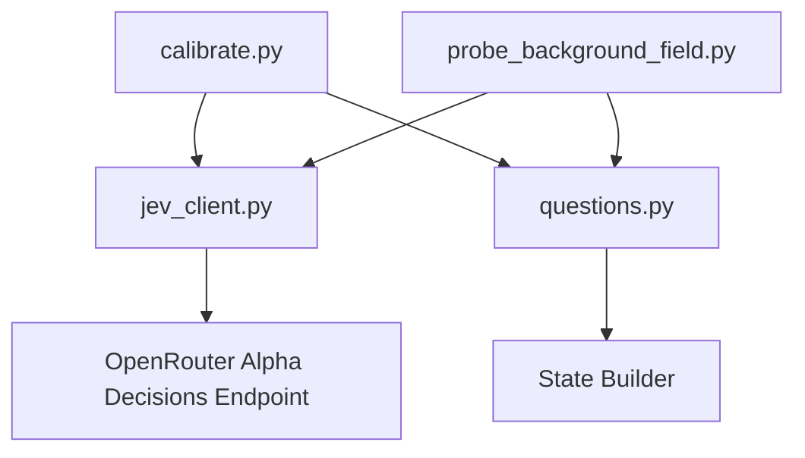
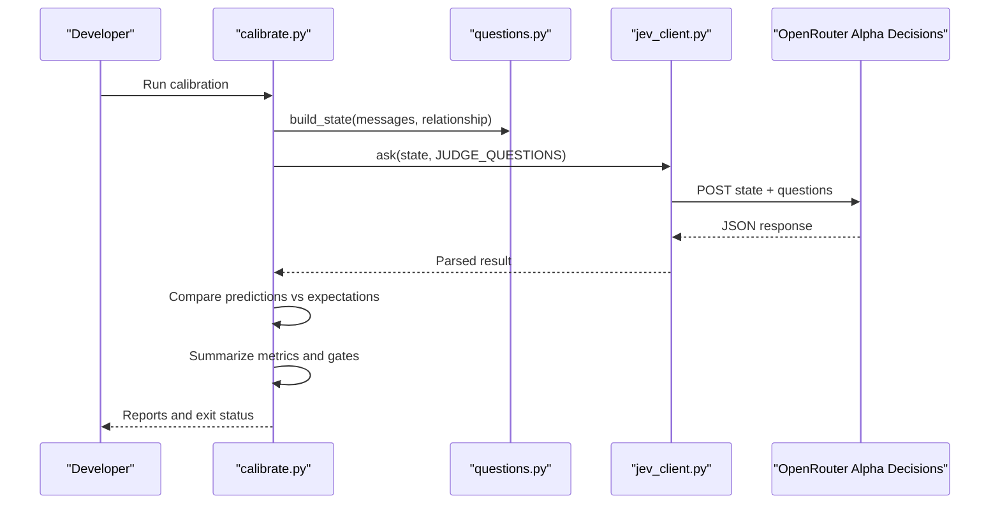
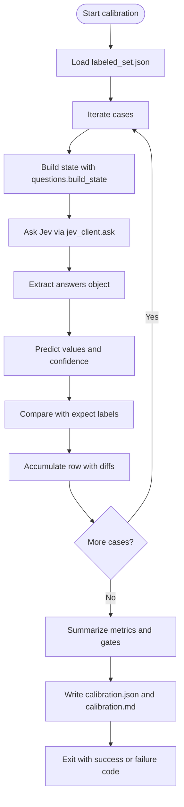
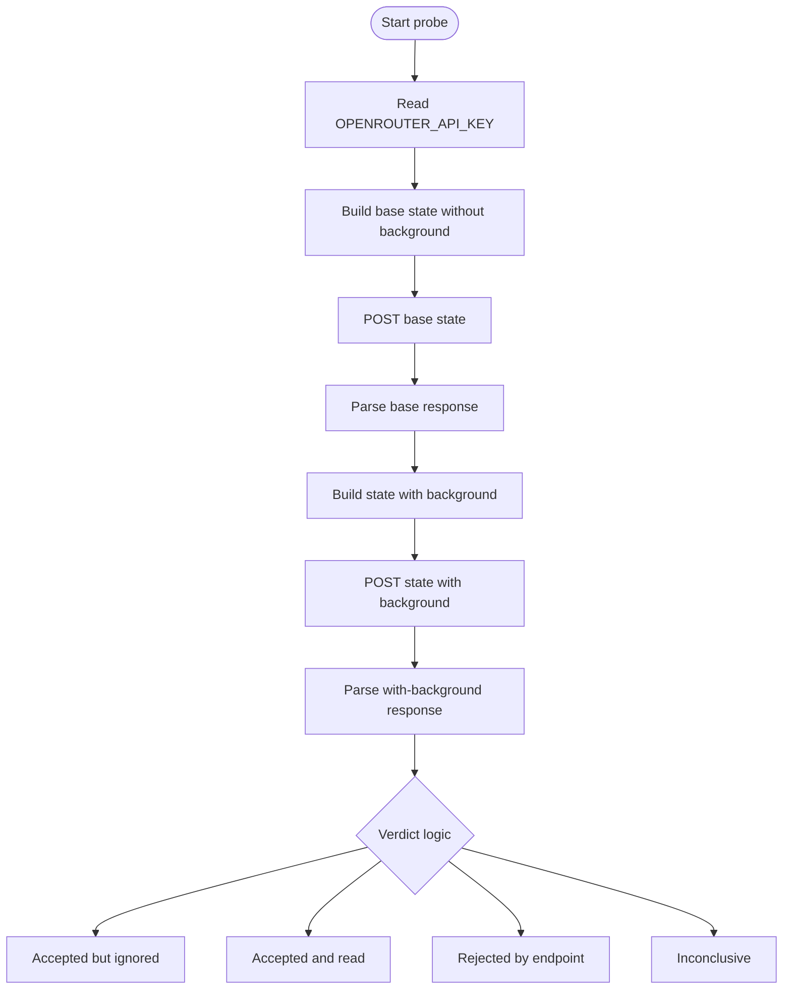
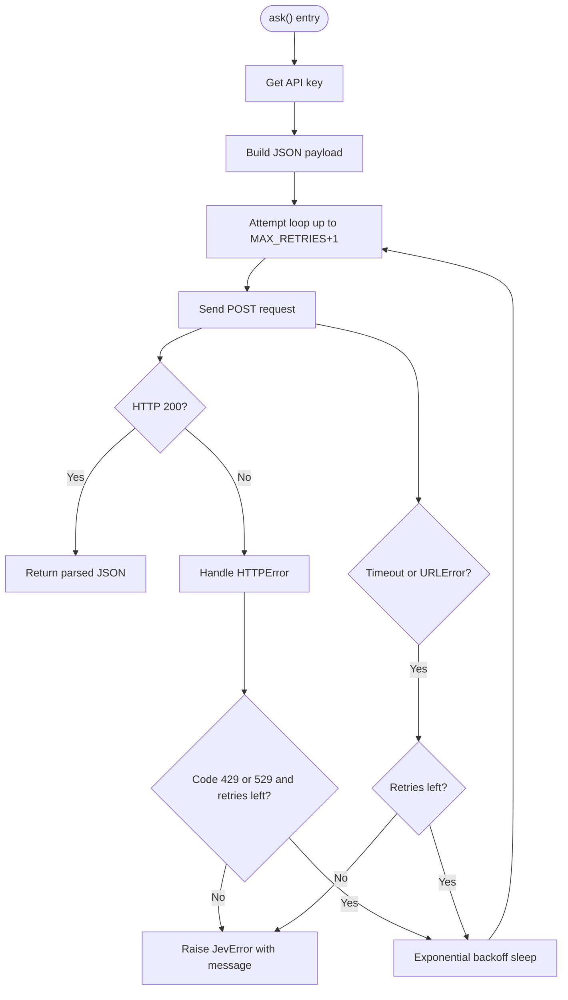
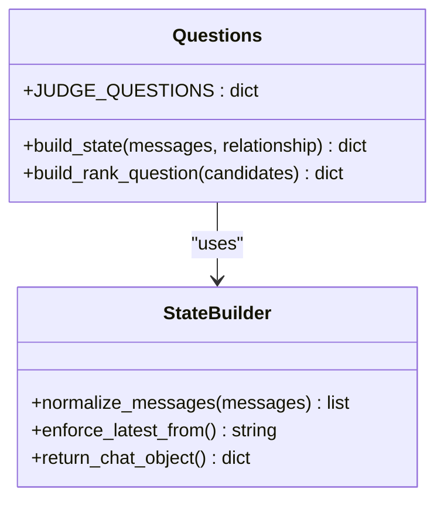
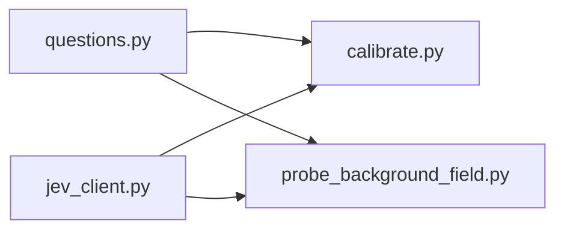
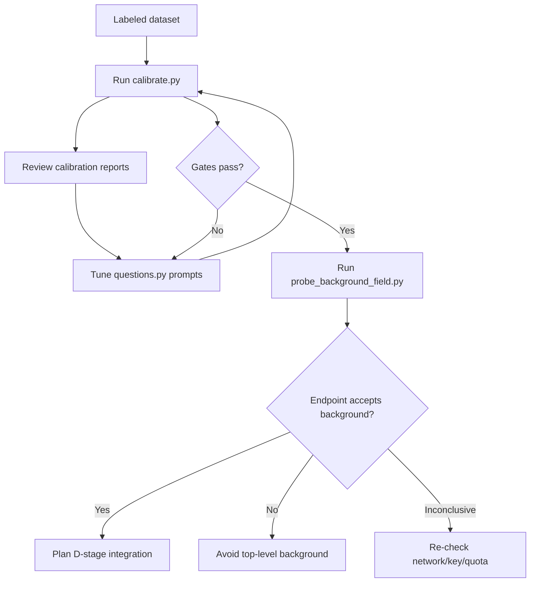

# Development Tools

<cite>
**Referenced Files in This Document**
- [calibrate.py](file://tools/jev/calibrate.py)
- [probe_background_field.py](file://tools/jev/probe_background_field.py)
- [jev_client.py](file://tools/jev/jev_client.py)
- [questions.py](file://tools/jev/questions.py)
- [TASK.md](file://tools/jev/TASK.md)
</cite>

## Table of Contents
1. [Introduction](#introduction)
2. [Project Structure](#project-structure)
3. [Core Components](#core-components)
4. [Architecture Overview](#architecture-overview)
5. [Detailed Component Analysis](#detailed-component-analysis)
6. [Dependency Analysis](#dependency-analysis)
7. [Performance Considerations](#performance-considerations)
8. [Troubleshooting Guide](#troubleshooting-guide)
9. [Development Workflow](#development-workflow)
10. [Conclusion](#conclusion)

## Introduction
This document explains the Python-based development tools under `tools/jev`. These tools support tuning AI model performance and prompt effectiveness for a judgment layer that analyzes chat conversations and recommends how to respond. The key components are:

- `calibrate.py`: Runs a labeled dataset against the Jev endpoint, compares model outputs with human expectations, and writes calibration reports.
- `probe_background_field.py`: Tests whether an unknown top-level `background` field is accepted or rejected by the live endpoint.
- `jev_client.py`: A lightweight Python wrapper around the Jev decisions API, handling authentication, retries, timeouts, and error formatting.
- `questions.py`: Defines the standardized question set used for model calibration and evaluation, plus helpers for building state and ranking candidate replies.

These scripts are designed for local development and quality assurance. They do not modify application code; they exercise the external endpoint and produce structured results for review.

## Project Structure
The development tools are contained in `tools/jev/`. The relevant files are:

| File | Purpose |
|---|---|
| `tools/jev/calibrate.py` | End-to-end calibration runner over a labeled dataset |
| `tools/jev/probe_background_field.py` | Wire-format probe for an unknown `background` field |
| `tools/jev/jev_client.py` | HTTP client wrapper for the Jev decisions API |
| `tools/jev/questions.py` | Fixed question definitions and state-building helpers |
| `tools/jev/TASK.md` | Task specification describing constraints, expected behavior, and acceptance criteria |

**Diagram sources**
- [calibrate.py:19-20](file://tools/jev/calibrate.py#L19-L20)
- [probe_background_field.py:26-27](file://tools/jev/probe_background_field.py#L26-L27)
- [jev_client.py:12-13](file://tools/jev/jev_client.py#L12-L13)
- [questions.py:207-226](file://tools/jev/questions.py#L207-L226)

**Section sources**
- [TASK.md:57-80](file://tools/jev/TASK.md#L57-L80)

## Core Components
This section summarizes each tool’s role, inputs, outputs, and configuration.

### Calibration Runner: `calibrate.py`
- Loads a labeled dataset from `fixtures/labeled_set.json`.
- Builds conversation state using `questions.build_state`.
- Sends questions defined in `questions.JUDGE_QUESTIONS` through `jev_client.ask`.
- Compares predicted answers with expected labels.
- Produces per-question metrics, latency, token usage, cost, and pass/fail gates.
- Writes `report/calibration.json` and `report/calibration.md`, redacting secrets.

Key behaviors:
- Serial execution with a small delay between cases to reduce rate-limiting risk.
- Supports `--limit N` to run only the first N cases during debugging.
- Exits with non-zero status when errors occur or calibration gates fail.

**Section sources**
- [calibrate.py:22-27](file://tools/jev/calibrate.py#L22-L27)
- [calibrate.py:30-37](file://tools/jev/calibrate.py#L30-L37)
- [calibrate.py:131-171](file://tools/jev/calibrate.py#L131-L171)
- [calibrate.py:174-246](file://tools/jev/calibrate.py#L174-L246)
- [calibrate.py:311-365](file://tools/jev/calibrate.py#L311-L365)

### Background Field Probe: `probe_background_field.py`
- Sends two requests to the live endpoint: one without `background`, one with it.
- Prints HTTP status, latency, and parsed answer fields.
- Provides a verdict indicating whether the endpoint accepts, ignores, or rejects the extra field.

Configuration:
- Requires `OPENROUTER_API_KEY` environment variable.
- Uses a fixed model name and endpoint URL.
- Includes a minimal chat fixture and a simple question definition.

**Section sources**
- [probe_background_field.py:1-16](file://tools/jev/probe_background_field.py#L1-L16)
- [probe_background_field.py:26-46](file://tools/jev/probe_background_field.py#L26-L46)
- [probe_background_field.py:64-98](file://tools/jev/probe_background_field.py#L64-L98)
- [probe_background_field.py:114-143](file://tools/jev/probe_background_field.py#L114-L143)

### Jev Client Wrapper: `jev_client.py`
- Encapsulates POST requests to the Jev decisions endpoint.
- Reads the API key from `OPENROUTER_API_KEY`.
- Retries on specific HTTP codes and network issues with exponential backoff.
- Raises `JevError` with readable messages and optional HTTP status.
- Redacts secrets before printing or writing output.

API contract:
- `ask(state, questions, timeout=20)` returns parsed JSON response.
- `redact_secrets(text)` removes the live API key from strings.

**Section sources**
- [jev_client.py:1-30](file://tools/jev/jev_client.py#L1-L30)
- [jev_client.py:33-40](file://tools/jev/jev_client.py#L33-L40)
- [jev_client.py:51-107](file://tools/jev/jev_client.py#L51-L107)

### Standardized Question Set: `questions.py`
- Defines `JUDGE_QUESTIONS`, a fixed set of judgment prompts covering literal meaning, intent, danger level, reply timing, best action, needs, and tension resolution.
- Provides `build_state(messages, relationship)` to normalize chat history into the required structure.
- Provides `build_rank_question(candidates)` to generate a three-option reply ranking question.

Design notes:
- Instructions and criteria use English to match the model’s training language.
- Chat content remains in its original language.
- The state builder enforces allowed sender values and keeps the most recent messages.

**Section sources**
- [questions.py:1-204](file://tools/jev/questions.py#L1-L204)
- [questions.py:207-226](file://tools/jev/questions.py#L207-L226)
- [questions.py:229-247](file://tools/jev/questions.py#L229-L247)

## Architecture Overview
The development tools form a layered workflow:

- `questions.py` defines stable prompts and state construction logic.
- `jev_client.py` handles network communication, retries, and error reporting.
- `calibrate.py` orchestrates dataset runs and produces calibration artifacts.
- `probe_background_field.py` performs targeted wire-format validation.

**Diagram sources**
- [calibrate.py:131-171](file://tools/jev/calibrate.py#L131-L171)
- [calibrate.py:174-246](file://tools/jev/calibrate.py#L174-L246)
- [jev_client.py:51-107](file://tools/jev/jev_client.py#L51-L107)
- [questions.py:207-226](file://tools/jev/questions.py#L207-L226)

## Detailed Component Analysis

### Calibration Pipeline
The calibration pipeline loads labeled cases, builds state, queries the model, extracts answers, compares them with expectations, and aggregates metrics.

**Diagram sources**
- [calibrate.py:30-37](file://tools/jev/calibrate.py#L30-L37)
- [calibrate.py:131-171](file://tools/jev/calibrate.py#L131-L171)
- [calibrate.py:174-246](file://tools/jev/calibrate.py#L174-L246)
- [calibrate.py:311-365](file://tools/jev/calibrate.py#L311-L365)

**Section sources**
- [calibrate.py:30-37](file://tools/jev/calibrate.py#L30-L37)
- [calibrate.py:131-171](file://tools/jev/calibrate.py#L131-L171)
- [calibrate.py:174-246](file://tools/jev/calibrate.py#L174-L246)
- [calibrate.py:311-365](file://tools/jev/calibrate.py#L311-L365)

### Background Field Detection Accuracy Probe
The probe tests whether adding a top-level `background` field changes endpoint behavior. It sends two fixtures and prints a verdict.

**Diagram sources**
- [probe_background_field.py:64-98](file://tools/jev/probe_background_field.py#L64-L98)
- [probe_background_field.py:114-143](file://tools/jev/probe_background_field.py#L114-L143)

**Section sources**
- [probe_background_field.py:64-98](file://tools/jev/probe_background_field.py#L64-L98)
- [probe_background_field.py:114-143](file://tools/jev/probe_background_field.py#L114-L143)

### Jev Client Error Handling and Retry Logic
The client implements robust retry behavior and clear error messaging.

**Diagram sources**
- [jev_client.py:51-107](file://tools/jev/jev_client.py#L51-L107)

**Section sources**
- [jev_client.py:51-107](file://tools/jev/jev_client.py#L51-L107)

### Question Definitions and State Builder
The question module centralizes prompt design and input normalization.

**Diagram sources**
- [questions.py:5-204](file://tools/jev/questions.py#L5-L204)
- [questions.py:207-226](file://tools/jev/questions.py#L207-L226)
- [questions.py:229-247](file://tools/jev/questions.py#L229-L247)

**Section sources**
- [questions.py:5-204](file://tools/jev/questions.py#L5-L204)
- [questions.py:207-226](file://tools/jev/questions.py#L207-L226)
- [questions.py:229-247](file://tools/jev/questions.py#L229-L247)

## Dependency Analysis
The tools have clear dependencies:

- `calibrate.py` depends on `jev_client.ask` and `questions.JUDGE_QUESTIONS` plus `questions.build_state`.
- `probe_background_field.py` directly uses the endpoint URL and model name, and constructs its own minimal question set.
- `jev_client.py` is the lowest-level dependency and does not import other project modules.
- `questions.py` is self-contained except for standard library usage.

**Diagram sources**
- [calibrate.py:19-20](file://tools/jev/calibrate.py#L19-L20)
- [probe_background_field.py:26-27](file://tools/jev/probe_background_field.py#L26-L27)
- [jev_client.py:12-13](file://tools/jev/jev_client.py#L12-L13)

**Section sources**
- [calibrate.py:19-20](file://tools/jev/calibrate.py#L19-L20)
- [probe_background_field.py:26-27](file://tools/jev/probe_background_field.py#L26-L27)
- [jev_client.py:12-13](file://tools/jev/jev_client.py#L12-L13)

## Performance Considerations
- Calibration runs cases serially with a short delay to reduce rate-limiting pressure.
- The client retries transient failures with exponential backoff.
- Token usage and cost are collected from endpoint responses and included in calibration summaries.
- Latency is measured per case and aggregated into average latency.

Recommendations:
- Use `--limit` during prompt iteration to speed up feedback loops.
- Monitor total cost and token counts when expanding the labeled dataset.
- Keep payloads minimal during development probes to avoid unnecessary overhead.

[No sources needed since this section provides general guidance]

## Troubleshooting Guide
Common issues and resolutions:

| Symptom | Likely Cause | Resolution |
|---|---|---|
| Missing API key error | `OPENROUTER_API_KEY` not exported | Export the key in your shell environment before running any script |
| HTTP 401 | Invalid or unauthorized API key | Verify the key prefix and account permissions |
| HTTP 422 | Malformed request body or invalid question schema | Check state structure and question definitions |
| HTTP 429 | Rate limiting | Wait longer; the client already retries with backoff |
| HTTP 529 | Provider overload | Wait and retry; the client already retries with backoff |
| Calibration gates fail | Model performance below thresholds | Review prompt wording, criteria clarity, and labeled dataset coverage |
| Background field probe inconclusive | Network instability or quota issue | Re-run after confirming connectivity and quota availability |

Secret safety:
- Scripts redact the API key from logs and report files.
- Never hardcode keys in source files or commit them.

**Section sources**
- [jev_client.py:23-30](file://tools/jev/jev_client.py#L23-L30)
- [jev_client.py:33-40](file://tools/jev/jev_client.py#L33-L40)
- [jev_client.py:80-107](file://tools/jev/jev_client.py#L80-L107)
- [calibrate.py:345-354](file://tools/jev/calibrate.py#L345-L354)

## Development Workflow
The intended workflow integrates these tools into the model improvement cycle:

1. **Prepare labeled data**: Ensure `fixtures/labeled_set.json` covers diverse scenarios and includes expected labels for intent, danger level, needs, and tension resolution.
2. **Run baseline calibration**: Execute `calibrate.py` to measure current performance and identify weak areas.
3. **Inspect reports**: Review `report/calibration.json` and `report/calibration.md` for per-question hit rates, confidence, MAE, latency, cost, and gate status.
4. **Refine prompts**: Adjust instructions and criteria in `questions.py` to resolve contradictions and improve alignment with expectations.
5. **Re-run calibration**: Validate improvements and confirm gates pass.
6. **Validate wire format**: Use `probe_background_field.py` to verify whether new fields like `background` are accepted, ignored, or rejected by the endpoint.
7. **Integrate into QA**: Treat calibration gates as quality checks before merging prompt changes.

**Diagram sources**
- [calibrate.py:311-365](file://tools/jev/calibrate.py#L311-L365)
- [probe_background_field.py:114-143](file://tools/jev/probe_background_field.py#L114-L143)

**Section sources**
- [TASK.md:91-102](file://tools/jev/TASK.md#L91-L102)
- [calibrate.py:311-365](file://tools/jev/calibrate.py#L311-L365)
- [probe_background_field.py:114-143](file://tools/jev/probe_background_field.py#L114-L143)

## Conclusion
The `tools/jev` suite provides a focused, secure, and repeatable workflow for calibrating and evaluating the Jev judgment layer. `questions.py` centralizes prompt design, `jev_client.py` ensures reliable endpoint interaction, `calibrate.py` measures performance against labeled expectations, and `probe_background_field.py` validates wire-format compatibility. Together, they enable iterative prompt refinement, automated quality gates, and safe integration planning for new request fields.

[No sources needed since this section summarizes without analyzing specific files]