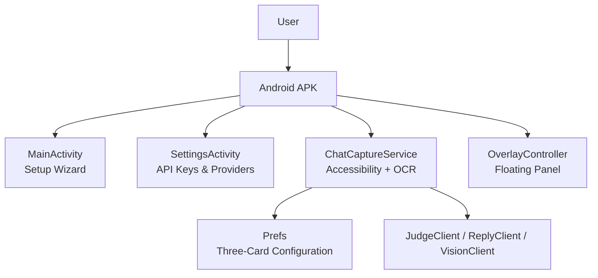
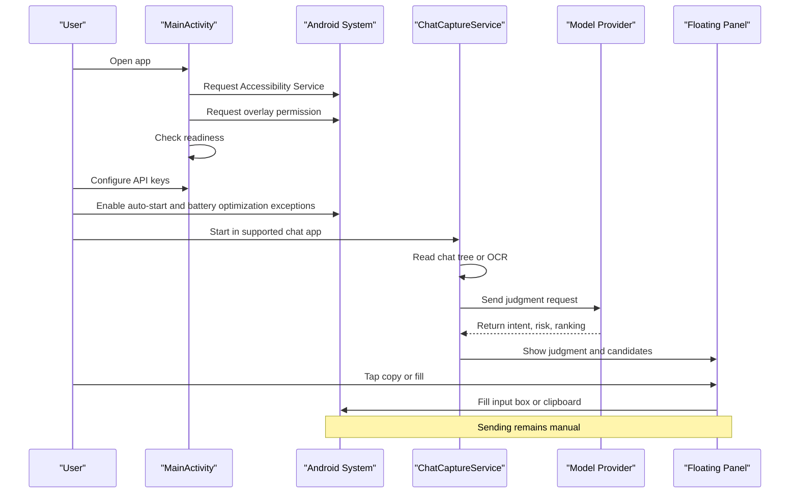
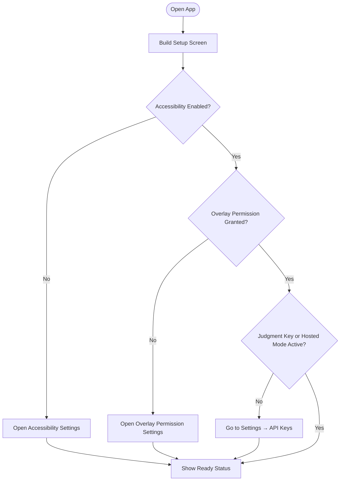
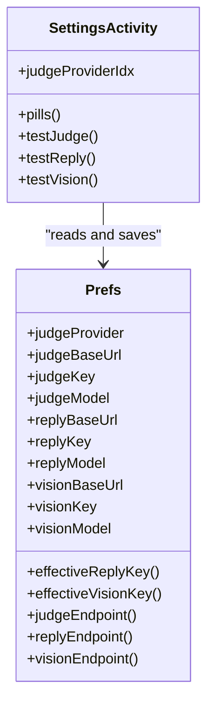
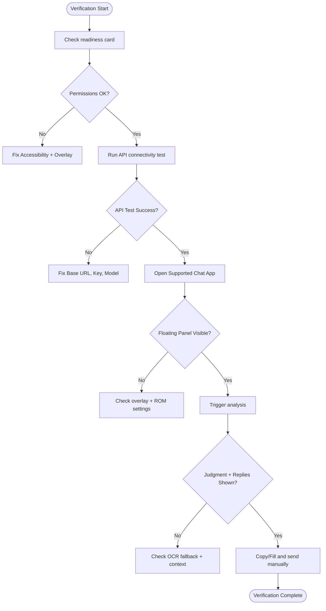
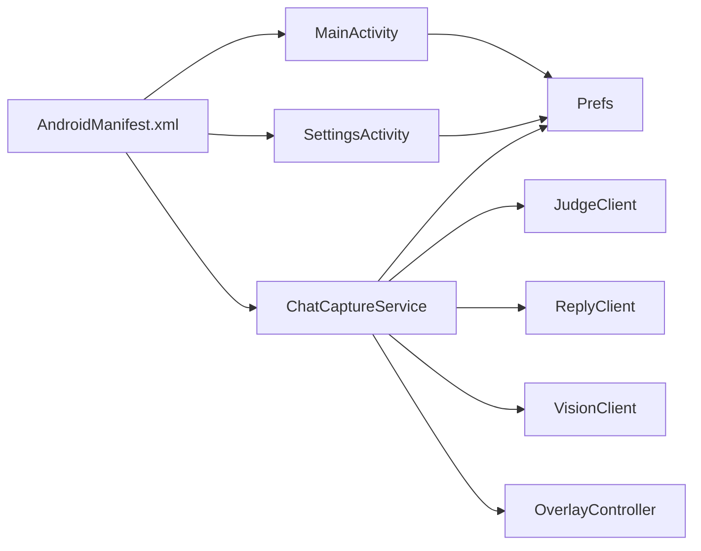

# Getting Started Guide

<cite>
**Referenced Files in This Document**   
- [README.md](file://README.md)
- [android-setup.html](file://site/guides/android-setup.html)
- [MainActivity.kt](file://app/src/main/java/com/jev/probe/MainActivity.kt)
- [SettingsActivity.kt](file://app/src/main/java/com/jev/probe/SettingsActivity.kt)
- [ChatCaptureService.kt](file://app/src/main/java/com/jev/probe/capture/ChatCaptureService.kt)
- [Prefs.kt](file://app/src/main/java/com/jev/probe/core/Prefs.kt)
- [AndroidManifest.xml](file://app/src/main/AndroidManifest.xml)
</cite>

## Table of Contents
1. [Introduction](#introduction)
2. [Project Structure](#project-structure)
3. [Core Components](#core-components)
4. [Architecture Overview](#architecture-overview)
5. [Detailed Component Analysis](#detailed-component-analysis)
6. [Dependency Analysis](#dependency-analysis)
7. [Performance Considerations](#performance-considerations)
8. [Troubleshooting Guide](#troubleshooting-guide)
9. [Conclusion](#conclusion)
10. [Appendices](#appendices)

## Introduction
This guide helps new Jev Chat Jarvis users install the Android app, complete the initial setup wizard, configure API keys, enable required system permissions, and verify that the assistant is working. It focuses on:
- Downloading and installing the Android APK via direct link or ADB
- Completing the home screen setup wizard
- Granting Accessibility Service, Floating Window overlay, and battery/autostart settings
- Configuring the three-card API system (judgment / reply / vision) with preset providers
- Troubleshooting common permission, visibility, and service initialization issues
- Verifying that analysis and candidate replies work end to end

The app reads chat text from supported apps using Android’s Accessibility Service, optionally uses offline OCR when the interface does not expose text, sends data only to model endpoints you configure, and never sends messages automatically.

**Section sources**
- [README.md:18-102](file://README.md#L18-L102)
- [android-setup.html:28-48](file://site/guides/android-setup.html#L28-L48)

## Project Structure
At a high level, the Android project contains:
- `app/src/main/java/com/jev/probe/` — main UI, settings, capture service, overlay, and core configuration
- `apk/` — signed release APK distribution location
- `site/guides/` — official installation and setup documentation
- `assets/` — illustrations used by the repository README

**Diagram sources**
- [MainActivity.kt:26-113](file://app/src/main/java/com/jev/probe/MainActivity.kt#L26-L113)
- [SettingsActivity.kt:35-70](file://app/src/main/java/com/jev/probe/SettingsActivity.kt#L35-L70)
- [ChatCaptureService.kt:29-43](file://app/src/main/java/com/jev/probe/capture/ChatCaptureService.kt#L29-L43)
- [Prefs.kt:6-13](file://app/src/main/java/com/jev/probe/core/Prefs.kt#L6-L13)

**Section sources**
- [README.md:223-240](file://README.md#L223-L240)
- [AndroidManifest.xml:17-57](file://app/src/main/AndroidManifest.xml#L17-L57)

## Core Components
For getting started, focus on these components:

| Component | Purpose for New Users | Key Behavior |
|---|---|---|
| `MainActivity` | Shows the setup wizard, readiness status, permission checklist, and master toggle | Opens system settings for Accessibility, overlay, and app details; tracks whether the app is ready |
| `SettingsActivity` | Configures judgment, reply, and vision interfaces with presets and test buttons | Supports OpenRouter, Bocha Jev, TypeSafe, Vercel, OpenCode Zen, DeepSeek official, and custom endpoints |
| `ChatCaptureService` | Runs the Accessibility Service, captures chat content, handles OCR fallback, and drives the floating panel | Never sends messages; fills input boxes or copies to clipboard |
| `Prefs` | Stores all configuration, including the three API cards, whitelist, OCR toggles, and hosted mode flags | Migrates old single-key config into the three-card structure |
| `AndroidManifest.xml` | Declares launcher activity, services, and required permissions | Requires Internet, overlay, foreground service, and notification permissions |

**Section sources**
- [MainActivity.kt:26-113](file://app/src/main/java/com/jev/probe/MainActivity.kt#L26-L113)
- [SettingsActivity.kt:35-70](file://app/src/main/java/com/jev/probe/SettingsActivity.kt#L35-L70)
- [ChatCaptureService.kt:29-43](file://app/src/main/java/com/jev/probe/capture/ChatCaptureService.kt#L29-L43)
- [Prefs.kt:6-13](file://app/src/main/java/com/jev/probe/core/Prefs.kt#L6-L13)
- [AndroidManifest.xml:4-8](file://app/src/main/AndroidManifest.xml#L4-L8)

## Architecture Overview
Jev Chat Jarvis follows a simple flow:
1. Install the APK and open the app.
2. Use the setup wizard to enable Accessibility Service and Floating Window overlay.
3. Configure at least the judgment interface key.
4. Enter a supported chat app.
5. The service detects incoming messages, optionally runs OCR, calls your configured model endpoint, and shows judgment plus candidate replies in the floating panel.
6. You copy or fill the suggested reply and send it manually.

**Diagram sources**
- [MainActivity.kt:74-113](file://app/src/main/java/com/jev/probe/MainActivity.kt#L74-L113)
- [ChatCaptureService.kt:389-455](file://app/src/main/java/com/jev/probe/capture/ChatCaptureService.kt#L389-L455)
- [SettingsActivity.kt:157-194](file://app/src/main/java/com/jev/probe/SettingsActivity.kt#L157-L194)

## Detailed Component Analysis

### Installation and Initial Setup

#### Step 1: Confirm Device Requirements
- Android version: Android 11+
- CPU architecture: ARM64 (`arm64-v8a`)
- No iOS or web version is available through this repository

If your device is not ARM64, the APK will not run.

**Section sources**
- [README.md:20-24](file://README.md#L20-L24)
- [android-setup.html:28-34](file://site/guides/android-setup.html#L28-L34)

#### Step 2: Download the APK
Use one of these methods:

- Direct download:
  - Open the Android APK link listed under “Start using Jev” in the repository README.
  - Accept the prompt to allow installation from unknown sources if your system asks.

- ADB installation:
  - Connect your device to a computer with ADB enabled.
  - Run the provided ADB command to install the signed release APK.

After installation, open the app. If you previously installed a debug build, uninstall it first because different signatures cannot overwrite each other. Uninstalling clears saved keys and settings.

**Section sources**
- [README.md:86-92](file://README.md#L86-L92)
- [android-setup.html:32-34](file://site/guides/android-setup.html#L32-L34)

#### Step 3: Complete the Setup Wizard
When you open the app, `MainActivity` shows:
- A readiness card indicating whether the app is ready
- A privacy hint explaining where chat data is sent
- A permission checklist
- A master toggle to enable or disable the assistant

Required permissions:
- **Accessibility Service**: Reads supported chat windows
- **Floating Window overlay**: Displays the analysis panel above other apps
- **Auto-start + no battery restrictions**: Especially important on Xiaomi/HyperOS devices

The wizard opens:
- System Accessibility settings
- Overlay permission settings
- App details page where OEM battery and autostart controls are usually found

**Diagram sources**
- [MainActivity.kt:67-113](file://app/src/main/java/com/jev/probe/MainActivity.kt#L67-L113)
- [MainActivity.kt:259-273](file://app/src/main/java/com/jev/probe/MainActivity.kt#L259-L273)

**Section sources**
- [MainActivity.kt:26-113](file://app/src/main/java/com/jev/probe/MainActivity.kt#L26-L113)
- [README.md:94-102](file://README.md#L94-L102)
- [android-setup.html:39-41](file://site/guides/android-setup.html#L39-L41)

### API Key Configuration: Three-Card System

The app separates configuration into three cards:

| Card | Role | Default Behavior |
|---|---|---|
| Judgment interface | Determines intent, risk level, and candidate ranking | Required; defaults to OpenRouter unless explicitly changed |
| Reply interface | Generates three candidate replies | Can inherit the judgment key if left blank |
| Vision interface | Used for image-based OCR scenarios | Optional; can inherit reply or judgment key if left blank |

#### Preset Providers

Judgment interface presets:
- OpenRouter
- Bocha Jev
- TypeSafe direct
- Vercel AI Gateway
- OpenCode Zen
- Custom

Reply interface presets:
- OpenRouter
- DeepSeek official
- DashScope compatible
- Custom

Vision interface presets:
- OpenRouter
- DashScope compatible
- Custom

Important notes:
- For beginners, filling only the judgment interface with an OpenRouter API key is enough; reply and vision can inherit it.
- Each card has its own connectivity test button.
- Some providers use `/alpha/decisions`, while others use `/v1/systemone`.
- DeepSeek official does not support vision models; the app warns instead of sending an incompatible request.

**Diagram sources**
- [Prefs.kt:71-131](file://app/src/main/java/com/jev/probe/core/Prefs.kt#L71-L131)
- [Prefs.kt:275-303](file://app/src/main/java/com/jev/probe/core/Prefs.kt#L275-L303)
- [SettingsActivity.kt:72-194](file://app/src/main/java/com/jev/probe/SettingsActivity.kt#L72-L194)
- [SettingsActivity.kt:197-308](file://app/src/main/java/com/jev/probe/SettingsActivity.kt#L197-L308)

**Section sources**
- [SettingsActivity.kt:72-308](file://app/src/main/java/com/jev/probe/SettingsActivity.kt#L72-L308)
- [Prefs.kt:71-131](file://app/src/main/java/com/jev/probe/core/Prefs.kt#L71-L131)
- [Prefs.kt:368-397](file://app/src/main/java/com/jev/probe/core/Prefs.kt#L368-L397)
- [README.md:122-130](file://README.md#L122-L130)

### Essential Android System Settings

#### Disable Battery Optimization
On aggressive OEM ROMs, background processes may be frozen. Ensure:
- Auto-start is allowed
- Battery optimization is set to unrestricted
- Autostart is enabled in the manufacturer’s security manager

Xiaomi and HyperOS devices especially require these settings; otherwise, the service may stop reading messages.

#### Enable Auto-Start
Enable autostart so the app can start after reboot or when the system kills background tasks. Without this, the Accessibility Service may not restart reliably.

#### Configure Accessibility Service Properly
- Enable the Accessibility Service in system settings
- After upgrading or reinstalling, turn the service off and on again so screenshot capabilities bind correctly
- If the service appears disabled but is not visible, remove any stale entry and re-enable it

**Section sources**
- [README.md:96-102](file://README.md#L96-L102)
- [README.md:162-167](file://README.md#L162-L167)
- [README.md:183-187](file://README.md#L183-L187)
- [ChatCaptureService.kt:202-236](file://app/src/main/java/com/jev/probe/capture/ChatCaptureService.kt#L202-L236)

### Verification Steps

Run this verification sequence before relying on the app for real conversations:

1. Open the app and confirm the readiness card shows ready.
2. Verify Accessibility Service is enabled.
3. Verify overlay permission is granted.
4. Configure at least the judgment interface and run its connectivity test.
5. Optionally configure reply and vision interfaces and run their tests.
6. Open a supported chat app such as QQ, X/Twitter DM, or Feishu.
7. Confirm the floating panel appears.
8. Trigger analysis either automatically or by tapping the panel.
9. Check that judgment and candidate replies appear.
10. Copy or fill a reply and send it manually.

**Diagram sources**
- [MainActivity.kt:117-136](file://app/src/main/java/com/jev/probe/MainActivity.kt#L117-L136)
- [SettingsActivity.kt:157-194](file://app/src/main/java/com/jev/probe/SettingsActivity.kt#L157-L194)
- [ChatCaptureService.kt:389-455](file://app/src/main/java/com/jev/probe/capture/ChatCaptureService.kt#L389-L455)

**Section sources**
- [android-setup.html:42-46](file://site/guides/android-setup.html#L42-L46)
- [README.md:104-111](file://README.md#L104-L111)

## Dependency Analysis

**Diagram sources**
- [AndroidManifest.xml:17-57](file://app/src/main/AndroidManifest.xml#L17-L57)
- [MainActivity.kt:23-24](file://app/src/main/java/com/jev/probe/MainActivity.kt#L23-L24)
- [SettingsActivity.kt:24-32](file://app/src/main/java/com/jev/probe/SettingsActivity.kt#L24-L32)
- [ChatCaptureService.kt:13-24](file://app/src/main/java/com/jev/probe/capture/ChatCaptureService.kt#L13-L24)

**Section sources**
- [AndroidManifest.xml:17-57](file://app/src/main/AndroidManifest.xml#L17-L57)
- [ChatCaptureService.kt:29-43](file://app/src/main/java/com/jev/probe/capture/ChatCaptureService.kt#L29-L43)

## Performance Considerations
- The app debounces rapid UI events to avoid repeated analysis.
- Screenshot and OCR paths include throttling and failure backoff.
- Offline ML Kit OCR runs locally and does not upload screenshots.
- Background process freezing on OEM ROMs can make the service appear dead even when configured correctly.
- Using hosted mode routes requests through the operator’s gateway; BYOK mode sends requests directly to your configured provider.

[No sources needed since this section provides general guidance]

## Troubleshooting Guide

### Permission Denials
- If Accessibility Service is not recognized, go to system Accessibility settings, remove any stale entry, and re-enable it.
- If overlay permission is missing, use the setup wizard’s overlay card or open overlay permission settings manually.
- On Xiaomi/HyperOS, also enable autostart and set battery optimization to unrestricted.

**Section sources**
- [MainActivity.kt:86-98](file://app/src/main/java/com/jev/probe/MainActivity.kt#L86-L98)
- [README.md:96-102](file://README.md#L96-L102)

### Floating Window Visibility Problems
- If the bubble disappears, interact inside the chat app once; the service often recovers.
- Recheck overlay permission after reinstalling.
- Check OEM battery management and autostart settings.

**Section sources**
- [README.md:162-167](file://README.md#L162-L167)
- [ChatCaptureService.kt:232-236](file://app/src/main/java/com/jev/probe/capture/ChatCaptureService.kt#L232-L236)

### Service Initialization Failures
- After upgrading, turn Accessibility Service off and on again so screenshot binding takes effect.
- If OCR fails, check that the service can access the current window tree and that the system allows screenshot capture.
- If the app reports no judgment key, configure at least the judgment interface.

**Section sources**
- [README.md:183-187](file://README.md#L183-L187)
- [ChatCaptureService.kt:465-499](file://app/src/main/java/com/jev/probe/capture/ChatCaptureService.kt#L465-L499)
- [ChatCaptureService.kt:389-400](file://app/src/main/java/com/jev/probe/capture/ChatCaptureService.kt#L389-L400)

### API Connectivity Issues
- Verify Base URL, model name, and API key match the selected provider.
- Use the built-in test button for each card.
- Remember that DeepSeek official does not support vision models.

**Section sources**
- [SettingsActivity.kt:157-194](file://app/src/main/java/com/jev/probe/SettingsActivity.kt#L157-L194)
- [SettingsActivity.kt:278-308](file://app/src/main/java/com/jev/probe/SettingsActivity.kt#L278-L308)
- [SettingsActivity.kt:669-672](file://app/src/main/java/com/jev/probe/SettingsActivity.kt#L669-L672)

### OCR Fallback Not Working
- OCR is used when the accessibility tree has no text.
- Automatic OCR is gated by signature deduplication and throttling.
- Whole-screen OCR treats all lines as coming from the other side and does not distinguish sender/receiver.

**Section sources**
- [ChatCaptureService.kt:305-329](file://app/src/main/java/com/jev/probe/capture/ChatCaptureService.kt#L305-L329)
- [ChatCaptureService.kt:548-623](file://app/src/main/java/com/jev/probe/capture/ChatCaptureService.kt#L548-L623)
- [ChatCaptureService.kt:625-652](file://app/src/main/java/com/jev/probe/capture/ChatCaptureService.kt#L625-L652)

## Conclusion
To get Jev Chat Jarvis working:
1. Install the ARM64 Android APK.
2. Enable Accessibility Service and overlay permission.
3. Configure at least the judgment interface.
4. Allow autostart and disable battery restrictions on aggressive OEM ROMs.
5. Verify connectivity and test the full flow in a supported chat app.
6. Always review and send replies manually.

The app is designed to keep control in your hands: it analyzes what you see, suggests replies, and never sends messages for you.

[No sources needed since this section summarizes without analyzing specific files]

## Appendices

### Quick Checklist
- [ ] Device is Android 11+ and ARM64
- [ ] APK installed successfully
- [ ] Accessibility Service enabled
- [ ] Overlay permission granted
- [ ] Autostart and battery optimization configured
- [ ] Judgment interface key configured and tested
- [ ] Floating panel appears in a supported chat app
- [ ] Judgment and candidate replies appear
- [ ] Reply filled or copied and sent manually

**Section sources**
- [README.md:86-111](file://README.md#L86-L111)
- [android-setup.html:32-46](file://site/guides/android-setup.html#L32-L46)