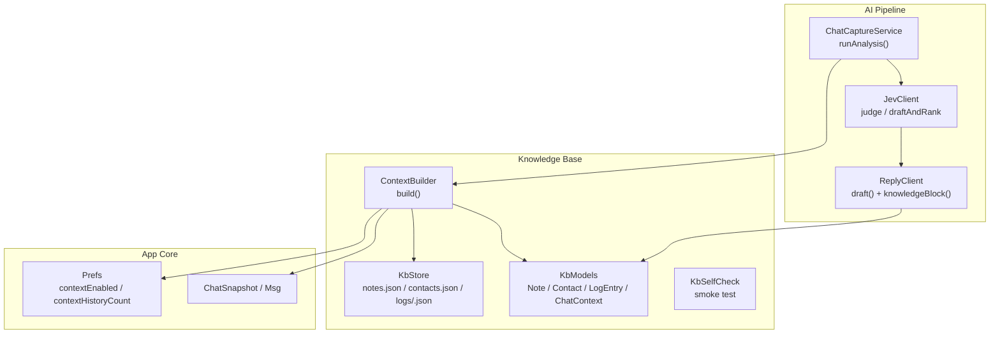
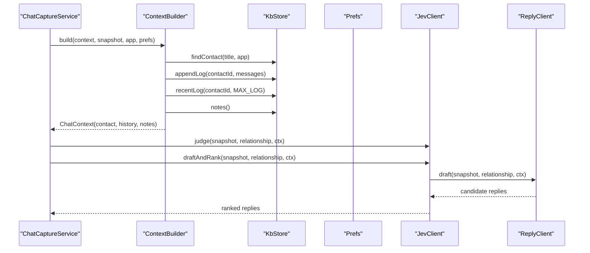
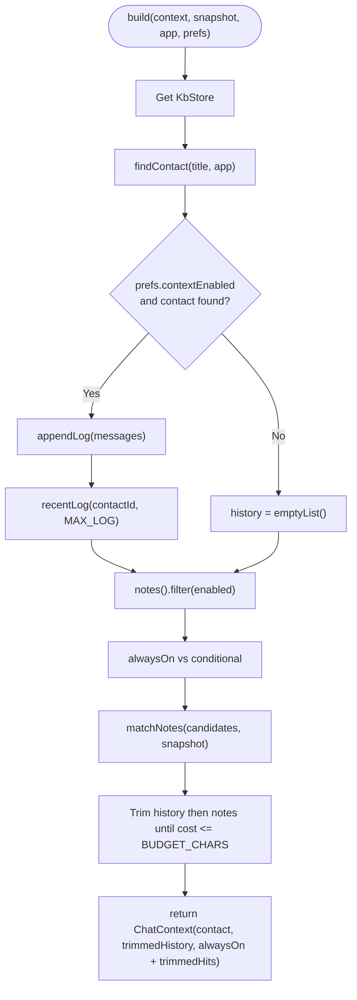
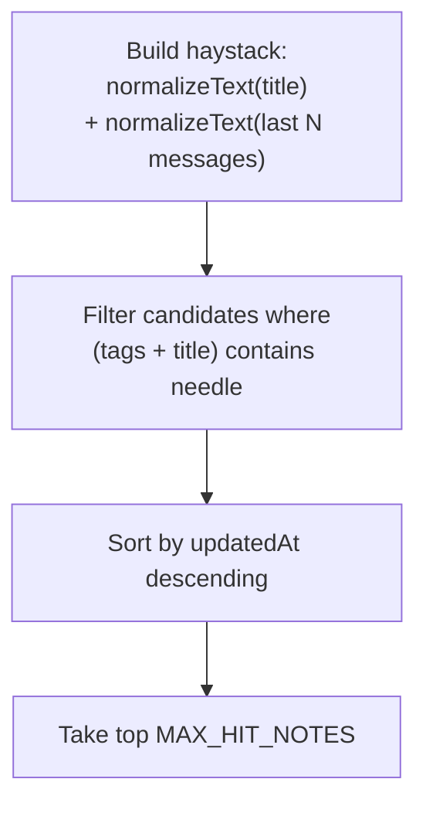
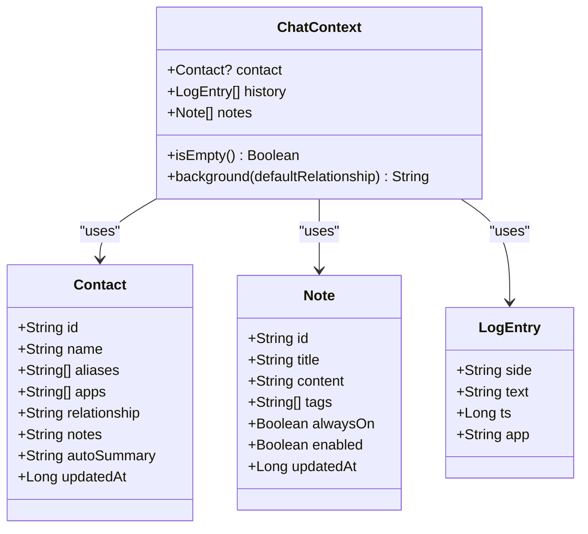
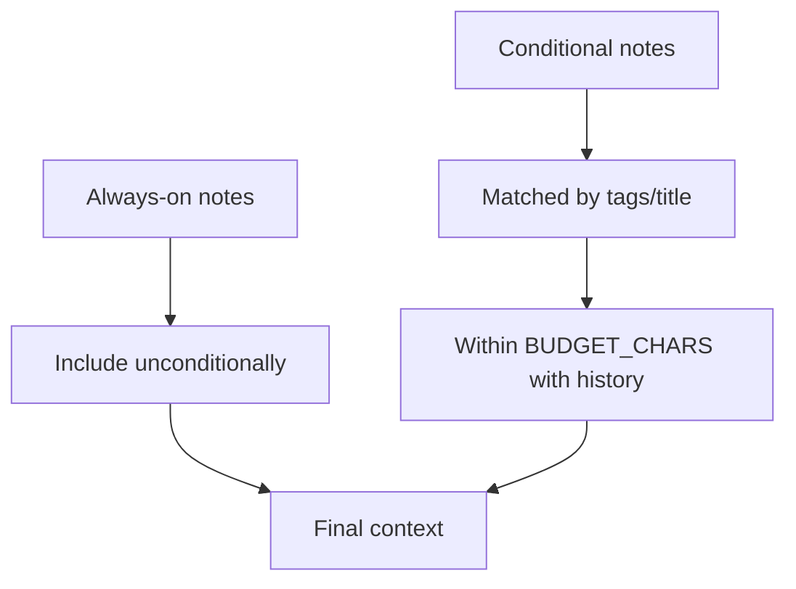
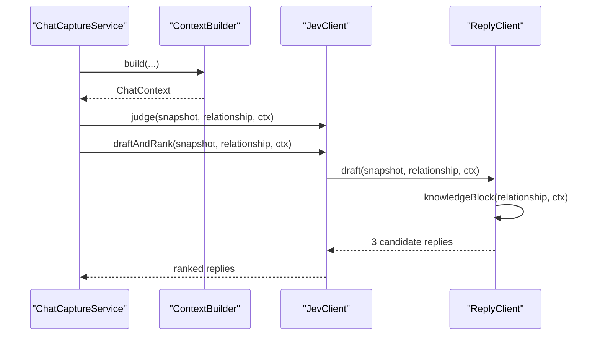
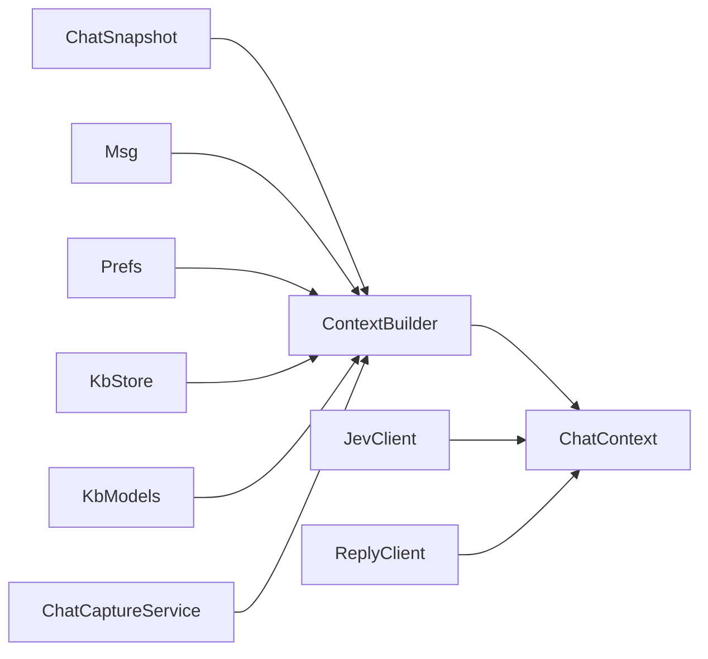

# Context Building System

<cite>
**Referenced Files in This Document**
- [ContextBuilder.kt](file://app/src/main/java/com/jev/probe/core/kb/ContextBuilder.kt)
- [KbModels.kt](file://app/src/main/java/com/jev/probe/core/kb/KbModels.kt)
- [KbStore.kt](file://app/src/main/java/com/jev/probe/core/kb/KbStore.kt)
- [KbSelfCheck.kt](file://app/src/main/java/com/jev/probe/core/kb/KbSelfCheck.kt)
- [ChatModels.kt](file://app/src/main/java/com/jev/probe/core/ChatModels.kt)
- [Prefs.kt](file://app/src/main/java/com/jev/probe/core/Prefs.kt)
- [ChatCaptureService.kt](file://app/src/main/java/com/jev/probe/capture/ChatCaptureService.kt)
- [JevClient.kt](file://app/src/main/java/com/jev/probe/jev/JevClient.kt)
- [ReplyClient.kt](file://app/src/main/java/com/jev/probe/jev/ReplyClient.kt)
</cite>

## Table of Contents
1. [Introduction](#introduction)
2. [Project Structure](#project-structure)
3. [Core Components](#core-components)
4. [Architecture Overview](#architecture-overview)
5. [Detailed Component Analysis](#detailed-component-analysis)
6. [Dependency Analysis](#dependency-analysis)
7. [Performance Considerations](#performance-considerations)
8. [Troubleshooting Guide](#troubleshooting-guide)
9. [Conclusion](#conclusion)

## Introduction
This document explains the context building system that turns a live chat snapshot into an enriched prompt for AI analysis. The system combines three sources:
- Contact identity and relationship information
- Recent conversation history for the matched contact
- Knowledge notes selected by title, tags, and user preferences

The result is a structured `ChatContext` that can be injected into the AI pipeline to improve response quality, personalization, and consistency with known facts.

## Project Structure
The context building system lives under the knowledge-base package and integrates with capture, preferences, and AI clients:

**Diagram sources**
- [ContextBuilder.kt:35-63](file://app/src/main/java/com/jev/probe/core/kb/ContextBuilder.kt#L35-L63)
- [KbStore.kt:12-23](file://app/src/main/java/com/jev/probe/core/kb/KbStore.kt#L12-L23)
- [KbModels.kt:11-51](file://app/src/main/java/com/jev/probe/core/kb/KbModels.kt#L11-L51)
- [Prefs.kt:133-147](file://app/src/main/java/com/jev/probe/core/Prefs.kt#L133-L147)
- [ChatCaptureService.kt:406-454](file://app/src/main/java/com/jev/probe/capture/ChatCaptureService.kt#L406-L454)
- [JevClient.kt:22-34](file://app/src/main/java/com/jev/probe/jev/JevClient.kt#L22-L34)
- [ReplyClient.kt:28-58](file://app/src/main/java/com/jev/probe/jev/ReplyClient.kt#L28-L58)

**Section sources**
- [ContextBuilder.kt:8-19](file://app/src/main/java/com/jev/probe/core/kb/ContextBuilder.kt#L8-L19)
- [KbStore.kt:12-23](file://app/src/main/java/com/jev/probe/core/kb/KbStore.kt#L12-L23)
- [KbModels.kt:11-51](file://app/src/main/java/com/jev/probe/core/kb/KbModels.kt#L11-L51)
- [Prefs.kt:133-147](file://app/src/main/java/com/jev/probe/core/Prefs.kt#L133-L147)
- [ChatCaptureService.kt:406-454](file://app/src/main/java/com/jev/probe/capture/ChatCaptureService.kt#L406-L454)
- [JevClient.kt:22-34](file://app/src/main/java/com/jev/probe/jev/JevClient.kt#L22-L34)
- [ReplyClient.kt:28-58](file://app/src/main/java/com/jev/probe/jev/ReplyClient.kt#L28-L58)

## Core Components
- `ContextBuilder`: Builds `ChatContext` from a `ChatSnapshot`, app package, and `Prefs`. It finds the contact, records recent history, selects always-on and keyword-matched notes, and trims them within a character budget.
- `KbStore`: Local JSON-based persistence for notes, contacts, and per-contact log history. Provides matching, append logic, deduplication, and atomic writes.
- `KbModels`: Data models including `Note`, `Contact`, `LogEntry`, and `ChatContext`. `ChatContext.background()` serializes relationship, contact notes, auto-summary, and matched notes into a single background string.
- `Prefs`: User settings controlling whether context is enabled, how many history lines are injected, and other AI route configuration.
- `ChatCaptureService`: Orchestrates capture, debouncing, OCR fallback, and calls `ContextBuilder.build()` before invoking the AI pipeline.
- `JevClient` and `ReplyClient`: AI integration layer. `ReplyClient.draft()` injects the context as a knowledge preamble so generated replies stay consistent with stored facts.

**Section sources**
- [ContextBuilder.kt:35-63](file://app/src/main/java/com/jev/probe/core/kb/ContextBuilder.kt#L35-L63)
- [KbStore.kt:44-116](file://app/src/main/java/com/jev/probe/core/kb/KbStore.kt#L44-L116)
- [KbModels.kt:11-85](file://app/src/main/java/com/jev/probe/core/kb/KbModels.kt#L11-L85)
- [Prefs.kt:133-147](file://app/src/main/java/com/jev/probe/core/Prefs.kt#L133-L147)
- [ChatCaptureService.kt:406-454](file://app/src/main/java/com/jev/probe/capture/ChatCaptureService.kt#L406-L454)
- [JevClient.kt:22-34](file://app/src/main/java/com/jev/probe/jev/JevClient.kt#L22-L34)
- [ReplyClient.kt:28-58](file://app/src/main/java/com/jev/probe/jev/ReplyClient.kt#L28-L58)

## Architecture Overview
The context building flow runs during analysis:

**Diagram sources**
- [ChatCaptureService.kt:406-454](file://app/src/main/java/com/jev/probe/capture/ChatCaptureService.kt#L406-L454)
- [ContextBuilder.kt:35-91](file://app/src/main/java/com/jev/probe/core/kb/ContextBuilder.kt#L35-L91)
- [KbStore.kt:106-116](file://app/src/main/java/com/jev/probe/core/kb/KbStore.kt#L106-L116)
- [KbStore.kt:172-231](file://app/src/main/java/com/jev/probe/core/kb/KbStore.kt#L172-L231)
- [KbStore.kt:44-46](file://app/src/main/java/com/jev/probe/core/kb/KbStore.kt#L44-L46)
- [JevClient.kt:22-34](file://app/src/main/java/com/jev/probe/jev/JevClient.kt#L22-L34)
- [ReplyClient.kt:28-58](file://app/src/main/java/com/jev/probe/jev/ReplyClient.kt#L28-L58)

## Detailed Component Analysis

### ContextBuilder: Enrichment Pipeline
`ContextBuilder.build()` performs four steps:
1. Resolve contact by normalized name or alias using the current app package.
2. Record visible messages into per-contact history and read back recent history if context is enabled.
3. Select always-on notes plus keyword-matched notes based on conversation title and last few messages.
4. Trim history and conditional notes to fit a shared character budget; always-on notes are exempt from trimming.

Key behaviors:
- Contact matching never creates contacts automatically.
- History injection requires `prefs.contextEnabled`.
- Note matching uses normalized substring checks against title and recent messages.
- Budget enforcement removes oldest history first, then newest notes, preserving whole notes only.

**Diagram sources**
- [ContextBuilder.kt:35-63](file://app/src/main/java/com/jev/probe/core/kb/ContextBuilder.kt#L35-L63)
- [ContextBuilder.kt:70-91](file://app/src/main/java/com/jev/probe/core/kb/ContextBuilder.kt#L70-L91)
- [ContextBuilder.kt:98-116](file://app/src/main/java/com/jev/probe/core/kb/ContextBuilder.kt#L98-L116)
- [ContextBuilder.kt:118-120](file://app/src/main/java/com/jev/probe/core/kb/ContextBuilder.kt#L118-L120)

**Section sources**
- [ContextBuilder.kt:35-63](file://app/src/main/java/com/jev/probe/core/kb/ContextBuilder.kt#L35-L63)
- [ContextBuilder.kt:70-91](file://app/src/main/java/com/jev/probe/core/kb/ContextBuilder.kt#L70-L91)
- [ContextBuilder.kt:98-116](file://app/src/main/java/com/jev/probe/core/kb/ContextBuilder.kt#L98-L116)
- [ContextBuilder.kt:118-120](file://app/src/main/java/com/jev/probe/core/kb/ContextBuilder.kt#L118-L120)

### Search Algorithms: Contacts and Notes
Contact search:
- Normalizes both conversation title and contact names/aliases.
- Prefers a contact already associated with the current app when multiple matches exist.
- Never creates contacts automatically; unknown titles yield no contact.

Note search:
- Builds a haystack from the conversation title and the last few messages.
- Matches any note tag or title substring after normalization.
- Sorts hits by recency and caps at a maximum number of matched notes.

**Diagram sources**
- [ContextBuilder.kt:98-116](file://app/src/main/java/com/jev/probe/core/kb/ContextBuilder.kt#L98-L116)
- [KbStore.kt:106-116](file://app/src/main/java/com/jev/probe/core/kb/KbStore.kt#L106-L116)
- [KbStore.kt:521-537](file://app/src/main/java/com/jev/probe/core/kb/KbStore.kt#L521-L537)

**Section sources**
- [ContextBuilder.kt:98-116](file://app/src/main/java/com/jev/probe/core/kb/ContextBuilder.kt#L98-L116)
- [KbStore.kt:106-116](file://app/src/main/java/com/jev/probe/core/kb/KbStore.kt#L106-L116)
- [KbStore.kt:521-537](file://app/src/main/java/com/jev/probe/core/kb/KbStore.kt#L521-L537)

### Context Assembly: Structured Prompts
`ChatContext` merges:
- Contact relationship and notes
- Optional auto-summary (reserved for future use)
- All matched notes

It also exposes a `background(defaultRelationship)` method that serializes this data into a single block used by the reply prompt. When there is nothing to inject, `isEmpty()` returns true so callers omit the field entirely.

**Diagram sources**
- [KbModels.kt:11-51](file://app/src/main/java/com/jev/probe/core/kb/KbModels.kt#L11-L51)
- [KbModels.kt:48-85](file://app/src/main/java/com/jev/probe/core/kb/KbModels.kt#L48-L85)

**Section sources**
- [KbModels.kt:48-85](file://app/src/main/java/com/jev/probe/core/kb/KbModels.kt#L48-L85)

### Filtering Logic: Always-On vs Conditional Notes
- Always-on notes are always included regardless of conversation content.
- Conditional notes are selected via substring matching against title and recent messages.
- Character budget applies to conditional notes and history combined; always-on notes bypass trimming.
- History is trimmed first (oldest entries removed), then conditional notes (newest entries removed).

**Diagram sources**
- [ContextBuilder.kt:46-58](file://app/src/main/java/com/jev/probe/core/kb/ContextBuilder.kt#L46-L58)
- [ContextBuilder.kt:118-120](file://app/src/main/java/com/jev/probe/core/kb/ContextBuilder.kt#L118-L120)

**Section sources**
- [ContextBuilder.kt:46-58](file://app/src/main/java/com/jev/probe/core/kb/ContextBuilder.kt#L46-L58)
- [ContextBuilder.kt:118-120](file://app/src/main/java/com/jev/probe/core/kb/ContextBuilder.kt#L118-L120)

### Integration with AI Pipeline
`ChatCaptureService.runAnalysis()`:
- Calls `ContextBuilder.build()` to assemble context.
- Updates overlay UI with counts of notes and history.
- Invokes `JevClient.judge()` and `JevClient.draftAndRank()` with the context.

`JevClient`:
- Delegates to `JudgeClient` and `ReplyClient`.
- Shares an analysis ID across calls for hosted metering.

`ReplyClient.draft()`:
- Builds a knowledge preamble using `ChatContext.background()` and recent history.
- Instructs the model to stay consistent with stored facts and not invent information outside the context.

**Diagram sources**
- [ChatCaptureService.kt:406-454](file://app/src/main/java/com/jev/probe/capture/ChatCaptureService.kt#L406-L454)
- [JevClient.kt:22-34](file://app/src/main/java/com/jev/probe/jev/JevClient.kt#L22-L34)
- [ReplyClient.kt:28-58](file://app/src/main/java/com/jev/probe/jev/ReplyClient.kt#L28-L58)

**Section sources**
- [ChatCaptureService.kt:406-454](file://app/src/main/java/com/jev/probe/capture/ChatCaptureService.kt#L406-L454)
- [JevClient.kt:22-34](file://app/src/main/java/com/jev/probe/jev/JevClient.kt#L22-L34)
- [ReplyClient.kt:28-58](file://app/src/main/java/com/jev/probe/jev/ReplyClient.kt#L28-L58)

## Dependency Analysis
The context building system depends on:
- `ChatSnapshot` and `Msg` for input data
- `Prefs` for feature flags and history count
- `KbStore` for persistence and matching
- `KbModels` for data structures
- `ChatCaptureService` for orchestration
- `JevClient` and `ReplyClient` for AI integration

**Diagram sources**
- [ChatModels.kt:5-38](file://app/src/main/java/com/jev/probe/core/ChatModels.kt#L5-L38)
- [ContextBuilder.kt:35-63](file://app/src/main/java/com/jev/probe/core/kb/ContextBuilder.kt#L35-L63)
- [KbStore.kt:44-116](file://app/src/main/java/com/jev/probe/core/kb/KbStore.kt#L44-L116)
- [KbModels.kt:11-51](file://app/src/main/java/com/jev/probe/core/kb/KbModels.kt#L11-L51)
- [ChatCaptureService.kt:406-454](file://app/src/main/java/com/jev/probe/capture/ChatCaptureService.kt#L406-L454)
- [JevClient.kt:22-34](file://app/src/main/java/com/jev/probe/jev/JevClient.kt#L22-L34)
- [ReplyClient.kt:28-58](file://app/src/main/java/com/jev/probe/jev/ReplyClient.kt#L28-L58)

**Section sources**
- [ChatModels.kt:5-38](file://app/src/main/java/com/jev/probe/core/ChatModels.kt#L5-L38)
- [ContextBuilder.kt:35-63](file://app/src/main/java/com/jev/probe/core/kb/ContextBuilder.kt#L35-L63)
- [KbStore.kt:44-116](file://app/src/main/java/com/jev/probe/core/kb/KbStore.kt#L44-L116)
- [KbModels.kt:11-51](file://app/src/main/java/com/jev/probe/core/kb/KbModels.kt#L11-L51)
- [ChatCaptureService.kt:406-454](file://app/src/main/java/com/jev/probe/capture/ChatCaptureService.kt#L406-L454)
- [JevClient.kt:22-34](file://app/src/main/java/com/jev/probe/jev/JevClient.kt#L22-L34)
- [ReplyClient.kt:28-58](file://app/src/main/java/com/jev/probe/jev/ReplyClient.kt#L28-L58)

## Performance Considerations
- Substring matching and normalization are intentionally simple to keep context assembly cheap.
- History window is bounded (`MAX_LOG`) and recent history is limited by `contextHistoryCount`.
- Character budget prevents oversized prompts; always-on notes are exempt to preserve critical context.
- Deduplication avoids re-recording identical screens and filters out messages already visible on screen.
- Atomic file writes prevent corruption and reduce I/O risk.

[No sources needed since this section provides general guidance]

## Troubleshooting Guide
Common issues and diagnostics:
- Name normalization failures: The self-check validates normalization across half/full-width parentheses and member counts.
- Missing contact match: Ensure the conversation title or alias normalizes correctly and the app package is recorded.
- Notes not matched: Verify tags or title appear in the conversation title or recent messages; check normalization behavior.
- History duplication: Screen deduplication should prevent repeated captures; manual injections bypass screen comparison.
- Context disabled: If `contextEnabled` is false, history will not be injected even if contacts and notes exist.

Use the built-in self-check to validate core behavior without affecting real user data.

**Section sources**
- [KbSelfCheck.kt:29-125](file://app/src/main/java/com/jev/probe/core/kb/KbSelfCheck.kt#L29-L125)
- [KbStore.kt:412-428](file://app/src/main/java/com/jev/probe/core/kb/KbStore.kt#L412-L428)
- [Prefs.kt:133-147](file://app/src/main/java/com/jev/probe/core/Prefs.kt#L133-L147)

## Conclusion
The context building system provides a lightweight, deterministic way to enrich AI prompts with relevant knowledge. By combining contact identity, recent history, and keyword-matched notes under a strict budget, it improves response relevance and personalization while remaining efficient and safe. Its integration points with capture and AI clients ensure that context affects both judgment and reply generation consistently.

[No sources needed since this section summarizes without analyzing specific files]