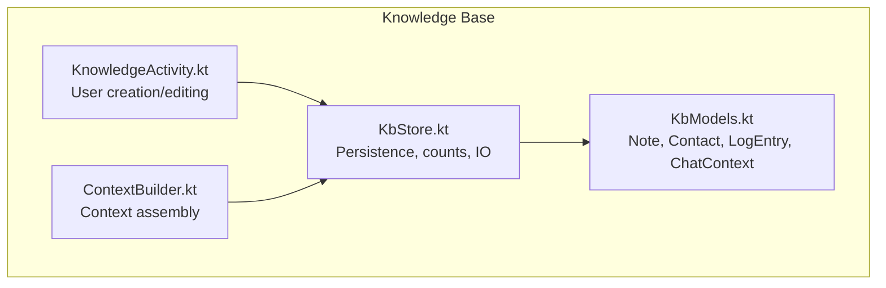
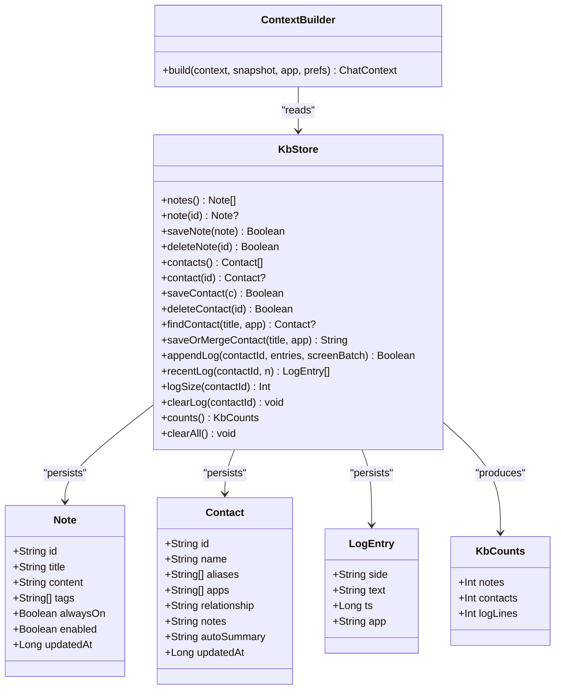
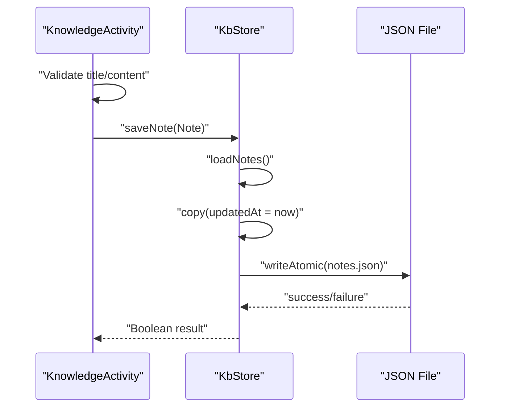
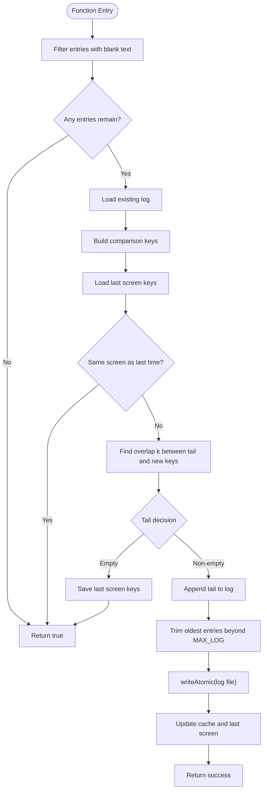
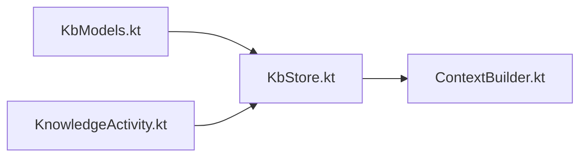

# Data Models and Entities

<cite>
**Referenced Files in This Document**
- [KbModels.kt](file://app/src/main/java/com/jev/probe/core/kb/KbModels.kt)
- [KbStore.kt](file://app/src/main/java/com/jev/probe/core/kb/KbStore.kt)
- [ContextBuilder.kt](file://app/src/main/java/com/jev/probe/core/kb/ContextBuilder.kt)
- [KnowledgeActivity.kt](file://app/src/main/java/com/jev/probe/KnowledgeActivity.kt)
</cite>

## Table of Contents
1. [Introduction](#introduction)
2. [Project Structure](#project-structure)
3. [Core Components](#core-components)
4. [Architecture Overview](#architecture-overview)
5. [Detailed Component Analysis](#detailed-component-analysis)
6. [Dependency Analysis](#dependency-analysis)
7. [Performance Considerations](#performance-considerations)
8. [Troubleshooting Guide](#troubleshooting-guide)
9. [Conclusion](#conclusion)
10. [Appendices](#appendices)

## Introduction
This document describes the knowledge base data models used by the application: Contact, Note, LogEntry, and KbCounts. It explains their fields, validation rules, default values, relationships, persistence format, lifecycle management, and how they are created and serialized. The knowledge base is stored locally as plain JSON under an app-private directory; there is no database or network layer for these entities.

## Project Structure
The knowledge base models live in a small, focused package:

**Diagram sources**
- [KbModels.kt:1-86](file://app/src/main/java/com/jev/probe/core/kb/KbModels.kt#L1-L86)
- [KbStore.kt:1-540](file://app/src/main/java/com/jev/probe/core/kb/KbStore.kt#L1-L540)
- [ContextBuilder.kt:1-37](file://app/src/main/java/com/jev/probe/core/kb/ContextBuilder.kt#L1-L37)
- [KnowledgeActivity.kt:146-319](file://app/src/main/java/com/jev/probe/KnowledgeActivity.kt#L146-L319)

**Section sources**
- [KbModels.kt:1-86](file://app/src/main/java/com/jev/probe/core/kb/KbModels.kt#L1-L86)
- [KbStore.kt:1-540](file://app/src/main/java/com/jev/probe/core/kb/KbStore.kt#L1-L540)

## Core Components
The core data model consists of four primary types:

- Note: A user-maintained free-text knowledge note.
- Contact: A person or group with cross-app aliases and metadata.
- LogEntry: A remembered chat line with side, text, timestamp, and app source.
- KbCounts: A read-only display class showing notes count, contacts count, and total log lines.

These models are defined as Kotlin data classes and persisted to JSON files through KbStore.

**Section sources**
- [KbModels.kt:11-42](file://app/src/main/java/com/jev/probe/core/kb/KbModels.kt#L11-L42)
- [KbStore.kt:9-10](file://app/src/main/java/com/jev/probe/core/kb/KbStore.kt#L9-L10)

## Architecture Overview
The knowledge base architecture separates domain models from persistence and context building:

**Diagram sources**
- [KbModels.kt:11-86](file://app/src/main/java/com/jev/probe/core/kb/KbModels.kt#L11-L86)
- [KbStore.kt:9-540](file://app/src/main/java/com/jev/probe/core/kb/KbStore.kt#L9-L540)
- [ContextBuilder.kt:1-37](file://app/src/main/java/com/jev/probe/core/kb/ContextBuilder.kt#L1-L37)

## Detailed Component Analysis

### Note Entity
Note represents a free-text knowledge note maintained by the user.

Fields:
- id: Unique identifier string.
- title: Display title for the note.
- content: Main body text.
- tags: Optional list of comma-separated tags parsed into strings.
- alwaysOn: If true, the note is injected regardless of conversation topic.
- enabled: Controls whether the note participates in matching/injection.
- updatedAt: Timestamp updated on save.

Validation and defaults:
- tags defaults to an empty list.
- alwaysOn defaults to false.
- enabled defaults to true.
- updatedAt defaults to current time at construction.
- UI enforces that title and content cannot both be blank when saving.

Relationships:
- Notes are aggregated into analysis context alongside matched history and contact metadata.

Lifecycle:
- Created via UI dialog and saved through KbStore.saveNote.
- Updated timestamps are applied automatically on save.
- Deleted via KbStore.deleteNote.

Serialization:
- Stored as a JSON object with fields id, title, content, tags array, alwaysOn boolean, enabled boolean, and updatedAt number.

Example creation path:
- User creates or edits a note in KnowledgeActivity, which constructs a Note and calls store.saveNote.

**Section sources**
- [KbModels.kt:11-21](file://app/src/main/java/com/jev/probe/core/kb/KbModels.kt#L11-L21)
- [KnowledgeActivity.kt:146-182](file://app/src/main/java/com/jev/probe/KnowledgeActivity.kt#L146-L182)
- [KbStore.kt:44-65](file://app/src/main/java/com/jev/probe/core/kb/KbStore.kt#L44-L65)
- [KbStore.kt:294-314](file://app/src/main/java/com/jev/probe/core/kb/KbStore.kt#L294-L314)
- [KbStore.kt:358-371](file://app/src/main/java/com/jev/probe/core/kb/KbStore.kt#L358-L371)

### Contact Entity
Contact represents a person or group the user chats with, including cross-app aliasing.

Fields:
- id: Unique identifier string.
- name: Primary display name.
- aliases: Alternative names across different apps.
- apps: Package names where this contact has been seen.
- relationship: Relationship description (e.g., colleague).
- notes: Free-form notes about the contact.
- autoSummary: Reserved field for future automatic summaries; not written in v1.3.
- updatedAt: Timestamp updated on save.

Validation and defaults:
- aliases, apps, relationship, notes, autoSummary default to empty collections or strings.
- updatedAt defaults to current time at construction.
- UI requires a non-blank name when creating or editing a contact.

Relationships:
- Contacts link to per-contact LogEntry histories.
- Contact metadata contributes to analysis background context.

Lifecycle:
- Created either manually via UI or merged from conversation titles using saveOrMergeContact.
- Saved through KbStore.saveContact with automatic timestamp update.
- Deleted via KbStore.deleteContact, which also removes associated history files.

Serialization:
- Stored as a JSON object with fields id, name, aliases array, apps array, relationship string, notes string, autoSummary string, and updatedAt number.

Example creation path:
- Manual creation via editContactDialog in KnowledgeActivity.
- Automatic merge via saveOrMergeContact when a conversation title matches or should be added.

**Section sources**
- [KbModels.kt:23-39](file://app/src/main/java/com/jev/probe/core/kb/KbModels.kt#L23-L39)
- [KnowledgeActivity.kt:234-319](file://app/src/main/java/com/jev/probe/KnowledgeActivity.kt#L234-L319)
- [KbStore.kt:67-145](file://app/src/main/java/com/jev/probe/core/kb/KbStore.kt#L67-L145)
- [KbStore.kt:316-337](file://app/src/main/java/com/jev/probe/core/kb/KbStore.kt#L316-L337)
- [KbStore.kt:373-387](file://app/src/main/java/com/jev/probe/core/kb/KbStore.kt#L373-L387)

### LogEntry Model
LogEntry represents one remembered chat line.

Fields:
- side: Speaker side, typically "me" or "other".
- text: Message text content.
- ts: Timestamp of the message.
- app: Source application package name.

Validation and defaults:
- When loading, side defaults to "other" if missing.
- ts defaults to 0 if missing.
- Empty or blank text entries are filtered out during append operations.

Relationships:
- LogEntry instances are grouped per contact and form the history used in analysis context.

Lifecycle:
- Appended via KbStore.appendLog with deduplication and scrolling logic.
- Read via recentLog and logSize.
- Cleared via clearLog.

Serialization:
- Stored as a JSON object with fields side, text, ts, and app.

Example creation path:
- Built from captured screen batches or hand-injected single entries.

**Section sources**
- [KbModels.kt:41-42](file://app/src/main/java/com/jev/probe/core/kb/KbModels.kt#L41-L42)
- [KbStore.kt:149-241](file://app/src/main/java/com/jev/probe/core/kb/KbStore.kt#L149-L241)
- [KbStore.kt:339-356](file://app/src/main/java/com/jev/probe/core/kb/KbStore.kt#L339-L356)
- [KbStore.kt:389-399](file://app/src/main/java/com/jev/probe/core/kb/KbStore.kt#L389-L399)

### KbCounts Data Class
KbCounts is a simple read-only data class used for UI display.

Fields:
- notes: Total number of notes.
- contacts: Total number of contacts.
- logLines: Sum of all per-contact log line counts.

Usage:
- Produced by KbStore.counts for settings screens.

**Section sources**
- [KbStore.kt:9-10](file://app/src/main/java/com/jev/probe/core/kb/KbStore.kt#L9-L10)
- [KbStore.kt:271-276](file://app/src/main/java/com/jev/probe/core/kb/KbStore.kt#L271-L276)

## Architecture Overview
The following sequence shows how a user-created Note flows through the system to disk:

**Diagram sources**
- [KnowledgeActivity.kt:146-182](file://app/src/main/java/com/jev/probe/KnowledgeActivity.kt#L146-L182)
- [KbStore.kt:48-57](file://app/src/main/java/com/jev/probe/core/kb/KbStore.kt#L48-L57)
- [KbStore.kt:438-459](file://app/src/main/java/com/jev/probe/core/kb/KbStore.kt#L438-L459)

The following flowchart illustrates LogEntry append logic:

**Diagram sources**
- [KbStore.kt:172-221](file://app/src/main/java/com/jev/probe/core/kb/KbStore.kt#L172-L221)
- [KbStore.kt:248-267](file://app/src/main/java/com/jev/probe/core/kb/KbStore.kt#L248-L267)
- [KbStore.kt:438-459](file://app/src/main/java/com/jev/probe/core/kb/KbStore.kt#L438-L459)

## Dependency Analysis
The knowledge base components have clear dependencies:

- KbModels defines immutable data structures.
- KbStore depends on KbModels for persistence and provides CRUD operations.
- ContextBuilder reads from KbStore to assemble analysis context.
- KnowledgeActivity interacts with KbStore to create and edit entities.

**Diagram sources**
- [KbModels.kt:1-86](file://app/src/main/java/com/jev/probe/core/kb/KbModels.kt#L1-L86)
- [KbStore.kt:1-540](file://app/src/main/java/com/jev/probe/core/kb/KbStore.kt#L1-L540)
- [ContextBuilder.kt:1-37](file://app/src/main/java/com/jev/probe/core/kb/ContextBuilder.kt#L1-L37)
- [KnowledgeActivity.kt:146-319](file://app/src/main/java/com/jev/probe/KnowledgeActivity.kt#L146-L319)

**Section sources**
- [KbModels.kt:1-86](file://app/src/main/java/com/jev/probe/core/kb/KbModels.kt#L1-L86)
- [KbStore.kt:1-540](file://app/src/main/java/com/jev/probe/core/kb/KbStore.kt#L1-L540)
- [ContextBuilder.kt:1-37](file://app/src/main/java/com/jev/probe/core/kb/ContextBuilder.kt#L1-L37)
- [KnowledgeActivity.kt:146-319](file://app/src/main/java/com/jev/probe/KnowledgeActivity.kt#L146-L319)

## Performance Considerations
- All reads and writes are synchronized through a single lock to ensure consistency.
- In-memory caches exist for notes, contacts, and per-contact logs to reduce repeated I/O.
- History is capped at a maximum number of lines to prevent unbounded growth.
- Atomic writes use a temp file plus rename to avoid partial documents on crash.
- Unreadable JSON files are preserved rather than overwritten to protect user data.

[No sources needed since this section provides general guidance]

## Troubleshooting Guide
Common issues and handling:

- Corrupted JSON files:
  - On parse failure, the original file is moved aside with a dated suffix.
  - Subsequent saves refuse to overwrite unreadable files unless recovery occurs.
- Missing fields:
  - Note fields like tags, alwaysOn, enabled, and updatedAt have safe defaults during load.
  - Contact fields like aliases, apps, relationship, notes, autoSummary, and updatedAt have safe defaults.
  - LogEntry side defaults to "other", ts defaults to 0.
- Duplicate or scrolled history:
  - appendLog avoids writing identical screens and handles scroll overlaps intelligently.
- Validation failures:
  - UI prevents saving notes with both title and content blank.
  - UI prevents saving contacts without a name.

Operational tips:
- Use KbStore.clearAll to wipe the entire knowledge base safely.
- Use clearLog to remove per-contact history without deleting contacts or notes.
- Use counts to inspect totals for diagnostics.

**Section sources**
- [KbStore.kt:401-459](file://app/src/main/java/com/jev/probe/core/kb/KbStore.kt#L401-L459)
- [KbStore.kt:271-290](file://app/src/main/java/com/jev/probe/core/kb/KbStore.kt#L271-L290)
- [KnowledgeActivity.kt:146-182](file://app/src/main/java/com/jev/probe/KnowledgeActivity.kt#L146-L182)
- [KnowledgeActivity.kt:273-319](file://app/src/main/java/com/jev/probe/KnowledgeActivity.kt#L273-L319)

## Conclusion
The knowledge base data models provide a compact, local-first representation of user-maintained notes, contacts, and chat history. They are designed for simplicity, safety, and performance: immutable data classes, strict synchronization, atomic persistence, and robust error handling. KbCounts offers a convenient summary for UI display, while ContextBuilder integrates these models into analysis workflows.

[No sources needed since this section summarizes without analyzing specific files]

## Appendices

### Entity Creation Examples
- Create a Note:
  - Construct a Note with id, title, content, optional tags, alwaysOn, and enabled flags.
  - Call store.saveNote to persist; updatedAt is set automatically.
- Create a Contact:
  - Construct a Contact with id, name, optional aliases, apps, relationship, notes, and autoSummary.
  - Call store.saveContact to persist; updatedAt is set automatically.
  - Alternatively, call store.saveOrMergeContact to create or merge based on conversation title and app.
- Append LogEntry:
  - Build LogEntry objects with side, text, ts, and app.
  - Call store.appendLog with screenBatch=true for captures or false for manual injection.

**Section sources**
- [KnowledgeActivity.kt:146-182](file://app/src/main/java/com/jev/probe/KnowledgeActivity.kt#L146-L182)
- [KnowledgeActivity.kt:273-319](file://app/src/main/java/com/jev/probe/KnowledgeActivity.kt#L273-L319)
- [KbStore.kt:122-145](file://app/src/main/java/com/jev/probe/core/kb/KbStore.kt#L122-L145)
- [KbStore.kt:172-221](file://app/src/main/java/com/jev/probe/core/kb/KbStore.kt#L172-L221)

### Serialization Formats
- Note JSON:
  - Fields: id, title, content, tags array, alwaysOn boolean, enabled boolean, updatedAt number.
- Contact JSON:
  - Fields: id, name, aliases array, apps array, relationship string, notes string, autoSummary string, updatedAt number.
- LogEntry JSON:
  - Fields: side string, text string, ts number, app string.

**Section sources**
- [KbStore.kt:358-371](file://app/src/main/java/com/jev/probe/core/kb/KbStore.kt#L358-L371)
- [KbStore.kt:373-387](file://app/src/main/java/com/jev/probe/core/kb/KbStore.kt#L373-L387)
- [KbStore.kt:389-399](file://app/src/main/java/com/jev/probe/core/kb/KbStore.kt#L389-L399)

### Data Lifecycle Management
- Notes:
  - Create/Edit/Delete via KbStore methods.
  - Timestamps updated on save.
  - Caches invalidated on write failure.
- Contacts:
  - Create/Edit/Delete via KbStore methods.
  - Merge behavior adds aliases and apps without duplicating contacts.
  - Deleting a contact removes its history files.
- Logs:
  - Append with deduplication and scroll-aware logic.
  - Recent retrieval supports sliding windows.
  - Clearing removes both log and screen state files.
- Counts:
  - Computed on demand by summing notes, contacts, and log lines.

**Section sources**
- [KbStore.kt:44-96](file://app/src/main/java/com/jev/probe/core/kb/KbStore.kt#L44-L96)
- [KbStore.kt:172-241](file://app/src/main/java/com/jev/probe/core/kb/KbStore.kt#L172-L241)
- [KbStore.kt:271-290](file://app/src/main/java/com/jev/probe/core/kb/KbStore.kt#L271-L290)