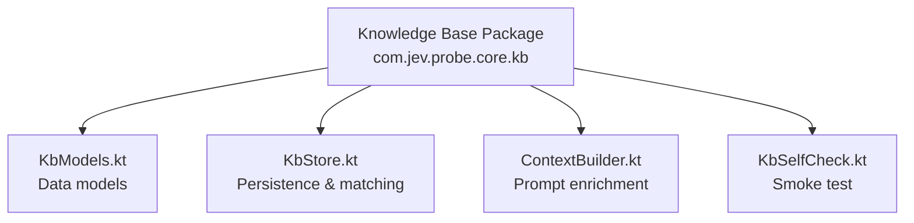
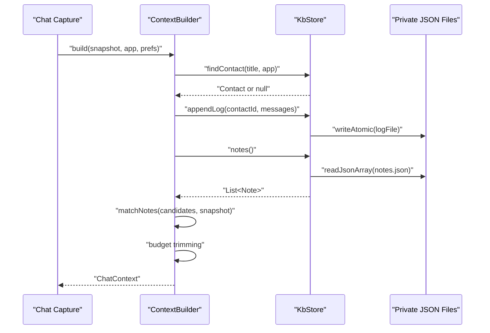
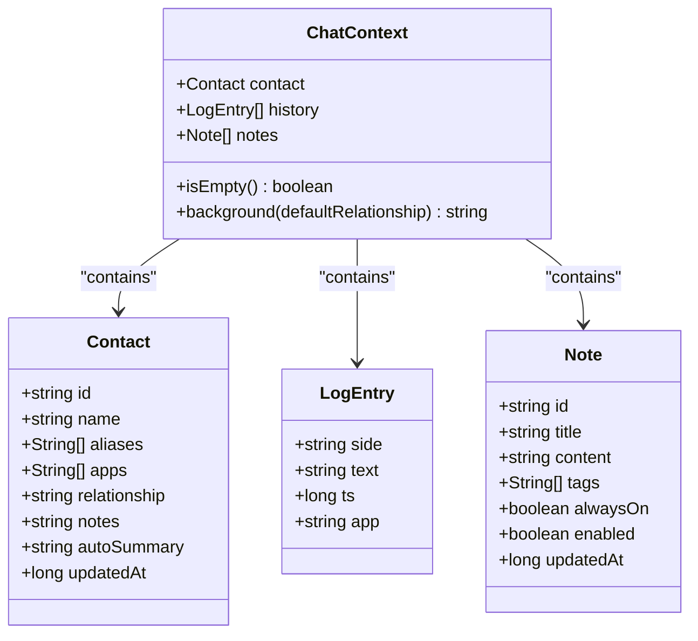
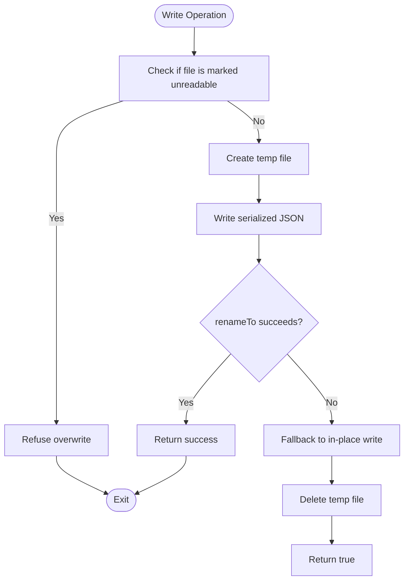
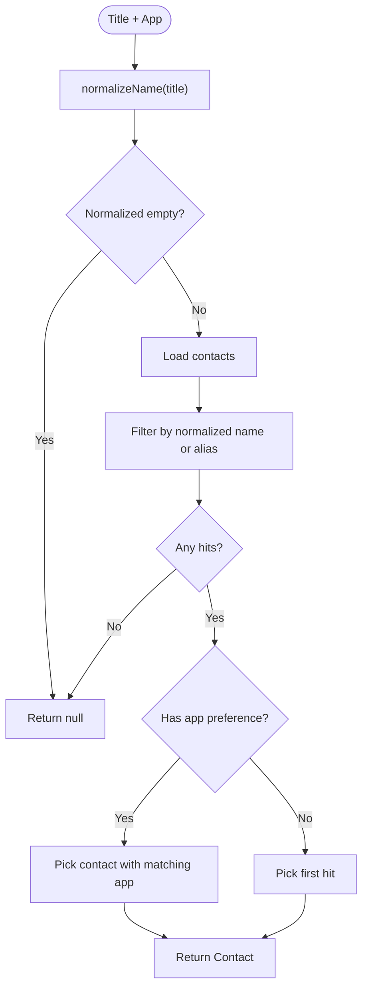
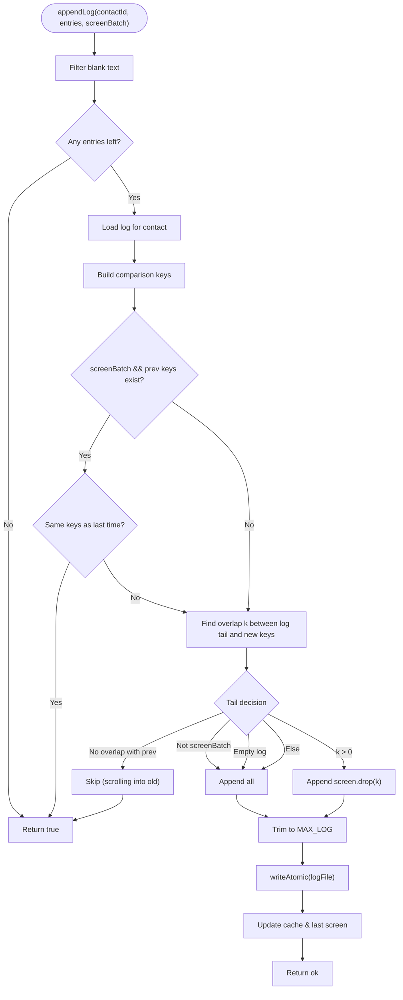
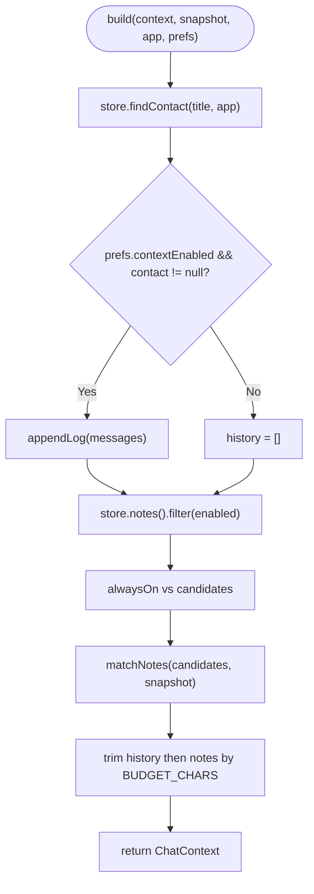
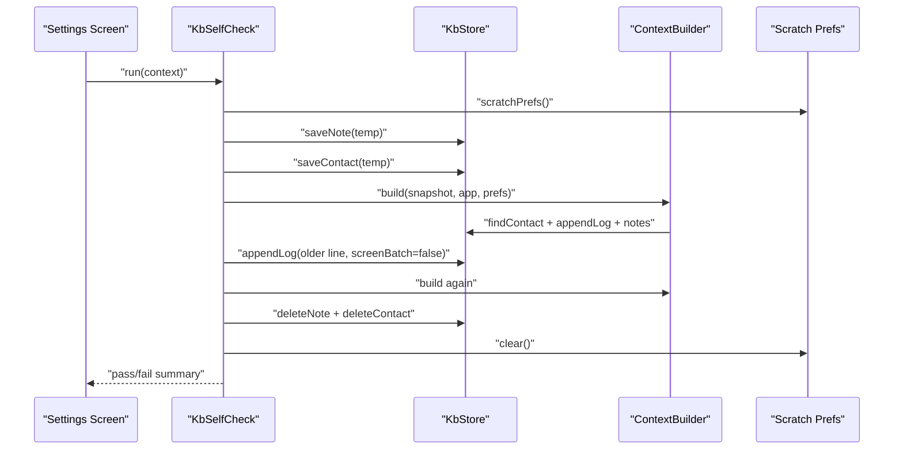
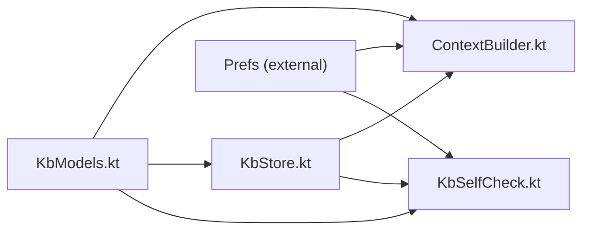

# Knowledge Base System

<cite>
**Referenced Files in This Document**
- [KbModels.kt](file://app/src/main/java/com/jev/probe/core/kb/KbModels.kt)
- [KbStore.kt](file://app/src/main/java/com/jev/probe/core/kb/KbStore.kt)
- [ContextBuilder.kt](file://app/src/main/java/com/jev/probe/core/kb/ContextBuilder.kt)
- [KbSelfCheck.kt](file://app/src/main/java/com/jev/probe/core/kb/KbSelfCheck.kt)
</cite>

## Table of Contents
1. [Introduction](#introduction)
2. [Project Structure](#project-structure)
3. [Core Components](#core-components)
4. [Architecture Overview](#architecture-overview)
5. [Detailed Component Analysis](#detailed-component-analysis)
6. [Dependency Analysis](#dependency-analysis)
7. [Performance Considerations](#performance-considerations)
8. [Troubleshooting Guide](#troubleshooting-guide)
9. [Conclusion](#conclusion)

## Introduction
This document explains the knowledge base sub-component that powers local, private storage and enrichment for Android chat capture. It covers how contacts, notes, and chat history are stored under the app’s private files directory; how data models represent people, free-text notes, and conversation lines; how a context builder assembles relevant background information for AI analysis; how self-check validates core behavior; and how search, matching, deduplication, retention, and privacy controls work together.

The system is intentionally lightweight: it uses plain JSON files, no database or network calls, and keeps all data within the application’s private storage. Users can perform one-time cleanup operations to remove all knowledge-base content without affecting other app settings.

## Project Structure
The knowledge base lives under `com.jev.probe.core.kb` and consists of four main files:

- Data models define contacts, notes, log entries, and the enriched chat context.
- The store handles persistence, caching, atomic writes, and per-contact history.
- The context builder turns a live chat snapshot into an enriched prompt payload.
- The self-check runs a smoke test against real storage using temporary scratch data.

**Diagram sources**
- [KbModels.kt:1-86](file://app/src/main/java/com/jev/probe/core/kb/KbModels.kt#L1-L86)
- [KbStore.kt:1-540](file://app/src/main/java/com/jev/probe/core/kb/KbStore.kt#L1-L540)
- [ContextBuilder.kt:1-124](file://app/src/main/java/com/jev/probe/core/kb/ContextBuilder.kt#L1-L124)
- [KbSelfCheck.kt:1-134](file://app/src/main/java/com/jev/probe/core/kb/KbSelfCheck.kt#L1-L134)

**Section sources**
- [KbModels.kt:1-86](file://app/src/main/java/com/jev/probe/core/kb/KbModels.kt#L1-L86)
- [KbStore.kt:1-540](file://app/src/main/java/com/jev/probe/core/kb/KbStore.kt#L1-L540)
- [ContextBuilder.kt:1-124](file://app/src/main/java/com/jev/probe/core/kb/ContextBuilder.kt#L1-L124)
- [KbSelfCheck.kt:1-134](file://app/src/main/java/com/jev/probe/core/kb/KbSelfCheck.kt#L1-L134)

## Core Components
The knowledge base has four primary responsibilities:

- **Data modeling**: Define structured entities for notes, contacts, chat logs, and enriched context.
- **Local persistence**: Store and retrieve JSON files under the app-private `filesDir/kb` directory with atomic writes and safe recovery from corruption.
- **Context construction**: Match current conversations to known contacts and notes, then assemble a bounded background string for AI prompts.
- **Integrity verification**: Provide a self-check routine that exercises name normalization, note matching, history deduplication, and prompt injection.

Key behaviors include:
- Notes have titles, content, tags, persistence flags, and timestamps.
- Contacts have names, aliases, associated apps, relationships, and manual notes.
- Chat history is tracked per contact with deduplication and a maximum size.
- Context building applies character budgets and caps on injected notes.
- Privacy controls allow users to clear all knowledge-base data in one operation.

**Section sources**
- [KbModels.kt:11-85](file://app/src/main/java/com/jev/probe/core/kb/KbModels.kt#L11-L85)
- [KbStore.kt:12-23](file://app/src/main/java/com/jev/probe/core/kb/KbStore.kt#L12-L23)
- [ContextBuilder.kt:8-15](file://app/src/main/java/com/jev/probe/core/kb/ContextBuilder.kt#L8-L15)
- [KbSelfCheck.kt:8-18](file://app/src/main/java/com/jev/probe/core/kb/KbSelfCheck.kt#L8-L18)

## Architecture Overview
At runtime, the system follows this flow:

1. A chat snapshot arrives with a title and message list.
2. The context builder identifies the contact by normalizing the title and comparing it to stored names and aliases.
3. If enabled, recent chat history is appended and filtered so messages currently on screen are not duplicated.
4. Enabled notes are matched against the conversation title and recent messages using tag/title substring matching.
5. A character budget trims history and notes while preserving always-on notes.
6. The resulting context is converted into a background string that includes relationship, contact notes, and matched note summaries.
7. All reads and writes go through a single lock and use atomic file operations for durability.

**Diagram sources**
- [ContextBuilder.kt:35-63](file://app/src/main/java/com/jev/probe/core/kb/ContextBuilder.kt#L35-L63)
- [KbStore.kt:172-220](file://app/src/main/java/com/jev/probe/core/kb/KbStore.kt#L172-L220)
- [KbStore.kt:294-356](file://app/src/main/java/com/jev/probe/core/kb/KbStore.kt#L294-L356)
- [KbStore.kt:438-459](file://app/src/main/java/com/jev/probe/core/kb/KbStore.kt#L438-L459)

## Detailed Component Analysis

### Data Models
The data models define the core entities used throughout the knowledge base.

- **Note**: Represents a user-maintained free-text entry with an identifier, title, content, optional tags, persistence flags (`alwaysOn`, `enabled`), and update timestamp.
- **Contact**: Represents a person or group with an identifier, display name, aliases for cross-app matching, associated app package names, relationship description, manual notes, reserved auto-summary field, and update timestamp.
- **LogEntry**: Represents a single remembered chat line with sender side, text, timestamp, and originating app.
- **ChatContext**: Aggregates the matched contact, recent history, and matched notes; provides methods to check emptiness and build a background string for prompts.

**Diagram sources**
- [KbModels.kt:11-85](file://app/src/main/java/com/jev/probe/core/kb/KbModels.kt#L11-L85)

**Section sources**
- [KbModels.kt:11-85](file://app/src/main/java/com/jev/probe/core/kb/KbModels.kt#L11-L85)

### Local Storage Architecture
The store manages three kinds of JSON files under `filesDir/kb`:

- `kb/notes.json`: All notes.
- `kb/contacts.json`: All contacts.
- `kb/logs/<contactId>.json`: Per-contact chat history, capped at a maximum number of lines.
- `kb/logs/<contactId>.screen.json`: Last screen comparison keys for deduplication.

Design characteristics:
- Single-writer concurrency via a lock around every read/write.
- Atomic writes using temp file plus rename to avoid partial documents after crashes.
- Hand-written JSON serialization using standard Android JSON APIs.
- In-memory caches for notes, contacts, and per-contact logs.
- Corruption handling that backs up unreadable files rather than overwriting them.
- Privacy-safe logging: chat text never reaches logcat; only counts and lengths are logged.

**Diagram sources**
- [KbStore.kt:438-459](file://app/src/main/java/com/jev/probe/core/kb/KbStore.kt#L438-L459)
- [KbStore.kt:412-428](file://app/src/main/java/com/jev/probe/core/kb/KbStore.kt#L412-L428)

**Section sources**
- [KbStore.kt:12-23](file://app/src/main/java/com/jev/probe/core/kb/KbStore.kt#L12-L23)
- [KbStore.kt:29-40](file://app/src/main/java/com/jev/probe/core/kb/KbStore.kt#L29-L40)
- [KbStore.kt:438-459](file://app/src/main/java/com/jev/probe/core/kb/KbStore.kt#L438-L459)
- [KbStore.kt:412-428](file://app/src/main/java/com/jev/probe/core/kb/KbStore.kt#L412-L428)

### Contact Matching and Persistence
Contacts are matched by normalized name or alias, optionally preferring a contact already associated with the same app package. Matching does not create unknown contacts; creation or merging is handled separately.

Key operations:
- `findContact(title, app)`: Normalizes the title and compares it to stored names and aliases.
- `saveOrMergeContact(title, app)`: Creates a new contact or merges aliases and apps into an existing one.
- `saveContact(c)` / `deleteContact(id)`: Persist or remove a contact, including its history files.

Name normalization removes zero-width characters, strips trailing group member counts like `(12)` or full-width equivalents, trims whitespace, and lower-cases the result. Display helpers preserve original casing where needed.

**Diagram sources**
- [KbStore.kt:106-116](file://app/src/main/java/com/jev/probe/core/kb/KbStore.kt#L106-L116)
- [KbStore.kt:521-531](file://app/src/main/java/com/jev/probe/core/kb/KbStore.kt#L521-L531)

**Section sources**
- [KbStore.kt:98-145](file://app/src/main/java/com/jev/probe/core/kb/KbStore.kt#L98-L145)
- [KbStore.kt:500-537](file://app/src/main/java/com/jev/probe/core/kb/KbStore.kt#L500-L537)

### Chat History Tracking and Deduplication
History is tracked per contact with a strict deduplication strategy based on screen batches and sequence overlap.

Rules:
- Identical screens compared to the last written screen produce no new entries.
- If the log is empty, the entire screen is written.
- If the log tail matches part of the new screen, only the new tail is appended.
- If there is no overlap with the previous screen, the system assumes scrolling into older messages and skips writing duplicates.
- Otherwise, the entire screen is appended.
- History is capped at a maximum size, dropping oldest entries when exceeded.

Deduplication also filters out messages currently on screen when injecting recent history into prompts, ensuring the AI sees only older context.

**Diagram sources**
- [KbStore.kt:172-220](file://app/src/main/java/com/jev/probe/core/kb/KbStore.kt#L172-L220)
- [KbStore.kt:248-267](file://app/src/main/java/com/jev/probe/core/kb/KbStore.kt#L248-L267)

**Section sources**
- [KbStore.kt:147-220](file://app/src/main/java/com/jev/probe/core/kb/KbStore.kt#L147-L220)
- [KbStore.kt:223-241](file://app/src/main/java/com/jev/probe/core/kb/KbStore.kt#L223-L241)
- [KbStore.kt:248-267](file://app/src/main/java/com/jev/probe/core/kb/KbStore.kt#L248-L267)

### ContextBuilder: Enriched Prompt Construction
The context builder constructs enriched prompts by combining:

- Contact identification via exact normalized name/alias matching.
- Recent chat history, filtered to exclude messages currently on screen.
- Always-on notes plus keyword-matched notes.
- Character budget enforcement that trims history first, then notes, while preserving always-on notes.

Matching algorithm:
- Builds a haystack from the conversation title and the last few messages.
- Matches any note tag or title as a normalized substring.
- Sorts hits by recency and caps the number of matched notes.

Budget enforcement:
- Total cost includes note titles, contents, and history texts with small overheads.
- Trimming removes oldest history first, then newest notes, until within the character budget.

**Diagram sources**
- [ContextBuilder.kt:35-63](file://app/src/main/java/com/jev/probe/core/kb/ContextBuilder.kt#L35-L63)
- [ContextBuilder.kt:70-91](file://app/src/main/java/com/jev/probe/core/kb/ContextBuilder.kt#L70-L91)
- [ContextBuilder.kt:98-116](file://app/src/main/java/com/jev/probe/core/kb/ContextBuilder.kt#L98-L116)

**Section sources**
- [ContextBuilder.kt:8-15](file://app/src/main/java/com/jev/probe/core/kb/ContextBuilder.kt#L8-L15)
- [ContextBuilder.kt:35-63](file://app/src/main/java/com/jev/probe/core/kb/ContextBuilder.kt#L35-L63)
- [ContextBuilder.kt:70-91](file://app/src/main/java/com/jev/probe/core/kb/ContextBuilder.kt#L70-L91)
- [ContextBuilder.kt:98-116](file://app/src/main/java/com/jev/probe/core/kb/ContextBuilder.kt#L98-L116)

### Self-Check Mechanisms
The self-check is a smoke test that validates critical knowledge-base behavior using temporary data and a scratch preferences file:

- Name normalization across half-width and full-width member counts.
- Contact matching via aliases and normalized titles.
- Note matching via tags appearing in conversation titles.
- History deduplication against on-screen messages.
- Background string composition including contact relationship and note content.
- Opt-in behavior for history injection.

After running tests, it cleans up temporary notes and contacts and clears the scratch preferences.

**Diagram sources**
- [KbSelfCheck.kt:29-126](file://app/src/main/java/com/jev/probe/core/kb/KbSelfCheck.kt#L29-L126)
- [KbSelfCheck.kt:128-132](file://app/src/main/java/com/jev/probe/core/kb/KbSelfCheck.kt#L128-L132)

**Section sources**
- [KbSelfCheck.kt:8-18](file://app/src/main/java/com/jev/probe/core/kb/KbSelfCheck.kt#L8-L18)
- [KbSelfCheck.kt:29-126](file://app/src/main/java/com/jev/probe/core/kb/KbSelfCheck.kt#L29-L126)

## Dependency Analysis
The knowledge base components have clear dependencies:

- `ContextBuilder` depends on `KbStore` for persistence and matching, and on `Prefs` for user opt-in settings.
- `KbSelfCheck` depends on both `KbStore` and `ContextBuilder`, plus a scratch `Prefs` instance.
- `KbStore` is self-contained except for Android `Context` and standard JSON utilities.
- `KbModels` defines shared types consumed by all other components.

**Diagram sources**
- [KbModels.kt:1-86](file://app/src/main/java/com/jev/probe/core/kb/KbModels.kt#L1-L86)
- [KbStore.kt:1-540](file://app/src/main/java/com/jev/probe/core/kb/KbStore.kt#L1-L540)
- [ContextBuilder.kt:1-124](file://app/src/main/java/com/jev/probe/core/kb/ContextBuilder.kt#L1-L124)
- [KbSelfCheck.kt:1-134](file://app/src/main/java/com/jev/probe/core/kb/KbSelfCheck.kt#L1-L134)

**Section sources**
- [KbModels.kt:1-86](file://app/src/main/java/com/jev/probe/core/kb/KbModels.kt#L1-L86)
- [KbStore.kt:1-540](file://app/src/main/java/com/jev/probe/core/kb/KbStore.kt#L1-L540)
- [ContextBuilder.kt:1-124](file://app/src/main/java/com/jev/probe/core/kb/ContextBuilder.kt#L1-L124)
- [KbSelfCheck.kt:1-134](file://app/src/main/java/com/jev/probe/core/kb/KbSelfCheck.kt#L1-L134)

## Performance Considerations
- **Caching**: Notes, contacts, and per-contact logs are cached in memory to reduce repeated disk reads.
- **Bounded history**: Per-contact logs are capped at a fixed maximum size to prevent unbounded growth.
- **Character budget**: Context injection limits total background size, trimming history before notes to preserve important always-on information.
- **Cheap matching**: Name and note matching use simple normalization and substring checks rather than embeddings or scoring.
- **Atomic writes**: Temp-file-plus-rename avoids partial writes and reduces corruption risk.
- **Safe regex compilation**: Regex patterns are compiled lazily and wrapped to avoid crashing the entire class initialization.

[No sources needed since this section provides general guidance]

## Troubleshooting Guide
Common issues and their indicators:

- **Corrupt JSON files**: The store backs up unreadable files with a `.corrupt.<timestamp>` suffix and refuses to overwrite them. Logs warn about unreadable files but do not expose chat content.
- **Regex failures**: If device ICU rejects a pattern, the store safely degrades to simpler string operations and logs warnings instead of crashing.
- **Missing contact match**: Verify that the conversation title and contact name/alias normalize to the same value; check for zero-width characters and trailing member counts.
- **History duplication**: Ensure screen batch mode is used for captures; verify that on-screen messages are filtered out when injecting recent history.
- **Self-check failures**: The self-check returns a human-readable failure list covering normalization, contact matching, note matching, history deduplication, and background composition.

Recommended steps:
- Run the self-check from settings to validate core behavior.
- Inspect counts of notes, contacts, and log lines to confirm expected state.
- Use the one-time cleanup operation to reset the knowledge base if corruption persists.

**Section sources**
- [KbStore.kt:412-428](file://app/src/main/java/com/jev/probe/core/kb/KbStore.kt#L412-L428)
- [KbStore.kt:486-514](file://app/src/main/java/com/jev/probe/core/kb/KbStore.kt#L486-L514)
- [KbSelfCheck.kt:29-126](file://app/src/main/java/com/jev/probe/core/kb/KbSelfCheck.kt#L29-L126)

## Conclusion
The knowledge base system provides a compact, private, and durable foundation for enriching AI responses with local contact information, user notes, and recent chat history. Its design emphasizes safety through atomic writes, corruption handling, and explicit privacy controls. The context builder offers straightforward matching and budgeting to keep prompts useful without becoming oversized. The self-check ensures that critical paths remain reliable across devices and regex engines. For long-term maintenance, focus on preserving the simplicity of matching algorithms, honoring the character budget, and keeping cleanup operations safe and user-controlled.

[No sources needed since this section summarizes without analyzing specific files]