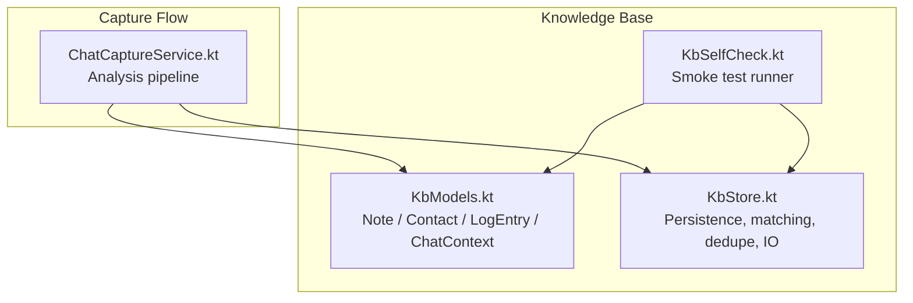
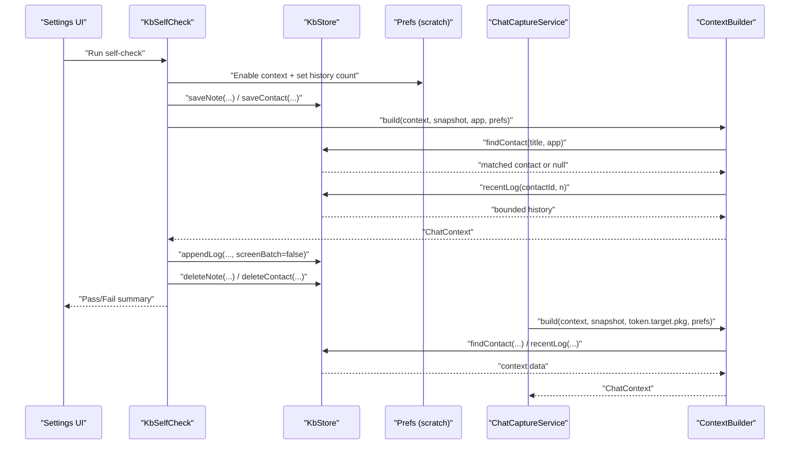
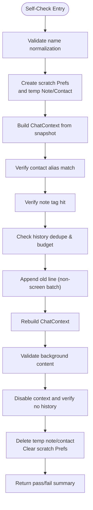
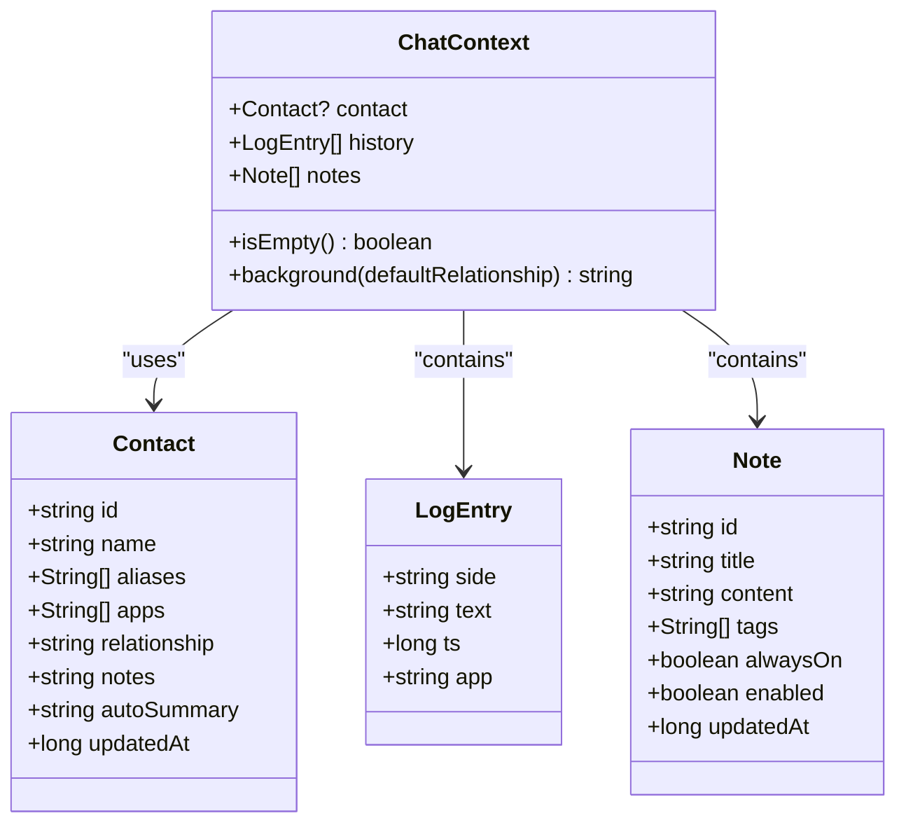
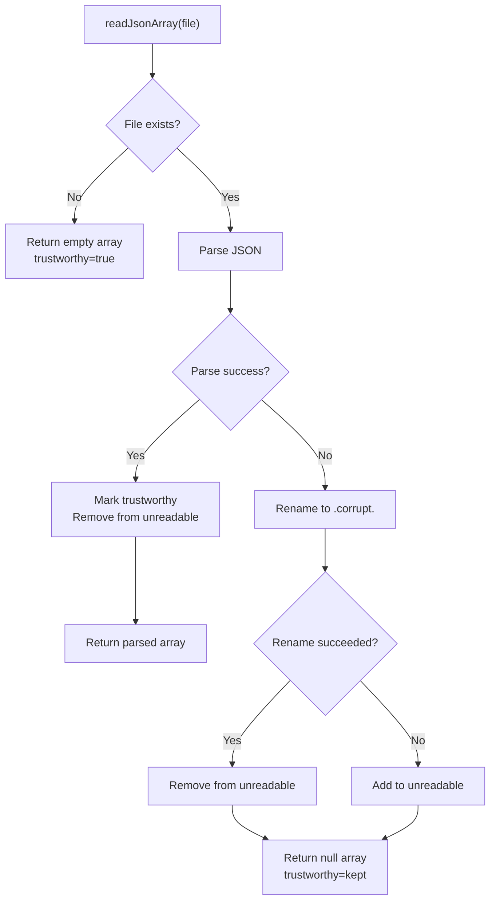
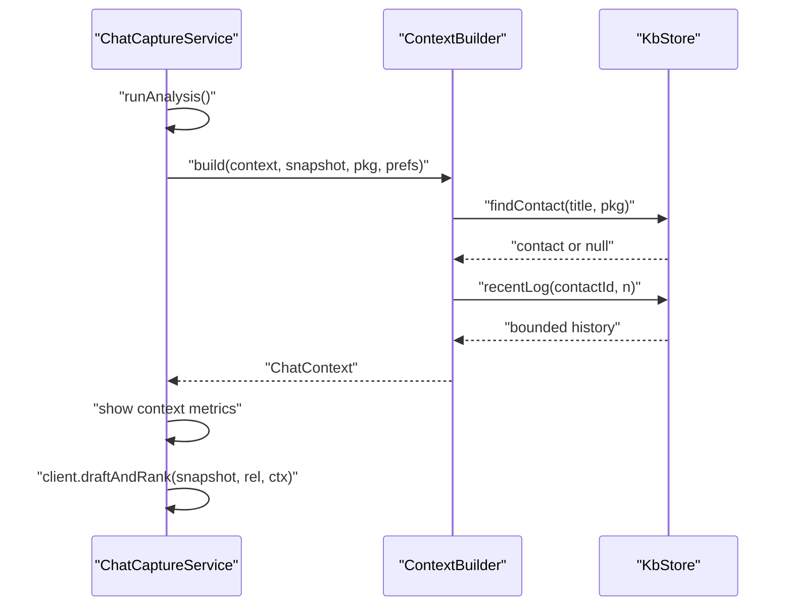
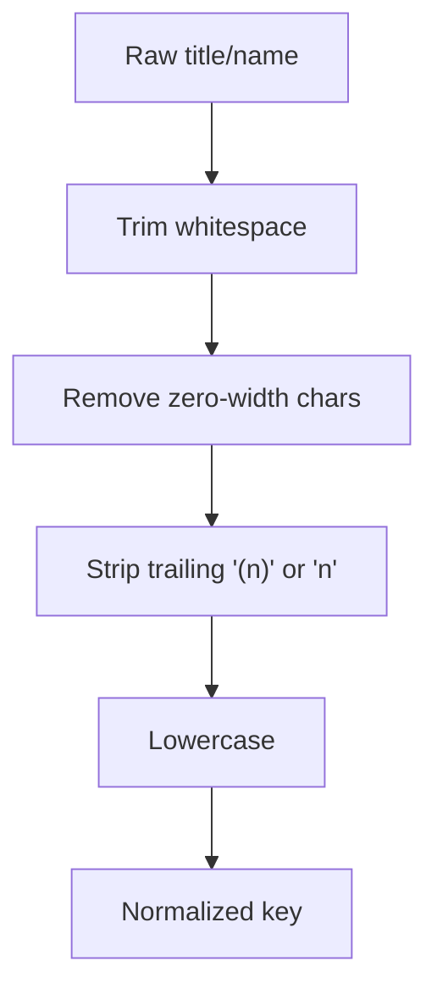
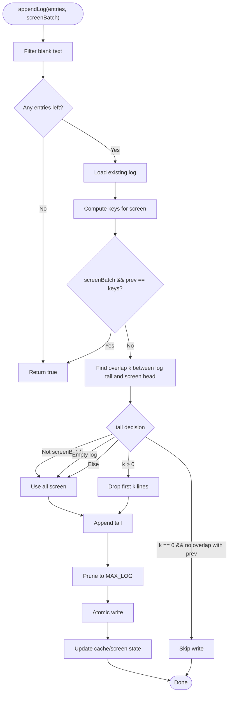
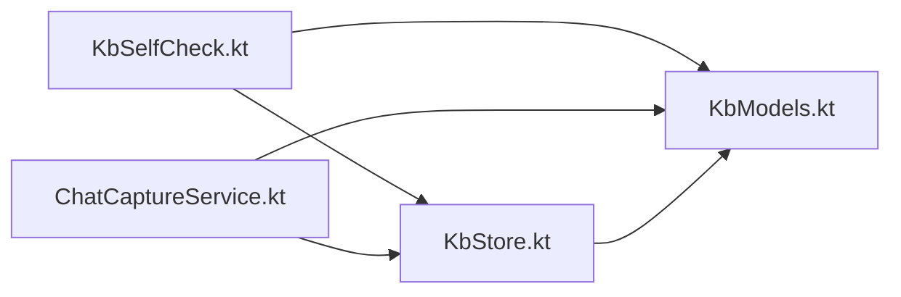

# Self-Check and Validation

<cite>
**Referenced Files in This Document**
- [KbSelfCheck.kt](file://app/src/main/java/com/jev/probe/core/kb/KbSelfCheck.kt)
- [KbStore.kt](file://app/src/main/java/com/jev/probe/core/kb/KbStore.kt)
- [KbModels.kt](file://app/src/main/java/com/jev/probe/core/kb/KbModels.kt)
- [ChatCaptureService.kt](file://app/src/main/java/com/jev/probe/capture/ChatCaptureService.kt)
</cite>

## Table of Contents
1. [Introduction](#introduction)
2. [Project Structure](#project-structure)
3. [Core Components](#core-components)
4. [Architecture Overview](#architecture-overview)
5. [Detailed Component Analysis](#detailed-component-analysis)
6. [Dependency Analysis](#dependency-analysis)
7. [Performance Considerations](#performance-considerations)
8. [Troubleshooting Guide](#troubleshooting-guide)
9. [Conclusion](#conclusion)

## Introduction
This document explains the self-check and validation system for the on-device knowledge base. It covers integrity checks for contacts, notes, and chat history; cleanup and repair behavior for malformed or corrupted data; storage optimization through deduplication and bounded logs; automated maintenance during capture workflows; reporting mechanisms that surface failures; validation rules for names, note content, and chat entries; and repair strategies with rollback-safe persistence.

The system is centered around three core files:
- A smoke-test runner that exercises real knowledge-base paths without touching user settings.
- A single-writer JSON store that persists notes, contacts, and per-contact logs.
- Lightweight data models used by both the store and the context builder.

## Project Structure
The relevant code lives under the knowledge-base package and the capture service:

**Diagram sources**
- [KbModels.kt:11-42](file://app/src/main/java/com/jev/probe/core/kb/KbModels.kt#L11-L42)
- [KbStore.kt:9-42](file://app/src/main/java/com/jev/probe/core/kb/KbStore.kt#L9-L42)
- [KbSelfCheck.kt:8-18](file://app/src/main/java/com/jev/probe/core/kb/KbSelfCheck.kt#L8-L18)
- [ChatCaptureService.kt:389-408](file://app/src/main/java/com/jev/probe/capture/ChatCaptureService.kt#L389-L408)

**Section sources**
- [KbModels.kt:1-42](file://app/src/main/java/com/jev/probe/core/kb/KbModels.kt#L1-L42)
- [KbStore.kt:1-42](file://app/src/main/java/com/jev/probe/core/kb/KbStore.kt#L1-L42)
- [KbSelfCheck.kt:1-18](file://app/src/main/java/com/jev/probe/core/kb/KbSelfCheck.kt#L1-L18)
- [ChatCaptureService.kt:389-408](file://app/src/main/java/com/jev/probe/capture/ChatCaptureService.kt#L389-L408)

## Core Components
- Knowledge models define the entities stored and analyzed:
  - Note: free-text knowledge with tags, enablement, and timestamps.
  - Contact: person/group identity with aliases, app origins, relationship text, and optional summary fields.
  - LogEntry: one chat line with side, text, timestamp, and originating app.
  - ChatContext: the assembled view of contact, history, and matched notes injected into analysis.

- KbStore provides:
  - Atomic persistence for notes, contacts, and per-contact logs.
  - Name normalization and display-name helpers.
  - Contact matching via normalized name and aliases.
  - History deduplication and bounded retention.
  - Corruption handling and backup preservation.

- KbSelfCheck runs a controlled smoke test against the real store using scratch preferences to validate:
  - Name normalization across half/full-width member counts and whitespace.
  - Contact alias resolution.
  - Note keyword/tag matching.
  - History deduplication and budget injection.
  - Opt-in behavior when history is disabled.

**Section sources**
- [KbModels.kt:11-85](file://app/src/main/java/com/jev/probe/core/kb/KbModels.kt#L11-L85)
- [KbStore.kt:42-145](file://app/src/main/java/com/jev/probe/core/kb/KbStore.kt#L42-L145)
- [KbStore.kt:147-241](file://app/src/main/java/com/jev/probe/core/kb/KbStore.kt#L147-L241)
- [KbStore.kt:486-537](file://app/src/main/java/com/jev/probe/core/kb/KbStore.kt#L486-L537)
- [KbSelfCheck.kt:28-126](file://app/src/main/java/com/jev/probe/core/kb/KbSelfCheck.kt#L28-L126)

## Architecture Overview
The validation and maintenance flow spans the smoke test, the store’s persistence layer, and the capture service’s analysis path.

**Diagram sources**
- [KbSelfCheck.kt:28-126](file://app/src/main/java/com/jev/probe/core/kb/KbSelfCheck.kt#L28-L126)
- [KbStore.kt:106-145](file://app/src/main/java/com/jev/probe/core/kb/KbStore.kt#L106-L145)
- [KbStore.kt:172-241](file://app/src/main/java/com/jev/probe/core/kb/KbStore.kt#L172-L241)
- [ChatCaptureService.kt:389-408](file://app/src/main/java/com/jev/probe/capture/ChatCaptureService.kt#L389-L408)

## Detailed Component Analysis

### Integrity Checks Performed by the Self-Check Runner
The self-check validates several critical behaviors:

- Name normalization:
  - Verifies that titles with half/full-width parentheses, trailing member counts, and extra whitespace normalize to the same bare name.
  - Ensures regex compilation does not crash class initialization.

- Contact alias resolution:
  - Confirms that a conversation title matches a contact via an alias containing full-width parentheses.

- Note matching:
  - Confirms that a note tagged with a keyword appears when the keyword occurs in the conversation title.

- History deduplication and budget injection:
  - Ensures on-screen messages are recorded but not echoed back into injected history.
  - Validates that log size equals the number of captured messages.
  - Confirms that appending an older line once adds exactly one entry and re-reading the same screen does not duplicate it.

- Background composition:
  - Verifies that the background string includes fabricated note content and contact relationship text.

- Opt-in history behavior:
  - Confirms that when context is disabled, no history is injected.

- Cleanup:
  - Deletes temporary note and contact created by the test.
  - Clears scratch preferences so user settings remain untouched.

**Diagram sources**
- [KbSelfCheck.kt:28-126](file://app/src/main/java/com/jev/probe/core/kb/KbSelfCheck.kt#L28-L126)

**Section sources**
- [KbSelfCheck.kt:28-126](file://app/src/main/java/com/jev/probe/core/kb/KbSelfCheck.kt#L28-L126)

### Data Models and Their Roles in Validation
- Note:
  - Used to inject factual context when its tags match conversation metadata.
  - Enabled/disabled flags control whether it participates in context building.

- Contact:
  - Aliases allow cross-app identity resolution.
  - Apps list helps prefer a contact known to the current chat app.

- LogEntry:
  - Represents one chat line; side indicates speaker, ts is timestamp, app identifies origin.

- ChatContext:
  - Aggregates contact, history, and notes.
  - background() composes the prompt context string; isEmpty() avoids sending empty context.

**Diagram sources**
- [KbModels.kt:11-85](file://app/src/main/java/com/jev/probe/core/kb/KbModels.kt#L11-L85)

**Section sources**
- [KbModels.kt:11-85](file://app/src/main/java/com/jev/probe/core/kb/KbModels.kt#L11-L85)

### Persistence, Repair, and Rollback Strategy
KbStore implements robust persistence and repair:

- Single writer with synchronization:
  - All reads/writes are synchronized to prevent concurrent corruption.

- Atomic writes:
  - Writes go to a temporary file then rename to the target.
  - If rename fails, it falls back to in-place overwrite and reports non-atomic success.
  - Failed writes clear caches so subsequent reads reload from disk.

- Corruption handling:
  - On parse failure, the damaged file is renamed to a dated `.corrupt.*` backup.
  - If renaming fails, the file path is marked unreadable and future writes are refused to avoid overwriting user data.
  - Trustworthy flag prevents caching of empty lists derived from unrecoverable files.

- Bounded logs:
  - Each contact’s log is capped at a maximum number of lines.
  - Oldest entries are removed when exceeding the limit.

- Clear operations:
  - Deleting a contact removes its log and last-screen comparison files.
  - Clearing all knowledge base recursively deletes the kb directory while leaving other app data intact.

**Diagram sources**
- [KbStore.kt:401-428](file://app/src/main/java/com/jev/probe/core/kb/KbStore.kt#L401-L428)

**Section sources**
- [KbStore.kt:24-42](file://app/src/main/java/com/jev/probe/core/kb/KbStore.kt#L24-L42)
- [KbStore.kt:43-96](file://app/src/main/java/com/jev/probe/core/kb/KbStore.kt#L43-L96)
- [KbStore.kt:233-290](file://app/src/main/java/com/jev/probe/core/kb/KbStore.kt#L233-L290)
- [KbStore.kt:401-459](file://app/src/main/java/com/jev/probe/core/kb/KbStore.kt#L401-L459)

### Automated Maintenance During Capture
During capture-driven analysis, the system builds context and interacts with the store:

- The capture service initiates analysis only if enabled and access is configured.
- It builds context using the current snapshot and app package.
- It displays context metrics (number of notes and history entries).
- It calls the client to draft and rank replies based on the built context.

**Diagram sources**
- [ChatCaptureService.kt:389-408](file://app/src/main/java/com/jev/probe/capture/ChatCaptureService.kt#L389-L408)
- [KbStore.kt:106-145](file://app/src/main/java/com/jev/probe/core/kb/KbStore.kt#L106-L145)
- [KbStore.kt:223-233](file://app/src/main/java/com/jev/probe/core/kb/KbStore.kt#L223-L233)

**Section sources**
- [ChatCaptureService.kt:389-408](file://app/src/main/java/com/jev/probe/capture/ChatCaptureService.kt#L389-L408)

### Validation Rules

#### Contact Names and Matching
- Normalization:
  - Trims whitespace.
  - Removes zero-width characters.
  - Strips trailing group member counts written with half- or full-width parentheses.
  - Lowercases for comparison.

- Display name:
  - Applies the same cleanup but preserves original casing for presentation.

- Loose text normalization:
  - Removes zero-width characters, trims, and lowercases without stripping member counts.

- Matching:
  - Finds contacts where the normalized conversation title equals the normalized contact name or any alias.
  - Prefers a contact already associated with the current app package when multiple matches exist.

**Diagram sources**
- [KbStore.kt:486-537](file://app/src/main/java/com/jev/probe/core/kb/KbStore.kt#L486-L537)

**Section sources**
- [KbStore.kt:486-537](file://app/src/main/java/com/jev/probe/core/kb/KbStore.kt#L486-L537)

#### Note Content and Tag Matching
- Notes are persisted with tags and enabled flags.
- The self-check verifies that a note tagged with a keyword is matched when the keyword appears in the conversation title.
- Notes contribute to the background context string when matched.

**Section sources**
- [KbModels.kt:11-21](file://app/src/main/java/com/jev/probe/core/kb/KbModels.kt#L11-L21)
- [KbModels.kt:59-85](file://app/src/main/java/com/jev/probe/core/kb/KbModels.kt#L59-L85)
- [KbSelfCheck.kt:80-82](file://app/src/main/java/com/jev/probe/core/kb/KbSelfCheck.kt#L80-L82)

#### Chat History Entries
- Only non-blank text entries are considered for deduplication.
- Screen-batch mode applies sequence-based deduplication:
  - Identical screens are ignored.
  - Overlapping tails are detected and only new tail lines are appended.
  - Scrolling up into previously held messages does not duplicate history.
  - Otherwise, the entire screen is appended.
- Non-screen-batch mode appends entries as-is (used for deliberate injections).
- Logs are bounded to a maximum number of lines; oldest entries are pruned.

**Diagram sources**
- [KbStore.kt:149-221](file://app/src/main/java/com/jev/probe/core/kb/KbStore.kt#L149-L221)

**Section sources**
- [KbStore.kt:149-221](file://app/src/main/java/com/jev/probe/core/kb/KbStore.kt#L149-L221)

### Cleanup Processes
- Temporary data removal:
  - The self-check deletes the temporary note and contact it created.
  - Scratch preferences are cleared after the test.

- Orphaned data cleanup:
  - Deleting a contact removes its log and last-screen comparison files.
  - Clearing all knowledge base removes the entire kb directory.

- Malformed entry handling:
  - Corrupted JSON files are preserved as backups and never overwritten.
  - Unreadable files are tracked and protected from being replaced.

- Storage optimization:
  - History is bounded to a fixed maximum length.
  - Deduplication avoids redundant entries for repeated screens or scrolled-up views.

**Section sources**
- [KbSelfCheck.kt:113-120](file://app/src/main/java/com/jev/probe/core/kb/KbSelfCheck.kt#L113-L120)
- [KbStore.kt:83-96](file://app/src/main/java/com/jev/probe/core/kb/KbStore.kt#L83-L96)
- [KbStore.kt:233-290](file://app/src/main/java/com/jev/probe/core/kb/KbStore.kt#L233-L290)
- [KbStore.kt:401-459](file://app/src/main/java/com/jev/probe/core/kb/KbStore.kt#L401-L459)

### Reporting Mechanisms
- Self-check returns a human-readable pass/fail summary:
  - Lists each failure with a descriptive message.
  - Includes current counts of notes, contacts, and log lines when passing.

- Store logging:
  - Warns about unreadable files and whether they were preserved.
  - Logs append decisions including overlap size and total log size.
  - Reports atomic write fallbacks and failures.

**Section sources**
- [KbSelfCheck.kt:28-126](file://app/src/main/java/com/jev/probe/core/kb/KbSelfCheck.kt#L28-L126)
- [KbStore.kt:200-219](file://app/src/main/java/com/jev/probe/core/kb/KbStore.kt#L200-L219)
- [KbStore.kt:418-427](file://app/src/main/java/com/jev/probe/core/kb/KbStore.kt#L418-L427)
- [KbStore.kt:448-457](file://app/src/main/java/com/jev/probe/core/kb/KbStore.kt#L448-L457)

### Repair Strategies and Rollback Mechanisms
- Repair:
  - Damaged JSON files are moved to dated backups before operating on empty data.
  - If moving fails, the file is marked unreadable to prevent accidental overwrites.

- Rollback:
  - Atomic writes use temp files plus rename to ensure crashes do not leave partial documents.
  - If rename fails, it falls back to in-place overwrite and signals non-atomic success.
  - Failed writes invalidate caches so the next read reloads from disk.

**Section sources**
- [KbStore.kt:401-459](file://app/src/main/java/com/jev/probe/core/kb/KbStore.kt#L401-L459)

## Dependency Analysis
The knowledge base components interact as follows:

**Diagram sources**
- [KbSelfCheck.kt:1-18](file://app/src/main/java/com/jev/probe/core/kb/KbSelfCheck.kt#L1-L18)
- [KbStore.kt:1-42](file://app/src/main/java/com/jev/probe/core/kb/KbStore.kt#L1-L42)
- [KbModels.kt:1-42](file://app/src/main/java/com/jev/probe/core/kb/KbModels.kt#L1-L42)
- [ChatCaptureService.kt:389-408](file://app/src/main/java/com/jev/probe/capture/ChatCaptureService.kt#L389-L408)

**Section sources**
- [KbSelfCheck.kt:1-18](file://app/src/main/java/com/jev/probe/core/kb/KbSelfCheck.kt#L1-L18)
- [KbStore.kt:1-42](file://app/src/main/java/com/jev/probe/core/kb/KbStore.kt#L1-L42)
- [KbModels.kt:1-42](file://app/src/main/java/com/jev/probe/core/kb/KbModels.kt#L1-L42)
- [ChatCaptureService.kt:389-408](file://app/src/main/java/com/jev/probe/capture/ChatCaptureService.kt#L389-L408)

## Performance Considerations
- Synchronization ensures thread safety at the cost of serialized access; this is appropriate for a single-writer design.
- In-memory caches reduce repeated disk reads for notes, contacts, and per-contact logs.
- Atomic writes minimize risk of partial files but add filesystem overhead; the fallback path handles edge cases.
- History deduplication reduces storage growth and improves context relevance.
- Bounded logs prevent unbounded growth and keep memory usage predictable.

[No sources needed since this section provides general guidance]

## Troubleshooting Guide
Common issues and their indicators:

- Name normalization failures:
  - Symptoms: mismatches due to half/full-width parentheses or member counts.
  - Check: ensure normalization strips zero-width characters, trims, and lowercases.

- Contact alias misses:
  - Symptoms: conversation titles not matching known contacts.
  - Check: verify aliases include alternate titles and normalization is applied consistently.

- Note tag misses:
  - Symptoms: expected notes not injected.
  - Check: confirm tags match keywords in conversation titles and notes are enabled.

- History duplication:
  - Symptoms: repeated entries or inflated log sizes.
  - Check: verify screen-batch deduplication logic and that last-screen keys are updated correctly.

- Corrupted files:
  - Symptoms: warnings about unreadable files; data loss risk.
  - Check: inspect `.corrupt.*` backups; avoid manual edits to these files.

- Write failures:
  - Symptoms: logs indicating rename failures or in-place overwrites.
  - Check: filesystem permissions and available space; retry after resolving issues.

**Section sources**
- [KbSelfCheck.kt:28-126](file://app/src/main/java/com/jev/probe/core/kb/KbSelfCheck.kt#L28-L126)
- [KbStore.kt:418-427](file://app/src/main/java/com/jev/probe/core/kb/KbStore.kt#L418-L427)
- [KbStore.kt:448-457](file://app/src/main/java/com/jev/probe/core/kb/KbStore.kt#L448-L457)

## Conclusion
The self-check and validation system provides comprehensive integrity verification for the knowledge base. It validates contact deduplication, note matching, and log consistency while ensuring safe cleanup and robust repair mechanisms. Atomic persistence and bounded logs optimize storage and performance. Automated maintenance during capture integrates seamlessly with the analysis pipeline, and reporting mechanisms clearly surface issues for remediation. Together, these components maintain reliable, consistent, and efficient operation of the on-device knowledge base.

[No sources needed since this section summarizes without analyzing specific files]