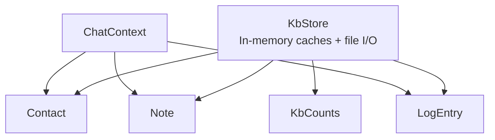
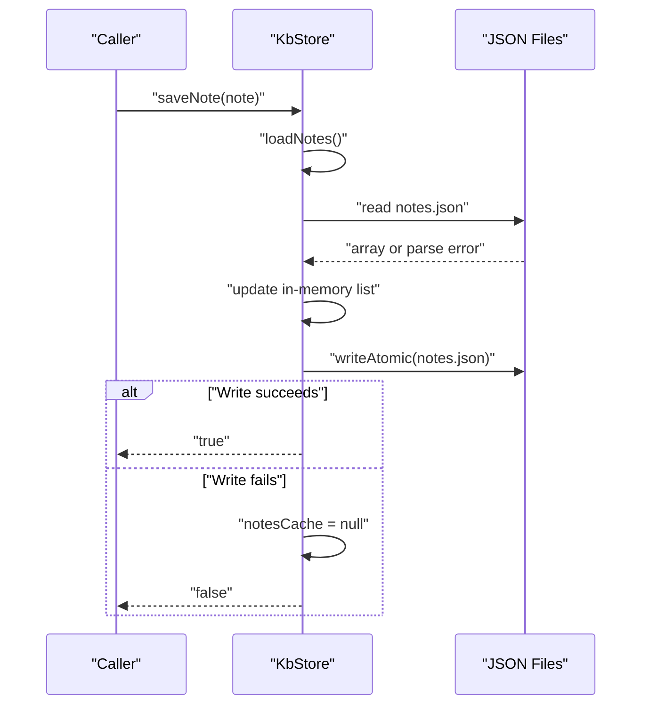
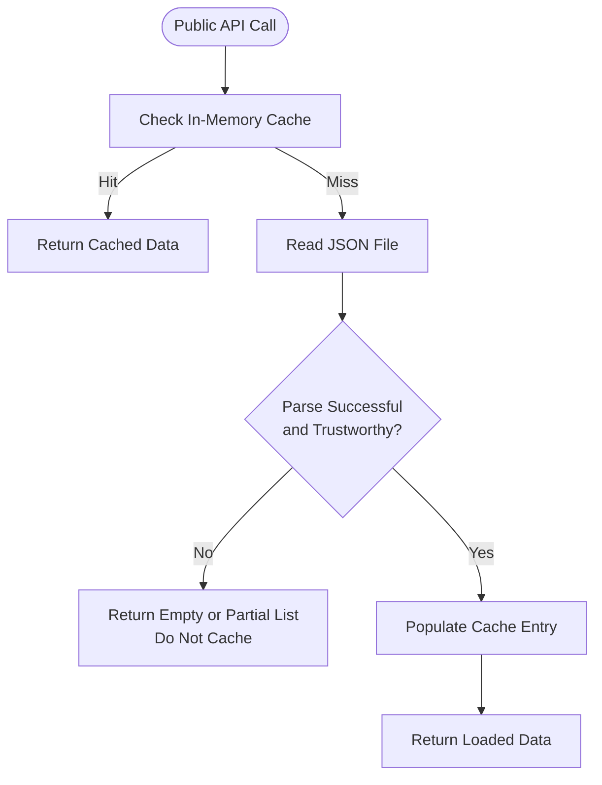
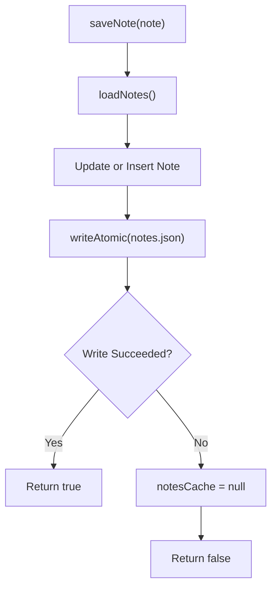
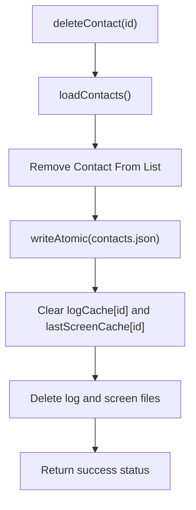
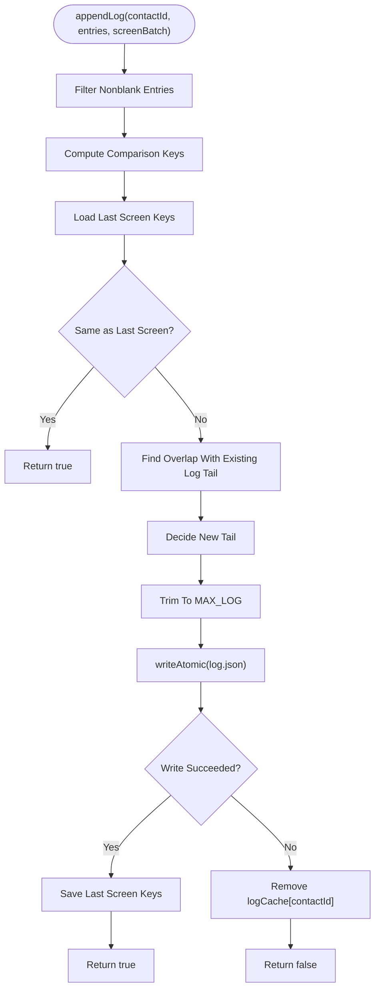
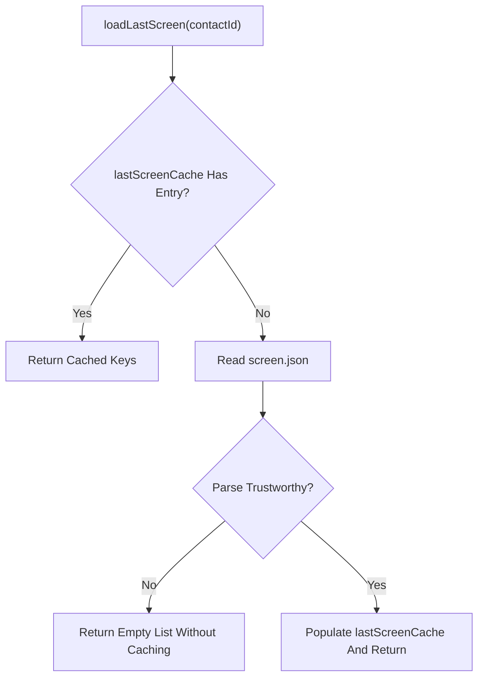
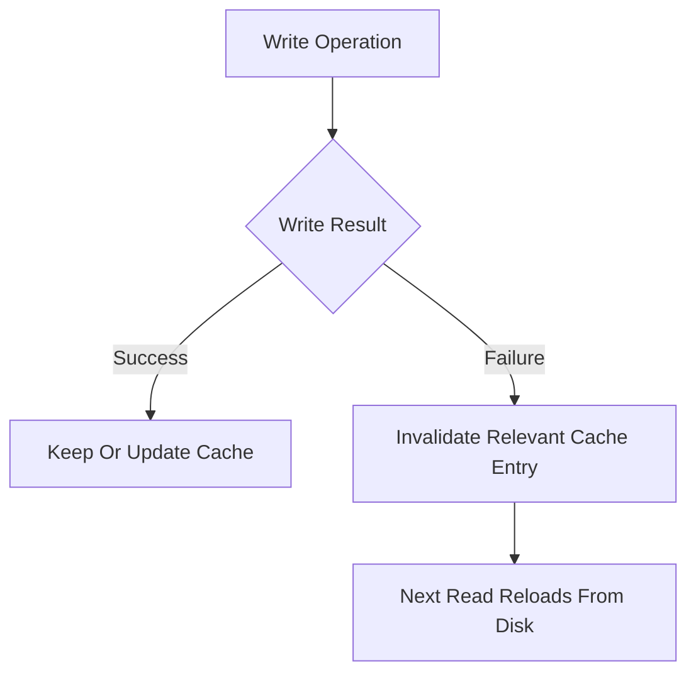
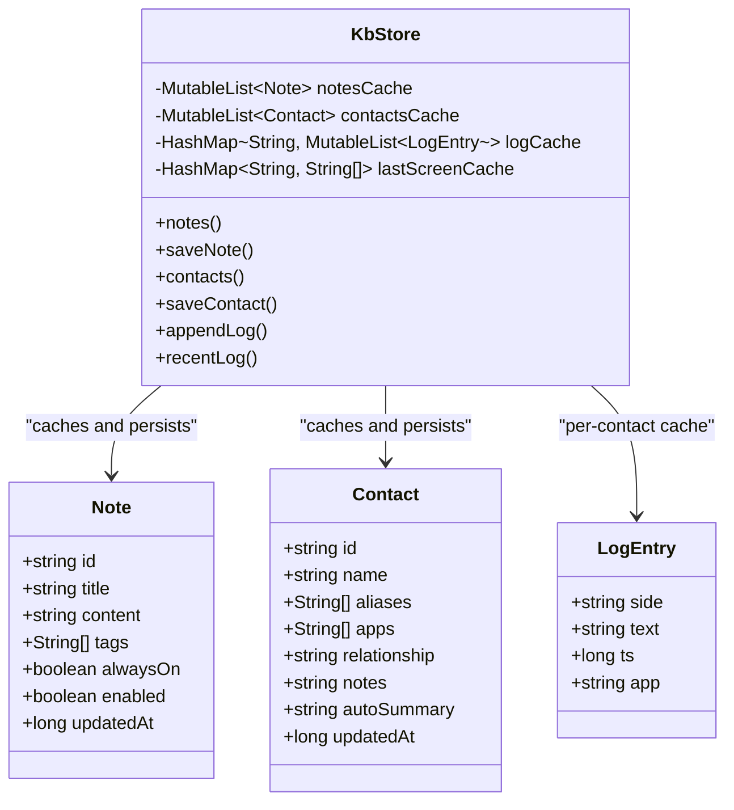
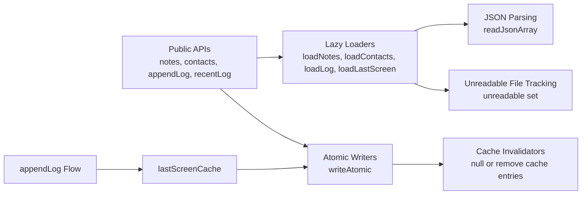

# Caching Strategy

<cite>
**Referenced Files in This Document**
- [KbStore.kt](file://app/src/main/java/com/jev/probe/core/kb/KbStore.kt)
- [KbModels.kt](file://app/src/main/java/com/jev/probe/core/kb/KbModels.kt)
</cite>

## Table of Contents
1. [Introduction](#introduction)
2. [Project Structure](#project-structure)
3. [Core Components](#core-components)
4. [Architecture Overview](#architecture-overview)
5. [Detailed Component Analysis](#detailed-component-analysis)
6. [Dependency Analysis](#dependency-analysis)
7. [Performance Considerations](#performance-considerations)
8. [Troubleshooting Guide](#troubleshooting-guide)
9. [Conclusion](#conclusion)

## Introduction
This document explains the multi-level caching strategy implemented by the knowledge-base storage engine. The engine stores notes, contacts, per-contact chat logs, and last-screen state as JSON files under an app-private directory. In addition to on-disk persistence, it maintains several in-memory caches:

- `notesCache`: cached list of all notes.
- `contactsCache`: cached list of all contacts.
- `logCache`: per-contact map from contact ID to a mutable list of log entries.
- `lastScreenCache`: per-contact map from contact ID to the sequence of comparison keys for the last screen written.

The design uses lazy loading: caches are populated only when first accessed, then reused until they become invalid due to writes or explicit cleanup. All public operations are synchronized so there is a single writer and reader path, which simplifies cache consistency.

## Project Structure
The caching logic lives in the knowledge-base package. The main implementation is in `KbStore.kt`, while the data models used by the store and its consumers are defined in `KbModels.kt`.

**Diagram sources**
- [KbStore.kt:9-40](file://app/src/main/java/com/jev/probe/core/kb/KbStore.kt#L9-L40)
- [KbModels.kt:11-52](file://app/src/main/java/com/jev/probe/core/kb/KbModels.kt#L11-L52)

**Section sources**
- [KbStore.kt:12-40](file://app/src/main/java/com/jev/probe/core/kb/KbStore.kt#L12-L40)
- [KbModels.kt:1-52](file://app/src/main/java/com/jev/probe/core/kb/KbModels.kt#L1-L52)

## Core Components
The core component is `KbStore`. It encapsulates:

- File paths for notes, contacts, per-contact logs, and per-contact last-screen state.
- Four in-memory caches: `notesCache`, `contactsCache`, `logCache`, and `lastScreenCache`.
- Lazy-loading helpers that read from disk only when needed.
- Atomic write semantics using temporary files plus rename.
- Cache invalidation after failed writes, deletions, clears, and administrative operations.

Key responsibilities:

| Area | Responsibility |
|---|---|
| Notes | Load, save, delete, and count notes; invalidate `notesCache` on write failure. |
| Contacts | Load, save, merge, delete, and find contacts; invalidate `contactsCache` on write failure. |
| Logs | Append deduplicated screen batches; maintain per-contact log cache and size limits. |
| Last screen | Track the last written screen key sequence per contact to avoid duplicate append operations. |
| Consistency | Single lock around all reads and writes; never cache untrustworthy loads. |
| Persistence | Use atomic temp-file-and-rename writes; preserve corrupt files instead of silently overwriting them. |

**Section sources**
- [KbStore.kt:24-40](file://app/src/main/java/com/jev/probe/core/kb/KbStore.kt#L24-L40)
- [KbStore.kt:44-96](file://app/src/main/java/com/jev/probe/core/kb/KbStore.kt#L44-L96)
- [KbStore.kt:172-241](file://app/src/main/java/com/jev/probe/core/kb/KbStore.kt#L172-L241)
- [KbStore.kt:438-459](file://app/src/main/java/com/jev/probe/core/kb/KbStore.kt#L438-L459)

## Architecture Overview
At runtime, `KbStore` acts as both a memory cache and a thin persistence layer. Consumers call public methods such as `notes()`, `contacts()`, `appendLog()`, and `recentLog()`. These methods synchronize access, load from disk lazily if needed, update in-memory structures, and persist changes atomically.

**Diagram sources**
- [KbStore.kt:48-57](file://app/src/main/java/com/jev/probe/core/kb/KbStore.kt#L48-L57)
- [KbStore.kt:294-314](file://app/src/main/java/com/jev/probe/core/kb/KbStore.kt#L294-L314)
- [KbStore.kt:438-459](file://app/src/main/java/com/jev/probe/core/kb/KbStore.kt#L438-L459)

## Detailed Component Analysis

### Memory Caches and Lazy Loading
The store defines four caches:

- `notesCache`: nullable mutable list of `Note`.
- `contactsCache`: nullable mutable list of `Contact`.
- `logCache`: hash map from contact ID to mutable list of `LogEntry`.
- `lastScreenCache`: hash map from contact ID to list of string comparison keys.

Lazy loading works as follows:

1. A public method calls a private loader.
2. If the corresponding cache entry exists, it is returned immediately.
3. Otherwise, the loader reads the relevant JSON file.
4. If parsing succeeds and the loaded data is trustworthy, the result is stored in the cache.
5. The caller receives a copy or view suitable for its operation.

**Diagram sources**
- [KbStore.kt:294-314](file://app/src/main/java/com/jev/probe/core/kb/KbStore.kt#L294-L314)
- [KbStore.kt:316-337](file://app/src/main/java/com/jev/probe/core/kb/KbStore.kt#L316-L337)
- [KbStore.kt:339-356](file://app/src/main/java/com/jev/probe/core/kb/KbStore.kt#L339-L356)
- [KbStore.kt:248-260](file://app/src/main/java/com/jev/probe/core/kb/KbStore.kt#L248-L260)

**Section sources**
- [KbStore.kt:35-40](file://app/src/main/java/com/jev/probe/core/kb/KbStore.kt#L35-L40)
- [KbStore.kt:294-356](file://app/src/main/java/com/jev/probe/core/kb/KbStore.kt#L294-L356)
- [KbStore.kt:401-428](file://app/src/main/java/com/jev/probe/core/kb/KbStore.kt#L401-L428)

### Notes Cache (`notesCache`)
`notesCache` holds the full list of notes. It is invalidated whenever a note write fails, ensuring that subsequent reads reload from disk rather than serving stale in-memory data.

Key behaviors:

- `notes()` and `note(id)` use lazy loading through `loadNotes()`.
- `saveNote()` updates or inserts a note, stamps the updated timestamp, writes atomically, and clears `notesCache` on failure.
- `deleteNote()` removes a note by ID, writes atomically, and clears `notesCache` on failure.
- `clearAll()` resets `notesCache` and deletes the entire knowledge-base directory.

**Diagram sources**
- [KbStore.kt:48-57](file://app/src/main/java/com/jev/probe/core/kb/KbStore.kt#L48-L57)
- [KbStore.kt:294-314](file://app/src/main/java/com/jev/probe/core/kb/KbStore.kt#L294-L314)

**Section sources**
- [KbStore.kt:44-65](file://app/src/main/java/com/jev/probe/core/kb/KbStore.kt#L44-L65)
- [KbStore.kt:294-314](file://app/src/main/java/com/jev/probe/core/kb/KbStore.kt#L294-L314)

### Contacts Cache (`contactsCache`)
`contactsCache` holds the full list of contacts. It is invalidated when a contact write fails. Deleting a contact also removes related per-contact caches and files.

Key behaviors:

- `contacts()` and `contact(id)` use lazy loading through `loadContacts()`.
- `saveContact()` updates or inserts a contact, stamps the updated timestamp, writes atomically, and clears `contactsCache` on failure.
- `deleteContact()` removes the contact from the list, attempts to delete its log and screen files, and clears both `logCache` and `lastScreenCache` for that contact.
- `findContact()` performs name and alias matching without creating new contacts.
- `saveOrMergeContact()` creates or merges a contact based on normalized names and aliases.

**Diagram sources**
- [KbStore.kt:83-96](file://app/src/main/java/com/jev/probe/core/kb/KbStore.kt#L83-L96)
- [KbStore.kt:316-337](file://app/src/main/java/com/jev/probe/core/kb/KbStore.kt#L316-L337)

**Section sources**
- [KbStore.kt:69-96](file://app/src/main/java/com/jev/probe/core/kb/KbStore.kt#L69-L96)
- [KbStore.kt:106-145](file://app/src/main/java/com/jev/probe/core/kb/KbStore.kt#L106-L145)
- [KbStore.kt:316-337](file://app/src/main/java/com/jev/probe/core/kb/KbStore.kt#L316-L337)

### Per-Contact Logs Cache (`logCache`)
`logCache` maps each contact ID to a mutable list of `LogEntry`. It supports bounded history and deduplicated screen-batch appending.

Key behaviors:

- `appendLog()` computes comparison keys for the incoming screen, compares with the last written screen, detects scroll overlap, and appends only new tail entries.
- The log is trimmed to a maximum number of lines.
- On successful append, the last screen state is saved; on write failure, the per-contact log cache entry is removed.
- `recentLog()` returns the newest `n` entries.
- `clearLog()` removes the log cache entry, last screen cache entry, and associated files.

**Diagram sources**
- [KbStore.kt:172-221](file://app/src/main/java/com/jev/probe/core/kb/KbStore.kt#L172-L221)
- [KbStore.kt:248-267](file://app/src/main/java/com/jev/probe/core/kb/KbStore.kt#L248-L267)
- [KbStore.kt:339-356](file://app/src/main/java/com/jev/probe/core/kb/KbStore.kt#L339-L356)

**Section sources**
- [KbStore.kt:147-241](file://app/src/main/java/com/jev/probe/core/kb/KbStore.kt#L147-L241)
- [KbStore.kt:339-356](file://app/src/main/java/com/jev/probe/core/kb/KbStore.kt#L339-L356)

### Last Screen State Cache (`lastScreenCache`)
`lastScreenCache` stores the comparison-key sequence of the last screen written for each contact. This prevents re-appending identical screens after process restarts or repeated captures.

Key behaviors:

- `loadLastScreen()` returns the cached value if present, otherwise reads from disk and caches only trustworthy results.
- `saveLastScreen()` updates the in-memory cache and persists the key sequence; if persistence fails, the cache entry is removed.
- Deletion and clear operations remove per-contact last-screen entries.

**Diagram sources**
- [KbStore.kt:248-267](file://app/src/main/java/com/jev/probe/core/kb/KbStore.kt#L248-L267)

**Section sources**
- [KbStore.kt:243-267](file://app/src/main/java/com/jev/probe/core/kb/KbStore.kt#L243-L267)

### Cache Invalidation Logic
Cache invalidation is tightly coupled with write outcomes and administrative operations:

| Operation | Cache Effect |
|---|---|
| `saveNote()` fails | `notesCache = null` |
| `deleteNote()` fails | `notesCache = null` |
| `saveContact()` fails | `contactsCache = null` |
| `deleteContact()` fails during contacts write | `contactsCache = null` |
| `appendLog()` fails | `logCache.remove(contactId)` |
| `saveLastScreen()` fails | `lastScreenCache.remove(contactId)` |
| `deleteContact()` | Removes `logCache[id]`, `lastScreenCache[id]`, and related files |
| `clearLog()` | Removes `logCache[id]`, `lastScreenCache[id]`, and related files |
| `clearAll()` | Clears all caches and deletes the knowledge-base directory |

**Diagram sources**
- [KbStore.kt:48-96](file://app/src/main/java/com/jev/probe/core/kb/KbStore.kt#L48-L96)
- [KbStore.kt:213-218](file://app/src/main/java/com/jev/probe/core/kb/KbStore.kt#L213-L218)
- [KbStore.kt:262-267](file://app/src/main/java/com/jev/probe/core/kb/KbStore.kt#L262-L267)
- [KbStore.kt:282-290](file://app/src/main/java/com/jev/probe/core/kb/KbStore.kt#L282-L290)

**Section sources**
- [KbStore.kt:48-96](file://app/src/main/java/com/jev/probe/core/kb/KbStore.kt#L48-L96)
- [KbStore.kt:213-218](file://app/src/main/java/com/jev/probe/core/kb/KbStore.kt#L213-L218)
- [KbStore.kt:262-267](file://app/src/main/java/com/jev/probe/core/kb/KbStore.kt#L262-L267)
- [KbStore.kt:282-290](file://app/src/main/java/com/jev/probe/core/kb/KbStore.kt#L282-L290)

### Data Models Used by the Cache Layer
The cache layer operates over three primary data models:

- `Note`: free-text knowledge notes with metadata such as tags, enabled state, and update time.
- `Contact`: person or group records with aliases, associated apps, relationship information, and optional auto-summary text.
- `LogEntry`: individual chat lines with side, text, timestamp, and originating app.

These models are serialized into JSON arrays for persistence and deserialized back into lists held by the caches.

**Diagram sources**
- [KbModels.kt:11-42](file://app/src/main/java/com/jev/probe/core/kb/KbModels.kt#L11-L42)
- [KbStore.kt:35-40](file://app/src/main/java/com/jev/probe/core/kb/KbStore.kt#L35-L40)
- [KbStore.kt:44-96](file://app/src/main/java/com/jev/probe/core/kb/KbStore.kt#L44-L96)
- [KbStore.kt:172-241](file://app/src/main/java/com/jev/probe/core/kb/KbStore.kt#L172-L241)

**Section sources**
- [KbModels.kt:11-42](file://app/src/main/java/com/jev/probe/core/kb/KbModels.kt#L11-L42)
- [KbStore.kt:35-40](file://app/src/main/java/com/jev/probe/core/kb/KbStore.kt#L35-L40)

## Dependency Analysis
The caching strategy has clear internal dependencies:

- Public APIs depend on private loaders.
- Private loaders depend on JSON parsing and trustworthiness checks.
- Write operations depend on atomic file writing.
- Cache invalidation depends on write results and administrative actions.
- Last-screen state depends on log append decisions.

**Diagram sources**
- [KbStore.kt:294-356](file://app/src/main/java/com/jev/probe/core/kb/KbStore.kt#L294-L356)
- [KbStore.kt:401-459](file://app/src/main/java/com/jev/probe/core/kb/KbStore.kt#L401-L459)
- [KbStore.kt:172-221](file://app/src/main/java/com/jev/probe/core/kb/KbStore.kt#L172-L221)

**Section sources**
- [KbStore.kt:294-356](file://app/src/main/java/com/jev/probe/core/kb/KbStore.kt#L294-L356)
- [KbStore.kt:401-459](file://app/src/main/java/com/jev/probe/core/kb/KbStore.kt#L401-L459)
- [KbStore.kt:172-221](file://app/src/main/java/com/jev/probe/core/kb/KbStore.kt#L172-L221)

## Performance Considerations
- **Lazy loading reduces startup cost**: caches are populated only when first accessed, avoiding unnecessary disk reads at application start.
- **Single lock simplifies concurrency**: all public methods synchronize on one object, preventing concurrent modification and reducing cache coherence complexity.
- **Bounded log size limits memory growth**: logs are trimmed to a fixed maximum length, preventing unbounded expansion.
- **Per-contact log cache avoids repeated parsing**: frequently accessed conversation histories stay in memory.
- **Last-screen cache avoids redundant writes**: identical screens are not appended again, reducing disk I/O and log growth.
- **Atomic writes protect data integrity**: temporary-file-and-rename writes reduce the risk of half-written JSON documents.
- **Trustworthy-load gating prevents bad cache entries**: corrupted or unparsable files are not cached, forcing safe reload behavior.

Memory management strategies include:

- Nullable global caches for notes and contacts, cleared on write failure or full reset.
- Per-contact maps for logs and last-screen state, removed when contacts are deleted or logs are cleared.
- No automatic eviction policy beyond explicit invalidation and administrative clearing.

Cache consistency mechanisms include:

- Synchronized access across all operations.
- Immediate cache invalidation on failed writes.
- Separate handling of trustworthy versus untrustworthy loads.
- Explicit removal of per-contact caches during deletion and clearing operations.

[No sources needed since this section provides general guidance]

## Troubleshooting Guide
Common issues and their likely causes:

| Symptom | Likely Cause | Recommended Action |
|---|---|---|
| Notes or contacts appear stale after a crash | Write may have failed; cache was invalidated and next read should reload from disk. | Verify disk files exist and are valid JSON; check logs for write failures. |
| Logs grow unexpectedly | Duplicate screen detection may be bypassed for non-screen batch injections. | Confirm whether `screenBatch` is true for capture flows. |
| Repeated append of the same screen | Last-screen state may be missing or corrupted. | Check per-contact screen JSON and ensure `lastScreenCache` is repopulated. |
| Corrupt JSON file is preserved | Parser threw an exception and the file could not be moved aside. | Inspect the unreadable tracking set and backup naming behavior. |
| Entire knowledge base disappears | `clearAll()` was called. | Confirm administrative action; data under `filesDir/kb` is deleted. |

Operational notes:

- Failed writes return `false`; callers should treat this as a persistence failure.
- Corrupt files are backed up with a timestamped suffix when possible.
- Unreadable files are tracked so future writes do not overwrite them.
- Logging includes counts and lengths but not raw chat text.

**Section sources**
- [KbStore.kt:401-459](file://app/src/main/java/com/jev/probe/core/kb/KbStore.kt#L401-L459)
- [KbStore.kt:278-290](file://app/src/main/java/com/jev/probe/core/kb/KbStore.kt#L278-L290)

## Conclusion
The knowledge-base storage engine implements a practical multi-level caching strategy centered on `KbStore`. It combines lazy-loaded in-memory caches with robust JSON persistence. The design prioritizes correctness and simplicity: a single synchronization point, explicit cache invalidation on failures, bounded log sizes, and careful handling of corrupt files. For notes, contacts, per-contact logs, and last-screen state, the caches improve performance while remaining consistent with disk state through disciplined invalidation and atomic writes.

[No sources needed since this section summarizes without analyzing specific files]