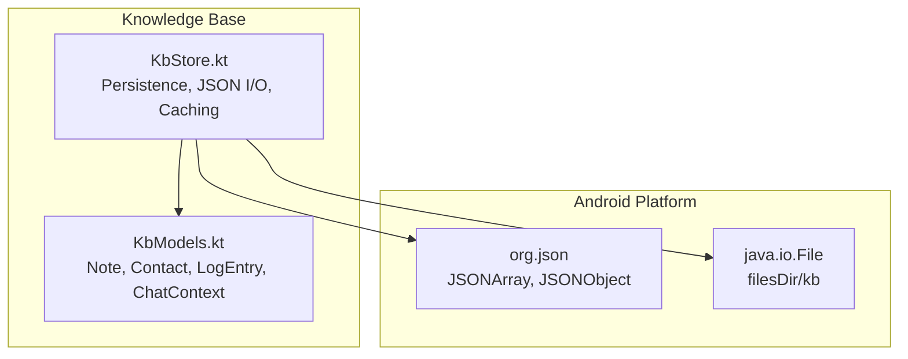
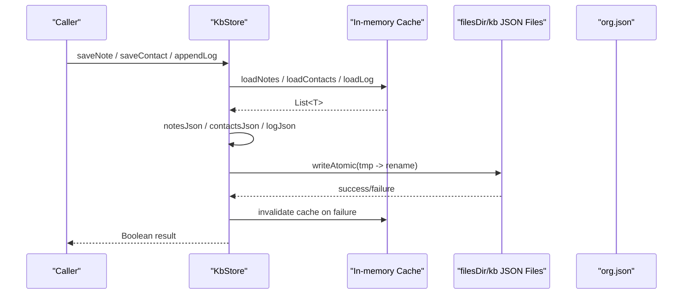
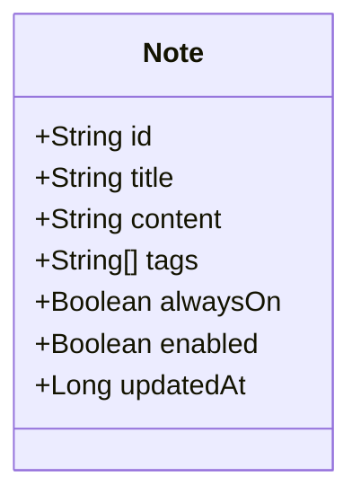
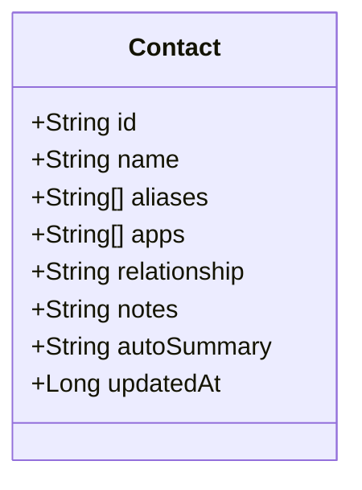
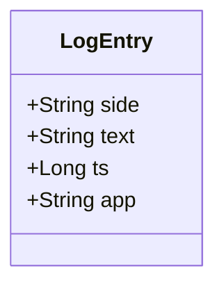
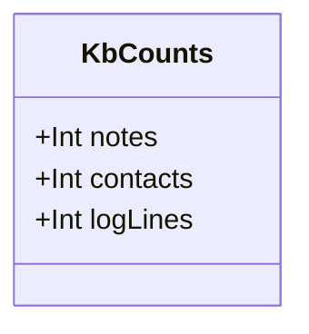
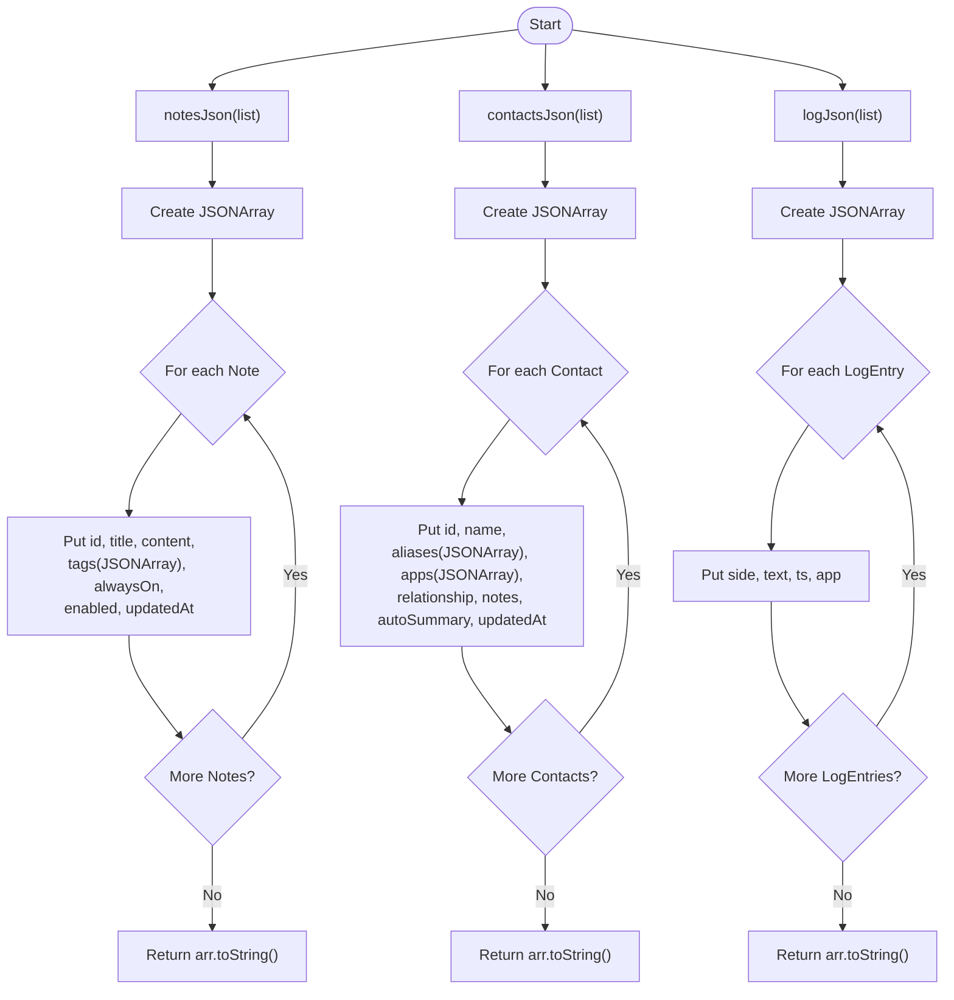
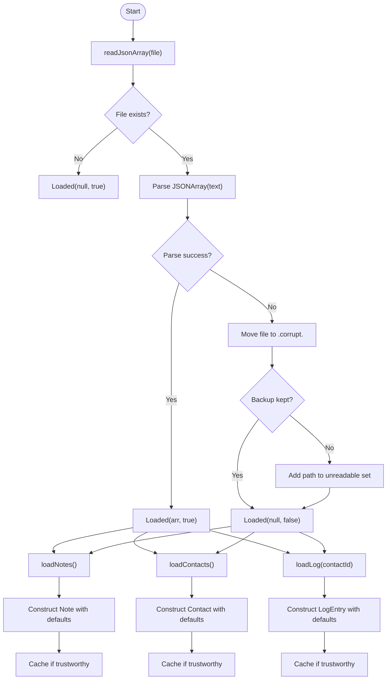
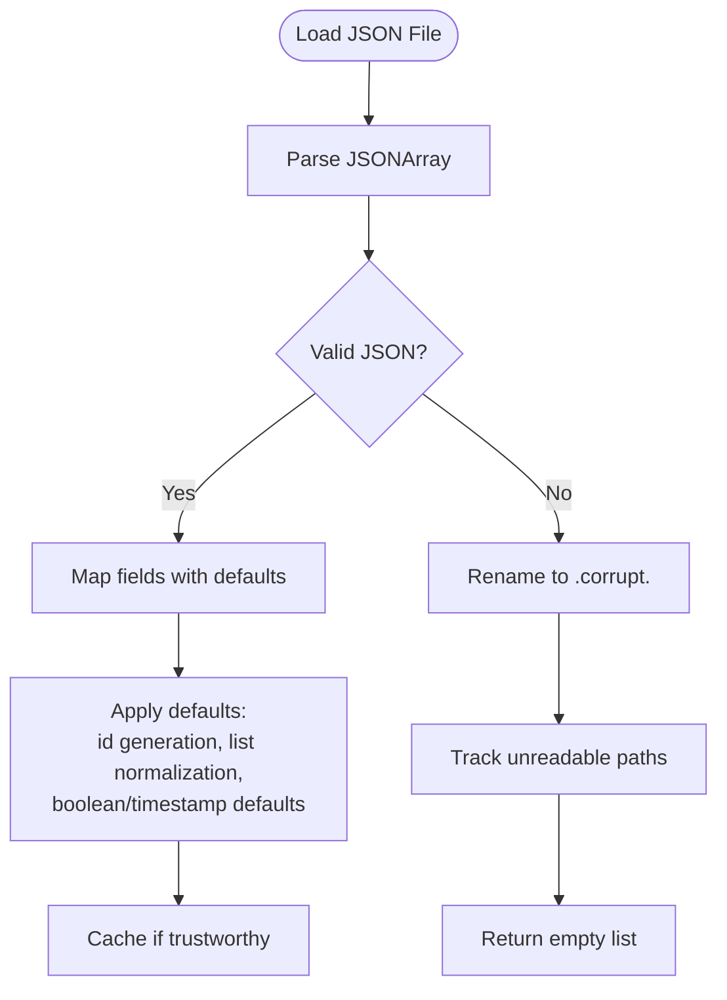
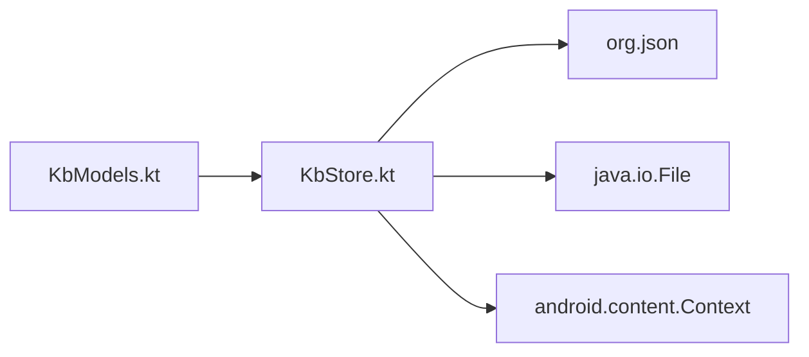

# Data Models and Serialization

<cite>
**Referenced Files in This Document**
- [KbModels.kt](file://app/src/main/java/com/jev/probe/core/kb/KbModels.kt)
- [KbStore.kt](file://app/src/main/java/com/jev/probe/core/kb/KbStore.kt)
</cite>

## Table of Contents
1. [Introduction](#introduction)
2. [Project Structure](#project-structure)
3. [Core Components](#core-components)
4. [Architecture Overview](#architecture-overview)
5. [Detailed Component Analysis](#detailed-component-analysis)
6. [Dependency Analysis](#dependency-analysis)
7. [Performance Considerations](#performance-considerations)
8. [Troubleshooting Guide](#troubleshooting-guide)
9. [Conclusion](#conclusion)

## Introduction
This document explains the data models and JSON serialization used by the local knowledge-base storage engine. It focuses on four core data classes: Note, Contact, LogEntry, and KbCounts. It also documents how these objects are serialized to and deserialized from plain JSON files using the Android platform library org.json, without any external JSON libraries. The goal is to make the schema, validation rules, default values, and backward compatibility behavior clear for both developers and maintainers.

## Project Structure
The storage engine lives under the knowledge-base package and consists of two main files:
- KbModels.kt defines the domain data classes for notes, contacts, chat log entries, and a helper context model.
- KbStore.kt implements persistence, caching, atomic file writes, hand-written JSON serialization, and deserialization.

**Diagram sources**
- [KbModels.kt:1-86](file://app/src/main/java/com/jev/probe/core/kb/KbModels.kt#L1-L86)
- [KbStore.kt:1-540](file://app/src/main/java/com/jev/probe/core/kb/KbStore.kt#L1-L540)

**Section sources**
- [KbModels.kt:1-86](file://app/src/main/java/com/jev/probe/core/kb/KbModels.kt#L1-L86)
- [KbStore.kt:1-540](file://app/src/main/java/com/jev/probe/core/kb/KbStore.kt#L1-L540)

## Core Components
This section summarizes the primary data types and their responsibilities.

- Note represents a user-maintained knowledge note with fields for identity, title, content, tags, injection behavior, enabled state, and update timestamp.
- Contact represents a person or group, including aliases, observed app packages, relationship metadata, free-form notes, reserved auto-summary text, and update timestamp.
- LogEntry represents one remembered chat line, including sender side, message text, timestamp, and originating app.
- KbCounts is a lightweight value object that reports counts of notes, contacts, and total log lines for UI display.

These models are persisted as arrays of JSON objects in plain files under the app-private kb directory.

**Section sources**
- [KbModels.kt:11-42](file://app/src/main/java/com/jev/probe/core/kb/KbModels.kt#L11-L42)
- [KbStore.kt:9-10](file://app/src/main/java/com/jev/probe/core/kb/KbStore.kt#L9-L10)

## Architecture Overview
The storage engine uses a single-threaded writer pattern protected by a lock. All reads and writes go through synchronized methods. Data is cached in memory to avoid repeated disk access. Writes use an atomic temp-file-plus-rename strategy so a crash cannot leave half-written JSON. Deserialization is defensive: missing or malformed files are preserved as backups rather than silently overwritten.

**Diagram sources**
- [KbStore.kt:44-96](file://app/src/main/java/com/jev/probe/core/kb/KbStore.kt#L44-L96)
- [KbStore.kt:172-220](file://app/src/main/java/com/jev/probe/core/kb/KbStore.kt#L172-L220)
- [KbStore.kt:358-399](file://app/src/main/java/com/jev/probe/core/kb/KbStore.kt#L358-L399)
- [KbStore.kt:438-459](file://app/src/main/java/com/jev/probe/core/kb/KbStore.kt#L438-L459)

## Detailed Component Analysis

### Data Model Definitions

#### Note
Note is a Kotlin data class representing a single knowledge note. Its fields include:
- id: unique identifier string.
- title: human-readable note title.
- content: free-text note body.
- tags: list of tag strings; defaults to empty list.
- alwaysOn: boolean indicating whether the note should be injected regardless of conversation topic; defaults to false.
- enabled: boolean controlling whether the note is active; defaults to true.
- updatedAt: timestamp when the note was last updated; defaults to current time at construction.

Validation and defaults:
- Tags default to an empty list if not provided.
- alwaysOn defaults to false.
- enabled defaults to true.
- updatedAt defaults to current system time at creation.

Serialization mapping:
- id, title, content, alwaysOn, enabled, updatedAt map directly to JSON fields.
- tags maps to a JSON array of strings.

Deserialization mapping:
- id falls back to a generated ID if missing or blank.
- title and content are read as strings.
- tags is parsed via a helper that filters out empty strings.
- alwaysOn and enabled use explicit defaults.
- updatedAt uses a zero fallback when absent.

**Diagram sources**
- [KbModels.kt:11-21](file://app/src/main/java/com/jev/probe/core/kb/KbModels.kt#L11-L21)

**Section sources**
- [KbModels.kt:11-21](file://app/src/main/java/com/jev/probe/core/kb/KbModels.kt#L11-L21)
- [KbStore.kt:294-314](file://app/src/main/java/com/jev/probe/core/kb/KbStore.kt#L294-L314)
- [KbStore.kt:358-371](file://app/src/main/java/com/jev/probe/core/kb/KbStore.kt#L358-L371)

#### Contact
Contact represents a person or group with cross-app aliasing and optional metadata:
- id: unique identifier string.
- name: canonical contact name.
- aliases: list of alternative names; defaults to empty list.
- apps: list of observed app package names; defaults to empty list.
- relationship: short relationship description; defaults to empty string.
- notes: free-form notes about the contact; defaults to empty string.
- autoSummary: reserved field for future auto-summary; defaults to empty string.
- updatedAt: timestamp when the contact was last updated; defaults to current time at construction.

Validation and defaults:
- aliases, apps default to empty lists.
- relationship, notes, autoSummary default to empty strings.
- updatedAt defaults to current system time at creation.

Serialization mapping:
- id, name, relationship, notes, autoSummary, updatedAt map directly to JSON fields.
- aliases and apps map to JSON arrays of strings.

Deserialization mapping:
- id falls back to a generated ID if missing or blank.
- name, relationship, notes, autoSummary are read as strings.
- aliases and apps are parsed via a helper that filters out empty strings.
- updatedAt uses a zero fallback when absent.

**Diagram sources**
- [KbModels.kt:23-39](file://app/src/main/java/com/jev/probe/core/kb/KbModels.kt#L23-L39)

**Section sources**
- [KbModels.kt:23-39](file://app/src/main/java/com/jev/probe/core/kb/KbModels.kt#L23-L39)
- [KbStore.kt:316-337](file://app/src/main/java/com/jev/probe/core/kb/KbStore.kt#L316-L337)
- [KbStore.kt:373-387](file://app/src/main/java/com/jev/probe/core/kb/KbStore.kt#L373-L387)

#### LogEntry
LogEntry represents one remembered chat line:
- side: sender side, typically "me" or "other".
- text: message text.
- ts: timestamp.
- app: originating app package name.

Validation and defaults:
- side defaults to "other" during deserialization if missing.
- text and app are read as strings.
- ts defaults to zero when absent.

Serialization mapping:
- side, text, ts, app map directly to JSON fields.

**Diagram sources**
- [KbModels.kt:41-42](file://app/src/main/java/com/jev/probe/core/kb/KbModels.kt#L41-L42)

**Section sources**
- [KbModels.kt:41-42](file://app/src/main/java/com/jev/probe/core/kb/KbModels.kt#L41-L42)
- [KbStore.kt:339-356](file://app/src/main/java/com/jev/probe/core/kb/KbStore.kt#L339-L356)
- [KbStore.kt:389-399](file://app/src/main/java/com/jev/probe/core/kb/KbStore.kt#L389-L399)

#### KbCounts
KbCounts is a simple value object used by the settings screen:
- notes: number of notes.
- contacts: number of contacts.
- logLines: total number of log lines across all contacts.

It is constructed after loading notes, contacts, and per-contact logs.

**Diagram sources**
- [KbStore.kt:9-10](file://app/src/main/java/com/jev/probe/core/kb/KbStore.kt#L9-L10)

**Section sources**
- [KbStore.kt:271-276](file://app/src/main/java/com/jev/probe/core/kb/KbStore.kt#L271-L276)

### Hand-written JSON Serialization
All serialization is implemented manually using org.json.JSONArray and org.json.JSONObject. There are no Gson or Moshi dependencies.

- notesJson converts a list of Note objects into a JSON array string. Each Note becomes a JSON object with fields id, title, content, tags (as a nested JSONArray), alwaysOn, enabled, and updatedAt.
- contactsJson converts a list of Contact objects into a JSON array string. Each Contact becomes a JSON object with fields id, name, aliases (as a nested JSONArray), apps (as a nested JSONArray), relationship, notes, autoSummary, and updatedAt.
- logJson converts a list of LogEntry objects into a JSON array string. Each LogEntry becomes a JSON object with fields side, text, ts, and app.

These methods are called before writing to disk via writeAtomic.

**Diagram sources**
- [KbStore.kt:358-399](file://app/src/main/java/com/jev/probe/core/kb/KbStore.kt#L358-L399)

**Section sources**
- [KbStore.kt:358-399](file://app/src/main/java/com/jev/probe/core/kb/KbStore.kt#L358-L399)

### Deserialization Logic
Deserialization is performed by three private methods:

- loadNotes reads notes.json, parses it as a JSON array, and constructs Note objects. Missing or blank ids are replaced with newly generated IDs. Tags are normalized by trimming and filtering empty strings. Defaults are applied for alwaysOn, enabled, and updatedAt.
- loadContacts reads contacts.json, parses it as a JSON array, and constructs Contact objects. Missing or blank ids are replaced with newly generated IDs. aliases and apps are normalized similarly. Relationship, notes, and autoSummary are read as strings. updatedAt defaults to zero when absent.
- loadLog reads per-contact logs/<contactId>.json, parses it as a JSON array, and constructs LogEntry objects. side defaults to "other", ts defaults to zero, and app is read as a string.

All three methods use a shared readJsonArray helper that returns a Loaded wrapper indicating whether the parsed array is trustworthy. If parsing fails, the damaged file is moved aside with a corrupt suffix, and the method returns an empty list without caching it.

**Diagram sources**
- [KbStore.kt:294-356](file://app/src/main/java/com/jev/probe/core/kb/KbStore.kt#L294-L356)
- [KbStore.kt:412-428](file://app/src/main/java/com/jev/probe/core/kb/KbStore.kt#L412-L428)

**Section sources**
- [KbStore.kt:294-356](file://app/src/main/java/com/jev/probe/core/kb/KbStore.kt#L294-L356)
- [KbStore.kt:412-428](file://app/src/main/java/com/jev/probe/core/kb/KbStore.kt#L412-L428)

### Data Validation, Default Values, and Backward Compatibility

#### Validation Rules
- Ids: When deserializing Note or Contact, if the id field is missing or blank, a new UUID-based id is generated.
- Lists: Tags, aliases, and apps are parsed via a helper that trims each element and filters out empty strings. A null or missing JSON array results in an empty list.
- Strings: Relationship, notes, autoSummary, text, and app are read as strings; missing values become empty strings.
- Booleans: alwaysOn defaults to false; enabled defaults to true.
- Timestamps: updatedAt defaults to zero when absent during deserialization; createdAt-like defaults apply at construction time.
- LogEntry side: defaults to "other" when absent.

#### Default Values
- Note.tags = emptyList(), alwaysOn = false, enabled = true, updatedAt = current time.
- Contact.aliases = emptyList(), apps = emptyList(), relationship = "", notes = "", autoSummary = "", updatedAt = current time.
- LogEntry defaults are applied during deserialization: side = "other", ts = 0.

#### Backward Compatibility
- Optional fields: Many fields have defaults, allowing older JSON files missing those fields to load safely.
- Corrupted files: If a JSON file cannot be parsed, it is renamed to a dated corrupt backup and not overwritten. Subsequent saves will create a fresh file while preserving the damaged original.
- Unreadable tracking: Paths of files that failed to parse and could not be backed up are tracked so future writes refuse to overwrite them.
- Schema evolution: New fields can be added with sensible defaults in deserialization. Existing callers remain compatible because missing fields fall back to safe defaults.

**Diagram sources**
- [KbStore.kt:294-356](file://app/src/main/java/com/jev/probe/core/kb/KbStore.kt#L294-L356)
- [KbStore.kt:412-428](file://app/src/main/java/com/jev/probe/core/kb/KbStore.kt#L412-L428)

**Section sources**
- [KbStore.kt:294-356](file://app/src/main/java/com/jev/probe/core/kb/KbStore.kt#L294-L356)
- [KbStore.kt:412-428](file://app/src/main/java/com/jev/probe/core/kb/KbStore.kt#L412-L428)

## Dependency Analysis
The storage engine depends on:
- org.json for building and parsing JSON structures.
- java.io.File for reading and writing files under the app-private kb directory.
- Android Context for accessing filesDir.

There are no external JSON libraries. The design keeps coupling minimal: data models are separate from persistence logic, and persistence logic encapsulates all JSON handling.

**Diagram sources**
- [KbModels.kt:1-86](file://app/src/main/java/com/jev/probe/core/kb/KbModels.kt#L1-L86)
- [KbStore.kt:1-540](file://app/src/main/java/com/jev/probe/core/kb/KbStore.kt#L1-L540)

**Section sources**
- [KbStore.kt:1-23](file://app/src/main/java/com/jev/probe/core/kb/KbStore.kt#L1-L23)
- [KbStore.kt:473-538](file://app/src/main/java/com/jev/probe/core/kb/KbStore.kt#L473-L538)

## Performance Considerations
- In-memory caching: Notes, contacts, and per-contact logs are cached to reduce disk I/O. Caches are invalidated when writes fail.
- Atomic writes: Temp file plus rename prevents partial writes and improves reliability.
- Log size limit: Per-contact logs are capped to a maximum number of entries to prevent unbounded growth.
- Defensive parsing: Corrupted files are preserved as backups to avoid silent data loss.

[No sources needed since this section provides general guidance]

## Troubleshooting Guide
Common issues and their handling:
- JSON parse errors: The reader moves damaged files to a corrupt backup and logs a warning. Future writes to that path are refused until the issue is resolved.
- Write failures: If renaming fails, the code attempts an in-place overwrite and logs a warning. Callers invalidate caches on failure.
- Missing fields: Deserialization applies defaults, so older or incomplete JSON remains usable.
- Duplicate screens: Append logic compares screen keys to avoid duplicating identical screens and only appends new tail segments.

Operational tips:
- Check kb/logs/<contactId>.json for per-contact history.
- Use counts() to inspect sizes of notes, contacts, and total log lines.
- Clear all data via clearAll() to remove the entire kb directory safely.

**Section sources**
- [KbStore.kt:172-220](file://app/src/main/java/com/jev/probe/core/kb/KbStore.kt#L172-L220)
- [KbStore.kt:271-290](file://app/src/main/java/com/jev/probe/core/kb/KbStore.kt#L271-L290)
- [KbStore.kt:412-459](file://app/src/main/java/com/jev/probe/core/kb/KbStore.kt#L412-L459)

## Conclusion
The knowledge-base storage engine defines clear data models for notes, contacts, and chat logs, and persists them as plain JSON using org.json. Serialization is hand-written and tightly coupled to the model fields. Deserialization is robust, applying defaults and normalizing lists to ensure backward compatibility and resilience against corrupted data. Atomic writes and in-memory caching provide reliability and performance. This design makes the schema easy to evolve while protecting user data.

[No sources needed since this section summarizes without analyzing specific files]