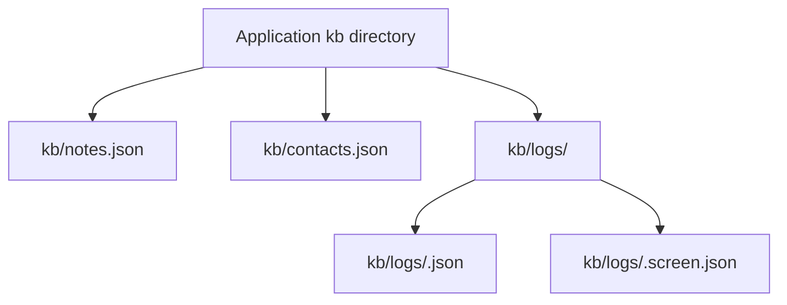
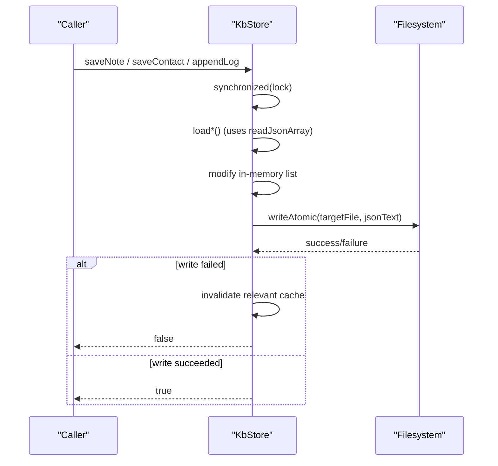
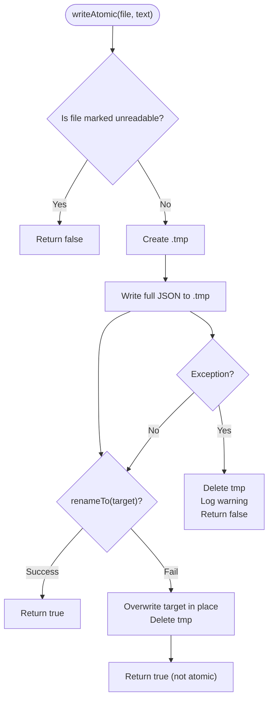
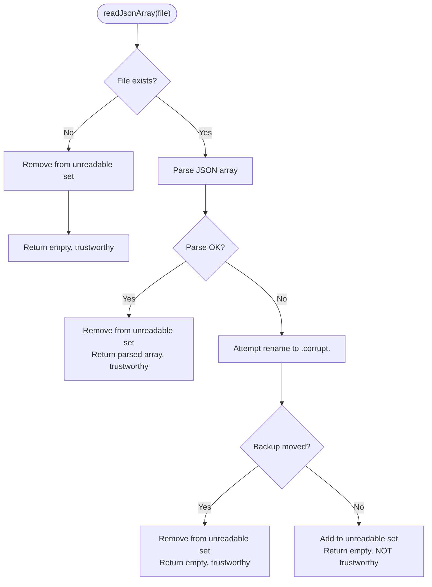
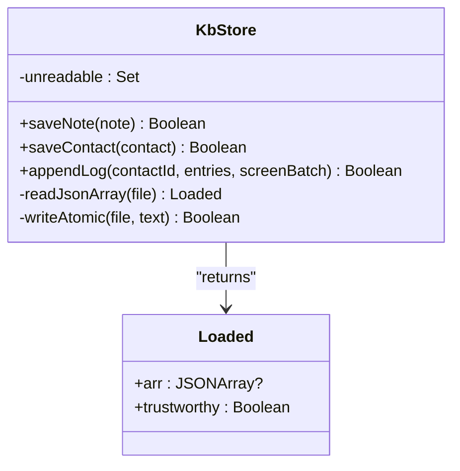
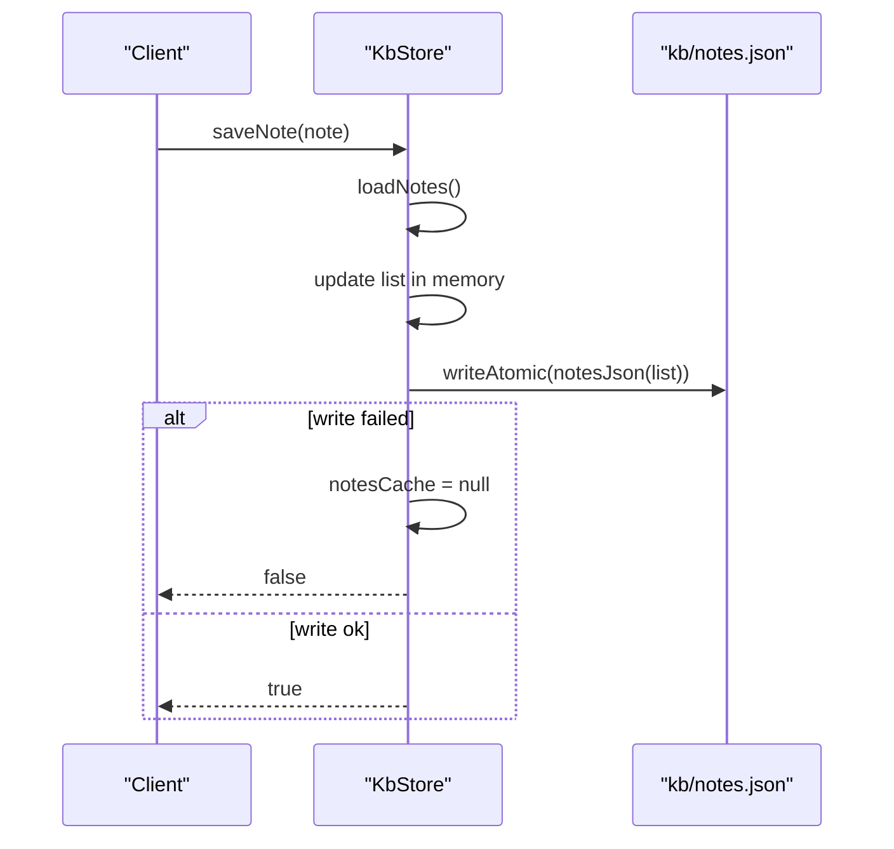
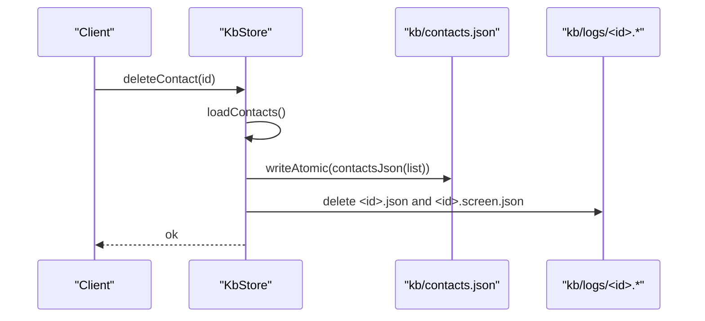
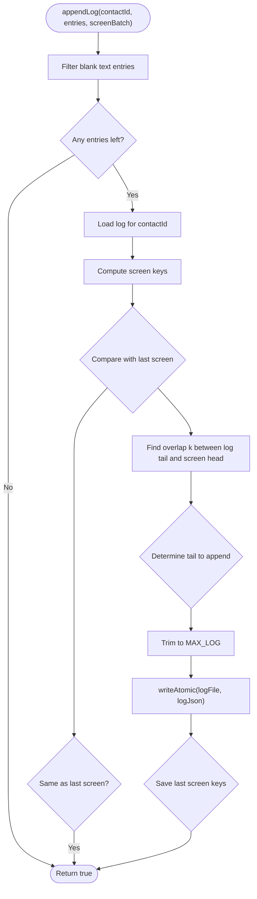
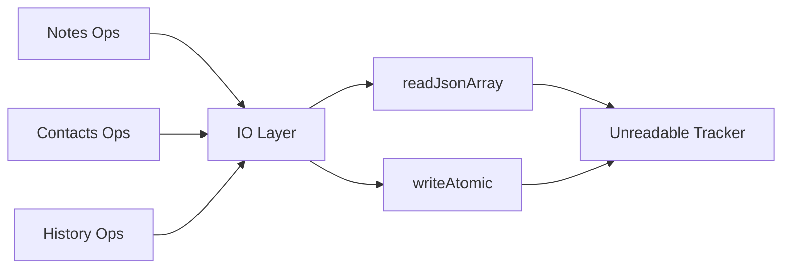

# File I/O Operations

<cite>
**Referenced Files in This Document**
- [KbStore.kt](file://app/src/main/java/com/jev/probe/core/kb/KbStore.kt)
</cite>

## Table of Contents
1. [Introduction](#introduction)
2. [Project Structure](#project-structure)
3. [Core Components](#core-components)
4. [Architecture Overview](#architecture-overview)
5. [Detailed Component Analysis](#detailed-component-analysis)
6. [Dependency Analysis](#dependency-analysis)
7. [Performance Considerations](#performance-considerations)
8. [Troubleshooting Guide](#troubleshooting-guide)
9. [Conclusion](#conclusion)

## Introduction
This document explains the file I/O operations used by the storage engine for notes, contacts, and per-contact chat history. It focuses on:
- The atomic write mechanism that uses temporary files and rename semantics to avoid partial writes after crashes.
- The file layout under `kb/`, including `notes.json`, `contacts.json`, and per-contact log files under `kb/logs/`.
- Error handling for corrupted JSON files during reads, including automatic backup creation with `.corrupt.<timestamp>` names.
- Fallback behavior when rename fails during writes, and the unreadable-file tracking system that prevents overwriting damaged data.
- Practical examples of file operations, error scenarios, and recovery procedures.

## Project Structure
The knowledge-base store manages three kinds of JSON files under a single application directory:
- `kb/notes.json` — all notes.
- `kb/contacts.json` — all contacts.
- `kb/logs/<contactId>.json` — per-contact chat history.
- `kb/logs/<contactId>.screen.json` — last screen comparison keys for deduplication.

**Diagram sources**
- [KbStore.kt:12-33](file://app/src/main/java/com/jev/probe/core/kb/KbStore.kt#L12-L33)

**Section sources**
- [KbStore.kt:12-33](file://app/src/main/java/com/jev/probe/core/kb/KbStore.kt#L12-L33)

## Core Components
- KbStore is the single writer and reader for all knowledge-base files. All public methods are synchronized to ensure one operation at a time.
- Data models include notes, contacts, and log entries. Each read path deserializes from JSON arrays into these models.
- Caches exist for notes, contacts, per-contact logs, and last-screen keys. Caches are invalidated when persistence fails so subsequent reads reload from disk.

Key responsibilities:
- Notes: load, save, delete.
- Contacts: load, save, delete, find or merge by normalized name.
- History: append with deduplication logic, recent retrieval, size, clear.
- Persistence: atomic writes via temp file + rename; robust read with corruption handling.

**Section sources**
- [KbStore.kt:24-40](file://app/src/main/java/com/jev/probe/core/kb/KbStore.kt#L24-L40)
- [KbStore.kt:44-96](file://app/src/main/java/com/jev/probe/core/kb/KbStore.kt#L44-L96)
- [KbStore.kt:106-145](file://app/src/main/java/com/jev/probe/core/kb/KbStore.kt#L106-L145)
- [KbStore.kt:172-241](file://app/src/main/java/com/jev/probe/core/kb/KbStore.kt#L172-L241)

## Architecture Overview
At a high level, every operation follows this pattern:
1. Acquire the internal lock.
2. Load current state from memory cache if available; otherwise read from disk using `readJsonArray`.
3. Modify in-memory structures.
4. Persist changes using `writeAtomic`.
5. Invalidate caches on failure to force re-read next time.

**Diagram sources**
- [KbStore.kt:44-96](file://app/src/main/java/com/jev/probe/core/kb/KbStore.kt#L44-L96)
- [KbStore.kt:172-241](file://app/src/main/java/com/jev/probe/core/kb/KbStore.kt#L172-L241)
- [KbStore.kt:412-459](file://app/src/main/java/com/jev/probe/core/kb/KbStore.kt#L412-L459)

## Detailed Component Analysis

### Atomic Write Mechanism: Temp Files and Rename Semantics
The atomic write strategy ensures that a crash during writing cannot leave a partially written JSON document.

- A temporary file `<target>.tmp` is created in the same directory as the target.
- The complete JSON text is written to the temp file.
- If `renameTo` succeeds, it atomically replaces the target file.
- If rename fails, the implementation falls back to an in-place overwrite of the target file and deletes the temp file. This fallback is not atomic but is the only remaining option.
- On any exception, the temp file is cleaned up and the operation returns failure.

**Diagram sources**
- [KbStore.kt:438-459](file://app/src/main/java/com/jev/probe/core/kb/KbStore.kt#L438-L459)

Important behaviors:
- Unreadable files are never overwritten.
- Successful rename provides POSIX-like atomic replacement within the same directory.
- Fallback overwrite is logged and considered non-atomic.

**Section sources**
- [KbStore.kt:438-459](file://app/src/main/java/com/jev/probe/core/kb/KbStore.kt#L438-L459)

### Read Path and Corruption Handling
Reading JSON arrays is resilient to corruption:
- If the file does not exist, return an empty result without marking it unreadable.
- If parsing fails, attempt to move the original file to a backup named `<original>.corrupt.<timestamp>`.
- If the backup move succeeds, remove the file from the unreadable set and treat the read as trustworthy but empty.
- If the backup move fails, add the file to the unreadable set and mark the read as untrustworthy. Callers must not cache or overwrite such files.

**Diagram sources**
- [KbStore.kt:412-428](file://app/src/main/java/com/jev/probe/core/kb/KbStore.kt#L412-L428)

Corruption naming convention:
- Backup files use the pattern `<original_name>.corrupt.<epoch_millis>`.

**Section sources**
- [KbStore.kt:412-428](file://app/src/main/java/com/jev/probe/core/kb/KbStore.kt#L412-L428)

### Unreadable File Tracking System
- A thread-safe set tracks absolute paths of files that could not be parsed and could not be preserved as backups.
- Any attempt to write to an unreadable file is rejected early with a warning.
- When a corrupt file is successfully backed up, it is removed from the unreadable set, allowing future writes.

**Diagram sources**
- [KbStore.kt:409-428](file://app/src/main/java/com/jev/probe/core/kb/KbStore.kt#L409-L428)
- [KbStore.kt:438-459](file://app/src/main/java/com/jev/probe/core/kb/KbStore.kt#L438-L459)

**Section sources**
- [KbStore.kt:409-428](file://app/src/main/java/com/jev/probe/core/kb/KbStore.kt#L409-L428)
- [KbStore.kt:438-459](file://app/src/main/java/com/jev/probe/core/kb/KbStore.kt#L438-L459)

### Notes File Operations
- `notes()` and `note(id)` load from cache or disk.
- `saveNote(note)` inserts or updates by id, stamps updatedAt, persists via `writeAtomic`, and invalidates cache on failure.
- `deleteNote(id)` removes by id and persists via `writeAtomic`, invalidating cache on failure.

**Diagram sources**
- [KbStore.kt:44-65](file://app/src/main/java/com/jev/probe/core/kb/KbStore.kt#L44-L65)
- [KbStore.kt:294-314](file://app/src/main/java/com/jev/probe/core/kb/KbStore.kt#L294-L314)
- [KbStore.kt:358-371](file://app/src/main/java/com/jev/probe/core/kb/KbStore.kt#L358-L371)
- [KbStore.kt:438-459](file://app/src/main/java/com/jev/probe/core/kb/KbStore.kt#L438-L459)

**Section sources**
- [KbStore.kt:44-65](file://app/src/main/java/com/jev/probe/core/kb/KbStore.kt#L44-L65)
- [KbStore.kt:294-314](file://app/src/main/java/com/jev/probe/core/kb/KbStore.kt#L294-L314)
- [KbStore.kt:358-371](file://app/src/main/java/com/jev/probe/core/kb/KbStore.kt#L358-L371)

### Contacts File Operations
- `contacts()` and `contact(id)` load from cache or disk.
- `saveContact(c)` inserts or updates by id, stamps updatedAt, persists via `writeAtomic`, and invalidates cache on failure.
- `deleteContact(id)` removes contact metadata and associated log/screen files, invalidates caches, and persists updated contacts list.

**Diagram sources**
- [KbStore.kt:69-96](file://app/src/main/java/com/jev/probe/core/kb/KbStore.kt#L69-L96)
- [KbStore.kt:316-337](file://app/src/main/java/com/jev/probe/core/kb/KbStore.kt#L316-L337)
- [KbStore.kt:373-387](file://app/src/main/java/com/jev/probe/core/kb/KbStore.kt#L373-L387)

**Section sources**
- [KbStore.kt:69-96](file://app/src/main/java/com/jev/probe/core/kb/KbStore.kt#L69-L96)
- [KbStore.kt:316-337](file://app/src/main/java/com/jev/probe/core/kb/KbStore.kt#L316-L337)
- [KbStore.kt:373-387](file://app/src/main/java/com/jev/probe/core/kb/KbStore.kt#L373-L387)

### Per-Contact History Files and Deduplication
History is stored per contact under `kb/logs/<contactId>.json`. Appending supports batched screen captures with deduplication rules:
- If the new screen equals the last written screen, skip.
- If the log is empty, write all.
- If the log tail matches the first k lines of the new screen, append only the new tail.
- If there is no overlap with the previous screen, assume scrolling off old messages and skip.
- Otherwise, append all.

After appending, the log is trimmed to a maximum size, persisted atomically, and the last screen keys are saved.

**Diagram sources**
- [KbStore.kt:172-241](file://app/src/main/java/com/jev/probe/core/kb/KbStore.kt#L172-L241)
- [KbStore.kt:248-267](file://app/src/main/java/com/jev/probe/core/kb/KbStore.kt#L248-L267)
- [KbStore.kt:339-356](file://app/src/main/java/com/jev/probe/core/kb/KbStore.kt#L339-L356)
- [KbStore.kt:389-399](file://app/src/main/java/com/jev/probe/core/kb/KbStore.kt#L389-L399)

**Section sources**
- [KbStore.kt:172-241](file://app/src/main/java/com/jev/probe/core/kb/KbStore.kt#L172-L241)
- [KbStore.kt:248-267](file://app/src/main/java/com/jev/probe/core/kb/KbStore.kt#L248-L267)
- [KbStore.kt:339-356](file://app/src/main/java/com/jev/probe/core/kb/KbStore.kt#L339-L356)
- [KbStore.kt:389-399](file://app/src/main/java/com/jev/probe/core/kb/KbStore.kt#L389-L399)

### Example Scenarios and Recovery Procedures

#### Scenario 1: Normal Save Flow
- Operation: Save a note.
- Steps: Load notes, update list, persist via `writeAtomic`, invalidate cache on failure.
- Outcome: `kb/notes.json` contains the updated list.

**Section sources**
- [KbStore.kt:44-65](file://app/src/main/java/com/jev/probe/core/kb/KbStore.kt#L44-L65)
- [KbStore.kt:294-314](file://app/src/main/java/com/jev/probe/core/kb/KbStore.kt#L294-L314)
- [KbStore.kt:438-459](file://app/src/main/java/com/jev/probe/core/kb/KbStore.kt#L438-L459)

#### Scenario 2: Corrupted Notes File
- Condition: `kb/notes.json` cannot be parsed.
- Behavior: Attempt to move to `kb/notes.json.corrupt.<timestamp>`. If successful, treat as empty and trustworthy; if not, mark unreadable and do not cache.
- Recovery: Restore or repair the `.corrupt.*` file manually, then retry operations. Future writes will succeed once the file is readable again.

**Section sources**
- [KbStore.kt:412-428](file://app/src/main/java/com/jev/probe/core/kb/KbStore.kt#L412-L428)

#### Scenario 3: Rename Fails During Write
- Condition: `writeAtomic` cannot rename temp file to target.
- Behavior: Log a warning and fall back to in-place overwrite. The operation returns success even though it is not atomic.
- Risk: A crash during in-place overwrite may produce partial data. Ensure filesystem reliability and consider external backups.

**Section sources**
- [KbStore.kt:438-459](file://app/src/main/java/com/jev/probe/core/kb/KbStore.kt#L438-L459)

#### Scenario 4: Append Log with Deduplication
- Condition: User scrolls through conversation screens.
- Behavior: Compare new screen with last written screen; compute overlap; append only new tail; trim to max size; persist atomically; update last screen keys.
- Outcome: Efficient history growth without duplicating unchanged content.

**Section sources**
- [KbStore.kt:172-241](file://app/src/main/java/com/jev/probe/core/kb/KbStore.kt#L172-L241)
- [KbStore.kt:248-267](file://app/src/main/java/com/jev/probe/core/kb/KbStore.kt#L248-L267)

## Dependency Analysis
The following diagram shows how core components depend on each other for file I/O:

**Diagram sources**
- [KbStore.kt:44-96](file://app/src/main/java/com/jev/probe/core/kb/KbStore.kt#L44-L96)
- [KbStore.kt:172-241](file://app/src/main/java/com/jev/probe/core/kb/KbStore.kt#L172-L241)
- [KbStore.kt:412-459](file://app/src/main/java/com/jev/probe/core/kb/KbStore.kt#L412-L459)

**Section sources**
- [KbStore.kt:44-96](file://app/src/main/java/com/jev/probe/core/kb/KbStore.kt#L44-L96)
- [KbStore.kt:172-241](file://app/src/main/java/com/jev/probe/core/kb/KbStore.kt#L172-L241)
- [KbStore.kt:412-459](file://app/src/main/java/com/jev/probe/core/kb/KbStore.kt#L412-L459)

## Performance Considerations
- Single-writer design: All operations are synchronized, preventing concurrent modifications and simplifying consistency.
- Caching: In-memory caches reduce disk reads for frequently accessed data. Caches are invalidated on write failures to maintain correctness.
- History trimming: Logs are trimmed to a fixed maximum size to bound disk usage.
- Deduplication: Screen-based deduplication avoids redundant writes and reduces I/O overhead.
- Atomic writes: Prefer rename for durability; fallback overwrite is less safe but necessary on some systems.

[No sources needed since this section provides general guidance]

## Troubleshooting Guide
Common issues and resolutions:
- Corrupted JSON file detected:
  - Look for `.corrupt.<timestamp>` backups in the same directory.
  - Restore or repair the backup file, then retry operations.
  - If the file remains unreadable, it will be tracked in the unreadable set and protected from overwrite.
- Write failures:
  - Check filesystem permissions and available space.
  - If rename fails, expect a fallback in-place overwrite; verify the resulting file integrity.
- Cache inconsistencies:
  - After a failed write, caches are cleared automatically. Subsequent reads will reload from disk.

Operational checks:
- Verify presence and structure of `kb/notes.json`, `kb/contacts.json`, and `kb/logs/<contactId>.json`.
- Inspect `.corrupt.*` files for evidence of prior corruption events.
- Monitor logs for warnings about unreadable files and rename failures.

**Section sources**
- [KbStore.kt:412-428](file://app/src/main/java/com/jev/probe/core/kb/KbStore.kt#L412-L428)
- [KbStore.kt:438-459](file://app/src/main/java/com/jev/probe/core/kb/KbStore.kt#L438-L459)

## Conclusion
The storage engine’s file I/O layer emphasizes safety and resilience:
- Atomic writes via temp files and rename minimize corruption risk.
- Robust read handling preserves corrupted files as dated backups and prevents unsafe overwrites.
- A centralized synchronization model and caching strategy balance performance with correctness.
- Deduplication and trimming keep history manageable and efficient.

For reliable operation:
- Ensure filesystem stability and adequate permissions.
- Regularly inspect `.corrupt.*` backups and restore them as needed.
- Treat fallback overwrites as non-atomic and validate file integrity after such events.

[No sources needed since this section summarizes without analyzing specific files]