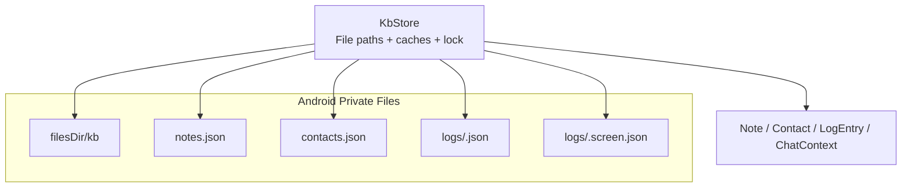
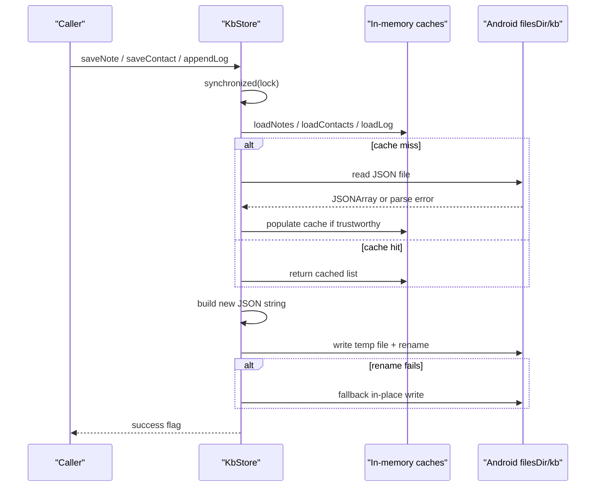
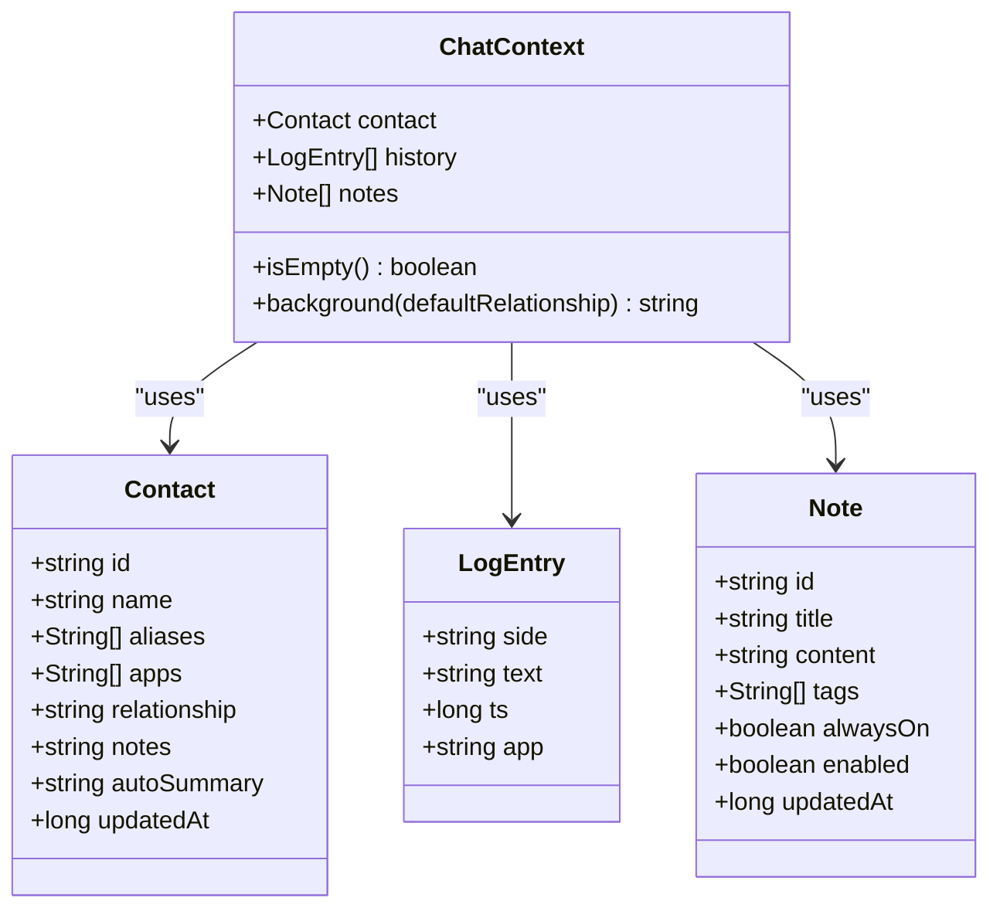
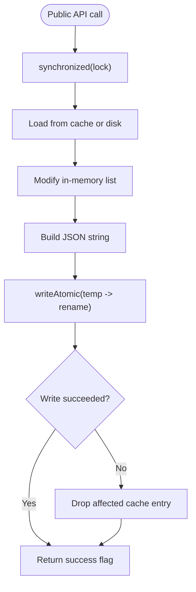
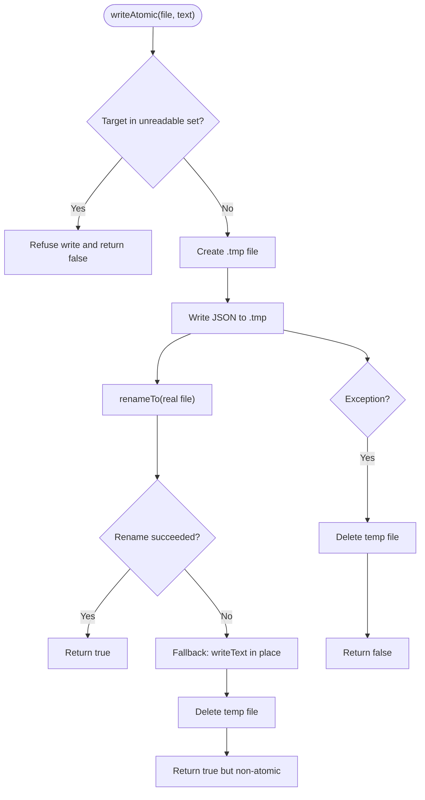
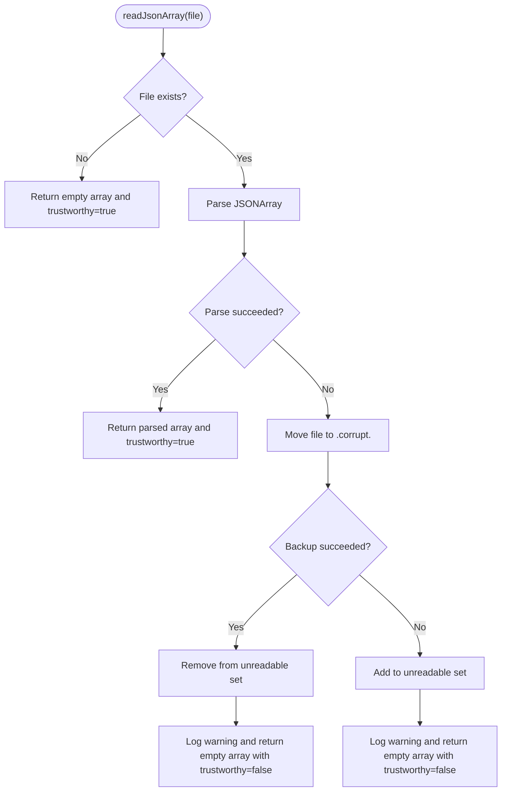
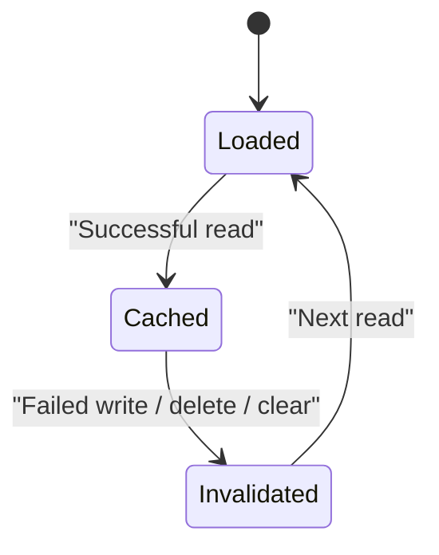
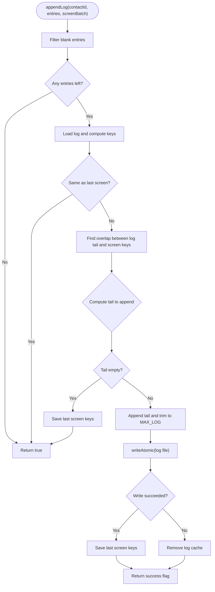
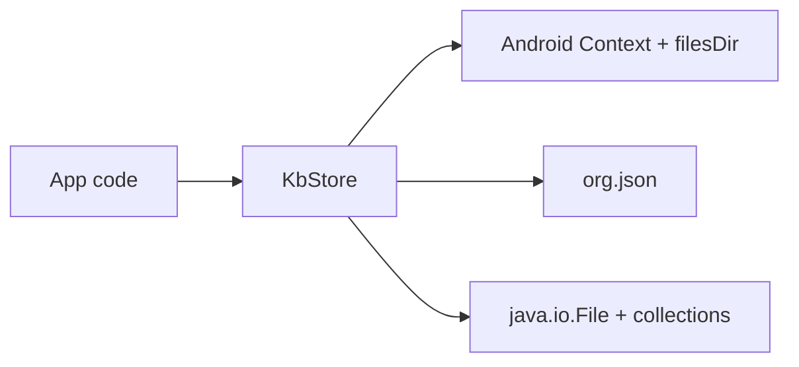

# Storage Engine and Persistence

<cite>
**Referenced Files in This Document**
- [KbStore.kt](file://app/src/main/java/com/jev/probe/core/kb/KbStore.kt)
- [KbModels.kt](file://app/src/main/java/com/jev/probe/core/kb/KbModels.kt)
</cite>

## Table of Contents
1. [Introduction](#introduction)
2. [Project Structure](#project-structure)
3. [Core Components](#core-components)
4. [Architecture Overview](#architecture-overview)
5. [Detailed Component Analysis](#detailed-component-analysis)
6. [Dependency Analysis](#dependency-analysis)
7. [Performance Considerations](#performance-considerations)
8. [Troubleshooting Guide](#troubleshooting-guide)
9. [Conclusion](#conclusion)

## Introduction
This document explains the storage engine used by the knowledge-base subsystem. It is a file-based JSON persistence layer that stores notes, contacts, and per-contact chat history under Android’s private application files directory. The design emphasizes data safety through atomic writes, thread safety through a single lock, efficient memory caching, and robust error handling for corrupted or unreadable files.

The implementation avoids heavyweight serialization libraries and instead uses Android’s built-in `org.json` types to read and write plain JSON documents.

## Project Structure
The storage engine lives under the knowledge-base package and consists of:

- A store class that owns all file paths, caches, locking, and I/O operations.
- Data model classes representing notes, contacts, log entries, and derived chat context.

**Diagram sources**
- [KbStore.kt:12-33](file://app/src/main/java/com/jev/probe/core/kb/KbStore.kt#L12-L33)
- [KbModels.kt:11-42](file://app/src/main/java/com/jev/probe/core/kb/KbModels.kt#L11-L42)

**Section sources**
- [KbStore.kt:12-33](file://app/src/main/java/com/jev/probe/core/kb/KbStore.kt#L12-L33)
- [KbModels.kt:1-42](file://app/src/main/java/com/jev/probe/core/kb/KbModels.kt#L1-L42)

## Core Components
The storage engine centers on one main component:

- **KbStore**: Encapsulates all persistence logic, including file layout, caching, synchronization, JSON parsing, atomic writing, and recovery behavior.
- **Data models**: Lightweight Kotlin data classes for notes, contacts, log entries, and a helper context object used when building conversation prompts.

Key responsibilities:

| Area | Responsibility |
| --- | --- |
| File layout | Notes, contacts, per-contact logs, and per-contact screen metadata live under `filesDir/kb`. |
| Thread safety | All public methods synchronize on a shared lock object. |
| Atomic writes | Writes go through a temporary file and rename; failures do not overwrite valid data. |
| Caching | In-memory lists for notes, contacts, and per-contact logs avoid repeated disk reads. |
| Error handling | Corrupted JSON files are moved aside with timestamps; unreadable files are protected from being overwritten. |
| Performance | Lazy loading, bounded log size, and direct `org.json` usage reduce overhead. |

**Section sources**
- [KbStore.kt:9-40](file://app/src/main/java/com/jev/probe/core/kb/KbStore.kt#L9-L40)
- [KbModels.kt:11-42](file://app/src/main/java/com/jev/probe/core/kb/KbModels.kt#L11-L42)

## Architecture Overview
At runtime, callers interact only with `KbStore`. The store translates high-level operations into file operations while keeping memory caches consistent.

**Diagram sources**
- [KbStore.kt:44-95](file://app/src/main/java/com/jev/probe/core/kb/KbStore.kt#L44-L95)
- [KbStore.kt:172-241](file://app/src/main/java/com/jev/probe/core/kb/KbStore.kt#L172-L241)
- [KbStore.kt:294-356](file://app/src/main/java/com/jev/probe/core/kb/KbStore.kt#L294-L356)
- [KbStore.kt:412-459](file://app/src/main/java/com/jev/probe/core/kb/KbStore.kt#L412-L459)

## Detailed Component Analysis

### File Layout and Paths
The store defines a fixed layout under Android’s private application directory:

| Path | Purpose |
| --- | --- |
| `filesDir/kb/notes.json` | Array of note records. |
| `filesDir/kb/contacts.json` | Array of contact records. |
| `filesDir/kb/logs/<contactId>.json` | Per-contact chat history, capped at a maximum number of lines. |
| `filesDir/kb/logs/<contactId>.screen.json` | Comparison keys for the last captured screen, used to avoid duplicate appends. |

The root path is derived from `context.applicationContext.filesDir`, ensuring the data remains private to the app.

**Section sources**
- [KbStore.kt:12-33](file://app/src/main/java/com/jev/probe/core/kb/KbStore.kt#L12-L33)

### Data Models
The models describe what is persisted:

- **Note**: Free-text knowledge note with identifier, title, content, tags, visibility flags, and update timestamp.
- **Contact**: Person or group with identifier, display name, aliases, associated apps, relationship text, notes, reserved auto-summary field, and update timestamp.
- **LogEntry**: One remembered chat line with side, text, timestamp, and originating app.
- **ChatContext**: Derived view combining contact, history, and matched notes; includes helpers for building background context strings.

These models are serialized directly into `org.json` structures without an intermediate ORM or external serializer.

**Diagram sources**
- [KbModels.kt:11-85](file://app/src/main/java/com/jev/probe/core/kb/KbModels.kt#L11-L85)

**Section sources**
- [KbModels.kt:11-85](file://app/src/main/java/com/jev/probe/core/kb/KbModels.kt#L11-L85)

### Thread Safety
All public mutation and read methods synchronize on a single shared lock object. This guarantees:

- Only one thread modifies or reads the in-memory caches at a time.
- Only one thread performs file I/O at a time.
- Cache invalidation and disk writes stay consistent.

The singleton instance itself is also guarded by a separate lock during initialization.

**Diagram sources**
- [KbStore.kt:24-40](file://app/src/main/java/com/jev/probe/core/kb/KbStore.kt#L24-L40)
- [KbStore.kt:44-95](file://app/src/main/java/com/jev/probe/core/kb/KbStore.kt#L44-L95)
- [KbStore.kt:477-482](file://app/src/main/java/com/jev/probe/core/kb/KbStore.kt#L477-L482)

**Section sources**
- [KbStore.kt:24-40](file://app/src/main/java/com/jev/probe/core/kb/KbStore.kt#L24-L40)
- [KbStore.kt:44-95](file://app/src/main/java/com/jev/probe/core/kb/KbStore.kt#L44-L95)
- [KbStore.kt:477-482](file://app/src/main/java/com/jev/probe/core/kb/KbStore.kt#L477-L482)

### Atomic Write Semantics
Every persistent write goes through an atomic write helper:

1. If the target file is marked unreadable, the write is refused.
2. A `.tmp` file is created in the same directory.
3. The full JSON string is written to the temp file.
4. The temp file is renamed to the real file.
5. If rename fails, it falls back to an in-place write and returns a non-atomic result.
6. On exception, the temp file is cleaned up and failure is reported.

This prevents half-written JSON documents from becoming the active file after a crash or process kill.

**Diagram sources**
- [KbStore.kt:430-459](file://app/src/main/java/com/jev/probe/core/kb/KbStore.kt#L430-L459)

**Section sources**
- [KbStore.kt:430-459](file://app/src/main/java/com/jev/probe/core/kb/KbStore.kt#L430-L459)

### Corrupted File Recovery
When a JSON file cannot be parsed:

1. The store attempts to move the damaged file to a backup named with a timestamp suffix.
2. If the backup succeeds, the original path is removed from the unreadable set and the current operation continues with an empty list.
3. If the backup fails, the path is added to an in-process unreadable set so future writes refuse to overwrite it.
4. The store logs a warning describing the failure and whether preservation succeeded.

This strategy preserves user data even when corruption occurs, while preventing silent overwrites of broken files.

**Diagram sources**
- [KbStore.kt:401-428](file://app/src/main/java/com/jev/probe/core/kb/KbStore.kt#L401-L428)

**Section sources**
- [KbStore.kt:401-428](file://app/src/main/java/com/jev/probe/core/kb/KbStore.kt#L401-L428)

### Caching Strategy
The store maintains three layers of memory cache:

| Cache | Scope | Behavior |
| --- | --- | --- |
| Notes cache | Global | Holds the full notes list until invalidated. |
| Contacts cache | Global | Holds the full contacts list until invalidated. |
| Log cache | Per contact | Holds each contact’s log list until invalidated. |
| Last-screen cache | Per contact | Holds comparison keys for deduplication of screen captures. |

Caches are invalidated when:

- A write fails.
- A contact is deleted.
- A log is cleared.
- A full knowledge-base wipe occurs.

This keeps memory consistent with disk state without requiring expensive reloads on every access.

**Diagram sources**
- [KbStore.kt:35-40](file://app/src/main/java/com/jev/probe/core/kb/KbStore.kt#L35-L40)
- [KbStore.kt:49-95](file://app/src/main/java/com/jev/probe/core/kb/KbStore.kt#L49-L95)
- [KbStore.kt:235-241](file://app/src/main/java/com/jev/probe/core/kb/KbStore.kt#L235-L241)
- [KbStore.kt:282-290](file://app/src/main/java/com/jev/probe/core/kb/KbStore.kt#L282-L290)

**Section sources**
- [KbStore.kt:35-40](file://app/src/main/java/com/jev/probe/core/kb/KbStore.kt#L35-L40)
- [KbStore.kt:49-95](file://app/src/main/java/com/jev/probe/core/kb/KbStore.kt#L49-L95)
- [KbStore.kt:235-241](file://app/src/main/java/com/jev/probe/core/kb/KbStore.kt#L235-L241)
- [KbStore.kt:282-290](file://app/src/main/java/com/jev/probe/core/kb/KbStore.kt#L282-L290)

### History Append Logic
Appending chat history is designed around screen batches rather than individual lines. The algorithm compares the current visible screen with the last recorded screen and with existing log tail overlap to avoid duplicates.

Key rules:

- Identical screen compared to last screen: no write.
- Empty log: write the whole screen.
- Existing log tail matches part of the screen: append only the new tail.
- No overlap with the previous screen and no overlap with current screen: skip, because the user scrolled into older messages already stored.
- Otherwise: append the whole screen.

The log is also trimmed to a maximum size, keeping recent history bounded.

**Diagram sources**
- [KbStore.kt:147-241](file://app/src/main/java/com/jev/probe/core/kb/KbStore.kt#L147-L241)
- [KbStore.kt:243-267](file://app/src/main/java/com/jev/probe/core/kb/KbStore.kt#L243-L267)

**Section sources**
- [KbStore.kt:147-241](file://app/src/main/java/com/jev/probe/core/kb/KbStore.kt#L147-L241)
- [KbStore.kt:243-267](file://app/src/main/java/com/jev/probe/core/kb/KbStore.kt#L243-L267)

### JSON Parsing and Serialization
The store uses Android’s `org.json` library directly:

- Reading: JSON arrays are parsed from UTF-8 text.
- Writing: Lists are converted into `JSONArray` objects containing `JSONObject` records.
- Field mapping: Each model field maps to a known JSON key.
- Missing or malformed fields are handled with safe getters and defaults.

This approach avoids third-party serialization dependencies and keeps the persistence layer lightweight.

**Section sources**
- [KbStore.kt:5-6](file://app/src/main/java/com/jev/probe/core/kb/KbStore.kt#L5-L6)
- [KbStore.kt:294-356](file://app/src/main/java/com/jev/probe/core/kb/KbStore.kt#L294-L356)
- [KbStore.kt:358-399](file://app/src/main/java/com/jev/probe/core/kb/KbStore.kt#L358-L399)

## Dependency Analysis
The storage engine has minimal external dependencies:

- Android framework: `Context`, `filesDir`, and logging.
- Standard Java: `File`, `UUID`, and collections.
- Android JSON library: `org.json.JSONArray` and `org.json.JSONObject`.

There are no database drivers, network clients, or external serialization libraries involved in persistence.

**Diagram sources**
- [KbStore.kt:3-7](file://app/src/main/java/com/jev/probe/core/kb/KbStore.kt#L3-L7)

**Section sources**
- [KbStore.kt:3-7](file://app/src/main/java/com/jev/probe/core/kb/KbStore.kt#L3-L7)

## Performance Considerations
The storage engine applies several performance-oriented choices:

- **Lazy loading**: Notes, contacts, and logs are loaded from disk only on first access.
- **Memory caches**: Repeated reads avoid disk I/O until caches are invalidated.
- **Bounded logs**: Per-contact logs are trimmed to a maximum size to prevent unbounded growth.
- **Screen deduplication**: Captured screens are compared against previously written screens to avoid redundant writes.
- **Direct JSON**: Hand-written serialization using `org.json` avoids reflection-heavy serializers.
- **Single lock**: Coarse-grained synchronization simplifies correctness at the cost of serializing all operations; this is acceptable given the small dataset sizes expected for notes, contacts, and capped logs.

Recommended operational guidance:

- Avoid calling bulk query methods excessively in tight loops; reuse results where possible.
- Prefer batched screen captures when capturing chat history to maximize deduplication.
- Use `recentLog` with a reasonable limit to avoid returning unnecessarily large histories.

[No sources needed since this section provides general guidance]

## Troubleshooting Guide
Common issues and their expected behavior:

| Symptom | Likely Cause | Expected Behavior |
| --- | --- | --- |
| New writes fail but old data remains intact | Target file was marked unreadable due to prior parse failure | Writes are refused; backup file may exist under `kb/logs/*.corrupt.*`. |
| History does not grow | Screen capture equals last saved screen | Append returns successfully without writing. |
| History skips some messages | User scrolled into older messages not overlapping with last screen | Append skips to avoid duplicating already stored history. |
| Logs disappear after clearing | Explicit clear operation | Log and screen files are deleted; caches are cleared. |
| Knowledge base disappears | Full wipe requested | Entire `filesDir/kb` directory is deleted. |

Debugging tips:

- Inspect warnings logged by the store when files cannot be parsed or written.
- Check for `.corrupt.*` backup files under the logs directory.
- Verify that the app’s private files directory still contains `kb/notes.json`, `kb/contacts.json`, and relevant log files.
- Use the counts API to verify approximate sizes without exposing sensitive message content.

**Section sources**
- [KbStore.kt:401-459](file://app/src/main/java/com/jev/probe/core/kb/KbStore.kt#L401-L459)
- [KbStore.kt:235-290](file://app/src/main/java/com/jev/probe/core/kb/KbStore.kt#L235-L290)

## Conclusion
The storage engine implements a simple, safe, and efficient file-based JSON persistence layer. Its core strengths are:

- Predictable file layout under Android’s private directory.
- Atomic writes that protect against partial corruption.
- Thread-safe access through a single lock.
- Memory caches that reduce disk I/O while staying consistent with disk changes.
- Robust handling of corrupted files with automatic backups.
- Lightweight JSON serialization using the platform’s built-in library.

For most use cases involving notes, contacts, and bounded chat history, this design balances simplicity, safety, and performance without introducing heavy infrastructure dependencies.

[No sources needed since this section summarizes without analyzing specific files]