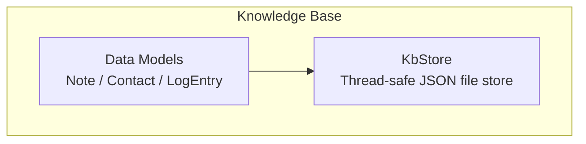
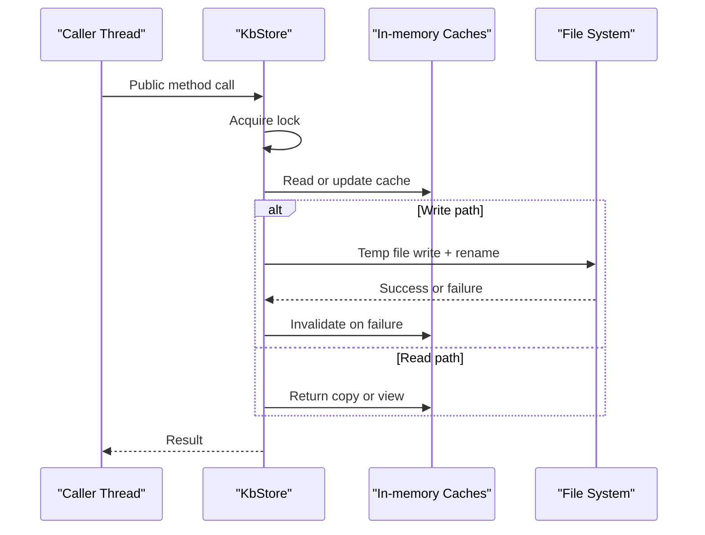
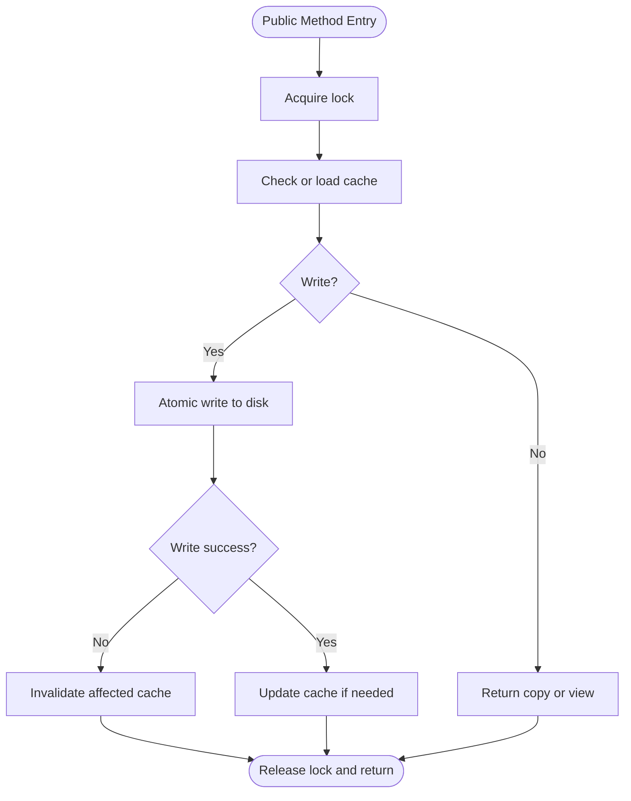
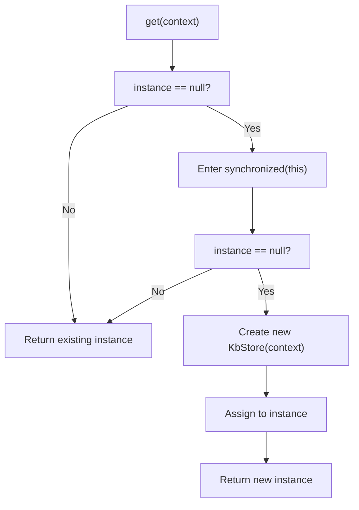
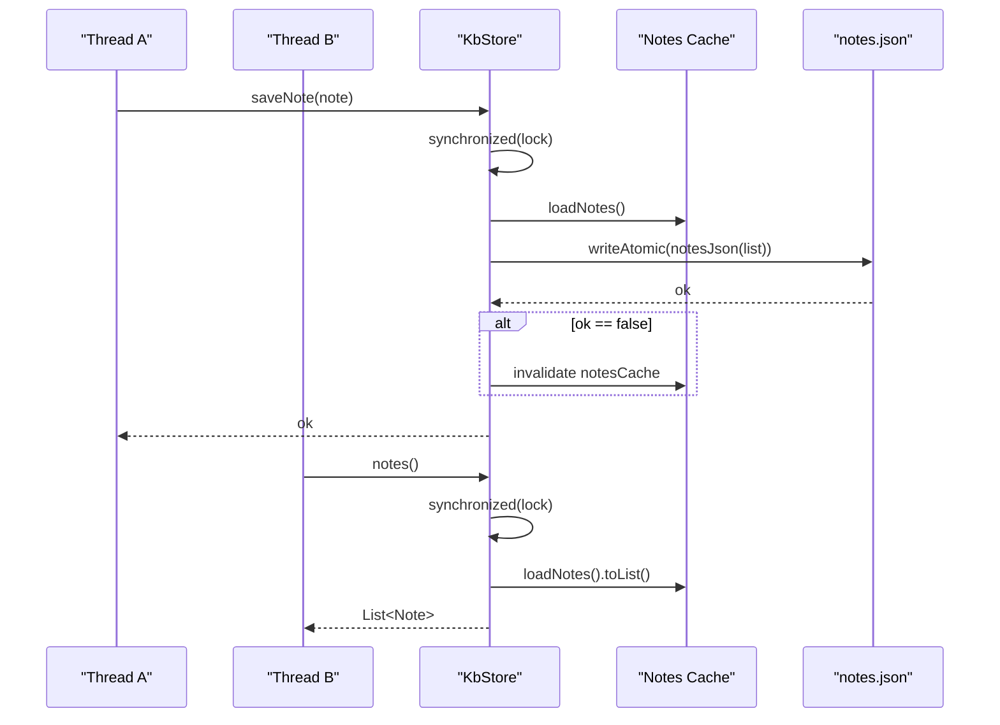
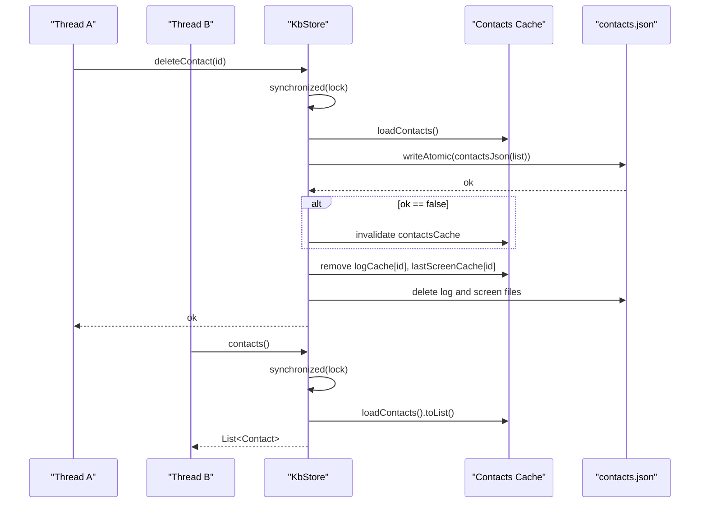
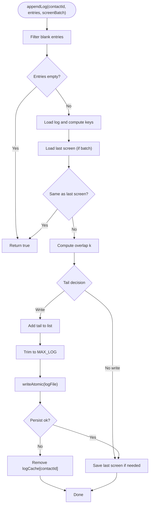
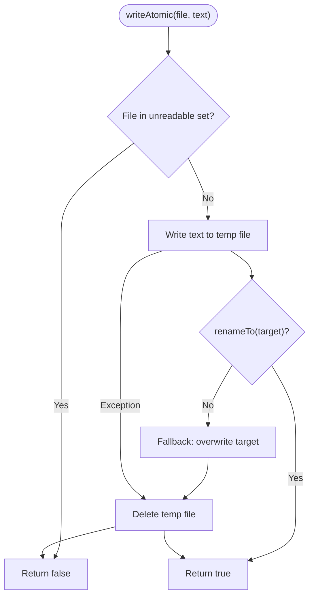
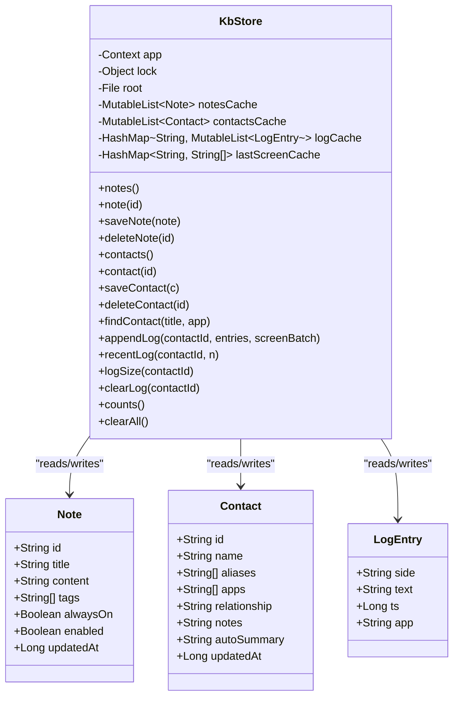

# Thread Safety Mechanisms

<cite>
**Referenced Files in This Document**
- [KbStore.kt](file://app/src/main/java/com/jev/probe/core/kb/KbStore.kt)
- [KbModels.kt](file://app/src/main/java/com/jev/probe/core/kb/KbModels.kt)
</cite>

## Table of Contents
1. [Introduction](#introduction)
2. [Project Structure](#project-structure)
3. [Core Components](#core-components)
4. [Architecture Overview](#architecture-overview)
5. [Detailed Component Analysis](#detailed-component-analysis)
6. [Dependency Analysis](#dependency-analysis)
7. [Performance Considerations](#performance-considerations)
8. [Troubleshooting Guide](#troubleshooting-guide)
9. [Conclusion](#conclusion)

## Introduction
This document explains the thread safety implementation of the storage engine used for notes, contacts, and per-contact chat logs. The storage layer is implemented as a single class that serializes all public access to shared mutable state through synchronized blocks. It also provides a singleton accessor using a volatile instance variable with double-checked locking.

The goal is to ensure data consistency across multiple threads reading and writing JSON-backed files while avoiding partial writes and inconsistent caches.

## Project Structure
The storage engine lives under the knowledge-base package:
- Data models are defined separately from the store.
- The store encapsulates file paths, in-memory caches, JSON serialization, atomic writes, and synchronization.

**Diagram sources**
- [KbModels.kt:11-42](file://app/src/main/java/com/jev/probe/core/kb/KbModels.kt#L11-L42)
- [KbStore.kt:9-23](file://app/src/main/java/com/jev/probe/core/kb/KbStore.kt#L9-L23)

**Section sources**
- [KbStore.kt:9-23](file://app/src/main/java/com/jev/probe/core/kb/KbStore.kt#L9-L23)
- [KbModels.kt:1-42](file://app/src/main/java/com/jev/probe/core/kb/KbModels.kt#L1-L42)

## Core Components
- KbStore: The only class that reads and writes the knowledge-base files. It owns:
  - File handles for notes, contacts, per-contact logs, and screen history.
  - In-memory caches for notes, contacts, log entries, and last-screen keys.
  - A private lock object used by synchronized blocks.
  - A companion object exposing a singleton accessor.

- Data models: Note, Contact, LogEntry, ChatContext, and KbCounts describe the persisted entities.

Key responsibilities:
- Notes CRUD operations.
- Contacts CRUD and matching operations.
- Append-only log management with deduplication and bounded size.
- Atomic file writes via temp file + rename.
- Singleton initialization with volatile + double-checked locking.

**Section sources**
- [KbStore.kt:24-40](file://app/src/main/java/com/jev/probe/core/kb/KbStore.kt#L24-L40)
- [KbModels.kt:11-42](file://app/src/main/java/com/jev/probe/core/kb/KbModels.kt#L11-L42)

## Architecture Overview
At runtime, callers obtain the singleton KbStore instance and invoke public methods. All public methods that touch shared state are protected by a single lock object. Reads may return copies or views derived from cached lists; writes update the cache and persist atomically.

**Diagram sources**
- [KbStore.kt:44-95](file://app/src/main/java/com/jev/probe/core/kb/KbStore.kt#L44-L95)
- [KbStore.kt:172-240](file://app/src/main/java/com/jev/probe/core/kb/KbStore.kt#L172-L240)
- [KbStore.kt:438-459](file://app/src/main/java/com/jev/probe/core/kb/KbStore.kt#L438-L459)

## Detailed Component Analysis

### Lock Object and Synchronized Blocks
- Lock object: A dedicated `Any()` instance is used as the monitor for all critical sections.
- Scope: Every public method that accesses shared mutable state is wrapped in `synchronized(lock)`.
- Protected state includes:
  - Notes cache and notes file.
  - Contacts cache and contacts file.
  - Log cache, last-screen cache, and per-contact log/screen files.
  - Admin counters and clear-all operation.

This design ensures mutual exclusion across all concurrent readers and writers.

**Diagram sources**
- [KbStore.kt:44-95](file://app/src/main/java/com/jev/probe/core/kb/KbStore.kt#L44-L95)
- [KbStore.kt:172-240](file://app/src/main/java/com/jev/probe/core/kb/KbStore.kt#L172-L240)
- [KbStore.kt:271-290](file://app/src/main/java/com/jev/probe/core/kb/KbStore.kt#L271-L290)

**Section sources**
- [KbStore.kt:27-40](file://app/src/main/java/com/jev/probe/core/kb/KbStore.kt#L27-L40)
- [KbStore.kt:44-95](file://app/src/main/java/com/jev/probe/core/kb/KbStore.kt#L44-L95)
- [KbStore.kt:172-240](file://app/src/main/java/com/jev/probe/core/kb/KbStore.kt#L172-L240)
- [KbStore.kt:271-290](file://app/src/main/java/com/jev/probe/core/kb/KbStore.kt#L271-L290)

### Singleton Pattern with Volatile Instance and Double-Checked Locking
- Instance variable: Declared as `@Volatile` to guarantee visibility across threads.
- Accessor: Uses double-checked locking pattern:
  - First check without synchronization.
  - If null, synchronize on the companion object and re-check before constructing the instance.
- Constructor: Private, so instances can only be created through the accessor.

**Diagram sources**
- [KbStore.kt:473-482](file://app/src/main/java/com/jev/probe/core/kb/KbStore.kt#L473-L482)

**Section sources**
- [KbStore.kt:24-24](file://app/src/main/java/com/jev/probe/core/kb/KbStore.kt#L24-L24)
- [KbStore.kt:473-482](file://app/src/main/java/com/jev/probe/core/kb/KbStore.kt#L473-L482)

### Notes Operations
- Read operations:
  - `notes()`: Returns a snapshot list of notes.
  - `note(id)`: Finds a note by id.
- Write operations:
  - `saveNote(note)`: Inserts or replaces by id, stamps updated timestamp, persists atomically, invalidates cache on failure.
  - `deleteNote(id)`: Removes by id, persists atomically, invalidates cache on failure.

All these methods are synchronized on the same lock, ensuring consistent reads and writes.

**Diagram sources**
- [KbStore.kt:44-65](file://app/src/main/java/com/jev/probe/core/kb/KbStore.kt#L44-L65)
- [KbStore.kt:294-314](file://app/src/main/java/com/jev/probe/core/kb/KbStore.kt#L294-L314)
- [KbStore.kt:438-459](file://app/src/main/java/com/jev/probe/core/kb/KbStore.kt#L438-L459)

**Section sources**
- [KbStore.kt:44-65](file://app/src/main/java/com/jev/probe/core/kb/KbStore.kt#L44-L65)
- [KbStore.kt:294-314](file://app/src/main/java/com/jev/probe/core/kb/KbStore.kt#L294-L314)

### Contacts Operations
- Read operations:
  - `contacts()`: Returns a snapshot list of contacts.
  - `contact(id)`: Finds a contact by id.
  - `findContact(title, app)`: Matches by normalized name or alias, preferring known apps when available.
- Write operations:
  - `saveContact(c)`: Inserts or replaces by id, stamps updated timestamp, persists atomically, invalidates cache on failure.
  - `deleteContact(id)`: Removes contact, deletes associated log and screen files, clears related caches, persists atomically, invalidates cache on failure.

All operations are synchronized on the same lock.

**Diagram sources**
- [KbStore.kt:69-96](file://app/src/main/java/com/jev/probe/core/kb/KbStore.kt#L69-L96)
- [KbStore.kt:106-145](file://app/src/main/java/com/jev/probe/core/kb/KbStore.kt#L106-L145)
- [KbStore.kt:316-337](file://app/src/main/java/com/jev/probe/core/kb/KbStore.kt#L316-L337)

**Section sources**
- [KbStore.kt:69-96](file://app/src/main/java/com/jev/probe/core/kb/KbStore.kt#L69-L96)
- [KbStore.kt:106-145](file://app/src/main/java/com/jev/probe/core/kb/KbStore.kt#L106-L145)
- [KbStore.kt:316-337](file://app/src/main/java/com/jev/probe/core/kb/KbStore.kt#L316-L337)

### Log Operations
- Append logic:
  - Filters out blank text entries.
  - Computes comparison keys for deduplication.
  - Compares with previous screen to avoid duplicate writes.
  - Appends only new tail segments based on overlap detection.
  - Enforces maximum log size.
  - Persists atomically and updates last-screen cache.
- Read operations:
  - `recentLog(contactId, n)`: Returns newest n entries.
  - `logSize(contactId)`: Returns current log size.
  - `clearLog(contactId)`: Clears caches and deletes log/screen files.

All log operations are synchronized on the same lock.

**Diagram sources**
- [KbStore.kt:172-240](file://app/src/main/java/com/jev/probe/core/kb/KbStore.kt#L172-L240)
- [KbStore.kt:248-267](file://app/src/main/java/com/jev/probe/core/kb/KbStore.kt#L248-L267)
- [KbStore.kt:438-459](file://app/src/main/java/com/jev/probe/core/kb/KbStore.kt#L438-L459)

**Section sources**
- [KbStore.kt:172-240](file://app/src/main/java/com/jev/probe/core/kb/KbStore.kt#L172-L240)
- [KbStore.kt:248-267](file://app/src/main/java/com/jev/probe/core/kb/KbStore.kt#L248-L267)

### Atomic Writes and Error Handling
- Atomic writes:
  - Writes to a temporary file first.
  - Renames the temp file to the target file in one step.
  - Falls back to in-place overwrite if rename fails, logging a warning.
  - Cleans up temp files on exceptions.
- Unreadable files:
  - On parse failures, attempts to move the damaged file aside.
  - Tracks unreadable files to prevent overwriting corrupted data.
  - Marks loads as untrustworthy so caches are not populated.

These mechanisms protect against partial writes and data corruption even under crashes or I/O errors.

**Diagram sources**
- [KbStore.kt:438-459](file://app/src/main/java/com/jev/probe/core/kb/KbStore.kt#L438-L459)
- [KbStore.kt:412-428](file://app/src/main/java/com/jev/probe/core/kb/KbStore.kt#L412-L428)

**Section sources**
- [KbStore.kt:412-459](file://app/src/main/java/com/jev/probe/core/kb/KbStore.kt#L412-L459)

### Data Consistency Across Threads
- Single lock: All public methods that read or modify shared state use the same lock object, preventing interleaved reads/writes.
- Cache invalidation: On failed writes, caches are invalidated so subsequent reads reload from disk.
- Snapshot returns: Read methods return copies or immutable views to avoid exposing internal mutable structures.
- Immutable models: Data classes represent immutable records, reducing accidental mutation risks.

Together, these practices ensure consistent snapshots and durable persistence across concurrent access.

**Section sources**
- [KbStore.kt:44-95](file://app/src/main/java/com/jev/probe/core/kb/KbStore.kt#L44-L95)
- [KbStore.kt:172-240](file://app/src/main/java/com/jev/probe/core/kb/KbStore.kt#L172-L240)
- [KbModels.kt:11-42](file://app/src/main/java/com/jev/probe/core/kb/KbModels.kt#L11-L42)

## Dependency Analysis
The storage engine has minimal external dependencies beyond Android APIs and JSON utilities. Its main relationships are:
- KbStore depends on:
  - Android Context for file directory access.
  - org.json for serialization.
  - java.io.File for persistence.
- Data models are independent and consumed by the store.

**Diagram sources**
- [KbStore.kt:24-40](file://app/src/main/java/com/jev/probe/core/kb/KbStore.kt#L24-L40)
- [KbStore.kt:44-95](file://app/src/main/java/com/jev/probe/core/kb/KbStore.kt#L44-L95)
- [KbStore.kt:172-240](file://app/src/main/java/com/jev/probe/core/kb/KbStore.kt#L172-L240)
- [KbModels.kt:11-42](file://app/src/main/java/com/jev/probe/core/kb/KbModels.kt#L11-L42)

**Section sources**
- [KbStore.kt:24-40](file://app/src/main/java/com/jev/probe/core/kb/KbStore.kt#L24-L40)
- [KbModels.kt:11-42](file://app/src/main/java/com/jev/probe/core/kb/KbModels.kt#L11-L42)

## Performance Considerations
- Synchronization granularity:
  - Using a single lock simplifies correctness but serializes all operations. For high concurrency, consider finer-grained locks per resource (notes, contacts, logs).
- Cache strategy:
  - Caches reduce disk I/O. Ensure invalidation occurs on every failed write to avoid stale reads.
- Atomic writes:
  - Temp file + rename avoids partial documents at the cost of extra I/O. This is appropriate for durability.
- Log trimming:
  - Maintaining a bounded log size prevents unbounded growth and keeps memory usage predictable.

[No sources needed since this section provides general guidance]

## Troubleshooting Guide
Common issues and mitigations:
- Corrupted JSON files:
  - The store moves damaged files aside and marks them unreadable to prevent overwriting user data.
  - Logs warnings with file names and exception types.
- Failed writes:
  - Atomic write returns false on failure; callers invalidate caches accordingly.
  - Fallback in-place overwrite is logged as non-atomic.
- Stale caches:
  - Always invalidate caches after failed writes to force reload from disk.

Recommended checks:
- Inspect log output for unreadable and write failure messages.
- Verify that caches are cleared after clearAll or delete operations.
- Confirm that singleton initialization does not throw during class loading.

**Section sources**
- [KbStore.kt:412-428](file://app/src/main/java/com/jev/probe/core/kb/KbStore.kt#L412-L428)
- [KbStore.kt:438-459](file://app/src/main/java/com/jev/probe/core/kb/KbStore.kt#L438-L459)
- [KbStore.kt:282-290](file://app/src/main/java/com/jev/probe/core/kb/KbStore.kt#L282-L290)

## Conclusion
The storage engine achieves thread safety through:
- A single lock protecting all public methods that access shared mutable state.
- A volatile instance variable with double-checked locking for singleton creation.
- Atomic file writes to prevent partial documents.
- Careful cache invalidation to maintain consistency between memory and disk.

Best practices demonstrated here include minimizing shared mutable state exposure, returning snapshots from reads, and handling I/O errors gracefully. Potential improvements could involve finer-grained locking for higher concurrency and explicit documentation of lock ordering to prevent deadlocks if additional resources are introduced.

[No sources needed since this section summarizes without analyzing specific files]