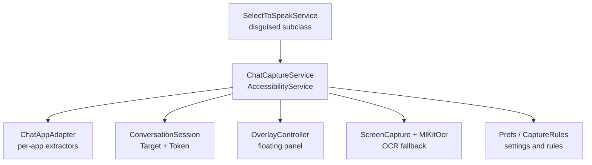
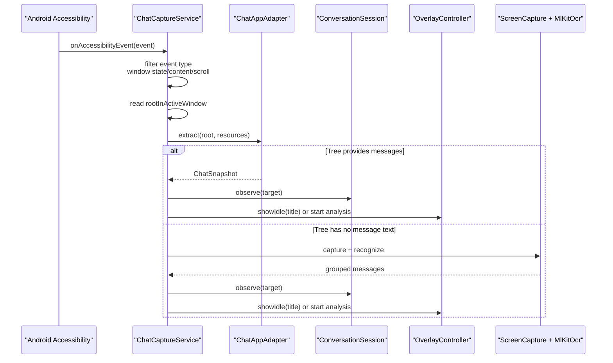
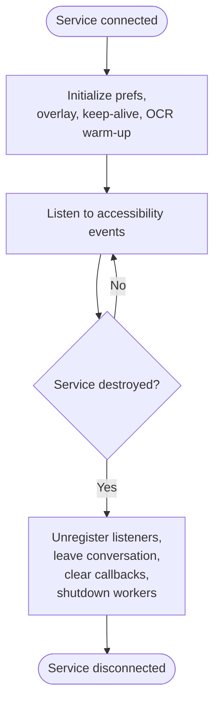
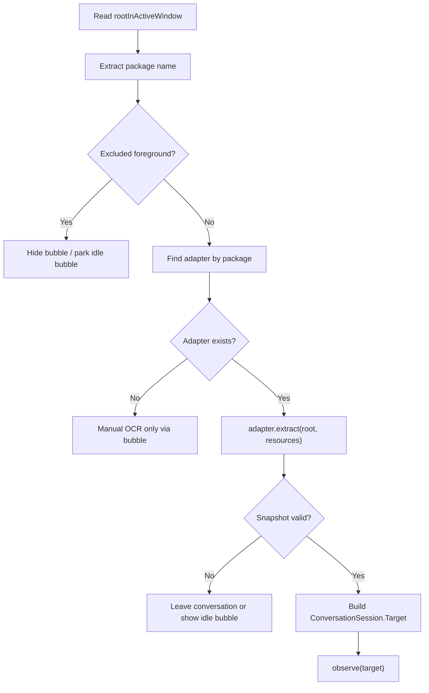
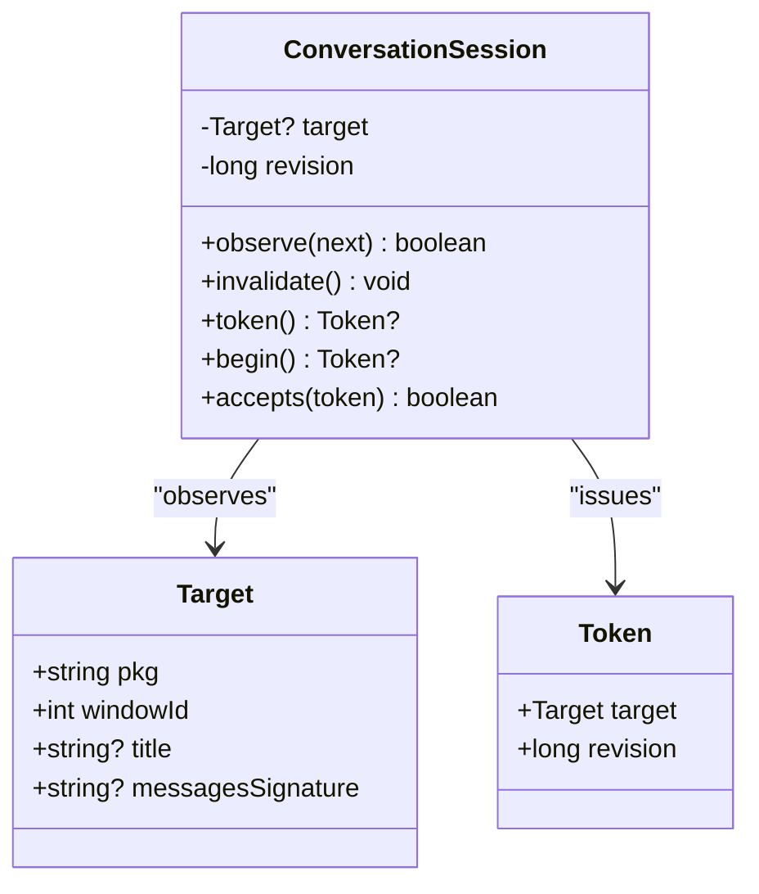
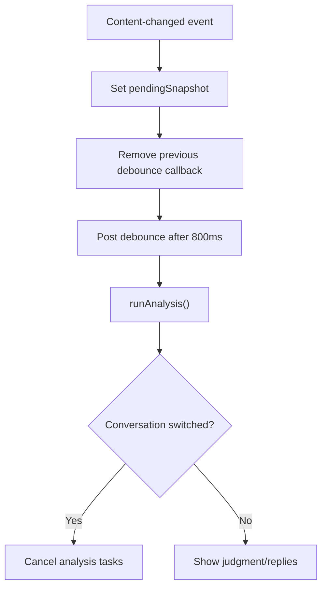
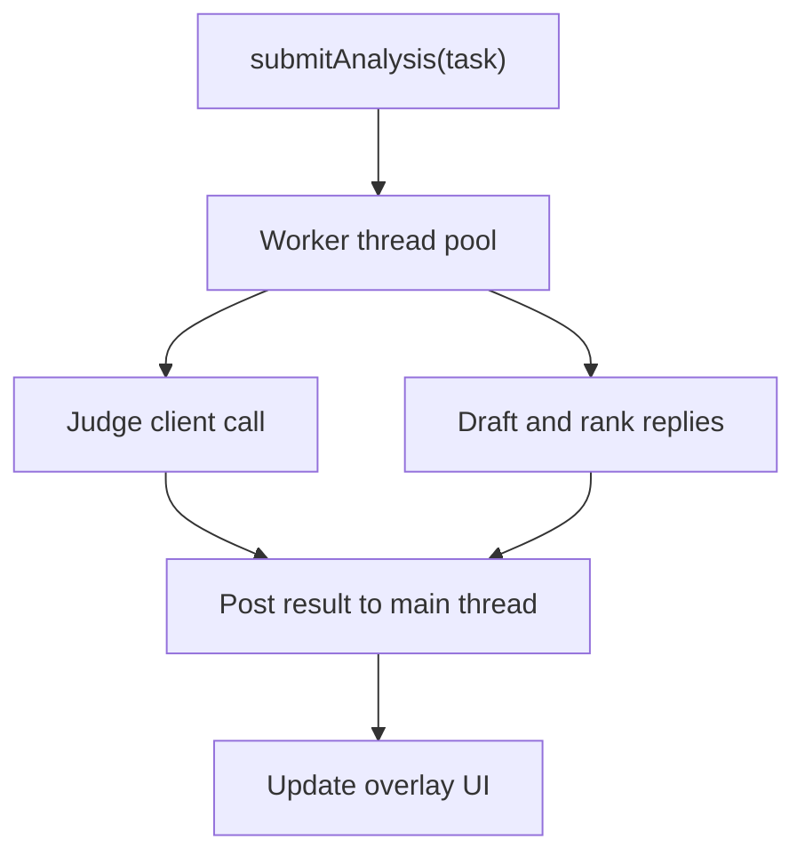
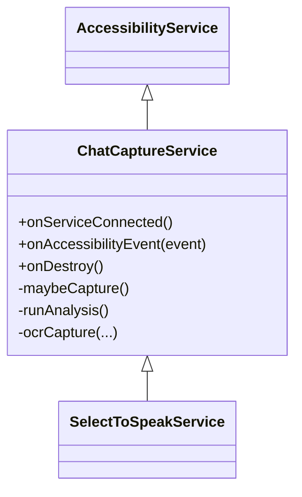
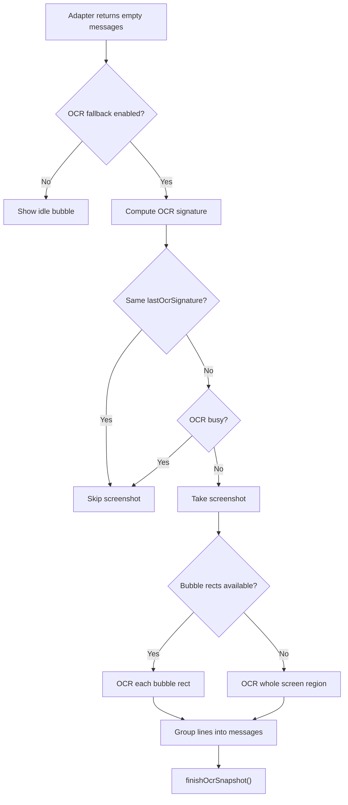
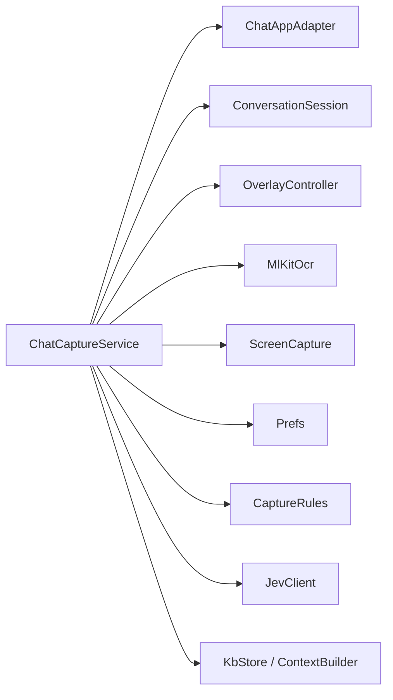

# Accessibility Service Implementation

<cite>
**Referenced Files in This Document**   
- [ChatCaptureService.kt](file://app/src/main/java/com/jev/probe/capture/ChatCaptureService.kt)
- [ConversationSession.kt](file://app/src/main/java/com/jev/probe/capture/ConversationSession.kt)
- [ChatAppAdapter.kt](file://app/src/main/java/com/jev/probe/capture/ChatAppAdapter.kt)
- [SelectToSpeakService.kt](file://app/src/main/java/com/google/android/accessibility/selecttospeak/SelectToSpeakService.kt)
- [config_disguised.xml](file://app/src/main/res/xml/config_disguised.xml)
</cite>

## Table of Contents
1. [Introduction](#introduction)
2. [Project Structure](#project-structure)
3. [Core Components](#core-components)
4. [Architecture Overview](#architecture-overview)
5. [Detailed Component Analysis](#detailed-component-analysis)
6. [Dependency Analysis](#dependency-analysis)
7. [Performance Considerations](#performance-considerations)
8. [Troubleshooting Guide](#troubleshooting-guide)
9. [Conclusion](#conclusion)

## Introduction
This document explains the Android Accessibility Service implementation that monitors supported chat applications without requiring root access. The service reads the foreground application’s accessibility tree, detects new messages from the other participant, and optionally runs background analysis while driving a floating overlay. It supports multiple apps through per-app adapters, falls back to screenshot-based OCR when the tree does not expose message text, and uses a session token system to keep manual and automatic operations safe across conversation switches.

The key design goals are:
- Observe UI changes only for supported applications.
- Avoid reading or sending messages; writing is limited to filling an input field with user consent.
- Keep the service responsive by offloading heavy work to a worker thread pool.
- Handle anti-accessibility behavior (such as WeChat hiding node text) using a disguised class registration and OCR fallbacks.

## Project Structure
The relevant code lives under the capture module and a small discovery entry point:

**Diagram sources**
- [SelectToSpeakService.kt:5-14](file://app/src/main/java/com/google/android/accessibility/selecttospeak/SelectToSpeakService.kt#L5-L14)
- [ChatCaptureService.kt:29-53](file://app/src/main/java/com/jev/probe/capture/ChatCaptureService.kt#L29-L53)
- [ChatAppAdapter.kt:10-30](file://app/src/main/java/com/jev/probe/capture/ChatAppAdapter.kt#L10-L30)
- [ConversationSession.kt:4-11](file://app/src/main/java/com/jev/probe/capture/ConversationSession.kt#L4-L11)

**Section sources**
- [SelectToSpeakService.kt:5-14](file://app/src/main/java/com/google/android/accessibility/selecttospeak/SelectToSpeakService.kt#L5-L14)
- [ChatCaptureService.kt:29-53](file://app/src/main/java/com/jev/probe/capture/ChatCaptureService.kt#L29-L53)
- [ChatAppAdapter.kt:10-30](file://app/src/main/java/com/jev/probe/capture/ChatAppAdapter.kt#L10-L30)
- [ConversationSession.kt:4-11](file://app/src/main/java/com/jev/probe/capture/ConversationSession.kt#L4-L11)

## Core Components
- **ChatCaptureService**: Extends `AccessibilityService`, owns the event loop, window detection, session state, debouncing, OCR fallback, and overlay control.
- **SelectToSpeakService**: A thin subclass registered under a system-like name so WeChat exposes its full node tree instead of an empty obfuscated one.
- **ChatAppAdapter**: Per-application extractor interface and implementations for QQ, X/Twitter, Feishu/Lark, and WeChat. Each adapter turns the raw accessibility tree into a neutral snapshot containing title, messages, and optional bubble geometry.
- **ConversationSession**: Tracks the current target (package, window ID, title, message signature) and issues immutable tokens that become invalid when the target changes.
- **OCR subsystem**: Uses screen capture and ML Kit OCR when the accessibility tree cannot provide readable message text.
- **Overlay controller**: Shows idle bubbles, loading states, judgments, replies, errors, and paywall prompts.

**Section sources**
- [ChatCaptureService.kt:29-53](file://app/src/main/java/com/jev/probe/capture/ChatCaptureService.kt#L29-L53)
- [SelectToSpeakService.kt:5-14](file://app/src/main/java/com/google/android/accessibility/selecttospeak/SelectToSpeakService.kt#L5-L14)
- [ChatAppAdapter.kt:10-30](file://app/src/main/java/com/jev/probe/capture/ChatAppAdapter.kt#L10-L30)
- [ConversationSession.kt:4-11](file://app/src/main/java/com/jev/probe/capture/ConversationSession.kt#L4-L11)

## Architecture Overview
At runtime, Android calls the accessibility service when events occur. The service decides whether the active window belongs to a supported app, extracts a normalized snapshot, updates the conversation session, and either shows an idle bubble or triggers background analysis. If the tree has no readable text, it takes a screenshot and runs OCR.

**Diagram sources**
- [ChatCaptureService.kt:239-360](file://app/src/main/java/com/jev/probe/capture/ChatCaptureService.kt#L239-L360)
- [ChatAppAdapter.kt:10-30](file://app/src/main/java/com/jev/probe/capture/ChatAppAdapter.kt#L10-L30)
- [ConversationSession.kt:17-34](file://app/src/main/java/com/jev/probe/capture/ConversationSession.kt#L17-L34)

## Detailed Component Analysis

### Accessibility Service Lifecycle
`ChatCaptureService` extends `AccessibilityService` and manages three lifecycle-related callbacks:

| Method | Responsibility |
|---|---|
| `onServiceConnected` | Initializes preferences, registers preference change listeners, creates the overlay, wires menu actions, starts the keep-alive service, warms up OCR, and schedules a delayed capture after reconnection. |
| `onAccessibilityEvent` | Filters event types, determines whether the foreground package changed, and delegates supported events to the capture pipeline. |
| `onDestroy` | Marks the service destroyed, unregisters listeners, leaves the conversation, removes pending main-thread callbacks, clears overlay callbacks, hides the overlay, and shuts down the worker thread pool. |

**Diagram sources**
- [ChatCaptureService.kt:202-237](file://app/src/main/java/com/jev/probe/capture/ChatCaptureService.kt#L202-L237)
- [ChatCaptureService.kt:794-814](file://app/src/main/java/com/jev/probe/capture/ChatCaptureService.kt#L794-L814)

**Section sources**
- [ChatCaptureService.kt:202-237](file://app/src/main/java/com/jev/probe/capture/ChatCaptureService.kt#L202-L237)
- [ChatCaptureService.kt:794-814](file://app/src/main/java/com/jev/probe/capture/ChatCaptureService.kt#L794-L814)

### Event Filtering Mechanism
The service handles three event types:

| Event Type | Meaning | Service Behavior |
|---|---|---|
| `TYPE_WINDOW_STATE_CHANGED` | Foreground window changed | Checks the real active window package, updates foreground tracking, leaves the conversation if needed, and shows or hides the idle bubble depending on whether the foreground is excluded. |
| `TYPE_WINDOW_CONTENT_CHANGED` | Window content updated | Delegates to the capture pipeline because message text may have changed. |
| `TYPE_VIEW_SCROLLED` | User scrolled | Delegates to the capture pipeline because message layout or presence indicators may have changed. |

Important filtering logic:
- The decision about whether the chat app is still in the foreground uses `rootInActiveWindow`, not the event’s package, because IME or status bar events can otherwise cause flickering.
- Apps without an adapter are not automatically captured, but the idle bubble remains reachable so users can manually trigger OCR.
- Excluded foregrounds such as settings screens, launchers, and system UI hide the bubble.

**Section sources**
- [ChatCaptureService.kt:239-273](file://app/src/main/java/com/jev/probe/capture/ChatCaptureService.kt#L239-L273)

### Window Detection Using `rootInActiveWindow` and Package Matching
Window detection follows this flow:

1. Read `rootInActiveWindow`.
2. Extract the package name.
3. Exclude known non-capturable foregrounds.
4. Look up the per-app adapter by package name.
5. Ask the adapter whether the current tree represents a chat window.
6. Build a `ConversationSession.Target` from package, window ID, title, and optional message signature.
7. Compare the live target with the observed target to decide whether to stay in the conversation.

**Diagram sources**
- [ChatCaptureService.kt:106-122](file://app/src/main/java/com/jev/probe/capture/ChatCaptureService.kt#L106-L122)
- [ChatCaptureService.kt:275-301](file://app/src/main/java/com/jev/probe/capture/ChatCaptureService.kt#L275-L301)
- [ChatAppAdapter.kt:10-30](file://app/src/main/java/com/jev/probe/capture/ChatAppAdapter.kt#L10-L30)

**Section sources**
- [ChatCaptureService.kt:106-122](file://app/src/main/java/com/jev/probe/capture/ChatCaptureService.kt#L106-L122)
- [ChatCaptureService.kt:275-301](file://app/src/main/java/com/jev/probe/capture/ChatCaptureService.kt#L275-L301)
- [ChatAppAdapter.kt:10-30](file://app/src/main/java/com/jev/probe/capture/ChatAppAdapter.kt#L10-L30)

### Conversation Session Management with `ConversationToken` and Target Tracking
`ConversationSession` maintains:
- `Target`: package, window ID, title, and optional message signature.
- `Token`: an immutable reference to a target plus a revision number.
- Revisioning: every time the target changes or a new analysis begins, the revision increments.
- Acceptance: a token is accepted only if both the target and revision match the current session state.

This prevents stale analysis results from being applied after the user switches conversations.

**Diagram sources**
- [ConversationSession.kt:4-35](file://app/src/main/java/com/jev/probe/capture/ConversationSession.kt#L4-L35)

**Section sources**
- [ConversationSession.kt:4-35](file://app/src/main/java/com/jev/probe/capture/ConversationSession.kt#L4-L35)
- [ChatCaptureService.kt:124-156](file://app/src/main/java/com/jev/probe/capture/ChatCaptureService.kt#L124-L156)

### Debouncing Rapid UI Updates
Rapid `TYPE_WINDOW_CONTENT_CHANGED` events can fire many times during scrolling, caret blinking, or presence indicator updates. The service debounces automatic analysis by:

1. Storing a runnable `debounce` that calls `runAnalysis`.
2. Removing any previously posted debounce task.
3. Posting the task again after 800 milliseconds.
4. Cancelling all pending analysis tasks when the conversation changes.

This reduces unnecessary network calls and keeps the overlay stable.

**Diagram sources**
- [ChatCaptureService.kt:178-180](file://app/src/main/java/com/jev/probe/capture/ChatCaptureService.kt#L178-L180)
- [ChatCaptureService.kt:357-360](file://app/src/main/java/com/jev/probe/capture/ChatCaptureService.kt#L357-L360)
- [ChatCaptureService.kt:389-455](file://app/src/main/java/com/jev/probe/capture/ChatCaptureService.kt#L389-L455)

**Section sources**
- [ChatCaptureService.kt:178-180](file://app/src/main/java/com/jev/probe/capture/ChatCaptureService.kt#L178-L180)
- [ChatCaptureService.kt:357-360](file://app/src/main/java/com/jev/probe/capture/ChatCaptureService.kt#L357-L360)
- [ChatCaptureService.kt:389-455](file://app/src/main/java/com/jev/probe/capture/ChatCaptureService.kt#L389-L455)

### Worker Thread Pool for Background Processing
The service uses:
- A fixed thread pool of size two for analysis tasks.
- A separate background thread for refreshing entitlement information.
- Main-thread handlers for overlay updates and debouncing.

Tasks are submitted safely even after teardown by catching `RejectedExecutionException`. This ensures stale overlay callbacks do not crash the process.

**Diagram sources**
- [ChatCaptureService.kt:45-46](file://app/src/main/java/com/jev/probe/capture/ChatCaptureService.kt#L45-L46)
- [ChatCaptureService.kt:169-176](file://app/src/main/java/com/jev/probe/capture/ChatCaptureService.kt#L169-L176)
- [ChatCaptureService.kt:406-454](file://app/src/main/java/com/jev/probe/capture/ChatCaptureService.kt#L406-L454)

**Section sources**
- [ChatCaptureService.kt:45-46](file://app/src/main/java/com/jev/probe/capture/ChatCaptureService.kt#L45-L46)
- [ChatCaptureService.kt:169-176](file://app/src/main/java/com/jev/probe/capture/ChatCaptureService.kt#L169-L176)
- [ChatCaptureService.kt:406-454](file://app/src/main/java/com/jev/probe/capture/ChatCaptureService.kt#L406-L454)

### Accessibility Node Traversal Examples
Node traversal appears in several places:

- **Title extraction**: Scans nodes in the top action bar region, filters timestamps, checks bounds and center position, and picks the best candidate.
- **WeChat adapter**: Looks for a specific bubble container ID, collects message text and geometry, and determines sender side by horizontal position.
- **QQ adapter**: Collects message nodes by resource ID, detects the input box, finds the title, and infers sender side by avatar edge distance.
- **Feishu adapter**: Detects chat windows by message containers and input boxes, collects bubble rectangles, and infers sender side from read-receipt children.
- **X adapter**: Parses `contentDescription` fields of Compose rows, strips timestamps and read receipts, and distinguishes DM threads from DM lists.
- **Editable input search**: Walks the tree to find a single editable, visible, enabled, non-password node for filling replies.

These traversals use bounded loops and guards to avoid performance problems on large trees.

**Section sources**
- [ChatAppAdapter.kt:45-74](file://app/src/main/java/com/jev/probe/capture/ChatAppAdapter.kt#L45-L74)
- [ChatAppAdapter.kt:93-128](file://app/src/main/java/com/jev/probe/capture/ChatAppAdapter.kt#L93-L128)
- [ChatAppAdapter.kt:139-179](file://app/src/main/java/com/jev/probe/capture/ChatAppAdapter.kt#L139-L179)
- [ChatAppAdapter.kt:197-247](file://app/src/main/java/com/jev/probe/capture/ChatAppAdapter.kt#L197-L247)
- [ChatAppAdapter.kt:276-301](file://app/src/main/java/com/jev/probe/capture/ChatAppAdapter.kt#L276-L301)
- [ChatAppAdapter.kt:319-376](file://app/src/main/java/com/jev/probe/capture/ChatAppAdapter.kt#L319-L376)
- [ChatAppAdapter.kt:440-507](file://app/src/main/java/com/jev/probe/capture/ChatAppAdapter.kt#L440-L507)
- [ChatCaptureService.kt:772-787](file://app/src/main/java/com/jev/probe/capture/ChatCaptureService.kt#L772-L787)

### Disguised Class Technique for WeChat
WeChat can hide the accessibility node tree from ordinary services. The project bypasses this by:

1. Registering the accessibility service configuration under a disguised description and enabling full event types, view IDs, interactive windows, and screenshot capability.
2. Subclassing `ChatCaptureService` as `SelectToSpeakService`, which looks like a system accessibility service.
3. Keeping all business logic in `ChatCaptureService`; only the class name differs.

**Diagram sources**
- [ChatCaptureService.kt:43-53](file://app/src/main/java/com/jev/probe/capture/ChatCaptureService.kt#L43-L53)
- [SelectToSpeakService.kt:5-14](file://app/src/main/java/com/google/android/accessibility/selecttospeak/SelectToSpeakService.kt#L5-L14)

**Section sources**
- [config_disguised.xml:1-10](file://app/src/main/res/xml/config_disguised.xml#L1-L10)
- [SelectToSpeakService.kt:5-14](file://app/src/main/java/com/google/android/accessibility/selecttospeak/SelectToSpeakService.kt#L5-L14)
- [ChatCaptureService.kt:29-53](file://app/src/main/java/com/jev/probe/capture/ChatCaptureService.kt#L29-L53)

### OCR Fallback When the Tree Cannot Provide Text
When an adapter reports a chat window but no readable messages, the service can take a screenshot and run OCR:

- For Feishu, it re-measures bubble rectangles inside the screenshot callback to avoid cropping the wrong rows after scrolling.
- For other apps, it crops the top and bottom bars and groups OCR lines by vertical gaps.
- It deduplicates screenshots using an OCR signature based on package, title, and bubble rectangle coordinates.
- It avoids repeated shots by checking busy flags, throttling, and failure backoff.

**Diagram sources**
- [ChatCaptureService.kt:305-329](file://app/src/main/java/com/jev/probe/capture/ChatCaptureService.kt#L305-L329)
- [ChatCaptureService.kt:535-541](file://app/src/main/java/com/jev/probe/capture/ChatCaptureService.kt#L535-L541)
- [ChatCaptureService.kt:548-623](file://app/src/main/java/com/jev/probe/capture/ChatCaptureService.kt#L548-L623)
- [ChatCaptureService.kt:630-652](file://app/src/main/java/com/jev/probe/capture/ChatCaptureService.kt#L630-L652)
- [ChatCaptureService.kt:669-702](file://app/src/main/java/com/jev/probe/capture/ChatCaptureService.kt#L669-L702)

**Section sources**
- [ChatCaptureService.kt:305-329](file://app/src/main/java/com/jev/probe/capture/ChatCaptureService.kt#L305-L329)
- [ChatCaptureService.kt:535-541](file://app/src/main/java/com/jev/probe/capture/ChatCaptureService.kt#L535-L541)
- [ChatCaptureService.kt:548-623](file://app/src/main/java/com/jev/probe/capture/ChatCaptureService.kt#L548-L623)
- [ChatCaptureService.kt:630-652](file://app/src/main/java/com/jev/probe/capture/ChatCaptureService.kt#L630-L652)
- [ChatCaptureService.kt:669-702](file://app/src/main/java/com/jev/probe/capture/ChatCaptureService.kt#L669-L702)

## Dependency Analysis
The service depends on several internal modules:

Key relationships:
- `ChatCaptureService` owns the orchestration but delegates UI parsing to `ChatAppAdapter`.
- `ConversationSession` protects against stale analysis after conversation switches.
- OCR components are used only when the tree path fails.
- Settings and rules gate whether capturing, auto-analysis, and OCR are allowed.

**Diagram sources**
- [ChatCaptureService.kt:13-24](file://app/src/main/java/com/jev/probe/capture/ChatCaptureService.kt#L13-L24)
- [ChatAppAdapter.kt:10-30](file://app/src/main/java/com/jev/probe/capture/ChatAppAdapter.kt#L10-L30)
- [ConversationSession.kt:4-35](file://app/src/main/java/com/jev/probe/capture/ConversationSession.kt#L4-L35)

**Section sources**
- [ChatCaptureService.kt:13-24](file://app/src/main/java/com/jev/probe/capture/ChatCaptureService.kt#L13-L24)
- [ChatAppAdapter.kt:10-30](file://app/src/main/java/com/jev/probe/capture/ChatAppAdapter.kt#L10-L30)
- [ConversationSession.kt:4-35](file://app/src/main/java/com/jev/probe/capture/ConversationSession.kt#L4-L35)

## Performance Considerations
- **Debouncing**: Automatic analysis is delayed by 800 milliseconds to absorb bursts of content-changed events.
- **Deduplication**: Both tree snapshots and OCR outputs compare signatures before triggering analysis or showing the overlay.
- **Bounded traversal**: Node scans use guard counters to prevent runaway loops on large or malformed trees.
- **Background processing**: Heavy work runs off the main thread, while UI updates are posted back to the main looper.
- **OCR throttling**: Screenshot and OCR paths include busy flags, signature gating, and failure handling to avoid repeated captures.
- **Resource cleanup**: Bitmaps are recycled, overlay callbacks are cleared, and the worker pool is shut down during destruction.

[No sources needed since this section provides general guidance]

## Troubleshooting Guide
Common situations and their handling:

| Symptom | Likely Cause | Service Behavior |
|---|---|---|
| Bubble disappears when keyboard is up | Event package came from IME or status bar | The service uses `rootInActiveWindow` to keep the correct foreground package and stabilize the bubble. |
| No automatic capture for unsupported apps | No adapter found | The bubble stays reachable for manual OCR, but automatic capture is disabled. |
| WeChat shows no message text | Anti-accessibility obfuscation | The adapter detects a chat window but returns empty messages; OCR fallback can be used. |
| Manual OCR says no tree available | `rootInActiveWindow` is null | The service shows an error asking the user to toggle the accessibility service and re-enter the conversation. |
| Stale analysis after switching chats | Old token still in flight | `ConversationSession.Token` revisioning rejects outdated targets. |
| Overlay remains hidden after screenshot timeout | System did not call back | The screenshot layer includes a timeout handler to recover the overlay state. |

**Section sources**
- [ChatCaptureService.kt:243-266](file://app/src/main/java/com/jev/probe/capture/ChatCaptureService.kt#L243-L266)
- [ChatCaptureService.kt:465-499](file://app/src/main/java/com/jev/probe/capture/ChatCaptureService.kt#L465-L499)
- [ChatCaptureService.kt:548-587](file://app/src/main/java/com/jev/probe/capture/ChatCaptureService.kt#L548-L587)
- [ConversationSession.kt:17-34](file://app/src/main/java/com/jev/probe/capture/ConversationSession.kt#L17-L34)

## Conclusion
The accessibility service implementation combines a robust lifecycle, careful event filtering, window detection, session tokening, debouncing, background processing, and OCR fallbacks. Per-app adapters normalize different UI structures into a common snapshot model, while the disguised class registration helps bypass WeChat’s anti-accessibility measures. The design prioritizes safety, responsiveness, and user control: it never sends messages, keeps analysis off the main thread, and preserves the overlay even when automatic detection is unavailable.

[No sources needed since this section summarizes without analyzing specific files]