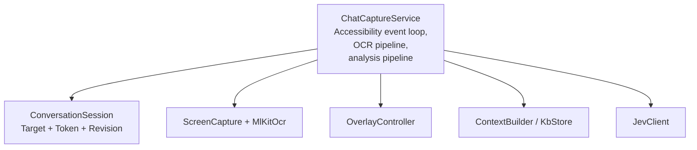
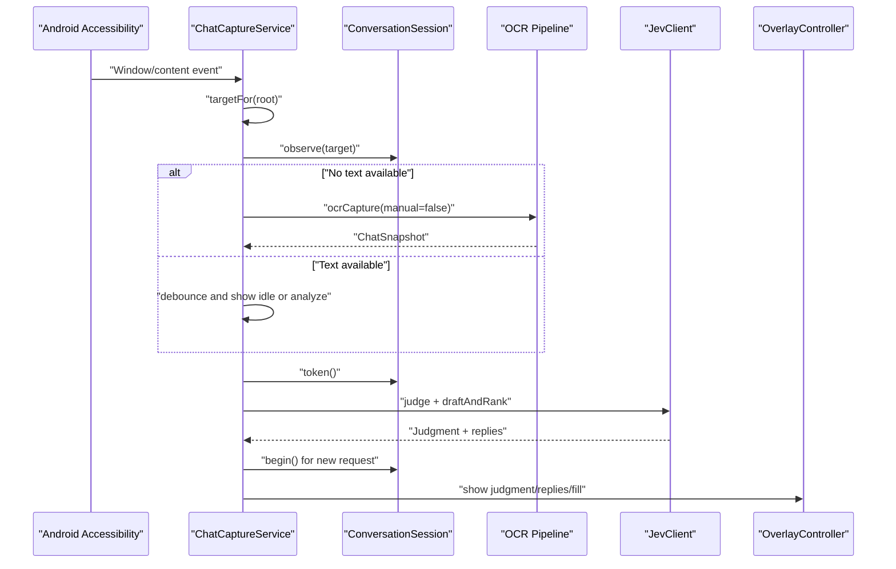
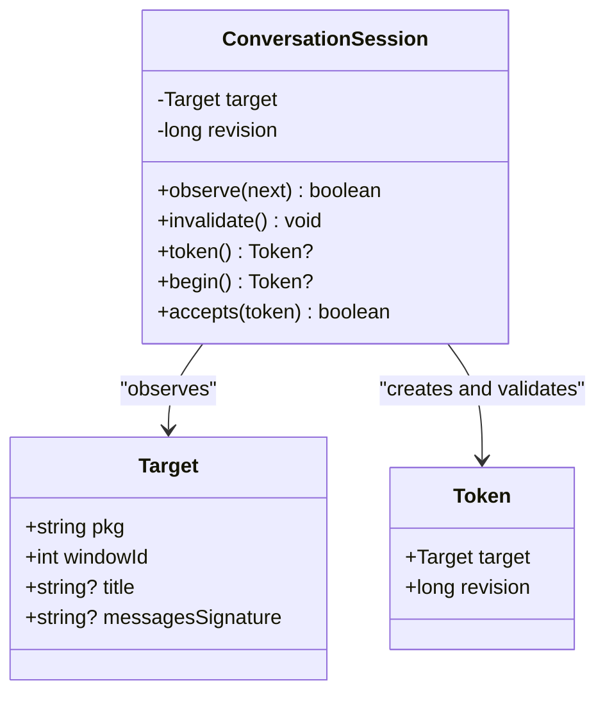
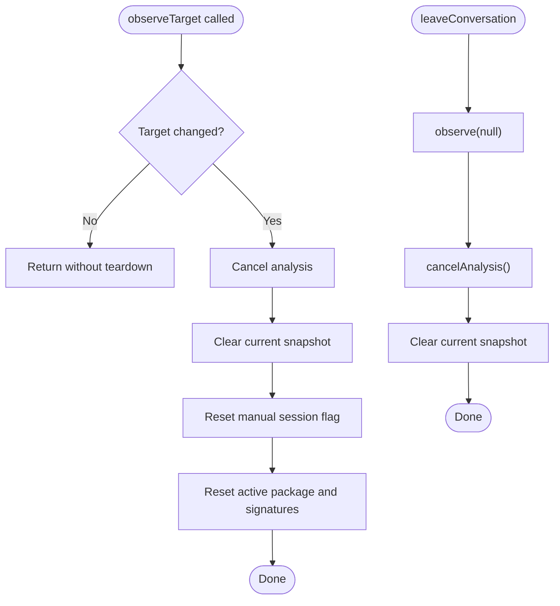
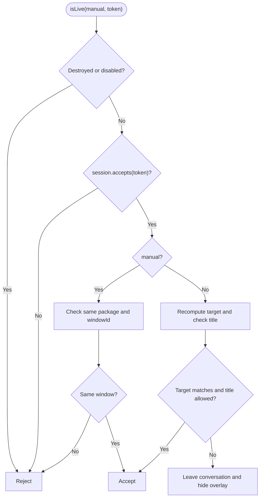
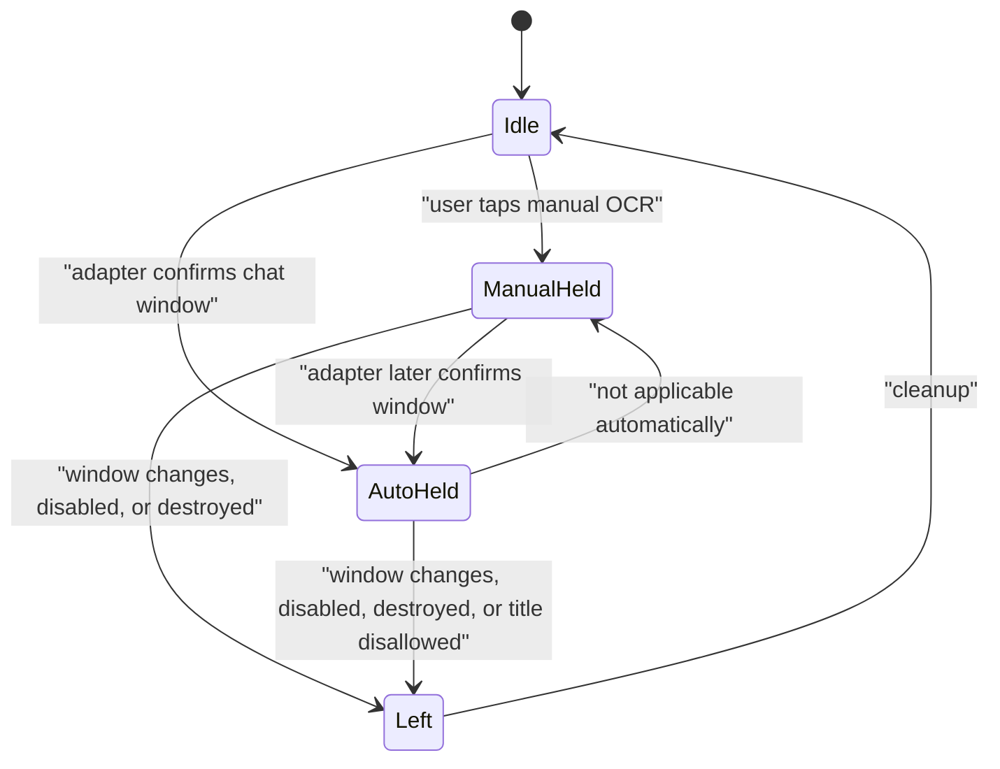
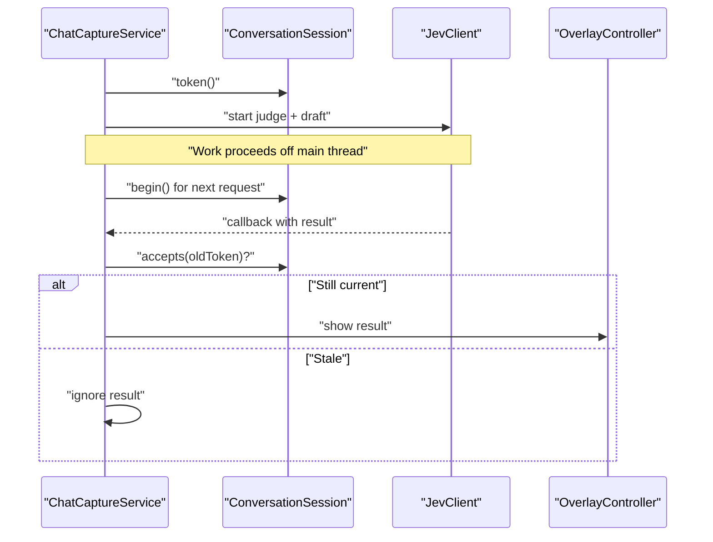
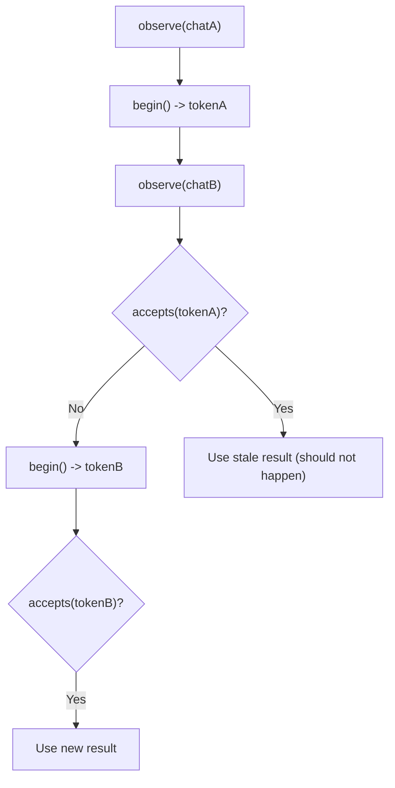
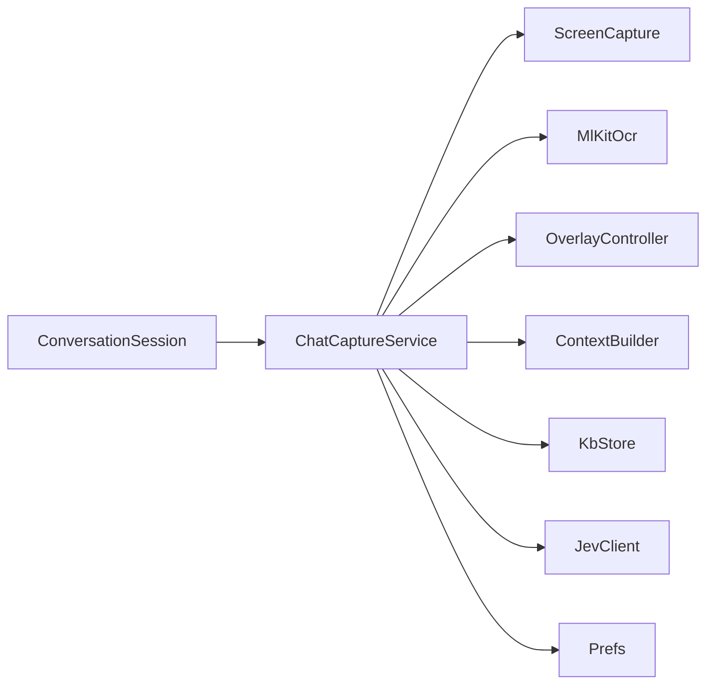

# Conversation Session Management

<cite>
**Referenced Files in This Document**
- [ConversationSession.kt](file://app/src/main/java/com/jev/probe/capture/ConversationSession.kt)
- [ChatCaptureService.kt](file://app/src/main/java/com/jev/probe/capture/ChatCaptureService.kt)
- [ConversationSessionTest.kt](file://app/src/test/java/com/jev/probe/capture/ConversationSessionTest.kt)
</cite>

## Table of Contents
1. [Introduction](#introduction)
2. [Project Structure](#project-structure)
3. [Core Components](#core-components)
4. [Architecture Overview](#architecture-overview)
5. [Detailed Component Analysis](#detailed-component-analysis)
6. [Dependency Analysis](#dependency-analysis)
7. [Performance Considerations](#performance-considerations)
8. [Troubleshooting Guide](#troubleshooting-guide)
9. [Conclusion](#conclusion)

## Introduction
This document explains how conversation session tracking and isolation work in the capture subsystem. The central idea is that every active chat window is represented by a `ConversationSession.Target`, and every long-running operation (screenshot, OCR, network analysis, reply drafting, input filling) is bound to a `ConversationSession.Token`. Tokens carry both the target identity and a revision number so that stale callbacks can be rejected when the user switches chats, leaves the app, or starts a new request.

The system supports two operational modes:
- Automatic mode: liveness checks require the current foreground window to still match the original chat context.
- Manual mode: liveness checks are relaxed to only require the same application window to remain in front, which is important for apps where the accessibility tree cannot reliably confirm the chat title or bubble content.

## Project Structure
The relevant implementation lives under the capture package:
- `ConversationSession` defines the session state, target identity, token model, and validation helpers.
- `ChatCaptureService` owns the session, observes Android accessibility events, establishes targets, runs OCR and AI analysis, and uses tokens to guard asynchronous callbacks.
- `ConversationSessionTest` documents expected behavior through unit tests.

**Diagram sources**
- [ChatCaptureService.kt:43-67](file://app/src/main/java/com/jev/probe/capture/ChatCaptureService.kt#L43-L67)
- [ChatCaptureService.kt:190-195](file://app/src/main/java/com/jev/probe/capture/ChatCaptureService.kt#L190-L195)
- [ChatCaptureService.kt:404-454](file://app/src/main/java/com/jev/probe/capture/ChatCaptureService.kt#L404-L454)
- [ConversationSession.kt:4-35](file://app/src/main/java/com/jev/probe/capture/ConversationSession.kt#L4-L35)

**Section sources**
- [ConversationSession.kt:1-36](file://app/src/main/java/com/jev/probe/capture/ConversationSession.kt#L1-L36)
- [ChatCaptureService.kt:1-800](file://app/src/main/java/com/jev/probe/capture/ChatCaptureService.kt#L1-L800)
- [ConversationSessionTest.kt:1-89](file://app/src/test/java/com/jev/probe/capture/ConversationSessionTest.kt#L1-L89)

## Core Components
### ConversationSession
`ConversationSession` is a main-thread-only state holder for the currently observed chat. It exposes:
- `Target`: an immutable identity for a conversation, including package name, window ID, optional title, and optional messages signature.
- `Token`: a snapshot of a `Target` plus a monotonically increasing `revision`.
- `observe(next)`: updates the active target and invalidates previous tokens.
- `invalidate()`: increments the revision without changing the target.
- `token()`: returns the current target with its current revision, or null if no target is set.
- `begin()`: invalidates and returns a fresh token, used before starting a new request.
- `accepts(token)`: validates whether a callback still belongs to the current session.

Key design properties:
- A return to the same chat does not revive old requests because the revision changes whenever a new request begins or the target changes.
- Target equality includes package, window ID, title, and messages signature, so different windows or different message contents invalidate prior work.
- Leaving the conversation sets the target to null, making all existing tokens invalid.

**Section sources**
- [ConversationSession.kt:4-35](file://app/src/main/java/com/jev/probe/capture/ConversationSession.kt#L4-L35)
- [ConversationSessionTest.kt:10-87](file://app/src/test/java/com/jev/probe/capture/ConversationSessionTest.kt#L10-L87)

### ChatCaptureService Session Integration
`ChatCaptureService` integrates `ConversationSession` into the live capture flow:
- It creates one session instance per service.
- It calls `observeTarget` when a valid chat window is detected.
- It calls `leaveConversation` when the user leaves the app, the master switch is disabled, or the adapter cannot confirm a chat window.
- It uses `session.token()` to capture the originating session state before starting async work.
- It uses `session.begin()` to start a new analysis round and obtain a request-scoped token.
- It uses `session.accepts(token)` as part of liveness checks before applying results.

**Section sources**
- [ChatCaptureService.kt:63-67](file://app/src/main/java/com/jev/probe/capture/ChatCaptureService.kt#L63-L67)
- [ChatCaptureService.kt:89-104](file://app/src/main/java/com/jev/probe/capture/ChatCaptureService.kt#L89-L104)
- [ChatCaptureService.kt:106-122](file://app/src/main/java/com/jev/probe/capture/ChatCaptureService.kt#L106-L122)
- [ChatCaptureService.kt:389-455](file://app/src/main/java/com/jev/probe/capture/ChatCaptureService.kt#L389-L455)

## Architecture Overview
At a high level, the capture service observes Android accessibility events, identifies the active chat window, builds a `Target`, and then either shows an idle overlay or starts analysis. All background work carries a token so it can be safely discarded if the user switches chats or leaves the conversation.

**Diagram sources**
- [ChatCaptureService.kt:239-360](file://app/src/main/java/com/jev/probe/capture/ChatCaptureService.kt#L239-L360)
- [ChatCaptureService.kt:389-455](file://app/src/main/java/com/jev/probe/capture/ChatCaptureService.kt#L389-L455)
- [ConversationSession.kt:17-34](file://app/src/main/java/com/jev/probe/capture/ConversationSession.kt#L17-L34)

## Detailed Component Analysis

### ConversationSession Data Model
`ConversationSession` models a conversation as a mutable target plus an immutable revision counter. The public API separates observation from request lifecycle:
- Observation (`observe`) updates the active target.
- Request lifecycle (`token`, `begin`, `accepts`) isolates work by revision.

**Diagram sources**
- [ConversationSession.kt:4-35](file://app/src/main/java/com/jev/probe/capture/ConversationSession.kt#L4-L35)

**Section sources**
- [ConversationSession.kt:4-35](file://app/src/main/java/com/jev/probe/capture/ConversationSession.kt#L4-L35)

### observeTarget and leaveConversation
`observeTarget` is the bridge between the live accessibility layer and the session:
- If the target changes, it cancels ongoing analysis, clears cached snapshots, resets manual-session state, and resets deduplication signatures.
- If the target is unchanged, it avoids unnecessary teardown.

`leaveConversation` is the cleanup path:
- It observes a null target.
- It cancels analysis.
- It clears the current snapshot.

**Diagram sources**
- [ChatCaptureService.kt:78-104](file://app/src/main/java/com/jev/probe/capture/ChatCaptureService.kt#L78-L104)

**Section sources**
- [ChatCaptureService.kt:78-104](file://app/src/main/java/com/jev/probe/capture/ChatCaptureService.kt#L78-L104)

### Liveness Checking: isCurrent vs isSameWindowLive
The service distinguishes automatic and manual flows using two liveness checks:

- `isCurrent(token)`: Used for automatic captures. It requires:
  - The service is not destroyed.
  - The feature is enabled.
  - The session still accepts the token.
  - The current active window matches the original target.
  - The title is allowed.
  - On failure, it tears down the session and hides the overlay.

- `isSameWindowLive(token)`: Used for manual captures. It requires:
  - The service is not destroyed.
  - The feature is enabled.
  - The session still accepts the token.
  - The active window still belongs to the same package and window ID.
  - On failure, it does not tear down the session; this protects a user-initiated capture even when the adapter cannot confirm a chat window.

**Diagram sources**
- [ChatCaptureService.kt:124-156](file://app/src/main/java/com/jev/probe/capture/ChatCaptureService.kt#L124-L156)

**Section sources**
- [ChatCaptureService.kt:124-156](file://app/src/main/java/com/jev/probe/capture/ChatCaptureService.kt#L124-L156)

### Manual vs Automatic Session Modes
Manual mode is entered when the user explicitly triggers a screenshot-based capture. In this mode:
- `manualSession` is set to true.
- Liveness uses `isSameWindowLive`, which is intentionally weaker than automatic liveness.
- The session remains alive even if the adapter cannot confirm a chat window, which is essential for apps like WeChat where the accessibility tree may strip bubble text and titles.

Automatic mode is entered when the accessibility adapter successfully extracts a chat snapshot:
- `manualSession` is cleared.
- Liveness uses `isCurrent`, which requires the adapter to still recognize the chat window and allow the title.
- If the adapter cannot confirm the window, the session is left and the overlay is hidden.

**Diagram sources**
- [ChatCaptureService.kt:183-186](file://app/src/main/java/com/jev/probe/capture/ChatCaptureService.kt#L183-L186)
- [ChatCaptureService.kt:496-498](file://app/src/main/java/com/jev/probe/capture/ChatCaptureService.kt#L496-L498)
- [ChatCaptureService.kt:144-166](file://app/src/main/java/com/jev/probe/capture/ChatCaptureService.kt#L144-L166)

**Section sources**
- [ChatCaptureService.kt:183-186](file://app/src/main/java/com/jev/probe/capture/ChatCaptureService.kt#L183-L186)
- [ChatCaptureService.kt:496-498](file://app/src/main/java/com/jev/probe/capture/ChatCaptureService.kt#L496-L498)
- [ChatCaptureService.kt:144-166](file://app/src/main/java/com/jev/probe/capture/ChatCaptureService.kt#L144-L166)

### Token-Based Conversation Isolation
Tokens isolate work across three dimensions:
1. **Target identity**: A token’s `Target` must equal the current session target.
2. **Revision freshness**: A token’s `revision` must equal the current session revision.
3. **Operational mode**: Liveness checks additionally consider whether the flow was manual or automatic.

This prevents:
- Applying a judgment or reply draft from a previous chat after switching conversations.
- Writing text into the wrong input box.
- Showing stale screenshots or OCR results.
- Reviving an old request when returning to the same chat title in a different app or window.

**Diagram sources**
- [ChatCaptureService.kt:392-454](file://app/src/main/java/com/jev/probe/capture/ChatCaptureService.kt#L392-L454)
- [ConversationSession.kt:26-34](file://app/src/main/java/com/jev/probe/capture/ConversationSession.kt#L26-L34)

**Section sources**
- [ChatCaptureService.kt:389-455](file://app/src/main/java/com/jev/probe/capture/ChatCaptureService.kt#L389-L455)
- [ConversationSession.kt:26-34](file://app/src/main/java/com/jev/probe/capture/ConversationSession.kt#L26-L34)

### Session State Transitions
The test suite documents important transitions:
- An unchanged conversation accepts both judgment and reply callbacks.
- Switching chats rejects old results and fill operations.
- Returning to the original chat does not revive an old request.
- Same title in a different package is treated as a different target.
- A replacement window invalidates the target.
- Different messages invalidate even when titles match.
- Leaving the chat invalidates delayed writes.
- A new request rejects the previous request even in the same chat.
- Explicit invalidation rejects both screenshot and network callbacks.

**Diagram sources**
- [ConversationSessionTest.kt:19-26](file://app/src/test/java/com/jev/probe/capture/ConversationSessionTest.kt#L19-L26)

**Section sources**
- [ConversationSessionTest.kt:10-87](file://app/src/test/java/com/jev/probe/capture/ConversationSessionTest.kt#L10-L87)

## Dependency Analysis
`ConversationSession` has no external dependencies beyond Kotlin data classes. Its usage is concentrated in `ChatCaptureService`, which depends on:
- Android accessibility APIs.
- OCR and screen capture utilities.
- Overlay controller.
- Knowledge base store and context builder.
- Jev client for judgment and reply generation.
- Preferences for feature flags and entitlements.

**Diagram sources**
- [ChatCaptureService.kt:1-27](file://app/src/main/java/com/jev/probe/capture/ChatCaptureService.kt#L1-L27)
- [ChatCaptureService.kt:190-195](file://app/src/main/java/com/jev/probe/capture/ChatCaptureService.kt#L190-L195)
- [ChatCaptureService.kt:404-454](file://app/src/main/java/com/jev/probe/capture/ChatCaptureService.kt#L404-L454)

**Section sources**
- [ChatCaptureService.kt:1-27](file://app/src/main/java/com/jev/probe/capture/ChatCaptureService.kt#L1-L27)
- [ChatCaptureService.kt:190-195](file://app/src/main/java/com/jev/probe/capture/ChatCaptureService.kt#L190-L195)
- [ChatCaptureService.kt:404-454](file://app/src/main/java/com/jev/probe/capture/ChatCaptureService.kt#L404-L454)

## Performance Considerations
- `ConversationSession` is lightweight and intended for main-thread use. Its operations are constant-time comparisons and integer increments.
- `ChatCaptureService` debounces content-changed events before analysis to avoid redundant work.
- OCR is throttled and deduplicated using signatures based on visible bubble rectangles or package/title combinations.
- Manual captures use a relaxed liveness rule to avoid tearing down sessions unnecessarily, reducing flicker and repeated teardown in challenging apps.
- Long-running tasks are submitted to a worker pool, and stale callbacks are guarded by token validation rather than relying solely on cancellation.

[No sources needed since this section provides general guidance]

## Troubleshooting Guide
Common symptoms and their likely causes:

- Old results appear after switching chats:
  - Likely cause: a callback did not re-check `isLive` or `session.accepts`.
  - Fix: ensure every async completion path calls `isLive(manual, token)` before updating UI or writing input.

- Manual capture disappears unexpectedly:
  - Likely cause: the session was invalidated by leaving the conversation, disabling the feature, or destroying the service.
  - Fix: verify `manualSession` and `isSameWindowLive`; do not rely on adapter confirmation for manual flows.

- Automatic capture hides the overlay:
  - Likely cause: `isCurrent` failed because the adapter could not confirm the chat window or the title is disallowed.
  - Fix: check adapter extraction, transient title handling, and allowed-title policy.

- Input fill fails or writes to the wrong app:
  - Likely cause: the target changed during retries.
  - Fix: always resolve the input node using the original token and validate liveness before each retry.

**Section sources**
- [ChatCaptureService.kt:124-156](file://app/src/main/java/com/jev/probe/capture/ChatCaptureService.kt#L124-L156)
- [ChatCaptureService.kt:389-455](file://app/src/main/java/com/jev/probe/capture/ChatCaptureService.kt#L389-L455)
- [ChatCaptureService.kt:704-763](file://app/src/main/java/com/jev/probe/capture/ChatCaptureService.kt#L704-L763)

## Conclusion
`ConversationSession` provides a simple but robust mechanism for maintaining active conversation context. By combining target identity with a revision-based token, the system ensures that screenshots, OCR results, AI judgments, reply drafts, and input fills are applied only while the requested conversation remains live. Automatic mode enforces strict chat-window validation, while manual mode relaxes validation to protect user-initiated captures in apps with limited accessibility information. Together, these patterns prevent cross-conversation leakage and make the capture service resilient to window changes, app switches, and asynchronous delays.

[No sources needed since this section summarizes without analyzing specific files]