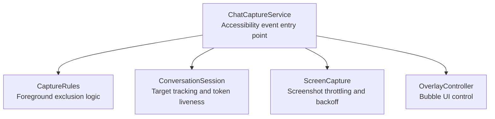
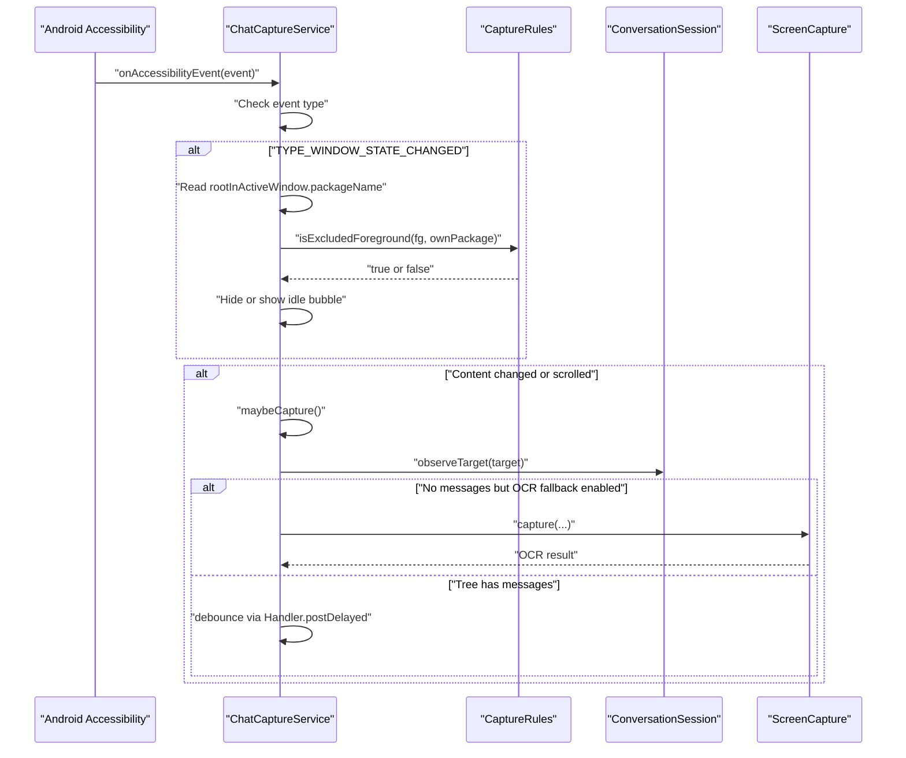
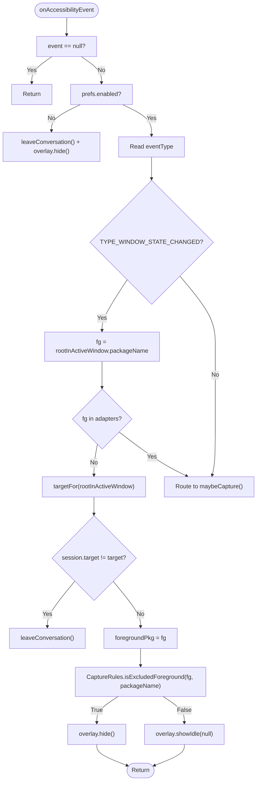
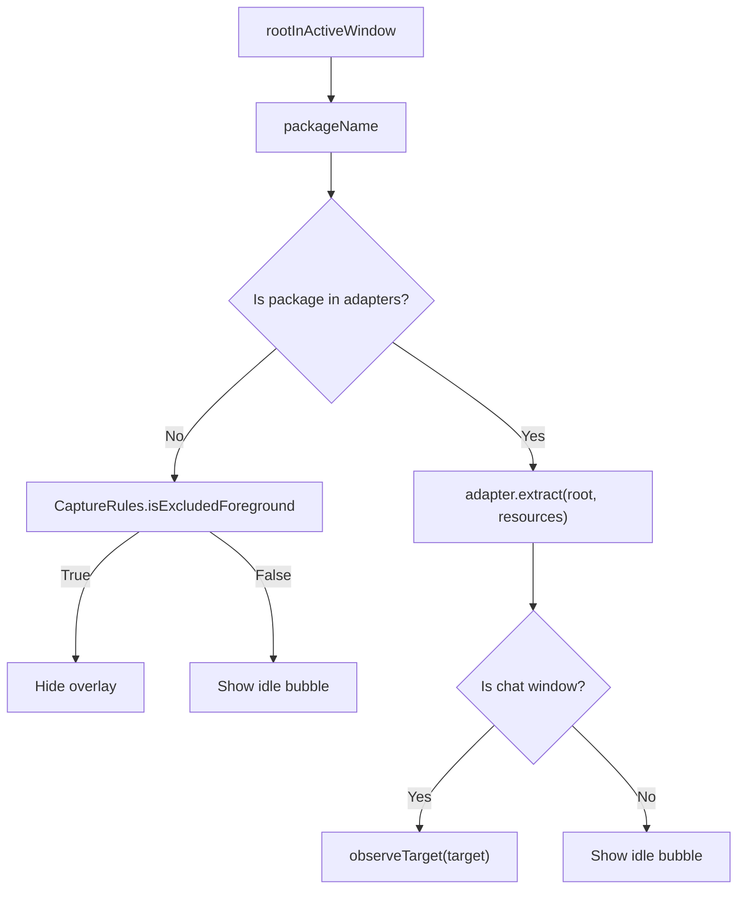
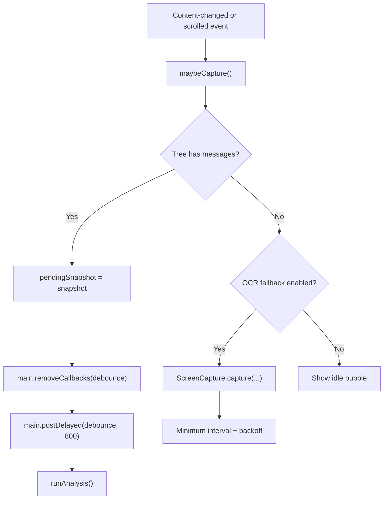
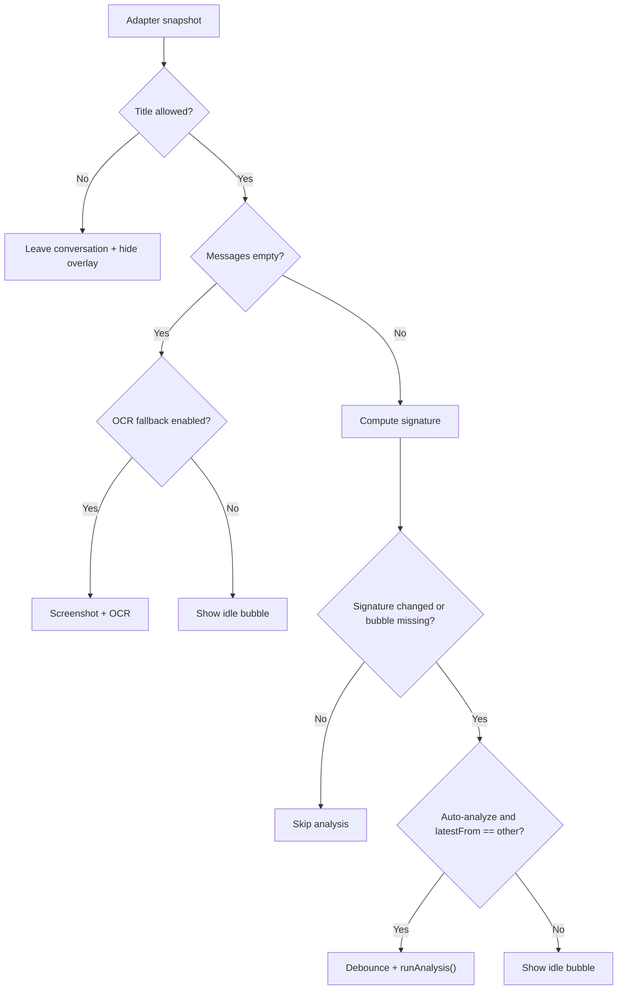
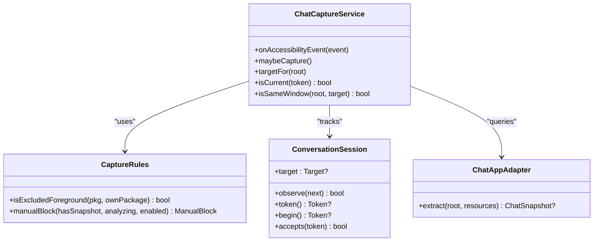
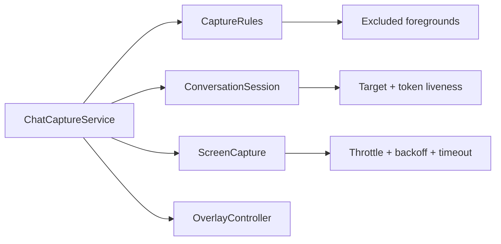

# Event Handling and Filtering

<cite>
**Referenced Files in This Document**   
- [ChatCaptureService.kt](file://app/src/main/java/com/jev/probe/capture/ChatCaptureService.kt)
- [CaptureRules.kt](file://app/src/main/java/com/jev/probe/capture/CaptureRules.kt)
- [ConversationSession.kt](file://app/src/main/java/com/jev/probe/capture/ConversationSession.kt)
- [ScreenCapture.kt](file://app/src/main/java/com/jev/probe/capture/ocr/ScreenCapture.kt)
</cite>

## Table of Contents
1. [Introduction](#introduction)
2. [Project Structure](#project-structure)
3. [Core Components](#core-components)
4. [Architecture Overview](#architecture-overview)
5. [Detailed Component Analysis](#detailed-component-analysis)
6. [Dependency Analysis](#dependency-analysis)
7. [Performance Considerations](#performance-considerations)
8. [Troubleshooting Guide](#troubleshooting-guide)
9. [Conclusion](#conclusion)

## Introduction
This document explains how the accessibility service processes and filters system events to detect chat windows, avoid unnecessary work, and keep the floating overlay stable. The focus is on:

- How `onAccessibilityEvent` handles window state changes, content changes, and scroll events.
- How the service determines which application is truly in the foreground using `rootInActiveWindow` and package name matching.
- How event bursts are debounced with `Handler.postDelayed`.
- How filtering rules distinguish chat windows from other screens and decide when to show or hide the overlay bubble.

## Project Structure
The relevant implementation lives under the capture module:

**Diagram sources**
- [ChatCaptureService.kt:43-80](file://app/src/main/java/com/jev/probe/capture/ChatCaptureService.kt#L43-L80)
- [CaptureRules.kt:12-25](file://app/src/main/java/com/jev/probe/capture/CaptureRules.kt#L12-L25)
- [ConversationSession.kt:4-35](file://app/src/main/java/com/jev/probe/capture/ConversationSession.kt#L4-L35)
- [ScreenCapture.kt:178-206](file://app/src/main/java/com/jev/probe/capture/ocr/ScreenCapture.kt#L178-L206)

**Section sources**
- [ChatCaptureService.kt:29-47](file://app/src/main/java/com/jev/probe/capture/ChatCaptureService.kt#L29-L47)
- [CaptureRules.kt:1-25](file://app/src/main/java/com/jev/probe/capture/CaptureRules.kt#L1-L25)
- [ConversationSession.kt:1-35](file://app/src/main/java/com/jev/probe/capture/ConversationSession.kt#L1-L35)

## Core Components
- **ChatCaptureService**: An `AccessibilityService` that receives system accessibility events, identifies the active chat window, updates the overlay, and triggers analysis or OCR when appropriate.
- **CaptureRules**: Pure decision helpers for foreground filtering and manual action blocking.
- **ConversationSession**: Tracks the current conversation target and provides tokens used to validate whether an asynchronous result still belongs to the active session.
- **ScreenCapture**: Wraps screenshot requests, applies a minimum interval, exponential backoff after failures, and timeout handling.

Key responsibilities for this document:
- Event routing in `onAccessibilityEvent`.
- Foreground detection through `rootInActiveWindow`.
- Debouncing rapid UI update storms.
- Chat-window vs non-chat-window filtering.

**Section sources**
- [ChatCaptureService.kt:43-69](file://app/src/main/java/com/jev/probe/capture/ChatCaptureService.kt#L43-L69)
- [CaptureRules.kt:12-38](file://app/src/main/java/com/jev/probe/capture/CaptureRules.kt#L12-L38)
- [ConversationSession.kt:4-35](file://app/src/main/java/com/jev/probe/capture/ConversationSession.kt#L4-L35)
- [ScreenCapture.kt:178-206](file://app/src/main/java/com/jev/probe/capture/ocr/ScreenCapture.kt#L178-L206)

## Architecture Overview
At a high level, the accessibility event pipeline works as follows:

1. Android calls `onAccessibilityEvent` when the UI changes.
2. For window state changes, the service reads the real foreground package from `rootInActiveWindow`.
3. If the foreground is not one of the adapted chat apps, it decides whether to hide or park the idle bubble.
4. For window state changes, content changes, and scroll events, it schedules capture work through `maybeCapture`.
5. `maybeCapture` validates the app, extracts a snapshot, checks whether it is a chat window, and either shows an idle bubble or starts analysis.
6. Rapid content-changed events are debounced so the overlay does not flicker and analysis is not triggered repeatedly.

**Diagram sources**
- [ChatCaptureService.kt:239-360](file://app/src/main/java/com/jev/probe/capture/ChatCaptureService.kt#L239-L360)
- [CaptureRules.kt:19-25](file://app/src/main/java/com/jev/probe/capture/CaptureRules.kt#L19-L25)
- [ConversationSession.kt:17-35](file://app/src/main/java/com/jev/probe/capture/ConversationSession.kt#L17-L35)
- [ScreenCapture.kt:178-206](file://app/src/main/java/com/jev/probe/capture/ocr/ScreenCapture.kt#L178-L206)

## Detailed Component Analysis

### Accessibility Event Processing in `onAccessibilityEvent`
The method is the main entry point for all accessibility events. It performs three important jobs:

1. **Early exit when disabled**: If the service is disabled, it leaves the current conversation and hides the overlay.
2. **Foreground stability check for window state changes**: Instead of trusting the event’s package, it reads `rootInActiveWindow?.packageName`. This avoids flickering when IMEs or status bar events arrive while the chat app remains in the foreground.
3. **Routing of relevant events**: Window state changes, content changes, and view scrolls all trigger `maybeCapture`, which contains the actual filtering and capture logic.

**Diagram sources**
- [ChatCaptureService.kt:239-273](file://app/src/main/java/com/jev/probe/capture/ChatCaptureService.kt#L239-L273)
- [CaptureRules.kt:19-25](file://app/src/main/java/com/jev/probe/capture/CaptureRules.kt#L19-L25)

**Section sources**
- [ChatCaptureService.kt:239-273](file://app/src/main/java/com/jev/probe/capture/ChatCaptureService.kt#L239-L273)

### Window Detection Using `rootInActiveWindow` and Package Matching
The service distinguishes between:

- **Adapted chat applications**: Apps with explicit adapters (for example QQ, X/Twitter, Feishu, WeChat).
- **Unadapted applications**: Apps without an adapter; automatic capture is disabled, but the bubble can still be used for manual OCR.
- **System and launcher screens**: Where the bubble should be hidden because it would interfere with system UI.

The key detection steps are:

1. On `TYPE_WINDOW_STATE_CHANGED`, read the real foreground package from `rootInActiveWindow`.
2. If the package is not in the set of adapted adapters, treat it as a non-chat foreground.
3. Use `CaptureRules.isExcludedForeground` to decide whether to hide the bubble or show an idle bubble.
4. When inside an adapted app, use the adapter’s `extract` method to determine whether the current screen is a chat window.

**Diagram sources**
- [ChatCaptureService.kt:256-266](file://app/src/main/java/com/jev/probe/capture/ChatCaptureService.kt#L256-L266)
- [ChatCaptureService.kt:275-300](file://app/src/main/java/com/jev/probe/capture/ChatCaptureService.kt#L275-L300)
- [CaptureRules.kt:19-25](file://app/src/main/java/com/jev/probe/capture/CaptureRules.kt#L19-L25)

**Section sources**
- [ChatCaptureService.kt:256-300](file://app/src/main/java/com/jev/probe/capture/ChatCaptureService.kt#L256-L300)
- [CaptureRules.kt:19-25](file://app/src/main/java/com/jev/probe/capture/CaptureRules.kt#L19-L25)

### Event Debouncing Strategy with `Handler.postDelayed`
Rapid UI updates—such as caret blinking, presence indicators, or frequent content-changed events—can cause many captures and analyses if not controlled. The service uses two layers of protection:

1. **Main-thread debounce for tree-based snapshots**:  
   - `main.removeCallbacks(debounce)` clears any pending debounce task.
   - `main.postDelayed(debounce, 800)` schedules `runAnalysis()` after 800 milliseconds.
   - This prevents multiple content-changed events from triggering repeated analysis.

2. **OCR path throttling**:  
   - `ScreenCapture` enforces a minimum interval between screenshots.
   - It also applies exponential backoff after repeated failures and a timeout watchdog.

**Diagram sources**
- [ChatCaptureService.kt:351-360](file://app/src/main/java/com/jev/probe/capture/ChatCaptureService.kt#L351-L360)
- [ScreenCapture.kt:178-206](file://app/src/main/java/com/jev/probe/capture/ocr/ScreenCapture.kt#L178-L206)

**Section sources**
- [ChatCaptureService.kt:178-181](file://app/src/main/java/com/jev/probe/capture/ChatCaptureService.kt#L178-L181)
- [ChatCaptureService.kt:351-360](file://app/src/main/java/com/jev/probe/capture/ChatCaptureService.kt#L351-L360)
- [ScreenCapture.kt:178-206](file://app/src/main/java/com/jev/probe/capture/ocr/ScreenCapture.kt#L178-L206)

### Event Filtering Rules and Chat Window Distinction
The service applies several filtering rules before deciding what to show or analyze:

| Rule | Behavior | Purpose |
|---|---|---|
| Service disabled | Leaves conversation and hides overlay | Prevents work when the feature is turned off |
| Not an adapted app | No automatic capture; only manual OCR via bubble | Avoids unsupported apps |
| Excluded foreground | Hides overlay | Keeps system UI and launcher clean |
| Adapter returns no snapshot | Shows idle bubble | Keeps the bubble reachable even outside a chat window |
| Title not allowed by preferences | Leaves conversation and hides overlay | Honors user allowlist settings |
| Tree has no messages but OCR fallback enabled | Screenshot and OCR | Handles apps like Feishu where text is drawn instead of exposed |
| Latest message is not from the other person | Shows idle bubble | Only auto-analyze incoming messages |
| Same signature and bubble already shown | Skip analysis | Deduplicate identical conversations |

**Diagram sources**
- [ChatCaptureService.kt:275-360](file://app/src/main/java/com/jev/probe/capture/ChatCaptureService.kt#L275-L360)

**Section sources**
- [ChatCaptureService.kt:275-360](file://app/src/main/java/com/jev/probe/capture/ChatCaptureService.kt#L275-L360)

### How the Service Distinguishes Between Chat Windows and Other Screens
The distinction happens at two levels:

1. **App-level filtering**:  
   - The service first checks whether the foreground package is one of the adapted chat apps.
   - If not, it relies on the bubble menu for manual OCR rather than automatic capture.

2. **Screen-level filtering**:  
   - Each adapter’s `extract` method returns a snapshot only when the current screen looks like a chat window.
   - If the snapshot is null, the service treats the screen as a list, profile, settings, or similar non-chat screen.
   - In those cases, it parks an idle bubble so the user can still manually trigger actions.

**Diagram sources**
- [ChatCaptureService.kt:106-152](file://app/src/main/java/com/jev/probe/capture/ChatCaptureService.kt#L106-L152)
- [ChatCaptureService.kt:275-300](file://app/src/main/java/com/jev/probe/capture/ChatCaptureService.kt#L275-L300)
- [CaptureRules.kt:19-38](file://app/src/main/java/com/jev/probe/capture/CaptureRules.kt#L19-L38)
- [ConversationSession.kt:4-35](file://app/src/main/java/com/jev/probe/capture/ConversationSession.kt#L4-L35)

**Section sources**
- [ChatCaptureService.kt:106-152](file://app/src/main/java/com/jev/probe/capture/ChatCaptureService.kt#L106-L152)
- [ChatCaptureService.kt:275-300](file://app/src/main/java/com/jev/probe/capture/ChatCaptureService.kt#L275-L300)
- [CaptureRules.kt:19-38](file://app/src/main/java/com/jev/probe/capture/CaptureRules.kt#L19-L38)
- [ConversationSession.kt:4-35](file://app/src/main/java/com/jev/probe/capture/ConversationSession.kt#L4-L35)

## Dependency Analysis
The event processing flow depends on several components working together:

- `ChatCaptureService` owns the lifecycle, event routing, and overlay coordination.
- `CaptureRules` centralizes pure decisions about excluded foregrounds and manual action blocking.
- `ConversationSession` ensures asynchronous results are applied only to the correct conversation.
- `ScreenCapture` protects against excessive screenshot requests and system callback failures.

**Diagram sources**
- [ChatCaptureService.kt:43-80](file://app/src/main/java/com/jev/probe/capture/ChatCaptureService.kt#L43-L80)
- [CaptureRules.kt:12-38](file://app/src/main/java/com/jev/probe/capture/CaptureRules.kt#L12-L38)
- [ConversationSession.kt:4-35](file://app/src/main/java/com/jev/probe/capture/ConversationSession.kt#L4-L35)
- [ScreenCapture.kt:178-206](file://app/src/main/java/com/jev/probe/capture/ocr/ScreenCapture.kt#L178-L206)

**Section sources**
- [ChatCaptureService.kt:43-80](file://app/src/main/java/com/jev/probe/capture/ChatCaptureService.kt#L43-L80)
- [CaptureRules.kt:12-38](file://app/src/main/java/com/jev/probe/capture/CaptureRules.kt#L12-L38)
- [ConversationSession.kt:4-35](file://app/src/main/java/com/jev/probe/capture/ConversationSession.kt#L4-L35)
- [ScreenCapture.kt:178-206](file://app/src/main/java/com/jev/probe/capture/ocr/ScreenCapture.kt#L178-L206)

## Performance Considerations
- **Debouncing reduces analysis storms**: By removing previous callbacks and posting a delayed runnable, the service avoids running analysis for every single content-changed event.
- **OCR throttling prevents screenshot floods**: `ScreenCapture` enforces a minimum interval and increases the interval after repeated failures.
- **Signature deduplication avoids redundant work**: If the conversation signature and overlay state have not changed, the service skips analysis.
- **Worker thread isolation**: Heavy tasks such as context building and network calls are submitted to worker threads, while UI updates remain on the main thread.

[No sources needed since this section provides general guidance]

## Troubleshooting Guide
Common issues and their likely causes:

| Symptom | Likely Cause | Recommended Check |
|---|---|---|
| Bubble disappears when keyboard appears | Event package was being used instead of `rootInActiveWindow` | Verify window state change uses `rootInActiveWindow.packageName` |
| Bubble flickers on IME input | Relying on event package instead of real foreground | Confirm foreground detection ignores IME packages |
| Automatic capture never starts | App has no adapter or screen is not a chat window | Check adapter extraction and title/message presence |
| Too many screenshots | OCR fallback triggered too often | Verify OCR signature and `ocrBusy` guard |
| Analysis runs too frequently | Missing debounce or repeated content-changed events | Confirm `removeCallbacks(debounce)` and `postDelayed` usage |
| Overlay stays visible after leaving app | Session target mismatch not handled | Check `leaveConversation` and `isCurrent` behavior |

**Section sources**
- [ChatCaptureService.kt:239-360](file://app/src/main/java/com/jev/probe/capture/ChatCaptureService.kt#L239-L360)
- [ScreenCapture.kt:178-206](file://app/src/main/java/com/jev/probe/capture/ocr/ScreenCapture.kt#L178-L206)

## Conclusion
The accessibility event processing layer in this project is designed around stability, clarity, and performance. It prefers the real foreground window over event metadata, separates chat-app detection from chat-screen detection, and uses both main-thread debouncing and screenshot throttling to prevent UI update storms. Filtering rules ensure the overlay behaves predictably across chat apps, system UI, launchers, and unadapted applications.

[No sources needed since this section summarizes without analyzing specific files]