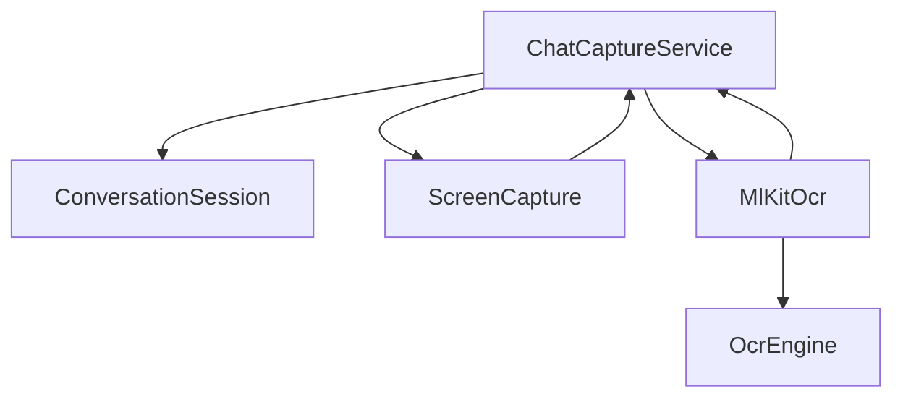
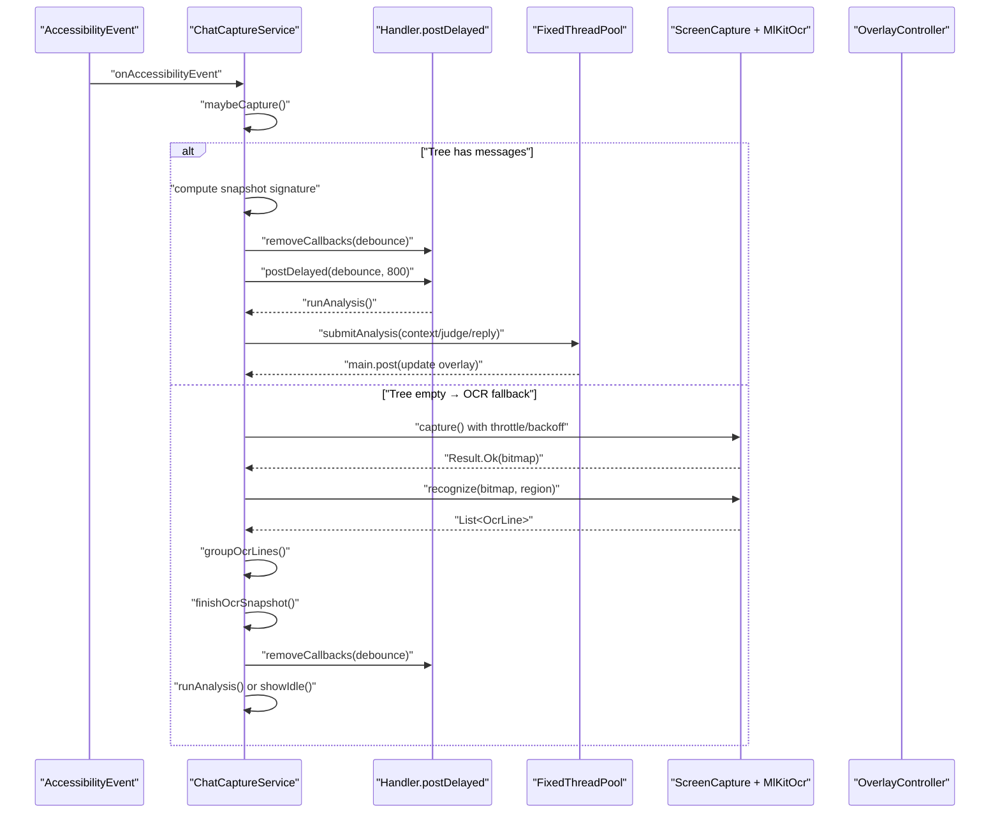
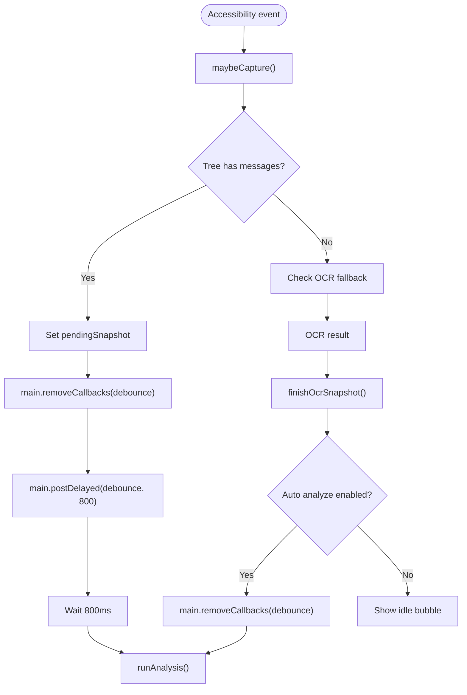
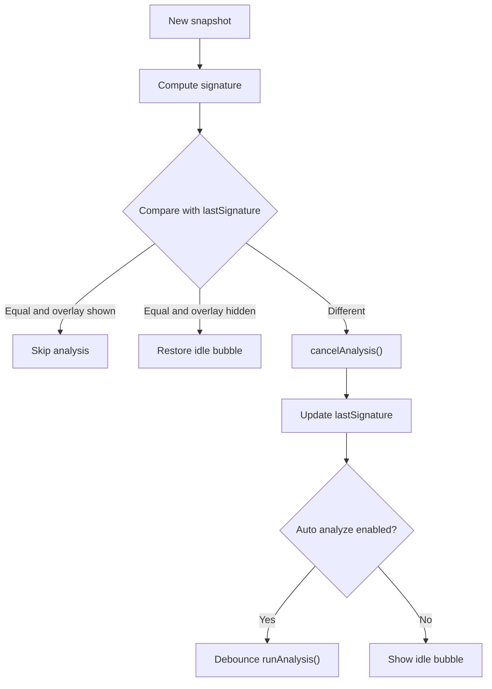
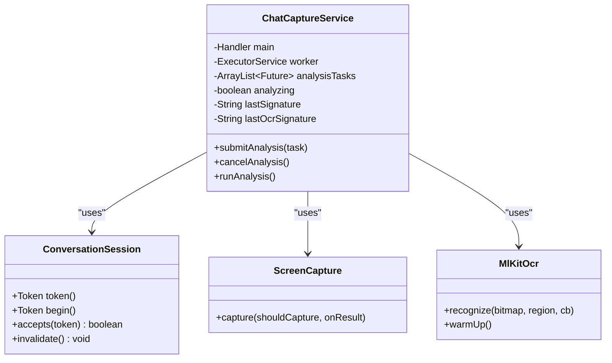
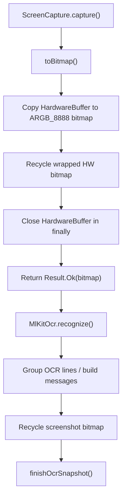
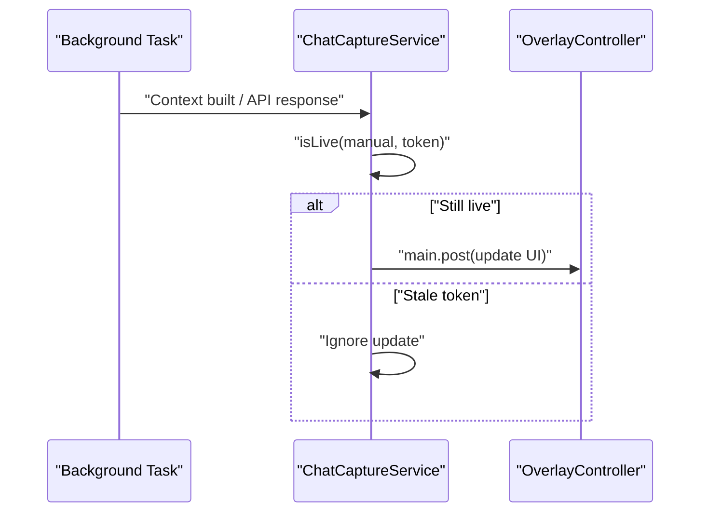
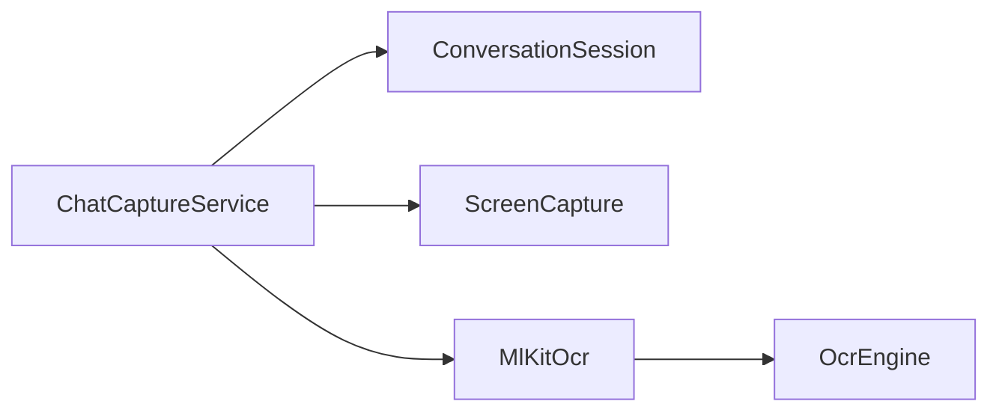

# Performance Optimization Techniques

<cite>
**Referenced Files in This Document**   
- [ChatCaptureService.kt](file://app/src/main/java/com/jev/probe/capture/ChatCaptureService.kt)
- [ConversationSession.kt](file://app/src/main/java/com/jev/probe/capture/ConversationSession.kt)
- [ScreenCapture.kt](file://app/src/main/java/com/jev/probe/capture/ocr/ScreenCapture.kt)
- [OcrEngine.kt](file://app/src/main/java/com/jev/probe/capture/ocr/OcrEngine.kt)
- [MlKitOcr.kt](file://app/src/main/java/com/jev/probe/capture/ocr/MlKitOcr.kt)
</cite>

## Table of Contents
1. [Introduction](#introduction)
2. [Project Structure](#project-structure)
3. [Core Components](#core-components)
4. [Architecture Overview](#architecture-overview)
5. [Detailed Component Analysis](#detailed-component-analysis)
6. [Dependency Analysis](#dependency-analysis)
7. [Performance Considerations](#performance-considerations)
8. [Troubleshooting Guide](#troubleshooting-guide)
9. [Conclusion](#conclusion)

## Introduction
This document explains the performance optimization strategies implemented by the accessibility service that captures chat content, performs OCR when needed, and runs AI analysis off the main thread. The focus is on:
- Debouncing analysis requests using `main.removeCallbacks(debounce)` and `Handler.postDelayed`.
- Signature-based deduplication through `lastSignature` and `lastOcrSignature`.
- Worker thread pool usage for background processing and safe cancellation.
- Memory management practices including bitmap recycling and resource cleanup.
- Monitoring and optimization techniques used to prevent UI jank and memory leaks.

These optimizations are critical because an accessibility service can receive many rapid events, must avoid blocking the UI thread, and must not leak bitmaps or hold stale callbacks after a conversation changes.

## Project Structure
The performance-critical code lives under the capture module:
- `ChatCaptureService.kt`: Main orchestration, event handling, debouncing, deduplication, worker submission, OCR flow, and overlay coordination.
- `ConversationSession.kt`: Session token model that prevents stale callbacks from overwriting newer conversations.
- `ScreenCapture.kt`: Screenshot throttling, exponential backoff, timeout handling, and hardware buffer-to-bitmap conversion with strict cleanup.
- `OcrEngine.kt`: Interface defining the OCR contract.
- `MlKitOcr.kt`: ML Kit-based OCR implementation with warm-up, coordinate mapping, and main-thread callback delivery.

**Diagram sources**
- [ChatCaptureService.kt:43-200](file://app/src/main/java/com/jev/probe/capture/ChatCaptureService.kt#L43-L200)
- [ConversationSession.kt:4-35](file://app/src/main/java/com/jev/probe/capture/ConversationSession.kt#L4-L35)
- [ScreenCapture.kt:35-93](file://app/src/main/java/com/jev/probe/capture/ocr/ScreenCapture.kt#L35-L93)
- [OcrEngine.kt:20-22](file://app/src/main/java/com/jev/probe/capture/ocr/OcrEngine.kt#L20-L22)
- [MlKitOcr.kt:26-112](file://app/src/main/java/com/jev/probe/capture/ocr/MlKitOcr.kt#L26-L112)

**Section sources**
- [ChatCaptureService.kt:43-200](file://app/src/main/java/com/jev/probe/capture/ChatCaptureService.kt#L43-L200)
- [ConversationSession.kt:4-35](file://app/src/main/java/com/jev/probe/capture/ConversationSession.kt#L4-L35)
- [ScreenCapture.kt:35-93](file://app/src/main/java/com/jev/probe/capture/ocr/ScreenCapture.kt#L35-L93)
- [OcrEngine.kt:20-22](file://app/src/main/java/com/jev/probe/capture/ocr/OcrEngine.kt#L20-L22)
- [MlKitOcr.kt:26-112](file://app/src/main/java/com/jev/probe/capture/ocr/MlKitOcr.kt#L26-L112)

## Core Components
- **Debounced analysis trigger**: A `Runnable` named `debounce` is posted to the main handler with a delay; repeated events remove the previous callback and reschedule it, ensuring only one analysis runs per burst.
- **Signature-based deduplication**: Two signature fields keep track of what has already been processed:
  - `lastSignature` for tree-based snapshots.
  - `lastOcrSignature` for screenshot + OCR results.
- **Worker thread pool**: A fixed-size thread pool executes context building, judgment, and reply generation off the main thread. Tasks are tracked so they can be cancelled when the conversation changes.
- **OCR pipeline**: Screenshot throttling, exponential backoff, timeout protection, bitmap conversion, and explicit bitmap recycling.
- **Session tokening**: `ConversationSession` ensures old callbacks cannot overwrite newer conversation state.

**Section sources**
- [ChatCaptureService.kt:63-87](file://app/src/main/java/com/jev/probe/capture/ChatCaptureService.kt#L63-L87)
- [ChatCaptureService.kt:178-181](file://app/src/main/java/com/jev/probe/capture/ChatCaptureService.kt#L178-L181)
- [ChatCaptureService.kt:331-359](file://app/src/main/java/com/jev/probe/capture/ChatCaptureService.kt#L331-L359)
- [ChatCaptureService.kt:389-455](file://app/src/main/java/com/jev/probe/capture/ChatCaptureService.kt#L389-L455)
- [ConversationSession.kt:4-35](file://app/src/main/java/com/jev/probe/capture/ConversationSession.kt#L4-L35)

## Architecture Overview
The service coordinates three major performance-sensitive paths:
1. **Tree path**: Extracts messages directly from the accessibility tree. If messages exist, it computes a snapshot signature and debounces analysis.
2. **OCR fallback path**: When the tree provides no message text, it takes a screenshot, runs OCR, groups lines into pseudo-bubbles, and then either analyzes automatically or parks an idle bubble.
3. **Background analysis path**: Builds context, calls judgment and draft/ranking APIs, and updates the overlay on the main thread.

**Diagram sources**
- [ChatCaptureService.kt:239-360](file://app/src/main/java/com/jev/probe/capture/ChatCaptureService.kt#L239-L360)
- [ChatCaptureService.kt:389-455](file://app/src/main/java/com/jev/probe/capture/ChatCaptureService.kt#L389-L455)
- [ChatCaptureService.kt:548-702](file://app/src/main/java/com/jev/probe/capture/ChatCaptureService.kt#L548-L702)
- [ScreenCapture.kt:66-93](file://app/src/main/java/com/jev/probe/capture/ocr/ScreenCapture.kt#L66-L93)
- [MlKitOcr.kt:39-95](file://app/src/main/java/com/jev/probe/capture/ocr/MlKitOcr.kt#L39-L95)

## Detailed Component Analysis

### Debouncing Mechanism Using `main.removeCallbacks(debounce)` and `Handler.postDelayed`
The service uses a single `Runnable` named `debounce` that invokes `runAnalysis()`. Every time a relevant accessibility event arrives, the service removes any pending debounce task and schedules a new one after a fixed delay. This collapses bursts of `TYPE_WINDOW_CONTENT_CHANGED` and `TYPE_VIEW_SCROLLED` events into one analysis attempt.

Key behaviors:
- `main.removeCallbacks(debounce)` cancels the previously scheduled analysis.
- `main.postDelayed(debounce, 800)` schedules the next analysis after 800 milliseconds.
- `cancelAnalysis()` also removes the debounce callback when switching conversations or invalidating state.
- The OCR path also uses the same pattern when automatic OCR analysis is enabled.

**Diagram sources**
- [ChatCaptureService.kt:357-359](file://app/src/main/java/com/jev/probe/capture/ChatCaptureService.kt#L357-L359)
- [ChatCaptureService.kt:693-701](file://app/src/main/java/com/jev/probe/capture/ChatCaptureService.kt#L693-L701)
- [ChatCaptureService.kt:78-87](file://app/src/main/java/com/jev/probe/capture/ChatCaptureService.kt#L78-L87)

**Section sources**
- [ChatCaptureService.kt:78-87](file://app/src/main/java/com/jev/probe/capture/ChatCaptureService.kt#L78-L87)
- [ChatCaptureService.kt:178-181](file://app/src/main/java/com/jev/probe/capture/ChatCaptureService.kt#L178-L181)
- [ChatCaptureService.kt:357-359](file://app/src/main/java/com/jev/probe/capture/ChatCaptureService.kt#L357-L359)
- [ChatCaptureService.kt:693-701](file://app/src/main/java/com/jev/probe/capture/ChatCaptureService.kt#L693-L701)

### Signature-Based Deduplication System
Two signature fields prevent redundant work:
- `lastSignature`: Tracks the latest tree-based snapshot signature. It is reset when the active package changes, preventing two different apps from sharing the same deduplication state.
- `lastOcrSignature`: Tracks the last screenshot + OCR state. It is computed from the package, title, and bubble rectangle geometry, so scrolling or small chrome changes do not repeatedly trigger screenshots.

Deduplication rules:
- If the current signature equals `lastSignature` and the overlay is already showing, the service does nothing.
- If the current signature equals `lastSignature` but the overlay is gone, it restores the idle bubble without re-analyzing.
- For OCR, if the computed signature equals `lastOcrSignature` and the overlay is showing, the shot is skipped.
- On failed screenshots (non-manual), `lastOcrSignature` is cleared so future events can retry within the global throttle/backoff window.

**Diagram sources**
- [ChatCaptureService.kt:331-349](file://app/src/main/java/com/jev/probe/capture/ChatCaptureService.kt#L331-L349)
- [ChatCaptureService.kt:680-691](file://app/src/main/java/com/jev/probe/capture/ChatCaptureService.kt#L680-L691)

**Section sources**
- [ChatCaptureService.kt:63-68](file://app/src/main/java/com/jev/probe/capture/ChatCaptureService.kt#L63-L68)
- [ChatCaptureService.kt:200-200](file://app/src/main/java/com/jev/probe/capture/ChatCaptureService.kt#L200-L200)
- [ChatCaptureService.kt:322-349](file://app/src/main/java/com/jev/probe/capture/ChatCaptureService.kt#L322-L349)
- [ChatCaptureService.kt:535-541](file://app/src/main/java/com/jev/probe/capture/ChatCaptureService.kt#L535-L541)
- [ChatCaptureService.kt:680-691](file://app/src/main/java/com/jev/probe/capture/ChatCaptureService.kt#L680-L691)

### Worker Thread Pool Utilization and Resource Cleanup
The service uses a fixed-size thread pool to execute heavy work off the main thread:
- Context building, judgment, and reply ranking are submitted via `submitAnalysis`, which wraps `worker.submit(task)`.
- Rejected tasks are ignored rather than crashing the process, protecting against stale callbacks after teardown.
- Active analysis tasks are stored in `analysisTasks` and cancelled when the conversation changes.
- `analyzing` and session tokens ensure only one valid analysis proceeds at a time per session.

**Diagram sources**
- [ChatCaptureService.kt:45-68](file://app/src/main/java/com/jev/probe/capture/ChatCaptureService.kt#L45-L68)
- [ChatCaptureService.kt:168-176](file://app/src/main/java/com/jev/probe/capture/ChatCaptureService.kt#L168-L176)
- [ChatCaptureService.kt:389-455](file://app/src/main/java/com/jev/probe/capture/ChatCaptureService.kt#L389-L455)
- [ConversationSession.kt:4-35](file://app/src/main/java/com/jev/probe/capture/ConversationSession.kt#L4-L35)
- [ScreenCapture.kt:35-93](file://app/src/main/java/com/jev/probe/capture/ocr/ScreenCapture.kt#L35-L93)
- [MlKitOcr.kt:26-112](file://app/src/main/java/com/jev/probe/capture/ocr/MlKitOcr.kt#L26-L112)

**Section sources**
- [ChatCaptureService.kt:45-46](file://app/src/main/java/com/jev/probe/capture/ChatCaptureService.kt#L45-L46)
- [ChatCaptureService.kt:55-59](file://app/src/main/java/com/jev/probe/capture/ChatCaptureService.kt#L55-L59)
- [ChatCaptureService.kt:78-87](file://app/src/main/java/com/jev/probe/capture/ChatCaptureService.kt#L78-L87)
- [ChatCaptureService.kt:168-176](file://app/src/main/java/com/jev/probe/capture/ChatCaptureService.kt#L168-L176)
- [ChatCaptureService.kt:389-455](file://app/src/main/java/com/jev/probe/capture/ChatCaptureService.kt#L389-L455)
- [ConversationSession.kt:4-35](file://app/src/main/java/com/jev/probe/capture/ConversationSession.kt#L4-L35)

### Memory Management Practices: Bitmap Recycling and Object Lifecycle
Memory safety is handled at multiple layers:
- **Screenshot buffers**: `ScreenCapture.toBitmap` copies hardware buffers into software bitmaps and closes the original `HardwareBuffer` in a `finally` block.
- **Bitmap recycling**: Both OCR paths explicitly recycle the screenshot bitmap after recognition completes.
- **Failed screenshot handling**: If a screenshot fails and the conversation is no longer live, the bitmap is recycled immediately before clearing the busy flag.
- **OCR warm-up**: The ML Kit recognizer is warmed up on a worker thread during service connection so the first real OCR does not pay the model-loading cost on the main thread.
- **Overlay lifecycle**: The overlay is hidden before taking a screenshot and restored afterward, even on timeouts or failures, preventing UI state leaks.

**Diagram sources**
- [ScreenCapture.kt:155-176](file://app/src/main/java/com/jev/probe/capture/ocr/ScreenCapture.kt#L155-L176)
- [ChatCaptureService.kt:590-623](file://app/src/main/java/com/jev/probe/capture/ChatCaptureService.kt#L590-L623)
- [ChatCaptureService.kt:553-557](file://app/src/main/java/com/jev/probe/capture/ChatCaptureService.kt#L553-L557)
- [MlKitOcr.kt:100-112](file://app/src/main/java/com/jev/probe/capture/ocr/MlKitOcr.kt#L100-L112)

**Section sources**
- [ScreenCapture.kt:155-176](file://app/src/main/java/com/jev/probe/capture/ocr/ScreenCapture.kt#L155-L176)
- [ChatCaptureService.kt:553-557](file://app/src/main/java/com/jev/probe/capture/ChatCaptureService.kt#L553-L557)
- [ChatCaptureService.kt:590-623](file://app/src/main/java/com/jev/probe/capture/ChatCaptureService.kt#L590-L623)
- [MlKitOcr.kt:100-112](file://app/src/main/java/com/jev/probe/capture/ocr/MlKitOcr.kt#L100-L112)

### Preventing UI Jank and Stale Callbacks
UI responsiveness is protected by:
- Running heavy work off the main thread.
- Posting overlay updates back to the main thread only after background work finishes.
- Using `isLive(manual, token)` checks before updating the UI, so callbacks from expired sessions do not affect the current conversation.
- Cancelling pending debounce tasks and analysis tasks when the conversation changes.
- Using a relaxed liveness rule for manual captures while still rejecting truly stale tokens.

**Diagram sources**
- [ChatCaptureService.kt:406-453](file://app/src/main/java/com/jev/probe/capture/ChatCaptureService.kt#L406-L453)
- [ConversationSession.kt:26-34](file://app/src/main/java/com/jev/probe/capture/ConversationSession.kt#L26-L34)

**Section sources**
- [ChatCaptureService.kt:406-453](file://app/src/main/java/com/jev/probe/capture/ChatCaptureService.kt#L406-L453)
- [ConversationSession.kt:26-34](file://app/src/main/java/com/jev/probe/capture/ConversationSession.kt#L26-L34)

## Dependency Analysis
The performance-critical dependencies form a layered structure:
- `ChatCaptureService` depends on `ConversationSession` for tokening, `ScreenCapture` for throttled screenshots, and `MlKitOcr` for text recognition.
- `MlKitOcr` implements `OcrEngine` and posts results to the main thread.
- `ScreenCapture` manages system-level screenshot behavior, throttling, and resource cleanup.

**Diagram sources**
- [ChatCaptureService.kt:43-200](file://app/src/main/java/com/jev/probe/capture/ChatCaptureService.kt#L43-L200)
- [ConversationSession.kt:4-35](file://app/src/main/java/com/jev/probe/capture/ConversationSession.kt#L4-L35)
- [ScreenCapture.kt:35-93](file://app/src/main/java/com/jev/probe/capture/ocr/ScreenCapture.kt#L35-L93)
- [OcrEngine.kt:20-22](file://app/src/main/java/com/jev/probe/capture/ocr/OcrEngine.kt#L20-L22)
- [MlKitOcr.kt:26-112](file://app/src/main/java/com/jev/probe/capture/ocr/MlKitOcr.kt#L26-L112)

**Section sources**
- [ChatCaptureService.kt:43-200](file://app/src/main/java/com/jev/probe/capture/ChatCaptureService.kt#L43-L200)
- [ConversationSession.kt:4-35](file://app/src/main/java/com/jev/probe/capture/ConversationSession.kt#L4-L35)
- [ScreenCapture.kt:35-93](file://app/src/main/java/com/jev/probe/capture/ocr/ScreenCapture.kt#L35-L93)
- [OcrEngine.kt:20-22](file://app/src/main/java/com/jev/probe/capture/ocr/OcrEngine.kt#L20-L22)
- [MlKitOcr.kt:26-112](file://app/src/main/java/com/jev/probe/capture/ocr/MlKitOcr.kt#L26-L112)

## Performance Considerations
- **Event burst reduction**: Debouncing analysis with an 800ms delay prevents rapid content-changed events from triggering repeated network calls or UI updates.
- **Screenshot throttling**: `ScreenCapture` enforces a minimum 1-second interval between attempts and applies exponential backoff up to 30 seconds on repeated failures.
- **Avoiding unnecessary OCR**: `lastOcrSignature` prevents repeated screenshots when only chrome elements change.
- **Main-thread safety**: All overlay updates and OCR callbacks are posted to the main thread, avoiding race conditions and UI jank.
- **Resource cleanup**: Hardware buffers, wrapped bitmaps, and screenshot bitmaps are closed or recycled in all success and failure paths.
- **Cancellation safety**: Pending debounce tasks and analysis futures are cancelled when the conversation changes, preventing stale work from affecting the UI.
- **Warm-up strategy**: ML Kit model loading happens off the main thread during service connection, reducing first-use latency.

[No sources needed since this section provides general guidance]

## Troubleshooting Guide
Common performance-related issues and their signals:
- **Repeated screenshots despite user inactivity**: Check whether `ocrFallback` is enabled and whether `lastOcrSignature` is being updated correctly. If the tree is always empty, the service may fall back to OCR on every scroll tick unless the signature gate works.
- **UI freezes during OCR**: Ensure `MlKitOcr.warmUp()` is called on a worker thread and that OCR callbacks are posted to the main thread.
- **Memory growth or crashes after repeated captures**: Verify that both `ScreenCapture.toBitmap` and the OCR paths recycle bitmaps and close hardware buffers.
- **Stale overlay updates after switching chats**: Confirm that `ConversationSession.token()` and `isLive(manual, token)` are checked before overlay updates.
- **Analysis never runs after scrolling**: Check whether `main.removeCallbacks(debounce)` and `main.postDelayed(debounce, 800)` are executed and whether `pendingSnapshot` is set.

**Section sources**
- [ChatCaptureService.kt:308-327](file://app/src/main/java/com/jev/probe/capture/ChatCaptureService.kt#L308-L327)
- [ChatCaptureService.kt:548-587](file://app/src/main/java/com/jev/probe/capture/ChatCaptureService.kt#L548-L587)
- [ScreenCapture.kt:155-176](file://app/src/main/java/com/jev/probe/capture/ocr/ScreenCapture.kt#L155-L176)
- [MlKitOcr.kt:100-112](file://app/src/main/java/com/jev/probe/capture/ocr/MlKitOcr.kt#L100-L112)
- [ChatCaptureService.kt:406-453](file://app/src/main/java/com/jev/probe/capture/ChatCaptureService.kt#L406-L453)

## Conclusion
The accessibility service implements a robust set of performance optimizations tailored to Android’s event-driven environment:
- Debouncing reduces analysis frequency during rapid UI updates.
- Signature-based deduplication avoids redundant work across both tree and OCR paths.
- Worker threads keep heavy operations off the main thread while preserving UI consistency through token validation.
- Strict memory management prevents bitmap leaks and compositor pressure.
- Throttling, backoff, and timeout handling make the OCR path resilient against platform limitations.

Together, these techniques minimize UI jank, reduce unnecessary network and OCR work, and protect against memory leaks and stale state after conversation switches.

[No sources needed since this section summarizes without analyzing specific files]