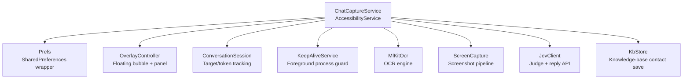
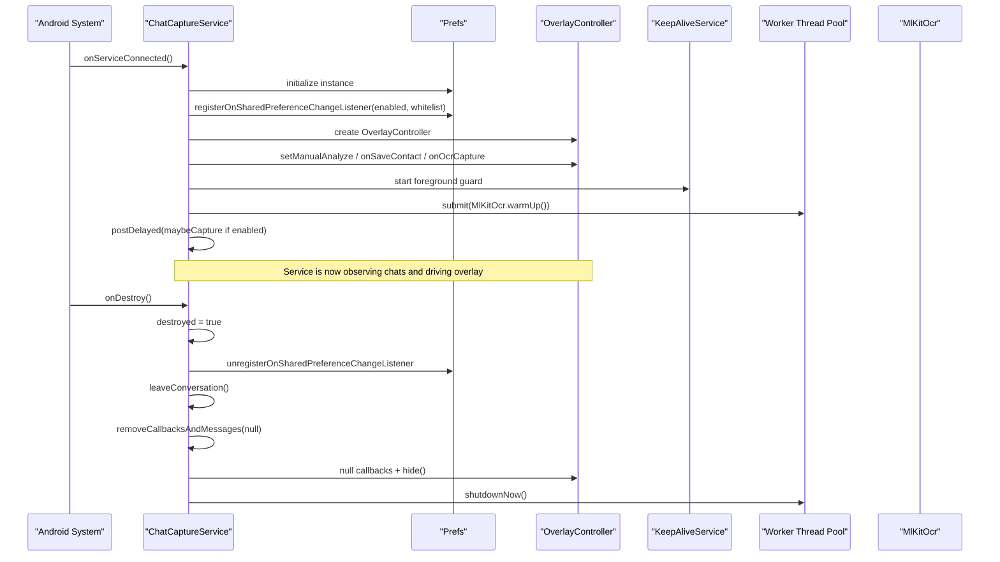
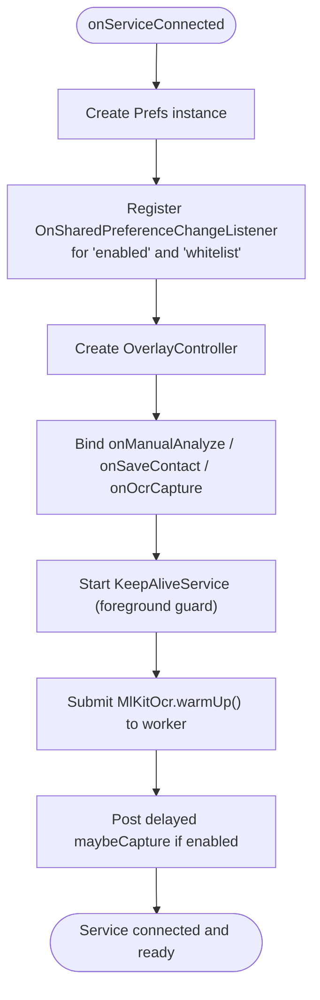
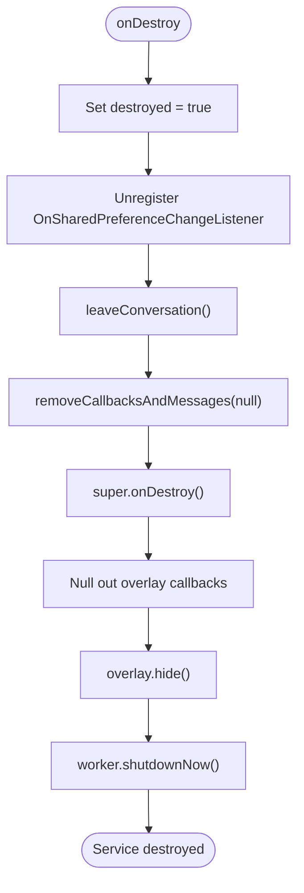
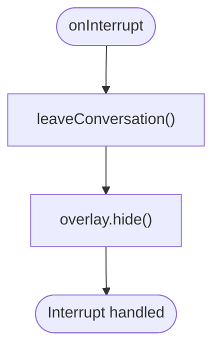
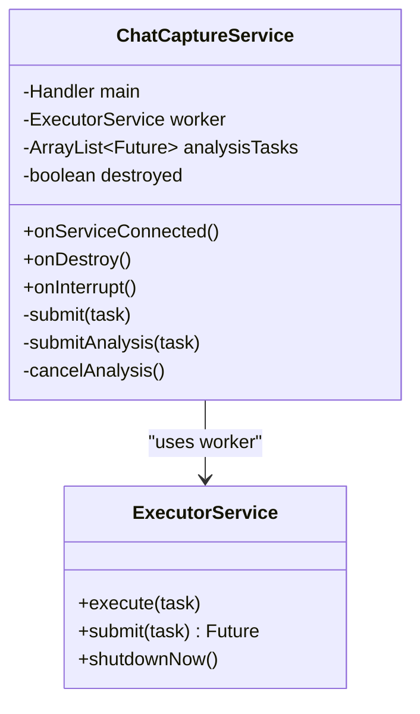
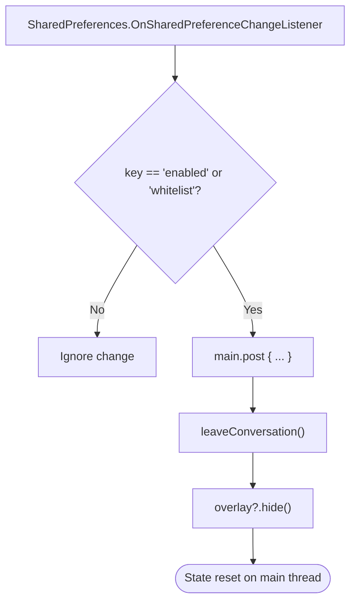
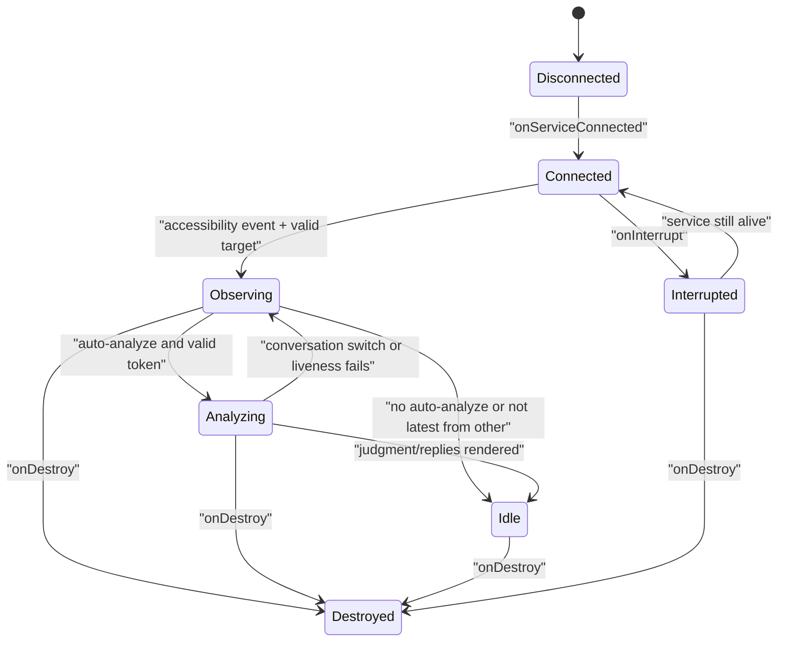
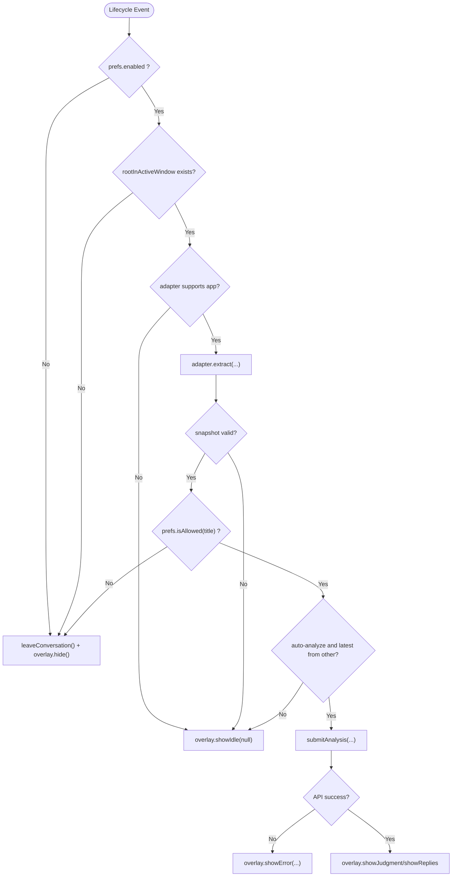
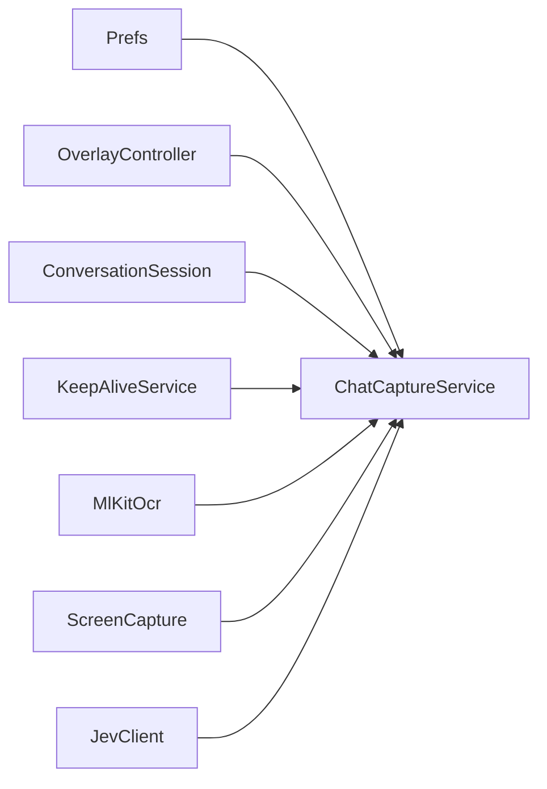

# Service Lifecycle Management

<cite>
**Referenced Files in This Document**
- [ChatCaptureService.kt](file://app/src/main/java/com/jev/probe/capture/ChatCaptureService.kt)
- [Prefs.kt](file://app/src/main/java/com/jev/probe/core/Prefs.kt)
- [OverlayController.kt](file://app/src/main/java/com/jev/probe/overlay/OverlayController.kt)
</cite>

## Table of Contents
1. [Introduction](#introduction)
2. [Project Structure](#project-structure)
3. [Core Components](#core-components)
4. [Architecture Overview](#architecture-overview)
5. [Detailed Component Analysis](#detailed-component-analysis)
6. [Dependency Analysis](#dependency-analysis)
7. [Performance Considerations](#performance-considerations)
8. [Troubleshooting Guide](#troubleshooting-guide)
9. [Conclusion](#conclusion)

## Introduction
This document explains the lifecycle management of `ChatCaptureService`, an Android `AccessibilityService` that monitors chat applications, captures conversation snapshots, runs AI analysis off the main thread, and drives a floating overlay panel. The focus is on:

- Initialization in `onServiceConnected`: preference registration, overlay controller setup, background service maintenance, OCR warm-up, and recovery behavior.
- Destruction in `onDestroy` and `onInterrupt`: cleanup of preferences, UI callbacks, worker threads, and conversation state.
- Worker thread pool management using `Executors.newFixedThreadPool(2)` and safe cancellation of analysis tasks.
- Preference change listener handling for the master enabled flag and whitelist changes.
- Concrete service state transitions and error-handling patterns during lifecycle events.

## Project Structure
The relevant code lives under the `com.jev.probe.capture` package, with supporting components in `core` and `overlay`:

**Diagram sources**
- [ChatCaptureService.kt:43-236](file://app/src/main/java/com/jev/probe/capture/ChatCaptureService.kt#L43-L236)
- [ChatCaptureService.kt:404-454](file://app/src/main/java/com/jev/probe/capture/ChatCaptureService.kt#L404-L454)
- [ChatCaptureService.kt:190-195](file://app/src/main/java/com/jev/probe/capture/ChatCaptureService.kt#L190-L195)
- [OverlayController.kt:38-66](file://app/src/main/java/com/jev/probe/overlay/OverlayController.kt#L38-L66)
- [Prefs.kt:14-23](file://app/src/main/java/com/jev/probe/core/Prefs.kt#L14-L23)

**Section sources**
- [ChatCaptureService.kt:29-46](file://app/src/main/java/com/jev/probe/capture/ChatCaptureService.kt#L29-L46)
- [ChatCaptureService.kt:190-195](file://app/src/main/java/com/jev/probe/capture/ChatCaptureService.kt#L190-L195)
- [OverlayController.kt:29-38](file://app/src/main/java/com/jev/probe/overlay/OverlayController.kt#L29-L38)
- [Prefs.kt:6-13](file://app/src/main/java/com/jev/probe/core/Prefs.kt#L6-L13)

## Core Components
- `ChatCaptureService`: Main lifecycle owner; manages accessibility events, conversation sessions, OCR fallback, analysis scheduling, and overlay coordination.
- `OverlayController`: Floating UI layer responsible for showing idle bubbles, loading states, judgments, replies, errors, paywalls, and user actions such as manual analyze or OCR capture.
- `Prefs`: App-private configuration store exposing flags like `enabled`, `whitelist`, `autoAnalyze`, `ocrFallback`, and access checks used by the service.

Key responsibilities during lifecycle:
- Register and unregister shared preference listeners.
- Create and destroy the overlay controller.
- Start foreground keep-alive and warm up OCR.
- Cancel pending work and shut down the worker thread pool.

**Section sources**
- [ChatCaptureService.kt:43-68](file://app/src/main/java/com/jev/probe/capture/ChatCaptureService.kt#L43-L68)
- [ChatCaptureService.kt:202-236](file://app/src/main/java/com/jev/probe/capture/ChatCaptureService.kt#L202-L236)
- [ChatCaptureService.kt:794-814](file://app/src/main/java/com/jev/probe/capture/ChatCaptureService.kt#L794-L814)
- [OverlayController.kt:38-66](file://app/src/main/java/com/jev/probe/overlay/OverlayController.kt#L38-L66)
- [Prefs.kt:183-194](file://app/src/main/java/com/jev/probe/core/Prefs.kt#L183-L194)

## Architecture Overview
The service lifecycle follows a clear initialization → observation → analysis → destruction flow.

**Diagram sources**
- [ChatCaptureService.kt:202-236](file://app/src/main/java/com/jev/probe/capture/ChatCaptureService.kt#L202-L236)
- [ChatCaptureService.kt:794-814](file://app/src/main/java/com/jev/probe/capture/ChatCaptureService.kt#L794-L814)
- [OverlayController.kt:38-66](file://app/src/main/java/com/jev/probe/overlay/OverlayController.kt#L38-L66)
- [Prefs.kt:14-23](file://app/src/main/java/com/jev/probe/core/Prefs.kt#L14-L23)

## Detailed Component Analysis

### Initialization in `onServiceConnected`
`onServiceConnected` performs the following lifecycle setup:

1. **Preference initialization and listener registration**
   - Creates a `Prefs` instance backed by app-private SharedPreferences.
   - Registers a shared preference change listener for keys `enabled` and `whitelist`.
   - The listener posts to the main thread, leaves the current conversation, and hides the overlay when either key changes.

2. **Overlay controller setup**
   - Instantiates `OverlayController`.
   - Binds overlay callbacks:
     - Manual analysis trigger.
     - Save current conversation as a knowledge-base contact.
     - One-time manual screenshot + OCR capture.

3. **Background service maintenance**
   - Attempts to start `KeepAliveService` to maintain foreground importance and avoid aggressive system freezing.

4. **OCR warm-up**
   - Submits `MlKitOcr.warmUp()` to the worker thread pool so the first recognition does not block the screenshot callback.

5. **Recovery after system restart**
   - Posts a delayed call to `maybeCapture` if the service is enabled, allowing the bubble to reappear for the currently open chat even if the system killed and restarted the service.

**Diagram sources**
- [ChatCaptureService.kt:202-236](file://app/src/main/java/com/jev/probe/capture/ChatCaptureService.kt#L202-L236)

**Section sources**
- [ChatCaptureService.kt:202-236](file://app/src/main/java/com/jev/probe/capture/ChatCaptureService.kt#L202-L236)
- [Prefs.kt:14-23](file://app/src/main/java/com/jev/probe/core/Prefs.kt#L14-L23)
- [OverlayController.kt:50-56](file://app/src/main/java/com/jev/probe/overlay/OverlayController.kt#L50-L56)

### Service Destruction in `onDestroy` and `onInterrupt`

#### `onDestroy`
Destruction is defensive and ordered:

- Marks the service as destroyed to reject new work.
- Unregisters the shared preference change listener.
- Leaves the active conversation and cancels pending analysis.
- Removes all pending main-thread callbacks and messages.
- Calls `super.onDestroy()`.
- Clears overlay callbacks to prevent stale taps from invoking dead service methods.
- Hides and releases the overlay.
- Shuts down the worker thread pool immediately.

**Diagram sources**
- [ChatCaptureService.kt:799-814](file://app/src/main/java/com/jev/probe/capture/ChatCaptureService.kt#L799-L814)

#### `onInterrupt`
`onInterrupt` is a lighter cleanup path triggered by accessibility framework interruptions:

- Leaves the current conversation.
- Hides the overlay.

It does not tear down the worker pool or unregister preferences because the service may still be alive.

**Diagram sources**
- [ChatCaptureService.kt:794-797](file://app/src/main/java/com/jev/probe/capture/ChatCaptureService.kt#L794-L797)

**Section sources**
- [ChatCaptureService.kt:794-814](file://app/src/main/java/com/jev/probe/capture/ChatCaptureService.kt#L794-L814)

### Worker Thread Pool Management
The service uses a fixed-size worker thread pool created once at construction time:

- `private val worker = Executors.newFixedThreadPool(2)`
- Two submission helpers are used:
  - `submit(task)`: general-purpose submission used for non-critical background work such as OCR warm-up. It catches `RejectedExecutionException` and ignores it after teardown.
  - `submitAnalysis(task)`: used for analysis tasks and stores each `Future` in `analysisTasks`. Rejected submissions are also ignored, but the task is added before catching exceptions.

Task cleanup occurs in `cancelAnalysis`:

- Invalidates the conversation session.
- Removes the debounce runnable.
- Clears pending snapshot references.
- Resets the analyzing flag.
- Cancels all futures in `analysisTasks`.
- Clears the futures list.
- Resets the overlay for a new conversation.

**Diagram sources**
- [ChatCaptureService.kt:45-46](file://app/src/main/java/com/jev/probe/capture/ChatCaptureService.kt#L45-L46)
- [ChatCaptureService.kt:55-59](file://app/src/main/java/com/jev/probe/capture/ChatCaptureService.kt#L55-L59)
- [ChatCaptureService.kt:168-171](file://app/src/main/java/com/jev/probe/capture/ChatCaptureService.kt#L168-L171)
- [ChatCaptureService.kt:78-87](file://app/src/main/java/com/jev/probe/capture/ChatCaptureService.kt#L78-L87)
- [ChatCaptureService.kt:813](file://app/src/main/java/com/jev/probe/capture/ChatCaptureService.kt#L813)

**Section sources**
- [ChatCaptureService.kt:45-46](file://app/src/main/java/com/jev/probe/capture/ChatCaptureService.kt#L45-L46)
- [ChatCaptureService.kt:55-59](file://app/src/main/java/com/jev/probe/capture/ChatCaptureService.kt#L55-L59)
- [ChatCaptureService.kt:78-87](file://app/src/main/java/com/jev/probe/capture/ChatCaptureService.kt#L78-L87)
- [ChatCaptureService.kt:168-171](file://app/src/main/java/com/jev/probe/capture/ChatCaptureService.kt#L168-L171)
- [ChatCaptureService.kt:813](file://app/src/main/java/com/jev/probe/capture/ChatCaptureService.kt#L813)

### Preference Change Listener Mechanism
The preference listener reacts only to two keys:

- `enabled`: master switch for the service.
- `whitelist`: allowed conversation titles.

When either key changes:

1. The listener posts to the main thread.
2. It calls `leaveConversation()`, which observes no target and cancels analysis.
3. It hides the overlay.

This ensures that disabling the service or changing the whitelist immediately stops automatic capture and clears any floating panel.

**Diagram sources**
- [ChatCaptureService.kt:69-76](file://app/src/main/java/com/jev/probe/capture/ChatCaptureService.kt#L69-L76)
- [ChatCaptureService.kt:100-104](file://app/src/main/java/com/jev/probe/capture/ChatCaptureService.kt#L100-L104)
- [Prefs.kt:183-194](file://app/src/main/java/com/jev/probe/core/Prefs.kt#L183-L194)

**Section sources**
- [ChatCaptureService.kt:69-76](file://app/src/main/java/com/jev/probe/capture/ChatCaptureService.kt#L69-L76)
- [ChatCaptureService.kt:100-104](file://app/src/main/java/com/jev/probe/capture/ChatCaptureService.kt#L100-L104)
- [Prefs.kt:183-194](file://app/src/main/java/com/jev/probe/core/Prefs.kt#L183-L194)

### Service State Transitions and Error Handling

#### Normal Lifecycle Transitions
- **Connected**: Preferences initialized, overlay bound, keep-alive started, OCR warmed up, delayed recovery posted.
- **Observing**: Accessibility events drive `maybeCapture`, which establishes a conversation target, shows idle or loading overlay, and schedules analysis.
- **Analyzing**: Analysis runs off the main thread; overlay shows loading, context info, judgment, and candidate replies.
- **Idle**: If auto-analyze is disabled or the latest message is not from the other person, the overlay parks an idle bubble.
- **Destroyed**: All resources released, callbacks cleared, workers shut down.

**Diagram sources**
- [ChatCaptureService.kt:202-236](file://app/src/main/java/com/jev/probe/capture/ChatCaptureService.kt#L202-L236)
- [ChatCaptureService.kt:239-360](file://app/src/main/java/com/jev/probe/capture/ChatCaptureService.kt#L239-L360)
- [ChatCaptureService.kt:389-454](file://app/src/main/java/com/jev/probe/capture/ChatCaptureService.kt#L389-L454)
- [ChatCaptureService.kt:794-814](file://app/src/main/java/com/jev/probe/capture/ChatCaptureService.kt#L794-L814)

#### Error Handling During Lifecycle Events
- **Rejected execution after teardown**: Both `submit` and `submitAnalysis` catch `RejectedExecutionException` so stale callbacks do not crash the process.
- **Missing window tree**: Manual OCR logs a warning and shows an overlay error explaining that the accessibility tree cannot be read.
- **Excluded foreground**: Manual OCR rejects excluded apps and shows a toast instead of crashing.
- **OCR failure**: Screenshot failures log the code and show a human-readable error unless the failure is transient throttling.
- **API errors**: Judgment and reply errors are surfaced through the overlay; paywall responses refresh entitlements asynchronously.
- **Stale tokens**: Cloud-active services refresh entitlements when authentication-related errors occur.

**Diagram sources**
- [ChatCaptureService.kt:239-360](file://app/src/main/java/com/jev/probe/capture/ChatCaptureService.kt#L239-L360)
- [ChatCaptureService.kt:389-454](file://app/src/main/java/com/jev/probe/capture/ChatCaptureService.kt#L389-L454)
- [ChatCaptureService.kt:465-499](file://app/src/main/java/com/jev/probe/capture/ChatCaptureService.kt#L465-L499)
- [ChatCaptureService.kt:548-587](file://app/src/main/java/com/jev/probe/capture/ChatCaptureService.kt#L548-L587)

**Section sources**
- [ChatCaptureService.kt:239-360](file://app/src/main/java/com/jev/probe/capture/ChatCaptureService.kt#L239-L360)
- [ChatCaptureService.kt:389-454](file://app/src/main/java/com/jev/probe/capture/ChatCaptureService.kt#L389-L454)
- [ChatCaptureService.kt:465-499](file://app/src/main/java/com/jev/probe/capture/ChatCaptureService.kt#L465-L499)
- [ChatCaptureService.kt:548-587](file://app/src/main/java/com/jev/probe/capture/ChatCaptureService.kt#L548-L587)

## Dependency Analysis
The lifecycle depends on several internal components:

- `Prefs` controls whether the service should run, which conversations are allowed, and whether analysis can proceed.
- `OverlayController` provides the user-facing feedback loop and must be created in `onServiceConnected` and destroyed in `onDestroy`.
- `ConversationSession` tracks the active target and prevents old analysis results from being applied after a conversation switch.
- `KeepAliveService` helps keep the process alive on aggressive OEM systems.
- `MlKitOcr` and `ScreenCapture` implement the OCR fallback path.
- `JevClient` performs judge and reply API calls scheduled on the worker pool.

**Diagram sources**
- [ChatCaptureService.kt:43-68](file://app/src/main/java/com/jev/probe/capture/ChatCaptureService.kt#L43-L68)
- [ChatCaptureService.kt:190-195](file://app/src/main/java/com/jev/probe/capture/ChatCaptureService.kt#L190-L195)
- [ChatCaptureService.kt:404-454](file://app/src/main/java/com/jev/probe/capture/ChatCaptureService.kt#L404-L454)
- [OverlayController.kt:38-66](file://app/src/main/java/com/jev/probe/overlay/OverlayController.kt#L38-L66)
- [Prefs.kt:14-23](file://app/src/main/java/com/jev/probe/core/Prefs.kt#L14-L23)

**Section sources**
- [ChatCaptureService.kt:43-68](file://app/src/main/java/com/jev/probe/capture/ChatCaptureService.kt#L43-L68)
- [ChatCaptureService.kt:190-195](file://app/src/main/java/com/jev/probe/capture/ChatCaptureService.kt#L190-L195)
- [ChatCaptureService.kt:404-454](file://app/src/main/java/com/jev/probe/capture/ChatCaptureService.kt#L404-L454)
- [OverlayController.kt:38-66](file://app/src/main/java/com/jev/probe/overlay/OverlayController.kt#L38-L66)
- [Prefs.kt:14-23](file://app/src/main/java/com/jev/probe/core/Prefs.kt#L14-L23)

## Performance Considerations
- **Fixed thread pool size**: A pool of two worker threads balances concurrency with resource usage. Analysis tasks include context building, judgment, and reply generation, which are submitted separately.
- **Debouncing**: Content-change bursts are debounced on the main thread before analysis starts.
- **OCR throttling**: Screenshot and OCR paths use signatures and busy flags to avoid repeated screenshots.
- **Main-thread safety**: UI updates and preference listener reactions are posted to the main handler.
- **Graceful rejection**: Rejected executions are swallowed to avoid crashes during teardown.

[No sources needed since this section provides general guidance]

## Troubleshooting Guide
Common lifecycle-related issues and their signals:

- **Overlay never appears after enabling the service**:
  - Check whether `prefs.enabled` is true.
  - Verify that `onServiceConnected` registered the preference listener and created the overlay.
  - Confirm that the delayed `maybeCapture` ran.

- **Overlay disappears when settings change**:
  - Changing `enabled` or `whitelist` triggers `leaveConversation()` and `overlay.hide()`.
  - Re-enable the service or adjust the whitelist to restore normal behavior.

- **Analysis tasks continue after service destruction**:
  - Ensure `destroyed` is set before canceling work.
  - Confirm `worker.shutdownNow()` is called in `onDestroy`.
  - Verify that `cancelAnalysis()` cancels futures and clears the task list.

- **OCR fails repeatedly**:
  - Check screenshot failure codes and transient throttling behavior.
  - Confirm that `ocrBusy` is reset after completion or failure.
  - Validate that the accessibility tree is available for manual OCR.

**Section sources**
- [ChatCaptureService.kt:69-76](file://app/src/main/java/com/jev/probe/capture/ChatCaptureService.kt#L69-L76)
- [ChatCaptureService.kt:202-236](file://app/src/main/java/com/jev/probe/capture/ChatCaptureService.kt#L202-L236)
- [ChatCaptureService.kt:465-499](file://app/src/main/java/com/jev/probe/capture/ChatCaptureService.kt#L465-L499)
- [ChatCaptureService.kt:548-587](file://app/src/main/java/com/jev/probe/capture/ChatCaptureService.kt#L548-L587)
- [ChatCaptureService.kt:794-814](file://app/src/main/java/com/jev/probe/capture/ChatCaptureService.kt#L794-L814)

## Conclusion
`ChatCaptureService` implements a robust lifecycle for an accessibility-driven chat capture and analysis assistant. Its initialization registers preferences, sets up the overlay, maintains foreground importance, warms up OCR, and recovers after system restarts. Destruction safely tears down UI callbacks, cancels analysis, removes main-thread work, and shuts down the worker thread pool. The preference listener ensures immediate reaction to enabled-state and whitelist changes. Together, these mechanisms provide resilient state transitions, clear error handling, and controlled resource usage across the service’s lifetime.

[No sources needed since this section summarizes without analyzing specific files]