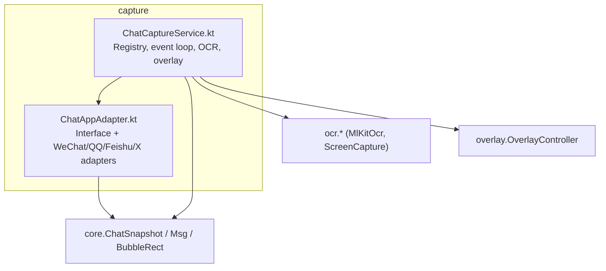
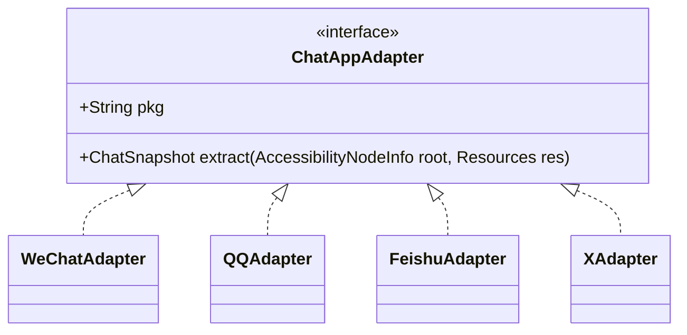
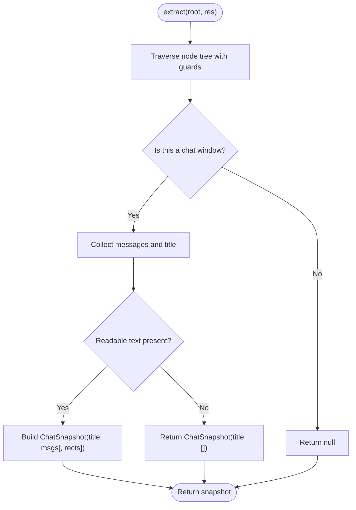
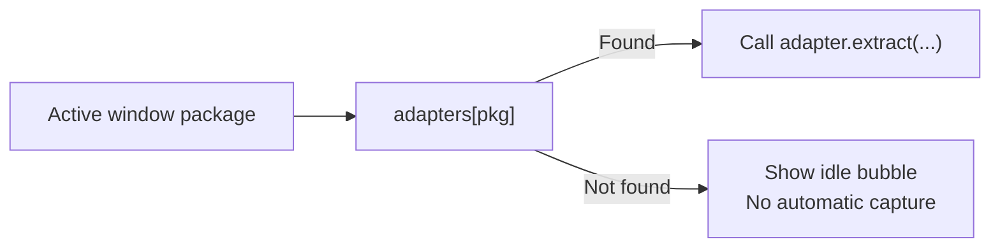
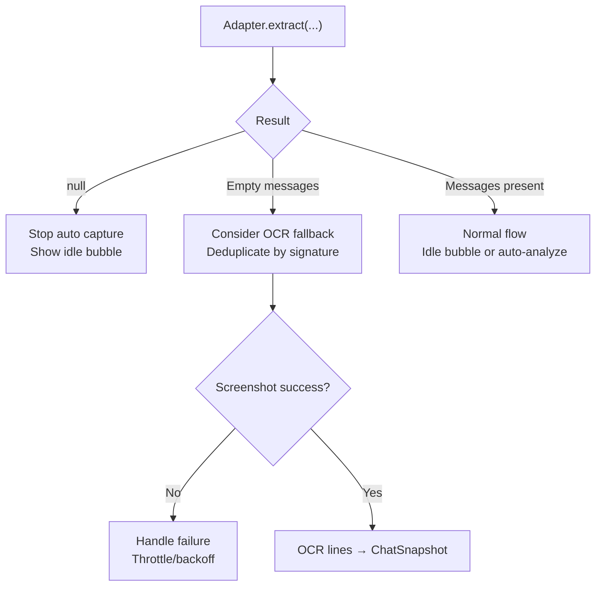
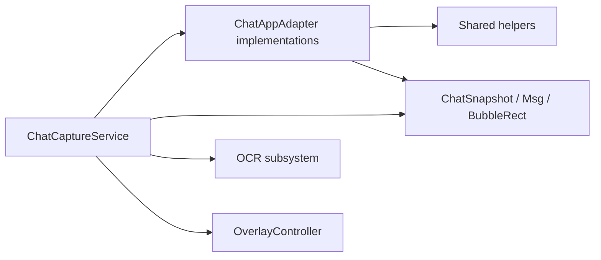

# Adapter Interface Design

<cite>
**Referenced Files in This Document**
- [ChatAppAdapter.kt](file://app/src/main/java/com/jev/probe/capture/ChatAppAdapter.kt)
- [ChatCaptureService.kt](file://app/src/main/java/com/jev/probe/capture/ChatCaptureService.kt)
</cite>

## Table of Contents
1. [Introduction](#introduction)
2. [Project Structure](#project-structure)
3. [Core Components](#core-components)
4. [Architecture Overview](#architecture-overview)
5. [Detailed Component Analysis](#detailed-component-analysis)
6. [Dependency Analysis](#dependency-analysis)
7. [Performance Considerations](#performance-considerations)
8. [Troubleshooting Guide](#troubleshooting-guide)
9. [Conclusion](#conclusion)

## Introduction
This document explains the `ChatAppAdapter` interface and its role as the contract for platform-specific message extraction. It focuses on:
- The three-way return contract of `extract`.
- The method signature and how raw accessibility trees are converted into structured `ChatSnapshot` objects.
- How `ChatCaptureService` maps package names to adapters, registers them, and selects the correct one.
- Examples of adapter registration patterns and error handling strategies when an adapter cannot recognize a chat window.

The goal is to make this design understandable for both implementers adding new app support and maintainers diagnosing capture behavior.

## Project Structure
The adapter design lives under the capture module:
- `ChatAppAdapter.kt` defines the interface and concrete per-app adapters.
- `ChatCaptureService.kt` owns the adapter registry, dispatches events, and coordinates OCR fallback and analysis.



**Diagram sources**
- [ChatAppAdapter.kt:10-30](file://app/src/main/java/com/jev/probe/capture/ChatAppAdapter.kt#L10-L30)
- [ChatCaptureService.kt:29-53](file://app/src/main/java/com/jev/probe/capture/ChatCaptureService.kt#L29-L53)

**Section sources**
- [ChatAppAdapter.kt:10-30](file://app/src/main/java/com/jev/probe/capture/ChatAppAdapter.kt#L10-L30)
- [ChatCaptureService.kt:29-53](file://app/src/main/java/com/jev/probe/capture/ChatCaptureService.kt#L29-L53)

## Core Components
- `ChatAppAdapter`: declares the per-app contract.
  - `pkg`: the Android package name that identifies the target app.
  - `extract(root, res)`: converts the current foreground UI tree into a neutral `ChatSnapshot`.
- Concrete adapters:
  - `WeChatAdapter`
  - `QQAdapter`
  - `FeishuAdapter`
  - `XAdapter`
- Shared helpers used by adapters:
  - `findTitleInActionBar`
  - `findWeChatTitle`
  - `collectFeishuBubbleRects`
  - Timestamp/title heuristics (`looksLikeTimestamp`, etc.)

**Section sources**
- [ChatAppAdapter.kt:10-30](file://app/src/main/java/com/jev/probe/capture/ChatAppAdapter.kt#L10-L30)
- [ChatAppAdapter.kt:45-74](file://app/src/main/java/com/jev/probe/capture/ChatAppAdapter.kt#L45-L74)
- [ChatAppAdapter.kt:93-128](file://app/src/main/java/com/jev/probe/capture/ChatAppAdapter.kt#L93-L128)
- [ChatAppAdapter.kt:276-301](file://app/src/main/java/com/jev/probe/capture/ChatAppAdapter.kt#L276-L301)

## Architecture Overview
At runtime, `ChatCaptureService` observes accessibility events, resolves the active window, looks up the matching adapter by package name, and calls `extract`. The service then interprets the three-way result to decide whether to show an idle bubble, trigger OCR, or proceed with normal analysis.

```mermaid
sequenceDiagram
participant OS as "Android Accessibility"
participant Svc as "ChatCaptureService"
participant Reg as "adapters map"
participant Adp as "ChatAppAdapter"
participant Ocr as "OCR path"
participant Over as "OverlayController"
OS->>Svc : "onAccessibilityEvent(...)"
Svc->>Svc : "maybeCapture()"
Svc->>Reg : "get(pkg)"
alt Adapter found
Reg-->>Svc : "adapter instance"
Svc->>Adp : "extract(root, resources)"
alt null
Adp-->>Svc : "null"
Svc->>Over : "showIdle(null)"
else empty messages
Adp-->>Svc : "ChatSnapshot(title, [], rects?)"
Svc->>Ocr : "ocrCapture(...) if enabled"
Ocr-->>Svc : "OCR snapshot"
Svc->>Over : "showIdle(title) or analyze"
else non-empty messages
Adp-->>Svc : "ChatSnapshot(title, msgs)"
Svc->>Over : "showIdle(title) or auto-analyze"
end
else No adapter
Reg-->>Svc : "null"
Svc->>Over : "idle bubble for unadapted apps"
end
```

**Diagram sources**
- [ChatCaptureService.kt:275-360](file://app/src/main/java/com/jev/probe/capture/ChatCaptureService.kt#L275-L360)
- [ChatAppAdapter.kt:27-30](file://app/src/main/java/com/jev/probe/capture/ChatAppAdapter.kt#L27-L30)

## Detailed Component Analysis

### ChatAppAdapter Contract
The interface defines:
- `pkg`: stable package identifier used for registration and selection.
- `extract(root: AccessibilityNodeInfo, res: Resources): ChatSnapshot?`:
  - Returns `null` when the current window is not a chat window for this app.
  - Returns a `ChatSnapshot` with an empty message list when the app is recognized as a chat but no readable text is available; this signals the service to consider OCR fallback.
  - Returns a `ChatSnapshot` with one or more messages for normal capture.

The interface documentation also clarifies that some apps obfuscate their node trees, while others do not; adapters must adapt accordingly.



**Diagram sources**
- [ChatAppAdapter.kt:27-30](file://app/src/main/java/com/jev/probe/capture/ChatAppAdapter.kt#L27-L30)
- [ChatAppAdapter.kt:139-179](file://app/src/main/java/com/jev/probe/capture/ChatAppAdapter.kt#L139-L179)
- [ChatAppAdapter.kt:197-247](file://app/src/main/java/com/jev/probe/capture/ChatAppAdapter.kt#L197-L247)
- [ChatAppAdapter.kt:319-376](file://app/src/main/java/com/jev/probe/capture/ChatAppAdapter.kt#L319-L376)
- [ChatAppAdapter.kt:440-510](file://app/src/main/java/com/jev/probe/capture/ChatAppAdapter.kt#L440-L510)

**Section sources**
- [ChatAppAdapter.kt:10-30](file://app/src/main/java/com/jev/probe/capture/ChatAppAdapter.kt#L10-L30)

### Three-Way Return Contract
| Return value | Meaning | Service behavior |
|---|---|---|
| `null` | Not this app’s chat window (e.g., list, settings). | Stop automatic capture for this window; show idle bubble if appropriate. |
| `ChatSnapshot` with empty messages | Recognized chat window, but no readable text. | Optionally trigger screenshot + OCR fallback based on preferences. |
| `ChatSnapshot` with non-empty messages | Normal capture. | Dedupe, show idle bubble or auto-analyze depending on settings and latest sender. |

This contract is explicitly documented in the interface and implemented consistently across adapters.

**Section sources**
- [ChatAppAdapter.kt:10-30](file://app/src/main/java/com/jev/probe/capture/ChatAppAdapter.kt#L10-L30)
- [ChatCaptureService.kt:284-329](file://app/src/main/java/com/jev/probe/capture/ChatCaptureService.kt#L284-L329)

### Extract Method Signature and Conversion Logic
Signature:
- Parameters:
  - `root`: the current foreground `AccessibilityNodeInfo` tree.
  - `res`: Android `Resources` used for display metrics and resource-based checks.
- Return:
  - Nullable `ChatSnapshot` following the three-way contract.

Conversion steps commonly performed by adapters:
1. Traverse the node tree with a bounded stack and guard counter.
2. Identify app-specific markers (resource IDs, class names, content descriptions).
3. Determine whether the window is a chat window.
4. Collect message candidates (text, geometry, side hints).
5. Infer conversation title from action bar or app-specific elements.
6. Build `ChatSnapshot` with:
   - Title
   - Ordered message list
   - Optional bubble rectangles for OCR targeting (e.g., Feishu)



**Diagram sources**
- [ChatAppAdapter.kt:139-179](file://app/src/main/java/com/jev/probe/capture/ChatAppAdapter.kt#L139-L179)
- [ChatAppAdapter.kt:197-247](file://app/src/main/java/com/jev/probe/capture/ChatAppAdapter.kt#L197-L247)
- [ChatAppAdapter.kt:319-376](file://app/src/main/java/com/jev/probe/capture/ChatAppAdapter.kt#L319-L376)
- [ChatAppAdapter.kt:440-510](file://app/src/main/java/com/jev/probe/capture/ChatAppAdapter.kt#L440-L510)

**Section sources**
- [ChatAppAdapter.kt:139-179](file://app/src/main/java/com/jev/probe/capture/ChatAppAdapter.kt#L139-L179)
- [ChatAppAdapter.kt:197-247](file://app/src/main/java/com/jev/probe/capture/ChatAppAdapter.kt#L197-L247)
- [ChatAppAdapter.kt:319-376](file://app/src/main/java/com/jev/probe/capture/ChatAppAdapter.kt#L319-L376)
- [ChatAppAdapter.kt:440-510](file://app/src/main/java/com/jev/probe/capture/ChatAppAdapter.kt#L440-L510)

### Package Name Mapping and Adapter Registration
`ChatCaptureService` maintains a registry mapping package names to adapter instances:
- Registry construction:
  - Creates instances of all supported adapters.
  - Associates each adapter with its `pkg`.
- Selection:
  - On each event, the service reads the active window’s package.
  - Looks up the adapter via the registry.
  - If none exists, it does not automatically capture; it still shows an idle bubble so users can manually trigger OCR.



**Diagram sources**
- [ChatCaptureService.kt:48-53](file://app/src/main/java/com/jev/probe/capture/ChatCaptureService.kt#L48-L53)
- [ChatCaptureService.kt:275-294](file://app/src/main/java/com/jev/probe/capture/ChatCaptureService.kt#L275-L294)

**Section sources**
- [ChatCaptureService.kt:48-53](file://app/src/main/java/com/jev/probe/capture/ChatCaptureService.kt#L48-L53)
- [ChatCaptureService.kt:275-294](file://app/src/main/java/com/jev/probe/capture/ChatCaptureService.kt#L275-L294)

### Adapter Registration Patterns
Registration pattern used by the service:
- Create adapter instances once.
- Store them in a list and convert to a map keyed by `pkg`.
- Look up by package at runtime.

Example pattern (conceptual):
- Define adapters with distinct `pkg` values.
- Register them together in a single place.
- Extend by adding a new adapter instance to the same list.

This keeps selection deterministic and centralized.

**Section sources**
- [ChatCaptureService.kt:48-53](file://app/src/main/java/com/jev/probe/capture/ChatCaptureService.kt#L48-L53)

### Error Handling When Adapters Fail to Recognize Chat Windows
When an adapter returns `null`:
- Automatic capture stops for that window.
- The service shows an idle bubble so the user can still use manual features.
- For manual OCR, the service logs structural information about the tree (IDs and counts, never message text) to help diagnose why the adapter did not match.

When an adapter recognizes a chat but returns no readable text:
- The service may trigger OCR fallback if enabled.
- It deduplicates OCR attempts using a signature built from title and bubble rectangles.
- Screenshot failures are handled gracefully, including throttling and transient errors.



**Diagram sources**
- [ChatCaptureService.kt:284-329](file://app/src/main/java/com/jev/probe/capture/ChatCaptureService.kt#L284-L329)
- [ChatCaptureService.kt:507-524](file://app/src/main/java/com/jev/probe/capture/ChatCaptureService.kt#L507-L524)
- [ChatCaptureService.kt:548-587](file://app/src/main/java/com/jev/probe/capture/ChatCaptureService.kt#L548-L587)

**Section sources**
- [ChatCaptureService.kt:284-329](file://app/src/main/java/com/jev/probe/capture/ChatCaptureService.kt#L284-L329)
- [ChatCaptureService.kt:507-524](file://app/src/main/java/com/jev/probe/capture/ChatCaptureService.kt#L507-L524)
- [ChatCaptureService.kt:548-587](file://app/src/main/java/com/jev/probe/capture/ChatCaptureService.kt#L548-L587)

## Dependency Analysis
- `ChatCaptureService` depends on:
  - `ChatAppAdapter` implementations for per-app parsing.
  - `ChatSnapshot`, `Msg`, and `BubbleRect` from core models.
  - OCR components for fallback capture.
  - Overlay controller for UI feedback.
- Adapters depend on:
  - Android accessibility APIs.
  - Shared helpers for title detection and timestamp filtering.
  - Core models to produce normalized snapshots.



**Diagram sources**
- [ChatCaptureService.kt:29-53](file://app/src/main/java/com/jev/probe/capture/ChatCaptureService.kt#L29-L53)
- [ChatAppAdapter.kt:10-30](file://app/src/main/java/com/jev/probe/capture/ChatAppAdapter.kt#L10-L30)

**Section sources**
- [ChatCaptureService.kt:29-53](file://app/src/main/java/com/jev/probe/capture/ChatCaptureService.kt#L29-L53)
- [ChatAppAdapter.kt:10-30](file://app/src/main/java/com/jev/probe/capture/ChatAppAdapter.kt#L10-L30)

## Performance Considerations
- Tree traversal uses guarded loops to avoid infinite recursion and excessive CPU usage.
- OCR fallback is debounced and throttled; signatures prevent repeated screenshots when only chrome changes.
- Worker threads handle analysis off the main thread; rejection exceptions are caught to avoid crashes during teardown.
- Manual OCR bypasses strict liveness checks to keep the escape hatch usable for apps whose trees are stripped.

[No sources needed since this section provides general guidance]

## Troubleshooting Guide
Common issues and remedies:
- Adapter returns `null` unexpectedly:
  - Check whether the app update changed resource IDs or layout structure.
  - Use the service’s tree logging path to inspect exposed IDs without leaking message text.
- OCR fallback triggers repeatedly:
  - Verify that the adapter correctly reports empty messages only for true chat windows.
  - Ensure OCR preferences are configured as intended.
- Manual OCR does nothing:
  - Confirm the accessibility service is enabled and the current window is capturable.
  - Review logs for “no chat window matched” diagnostics.

**Section sources**
- [ChatCaptureService.kt:507-524](file://app/src/main/java/com/jev/probe/capture/ChatCaptureService.kt#L507-L524)
- [ChatCaptureService.kt:465-499](file://app/src/main/java/com/jev/probe/capture/ChatCaptureService.kt#L465-L499)

## Conclusion
`ChatAppAdapter` provides a clean, extensible contract for turning diverse Android chat UIs into a unified `ChatSnapshot`. Its three-way return semantics give `ChatCaptureService` precise control over automatic capture, OCR fallback, and user-facing feedback. By centralizing adapter registration and selection by package name, the system remains modular and easy to extend with new messaging apps while keeping error paths robust and diagnosable.