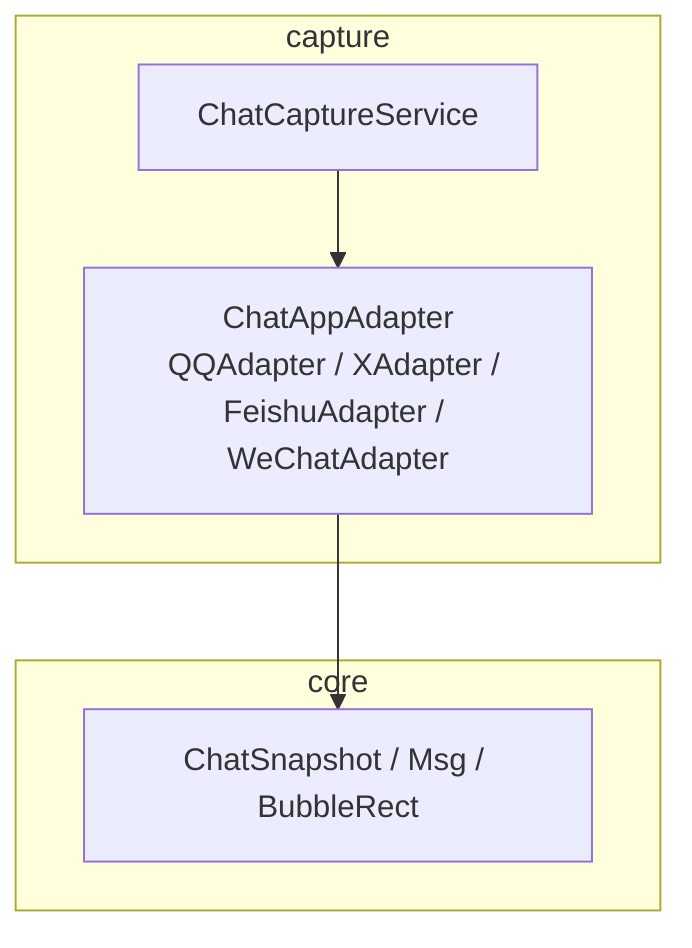
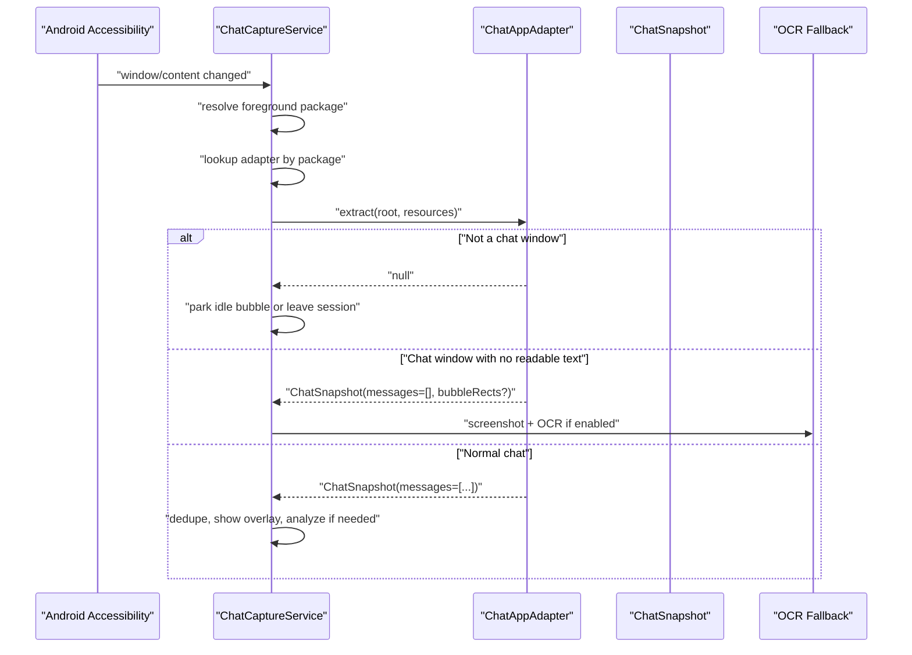
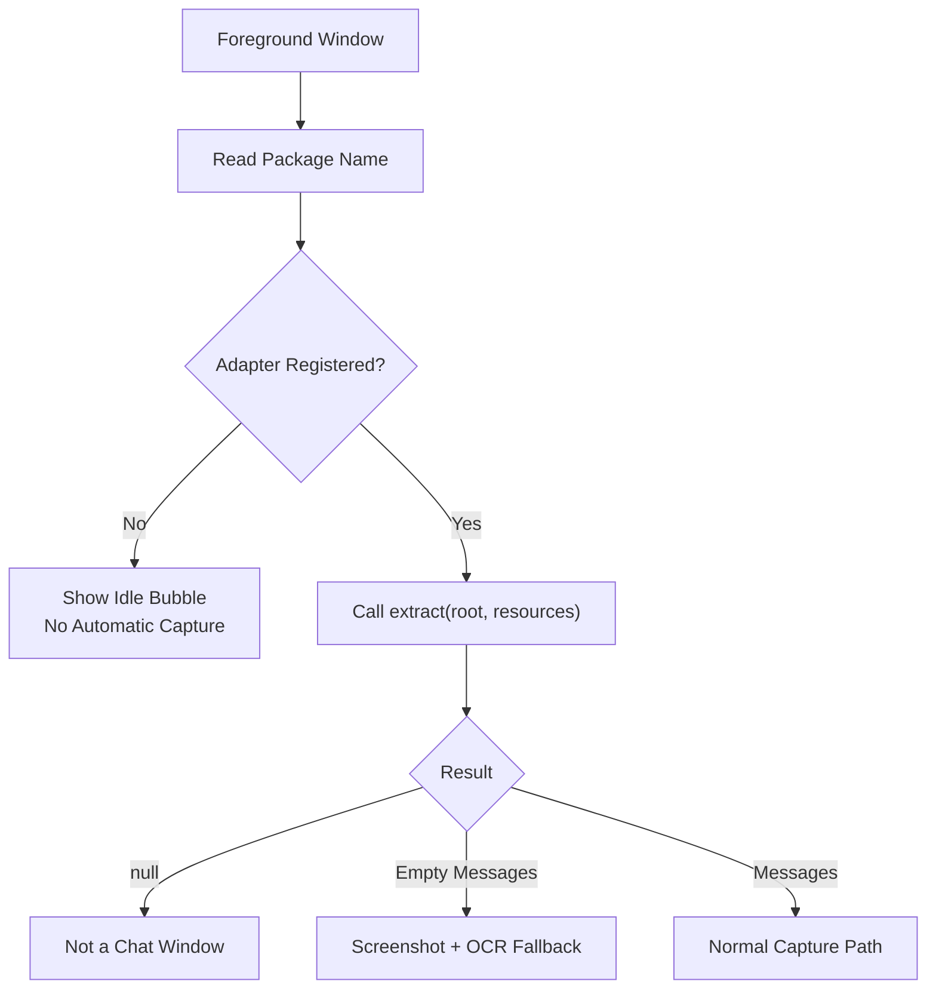
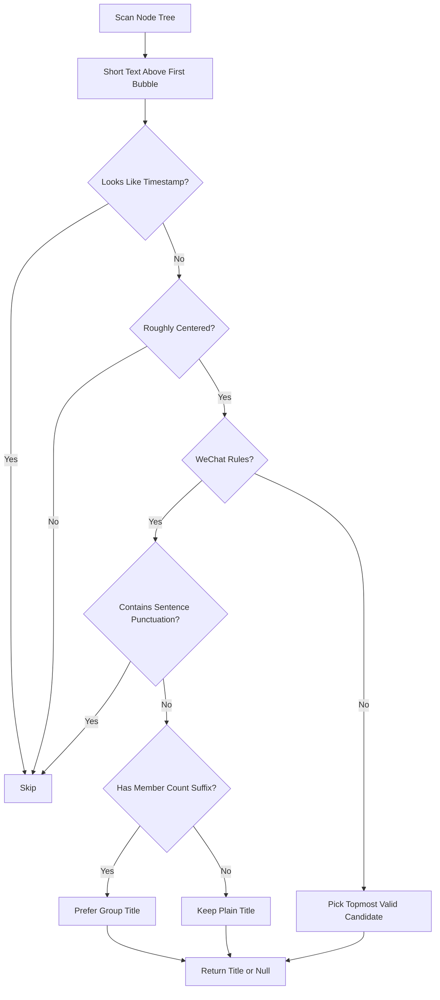
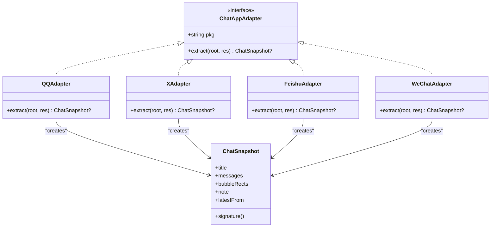
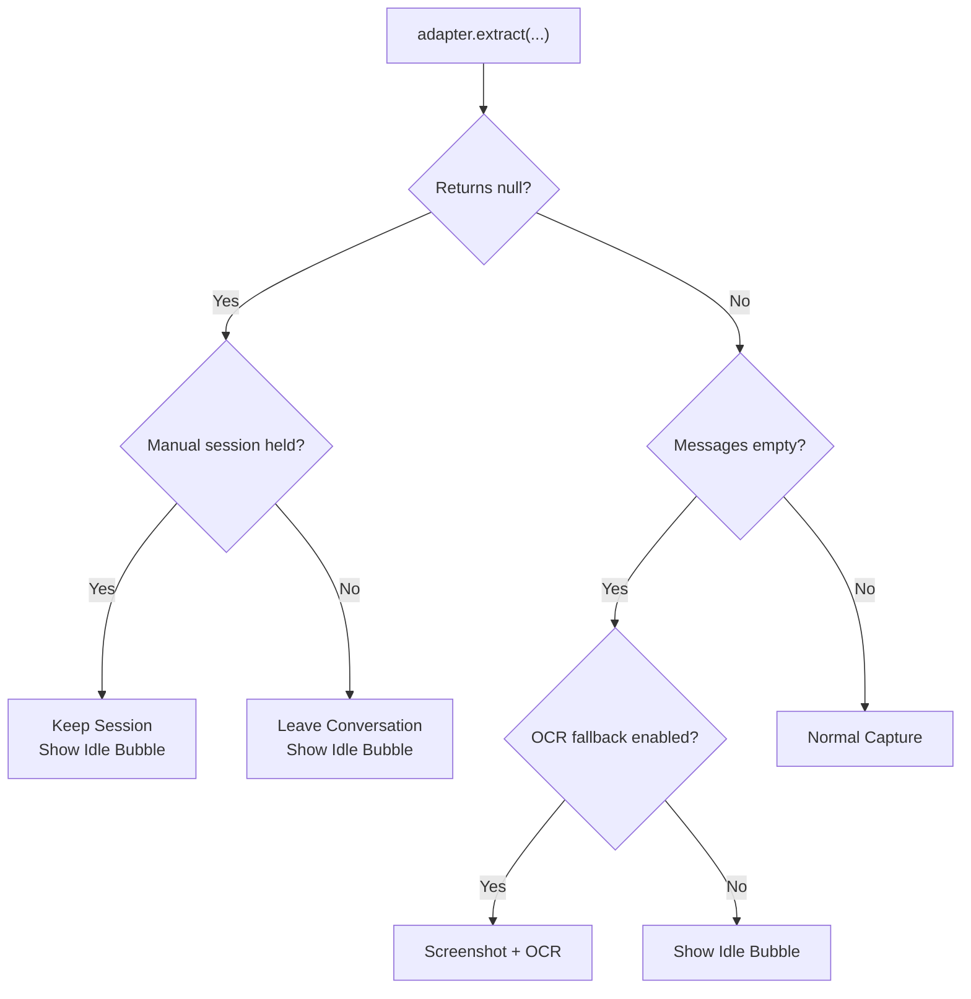
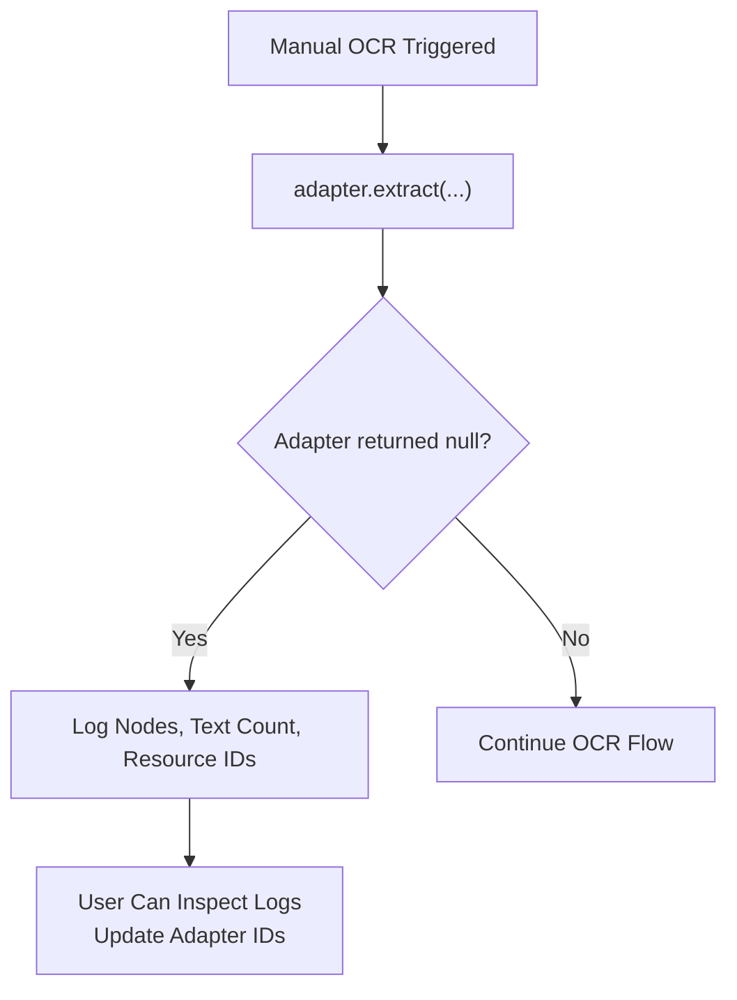
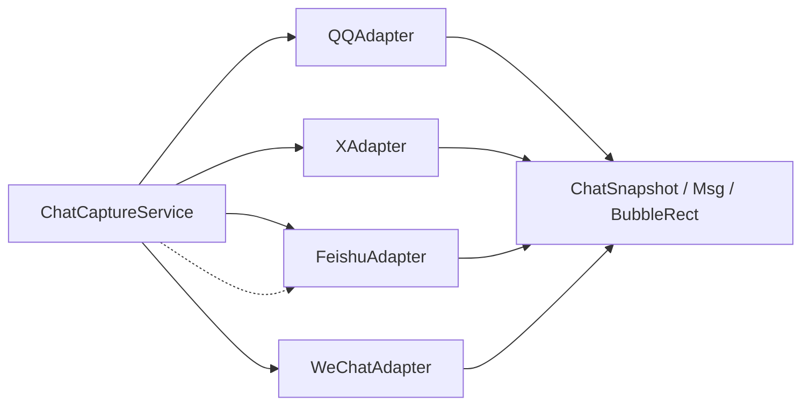

# Adapter Pattern and Platform Support

<cite>
**Referenced Files in This Document**
- [ChatAppAdapter.kt](file://app/src/main/java/com/jev/probe/capture/ChatAppAdapter.kt)
- [ChatCaptureService.kt](file://app/src/main/java/com/jev/probe/capture/ChatCaptureService.kt)
- [ChatModels.kt](file://app/src/main/java/com/jev/probe/core/ChatModels.kt)
</cite>

## Table of Contents
1. [Introduction](#introduction)
2. [Project Structure](#project-structure)
3. [Core Components](#core-components)
4. [Architecture Overview](#architecture-overview)
5. [Detailed Component Analysis](#detailed-component-analysis)
6. [Dependency Analysis](#dependency-analysis)
7. [Performance Considerations](#performance-considerations)
8. [Troubleshooting Guide](#troubleshooting-guide)
9. [Conclusion](#conclusion)

## Introduction
This document explains the adapter pattern used to support multiple chat platforms inside the capture subsystem. The design separates platform-specific accessibility parsing from the rest of the application by defining a single `ChatAppAdapter` interface. Each supported app — QQ, X/Twitter, Feishu/Lark, and WeChat — provides its own adapter that turns an Android `AccessibilityNodeInfo` tree into a neutral `ChatSnapshot`.

The service layer then:
- Registers adapters by package name.
- Selects the correct adapter for the foreground window.
- Interprets the three-way result of `extract`: not a chat, chat with no readable text, or normal chat.
- Falls back to screenshot-based OCR when the node tree cannot provide message text.
- Logs diagnostic information when an adapter fails to recognize a chat window.

## Project Structure
The relevant code lives under the capture and core packages:

**Diagram sources**
- [ChatCaptureService.kt:43-53](file://app/src/main/java/com/jev/probe/capture/ChatCaptureService.kt#L43-L53)
- [ChatAppAdapter.kt:27-30](file://app/src/main/java/com/jev/probe/capture/ChatAppAdapter.kt#L27-L30)
- [ChatModels.kt:5-38](file://app/src/main/java/com/jev/probe/core/ChatModels.kt#L5-L38)

**Section sources**
- [ChatCaptureService.kt:29-53](file://app/src/main/java/com/jev/probe/capture/ChatCaptureService.kt#L29-L53)
- [ChatAppAdapter.kt:10-30](file://app/src/main/java/com/jev/probe/capture/ChatAppAdapter.kt#L10-L30)
- [ChatModels.kt:5-38](file://app/src/main/java/com/jev/probe/core/ChatModels.kt#L5-L38)

## Core Components
The adapter pattern is centered on three elements:

| Component | Responsibility | Key Contract |
|---|---|---|
| `ChatAppAdapter` | Defines per-app extraction rules. | `pkg` identifies the app; `extract(root, res)` returns a structured snapshot or `null`. |
| `ChatSnapshot` | Neutral representation of a conversation window. | Contains title, ordered messages, optional bubble rectangles, and an optional note. |
| `ChatCaptureService` | Orchestrates selection, fallback, deduplication, OCR, and overlay behavior. | Uses package-name mapping to pick an adapter and interprets its return value. |

### Adapter Interface Design
`ChatAppAdapter` exposes:
- A stable package identifier.
- An `extract` method that receives the root accessibility node and system resources.

The contract has three outcomes:
1. `null`: the current window is not this app’s chat view.
2. Non-null with empty messages: the adapter recognizes a chat window but could not read any message text.
3. Non-null with non-empty messages: normal capture path.

This contract is what allows the service to remain app-agnostic while still handling very different UI trees.

**Section sources**
- [ChatAppAdapter.kt:10-30](file://app/src/main/java/com/jev/probe/capture/ChatAppAdapter.kt#L10-L30)
- [ChatModels.kt:5-38](file://app/src/main/java/com/jev/probe/core/ChatModels.kt#L5-L38)

### ChatSnapshot Data Model
`ChatSnapshot` is the normalized output of every adapter:
- `title`: conversation title, possibly null.
- `messages`: ordered list of `Msg`, each carrying sender side and text.
- `bubbleRects`: optional screen rectangles for bubbles whose text must be OCR’d later.
- `note`: optional explanation shown to the user about how the snapshot was produced.

It also exposes:
- `latestFrom`: whether the newest message came from “me” or “other”.
- `signature()`: a compact string based on the last few messages, used for change detection and deduplication.

**Section sources**
- [ChatModels.kt:5-38](file://app/src/main/java/com/jev/probe/core/ChatModels.kt#L5-L38)

## Architecture Overview
At runtime, the service observes accessibility events, finds the active window, selects an adapter by package name, and asks it to parse the tree.

**Diagram sources**
- [ChatCaptureService.kt:107-122](file://app/src/main/java/com/jev/probe/capture/ChatCaptureService.kt#L107-L122)
- [ChatCaptureService.kt:275-360](file://app/src/main/java/com/jev/probe/capture/ChatCaptureService.kt#L275-L360)
- [ChatAppAdapter.kt:10-30](file://app/src/main/java/com/jev/probe/capture/ChatAppAdapter.kt#L10-L30)

## Detailed Component Analysis

### Adapter Registration and Package Mapping
The registration strategy is simple and explicit:
- All adapters are instantiated once.
- They are stored in a list keyed by their `pkg`.
- The service looks up the adapter using the foreground window’s package name.

Supported packages include:
- QQ: `com.tencent.mobileqq`
- X/Twitter: `com.twitter.android`
- Feishu/Lark: `com.ss.android.lark`
- WeChat: `com.tencent.mm`

When there is no adapter for the foreground package, the service does not automatically capture it. Instead, it parks an idle bubble so the user can still use manual OCR through the overlay menu.

**Diagram sources**
- [ChatCaptureService.kt:48-53](file://app/src/main/java/com/jev/probe/capture/ChatCaptureService.kt#L48-L53)
- [ChatCaptureService.kt:256-293](file://app/src/main/java/com/jev/probe/capture/ChatCaptureService.kt#L256-L293)

**Section sources**
- [ChatCaptureService.kt:48-53](file://app/src/main/java/com/jev/probe/capture/ChatCaptureService.kt#L48-L53)
- [ChatCaptureService.kt:256-293](file://app/src/main/java/com/jev/probe/capture/ChatCaptureService.kt#L256-L293)

### Extract Method Contract
Every adapter implements the same contract:

| Return Value | Meaning | Service Behavior |
|---|---|---|
| `null` | Not in this app’s chat window. | Leave or park idle bubble; do nothing further. |
| `ChatSnapshot` with empty messages | In a chat window, but no message text available. | Optionally trigger OCR fallback. |
| `ChatSnapshot` with messages | Normal chat. | Deduplicate, update overlay, optionally analyze. |

The contract is intentionally conservative: recognizing “we are in a chat” is separate from “we can read the message text.” This separation is important because some apps draw message text instead of exposing it as accessible text.

**Section sources**
- [ChatAppAdapter.kt:10-30](file://app/src/main/java/com/jev/probe/capture/ChatAppAdapter.kt#L10-L30)
- [ChatModels.kt:15-38](file://app/src/main/java/com/jev/probe/core/ChatModels.kt#L15-L38)

### Title Detection Algorithms

#### Generic Action Bar Title Detection
`findTitleInActionBar` searches the top portion of the screen for short, roughly centered text above the first message bubble. It avoids timestamps and limits search depth with a guard counter.

Key behaviors:
- Restricts candidate height to the action bar region.
- Requires center position within a configurable horizontal band.
- Ignores strings that look like timestamps.
- Returns the topmost valid candidate.

This helper is reused by QQ (as a fallback), X, and manual OCR capture.

#### WeChat-Specific Title Detection
WeChat needs stricter filtering because group announcements or stray messages can sit in the same visual area as the title. `findWeChatTitle`:
- Excludes Chinese sentence punctuation.
- Prefers titles ending with a member-count suffix such as `(N)`.
- Requires the candidate to be above the first bubble.
- Returns `null` when no candidate qualifies, allowing the previous stable title to carry forward.

**Diagram sources**
- [ChatAppAdapter.kt:32-74](file://app/src/main/java/com/jev/probe/capture/ChatAppAdapter.kt#L32-L74)
- [ChatAppAdapter.kt:93-128](file://app/src/main/java/com/jev/probe/capture/ChatAppAdapter.kt#L93-L128)

**Section sources**
- [ChatAppAdapter.kt:32-74](file://app/src/main/java/com/jev/probe/capture/ChatAppAdapter.kt#L32-L74)
- [ChatAppAdapter.kt:93-128](file://app/src/main/java/com/jev/probe/capture/ChatAppAdapter.kt#L93-L128)

### Bubble Rectangle Identification

#### QQ Bubble Identification
QQ uses stable resource IDs for message bodies. The adapter:
- Collects nodes with the expected bubble ID.
- Uses the input box ID to confirm a chat window.
- Determines sender side by comparing bubble edges to avatar column positions rather than relying only on center point.

Challenges solved:
- Long incoming messages may cross the screen midpoint, so edge proximity to the avatar column is more reliable than center alignment.
- The whole app shares one activity, so “chat window” detection relies on the presence of the input box and message body nodes.

#### Feishu/Lark Bubble Rectangles
Feishu draws message text, so the tree often provides geometry but not text. The adapter:
- Scans for bubble container IDs.
- Filters out invalid rectangles and chrome regions.
- Infers sender side from a read-receipt strip that only appears on sent bubbles.
- Returns `BubbleRect` objects for later OCR.

A dedicated helper collects these rectangles so they can be re-measured after the screenshot callback, avoiding stale coordinates caused by scrolling between tree inspection and image capture.

#### X/Twitter Bubble Identification
X uses Compose UI where message rows have no resource IDs and no visible text. The adapter:
- Looks for full-width views with meaningful `contentDescription`.
- Parses sender and body from a separator pattern.
- Strips read receipts, timestamps, and trailing separators.
- Uses the sender label (“你” / “You”) to determine side.

Challenges solved:
- Date dividers and attachment rows share similar shapes; filtering on class, width, and separator presence keeps them out.
- The DM list and DM thread look similar; the adapter requires both an input box and thread-only signals.

#### WeChat Bubble Identification
WeChat obfuscates node text, but bubble containers still expose a stable ID. The adapter:
- Detects a chat window by the presence of the bubble container ID.
- Reads whatever text remains.
- Uses horizontal position relative to screen width to infer sender side.
- Returns an empty message list when text is stripped, signaling OCR fallback.

**Diagram sources**
- [ChatAppAdapter.kt:27-30](file://app/src/main/java/com/jev/probe/capture/ChatAppAdapter.kt#L27-L30)
- [ChatAppAdapter.kt:139-179](file://app/src/main/java/com/jev/probe/capture/ChatAppAdapter.kt#L139-L179)
- [ChatAppAdapter.kt:197-247](file://app/src/main/java/com/jev/probe/capture/ChatAppAdapter.kt#L197-L247)
- [ChatAppAdapter.kt:319-376](file://app/src/main/java/com/jev/probe/capture/ChatAppAdapter.kt#L319-L376)
- [ChatAppAdapter.kt:440-510](file://app/src/main/java/com/jev/probe/capture/ChatAppAdapter.kt#L440-L510)
- [ChatModels.kt:5-38](file://app/src/main/java/com/jev/probe/core/ChatModels.kt#L5-L38)

**Section sources**
- [ChatAppAdapter.kt:139-179](file://app/src/main/java/com/jev/probe/capture/ChatAppAdapter.kt#L139-L179)
- [ChatAppAdapter.kt:197-247](file://app/src/main/java/com/jev/probe/capture/ChatAppAdapter.kt#L197-L247)
- [ChatAppAdapter.kt:276-301](file://app/src/main/java/com/jev/probe/capture/ChatAppAdapter.kt#L276-L301)
- [ChatAppAdapter.kt:319-376](file://app/src/main/java/com/jev/probe/capture/ChatAppAdapter.kt#L319-L376)
- [ChatAppAdapter.kt:399-419](file://app/src/main/java/com/jev/probe/capture/ChatAppAdapter.kt#L399-L419)
- [ChatAppAdapter.kt:440-510](file://app/src/main/java/com/jev/probe/capture/ChatAppAdapter.kt#L440-L510)

### Concrete Platform Examples

#### QQ
- **Challenge**: Fragment-based UI under one activity; chat-window detection must rely on the tree.
- **Solution**: Require the input box ID and collect message-body nodes by their bubble ID.
- **Side inference**: Compare bubble edges to avatar column positions.
- **Title**: Use a dedicated title ID when present; otherwise fall back to generic action-bar detection.

#### X/Twitter
- **Challenge**: Compose UI with no resource IDs, no visible text, and content packed into `contentDescription`.
- **Solution**: Parse sender/body from separator patterns, strip read receipts and timestamps, and validate row shape.
- **Side inference**: Sender label, not geometry.
- **Window detection**: Require both an editable input and thread-only signals.

#### Feishu/Lark
- **Challenge**: Message text is drawn, not exposed as accessible text.
- **Solution**: Return bubble rectangles and inferred side; let the service OCR each rectangle.
- **Side inference**: Read-receipt strip attached only to sent bubbles.
- **Stability**: Re-measure rectangles inside the screenshot callback to avoid scroll drift.

#### WeChat
- **Challenge**: Node text is hidden by anti-accessibility measures.
- **Solution**: Detect chat window by bubble container ID; return empty messages to signal OCR fallback.
- **Title**: Use a stricter algorithm that avoids treating announcements or stray lines as titles.
- **Risk note**: The service acknowledges anti-screenshot risk control and treats WeChat support as a deliberate trade-off.

**Section sources**
- [ChatAppAdapter.kt:139-179](file://app/src/main/java/com/jev/probe/capture/ChatAppAdapter.kt#L139-L179)
- [ChatAppAdapter.kt:197-247](file://app/src/main/java/com/jev/probe/capture/ChatAppAdapter.kt#L197-L247)
- [ChatAppAdapter.kt:319-376](file://app/src/main/java/com/jev/probe/capture/ChatAppAdapter.kt#L319-L376)
- [ChatAppAdapter.kt:440-510](file://app/src/main/java/com/jev/probe/capture/ChatAppAdapter.kt#L440-L510)
- [ChatCaptureService.kt:48-53](file://app/src/main/java/com/jev/probe/capture/ChatCaptureService.kt#L48-L53)

### Fallback Mechanisms When Adapters Fail
There are two distinct failure modes:

1. **Adapter returns `null`**:
   - The service assumes the current window is not a recognized chat window.
   - If a manual session is held, it preserves the session for that window.
   - Otherwise, it leaves the conversation and shows an idle bubble.

2. **Adapter returns a snapshot with empty messages**:
   - The service treats this as “in a chat window, but no readable text.”
   - If OCR fallback is enabled, it takes a screenshot and runs OCR.
   - For Feishu, it prefers OCR by known bubble rectangles; otherwise it OCRs the whole screen.

**Diagram sources**
- [ChatCaptureService.kt:289-329](file://app/src/main/java/com/jev/probe/capture/ChatCaptureService.kt#L289-L329)
- [ChatCaptureService.kt:548-623](file://app/src/main/java/com/jev/probe/capture/ChatCaptureService.kt#L548-L623)

**Section sources**
- [ChatCaptureService.kt:289-329](file://app/src/main/java/com/jev/probe/capture/ChatCaptureService.kt#L289-L329)
- [ChatCaptureService.kt:548-623](file://app/src/main/java/com/jev/probe/capture/ChatCaptureService.kt#L548-L623)

### Error Logging and Debugging Strategy
When an adapter registered for a package returns `null` during manual OCR, the service logs structural diagnostics without capturing message text:
- Total number of visited nodes.
- Number of nodes with text.
- Inventory of resource IDs found in the tree.

This is designed specifically for cases where an app update renamed IDs or changed the accessibility tree structure.

Additional logging includes:
- Snapshot metadata such as package, message count, and message text lengths.
- OCR success/failure status.
- Manual analysis blocks and transient OCR errors.

**Diagram sources**
- [ChatCaptureService.kt:489-524](file://app/src/main/java/com/jev/probe/capture/ChatCaptureService.kt#L489-L524)

**Section sources**
- [ChatCaptureService.kt:489-524](file://app/src/main/java/com/jev/probe/capture/ChatCaptureService.kt#L489-L524)
- [ChatCaptureService.kt:348-349](file://app/src/main/java/com/jev/probe/capture/ChatCaptureService.kt#L348-L349)
- [ChatCaptureService.kt:560-570](file://app/src/main/java/com/jev/probe/capture/ChatCaptureService.kt#L560-L570)

## Dependency Analysis
The main dependencies are:

- `ChatCaptureService` depends on `ChatAppAdapter` implementations.
- All adapters depend on `ChatSnapshot`, `Msg`, and `BubbleRect`.
- Feishu’s bubble collection is shared between the adapter and the service’s OCR path.
- The service owns the package-to-adapter registry.

**Diagram sources**
- [ChatCaptureService.kt:48-53](file://app/src/main/java/com/jev/probe/capture/ChatCaptureService.kt#L48-L53)
- [ChatAppAdapter.kt:276-301](file://app/src/main/java/com/jev/probe/capture/ChatAppAdapter.kt#L276-L301)
- [ChatModels.kt:5-38](file://app/src/main/java/com/jev/probe/core/ChatModels.kt#L5-L38)

**Section sources**
- [ChatCaptureService.kt:48-53](file://app/src/main/java/com/jev/probe/capture/ChatCaptureService.kt#L48-L53)
- [ChatAppAdapter.kt:276-301](file://app/src/main/java/com/jev/probe/capture/ChatAppAdapter.kt#L276-L301)
- [ChatModels.kt:5-38](file://app/src/main/java/com/jev/probe/core/ChatModels.kt#L5-L38)

## Performance Considerations
Several mechanisms reduce unnecessary work:

- Guard counters limit tree traversal depth.
- Debouncing prevents repeated analysis on rapid content changes.
- Signature-based deduplication avoids re-analyzing unchanged conversations.
- OCR is throttled and backed off.
- Bubble rectangles are re-measured after screenshots to avoid stale geometry.
- Worker threads isolate analysis and entitlement refresh from the main thread.

These choices matter because chat apps frequently fire many accessibility events for small UI updates such as caret blinking, presence indicators, or unread badges.

[No sources needed since this section provides general guidance]

## Troubleshooting Guide

### Adapter Does Not Recognize a Chat Window
Symptoms:
- The overlay shows an idle bubble.
- No automatic capture occurs.
- Manual OCR logs indicate no chat window matched.

Likely causes:
- App update renamed resource IDs.
- The current screen is not a chat window.
- The app is not registered in the adapter map.

Recommended steps:
1. Check whether the foreground package is one of the registered adapters.
2. Use manual OCR to inspect the logged node inventory.
3. Update the adapter’s ID matching logic if new IDs appear.
4. Verify that the adapter’s “in a chat window” condition matches the actual tree.

**Section sources**
- [ChatCaptureService.kt:256-293](file://app/src/main/java/com/jev/probe/capture/ChatCaptureService.kt#L256-L293)
- [ChatCaptureService.kt:489-524](file://app/src/main/java/com/jev/probe/capture/ChatCaptureService.kt#L489-L524)

### OCR Fallback Produces No Messages
Symptoms:
- The bubble appears but no text is extracted.
- Manual OCR reports no recognized text.

Likely causes:
- OCR model failed to load or recognize.
- Screenshot was throttled or failed.
- Bubble rectangles were stale or missing.
- The screen contained no readable text.

Recommended steps:
1. Confirm OCR fallback is enabled.
2. Check OCR logs for screenshot failures.
3. For Feishu, verify bubble rectangles are being collected.
4. Try manual OCR again after ensuring the conversation is stable.

**Section sources**
- [ChatCaptureService.kt:305-329](file://app/src/main/java/com/jev/probe/capture/ChatCaptureService.kt#L305-L329)
- [ChatCaptureService.kt:560-587](file://app/src/main/java/com/jev/probe/capture/ChatCaptureService.kt#L560-L587)
- [ChatCaptureService.kt:674-677](file://app/src/main/java/com/jev/probe/capture/ChatCaptureService.kt#L674-L677)

### Title Is Wrong or Missing
Symptoms:
- The panel shows a loading title.
- A group announcement is mistaken for the title.
- The title disappears after switching screens.

Likely causes:
- Transient title such as “connecting…” or blank placeholder.
- WeChat group title ambiguity.
- Generic title detection picking non-title text.

Recommended steps:
1. Wait for a stable title before analyzing.
2. For WeChat, rely on the stricter title filter.
3. For X, check that the wider title band is appropriate.
4. Avoid acting on transient titles.

**Section sources**
- [ChatCaptureService.kt:362-370](file://app/src/main/java/com/jev/probe/capture/ChatCaptureService.kt#L362-L370)
- [ChatAppAdapter.kt:93-128](file://app/src/main/java/com/jev/probe/capture/ChatAppAdapter.kt#L93-L128)
- [ChatAppAdapter.kt:499-503](file://app/src/main/java/com/jev/probe/capture/ChatAppAdapter.kt#L499-L503)

## Conclusion
The adapter pattern cleanly separates platform-specific accessibility parsing from the rest of the capture pipeline. `ChatAppAdapter` defines a stable contract, and each implementation handles the quirks of its target app. `ChatCaptureService` manages registration, fallback, deduplication, OCR, and user feedback.

The most important design decisions are:
- Treat `null` and empty-message snapshots as different states.
- Keep title detection conservative and app-aware.
- Separate bubble geometry from bubble text when the UI draws text.
- Log structural diagnostics without exposing message content.
- Provide manual OCR as an escape hatch for apps whose trees cannot be reliably parsed.

This approach makes it possible to add new platforms by implementing one adapter, while keeping the service layer predictable and testable.