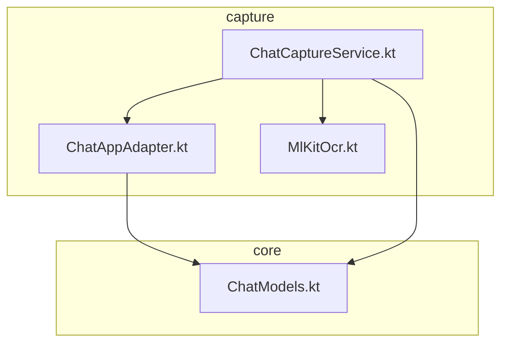
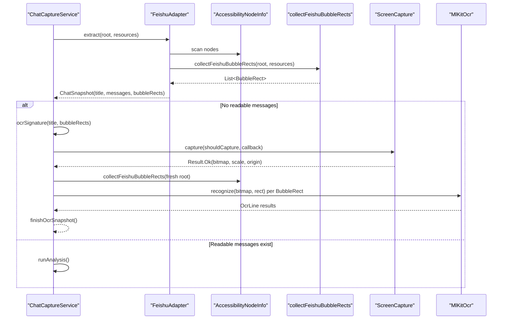
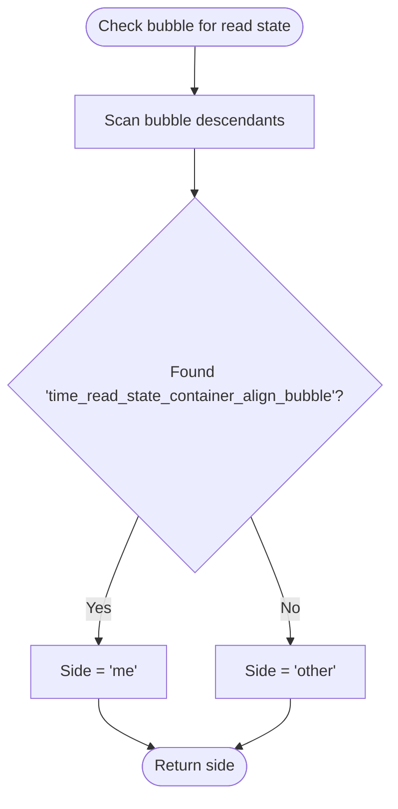
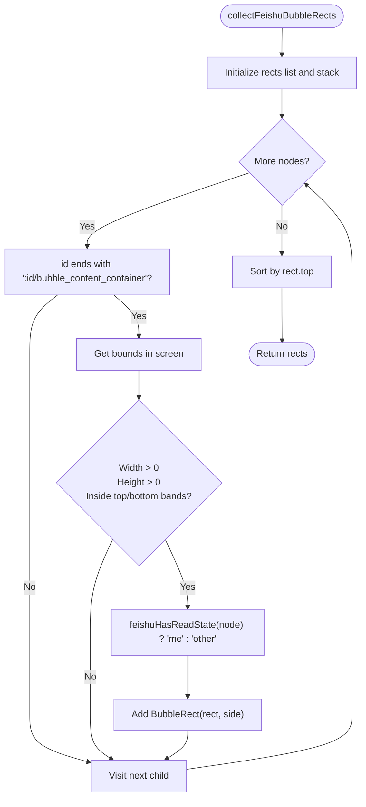
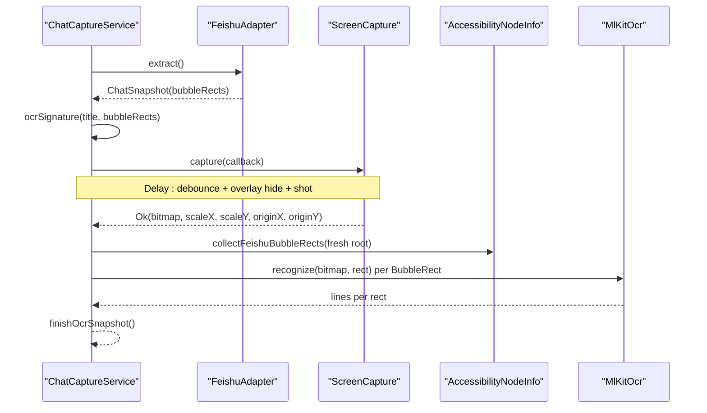
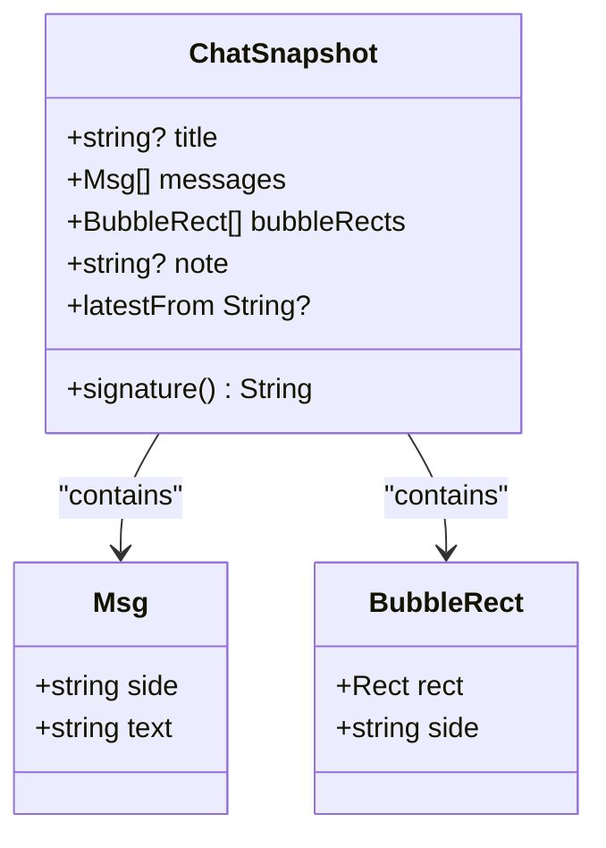
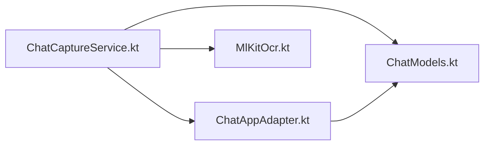

# Feishu/Lark Adapter Implementation

<cite>
**Referenced Files in This Document**
- [ChatAppAdapter.kt](file://app/src/main/java/com/jev/probe/capture/ChatAppAdapter.kt)
- [ChatCaptureService.kt](file://app/src/main/java/com/jev/probe/capture/ChatCaptureService.kt)
- [ChatModels.kt](file://app/src/main/java/com/jev/probe/core/ChatModels.kt)
- [MlKitOcr.kt](file://app/src/main/java/com/jev/probe/capture/ocr/MlKitOcr.kt)
</cite>

## Table of Contents
1. [Introduction](#introduction)
2. [Project Structure](#project-structure)
3. [Core Components](#core-components)
4. [Architecture Overview](#architecture-overview)
5. [Detailed Component Analysis](#detailed-component-analysis)
6. [Dependency Analysis](#dependency-analysis)
7. [Performance Considerations](#performance-considerations)
8. [Troubleshooting Guide](#troubleshooting-guide)
9. [Conclusion](#conclusion)

## Introduction
This document explains the Feishu/Lark adapter implementation and its hybrid capture strategy. Feishu draws message text rather than laying it out as readable views, so the adapter cannot rely on normal accessibility text for message bodies. Instead, it:

- Reports bubble geometry through `ChatSnapshot.bubbleRects` so the service can OCR each bubble individually.
- Extracts any readable text nodes that are not chrome (title, timestamps, system notices, input box).
- Determines message ownership using a read-receipt strip indicator attached only to sent bubbles.
- Extracts the conversation title from the `id/group_name` element.
- Coordinates with the screenshot callback to re-measure bubble rectangles after overlay hiding and screen capture, avoiding timing-related mis-crops.

The goal is to make downstream analysis app-agnostic while handling Feishu’s unique rendering model.

## Project Structure
The relevant code lives under the capture layer and core data models:

**Diagram sources**
- [ChatAppAdapter.kt:10-30](file://app/src/main/java/com/jev/probe/capture/ChatAppAdapter.kt#L10-L30)
- [ChatCaptureService.kt:29-53](file://app/src/main/java/com/jev/probe/capture/ChatCaptureService.kt#L29-L53)
- [ChatModels.kt:5-38](file://app/src/main/java/com/jev/probe/core/ChatModels.kt#L5-L38)
- [MlKitOcr.kt:71-113](file://app/src/main/java/com/jev/probe/capture/ocr/MlKitOcr.kt#L71-L113)

**Section sources**
- [ChatAppAdapter.kt:10-30](file://app/src/main/java/com/jev/probe/capture/ChatAppAdapter.kt#L10-L30)
- [ChatCaptureService.kt:29-53](file://app/src/main/java/com/jev/probe/capture/ChatCaptureService.kt#L29-L53)
- [ChatModels.kt:5-38](file://app/src/main/java/com/jev/probe/core/ChatModels.kt#L5-L38)

## Core Components
- `ChatAppAdapter`: Per-app contract that turns an open chat window into a neutral `ChatSnapshot`. Returning `null` means “not in a chat window”; returning a snapshot with empty messages means “in a chat window but no readable text,” which triggers OCR fallback.
- `FeishuAdapter`: Implements the contract for Feishu/Lark (`com.ss.android.lark`). It reports bubble geometry via `bubbleRects`, filters chrome text, and extracts the group title from `id/group_name`.
- `collectFeishuBubbleRects`: Shared helper that scans the tree for bubble containers, measures them in screen coordinates, and infers side (“me” vs “other”) from the read-receipt strip.
- `ChatSnapshot` and `BubbleRect`: Core data structures carrying title, messages, optional bubble rectangles, and notes.
- `ChatCaptureService`: Orchestrates event observation, adapter selection, OCR fallback, screenshot capture, and analysis. It calls `collectFeishuBubbleRects` both during initial extraction and again inside the screenshot callback.
- `MlKitOcr`: Provides Chinese text recognition used by the OCR path.

**Section sources**
- [ChatAppAdapter.kt:10-30](file://app/src/main/java/com/jev/probe/capture/ChatAppAdapter.kt#L10-L30)
- [ChatAppAdapter.kt:249-376](file://app/src/main/java/com/jev/probe/capture/ChatAppAdapter.kt#L249-L376)
- [ChatModels.kt:5-38](file://app/src/main/java/com/jev/probe/core/ChatModels.kt#L5-L38)
- [ChatCaptureService.kt:275-360](file://app/src/main/java/com/jev/probe/capture/ChatCaptureService.kt#L275-L360)
- [ChatCaptureService.kt:543-623](file://app/src/main/java/com/jev/probe/capture/ChatCaptureService.kt#L543-L623)
- [MlKitOcr.kt:71-113](file://app/src/main/java/com/jev/probe/capture/ocr/MlKitOcr.kt#L71-L113)

## Architecture Overview
The Feishu capture path is hybrid because the UI does not expose readable message bodies:

**Diagram sources**
- [ChatAppAdapter.kt:319-376](file://app/src/main/java/com/jev/probe/capture/ChatAppAdapter.kt#L319-L376)
- [ChatAppAdapter.kt:276-301](file://app/src/main/java/com/jev/probe/capture/ChatAppAdapter.kt#L276-L301)
- [ChatCaptureService.kt:305-327](file://app/src/main/java/com/jev/probe/capture/ChatCaptureService.kt#L305-L327)
- [ChatCaptureService.kt:543-623](file://app/src/main/java/com/jev/probe/capture/ChatCaptureService.kt#L543-L623)
- [MlKitOcr.kt:71-113](file://app/src/main/java/com/jev/probe/capture/ocr/MlKitOcr.kt#L71-L113)

## Detailed Component Analysis

### Feishu Hybrid Contract
Feishu/Lark renders message bodies as drawn content. The adapter therefore follows a three-way contract:

- If the tree has no chat signals, return `null`.
- If the tree identifies a chat window but provides no readable body text, return a `ChatSnapshot` with empty `messages` and populated `bubbleRects`.
- If some readable text exists, include it in `messages` while still reporting `bubbleRects`.

The adapter treats the presence of specific Feishu ids (`id/message`, `id/bubble_content_container`, or the input id `id/kb_rich_text_content`) as evidence that the user is in a chat window.

**Section sources**
- [ChatAppAdapter.kt:303-318](file://app/src/main/java/com/jev/probe/capture/ChatAppAdapter.kt#L303-L318)
- [ChatAppAdapter.kt:322-364](file://app/src/main/java/com/jev/probe/capture/ChatAppAdapter.kt#L322-L364)
- [ChatModels.kt:15-32](file://app/src/main/java/com/jev/probe/core/ChatModels.kt#L15-L32)

### Title Extraction from `id/group_name`
The Feishu adapter looks for a node whose resource id ends with `:id/group_name` and uses its text as the conversation title. This is the primary source; if no such node is found, the adapter relies on whatever title was already set by earlier scanning logic.

Important behaviors:

- Only one title is captured: the first non-blank value encountered.
- The title is included in the returned `ChatSnapshot`.
- The service later validates titles against transient placeholders before accepting them as stable conversation identity.

**Section sources**
- [ChatAppAdapter.kt:341-343](file://app/src/main/java/com/jev/probe/capture/ChatAppAdapter.kt#L341-L343)
- [ChatCaptureService.kt:362-370](file://app/src/main/java/com/jev/probe/capture/ChatCaptureService.kt#L362-L370)

### Chrome Filtering
Feishu exposes several non-message text nodes. The adapter filters them out when collecting readable items:

- Group name: `:id/group_name`
- Sender name: `:id/name_tv`
- Date/time label: `:id/date_tv`
- System notice: `:id/system_label`
- Input editor: `:id/kb_rich_text_content`
- Thread title/subtitle labels: `:id/thread_title_tv`, `:id/thread_subtitle_tv`

Additionally, timestamp-like strings are excluded using shared helpers that match common time formats and Chinese date patterns.

**Section sources**
- [ChatAppAdapter.kt:33-36](file://app/src/main/java/com/jev/probe/capture/ChatAppAdapter.kt#L33-L36)
- [ChatAppAdapter.kt:366-375](file://app/src/main/java/com/jev/probe/capture/ChatAppAdapter.kt#L366-L375)

### Message Ownership via Read-Receipt Strip
Feishu left-aligns all bubbles, so horizontal position cannot determine sender. Instead, the adapter checks whether the bubble contains a child node whose id ends with `time_read_state_container_align_bubble`. Only my own bubbles carry this strip:

- Present → side is `"me"`.
- Absent → side is `"other"`.

This check is performed for every bubble container discovered by `collectFeishuBubbleRects`.

**Diagram sources**
- [ChatAppAdapter.kt:249-265](file://app/src/main/java/com/jev/probe/capture/ChatAppAdapter.kt#L249-L265)
- [ChatAppAdapter.kt:291-295](file://app/src/main/java/com/jev/probe/capture/ChatAppAdapter.kt#L291-L295)

**Section sources**
- [ChatAppAdapter.kt:249-265](file://app/src/main/java/com/jev/probe/capture/ChatAppAdapter.kt#L249-L265)
- [ChatAppAdapter.kt:314-317](file://app/src/main/java/com/jev/probe/capture/ChatAppAdapter.kt#L314-L317)

### `collectFeishuBubbleRects`
This function is central to the hybrid approach. It:

1. Scans the accessibility tree for nodes whose id ends with `:id/bubble_content_container`.
2. Measures each bubble in screen coordinates.
3. Filters invalid or off-screen bubbles by width, height, and vertical bands:
   - Top band excludes action bar/tab row.
   - Bottom band excludes input box/keyboard.
4. Infers side using the read-receipt strip check.
5. Sorts results by top coordinate so they remain ordered top-to-bottom.

The function is exposed at package scope so the service can call it twice: once during initial extraction and again inside the screenshot callback.

**Diagram sources**
- [ChatAppAdapter.kt:276-301](file://app/src/main/java/com/jev/probe/capture/ChatAppAdapter.kt#L276-L301)
- [ChatAppAdapter.kt:249-265](file://app/src/main/java/com/jev/probe/capture/ChatAppAdapter.kt#L249-L265)

**Section sources**
- [ChatAppAdapter.kt:267-301](file://app/src/main/java/com/jev/probe/capture/ChatAppAdapter.kt#L267-L301)

### Screenshot Callback Coordination
The timing-sensitive part is how the service coordinates between reading the tree and capturing the image:

1. Initial extraction collects `bubbleRects`.
2. If messages are empty, the service computes an OCR signature based on package, title, and bubble rectangles.
3. If enabled, it requests a screenshot through `ScreenCapture`.
4. Inside the screenshot callback, the service re-reads the current tree and calls `collectFeishuBubbleRects` again.
5. Fresh rectangles are preferred; old rectangles are used only if the fresh scan returns nothing.
6. Each rectangle is passed to `MlKitOcr.recognize`, and results are assembled into a new `ChatSnapshot`.

This design avoids cropping the wrong rows when the list scrolls between tree reading, overlay hiding, and the actual shot.

**Diagram sources**
- [ChatCaptureService.kt:305-327](file://app/src/main/java/com/jev/probe/capture/ChatCaptureService.kt#L305-L327)
- [ChatCaptureService.kt:543-587](file://app/src/main/java/com/jev/probe/capture/ChatCaptureService.kt#L543-L587)
- [ChatCaptureService.kt:589-623](file://app/src/main/java/com/jev/probe/capture/ChatCaptureService.kt#L589-L623)

**Section sources**
- [ChatCaptureService.kt:305-327](file://app/src/main/java/com/jev/probe/capture/ChatCaptureService.kt#L305-L327)
- [ChatCaptureService.kt:543-623](file://app/src/main/java/com/jev/probe/capture/ChatCaptureService.kt#L543-L623)

### Data Model Relationships

**Diagram sources**
- [ChatModels.kt:5-38](file://app/src/main/java/com/jev/probe/core/ChatModels.kt#L5-L38)

**Section sources**
- [ChatModels.kt:5-38](file://app/src/main/java/com/jev/probe/core/ChatModels.kt#L5-L38)

## Dependency Analysis
The Feishu adapter depends on shared infrastructure:

- `ChatAppAdapter` defines the interface used by `ChatCaptureService`.
- `ChatCaptureService` selects adapters by package name and orchestrates OCR.
- `ChatModels` defines the neutral data shape consumed by downstream analysis.
- `MlKitOcr` performs the actual text recognition.

**Diagram sources**
- [ChatCaptureService.kt:29-53](file://app/src/main/java/com/jev/probe/capture/ChatCaptureService.kt#L29-L53)
- [ChatAppAdapter.kt:10-30](file://app/src/main/java/com/jev/probe/capture/ChatAppAdapter.kt#L10-L30)
- [ChatModels.kt:5-38](file://app/src/main/java/com/jev/probe/core/ChatModels.kt#L5-L38)
- [MlKitOcr.kt:71-113](file://app/src/main/java/com/jev/probe/capture/ocr/MlKitOcr.kt#L71-L113)

**Section sources**
- [ChatCaptureService.kt:29-53](file://app/src/main/java/com/jev/probe/capture/ChatCaptureService.kt#L29-L53)
- [ChatAppAdapter.kt:10-30](file://app/src/main/java/com/jev/probe/capture/ChatAppAdapter.kt#L10-L30)
- [ChatModels.kt:5-38](file://app/src/main/java/com/jev/probe/core/ChatModels.kt#L5-L38)
- [MlKitOcr.kt:71-113](file://app/src/main/java/com/jev/probe/capture/ocr/MlKitOcr.kt#L71-L113)

## Performance Considerations
- Guarded tree traversal: Both adapter scanning and read-state detection use bounded loops with guard counters to avoid hanging on malformed or deep trees.
- Band filtering: Bubble rectangles are filtered by vertical bands to ignore chrome regions like the action bar and input area.
- Deduplication: The service uses signatures based on recent messages and OCR bubble geometry to avoid repeated screenshots and analysis.
- Throttling: OCR capture is guarded by `ocrBusy`, session tokens, liveness checks, and screenshot throttling.
- Warm-up: The OCR recognizer is warmed up asynchronously so the first real OCR does not block the main thread.

[No sources needed since this section provides general guidance]

## Troubleshooting Guide
Common issues and debugging steps for the Feishu/Lark adapter:

1. **No chat window detected**
   - Cause: The tree lacks expected Feishu ids (`id/message`, `id/bubble_content_container`, or `id/kb_rich_text_content`).
   - Action: Use the manual OCR path to log resource ids. The service logs an inventory of visible ids when an adapted app reports no chat window.

2. **Title missing or unstable**
   - Cause: `id/group_name` is absent, or the title is still loading.
   - Action: Verify that the group name element exists and is readable. Transient titles are filtered by the service before treating a window as stable.

3. **Wrong side assigned**
   - Cause: The read-receipt strip is missing or changed by an app update.
   - Action: Inspect whether the bubble contains a descendant whose id ends with `time_read_state_container_align_bubble`. If not, the adapter defaults to `"other"`.

4. **OCR crops wrong rows**
   - Cause: The list scrolled between tree reading and screenshot capture.
   - Action: Ensure the service re-measures bubble rectangles inside the screenshot callback. The implementation already prefers fresh rectangles and falls back to old ones only when necessary.

5. **OCR never runs or runs repeatedly**
   - Cause: OCR is disabled, busy, deduplicated, or throttled.
   - Action: Check `prefs.ocrFallback`, `ocrBusy`, and the OCR signature. The signature includes title and bubble rectangles, so identical chrome-only redraws should not trigger another shot.

6. **Manual OCR says no text recognized**
   - Cause: OCR found no usable lines after cleaning Feishu tails like read receipts and timestamps.
   - Action: Confirm that the screenshot region covers the conversation area and that the OCR engine is warm and functional.

**Section sources**
- [ChatAppAdapter.kt:319-376](file://app/src/main/java/com/jev/probe/capture/ChatAppAdapter.kt#L319-L376)
- [ChatAppAdapter.kt:249-301](file://app/src/main/java/com/jev/probe/capture/ChatAppAdapter.kt#L249-L301)
- [ChatCaptureService.kt:305-327](file://app/src/main/java/com/jev/probe/capture/ChatCaptureService.kt#L305-L327)
- [ChatCaptureService.kt:501-524](file://app/src/main/java/com/jev/probe/capture/ChatCaptureService.kt#L501-L524)
- [ChatCaptureService.kt:543-623](file://app/src/main/java/com/jev/probe/capture/ChatCaptureService.kt#L543-L623)
- [ChatCaptureService.kt:654-666](file://app/src/main/java/com/jev/probe/capture/ChatCaptureService.kt#L654-L666)

## Conclusion
The Feishu/Lark adapter solves a hard problem: extracting conversational meaning from a UI where message text is drawn rather than laid out. Its hybrid approach separates geometry from text:

- Geometry comes from `bubble_content_container` nodes and is reported through `ChatSnapshot.bubbleRects`.
- Text ownership comes from the read-receipt strip.
- Readable chrome-free text is still extracted when available.
- The title comes from `id/group_name`.
- The service coordinates tree reading and screenshot capture carefully, re-measuring bubble rectangles inside the callback to avoid timing-related errors.

This design keeps downstream components simple while adapting to Feishu’s rendering constraints.

[No sources needed since this section summarizes without analyzing specific files]