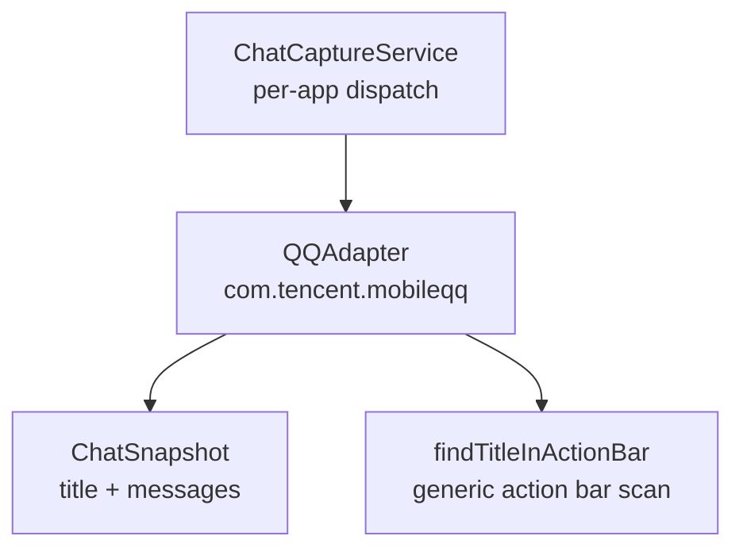
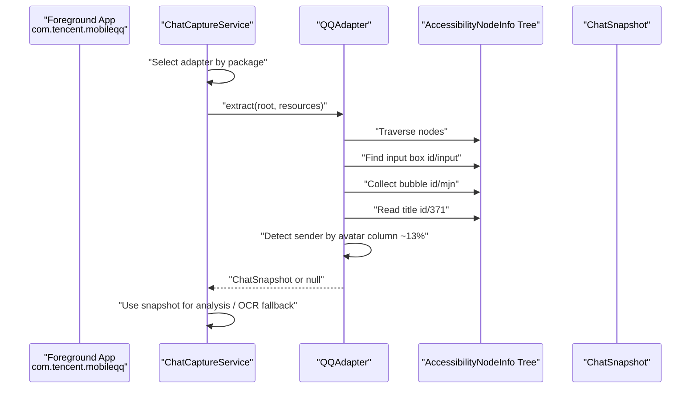
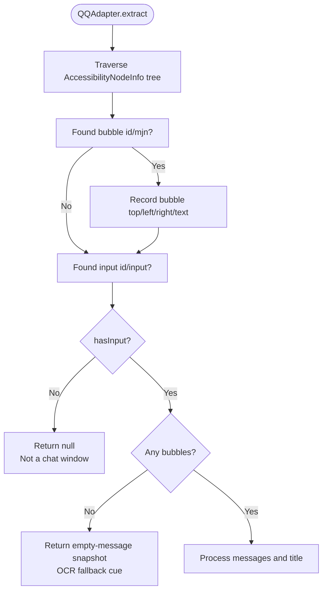
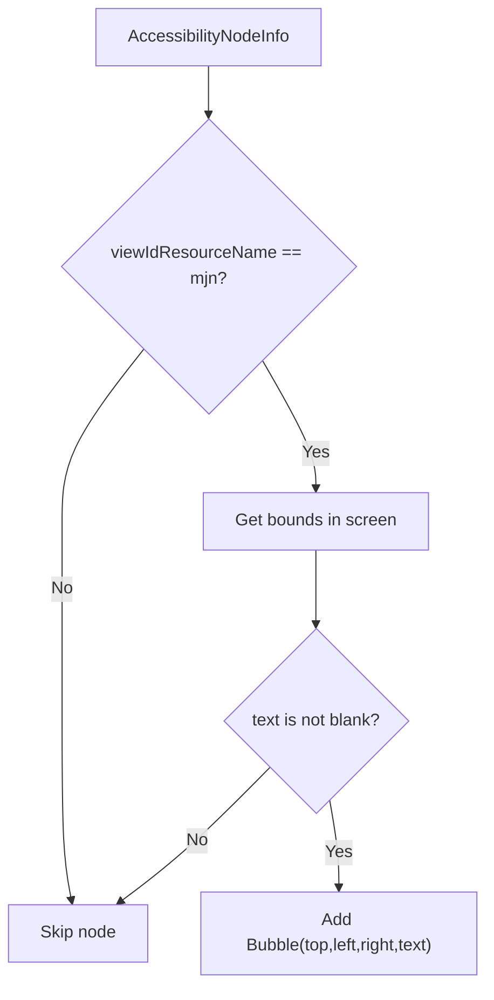
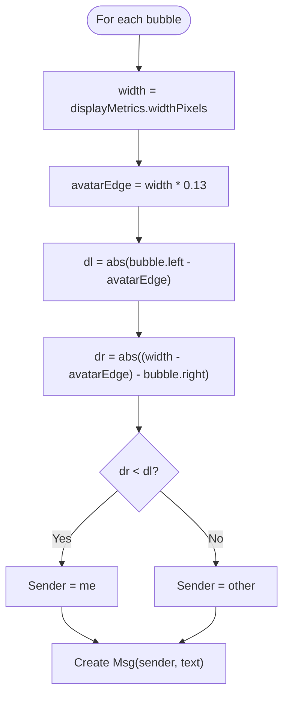
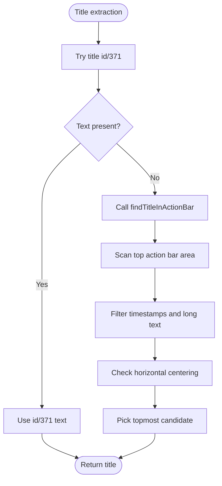
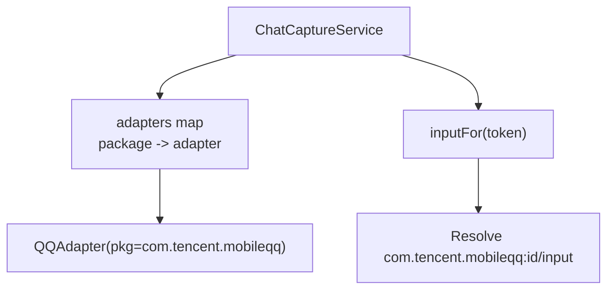
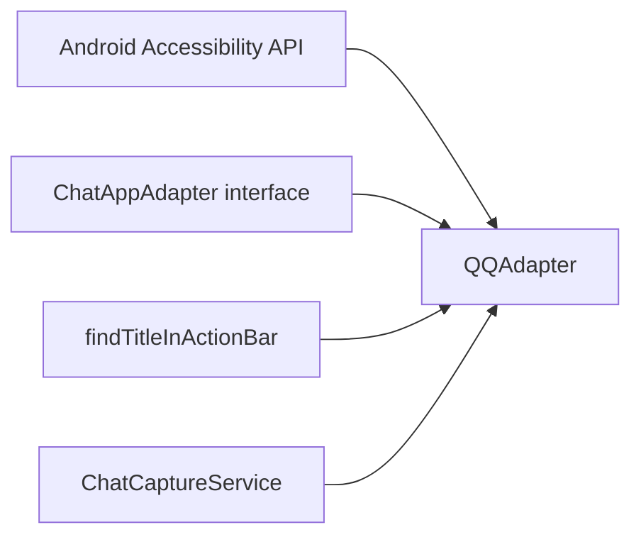

# QQ Adapter Implementation

<cite>
**Referenced Files in This Document**
- [ChatAppAdapter.kt](file://app/src/main/java/com/jev/probe/capture/ChatAppAdapter.kt)
- [ChatCaptureService.kt](file://app/src/main/java/com/jev/probe/capture/ChatCaptureService.kt)
- [CLAUDE.md](file://CLAUDE.md)
- [README.md](file://README.md)
</cite>

## Table of Contents
1. [Introduction](#introduction)
2. [Project Structure](#project-structure)
3. [Core Components](#core-components)
4. [Architecture Overview](#architecture-overview)
5. [Detailed Component Analysis](#detailed-component-analysis)
6. [Dependency Analysis](#dependency-analysis)
7. [Performance Considerations](#performance-considerations)
8. [Troubleshooting Guide](#troubleshooting-guide)
9. [Conclusion](#conclusion)

## Introduction
This document explains the QQ adapter that turns the non-obfuscated accessibility tree of `com.tencent.mobileqq` into a neutral chat snapshot. It covers how the adapter detects whether the foreground is a chat window, extracts message bubbles and titles, determines sender side using avatar column geometry, and integrates with the capture service for input resolution and OCR fallback.

The adapter targets Mobile QQ 9.3.50 on Xiaomi 14 (1200×2670), where the node tree is not obfuscated and resource IDs are stable enough to identify bubbles, title, and input box.

## Project Structure
The QQ adapter lives inside the per-app adapter layer:

**Diagram sources**
- [ChatCaptureService.kt:48-53](file://app/src/main/java/com/jev/probe/capture/ChatCaptureService.kt#L48-L53)
- [ChatAppAdapter.kt:197-247](file://app/src/main/java/com/jev/probe/capture/ChatAppAdapter.kt#L197-L247)
- [ChatAppAdapter.kt:45-74](file://app/src/main/java/com/jev/probe/capture/ChatAppAdapter.kt#L45-L74)

**Section sources**
- [ChatAppAdapter.kt:10-30](file://app/src/main/java/com/jev/probe/capture/ChatAppAdapter.kt#L10-L30)
- [ChatCaptureService.kt:29-53](file://app/src/main/java/com/jev/probe/capture/ChatCaptureService.kt#L29-L53)

## Core Components
- **ChatAppAdapter interface**: Defines the per-app contract. Each adapter exposes its package name and an `extract(root, res)` method returning either:
  - `null`: not in a chat window.
  - A snapshot with an empty message list: in a chat window but no readable body text.
  - A snapshot with messages: normal capture path.
- **QQAdapter**: Implements the contract for `com.tencent.mobileqq`.
- **findTitleInActionBar**: Shared helper used by QQ as a fallback when the dedicated title ID is missing.
- **ChatCaptureService**: Registers adapters by package name and resolves the correct input box for writing replies.

**Section sources**
- [ChatAppAdapter.kt:10-30](file://app/src/main/java/com/jev/probe/capture/ChatAppAdapter.kt#L10-L30)
- [ChatAppAdapter.kt:197-247](file://app/src/main/java/com/jev/probe/capture/ChatAppAdapter.kt#L197-L247)
- [ChatAppAdapter.kt:45-74](file://app/src/main/java/com/jev/probe/capture/ChatAppAdapter.kt#L45-L74)
- [ChatCaptureService.kt:48-53](file://app/src/main/java/com/jev/probe/capture/ChatCaptureService.kt#L48-L53)

## Architecture Overview
The QQ adapter is one of several app-specific adapters selected by the capture service based on the foreground package. For QQ, the adapter reads the live accessibility tree, identifies chat-window signals, collects message bodies, extracts or falls back to a title, and returns a structured snapshot.

**Diagram sources**
- [ChatCaptureService.kt:48-53](file://app/src/main/java/com/jev/probe/capture/ChatCaptureService.kt#L48-L53)
- [ChatAppAdapter.kt:197-247](file://app/src/main/java/com/jev/probe/capture/ChatAppAdapter.kt#L197-L247)

## Detailed Component Analysis

### QQAdapter Contract and Entry Point
`QQAdapter` implements `ChatAppAdapter` for package `com.tencent.mobileqq`. Its `extract` method is the single entry point for turning the QQ accessibility tree into a neutral snapshot.

Key responsibilities:
- Detect whether the current tree represents a chat window.
- Collect message bubbles.
- Extract the conversation title.
- Determine sender side using avatar column geometry.
- Return `null`, an empty-message snapshot, or a normal snapshot.

**Section sources**
- [ChatAppAdapter.kt:197-247](file://app/src/main/java/com/jev/probe/capture/ChatAppAdapter.kt#L197-L247)

### Chat Window Detection: Input Box Signal
QQ uses a fragment architecture under a single activity, so the adapter cannot rely on activity names to decide whether it is in a chat window. Instead, it looks for the chat input box resource ID `com.tencent.mobileqq:id/input`.

Detection logic:
- During tree traversal, if the input box is found, `hasInput` becomes true.
- If no bubbles are found and no input box is found, the adapter returns `null`, meaning “not in a chat window.”
- If the input box exists but no bubbles are found, the adapter returns a snapshot with an empty message list, signaling “in a chat window but no readable body text,” which allows the service to fall back to screenshot-based OCR.

**Diagram sources**
- [ChatAppAdapter.kt:200-228](file://app/src/main/java/com/jev/probe/capture/ChatAppAdapter.kt#L200-L228)

**Section sources**
- [ChatAppAdapter.kt:182-196](file://app/src/main/java/com/jev/probe/capture/ChatAppAdapter.kt#L182-L196)
- [ChatAppAdapter.kt:200-228](file://app/src/main/java/com/jev/probe/capture/ChatAppAdapter.kt#L200-L228)

### Message Bubble Collection: Resource ID Filtering
The adapter collects message bodies by matching the resource ID `com.tencent.mobileqq:id/mjn`. This ID corresponds to plain TextViews carrying the actual message text.

Important filtering behavior:
- Only nodes with this exact bubble ID are treated as message bodies.
- Timestamps, sender nicknames (`id/mjq`), and full-width system notice strips do not use this ID, so they are naturally excluded.
- For each bubble, the adapter records screen coordinates (`top`, `left`, `right`) and text.

**Diagram sources**
- [ChatAppAdapter.kt:216-220](file://app/src/main/java/com/jev/probe/capture/ChatAppAdapter.kt#L216-L220)

**Section sources**
- [ChatAppAdapter.kt:182-190](file://app/src/main/java/com/jev/probe/capture/ChatAppAdapter.kt#L182-L190)
- [ChatAppAdapter.kt:216-220](file://app/src/main/java/com/jev/probe/capture/ChatAppAdapter.kt#L216-L220)

### Avatar-Based Sender Detection Algorithm
QQ pins avatars near the outer edges of the screen:
- Other people’s avatars appear on the left at approximately 13% of screen width.
- The user’s own avatars appear on the right at approximately `width − 13% × width`.

Because long incoming messages can push their visual center past mid-screen, the adapter does not compare bubble centers. Instead, it compares which edge of the bubble is closer to the avatar column:
- Compute `avatarEdge = width × 0.13`.
- Compare distance from bubble left edge to left avatar column versus distance from bubble right edge to right avatar column.
- If the right-side distance is smaller, mark the message as `"me"`; otherwise mark it as `"other"`.

**Diagram sources**
- [ChatAppAdapter.kt:230-236](file://app/src/main/java/com/jev/probe/capture/ChatAppAdapter.kt#L230-L236)

**Section sources**
- [ChatAppAdapter.kt:192-196](file://app/src/main/java/com/jev/probe/capture/ChatAppAdapter.kt#L192-L196)
- [ChatAppAdapter.kt:230-236](file://app/src/main/java/com/jev/probe/capture/ChatAppAdapter.kt#L230-L236)

### Title Extraction: Dedicated ID and Fallback
The adapter first tries to read the title directly from the resource ID `com.tencent.mobileqq:id/371`. If that ID is absent or has no usable text, it falls back to the generic action bar scanner.

Fallback behavior:
- Uses `findTitleInActionBar(root, firstBubbleTop, width, res)`.
- Searches the top portion of the screen above the first bubble.
- Filters out timestamps and overly long strings.
- Looks for short, roughly centered text in the action bar region.

**Diagram sources**
- [ChatAppAdapter.kt:222-227](file://app/src/main/java/com/jev/probe/capture/ChatAppAdapter.kt#L222-L227)
- [ChatAppAdapter.kt:45-74](file://app/src/main/java/com/jev/probe/capture/ChatAppAdapter.kt#L45-L74)

**Section sources**
- [ChatAppAdapter.kt:222-227](file://app/src/main/java/com/jev/probe/capture/ChatAppAdapter.kt#L222-L227)
- [ChatAppAdapter.kt:38-74](file://app/src/main/java/com/jev/probe/capture/ChatAppAdapter.kt#L38-L74)

### Integration with ChatCaptureService
The capture service registers `QQAdapter` by package name and invokes its `extract` method when the foreground app is `com.tencent.mobileqq`. It also resolves the QQ input box by view ID when the user requests filling the reply.

Relevant integration points:
- Adapter registration: `QQAdapter()` is included in the adapter map keyed by package name.
- Input resolution: For QQ, the service resolves the input box using `root.findAccessibilityNodeInfosByViewId("com.tencent.mobileqq:id/input")`.
- Safety: The service never performs send actions; it only writes to the input field or copies to clipboard.

**Diagram sources**
- [ChatCaptureService.kt:48-53](file://app/src/main/java/com/jev/probe/capture/ChatCaptureService.kt#L48-L53)
- [ChatCaptureService.kt:715-717](file://app/src/main/java/com/jev/probe/capture/ChatCaptureService.kt#L715-L717)

**Section sources**
- [ChatCaptureService.kt:48-53](file://app/src/main/java/com/jev/probe/capture/ChatCaptureService.kt#L48-L53)
- [ChatCaptureService.kt:704-730](file://app/src/main/java/com/jev/probe/capture/ChatCaptureService.kt#L704-L730)

## Dependency Analysis
The QQ adapter depends on:
- Android accessibility APIs through `AccessibilityNodeInfo` and `Resources`.
- The shared `ChatAppAdapter` interface.
- The shared title helper `findTitleInActionBar`.
- The capture service for dispatch and input resolution.

**Diagram sources**
- [ChatAppAdapter.kt:197-247](file://app/src/main/java/com/jev/probe/capture/ChatAppAdapter.kt#L197-L247)
- [ChatAppAdapter.kt:45-74](file://app/src/main/java/com/jev/probe/capture/ChatAppAdapter.kt#L45-L74)
- [ChatCaptureService.kt:48-53](file://app/src/main/java/com/jev/probe/capture/ChatCaptureService.kt#L48-L53)

**Section sources**
- [ChatAppAdapter.kt:10-30](file://app/src/main/java/com/jev/probe/capture/ChatAppAdapter.kt#L10-L30)
- [ChatAppAdapter.kt:197-247](file://app/src/main/java/com/jev/probe/capture/ChatAppAdapter.kt#L197-L247)
- [ChatCaptureService.kt:48-53](file://app/src/main/java/com/jev/probe/capture/ChatCaptureService.kt#L48-L53)

## Performance Considerations
- **Guarded tree traversal**: The adapter uses a stack-based traversal with a guard counter capped at 5000 iterations. This prevents infinite loops or extremely deep trees from blocking the main thread.
- **Early exit conditions**:
  - If no bubbles and no input box are found, the adapter returns `null` immediately after traversal.
  - If the input box exists but no bubbles exist, it returns an empty-message snapshot rather than continuing expensive processing.
- **Coordinate computation**: Bubble rectangles are computed only for nodes matching the bubble ID, reducing unnecessary `getBoundsInScreen` calls.
- **Sorting**: Bubbles are sorted by top coordinate before mapping to messages, ensuring chronological order.
- **Avatar comparison**: The sender detection avoids expensive geometry beyond simple absolute differences and comparisons.

These characteristics make the adapter suitable for frequent accessibility callbacks while keeping CPU usage bounded.

**Section sources**
- [ChatAppAdapter.kt:208-224](file://app/src/main/java/com/jev/probe/capture/ChatAppAdapter.kt#L208-L224)
- [ChatAppAdapter.kt:230-236](file://app/src/main/java/com/jev/probe/capture/ChatAppAdapter.kt#L230-L236)

## Troubleshooting Guide

### QQ Version Compatibility
- The implementation is verified against Mobile QQ 9.3.50 on Xiaomi 14 (1200×2670).
- On this version, the node tree is not obfuscated, and resource IDs such as `mjn`, `371`, and `input` are available.
- If a newer or older QQ version changes these IDs, the adapter may fail to detect bubbles, titles, or input boxes.

Symptoms:
- Adapter returns `null` even when in a chat window: likely missing `id/input`.
- Adapter returns empty-message snapshot: bubbles `id/mjn` may have changed or been hidden.
- Title remains unknown: `id/371` may be absent; fallback scanning may pick unrelated UI text.

Recommended checks:
- Use `adb shell uiautomator dump` to inspect exposed resource IDs.
- Confirm whether QQ still exposes `com.tencent.mobileqq:id/mjn`, `com.tencent.mobileqq:id/371`, and `com.tencent.mobileqq:id/input`.
- If IDs change, update the constants in `QQAdapter.companion object`.

**Section sources**
- [CLAUDE.md:31-32](file://CLAUDE.md#L31-L32)
- [ChatAppAdapter.kt:182-196](file://app/src/main/java/com/jev/probe/capture/ChatAppAdapter.kt#L182-L196)
- [ChatAppAdapter.kt:242-246](file://app/src/main/java/com/jev/probe/capture/ChatAppAdapter.kt#L242-L246)

### Error Handling Semantics
The adapter follows the adapter contract:
- `null`: Not in a chat window.
- Empty message list: In a chat window but no readable body text.
- Non-empty message list: Normal capture.

Only the second case triggers OCR fallback in the broader capture pipeline. This distinction is important because the presence of an input box alone proves a chat window, even if the tree carries no message text.

**Section sources**
- [ChatAppAdapter.kt:15-21](file://app/src/main/java/com/jev/probe/capture/ChatAppAdapter.kt#L15-L21)
- [ChatAppAdapter.kt:225-228](file://app/src/main/java/com/jev/probe/capture/ChatAppAdapter.kt#L225-L228)
- [README.md:217-219](file://README.md#L217-L219)

### Input Resolution Failures
If the service cannot fill the QQ input box:
- Verify that the same window is still active.
- Verify that `com.tencent.mobileqq:id/input` still exists.
- Ensure the input node is visible, enabled, and not a password field.
- If resolution fails, the service copies the reply to the clipboard instead of attempting unsafe writes.

**Section sources**
- [ChatCaptureService.kt:704-730](file://app/src/main/java/com/jev/probe/capture/ChatCaptureService.kt#L704-L730)

## Conclusion
The QQ adapter provides a focused, ID-driven parser for `com.tencent.mobileqq`’s non-obfuscated accessibility tree. It reliably detects chat windows via the input box, extracts message bodies via the bubble ID, falls back to a generic action bar title scan when needed, and determines sender side using avatar column geometry at approximately 13% from the screen edges. Its guarded traversal and clear error semantics make it robust across typical QQ versions, while remaining easy to adapt if QQ changes its resource IDs.