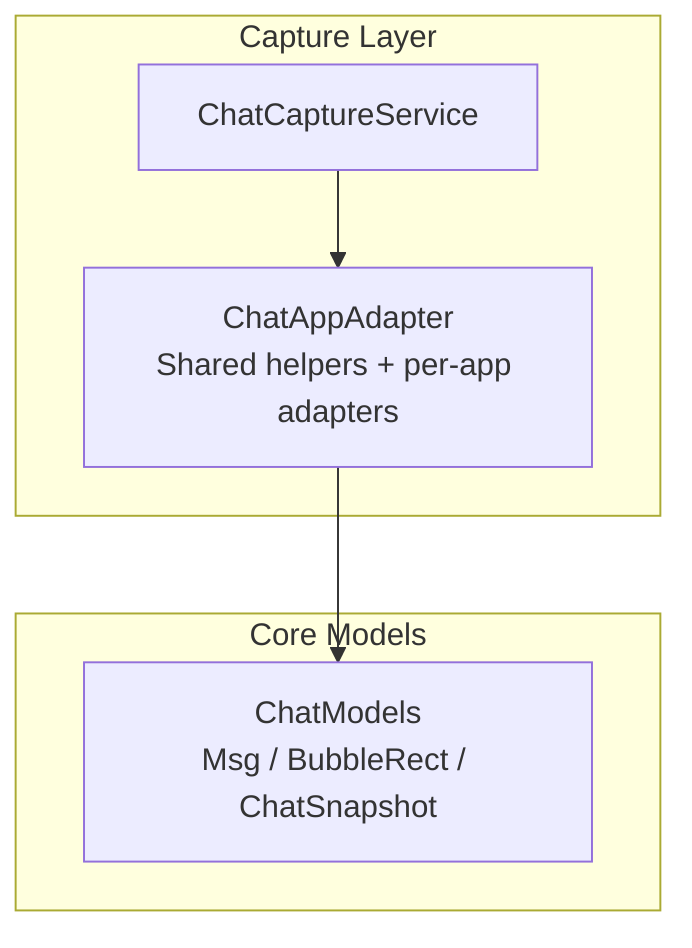
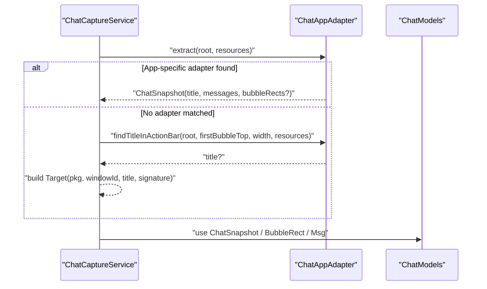
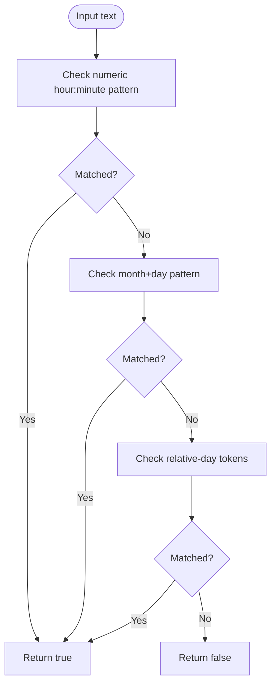
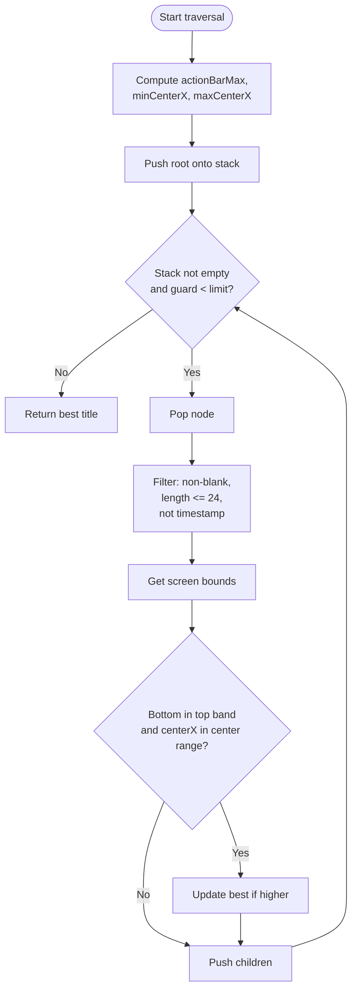
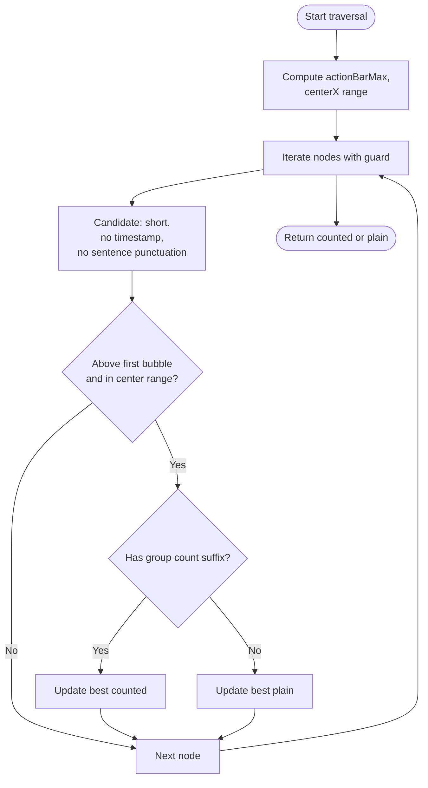
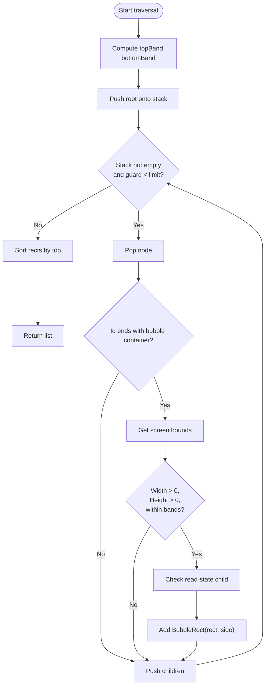
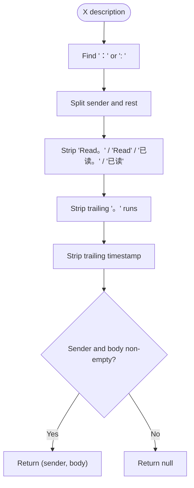
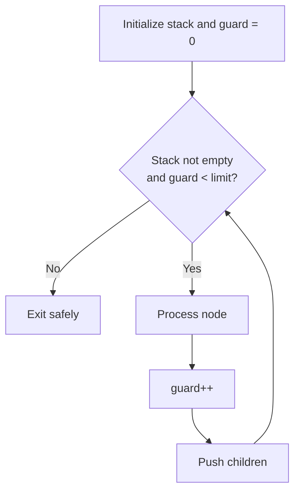
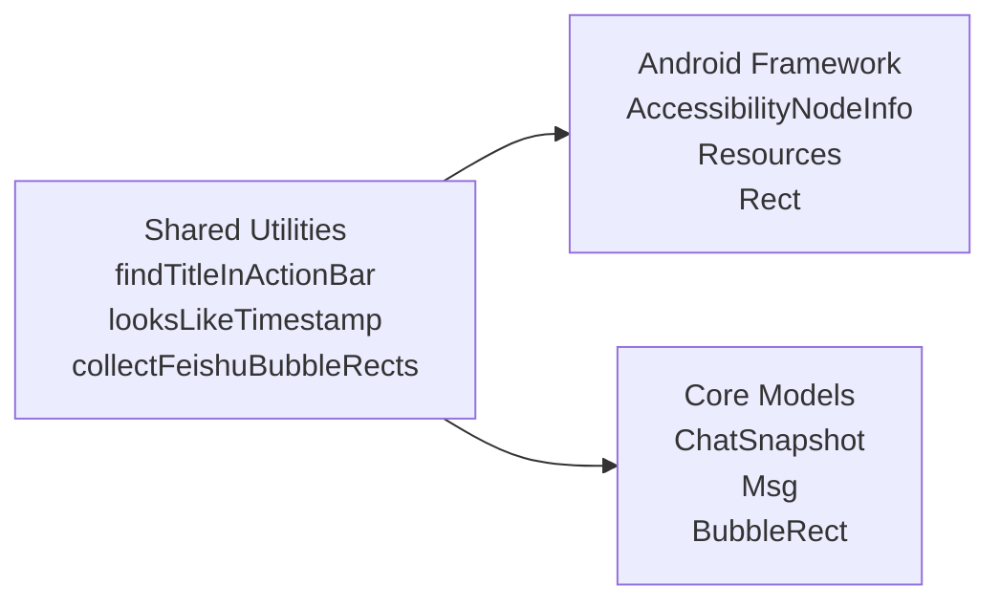

# Shared Utilities and Helpers

<cite>
**Referenced Files in This Document**
- [ChatAppAdapter.kt](file://app/src/main/java/com/jev/probe/capture/ChatAppAdapter.kt)
- [ChatCaptureService.kt](file://app/src/main/java/com/jev/probe/capture/ChatCaptureService.kt)
- [ChatModels.kt](file://app/src/main/java/com/jev/probe/core/ChatModels.kt)
</cite>

## Table of Contents
1. [Introduction](#introduction)
2. [Project Structure](#project-structure)
3. [Core Components](#core-components)
4. [Architecture Overview](#architecture-overview)
5. [Detailed Component Analysis](#detailed-component-analysis)
6. [Dependency Analysis](#dependency-analysis)
7. [Performance Considerations](#performance-considerations)
8. [Troubleshooting Guide](#troubleshooting-guide)
9. [Conclusion](#conclusion)

## Introduction
This document explains the shared utility functions used across all platform adapters for chat capture. It focuses on:
- Generic action bar title detection through `findTitleInActionBar`.
- Timestamp pattern matching through `looksLikeTimestamp`.
- Bubble rectangle identification, center position calculations, and UI element filtering.
- Text-format helpers such as WeChat group-title filtering and X message parsing.
- Guard mechanisms that prevent infinite loops during accessibility node tree traversal.
- Best practices for adapting these utilities to new platforms and optimizing performance on large UI trees.

These utilities are primarily located in the adapter layer and core model layer, with usage by the capture service when no app-specific adapter matches.

## Project Structure
The relevant code is organized around three main areas:
- Adapter layer: per-app extraction logic and shared helper functions.
- Core models: neutral data structures representing messages, bubble rectangles, and snapshots.
- Capture service: orchestration that uses adapters or falls back to generic helpers.

**Diagram sources**
- [ChatCaptureService.kt:106-122](file://app/src/main/java/com/jev/probe/capture/ChatCaptureService.kt#L106-L122)
- [ChatAppAdapter.kt:10-30](file://app/src/main/java/com/jev/probe/capture/ChatAppAdapter.kt#L10-L30)
- [ChatModels.kt:5-38](file://app/src/main/java/com/jev/probe/core/ChatModels.kt#L5-L38)

**Section sources**
- [ChatAppAdapter.kt:10-30](file://app/src/main/java/com/jev/probe/capture/ChatAppAdapter.kt#L10-L30)
- [ChatModels.kt:5-38](file://app/src/main/java/com/jev/probe/core/ChatModels.kt#L5-L38)
- [ChatCaptureService.kt:106-122](file://app/src/main/java/com/jev/probe/capture/ChatCaptureService.kt#L106-L122)

## Core Components
This section summarizes the shared utilities and their responsibilities.

- `looksLikeTimestamp`: Detects likely timestamp strings so they are not mistaken for conversation titles or message bodies.
- `findTitleInActionBar`: Finds a short, roughly centered text candidate above the first message bubble, excluding timestamps.
- `findWeChatTitle`: A stricter variant for WeChat that excludes sentence-like punctuation and prefers group member-count suffixes.
- `collectFeishuBubbleRects`: Collects Feishu bubble rectangles in screen coordinates with inferred side information.
- `parseXDesc`: Splits an X direct-message row description into sender and body, stripping trailing chrome like read receipts and timestamps.
- `feishuHasReadState`: Checks whether a Feishu bubble carries the “sent/read” strip indicating it belongs to the current user.

These utilities share common patterns:
- Iterative depth-first traversal using a stack.
- Guard counters limiting iterations to avoid infinite loops.
- Screen-boundary checks using display metrics.
- Center-position heuristics based on view bounds.
- Regex-based text filtering for timestamps, punctuation, and chrome.

**Section sources**
- [ChatAppAdapter.kt:33-36](file://app/src/main/java/com/jev/probe/capture/ChatAppAdapter.kt#L33-L36)
- [ChatAppAdapter.kt:45-74](file://app/src/main/java/com/jev/probe/capture/ChatAppAdapter.kt#L45-L74)
- [ChatAppAdapter.kt:93-128](file://app/src/main/java/com/jev/probe/capture/ChatAppAdapter.kt#L93-L128)
- [ChatAppAdapter.kt:253-265](file://app/src/main/java/com/jev/probe/capture/ChatAppAdapter.kt#L253-L265)
- [ChatAppAdapter.kt:276-301](file://app/src/main/java/com/jev/probe/capture/ChatAppAdapter.kt#L276-L301)
- [ChatAppAdapter.kt:399-419](file://app/src/main/java/com/jev/probe/capture/ChatAppAdapter.kt#L399-L419)

## Architecture Overview
The shared utilities sit between per-app adapters and the capture service. Adapters extract structured chat data; if no adapter matches, the service uses generic title detection. For apps where text is drawn rather than exposed as views, bubble rectangles are collected and later OCR’d.

**Diagram sources**
- [ChatCaptureService.kt:106-122](file://app/src/main/java/com/jev/probe/capture/ChatCaptureService.kt#L106-L122)
- [ChatAppAdapter.kt:45-74](file://app/src/main/java/com/jev/probe/capture/ChatAppAdapter.kt#L45-L74)
- [ChatModels.kt:5-38](file://app/src/main/java/com/jev/probe/core/ChatModels.kt#L5-L38)

## Detailed Component Analysis

### Timestamp Pattern Matching: `looksLikeTimestamp`
`looksLikeTimestamp` filters out likely time strings before treating text as a title or message body. It recognizes:
- Numeric hour and minute patterns with colon separators.
- Date-like patterns using month and day characters.
- Common relative-day tokens.

This prevents timestamps from being mistaken for conversation titles or message content.

**Diagram sources**
- [ChatAppAdapter.kt:33-36](file://app/src/main/java/com/jev/probe/capture/ChatAppAdapter.kt#L33-L36)

**Section sources**
- [ChatAppAdapter.kt:33-36](file://app/src/main/java/com/jev/probe/capture/ChatAppAdapter.kt#L33-L36)

### Generic Action Bar Title Detection: `findTitleInActionBar`
`findTitleInActionBar` searches the accessibility tree for a short, non-timestamp text candidate that is:
- Above the first message bubble.
- Within a top-band region derived from display height.
- Roughly centered horizontally within configurable min/max center ratios.
- Short enough to be plausible as a title.

It returns the topmost qualifying text.

**Diagram sources**
- [ChatAppAdapter.kt:45-74](file://app/src/main/java/com/jev/probe/capture/ChatAppAdapter.kt#L45-L74)

Key behaviors:
- Uses a stack-based iterative traversal instead of recursion to avoid stack overflows.
- Applies a guard counter to cap iterations.
- Computes center position via `centerX()` and compares against ratio-derived ranges.
- Excludes timestamps using `looksLikeTimestamp`.

**Section sources**
- [ChatAppAdapter.kt:45-74](file://app/src/main/java/com/jev/probe/capture/ChatAppAdapter.kt#L45-L74)

### WeChat-Specific Title Filtering: `findWeChatTitle`
WeChat requires stricter filtering because group announcements or stray messages can appear in the same search region as the title. The function:
- Excludes Chinese sentence punctuation.
- Prefers group titles with a trailing member count suffix.
- Enforces that candidates must be above the first bubble.
- Returns the best counted title if present, otherwise the best plain title.

**Diagram sources**
- [ChatAppAdapter.kt:93-128](file://app/src/main/java/com/jev/probe/capture/ChatAppAdapter.kt#L93-L128)

**Section sources**
- [ChatAppAdapter.kt:76-82](file://app/src/main/java/com/jev/probe/capture/ChatAppAdapter.kt#L76-L82)
- [ChatAppAdapter.kt:93-128](file://app/src/main/java/com/jev/probe/capture/ChatAppAdapter.kt#L93-L128)

### Bubble Rectangle Identification: `collectFeishuBubbleRects`
For Feishu/Lark, message text is drawn rather than exposed as accessible text. The utility collects bubble rectangles in screen coordinates and infers side information:
- Filters nodes by resource id ending with a known bubble container id.
- Validates positive width and height.
- Constrains bubbles to a middle vertical band (excluding action bar and input area).
- Infers side by checking for a read-receipt strip child.

**Diagram sources**
- [ChatAppAdapter.kt:276-301](file://app/src/main/java/com/jev/probe/capture/ChatAppAdapter.kt#L276-L301)
- [ChatAppAdapter.kt:253-265](file://app/src/main/java/com/jev/probe/capture/ChatAppAdapter.kt#L253-L265)

**Section sources**
- [ChatAppAdapter.kt:253-265](file://app/src/main/java/com/jev/probe/capture/ChatAppAdapter.kt#L253-L265)
- [ChatAppAdapter.kt:276-301](file://app/src/main/java/com/jev/probe/capture/ChatAppAdapter.kt#L276-L301)

### Center Position Calculations and UI Element Filtering
Across adapters, center position and filtering follow consistent patterns:
- Center position:
  - Use `centerX()` for quick horizontal positioning.
  - Compare against ratio-derived ranges (`minCenterRatio`, `maxCenterRatio`) to tolerate app-specific layout differences.
- Vertical constraints:
  - Top band excludes action bars and tabs.
  - Bottom band excludes input boxes and keyboards.
- UI element filtering:
  - Exclude timestamps via `looksLikeTimestamp`.
  - Exclude chrome elements by resource id or class name.
  - Exclude sentence-like text for titles using punctuation filters.

Examples:
- QQ avatar-edge heuristic compares left/right distances to determine sender side.
- Feishu filters TextViews by class and id to skip chrome.
- X filters full-width rows and strips trailing chrome from descriptions.

**Section sources**
- [ChatAppAdapter.kt:197-247](file://app/src/main/java/com/jev/probe/capture/ChatAppAdapter.kt#L197-L247)
- [ChatAppAdapter.kt:319-376](file://app/src/main/java/com/jev/probe/capture/ChatAppAdapter.kt#L319-L376)
- [ChatAppAdapter.kt:440-510](file://app/src/main/java/com/jev/probe/capture/ChatAppAdapter.kt#L440-L510)

### Text Format Helpers: WeChat and X
- WeChat:
  - Excludes Chinese punctuation to avoid treating announcement lines as titles.
  - Recognizes group member-count suffixes in parentheses.
- X:
  - Parses sender/body split using full-width or half-width separators.
  - Strips trailing read receipts, dots, and timestamps.
  - Guards against DM-list-only signals to avoid misclassifying lists as threads.

**Diagram sources**
- [ChatAppAdapter.kt:399-419](file://app/src/main/java/com/jev/probe/capture/ChatAppAdapter.kt#L399-L419)

**Section sources**
- [ChatAppAdapter.kt:76-82](file://app/src/main/java/com/jev/probe/capture/ChatAppAdapter.kt#L76-L82)
- [ChatAppAdapter.kt:399-419](file://app/src/main/java/com/jev/probe/capture/ChatAppAdapter.kt#L399-L419)

### Guard Mechanisms for Node Tree Traversal
All traversals use:
- An explicit stack (`ArrayDeque`) to avoid recursion depth issues.
- A guard counter incremented each iteration.
- A loop condition that stops when the stack empties or the guard reaches a threshold.

Thresholds vary by function:
- Title detection: ~5000 iterations.
- Feishu bubble collection: ~6000 iterations.
- Read-state check: ~400 iterations.
- Logging/debugging traversal: ~5000 iterations.

This design prevents infinite loops caused by malformed or cyclic accessibility trees.

**Diagram sources**
- [ChatAppAdapter.kt:45-74](file://app/src/main/java/com/jev/probe/capture/ChatAppAdapter.kt#L45-L74)
- [ChatAppAdapter.kt:276-301](file://app/src/main/java/com/jev/probe/capture/ChatAppAdapter.kt#L276-L301)
- [ChatAppAdapter.kt:253-265](file://app/src/main/java/com/jev/probe/capture/ChatAppAdapter.kt#L253-L265)
- [ChatCaptureService.kt:507-524](file://app/src/main/java/com/jev/probe/capture/ChatCaptureService.kt#L507-L524)

**Section sources**
- [ChatAppAdapter.kt:45-74](file://app/src/main/java/com/jev/probe/capture/ChatAppAdapter.kt#L45-L74)
- [ChatAppAdapter.kt:253-265](file://app/src/main/java/com/jev/probe/capture/ChatAppAdapter.kt#L253-L265)
- [ChatAppAdapter.kt:276-301](file://app/src/main/java/com/jev/probe/capture/ChatAppAdapter.kt#L276-L301)
- [ChatCaptureService.kt:507-524](file://app/src/main/java/com/jev/probe/capture/ChatCaptureService.kt#L507-L524)

## Dependency Analysis
The shared utilities depend on Android framework types and core models:
- `AccessibilityNodeInfo` for tree traversal.
- `Resources` and `displayMetrics` for screen geometry.
- `Rect` for bounds and center calculations.
- `ChatSnapshot`, `Msg`, and `BubbleRect` for structured results.

**Diagram sources**
- [ChatAppAdapter.kt:1-9](file://app/src/main/java/com/jev/probe/capture/ChatAppAdapter.kt#L1-L9)
- [ChatModels.kt:1-13](file://app/src/main/java/com/jev/probe/core/ChatModels.kt#L1-L13)

**Section sources**
- [ChatAppAdapter.kt:1-9](file://app/src/main/java/com/jev/probe/capture/ChatAppAdapter.kt#L1-L9)
- [ChatModels.kt:1-13](file://app/src/main/java/com/jev/probe/core/ChatModels.kt#L1-L13)

## Performance Considerations
Optimization tips for large UI trees:
- Prefer iterative traversal with a stack to avoid recursion overhead and stack overflow risks.
- Apply early filters (text length, timestamp check, id/class checks) before computing bounds.
- Use ratio-based center ranges to reduce sensitivity to device-specific layouts.
- Limit traversal depth with guard counters to prevent runaway processing.
- Reuse computed screen bands (top/bottom) to avoid repeated multiplication.
- Avoid unnecessary string operations; trim and filter only when necessary.
- For OCR-heavy flows, collect stable signatures from bubble rectangles to debounce screenshots.

[No sources needed since this section provides general guidance]

## Troubleshooting Guide
Common issues and diagnostics:
- If no adapter matches, the service logs tree ids and counts to help identify changed resource ids.
- If titles are incorrect, verify center ratios and top-band constraints.
- If timestamps leak into titles, ensure `looksLikeTimestamp` covers the app’s formats.
- If bubble rectangles are missing, confirm id suffixes and vertical band thresholds.

Useful diagnostic points:
- Tree id logging when no chat window is matched.
- OCR signature construction using package, title, and bubble rectangles.

**Section sources**
- [ChatCaptureService.kt:507-524](file://app/src/main/java/com/jev/probe/capture/ChatCaptureService.kt#L507-L524)
- [ChatCaptureService.kt:535-541](file://app/src/main/java/com/jev/probe/capture/ChatCaptureService.kt#L535-L541)

## Conclusion
The shared utilities provide robust, reusable building blocks for detecting titles, filtering timestamps, identifying bubble rectangles, and calculating center positions across platform adapters. They emphasize safety through guard mechanisms, clarity through consistent filtering patterns, and extensibility through configurable parameters. When adapting to new platforms, follow the established patterns: iterate safely, filter aggressively, constrain by screen regions, and validate with stable signatures.

[No sources needed since this section summarizes without analyzing specific files]