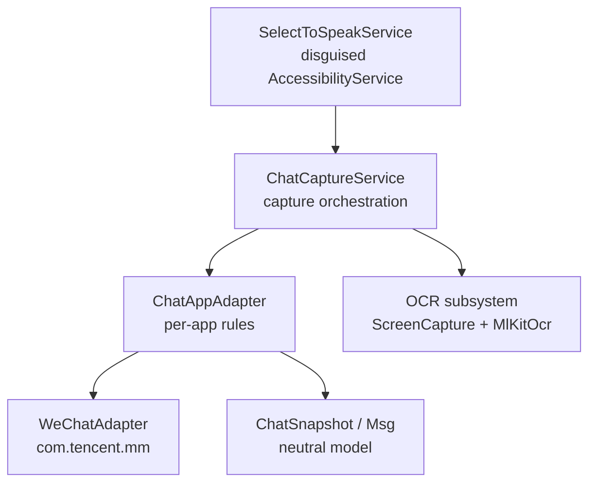
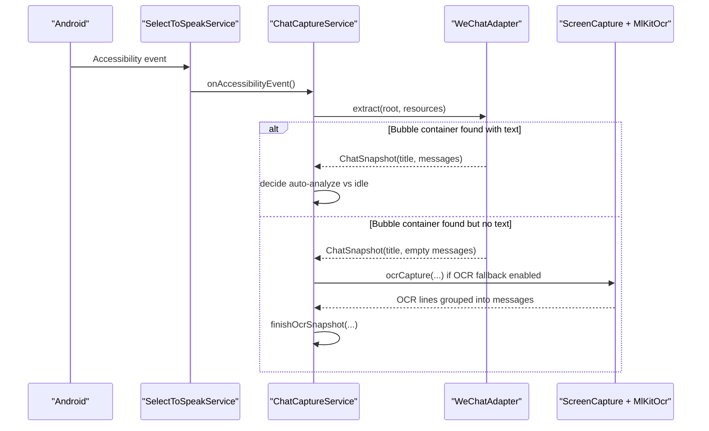
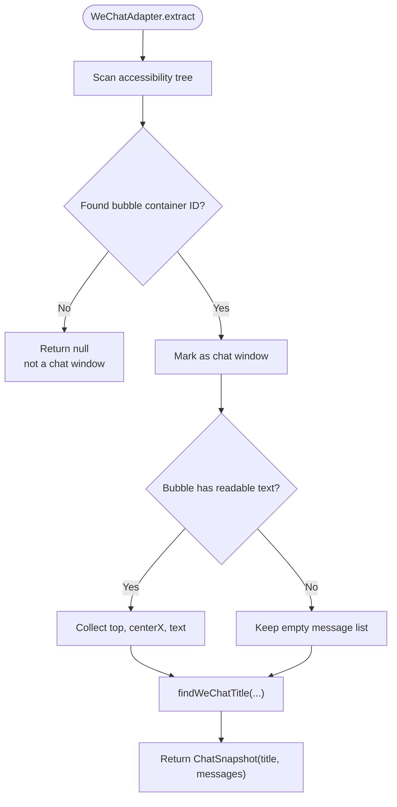
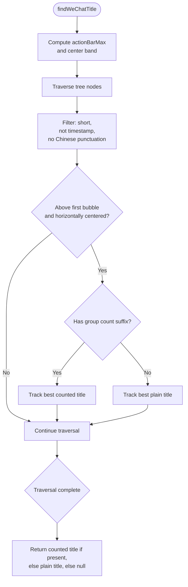
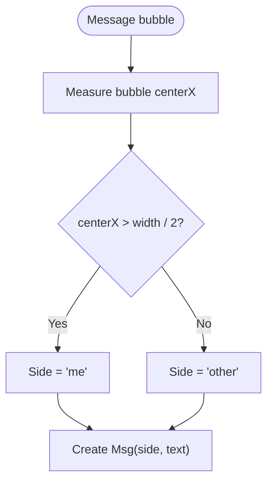
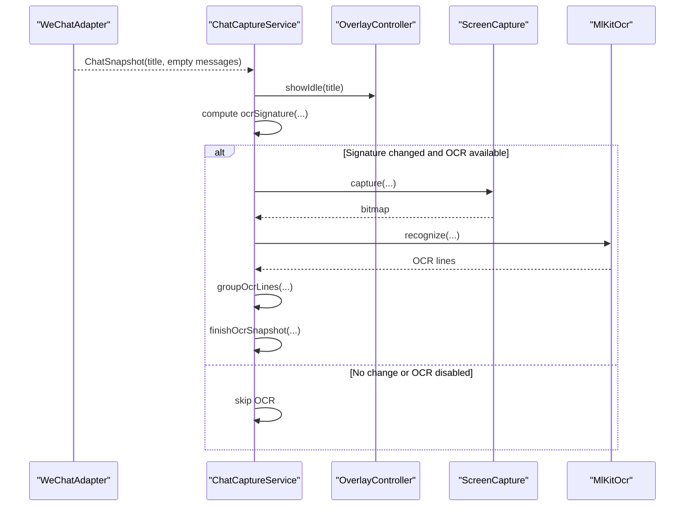
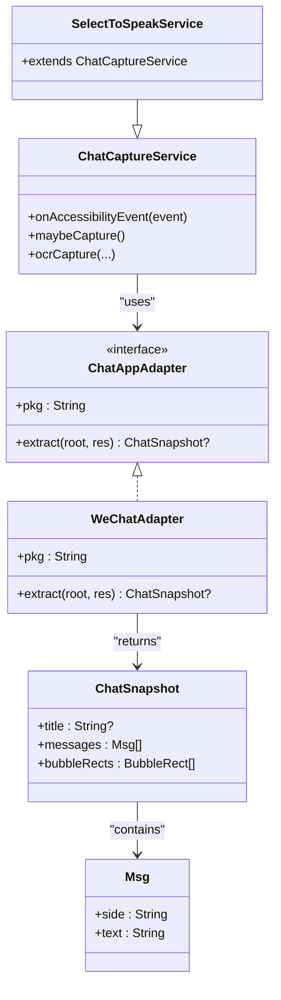

# WeChat Adapter Implementation

<cite>
**Referenced Files in This Document**
- [ChatAppAdapter.kt](file://app/src/main/java/com/jev/probe/capture/ChatAppAdapter.kt)
- [ChatCaptureService.kt](file://app/src/main/java/com/jev/probe/capture/ChatCaptureService.kt)
- [SelectToSpeakService.kt](file://app/src/main/java/com/google/android/accessibility/selecttospeak/SelectToSpeakService.kt)
- [MlKitOcr.kt](file://app/src/main/java/com/jev/probe/capture/ocr/MlKitOcr.kt)
- [ScreenCapture.kt](file://app/src/main/java/com/jev/probe/capture/ocr/ScreenCapture.kt)
- [ChatModels.kt](file://app/src/main/java/com/jev/probe/core/ChatModels.kt)
</cite>

## Table of Contents
1. [Introduction](#introduction)
2. [Project Structure](#project-structure)
3. [Core Components](#core-components)
4. [Architecture Overview](#architecture-overview)
5. [Detailed Component Analysis](#detailed-component-analysis)
6. [Dependency Analysis](#dependency-analysis)
7. [Performance Considerations](#performance-considerations)
8. [Troubleshooting Guide](#troubleshooting-guide)
9. [Conclusion](#conclusion)

## Introduction
This document explains the WeChat adapter implementation that turns WeChat’s obfuscated accessibility tree into a neutral chat snapshot. It focuses on how the adapter detects a real chat window even when text is stripped, how it identifies conversation titles, how it determines whether a message was sent by “me” or “other”, and how the OCR fallback works when text nodes are inaccessible.

## Project Structure
The WeChat-specific logic lives under the capture layer:

- `ChatAppAdapter.kt` defines the per-app adapter contract and implements `WeChatAdapter`, plus shared title helpers.
- `ChatCaptureService.kt` orchestrates live capture, session tracking, OCR fallback, and overlay behavior.
- `SelectToSpeakService.kt` disguises the service class name so WeChat exposes its node tree.
- OCR-related classes (`MlKitOcr.kt`, `ScreenCapture.kt`) provide screenshot and text recognition.
- `ChatModels.kt` defines the neutral data model used by all adapters.

**Diagram sources**
- [SelectToSpeakService.kt:5-13](file://app/src/main/java/com/google/android/accessibility/selecttospeak/SelectToSpeakService.kt#L5-L13)
- [ChatCaptureService.kt:29-53](file://app/src/main/java/com/jev/probe/capture/ChatCaptureService.kt#L29-L53)
- [ChatAppAdapter.kt:10-30](file://app/src/main/java/com/jev/probe/capture/ChatAppAdapter.kt#L10-L30)
- [ChatAppAdapter.kt:139-179](file://app/src/main/java/com/jev/probe/capture/ChatAppAdapter.kt#L139-L179)
- [ChatModels.kt:11-25](file://app/src/main/java/com/jev/probe/core/ChatModels.kt#L11-L25)

**Section sources**
- [ChatAppAdapter.kt:10-30](file://app/src/main/java/com/jev/probe/capture/ChatAppAdapter.kt#L10-L30)
- [ChatCaptureService.kt:29-53](file://app/src/main/java/com/jev/probe/capture/ChatCaptureService.kt#L29-L53)
- [SelectToSpeakService.kt:5-13](file://app/src/main/java/com/google/android/accessibility/selecttospeak/SelectToSpeakService.kt#L5-L13)

## Core Components
- `ChatAppAdapter`: interface describing per-app extraction from an accessibility tree into a neutral `ChatSnapshot`.
- `WeChatAdapter`: concrete adapter for `com.tencent.mm`.
- `findWeChatTitle`: WeChat-specific title detection that filters out Chinese punctuation and group member-count suffixes.
- `ChatCaptureService`: service that selects the active adapter, runs analysis, and triggers OCR fallback when needed.
- OCR subsystem: `ScreenCapture` captures the screen; `MlKitOcr` performs text recognition.

Key responsibilities:
- Detecting a WeChat chat window using a stable bubble container ID rather than relying on visible text.
- Extracting messages with sender side inferred from horizontal position.
- Falling back to OCR when the accessibility tree cannot expose message text.

**Section sources**
- [ChatAppAdapter.kt:10-30](file://app/src/main/java/com/jev/probe/capture/ChatAppAdapter.kt#L10-L30)
- [ChatAppAdapter.kt:139-179](file://app/src/main/java/com/jev/probe/capture/ChatAppAdapter.kt#L139-L179)
- [ChatCaptureService.kt:188-329](file://app/src/main/java/com/jev/probe/capture/ChatCaptureService.kt#L188-L329)
- [ChatModels.kt:11-25](file://app/src/main/java/com/jev/probe/core/ChatModels.kt#L11-L25)

## Architecture Overview
The WeChat path is designed around three layers:

1. **Disguised service**: The app registers an accessibility service under a disguised class name so WeChat does not hide its node tree.
2. **Adapter layer**: `WeChatAdapter` scans the tree for a stable bubble container ID and builds a neutral snapshot.
3. **Service layer**: `ChatCaptureService` decides whether to analyze automatically, show an idle overlay, or trigger OCR.

**Diagram sources**
- [SelectToSpeakService.kt:5-13](file://app/src/main/java/com/google/android/accessibility/selecttospeak/SelectToSpeakService.kt#L5-L13)
- [ChatCaptureService.kt:239-329](file://app/src/main/java/com/jev/probe/capture/ChatCaptureService.kt#L239-L329)
- [ChatAppAdapter.kt:139-179](file://app/src/main/java/com/jev/probe/capture/ChatAppAdapter.kt#L139-L179)

## Detailed Component Analysis

### WeChat Adapter Detection Logic
WeChat’s UI is obfuscated, so the adapter does not rely on readable text to detect a chat window. Instead, it looks for a stable bubble container resource ID. When that container exists, the adapter considers itself inside a chat window. If the container has no text, the adapter still returns a valid snapshot with an empty message list — this is the explicit cue for the OCR fallback.

Important behaviors:
- The presence of the bubble container ID proves we are in a chat window.
- Text may be absent because newer WeChat versions hide node text from ordinary services.
- The conversation list’s search box can no longer falsely trigger OCR fallback because it lacks the bubble container.

**Diagram sources**
- [ChatAppAdapter.kt:139-179](file://app/src/main/java/com/jev/probe/capture/ChatAppAdapter.kt#L139-L179)

**Section sources**
- [ChatAppAdapter.kt:130-179](file://app/src/main/java/com/jev/probe/capture/ChatAppAdapter.kt#L130-L179)

### Conversation Title Detection: findWeChatTitle
`findWeChatTitle` searches the top area above the first message bubble for a short, roughly centered text candidate. It applies two WeChat-specific filters:

1. **Chinese punctuation filter**: Candidates containing common Chinese sentence punctuation are rejected because real messages or pinned announcements usually contain them, while a true title does not.
2. **Group member-count suffix filter**: Group titles often end with a half-width or full-width `(N)` style suffix. Such candidates are preferred over plain titles when present.

Additional constraints:
- Candidate length is limited.
- Timestamp-like strings are excluded.
- The candidate must sit above the first bubble and within a centered horizontal band.
- If nothing qualifies, the function returns `null`, allowing the caller to keep a previous stable title instead of guessing.

**Diagram sources**
- [ChatAppAdapter.kt:76-128](file://app/src/main/java/com/jev/probe/capture/ChatAppAdapter.kt#L76-L128)

**Section sources**
- [ChatAppAdapter.kt:76-128](file://app/src/main/java/com/jev/probe/capture/ChatAppAdapter.kt#L76-L128)

### Sender Identification Based on Bubble Horizontal Position
For WeChat, the adapter determines the sender by comparing each bubble’s horizontal center to the screen width:

- Center greater than half the screen width → `"me"` (right side).
- Center less than or equal to half the screen width → `"other"` (left side).

This approach assumes standard WeChat layout where outgoing bubbles align right and incoming bubbles align left.

**Diagram sources**
- [ChatAppAdapter.kt:169-173](file://app/src/main/java/com/jev/probe/capture/ChatAppAdapter.kt#L169-L173)

**Section sources**
- [ChatAppAdapter.kt:130-179](file://app/src/main/java/com/jev/probe/capture/ChatAppAdapter.kt#L130-L179)

### OCR Fallback Mechanism
When the adapter finds a WeChat chat window but no readable message text, `ChatCaptureService` treats this as a cue to use OCR. The flow is:

1. The adapter returns a `ChatSnapshot` with an empty message list.
2. The service shows an idle overlay so the user still has a bubble to tap.
3. If OCR fallback is enabled, the service computes an OCR signature based on package, title, and optionally bubble rectangles.
4. If the signature differs from the last successful shot and OCR is not busy, the service captures the screen and runs OCR.
5. For apps like Feishu, known bubble rectangles are used; for WeChat, the whole-screen OCR path groups lines into pseudo-bubbles.
6. OCR results become messages marked as `"other"` because a flat screenshot cannot determine sender side.

**Diagram sources**
- [ChatCaptureService.kt:305-329](file://app/src/main/java/com/jev/probe/capture/ChatCaptureService.kt#L305-L329)
- [ChatCaptureService.kt:548-623](file://app/src/main/java/com/jev/probe/capture/ChatCaptureService.kt#L548-L623)
- [ChatCaptureService.kt:630-652](file://app/src/main/java/com/jev/probe/capture/ChatCaptureService.kt#L630-L652)

**Section sources**
- [ChatCaptureService.kt:188-329](file://app/src/main/java/com/jev/probe/capture/ChatCaptureService.kt#L188-L329)
- [ChatCaptureService.kt:548-652](file://app/src/main/java/com/jev/probe/capture/ChatCaptureService.kt#L548-L652)
- [MlKitOcr.kt:14-108](file://app/src/main/java/com/jev/probe/capture/ocr/MlKitOcr.kt#L14-L108)
- [ScreenCapture.kt:49-50](file://app/src/main/java/com/jev/probe/capture/ocr/ScreenCapture.kt#L49-L50)

## Dependency Analysis
The WeChat adapter depends on several components:

- `ChatAppAdapter` interface defines the extraction contract.
- `ChatSnapshot` and `Msg` define the neutral output model.
- `ChatCaptureService` selects the correct adapter and handles OCR fallback.
- `SelectToSpeakService` provides the disguised entry point required for WeChat’s accessibility tree.
- OCR components handle screenshot capture and text recognition.

**Diagram sources**
- [ChatAppAdapter.kt:10-30](file://app/src/main/java/com/jev/probe/capture/ChatAppAdapter.kt#L10-L30)
- [ChatAppAdapter.kt:139-179](file://app/src/main/java/com/jev/probe/capture/ChatAppAdapter.kt#L139-L179)
- [ChatModels.kt:11-25](file://app/src/main/java/com/jev/probe/core/ChatModels.kt#L11-L25)
- [ChatCaptureService.kt:29-53](file://app/src/main/java/com/jev/probe/capture/ChatCaptureService.kt#L29-L53)
- [SelectToSpeakService.kt:5-13](file://app/src/main/java/com/google/android/accessibility/selecttospeak/SelectToSpeakService.kt#L5-L13)

**Section sources**
- [ChatAppAdapter.kt:10-30](file://app/src/main/java/com/jev/probe/capture/ChatAppAdapter.kt#L10-L30)
- [ChatCaptureService.kt:29-53](file://app/src/main/java/com/jev/probe/capture/ChatCaptureService.kt#L29-L53)
- [ChatModels.kt:11-25](file://app/src/main/java/com/jev/probe/core/ChatModels.kt#L11-L25)

## Performance Considerations
- Tree scanning uses guarded loops to avoid infinite traversal.
- OCR is throttled and deduplicated using signatures to prevent repeated screenshots on rapidly changing screens.
- Manual OCR bypasses strict liveness checks so users can still capture content when the tree is unreadable.
- The service avoids sending messages; writing is limited to input filling or clipboard fallback.

[No sources needed since this section provides general guidance]

## Troubleshooting Guide

### WeChat Version Compatibility Issues
- **Obfuscated IDs**: If the adapter no longer matches WeChat’s bubble container ID, the service logs tree IDs when manual OCR is attempted. Use those IDs to update the adapter’s expected ID.
- **Stripped Node Text**: Newer WeChat versions may hide node text from ordinary services. This is expected; the adapter should still detect the chat window via the bubble container ID and fall back to OCR.
- **Conversation List False Positives**: The adapter now requires the bubble container ID, so the conversation list’s search box should no longer trigger OCR fallback.

Recommended steps:
1. Enable manual OCR from the overlay bubble menu.
2. Check logs for the reported tree IDs when the adapter reports no chat window.
3. Update the bubble container ID constant if WeChat changes it.
4. Verify that the disguised service class name remains unchanged, because renaming it breaks access to WeChat’s node tree.

**Section sources**
- [ChatAppAdapter.kt:130-179](file://app/src/main/java/com/jev/probe/capture/ChatAppAdapter.kt#L130-L179)
- [ChatCaptureService.kt:501-524](file://app/src/main/java/com/jev/probe/capture/ChatCaptureService.kt#L501-L524)
- [SelectToSpeakService.kt:5-13](file://app/src/main/java/com/google/android/accessibility/selecttospeak/SelectToSpeakService.kt#L5-L13)

### OCR Fallback Problems
- **OCR Disabled**: Ensure the OCR fallback toggle is enabled if you want automatic OCR when text nodes are inaccessible.
- **Repeated Screenshots**: The service deduplicates OCR attempts using a signature; repeated events on the same screen should not cause continuous screenshots.
- **No OCR Result**: If OCR returns no usable text, the service shows an error for manual captures and skips automatic analysis.

Recommended steps:
1. Confirm OCR fallback is enabled in settings.
2. Try manual OCR once to verify the screen can be captured and recognized.
3. If OCR repeatedly fails, check permissions, screen capture availability, and ML Kit initialization.

**Section sources**
- [ChatCaptureService.kt:305-329](file://app/src/main/java/com/jev/probe/capture/ChatCaptureService.kt#L305-L329)
- [ChatCaptureService.kt:548-652](file://app/src/main/java/com/jev/probe/capture/ChatCaptureService.kt#L548-L652)
- [MlKitOcr.kt:14-108](file://app/src/main/java/com/jev/probe/capture/ocr/MlKitOcr.kt#L14-L108)

## Conclusion
The WeChat adapter is built to survive WeChat’s obfuscation by anchoring detection on a stable bubble container ID rather than readable text. It extracts a neutral chat snapshot, identifies conversation titles with WeChat-specific filtering, and infers sender side from bubble horizontal positioning. When text nodes are inaccessible, the service falls back to OCR, grouping recognized lines into messages and integrating them into the normal analysis pipeline. Proper troubleshooting centers on verifying the bubble container ID, keeping the disguised service class intact, and enabling OCR fallback when necessary.

[No sources needed since this section summarizes without analyzing specific files]