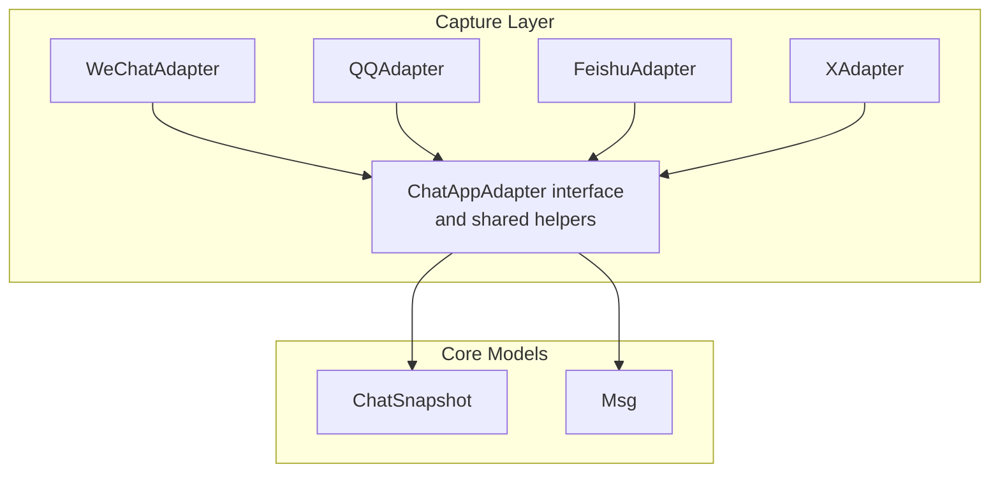
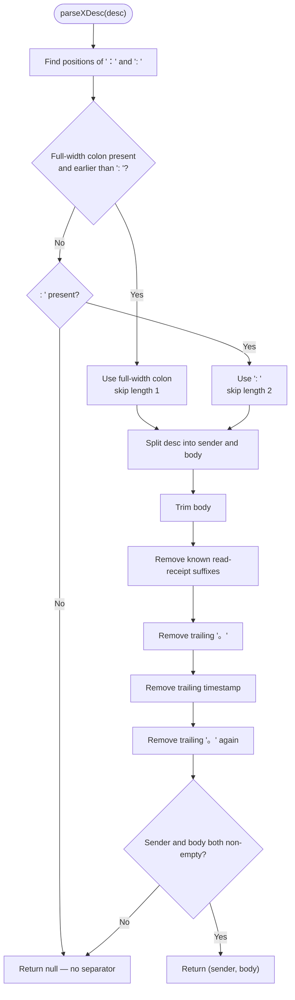
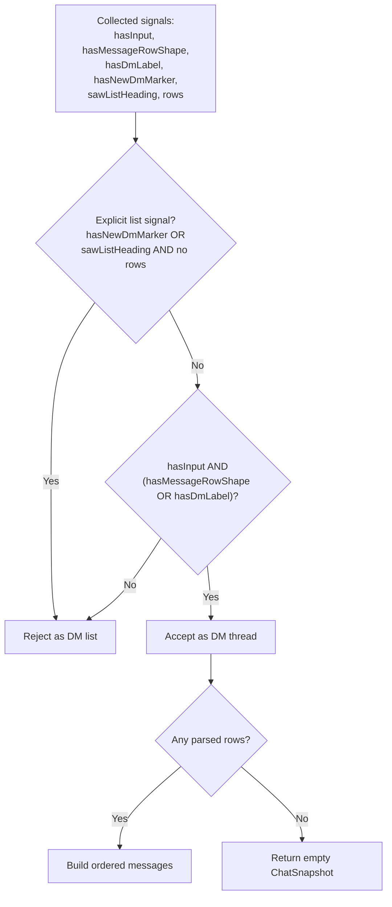
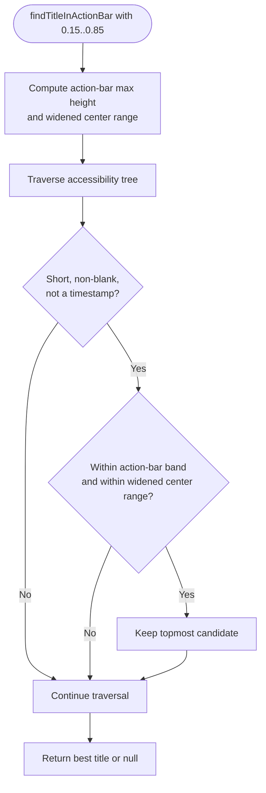
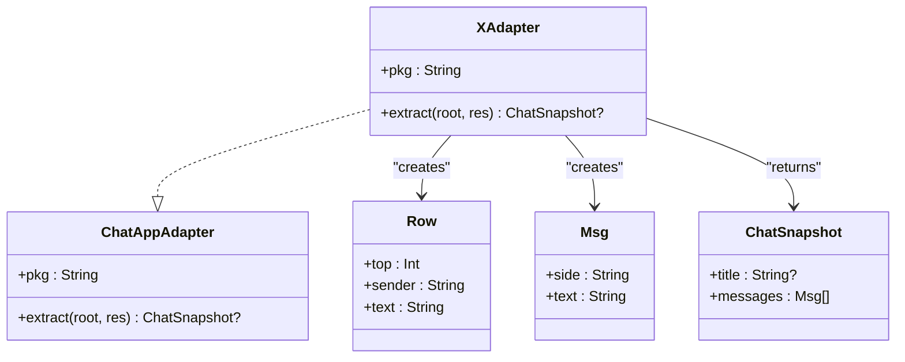
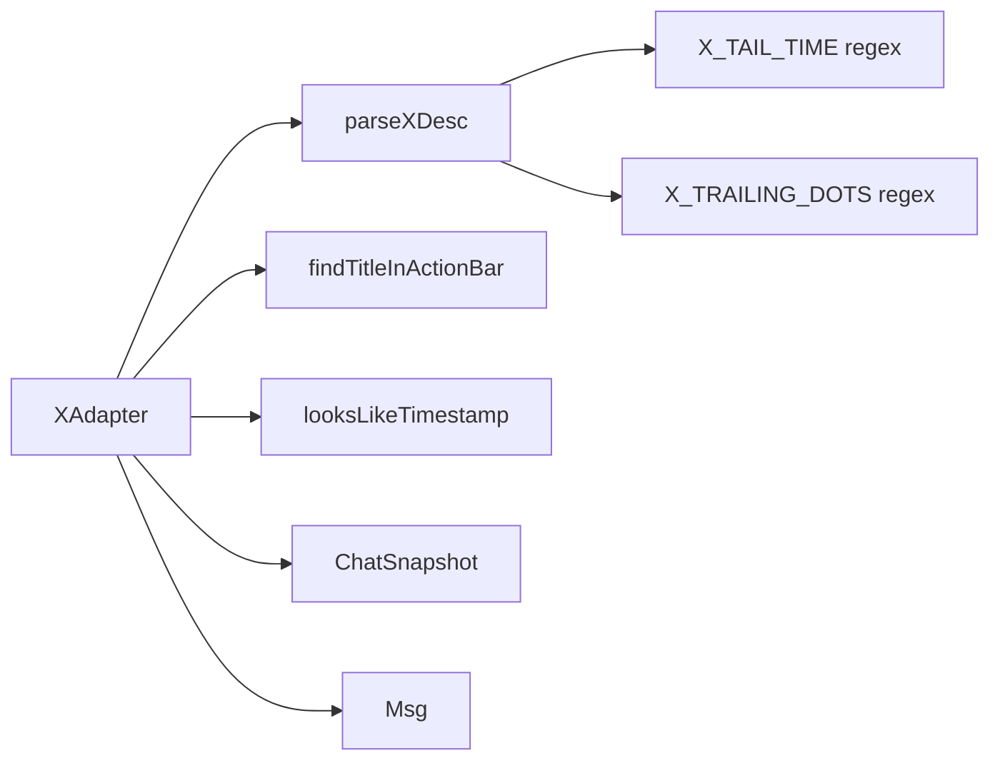

# X/Twitter Adapter Implementation

<cite>
**Referenced Files in This Document**
- [ChatAppAdapter.kt](file://app/src/main/java/com/jev/probe/capture/ChatAppAdapter.kt)
</cite>

## Table of Contents
1. [Introduction](#introduction)
2. [Project Structure](#project-structure)
3. [Core Components](#core-components)
4. [Architecture Overview](#architecture-overview)
5. [Detailed Component Analysis](#detailed-component-analysis)
6. [Dependency Analysis](#dependency-analysis)
7. [Performance Considerations](#performance-considerations)
8. [Troubleshooting Guide](#troubleshooting-guide)
9. [Conclusion](#conclusion)

## Introduction
This document explains the X/Twitter adapter used by the chat capture system to extract direct messages from the Compose UI of `com.twitter.android`. In this app, message content is not exposed as normal text nodes; instead, each message row is a bare view whose entire semantic content lives in its `contentDescription` attribute. The adapter must therefore:

- Detect whether the current screen is an actual DM thread rather than the DM list.
- Parse each message row’s `contentDescription` into sender and body parts.
- Strip trailing timestamps, read receipts, and separator dots that X attaches to rows.
- Extract the conversation title with a widened centering tolerance because X left-aligns thread titles.
- Return a neutral `ChatSnapshot` so downstream logic remains app-agnostic.

The implementation lives in one file alongside adapters for other apps, but the X/Twitter logic is self-contained and uses shared helpers for timestamp detection and action-bar title extraction.

## Project Structure
The relevant code is implemented in the capture layer under the probe package. The adapter pattern is defined once and reused across apps.



**Diagram sources**
- [ChatAppAdapter.kt:10-30](file://app/src/main/java/com/jev/probe/capture/ChatAppAdapter.kt#L10-L30)
- [ChatAppAdapter.kt:139-179](file://app/src/main/java/com/jev/probe/capture/ChatAppAdapter.kt#L139-L179)
- [ChatAppAdapter.kt:197-247](file://app/src/main/java/com/jev/probe/capture/ChatAppAdapter.kt#L197-L247)
- [ChatAppAdapter.kt:319-376](file://app/src/main/java/com/jev/probe/capture/ChatAppAdapter.kt#L319-L376)
- [ChatAppAdapter.kt:440-510](file://app/src/main/java/com/jev/probe/capture/ChatAppAdapter.kt#L440-L510)

**Section sources**
- [ChatAppAdapter.kt:10-30](file://app/src/main/java/com/jev/probe/capture/ChatAppAdapter.kt#L10-L30)

## Core Components
The X/Twitter integration centers on three responsibilities:

| Responsibility | Implementation | Purpose |
|---|---|---|
| Message-row parsing | `parseXDesc` | Splits a row’s `contentDescription` into sender and body, stripping read receipts, trailing dots, and timestamps. |
| Chat-window detection | `XAdapter.extract` | Uses multiple signals — editable input presence, full-width message-row shapes, placeholder labels, and list-only markers — to distinguish a DM thread from the DM list. |
| Title extraction | `findTitleInActionBar` called with widened tolerances | Finds the topmost short text above the first message while allowing X’s left-aligned title position. |

Key shared helpers used by X:

- `looksLikeTimestamp`: rejects strings that look like time or date tokens.
- `findTitleInActionBar`: scans the accessibility tree for a short, roughly centered text above the first bubble.

**Section sources**
- [ChatAppAdapter.kt:33-36](file://app/src/main/java/com/jev/probe/capture/ChatAppAdapter.kt#L33-L36)
- [ChatAppAdapter.kt:38-74](file://app/src/main/java/com/jev/probe/capture/ChatAppAdapter.kt#L38-L74)
- [ChatAppAdapter.kt:378-419](file://app/src/main/java/com/jev/probe/capture/ChatAppAdapter.kt#L378-L419)
- [ChatAppAdapter.kt:440-510](file://app/src/main/java/com/jev/probe/capture/ChatAppAdapter.kt#L440-L510)

## Architecture Overview
At runtime, the capture service walks the accessibility tree and asks the matching adapter to extract a snapshot. For X, the flow is:

```mermaid
sequenceDiagram
participant Service as "Capture Service"
participant Tree as "AccessibilityNodeInfo Tree"
participant Adapter as "XAdapter"
participant Parser as "parseXDesc"
participant Title as "findTitleInActionBar"
participant Snapshot as "ChatSnapshot"
Service->>Tree : Walk root node
Service->>Adapter : extract(root, resources)
Adapter->>Tree : Scan for EditText, View rows, TextView labels
Adapter->>Parser : parseXDesc(contentDescription)
Parser-->>Adapter : (sender, body) or null
Adapter->>Adapter : Collect message rows and signals
Adapter->>Title : findTitleInActionBar(root, firstRowTop, width, res, 0.15, 0.85)
Title-->>Adapter : Thread title or null
Adapter->>Snapshot : Build ChatSnapshot(title, messages)
Adapter-->>Service : ChatSnapshot?
```

**Diagram sources**
- [ChatAppAdapter.kt:443-506](file://app/src/main/java/com/jev/probe/capture/ChatAppAdapter.kt#L443-L506)
- [ChatAppAdapter.kt:399-419](file://app/src/main/java/com/jev/probe/capture/ChatAppAdapter.kt#L399-L419)
- [ChatAppAdapter.kt:45-74](file://app/src/main/java/com/jev/probe/capture/ChatAppAdapter.kt#L45-L74)

## Detailed Component Analysis

### X/Twitter Adapter Class
`XAdapter` implements the common `ChatAppAdapter` contract for `com.twitter.android`. Its `extract` method performs a single depth-first scan of the accessibility tree and records several signals:

| Signal | Meaning |
|---|---|
| `hasInput` | An editable field was found; X’s DM thread has an input box, while the DM list does not. |
| `hasMessageRowShape` | A full-width `android.view.View` contains a colon-like separator (`：` or `: `), matching the shape of a message row even if it cannot be fully parsed. |
| `rows` | Successfully parsed `(top, sender, body)` tuples. |
| `firstRowTop` | Top coordinate of the earliest parsed message row, used for title search bounds. |
| `hasDmLabel` | A placeholder label such as “私信”, “Message”, or “发送私信” was found. |
| `hasNewDmMarker` | A “compose new DM” affordance such as “新私信” or “New message”. |
| `sawListHeading` | A list-only heading such as “聊天” or “Messages”. |

The adapter returns `null` when it is not in a DM thread, an empty `ChatSnapshot` when it is in a thread but no rows were parsed, and a populated snapshot otherwise.

```mermaid
flowchart TD
Start(["XAdapter.extract"]) --> Init["Initialize signals:<br/>rows, firstRowTop, hasInput,<br/>hasMessageRowShape, hasDmLabel,<br/>hasNewDmMarker, sawListHeading"]
Init --> Scan["Walk accessibility tree"]
Scan --> CheckInput{"Found EditText or editable node?"}
CheckInput --> |Yes| MarkInput["Set hasInput = true"]
CheckInput --> |No| NextNode["Continue scanning"]
MarkInput --> NextNode
NextNode --> CheckView{"Is android.view.View with non-blank description?"}
CheckView --> |No| CheckText["Check TextView labels"]
CheckView --> |Yes| Measure["Measure bounds and check full width"]
Measure --> FullWidth{"Left == 0 and right == width?"}
FullWidth --> |No| CheckText
FullWidth --> |Yes| HasSeparator{"Contains '：' or ': '?"}
HasSeparator --> |Yes| MarkShape["Set hasMessageRowShape = true"]
HasSeparator --> |No| TryParse["Try parseXDesc"]
MarkShape --> TryParse
TryParse --> Parsed{"Parsed successfully?"}
Parsed --> |Yes| AddRow["Add Row(top, sender, body)<br/>update firstRowTop"]
Parsed --> |No| CheckText
AddRow --> CheckText
CheckText --> IsTextView{"Is android.widget.TextView?"}
IsTextView --> |Yes| UpdateLabels["Update hasDmLabel / sawListHeading"]
IsTextView --> |No| EndScan["End of scan"]
UpdateLabels --> EndScan
EndScan --> ListGuard{"Has 'New message' marker<br/>or list heading with no rows?"}
ListGuard --> |Yes| NotThread["Return null — not a thread"]
ListGuard --> |No| ThreadGuard{"Has input AND (message-row shape OR DM label)?"}
ThreadGuard --> |No| NotThread
ThreadGuard --> |Yes| FindTitle["Find title with widened centering"]
FindTitle --> EmptyRows{"Any parsed rows?"}
EmptyRows --> |Yes| SortRows["Sort rows by top"]
EmptyRows --> |No| EmptySnapshot["Return empty ChatSnapshot"]
SortRows --> MapSide["Map sender '你'/'You' to 'me'"]
MapSide --> ReturnSnapshot["Return ChatSnapshot(title, messages)"]
```



**Diagram sources**
- [ChatAppAdapter.kt:443-506](file://app/src/main/java/com/jev/probe/capture/ChatAppAdapter.kt#L443-L506)

**Section sources**
- [ChatAppAdapter.kt:421-510](file://app/src/main/java/com/jev/probe/capture/ChatAppAdapter.kt#L421-L510)

### Message Parsing: `parseXDesc`
`parseXDesc` converts a raw X message-row `contentDescription` into a `(sender, body)` pair. It handles the following structure:

- Sender label followed by a separator.
- User message body.
- Separator dots used by X.
- Read receipt suffix.
- Trailing timestamp.

#### Parsing Rules

| Rule | Behavior |
|---|---|
| Separator selection | Prefers the full-width colon `：`; falls back to `: ` if only the half-width variant exists. If neither appears, parsing fails. |
| Sender extraction | Everything before the chosen separator, trimmed. |
| Body initialization | Everything after the separator, trimmed. |
| Read receipt removal | Removes known read-receipt suffixes such as English and Chinese variants. |
| Trailing dot cleanup | Removes runs of `。` that X uses as separators. |
| Timestamp removal | Removes a trailing time token such as `8:11 上午`, `10:29 下午`, `AM`, or `PM`. |
| Final validation | Returns `null` if sender or body becomes empty after cleanup. |



**Diagram sources**
- [ChatAppAdapter.kt:378-419](file://app/src/main/java/com/jev/probe/capture/ChatAppAdapter.kt#L378-L419)

#### Supported Formats
Examples represented by the implementation include:

- Chinese-style rows where the sender and body are separated by a full-width colon.
- Rows ending with user-typed punctuation that should survive cleanup.
- Attachment rows where the body describes a quoted post.
- Rows with read receipts and timestamps attached at the tail.

**Section sources**
- [ChatAppAdapter.kt:378-419](file://app/src/main/java/com/jev/probe/capture/ChatAppAdapter.kt#L378-L419)

### Chat Window Detection Logic
The most delicate part of the X adapter is distinguishing a real DM thread from the DM list. Both screens can contain editable inputs and visually similar rows, so the adapter uses multiple independent signals:

1. **Editable input presence**: A DM thread includes a message input box.
2. **Message-row shape**: A full-width `android.view.View` containing a colon-like separator matches the expected shape of a message row.
3. **Placeholder label**: An empty thread still shows a label such as “私信”, “Message”, or “发送私信”.
4. **List-only markers**:
   - “新私信” or “New message” indicates the compose affordance on the DM list.
   - A “聊天” or “Messages” heading with no parsed rows indicates the list header without any thread content.
5. **DM-list guard**: Rows in the DM list often contain patterns like `, @`, which are rejected as message rows.

The decision order is important:

- First, explicit list-only signals force a `null` result.
- Then, the generic rule requires both an input box and either a message-row shape or a DM placeholder label.
- Finally, if the screen passes as a thread but has no parsed rows, it returns an empty snapshot rather than `null`.



**Diagram sources**
- [ChatAppAdapter.kt:461-497](file://app/src/main/java/com/jev/probe/capture/ChatAppAdapter.kt#L461-L497)

**Section sources**
- [ChatAppAdapter.kt:421-510](file://app/src/main/java/com/jev/probe/capture/ChatAppAdapter.kt#L421-L510)

### Title Extraction with Widened Centering Tolerance
The shared helper `findTitleInActionBar` searches for the topmost short text above the first message bubble. By default, it expects the title to be roughly centered between 25% and 75% of the screen width. X left-aligns its thread title, so the adapter calls it with widened tolerances:

- Minimum center ratio: `0.15`
- Maximum center ratio: `0.85`

This allows the title to be accepted even when it sits near the left edge of the screen.



**Diagram sources**
- [ChatAppAdapter.kt:38-74](file://app/src/main/java/com/jev/probe/capture/ChatAppAdapter.kt#L38-L74)
- [ChatAppAdapter.kt:499-501](file://app/src/main/java/com/jev/probe/capture/ChatAppAdapter.kt#L499-L501)

**Section sources**
- [ChatAppAdapter.kt:38-74](file://app/src/main/java/com/jev/probe/capture/ChatAppAdapter.kt#L38-L74)
- [ChatAppAdapter.kt:499-501](file://app/src/main/java/com/jev/probe/capture/ChatAppAdapter.kt#L499-L501)

### Data Model Relationships
The adapter produces a neutral snapshot model rather than exposing X-specific structures.



**Diagram sources**
- [ChatAppAdapter.kt:27-30](file://app/src/main/java/com/jev/probe/capture/ChatAppAdapter.kt#L27-L30)
- [ChatAppAdapter.kt:440-510](file://app/src/main/java/com/jev/probe/capture/ChatAppAdapter.kt#L440-L510)

**Section sources**
- [ChatAppAdapter.kt:27-30](file://app/src/main/java/com/jev/probe/capture/ChatAppAdapter.kt#L27-L30)
- [ChatAppAdapter.kt:440-510](file://app/src/main/java/com/jev/probe/capture/ChatAppAdapter.kt#L440-L510)

## Dependency Analysis
The X adapter depends on shared utilities and core models rather than implementing its own timestamp or title logic.



**Diagram sources**
- [ChatAppAdapter.kt:33-36](file://app/src/main/java/com/jev/probe/capture/ChatAppAdapter.kt#L33-L36)
- [ChatAppAdapter.kt:38-74](file://app/src/main/java/com/jev/probe/capture/ChatAppAdapter.kt#L38-L74)
- [ChatAppAdapter.kt:378-419](file://app/src/main/java/com/jev/probe/capture/ChatAppAdapter.kt#L378-L419)
- [ChatAppAdapter.kt:440-510](file://app/src/main/java/com/jev/probe/capture/ChatAppAdapter.kt#L440-L510)

**Section sources**
- [ChatAppAdapter.kt:33-36](file://app/src/main/java/com/jev/probe/capture/ChatAppAdapter.kt#L33-L36)
- [ChatAppAdapter.kt:378-419](file://app/src/main/java/com/jev/probe/capture/ChatAppAdapter.kt#L378-L419)
- [ChatAppAdapter.kt:440-510](file://app/src/main/java/com/jev/probe/capture/ChatAppAdapter.kt#L440-L510)

## Performance Considerations
The X adapter uses bounded tree traversal guards to avoid expensive infinite loops:

- The main scan limits iterations to around 6,000 steps.
- Other adapters use smaller guards where appropriate.
- Only one pass over the tree is performed per extraction.
- Message rows are collected during traversal and sorted afterward by top coordinate.

Potential optimization opportunities include:

- Early exit once all required signals are confirmed.
- Caching resource metrics if the same adapter processes many trees.
- Avoiding repeated regex operations on identical descriptions when possible.

[No sources needed since this section provides general guidance]

## Troubleshooting Guide

### Symptom: DM list triggers OCR fallback
**Likely cause:** The adapter incorrectly treats the DM list as a chat window.

**Checks:**
- Verify that `hasNewDmMarker` or `sawListHeading` is detected.
- Confirm that list rows contain `, @` and are rejected as message rows.
- Ensure the final rule requires both an input box and either a message-row shape or a DM placeholder label.

**Relevant logic:**
- List-only markers and list-heading guard.
- Full-width view filtering and separator detection.
- Final thread acceptance rule.

**Section sources**
- [ChatAppAdapter.kt:461-497](file://app/src/main/java/com/jev/probe/capture/ChatAppAdapter.kt#L461-L497)

### Symptom: Message body retains timestamp or read receipt
**Likely cause:** The tail cleanup order did not match the actual row format.

**Checks:**
- Confirm the read receipt suffix is removed before timestamp removal.
- Confirm trailing dots are stripped before and after timestamp removal.
- Verify the timestamp regex matches the localized time format.

**Relevant logic:**
- Read receipt suffix list.
- Trailing dot cleanup.
- Timestamp regex.

**Section sources**
- [ChatAppAdapter.kt:378-419](file://app/src/main/java/com/jev/probe/capture/ChatAppAdapter.kt#L378-L419)

### Symptom: Chinese messages fail to parse
**Likely cause:** The full-width colon separator is missing or replaced by another variant.

**Checks:**
- Confirm the row contains `：` or `: `.
- Confirm the sender is not empty after trimming.
- Confirm the body is not empty after removing chrome.

**Relevant logic:**
- Separator selection between full-width and half-width variants.
- Sender and body validation.

**Section sources**
- [ChatAppAdapter.kt:399-419](file://app/src/main/java/com/jev/probe/capture/ChatAppAdapter.kt#L399-L419)

### Symptom: Thread title is not extracted
**Likely cause:** The title is too far left for the default centering tolerance.

**Checks:**
- Confirm the adapter calls the title helper with widened ratios `0.15` and `0.85`.
- Confirm the candidate text is short, non-blank, and not a timestamp.
- Confirm the candidate is above the first message row.

**Relevant logic:**
- Title helper constraints.
- X adapter call site with widened tolerances.

**Section sources**
- [ChatAppAdapter.kt:38-74](file://app/src/main/java/com/jev/probe/capture/ChatAppAdapter.kt#L38-L74)
- [ChatAppAdapter.kt:499-501](file://app/src/main/java/com/jev/probe/capture/ChatAppAdapter.kt#L499-L501)

### Symptom: Empty DM thread is treated as “not a chat”
**Likely cause:** The adapter requires either a parsed message-row shape or a DM placeholder label.

**Checks:**
- Confirm the placeholder label such as “私信”, “Message”, or “发送私信” is present.
- Confirm the input box is detected.
- Confirm the adapter returns an empty snapshot rather than `null` when in a thread with no rows.

**Relevant logic:**
- Placeholder label detection.
- Thread acceptance rule.
- Empty-thread snapshot return.

**Section sources**
- [ChatAppAdapter.kt:481-506](file://app/src/main/java/com/jev/probe/capture/ChatAppAdapter.kt#L481-L506)

### Symptom: Different language variants break parsing
**Likely cause:** The adapter relies on specific localized strings and separators.

**Recommendations:**
- Extend the read-receipt suffix list for additional languages.
- Add alternative separator variants if X changes the separator style.
- Add alternative placeholder and list-heading strings for new locales.
- Test with both Chinese and English UI strings.

**Section sources**
- [ChatAppAdapter.kt:378-419](file://app/src/main/java/com/jev/probe/capture/ChatAppAdapter.kt#L378-L419)
- [ChatAppAdapter.kt:468-485](file://app/src/main/java/com/jev/probe/capture/ChatAppAdapter.kt#L468-L485)

## Conclusion
The X/Twitter adapter is a focused implementation that adapts Compose-based direct messages into a neutral chat snapshot. Its robustness comes from:

- Careful separation of sender and body using full-width and half-width colon separators.
- Defensive cleanup of read receipts, separator dots, and timestamps.
- Multi-signal chat-window detection that avoids confusing the DM list with a thread.
- A widened title-extraction tolerance that accommodates X’s left-aligned thread title.

When X updates its UI, localization, or Compose structure, the most likely places to adjust are the separator handling, read-receipt suffixes, placeholder strings, list-heading strings, and title centering tolerances.