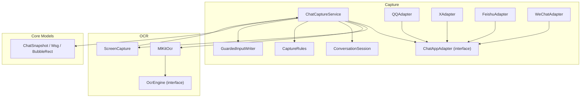
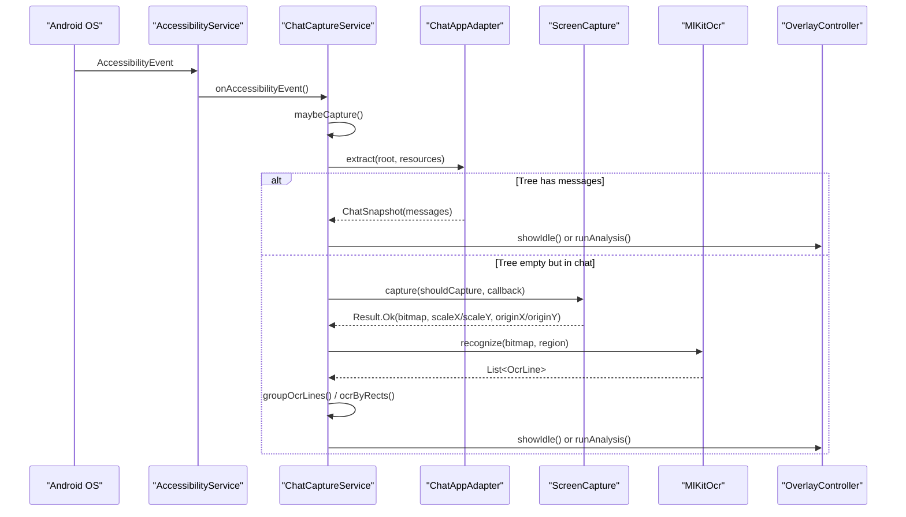
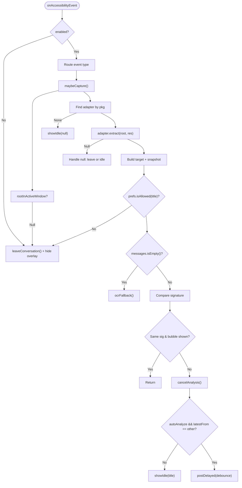
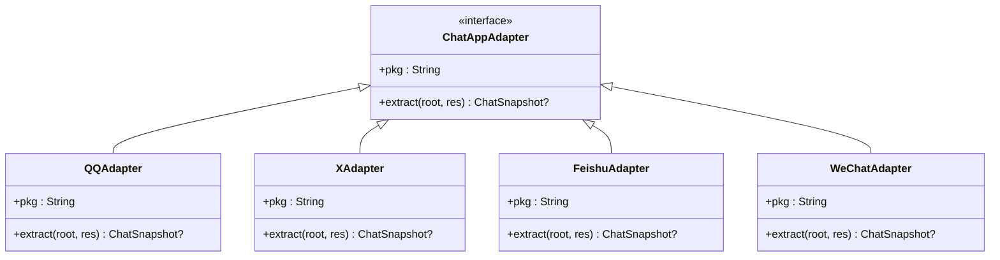
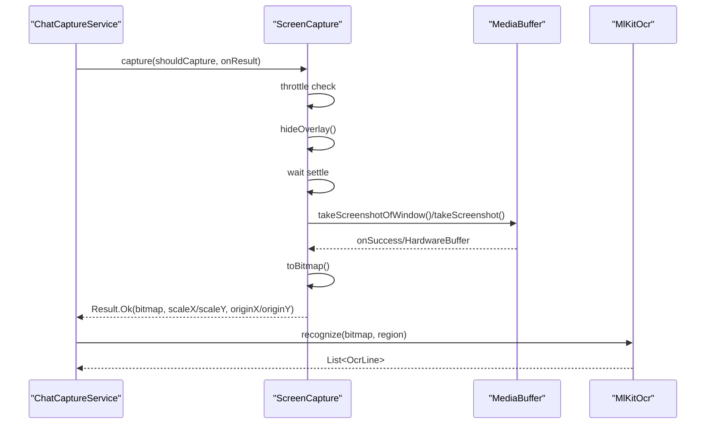
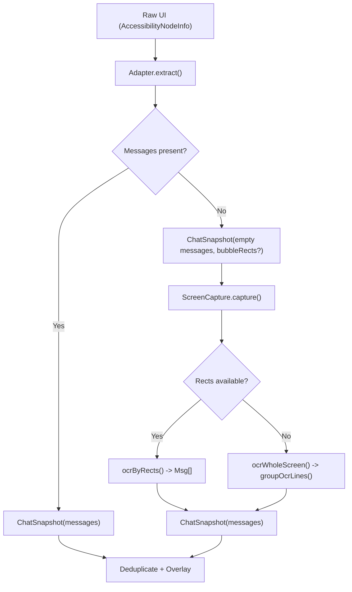
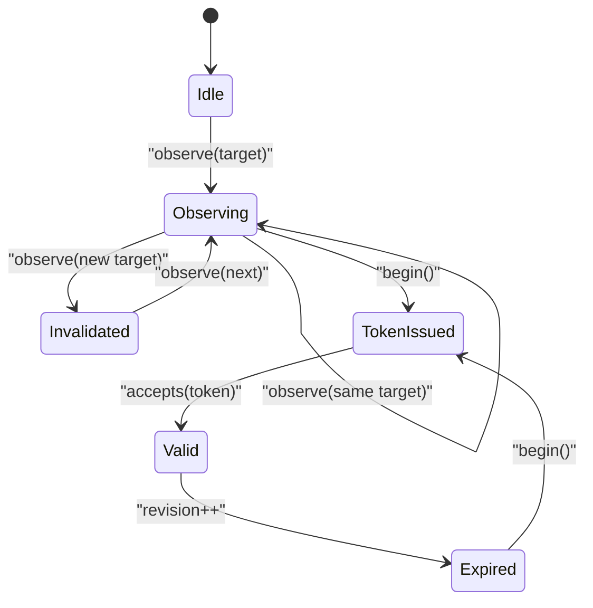
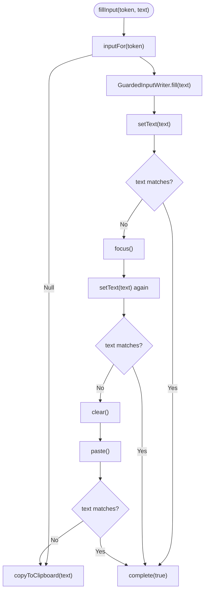
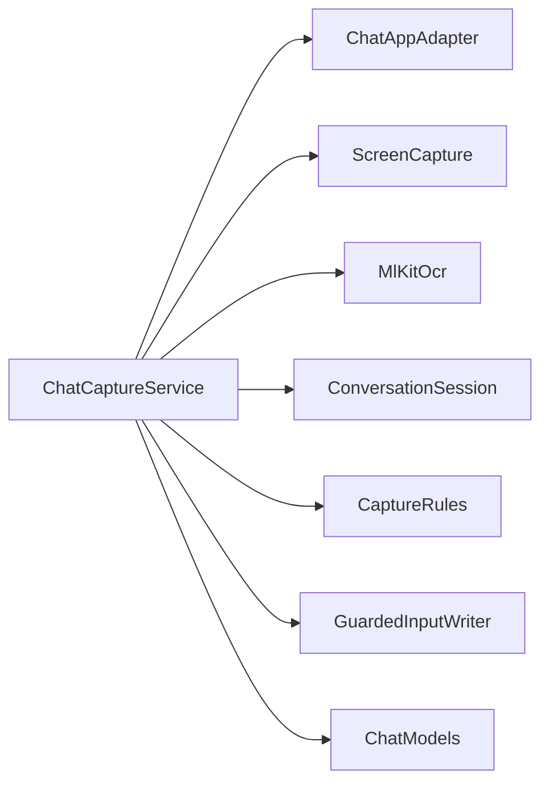

# Message Capture System

<cite>
**Referenced Files in This Document**   
- [ChatCaptureService.kt](file://app/src/main/java/com/jev/probe/capture/ChatCaptureService.kt)
- [ChatAppAdapter.kt](file://app/src/main/java/com/jev/probe/capture/ChatAppAdapter.kt)
- [CaptureRules.kt](file://app/src/main/java/com/jev/probe/capture/CaptureRules.kt)
- [ConversationSession.kt](file://app/src/main/java/com/jev/probe/capture/ConversationSession.kt)
- [MlKitOcr.kt](file://app/src/main/java/com/jev/probe/capture/ocr/MlKitOcr.kt)
- [ScreenCapture.kt](file://app/src/main/java/com/jev/probe/capture/ocr/ScreenCapture.kt)
- [OcrEngine.kt](file://app/src/main/java/com/jev/probe/capture/ocr/OcrEngine.kt)
- [GuardedInputWriter.kt](file://app/src/main/java/com/jev/probe/capture/GuardedInputWriter.kt)
- [ChatModels.kt](file://app/src/main/java/com/jev/probe/core/ChatModels.kt)
</cite>

## Table of Contents
1. [Introduction](#introduction)
2. [Project Structure](#project-structure)
3. [Core Components](#core-components)
4. [Architecture Overview](#architecture-overview)
5. [Detailed Component Analysis](#detailed-component-analysis)
6. [Dependency Analysis](#dependency-analysis)
7. [Performance Considerations](#performance-considerations)
8. [Troubleshooting Guide](#troubleshooting-guide)
9. [Conclusion](#conclusion)

## Introduction
This document explains the message capture system sub-component that monitors Android chat applications, extracts conversation snapshots, and optionally falls back to on-device OCR when the accessibility tree does not expose readable text. The system is built around an Accessibility Service that observes UI changes, a per-app adapter architecture for extracting messages, and a screenshot-based OCR fallback powered by ML Kit. It converts raw UI elements into structured `ChatSnapshot` objects, which are then used for downstream analysis and reply generation.

The design emphasizes:
- App-agnostic orchestration with per-app adapters implementing a common interface.
- A robust OCR fallback path for platforms where message bodies are drawn rather than exposed as text nodes.
- Screenshot capture with rate limiting and exponential failure backoff.
- Careful liveness checks, session tokens, and debouncing to avoid stale or duplicate work.
- Safe input filling with retry logic and clipboard fallback.

## Project Structure
The message capture system lives under the `capture` package and its `ocr` subpackage, plus shared core models:

**Diagram sources**
- [ChatCaptureService.kt:43-53](file://app/src/main/java/com/jev/probe/capture/ChatCaptureService.kt#L43-L53)
- [ChatAppAdapter.kt:27-30](file://app/src/main/java/com/jev/probe/capture/ChatAppAdapter.kt#L27-L30)
- [ScreenCapture.kt:35-61](file://app/src/main/java/com/jev/probe/capture/ocr/ScreenCapture.kt#L35-L61)
- [MlKitOcr.kt:26-25](file://app/src/main/java/com/jev/probe/capture/ocr/MlKitOcr.kt#L26-L25)
- [OcrEngine.kt:20-22](file://app/src/main/java/com/jev/probe/capture/ocr/OcrEngine.kt#L20-L22)
- [ChatModels.kt:5-38](file://app/src/main/java/com/jev/probe/core/ChatModels.kt#L5-L38)

**Section sources**
- [ChatCaptureService.kt:29-53](file://app/src/main/java/com/jev/probe/capture/ChatCaptureService.kt#L29-L53)
- [ChatAppAdapter.kt:10-30](file://app/src/main/java/com/jev/probe/capture/ChatAppAdapter.kt#L10-L30)
- [ScreenCapture.kt:14-34](file://app/src/main/java/com/jev/probe/capture/ocr/ScreenCapture.kt#L14-L34)
- [MlKitOcr.kt:13-25](file://app/src/main/java/com/jev/probe/capture/ocr/MlKitOcr.kt#L13-L25)
- [ChatModels.kt:5-38](file://app/src/main/java/com/jev/probe/core/ChatModels.kt#L5-L38)

## Core Components
- ChatCaptureService: Orchestrates accessibility events, target detection, snapshot processing, OCR fallback, analysis scheduling, overlay interaction, and input filling.
- ChatAppAdapter: Per-app contract that turns a live accessibility tree into a neutral `ChatSnapshot`.
- ConversationSession: Tracks the active conversation target and provides revision-safe tokens.
- ScreenCapture: Handles screenshot acquisition with throttling, timeout, and failure backoff.
- MlKitOcr: On-device Chinese OCR engine using ML Kit; returns lines mapped back to screen coordinates.
- OcrEngine: Abstraction for OCR engines; currently implemented by MlKitOcr.
- GuardedInputWriter: Non-blocking sequence to fill chat inputs with retries and clipboard fallback.
- CaptureRules: Pure decision helpers for foreground exclusion and manual analyze blocking.
- ChatModels: Shared data structures including `Msg`, `BubbleRect`, and `ChatSnapshot`.

**Section sources**
- [ChatCaptureService.kt:43-186](file://app/src/main/java/com/jev/probe/capture/ChatCaptureService.kt#L43-L186)
- [ChatAppAdapter.kt:27-30](file://app/src/main/java/com/jev/probe/capture/ChatAppAdapter.kt#L27-L30)
- [ConversationSession.kt:4-35](file://app/src/main/java/com/jev/probe/capture/ConversationSession.kt#L4-L35)
- [ScreenCapture.kt:35-93](file://app/src/main/java/com/jev/probe/capture/ocr/ScreenCapture.kt#L35-L93)
- [MlKitOcr.kt:26-95](file://app/src/main/java/com/jev/probe/capture/ocr/MlKitOcr.kt#L26-L95)
- [OcrEngine.kt:6-22](file://app/src/main/java/com/jev/probe/capture/ocr/OcrEngine.kt#L6-L22)
- [GuardedInputWriter.kt:3-44](file://app/src/main/java/com/jev/probe/capture/GuardedInputWriter.kt#L3-L44)
- [CaptureRules.kt:12-56](file://app/src/main/java/com/jev/probe/capture/CaptureRules.kt#L12-L56)
- [ChatModels.kt:5-38](file://app/src/main/java/com/jev/probe/core/ChatModels.kt#L5-L38)

## Architecture Overview
At runtime, the service listens to accessibility events, identifies the active app and window, and delegates extraction to the matching adapter. If the adapter can read message text, it produces a `ChatSnapshot` directly. If not, the service triggers a screenshot and OCR fallback. The resulting snapshot is deduplicated, optionally analyzed, and presented via the overlay.

**Diagram sources**
- [ChatCaptureService.kt:239-360](file://app/src/main/java/com/jev/probe/capture/ChatCaptureService.kt#L239-L360)
- [ChatAppAdapter.kt:27-30](file://app/src/main/java/com/jev/probe/capture/ChatAppAdapter.kt#L27-L30)
- [ScreenCapture.kt:66-93](file://app/src/main/java/com/jev/probe/capture/ocr/ScreenCapture.kt#L66-L93)
- [MlKitOcr.kt:39-95](file://app/src/main/java/com/jev/probe/capture/ocr/MlKitOcr.kt#L39-L95)

## Detailed Component Analysis

### Accessibility Orchestration: ChatCaptureService
Responsibilities:
- Maintain worker threads and main-thread handlers.
- Track active package, last signature, OCR signature, and pending/current snapshots.
- Observe targets through `ConversationSession` and guard against stale work.
- Decide whether to use tree-based extraction or OCR fallback.
- Debounce bursts of content-changed events.
- Trigger analysis asynchronously while keeping overlay updates on the main thread.
- Fill chat inputs safely with retries and clipboard fallback.

Key behaviors:
- Event routing: window state/content changed and scroll events trigger `maybeCapture()`.
- Target selection: uses the real active window’s package and window ID; excludes certain foregrounds.
- Adapter dispatch: looks up the adapter by package name; if none exists, parks an idle bubble without automatic capture.
- Liveness rules: distinguishes between automatic and manual sessions; manual captures use relaxed window-liveness checks.
- Deduplication: compares signatures of recent messages and OCR-derived snapshots.
- OCR gating: only fires when the tree reports no text inside a recognized chat window; uses `ocrSignature` to avoid repeated screenshots.
- Input writing: resolves the correct editable node per app and uses `GuardedInputWriter` for safe fills.

**Diagram sources**
- [ChatCaptureService.kt:239-360](file://app/src/main/java/com/jev/probe/capture/ChatCaptureService.kt#L239-L360)

**Section sources**
- [ChatCaptureService.kt:43-186](file://app/src/main/java/com/jev/probe/capture/ChatCaptureService.kt#L43-L186)
- [ChatCaptureService.kt:239-360](file://app/src/main/java/com/jev/probe/capture/ChatCaptureService.kt#L239-L360)
- [ChatCaptureService.kt:377-455](file://app/src/main/java/com/jev/probe/capture/ChatCaptureService.kt#L377-L455)
- [ChatCaptureService.kt:704-792](file://app/src/main/java/com/jev/probe/capture/ChatCaptureService.kt#L704-L792)

### Adapter Architecture: ChatAppAdapter and Implementations
Contract:
- `extract(root, resources)` returns:
  - `null`: not in a chat window.
  - `ChatSnapshot` with empty messages: in a chat window, but tree has no text → OCR fallback cue.
  - `ChatSnapshot` with non-empty messages: normal capture.

Shared helpers:
- Title detection above the first bubble, with timestamp filtering and centering constraints.
- WeChat-specific title parsing to avoid misclassifying announcements or stray messages.

Per-app implementations:
- QQAdapter: Uses stable resource IDs for bubbles and input box; infers sender side by avatar edge proximity.
- XAdapter: Parses Compose DM rows from `contentDescription`; filters out list-only signals; infers sender from label.
- FeishuAdapter: Detects chat window by presence of specific IDs; collects bubble rectangles for OCR; infers side by read-receipt strip.
- WeChatAdapter: Detects chat window by bubble container ID; handles obfuscated trees where text may be hidden.

**Diagram sources**
- [ChatAppAdapter.kt:27-30](file://app/src/main/java/com/jev/probe/capture/ChatAppAdapter.kt#L27-L30)
- [ChatAppAdapter.kt:139-179](file://app/src/main/java/com/jev/probe/capture/ChatAppAdapter.kt#L139-L179)
- [ChatAppAdapter.kt:197-247](file://app/src/main/java/com/jev/probe/capture/ChatAppAdapter.kt#L197-L247)
- [ChatAppAdapter.kt:319-376](file://app/src/main/java/com/jev/probe/capture/ChatAppAdapter.kt#L319-L376)
- [ChatAppAdapter.kt:440-510](file://app/src/main/java/com/jev/probe/capture/ChatAppAdapter.kt#L440-L510)

**Section sources**
- [ChatAppAdapter.kt:10-30](file://app/src/main/java/com/jev/probe/capture/ChatAppAdapter.kt#L10-L30)
- [ChatAppAdapter.kt:45-74](file://app/src/main/java/com/jev/probe/capture/ChatAppAdapter.kt#L45-L74)
- [ChatAppAdapter.kt:93-128](file://app/src/main/java/com/jev/probe/capture/ChatAppAdapter.kt#L93-L128)
- [ChatAppAdapter.kt:139-179](file://app/src/main/java/com/jev/probe/capture/ChatAppAdapter.kt#L139-L179)
- [ChatAppAdapter.kt:197-247](file://app/src/main/java/com/jev/probe/capture/ChatAppAdapter.kt#L197-L247)
- [ChatAppAdapter.kt:276-301](file://app/src/main/java/com/jev/probe/capture/ChatAppAdapter.kt#L276-L301)
- [ChatAppAdapter.kt:319-376](file://app/src/main/java/com/jev/probe/capture/ChatAppAdapter.kt#L319-L376)
- [ChatAppAdapter.kt:399-419](file://app/src/main/java/com/jev/probe/capture/ChatAppAdapter.kt#L399-L419)
- [ChatAppAdapter.kt:440-510](file://app/src/main/java/com/jev/probe/capture/ChatAppAdapter.kt#L440-L510)

### OCR Fallback Mechanism: ScreenCapture and MlKitOcr
Screenshot capture:
- Uses the Accessibility Service’s screenshot API without root or MediaProjection.
- Hides the floating overlay before capturing to avoid baking it into the image.
- Supports window-shot on newer Android versions; otherwise falls back to full display capture.
- Converts hardware buffers to software bitmaps and closes buffers promptly.
- Rate limits attempts to at least 1 second apart; applies exponential backoff on repeated failures up to 30 seconds.
- Returns human-readable error codes and messages for overlay presentation.

OCR recognition:
- Uses bundled ML Kit Chinese recognizer; model is loaded lazily and warmed up early.
- Accepts either whole-bitmap or cropped regions; maps returned line boxes back to screen coordinates.
- Always posts callbacks to the main thread; failures return empty lists instead of exceptions.

**Diagram sources**
- [ScreenCapture.kt:66-176](file://app/src/main/java/com/jev/probe/capture/ocr/ScreenCapture.kt#L66-L176)
- [MlKitOcr.kt:39-95](file://app/src/main/java/com/jev/probe/capture/ocr/MlKitOcr.kt#L39-L95)

**Section sources**
- [ScreenCapture.kt:14-34](file://app/src/main/java/com/jev/probe/capture/ocr/ScreenCapture.kt#L14-L34)
- [ScreenCapture.kt:66-93](file://app/src/main/java/com/jev/probe/capture/ocr/ScreenCapture.kt#L66-L93)
- [ScreenCapture.kt:95-176](file://app/src/main/java/com/jev/probe/capture/ocr/ScreenCapture.kt#L95-L176)
- [ScreenCapture.kt:178-218](file://app/src/main/java/com/jev/probe/capture/ocr/ScreenCapture.kt#L178-L218)
- [MlKitOcr.kt:13-25](file://app/src/main/java/com/jev/probe/capture/ocr/MlKitOcr.kt#L13-L25)
- [MlKitOcr.kt:39-95](file://app/src/main/java/com/jev/probe/capture/ocr/MlKitOcr.kt#L39-L95)
- [MlKitOcr.kt:97-112](file://app/src/main/java/com/jev/probe/capture/ocr/MlKitOcr.kt#L97-L112)

### Message Extraction Pipeline: From Raw UI to ChatSnapshot
Pipeline stages:
1. Accessibility event arrives; service determines active window and package.
2. Adapter extracts a `ChatSnapshot`:
   - For QQ/X/Feishu/WeChat, the adapter scans the tree for known IDs or patterns.
   - For Feishu, bubble rectangles are collected even if text is drawn.
3. If messages are empty but the adapter recognizes a chat window, the service triggers OCR fallback.
4. OCR paths:
   - Rect-based OCR for Feishu: each bubble rectangle becomes one message.
   - Whole-screen OCR for other apps: lines grouped by vertical gaps into pseudo-bubbles.
5. Snapshots are deduplicated by signature; if new, they are either analyzed automatically or parked as idle.
6. Overlay shows results, loading states, errors, or paywall notices.

**Diagram sources**
- [ChatCaptureService.kt:275-360](file://app/src/main/java/com/jev/probe/capture/ChatCaptureService.kt#L275-L360)
- [ChatCaptureService.kt:548-623](file://app/src/main/java/com/jev/probe/capture/ChatCaptureService.kt#L548-L623)
- [ChatAppAdapter.kt:139-179](file://app/src/main/java/com/jev/probe/capture/ChatAppAdapter.kt#L139-L179)
- [ChatAppAdapter.kt:197-247](file://app/src/main/java/com/jev/probe/capture/ChatAppAdapter.kt#L197-L247)
- [ChatAppAdapter.kt:319-376](file://app/src/main/java/com/jev/probe/capture/ChatAppAdapter.kt#L319-L376)
- [ChatModels.kt:5-38](file://app/src/main/java/com/jev/probe/core/ChatModels.kt#L5-L38)

**Section sources**
- [ChatCaptureService.kt:275-360](file://app/src/main/java/com/jev/probe/capture/ChatCaptureService.kt#L275-L360)
- [ChatCaptureService.kt:548-623](file://app/src/main/java/com/jev/probe/capture/ChatCaptureService.kt#L548-L623)
- [ChatModels.kt:5-38](file://app/src/main/java/com/jev/probe/core/ChatModels.kt#L5-L38)

### Concrete Adapter Examples

#### QQAdapter
- Detects chat window by presence of input box and message bubble IDs.
- Collects bubble nodes with stable IDs and computes sender side based on avatar edge proximity.
- Falls back to generic title detection if the explicit title ID is missing.
- Returns empty messages when in a chat but no body text is available, signaling OCR fallback.

**Section sources**
- [ChatAppAdapter.kt:197-247](file://app/src/main/java/com/jev/probe/capture/ChatAppAdapter.kt#L197-L247)

#### XAdapter (Twitter)
- Parses Compose DM rows from `contentDescription`, splitting sender and body using separator rules.
- Filters out list-only signals and date dividers.
- Infers sender from labels (“你”/“You”).
- Uses a wider centered band for title detection due to X’s layout.

**Section sources**
- [ChatAppAdapter.kt:399-419](file://app/src/main/java/com/jev/probe/capture/ChatAppAdapter.kt#L399-L419)
- [ChatAppAdapter.kt:440-510](file://app/src/main/java/com/jev/probe/capture/ChatAppAdapter.kt#L440-L510)

#### Feishu/Lark Adapter
- Detects chat window by presence of message containers or input box.
- Collects bubble rectangles and infers side by checking for read-receipt strips.
- Provides bubble rects for rect-based OCR since message bodies are drawn.
- Filters chrome text (titles, timestamps, system labels).

**Section sources**
- [ChatAppAdapter.kt:249-301](file://app/src/main/java/com/jev/probe/capture/ChatAppAdapter.kt#L249-L301)
- [ChatAppAdapter.kt:319-376](file://app/src/main/java/com/jev/probe/capture/ChatAppAdapter.kt#L319-L376)

#### WeChatAdapter
- Detects chat window by bubble container ID; works even when text is stripped by obfuscation.
- Computes sender side by horizontal position relative to screen width.
- Uses specialized title detection to avoid misclassifying announcements or stray messages.

**Section sources**
- [ChatAppAdapter.kt:130-179](file://app/src/main/java/com/jev/probe/capture/ChatAppAdapter.kt#L130-L179)
- [ChatAppAdapter.kt:93-128](file://app/src/main/java/com/jev/probe/capture/ChatAppAdapter.kt#L93-L128)

### Session Management and Liveness
- `ConversationSession` tracks the current target and increments a revision whenever observed target changes.
- Tokens carry the target and revision; later operations validate acceptance to prevent stale work.
- Manual captures relax liveness checks to keep the user’s requested result alive even if the adapter cannot confirm a chat window.

**Diagram sources**
- [ConversationSession.kt:4-35](file://app/src/main/java/com/jev/probe/capture/ConversationSession.kt#L4-L35)

**Section sources**
- [ConversationSession.kt:4-35](file://app/src/main/java/com/jev/probe/capture/ConversationSession.kt#L4-L35)
- [ChatCaptureService.kt:107-166](file://app/src/main/java/com/jev/probe/capture/ChatCaptureService.kt#L107-L166)

### Input Filling and Clipboard Fallback
- Resolves the correct editable node per app; ambiguous editors fall back to clipboard.
- Uses `GuardedInputWriter` to attempt SET_TEXT, focus, retry, clear-and-paste, and finally clipboard copy.
- All steps re-resolve the live session to ensure the target hasn’t changed.

**Diagram sources**
- [ChatCaptureService.kt:704-792](file://app/src/main/java/com/jev/probe/capture/ChatCaptureService.kt#L704-L792)
- [GuardedInputWriter.kt:17-43](file://app/src/main/java/com/jev/probe/capture/GuardedInputWriter.kt#L17-L43)

**Section sources**
- [ChatCaptureService.kt:704-792](file://app/src/main/java/com/jev/probe/capture/ChatCaptureService.kt#L704-L792)
- [GuardedInputWriter.kt:3-44](file://app/src/main/java/com/jev/probe/capture/GuardedInputWriter.kt#L3-L44)

## Dependency Analysis
High-level dependencies:
- ChatCaptureService depends on:
  - ChatAppAdapter implementations for per-app extraction.
  - ScreenCapture for screenshot acquisition.
  - MlKitOcr for OCR.
  - ConversationSession for tokenized liveness.
  - CaptureRules for pure decisions.
  - GuardedInputWriter for safe input writes.
  - ChatModels for structured data.

**Diagram sources**
- [ChatCaptureService.kt:43-53](file://app/src/main/java/com/jev/probe/capture/ChatCaptureService.kt#L43-L53)
- [ChatAppAdapter.kt:27-30](file://app/src/main/java/com/jev/probe/capture/ChatAppAdapter.kt#L27-L30)
- [ScreenCapture.kt:35-61](file://app/src/main/java/com/jev/probe/capture/ocr/ScreenCapture.kt#L35-L61)
- [MlKitOcr.kt:26-25](file://app/src/main/java/com/jev/probe/capture/ocr/MlKitOcr.kt#L26-L25)
- [ConversationSession.kt:4-35](file://app/src/main/java/com/jev/probe/capture/ConversationSession.kt#L4-L35)
- [CaptureRules.kt:12-56](file://app/src/main/java/com/jev/probe/capture/CaptureRules.kt#L12-L56)
- [GuardedInputWriter.kt:3-44](file://app/src/main/java/com/jev/probe/capture/GuardedInputWriter.kt#L3-L44)
- [ChatModels.kt:5-38](file://app/src/main/java/com/jev/probe/core/ChatModels.kt#L5-L38)

**Section sources**
- [ChatCaptureService.kt:43-53](file://app/src/main/java/com/jev/probe/capture/ChatCaptureService.kt#L43-L53)
- [ChatAppAdapter.kt:27-30](file://app/src/main/java/com/jev/probe/capture/ChatAppAdapter.kt#L27-L30)
- [ScreenCapture.kt:35-61](file://app/src/main/java/com/jev/probe/capture/ocr/ScreenCapture.kt#L35-L61)
- [MlKitOcr.kt:26-25](file://app/src/main/java/com/jev/probe/capture/ocr/MlKitOcr.kt#L26-L25)
- [ConversationSession.kt:4-35](file://app/src/main/java/com/jev/probe/capture/ConversationSession.kt#L4-L35)
- [CaptureRules.kt:12-56](file://app/src/main/java/com/jev/probe/capture/CaptureRules.kt#L12-L56)
- [GuardedInputWriter.kt:3-44](file://app/src/main/java/com/jev/probe/capture/GuardedInputWriter.kt#L3-L44)
- [ChatModels.kt:5-38](file://app/src/main/java/com/jev/probe/core/ChatModels.kt#L5-L38)

## Performance Considerations
- Memory management:
  - Hardware buffers from screenshots are wrapped and copied to ARGB_8888 bitmaps, then immediately recycled; buffers are closed in all paths to avoid compositor starvation.
  - Cropped bitmaps created for OCR regions are explicitly recycled after processing.
  - Bitmaps from successful screenshots are recycled once OCR finishes.
- Background processing constraints:
  - Worker pool size is fixed; tasks are submitted with rejection handling to avoid crashes during teardown.
  - OCR callbacks are posted to the main thread; overlay updates and UI interactions remain on the main thread.
  - Entitlement refresh runs on a background thread to avoid blocking.
- Battery optimization:
  - Debouncing content-changed events prevents rapid analysis bursts.
  - Screenshot throttling enforces a minimum interval; exponential backoff reduces repeated failures.
  - Overlay hiding before capture avoids unnecessary redraws and ensures clean images.
  - Early exits for excluded foregrounds and transient titles reduce unnecessary work.

[No sources needed since this section provides general guidance]

## Troubleshooting Guide
Common issues and resolutions:
- No bubble or no automatic capture:
  - Foreground is excluded (system UI, launcher, or own app); the bubble is intentionally hidden there.
  - Unadapted apps do not auto-capture; use the bubble menu’s “截图识别一次”.
- OCR fallback not triggering:
  - The adapter did not recognize a chat window; check logs for id inventory to see actual resource IDs.
  - OCR is disabled or throttled; verify settings and wait for backoff to expire.
- Stale or flickering bubble:
  - Liveness checks may have invalidated the session; re-enter the chat or restart the accessibility service.
- Input fill fails:
  - Ambiguous editor detected; clipboard fallback is used.
  - Target changed during fill; text is copied to clipboard instead of being written.

Operational hints:
- Use the manual “分析当前对话” flow to force analysis when automatic mode is off.
- Use the manual “截图识别一次” flow for any app, especially when the tree is unreadable.
- If the service is restarted by the OS, the bubble is proactively re-shown after a short delay.

**Section sources**
- [CaptureRules.kt:19-25](file://app/src/main/java/com/jev/probe/capture/CaptureRules.kt#L19-L25)
- [CaptureRules.kt:32-38](file://app/src/main/java/com/jev/probe/capture/CaptureRules.kt#L32-L38)
- [ChatCaptureService.kt:256-264](file://app/src/main/java/com/jev/probe/capture/ChatCaptureService.kt#L256-L264)
- [ChatCaptureService.kt:507-524](file://app/src/main/java/com/jev/probe/capture/ChatCaptureService.kt#L507-L524)
- [ScreenCapture.kt:208-218](file://app/src/main/java/com/jev/probe/capture/ocr/ScreenCapture.kt#L208-L218)

## Conclusion
The message capture system combines an Accessibility Service-driven event loop with a flexible adapter architecture and a robust OCR fallback. It reliably converts raw UI elements into structured `ChatSnapshot` objects across multiple chat platforms, while carefully managing performance, memory, and battery usage. The design isolates platform-specific logic in adapters, centralizes orchestration in the service, and provides safe, resilient flows for both automatic and manual capture scenarios.

[No sources needed since this section summarizes without analyzing specific files]