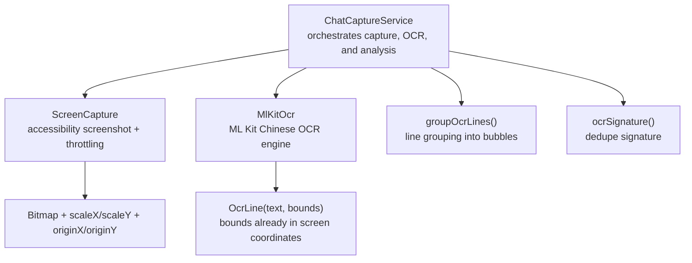
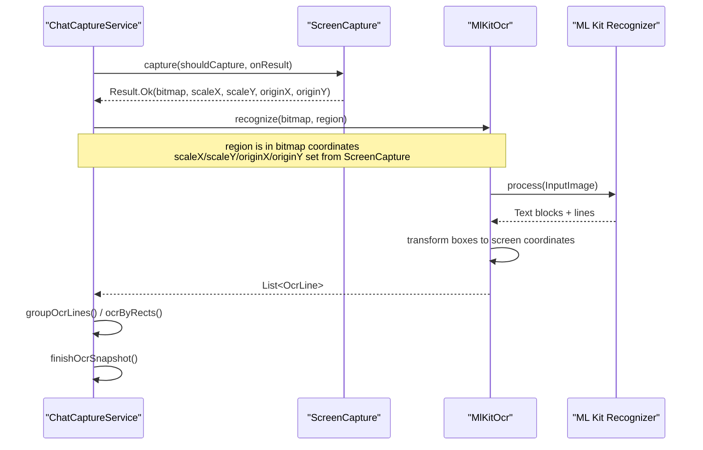
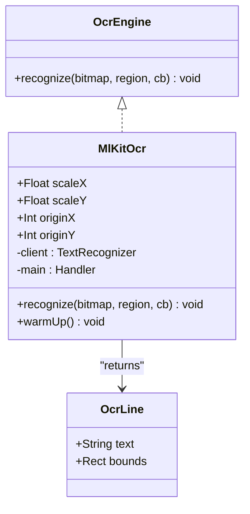
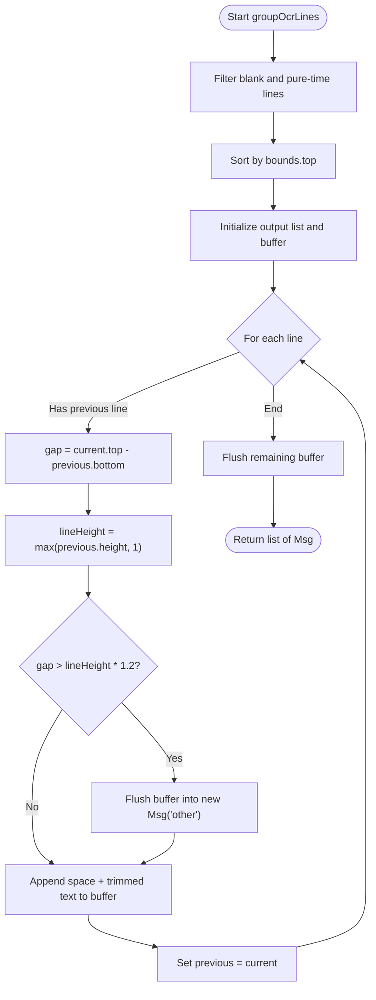
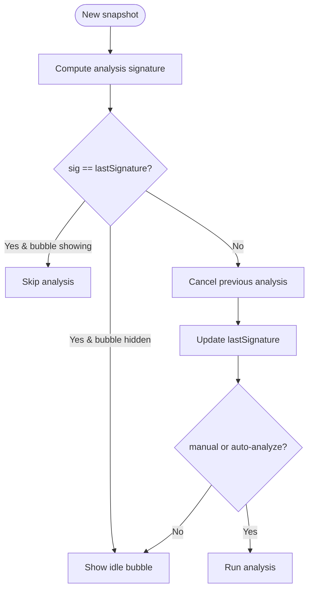
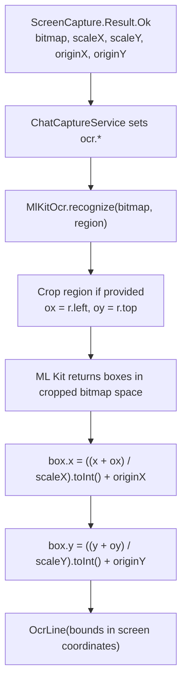
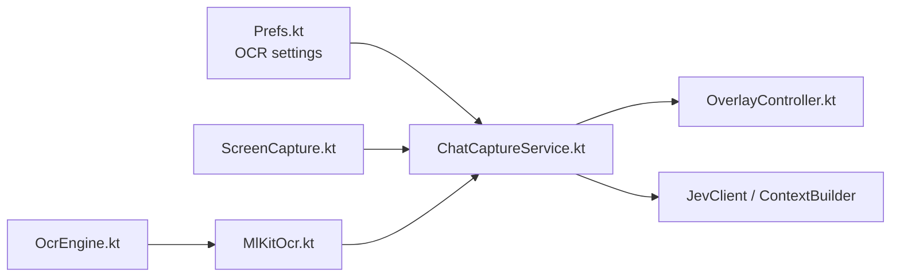

# ML Kit OCR Integration

<cite>
**Referenced Files in This Document**   
- [MlKitOcr.kt](file://app/src/main/java/com/jev/probe/capture/ocr/MlKitOcr.kt)
- [OcrEngine.kt](file://app/src/main/java/com/jev/probe/capture/ocr/OcrEngine.kt)
- [ScreenCapture.kt](file://app/src/main/java/com/jev/probe/capture/ocr/ScreenCapture.kt)
- [ChatCaptureService.kt](file://app/src/main/java/com/jev/probe/capture/ChatCaptureService.kt)
- [Prefs.kt](file://app/src/main/java/com/jev/probe/core/Prefs.kt)
</cite>

## Table of Contents
1. [Introduction](#introduction)
2. [Project Structure](#project-structure)
3. [Core Components](#core-components)
4. [Architecture Overview](#architecture-overview)
5. [Detailed Component Analysis](#detailed-component-analysis)
6. [Dependency Analysis](#dependency-analysis)
7. [Performance Considerations](#performance-considerations)
8. [Troubleshooting Guide](#troubleshooting-guide)
9. [Conclusion](#conclusion)

## Introduction
This document explains the ML Kit OCR integration used by the chat capture system. It focuses on how screenshots are captured, how text is recognized with ML Kit’s bundled Chinese recognizer, how OCR results are transformed back into screen coordinates, and how those results are grouped into message bubbles. It also documents the signature-based deduplication that prevents redundant processing when UI elements update rapidly, as well as configuration options, memory management considerations, and integration patterns for different chat platforms.

## Project Structure
The OCR pipeline spans three main layers:
- Screenshot capture through the accessibility service.
- Text recognition via ML Kit.
- Chat capture orchestration that maps OCR output to messages and integrates with analysis and overlay logic.

**Diagram sources**
- [ChatCaptureService.kt:188-231](file://app/src/main/java/com/jev/probe/capture/ChatCaptureService.kt#L188-L231)
- [ChatCaptureService.kt:548-623](file://app/src/main/java/com/jev/probe/capture/ChatCaptureService.kt#L548-L623)
- [ChatCaptureService.kt:625-652](file://app/src/main/java/com/jev/probe/capture/ChatCaptureService.kt#L625-L652)
- [ChatCaptureService.kt:535-541](file://app/src/main/java/com/jev/probe/capture/ChatCaptureService.kt#L535-L541)
- [ScreenCapture.kt:35-61](file://app/src/main/java/com/jev/probe/capture/ocr/ScreenCapture.kt#L35-L61)
- [MlKitOcr.kt:26-95](file://app/src/main/java/com/jev/probe/capture/ocr/MlKitOcr.kt#L26-L95)
- [OcrEngine.kt:6-22](file://app/src/main/java/com/jev/probe/capture/ocr/OcrEngine.kt#L6-L22)

**Section sources**
- [ChatCaptureService.kt:29-42](file://app/src/main/java/com/jev/probe/capture/ChatCaptureService.kt#L29-L42)
- [ScreenCapture.kt:14-34](file://app/src/main/java/com/jev/probe/capture/ocr/ScreenCapture.kt#L14-L34)
- [MlKitOcr.kt:13-25](file://app/src/main/java/com/jev/probe/capture/ocr/MlKitOcr.kt#L13-L25)

## Core Components
- **OcrEngine**: Defines the contract for text recognition over a screenshot. The callback returns `List<OcrLine>` where each line includes its text and bounding box already mapped to screen coordinates.
- **MlKitOcr**: Implements `OcrEngine` using ML Kit’s bundled Chinese recognizer. It handles cropping, coordinate transformation, model warm-up, and main-thread callbacks.
- **ScreenCapture**: Wraps accessibility screenshot capture, manages throttling/backoff, converts hardware buffers to bitmaps, and provides scale and origin metadata needed for coordinate mapping.
- **ChatCaptureService**: Orchestrates the full flow: deciding whether to use bubble rectangles or whole-screen OCR, invoking `MlKitOcr`, grouping lines into messages, deduplicating snapshots, and integrating with analysis and overlay.

**Section sources**
- [OcrEngine.kt:6-22](file://app/src/main/java/com/jev/probe/capture/ocr/OcrEngine.kt#L6-L22)
- [MlKitOcr.kt:26-112](file://app/src/main/java/com/jev/probe/capture/ocr/MlKitOcr.kt#L26-L112)
- [ScreenCapture.kt:35-61](file://app/src/main/java/com/jev/probe/capture/ocr/ScreenCapture.kt#L35-L61)
- [ChatCaptureService.kt:188-231](file://app/src/main/java/com/jev/probe/capture/ChatCaptureService.kt#L188-L231)

## Architecture Overview
The OCR path is designed so that both screenshot and OCR callbacks run on the main thread, while heavy work (model loading, background analysis) runs off the main thread.

**Diagram sources**
- [ChatCaptureService.kt:548-623](file://app/src/main/java/com/jev/probe/capture/ChatCaptureService.kt#L548-L623)
- [MlKitOcr.kt:39-95](file://app/src/main/java/com/jev/probe/capture/ocr/MlKitOcr.kt#L39-L95)
- [ScreenCapture.kt:65-93](file://app/src/main/java/com/jev/probe/capture/ocr/ScreenCapture.kt#L65-L93)

## Detailed Component Analysis

### MlKitOcr: Primary Text Recognition Engine
`MlKitOcr` is the only active implementation of `OcrEngine`. Its responsibilities include:
- Accepting a bitmap and an optional region in bitmap coordinates.
- Cropping the bitmap when a region is provided.
- Creating an ML Kit `InputImage`.
- Running recognition on ML Kit’s threads.
- Transforming bounding boxes from cropped bitmap space back to screen coordinates.
- Returning results on the main thread.

Key behaviors:
- **Coordinate transformation**: For each line, the code adds the crop offset (`ox`, `oy`) and divides by `scaleX`/`scaleY`, then adds `originX`/`originY`. This ensures returned `OcrLine.bounds` are in screen coordinates.
- **Main-thread callback**: Uses a `Handler` bound to the main looper so overlay updates do not require extra threading hops.
- **Model initialization and warm-up**: The recognizer is lazily created; `warmUp()` forces creation to load the bundled model off the main thread.
- **Error handling**: Crop failures, invalid regions, and ML Kit failures return empty lists rather than throwing exceptions to callers.

**Diagram sources**
- [OcrEngine.kt:6-22](file://app/src/main/java/com/jev/probe/capture/ocr/OcrEngine.kt#L6-L22)
- [MlKitOcr.kt:26-112](file://app/src/main/java/com/jev/probe/capture/ocr/MlKitOcr.kt#L26-L112)

**Section sources**
- [MlKitOcr.kt:13-25](file://app/src/main/java/com/jev/probe/capture/ocr/MlKitOcr.kt#L13-L25)
- [MlKitOcr.kt:39-95](file://app/src/main/java/com/jev/probe/capture/ocr/MlKitOcr.kt#L39-L95)
- [MlKitOcr.kt:97-112](file://app/src/main/java/com/jev/probe/capture/ocr/MlKitOcr.kt#L97-L112)

### Model Initialization and Warm-Up
- The ML Kit recognizer is created lazily inside a companion object.
- First access loads the bundled Chinese model, which is the slow step.
- `ChatCaptureService.onServiceConnected()` calls `MlKitOcr.warmUp()` on a worker thread so the first real OCR does not pay this cost on the main thread.

Practical implication:
- Call warm-up during service startup or when the user enables OCR-related features.
- Avoid calling warm-up from the screenshot callback path.

**Section sources**
- [MlKitOcr.kt:97-112](file://app/src/main/java/com/jev/probe/capture/ocr/MlKitOcr.kt#L97-L112)
- [ChatCaptureService.kt:202-231](file://app/src/main/java/com/jev/probe/capture/ChatCaptureService.kt#L202-L231)

### Line Grouping Algorithm: Reconstructing Message Bubbles
When no adapter can provide bubble rectangles, the system performs whole-screen OCR and groups lines into pseudo-bubbles.

Algorithm summary:
1. Filter out blank lines and pure timestamp-like lines.
2. Sort usable lines by vertical position (`bounds.top`).
3. Iterate lines and compare the gap between the current line’s top and the previous line’s bottom.
4. If the gap exceeds 1.2 times the previous line’s height, start a new bubble.
5. Concatenate lines within a bubble with spaces.
6. All groups are filed as “other” because side information is unavailable from a flat screen read.

**Diagram sources**
- [ChatCaptureService.kt:625-652](file://app/src/main/java/com/jev/probe/capture/ChatCaptureService.kt#L625-L652)

**Section sources**
- [ChatCaptureService.kt:613-623](file://app/src/main/java/com/jev/probe/capture/ChatCaptureService.kt#L613-L623)
- [ChatCaptureService.kt:625-652](file://app/src/main/java/com/jev/probe/capture/ChatCaptureService.kt#L625-L652)

### Signature-Based Deduplication System
Rapid UI updates (scrolling, caret blinking, presence indicators) can trigger many events. The system uses two signatures:
- **Analysis signature**: Based on the snapshot’s messages and title. Prevents re-analyzing identical content.
- **OCR signature**: Based on package name, title, and bubble rectangle positions/sides. Prevents repeated screenshots when the visual layout has not meaningfully changed.

Deduplication behavior:
- If the signature matches and the overlay bubble is already showing, skip further work.
- If the signature matches but the bubble is gone, restore the idle bubble without re-analyzing.
- When switching apps, reset the analysis signature to avoid cross-app false positives.
- Manual OCR always re-runs; automatic OCR respects the signature.

**Diagram sources**
- [ChatCaptureService.kt:331-349](file://app/src/main/java/com/jev/probe/capture/ChatCaptureService.kt#L331-L349)
- [ChatCaptureService.kt:668-702](file://app/src/main/java/com/jev/probe/capture/ChatCaptureService.kt#L668-L702)
- [ChatCaptureService.kt:535-541](file://app/src/main/java/com/jev/probe/capture/ChatCaptureService.kt#L535-L541)

**Section sources**
- [ChatCaptureService.kt:63-68](file://app/src/main/java/com/jev/probe/capture/ChatCaptureService.kt#L63-L68)
- [ChatCaptureService.kt:331-349](file://app/src/main/java/com/jev/probe/capture/ChatCaptureService.kt#L331-L349)
- [ChatCaptureService.kt:535-541](file://app/src/main/java/com/jev/probe/capture/ChatCaptureService.kt#L535-L541)
- [ChatCaptureService.kt:668-702](file://app/src/main/java/com/jev/probe/capture/ChatCaptureService.kt#L668-L702)

### Coordinate Transformation Pipeline
The pipeline maps OCR bounding boxes back to original screen coordinates:

1. **ScreenCapture produces metadata**:
   - `scaleX`, `scaleY`: bitmap size divided by captured area size.
   - `originX`, `originY`: where the captured area starts on screen.
2. **ChatCaptureService sets OCR metadata**:
   - Before OCR, it assigns `ocr.scaleX`, `ocr.scaleY`, `ocr.originX`, `ocr.originY` from `ScreenCapture.Result.Ok`.
3. **MlKitOcr transforms boxes**:
   - Adds crop offsets (`ox`, `oy`) to ML Kit’s box coordinates.
   - Divides by `scaleX`/`scaleY`.
   - Adds `originX`/`originY`.
   - Returns `OcrLine` with screen-coordinate bounds.

**Diagram sources**
- [ScreenCapture.kt:42-59](file://app/src/main/java/com/jev/probe/capture/ocr/ScreenCapture.kt#L42-L59)
- [ChatCaptureService.kt:572-583](file://app/src/main/java/com/jev/probe/capture/ChatCaptureService.kt#L572-L583)
- [MlKitOcr.kt:39-95](file://app/src/main/java/com/jev/probe/capture/ocr/MlKitOcr.kt#L39-L95)

**Section sources**
- [ScreenCapture.kt:42-59](file://app/src/main/java/com/jev/probe/capture/ocr/ScreenCapture.kt#L42-L59)
- [ChatCaptureService.kt:572-583](file://app/src/main/java/com/jev/probe/capture/ChatCaptureService.kt#L572-L583)
- [MlKitOcr.kt:18-21](file://app/src/main/java/com/jev/probe/capture/ocr/MlKitOcr.kt#L18-L21)
- [MlKitOcr.kt:71-95](file://app/src/main/java/com/jev/probe/capture/ocr/MlKitOcr.kt#L71-L95)

### Configuration Options
The OCR subsystem is influenced by several preferences:
- **OCR engine selection**: `"mlkit"` or `"vision"`. The active v1.3 path uses ML Kit.
- **Fallback OCR for unknown apps**: Enables generic OCR capture when there is no dedicated adapter.
- **OCR fallback gate**: Controls whether the system falls back to screenshot + OCR when the tree exposes no message text.
- **Auto-analyze after OCR**: Controls whether OCR results automatically trigger analysis.

These options affect:
- Whether OCR is attempted at all.
- Whether OCR results are analyzed automatically.
- Which apps receive generic OCR treatment.

**Section sources**
- [Prefs.kt:154-164](file://app/src/main/java/com/jev/probe/core/Prefs.kt#L154-L164)
- [ChatCaptureService.kt:314-327](file://app/src/main/java/com/jev/probe/capture/ChatCaptureService.kt#L314-L327)
- [ChatCaptureService.kt:693-701](file://app/src/main/java/com/jev/probe/capture/ChatCaptureService.kt#L693-L701)

### Memory Management Considerations
- **HardwareBuffer lifecycle**: `ScreenCapture` wraps the hardware buffer, copies it into an ARGB_8888 bitmap, recycles the wrapper, and closes the underlying buffer in a `finally` block.
- **Bitmap recycling**: After OCR completes, the bitmap is recycled once per path (`ocrByRects` and `ocrWholeScreen`).
- **Cropped bitmap cleanup**: `MlKitOcr` recycles temporary cropped bitmaps in success and failure paths.
- **Throttling and backoff**: `ScreenCapture` enforces a minimum interval and exponential backoff to prevent rapid repeated screenshots.
- **Concurrent OCR processing**: Each bubble rectangle triggers one OCR call; results are aggregated until all complete. Whole-screen OCR processes the entire visible area at once.

Best practices derived from the code:
- Always recycle bitmaps after use.
- Never hold references to screenshots longer than necessary.
- Respect throttling and backoff to avoid overwhelming the system.
- Use region-based OCR when possible to reduce image size.

**Section sources**
- [ScreenCapture.kt:149-176](file://app/src/main/java/com/jev/probe/capture/ocr/ScreenCapture.kt#L149-L176)
- [ScreenCapture.kt:178-206](file://app/src/main/java/com/jev/probe/capture/ocr/ScreenCapture.kt#L178-L206)
- [MlKitOcr.kt:44-58](file://app/src/main/java/com/jev/probe/capture/ocr/MlKitOcr.kt#L44-L58)
- [MlKitOcr.kt:86-94](file://app/src/main/java/com/jev/probe/capture/ocr/MlKitOcr.kt#L86-L94)
- [ChatCaptureService.kt:589-623](file://app/src/main/java/com/jev/probe/capture/ChatCaptureService.kt#L589-L623)

### Integration with Different Chat Platforms
The system supports multiple adapters and fallback strategies:
- **Feishu**: Uses bubble rectangles from the accessibility tree; each rectangle becomes one message. OCR fills in the unreadable body text.
- **QQ, X, WeChat**: Have dedicated adapters; some may fall back to manual OCR when the tree cannot expose message bodies.
- **Unknown apps**: Generic OCR path captures the whole screen and groups lines into pseudo-bubbles.

Platform-specific notes:
- Feishu’s tree may be empty for message bodies, triggering OCR fallback.
- WeChat may strip sensitive text from the tree, making manual OCR the escape hatch.
- Unknown packages rely on spatial grouping and cannot determine sender side reliably.

**Section sources**
- [ChatCaptureService.kt:48-53](file://app/src/main/java/com/jev/probe/capture/ChatCaptureService.kt#L48-L53)
- [ChatCaptureService.kt:305-327](file://app/src/main/java/com/jev/probe/capture/ChatCaptureService.kt#L305-L327)
- [ChatCaptureService.kt:589-623](file://app/src/main/java/com/jev/probe/capture/ChatCaptureService.kt#L589-L623)
- [ChatCaptureService.kt:465-499](file://app/src/main/java/com/jev/probe/capture/ChatCaptureService.kt#L465-L499)

## Dependency Analysis
The OCR integration depends on Android accessibility APIs, ML Kit, and internal chat capture components.

**Diagram sources**
- [Prefs.kt:154-164](file://app/src/main/java/com/jev/probe/core/Prefs.kt#L154-L164)
- [ChatCaptureService.kt:188-231](file://app/src/main/java/com/jev/probe/capture/ChatCaptureService.kt#L188-L231)
- [ScreenCapture.kt:35-61](file://app/src/main/java/com/jev/probe/capture/ocr/ScreenCapture.kt#L35-L61)
- [MlKitOcr.kt:26-112](file://app/src/main/java/com/jev/probe/capture/ocr/MlKitOcr.kt#L26-L112)
- [OcrEngine.kt:6-22](file://app/src/main/java/com/jev/probe/capture/ocr/OcrEngine.kt#L6-L22)

**Section sources**
- [ChatCaptureService.kt:188-231](file://app/src/main/java/com/jev/probe/capture/ChatCaptureService.kt#L188-L231)
- [Prefs.kt:154-164](file://app/src/main/java/com/jev/probe/core/Prefs.kt#L154-L164)

## Performance Considerations
- **Warm-up**: Load the bundled ML Kit model during service connection to avoid first-use latency on the main thread.
- **Region-based OCR**: Prefer bubble-rectangle OCR for known apps to reduce image size and processing time.
- **Throttling**: Rely on `ScreenCapture`’s built-in throttling and backoff to prevent screenshot storms.
- **Deduplication**: Use signatures to avoid redundant analysis and OCR when UI changes are cosmetic.
- **Memory**: Recycle bitmaps promptly; avoid holding screenshots across long-running tasks.
- **Concurrency**: Bubble-rect OCR runs multiple independent recognitions; ensure the app can handle concurrent callbacks safely.

[No sources needed since this section provides general guidance]

## Troubleshooting Guide
Common issues and their likely causes:
- **OCR returns no text**:
  - The region may be too small or outside the bitmap.
  - The app may hide message text in the accessibility tree, requiring OCR fallback.
  - The screenshot may be throttled or blocked due to platform restrictions.
- **Coordinates appear wrong**:
  - Ensure `scaleX`, `scaleY`, `originX`, `originY` are set from `ScreenCapture.Result.Ok` before OCR.
  - Verify that node rectangles are converted to bitmap coordinates using the same scale and origin.
- **Repeated screenshots**:
  - Check OCR signature stability; transient UI elements should not change the signature.
  - Confirm that `ocrFallback` is enabled only when necessary.
- **Memory pressure**:
  - Verify bitmaps are recycled after OCR.
  - Avoid keeping large screenshots in memory longer than required.

**Section sources**
- [MlKitOcr.kt:44-58](file://app/src/main/java/com/jev/probe/capture/ocr/MlKitOcr.kt#L44-L58)
- [MlKitOcr.kt:86-94](file://app/src/main/java/com/jev/probe/capture/ocr/MlKitOcr.kt#L86-L94)
- [ScreenCapture.kt:178-206](file://app/src/main/java/com/jev/probe/capture/ocr/ScreenCapture.kt#L178-L206)
- [ChatCaptureService.kt:572-583](file://app/src/main/java/com/jev/probe/capture/ChatCaptureService.kt#L572-L583)

## Conclusion
The ML Kit OCR integration provides a robust, on-device text recognition path that works even without Google Play services. By combining careful coordinate transformation, line grouping, signature-based deduplication, and disciplined memory management, the system can reconstruct meaningful message bubbles from screenshots across multiple chat platforms. Configuration options allow flexible tuning for performance and privacy, while the architecture keeps main-thread work minimal and defers heavy operations to background workers.

[No sources needed since this section summarizes without analyzing specific files]