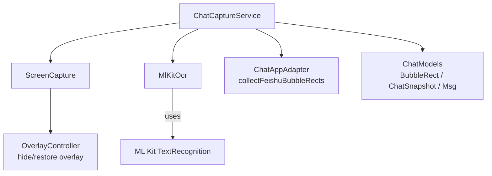
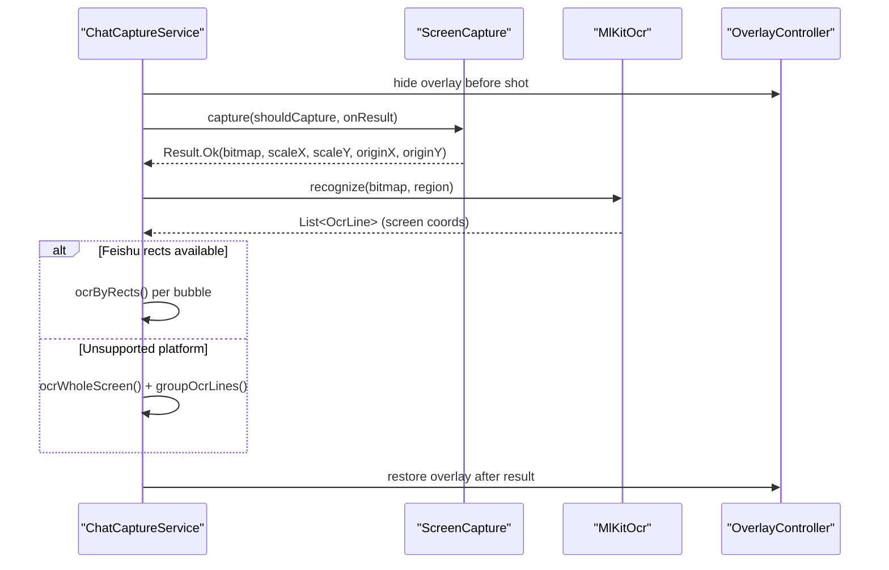
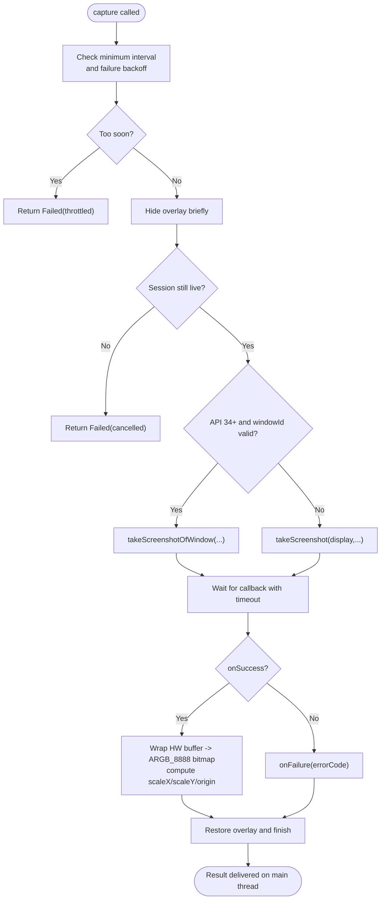
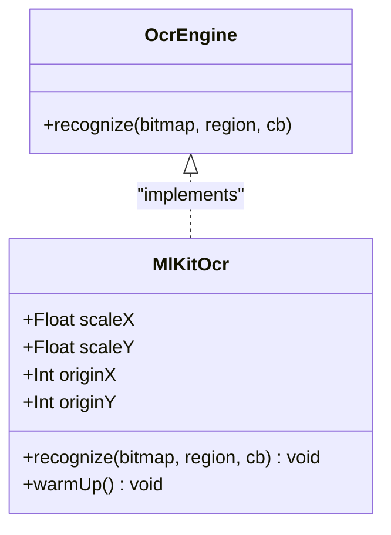
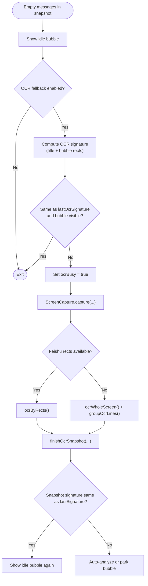
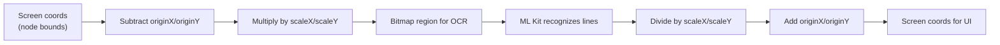
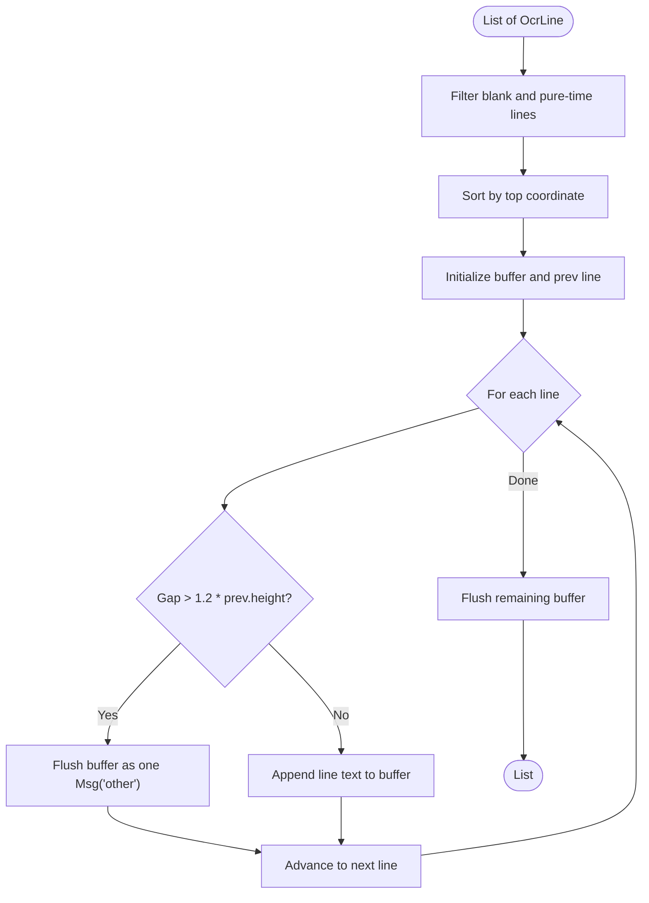
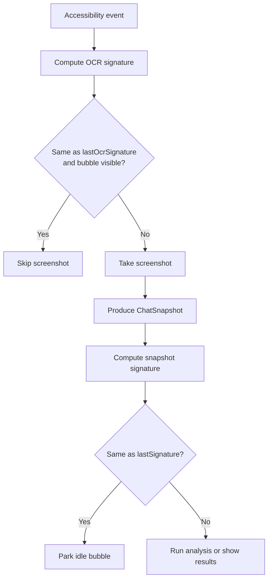
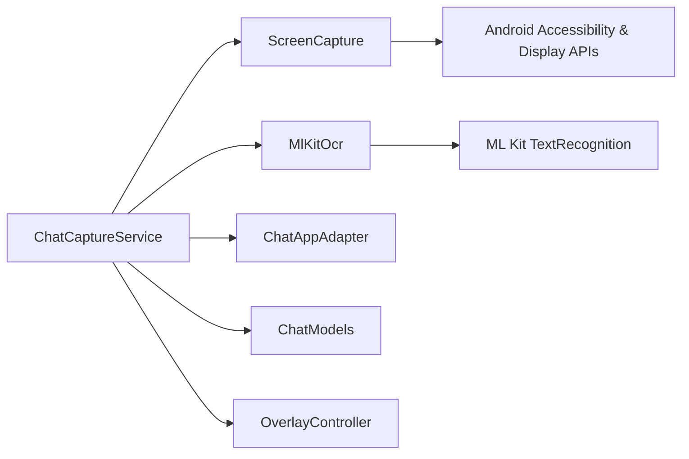

# OCR Fallback Mechanism

<cite>
**Referenced Files in This Document**
- [ScreenCapture.kt](file://app/src/main/java/com/jev/probe/capture/ocr/ScreenCapture.kt)
- [MlKitOcr.kt](file://app/src/main/java/com/jev/probe/capture/ocr/MlKitOcr.kt)
- [OcrEngine.kt](file://app/src/main/java/com/jev/probe/capture/ocr/OcrEngine.kt)
- [ChatCaptureService.kt](file://app/src/main/java/com/jev/probe/capture/ChatCaptureService.kt)
- [ChatAppAdapter.kt](file://app/src/main/java/com/jev/probe/capture/ChatAppAdapter.kt)
- [ChatModels.kt](file://app/src/main/java/com/jev/probe/core/ChatModels.kt)
- [OverlayController.kt](file://app/src/main/java/com/jev/probe/overlay/OverlayController.kt)
</cite>

## Table of Contents
1. [Introduction](#introduction)
2. [Project Structure](#project-structure)
3. [Core Components](#core-components)
4. [Architecture Overview](#architecture-overview)
5. [Detailed Component Analysis](#detailed-component-analysis)
6. [Dependency Analysis](#dependency-analysis)
7. [Performance Considerations](#performance-considerations)
8. [Troubleshooting Guide](#troubleshooting-guide)
9. [Conclusion](#conclusion)

## Introduction
This document explains the OCR fallback mechanism used when an app’s accessibility tree does not expose message text. The system captures a screenshot through the accessibility service, runs on-device Chinese text recognition with ML Kit, and reconstructs chat bubbles either by targeting known bubble regions (for apps like Feishu) or by recognizing the whole screen and grouping lines. It also documents permission handling, error recovery, model warm-up, memory management, coordinate transformation, deduplication, and performance considerations.

## Project Structure
The OCR fallback spans several modules:
- Screenshot capture and throttling: `ScreenCapture`
- Text recognition abstraction and ML Kit implementation: `OcrEngine`, `MlKitOcr`
- Orchestrating logic, dual-path strategy, deduplication, and UI integration: `ChatCaptureService`
- Bubble geometry extraction for Feishu: `ChatAppAdapter`
- Shared data models: `ChatModels`
- Overlay lifecycle during screenshots: `OverlayController`

**Diagram sources**
- [ChatCaptureService.kt:188-195](file://app/src/main/java/com/jev/probe/capture/ChatCaptureService.kt#L188-L195)
- [ScreenCapture.kt:35-39](file://app/src/main/java/com/jev/probe/capture/ocr/ScreenCapture.kt#L35-L39)
- [MlKitOcr.kt:26-30](file://app/src/main/java/com/jev/probe/capture/ocr/MlKitOcr.kt#L26-L30)
- [ChatAppAdapter.kt:276-301](file://app/src/main/java/com/jev/probe/capture/ChatAppAdapter.kt#L276-L301)
- [ChatModels.kt:5-13](file://app/src/main/java/com/jev/probe/core/ChatModels.kt#L5-L13)
- [OverlayController.kt:124-151](file://app/src/main/java/com/jev/probe/overlay/OverlayController.kt#L124-L151)

**Section sources**
- [ChatCaptureService.kt:188-195](file://app/src/main/java/com/jev/probe/capture/ChatCaptureService.kt#L188-L195)
- [ScreenCapture.kt:14-34](file://app/src/main/java/com/jev/probe/capture/ocr/ScreenCapture.kt#L14-L34)
- [MlKitOcr.kt:13-25](file://app/src/main/java/com/jev/probe/capture/ocr/MlKitOcr.kt#L13-L25)
- [ChatAppAdapter.kt:267-301](file://app/src/main/java/com/jev/probe/capture/ChatAppAdapter.kt#L267-L301)
- [ChatModels.kt:5-38](file://app/src/main/java/com/jev/probe/core/ChatModels.kt#L5-L38)

## Core Components
- ScreenCapture: Captures one screenshot via the accessibility service, hides the floating overlay to avoid capturing it, handles platform errors, throttles repeated attempts, converts hardware buffers to bitmaps, and returns scaled mapping metadata.
- MlKitOcr: On-device Chinese OCR using bundled ML Kit; supports region cropping, coordinate transformation back to screen space, and main-thread callbacks.
- OcrEngine: Abstraction for OCR engines returning recognized lines with screen-space bounding boxes.
- ChatCaptureService: Orchestrates the dual-path OCR strategy, signature-based deduplication, bubble rect re-measurement, line grouping, and integration with the overlay and analysis pipeline.
- ChatAppAdapter.collectFeishuBubbleRects: Extracts Feishu bubble rectangles and inferred sender side from the accessibility tree.
- ChatModels: Defines shared types such as `Msg`, `BubbleRect`, and `ChatSnapshot`.
- OverlayController: Provides the floating bubble and panel; its visibility is toggled around screenshots.

**Section sources**
- [ScreenCapture.kt:35-176](file://app/src/main/java/com/jev/probe/capture/ocr/ScreenCapture.kt#L35-L176)
- [MlKitOcr.kt:26-112](file://app/src/main/java/com/jev/probe/capture/ocr/MlKitOcr.kt#L26-L112)
- [OcrEngine.kt:6-22](file://app/src/main/java/com/jev/probe/capture/ocr/OcrEngine.kt#L6-L22)
- [ChatCaptureService.kt:188-702](file://app/src/main/java/com/jev/probe/capture/ChatCaptureService.kt#L188-L702)
- [ChatAppAdapter.kt:276-301](file://app/src/main/java/com/jev/probe/capture/ChatAppAdapter.kt#L276-L301)
- [ChatModels.kt:5-38](file://app/src/main/java/com/jev/probe/core/ChatModels.kt#L5-L38)
- [OverlayController.kt:124-151](file://app/src/main/java/com/jev/probe/overlay/OverlayController.kt#L124-L151)

## Architecture Overview
The OCR fallback is triggered when the adapter reports a chat window but no readable messages. The service then chooses between:
- Targeted bubble OCR: For Feishu, where bubble positions are known, each bubble rectangle is cropped and recognized independently.
- Whole-screen OCR: For unsupported platforms, the middle portion of the screen is recognized and lines are grouped into pseudo-bubbles.

**Diagram sources**
- [ChatCaptureService.kt:548-623](file://app/src/main/java/com/jev/probe/capture/ChatCaptureService.kt#L548-L623)
- [ScreenCapture.kt:65-176](file://app/src/main/java/com/jev/probe/capture/ocr/ScreenCapture.kt#L65-L176)
- [MlKitOcr.kt:39-95](file://app/src/main/java/com/jev/probe/capture/ocr/MlKitOcr.kt#L39-L95)
- [OverlayController.kt:124-151](file://app/src/main/java/com/jev/probe/overlay/OverlayController.kt#L124-L151)

## Detailed Component Analysis

### ScreenCapture: Screenshot Capture, Permissions, and Error Recovery
Responsibilities:
- Takes one screenshot via the accessibility service without MediaProjection or root privileges. Requires the service to declare screenshot capability.
- Hides the overlay before capture and restores it afterward to prevent capturing the overlay itself.
- Converts the returned hardware buffer to a software bitmap and closes all native resources promptly to avoid compositor leaks.
- Throttles calls at least every 1 second and applies exponential backoff on repeated failures.
- Supports both active-window shots (API 34+) and full-display fallback, returning scale and origin metadata so coordinates can be mapped correctly.
- Handles timeouts, protected windows, invalid displays, and other platform error codes with human-readable messages.

Key behaviors:
- Main-thread contract: `capture` answers exactly once on the main thread.
- Window vs display shots: When a window shot is used, the bitmap may be smaller and offset; `scaleX/scaleY` and `originX/originY` allow correct coordinate mapping.
- Failure streak backoff: Repeated failures increase the required interval up to a maximum.

**Diagram sources**
- [ScreenCapture.kt:65-176](file://app/src/main/java/com/jev/probe/capture/ocr/ScreenCapture.kt#L65-L176)
- [ScreenCapture.kt:178-218](file://app/src/main/java/com/jev/probe/capture/ocr/ScreenCapture.kt#L178-L218)

**Section sources**
- [ScreenCapture.kt:14-34](file://app/src/main/java/com/jev/probe/capture/ocr/ScreenCapture.kt#L14-L34)
- [ScreenCapture.kt:65-176](file://app/src/main/java/com/jev/probe/capture/ocr/ScreenCapture.kt#L65-L176)
- [ScreenCapture.kt:178-218](file://app/src/main/java/com/jev/probe/capture/ocr/ScreenCapture.kt#L178-L218)

### MlKitOcr: On-Device Text Recognition and Memory Management
Responsibilities:
- Wraps ML Kit’s bundled Chinese recognizer. The model ships inside the APK and does not require Google Play services.
- Accepts a bitmap and optional crop region in bitmap coordinates; returns recognized lines with bounding boxes converted back to screen coordinates.
- Posts results to the main thread so overlay work needs no extra hop.
- Manages memory by cropping only when needed and recycling temporary bitmaps.

Model warm-up:
- The recognizer is lazily created; calling `warmUp()` triggers model loading off the main thread so the first real OCR does not block the screenshot callback path.

Coordinate transformation:
- Sets `scaleX/scaleY` and `originX/originY` from the `ScreenCapture` result before recognition.
- Adds crop offsets back and divides by scale factors so output boxes align with node bounds.

**Diagram sources**
- [OcrEngine.kt:6-22](file://app/src/main/java/com/jev/probe/capture/ocr/OcrEngine.kt#L6-L22)
- [MlKitOcr.kt:26-112](file://app/src/main/java/com/jev/probe/capture/ocr/MlKitOcr.kt#L26-L112)

**Section sources**
- [MlKitOcr.kt:13-25](file://app/src/main/java/com/jev/probe/capture/ocr/MlKitOcr.kt#L13-L25)
- [MlKitOcr.kt:39-95](file://app/src/main/java/com/jev/probe/capture/ocr/MlKitOcr.kt#L39-L95)
- [MlKitOcr.kt:97-112](file://app/src/main/java/com/jev/probe/capture/ocr/MlKitOcr.kt#L97-L112)

### Dual-Path OCR Strategy in ChatCaptureService
Trigger conditions:
- An adapter recognizes a chat window but reports no messages. The service parks the idle bubble and, if OCR fallback is enabled, proceeds with OCR.

Two paths:
- Targeted bubble OCR (`ocrByRects`): Used for Feishu when bubble rectangles are available. Each rectangle is cropped and recognized independently; results are combined into one message per bubble.
- Whole-screen OCR (`ocrWholeScreen`): Used for unsupported platforms. The middle portion of the screen is recognized, then lines are grouped into pseudo-bubbles based on vertical gaps.

Signature-based deduplication:
- Before taking a screenshot, the service computes an OCR signature from package, title, and bubble rectangles. If unchanged and the bubble is already visible, the shot is skipped.
- After OCR, the resulting snapshot is deduplicated against the last successful snapshot to avoid redundant analysis.

**Diagram sources**
- [ChatCaptureService.kt:305-328](file://app/src/main/java/com/jev/probe/capture/ChatCaptureService.kt#L305-L328)
- [ChatCaptureService.kt:535-541](file://app/src/main/java/com/jev/probe/capture/ChatCaptureService.kt#L535-L541)
- [ChatCaptureService.kt:548-623](file://app/src/main/java/com/jev/probe/capture/ChatCaptureService.kt#L548-L623)
- [ChatCaptureService.kt:668-702](file://app/src/main/java/com/jev/probe/capture/ChatCaptureService.kt#L668-L702)

**Section sources**
- [ChatCaptureService.kt:305-328](file://app/src/main/java/com/jev/probe/capture/ChatCaptureService.kt#L305-L328)
- [ChatCaptureService.kt:535-541](file://app/src/main/java/com/jev/probe/capture/ChatCaptureService.kt#L535-L541)
- [ChatCaptureService.kt:548-623](file://app/src/main/java/com/jev/probe/capture/ChatCaptureService.kt#L548-L623)
- [ChatCaptureService.kt:668-702](file://app/src/main/java/com/jev/probe/capture/ChatCaptureService.kt#L668-L702)

### Coordinate Transformation Pipeline
Goal: Convert between screen coordinates (used by accessibility nodes) and bitmap coordinates (used by OCR).

Pipeline:
1. Feishu bubble rectangles are collected in screen coordinates.
2. Before OCR, subtract the window origin (`originX/originY`) and multiply by `scaleX/scaleY` to get bitmap-region coordinates.
3. OCR returns boxes in bitmap space; add crop offsets back, divide by scale, and add origin to convert to screen coordinates.
4. For whole-screen OCR, the service crops the top and bottom bands and groups lines vertically.

**Diagram sources**
- [ChatCaptureService.kt:590-611](file://app/src/main/java/com/jev/probe/capture/ChatCaptureService.kt#L590-L611)
- [MlKitOcr.kt:39-95](file://app/src/main/java/com/jev/probe/capture/ocr/MlKitOcr.kt#L39-L95)

**Section sources**
- [ChatCaptureService.kt:590-611](file://app/src/main/java/com/jev/probe/capture/ChatCaptureService.kt#L590-L611)
- [MlKitOcr.kt:39-95](file://app/src/main/java/com/jev/probe/capture/ocr/MlKitOcr.kt#L39-L95)

### Line Grouping Algorithm for Whole-Screen OCR
Purpose: Reconstruct message bubbles from flat OCR results when side information is unavailable.

Algorithm:
- Filter out blank lines and pure timestamps.
- Sort lines by vertical position.
- Start a new bubble when the gap between the current line’s top and the previous line’s bottom exceeds 1.2 times the previous line height.
- Concatenate lines within a bubble with spaces.
- All reconstructed bubbles are labeled as “other” because side cannot be determined from a flat screen read.

**Diagram sources**
- [ChatCaptureService.kt:625-652](file://app/src/main/java/com/jev/probe/capture/ChatCaptureService.kt#L625-L652)

**Section sources**
- [ChatCaptureService.kt:613-652](file://app/src/main/java/com/jev/probe/capture/ChatCaptureService.kt#L613-L652)

### Signature-Based Deduplication System
Goals:
- Prevent redundant screenshot captures during rapid UI updates.
- Avoid redundant analysis when content has not changed.

Mechanisms:
- OCR signature: Combines package, title, and bubble rectangles (including sides). If unchanged and the bubble is visible, the screenshot is skipped.
- Snapshot signature: Based on the last few messages; prevents re-analysis when the OCR result is identical to the previous one.
- Service-level throttle: `ScreenCapture` enforces a minimum interval and exponential backoff on repeated failures.

**Diagram sources**
- [ChatCaptureService.kt:535-541](file://app/src/main/java/com/jev/probe/capture/ChatCaptureService.kt#L535-L541)
- [ChatCaptureService.kt:668-702](file://app/src/main/java/com/jev/probe/capture/ChatCaptureService.kt#L668-L702)
- [ScreenCapture.kt:178-218](file://app/src/main/java/com/jev/probe/capture/ocr/ScreenCapture.kt#L178-L218)

**Section sources**
- [ChatCaptureService.kt:535-541](file://app/src/main/java/com/jev/probe/capture/ChatCaptureService.kt#L535-L541)
- [ChatCaptureService.kt:668-702](file://app/src/main/java/com/jev/probe/capture/ChatCaptureService.kt#L668-L702)
- [ScreenCapture.kt:178-218](file://app/src/main/java/com/jev/probe/capture/ocr/ScreenCapture.kt#L178-L218)

## Dependency Analysis
- `ChatCaptureService` depends on:
  - `ScreenCapture` for screenshot acquisition and error handling.
  - `MlKitOcr` for text recognition.
  - `ChatAppAdapter.collectFeishuBubbleRects` for Feishu-specific bubble geometry.
  - `ChatModels` for shared data structures.
  - `OverlayController` for hiding/restoring the overlay and showing user feedback.
- `MlKitOcr` depends on ML Kit’s bundled Chinese recognizer.
- `ScreenCapture` depends on the Android accessibility service APIs and system display/window APIs.

**Diagram sources**
- [ChatCaptureService.kt:188-195](file://app/src/main/java/com/jev/probe/capture/ChatCaptureService.kt#L188-L195)
- [ScreenCapture.kt:3-12](file://app/src/main/java/com/jev/probe/capture/ocr/ScreenCapture.kt#L3-L12)
- [MlKitOcr.kt:8-11](file://app/src/main/java/com/jev/probe/capture/ocr/MlKitOcr.kt#L8-L11)
- [ChatAppAdapter.kt:276-301](file://app/src/main/java/com/jev/probe/capture/ChatAppAdapter.kt#L276-L301)
- [ChatModels.kt:5-38](file://app/src/main/java/com/jev/probe/core/ChatModels.kt#L5-L38)
- [OverlayController.kt:124-151](file://app/src/main/java/com/jev/probe/overlay/OverlayController.kt#L124-L151)

**Section sources**
- [ChatCaptureService.kt:188-195](file://app/src/main/java/com/jev/probe/capture/ChatCaptureService.kt#L188-L195)
- [ScreenCapture.kt:3-12](file://app/src/main/java/com/jev/probe/capture/ocr/ScreenCapture.kt#L3-L12)
- [MlKitOcr.kt:8-11](file://app/src/main/java/com/jev/probe/capture/ocr/MlKitOcr.kt#L8-L11)
- [ChatAppAdapter.kt:276-301](file://app/src/main/java/com/jev/probe/capture/ChatAppAdapter.kt#L276-L301)
- [ChatModels.kt:5-38](file://app/src/main/java/com/jev/probe/core/ChatModels.kt#L5-L38)
- [OverlayController.kt:124-151](file://app/src/main/java/com/jev/probe/overlay/OverlayController.kt#L124-L151)

## Performance Considerations
- Image scaling and window shots: Prefer active-window shots on API 34+ when possible; they are cheaper and sometimes allowed where full-display shots are blocked. Always compute `scaleX/scaleY` and `originX/originY` to keep coordinates consistent.
- Region cropping: Crop only when necessary (targeted bubble OCR). Avoid unnecessary copies; recycle temporary bitmaps immediately after use.
- Concurrent OCR processing: For Feishu, multiple bubble regions are processed concurrently; the service waits until all regions complete before assembling the final snapshot.
- Model warm-up: Call `MlKitOcr.warmUp()` early (e.g., on service connect) to load the bundled model off the main thread.
- Throttling and backoff: Enforce a minimum interval between screenshots and apply exponential backoff on repeated failures to avoid turning unstable trees into a screenshot machine gun.
- Memory hygiene: Close hardware buffers and recycle bitmaps in finally blocks to prevent compositor starvation.

[No sources needed since this section provides general guidance]

## Troubleshooting Guide
Common issues and remedies:
- Screenshot too frequent: The service enforces a minimum interval; wait and retry automatically.
- Timeout: The screenshot callback did not arrive; the overlay is restored and the attempt is marked failed.
- Protected window or FLAG_SECURE: The system refuses to capture; inform the user that secure screens cannot be captured.
- Missing screenshot capability: The accessibility service must declare screenshot capability and be toggled off/on in settings.
- No accessible tree: Manual OCR requires an accessible tree; otherwise guide the user to toggle accessibility and re-enter the conversation.
- Empty OCR result: For manual captures, show an error indicating no text was recognized.

Operational tips:
- Ensure the overlay is hidden before capture and restored afterward.
- Use fresh bubble rectangles inside the screenshot callback to account for scrolling between tree reads and picture arrival.
- Keep OCR busy flags and session tokens to avoid stale operations after conversation switches.

**Section sources**
- [ScreenCapture.kt:178-218](file://app/src/main/java/com/jev/probe/capture/ocr/ScreenCapture.kt#L178-L218)
- [ChatCaptureService.kt:465-499](file://app/src/main/java/com/jev/probe/capture/ChatCaptureService.kt#L465-L499)
- [ChatCaptureService.kt:548-587](file://app/src/main/java/com/jev/probe/capture/ChatCaptureService.kt#L548-L587)

## Conclusion
The OCR fallback mechanism provides a robust path when accessibility trees do not expose message text. By combining careful screenshot capture with on-device OCR, targeted bubble recognition for Feishu, whole-screen OCR with line grouping for other apps, and strong safeguards against redundant captures, the system remains efficient and reliable. Proper coordinate transformation, memory management, and concurrency control ensure stable operation across diverse platforms and UI dynamics.

[No sources needed since this section summarizes without analyzing specific files]