# Screen Capture Implementation

<cite>
**Referenced Files in This Document**
- [ScreenCapture.kt](file://app/src/main/java/com/jev/probe/capture/ocr/ScreenCapture.kt)
- [ChatCaptureService.kt](file://app/src/main/java/com/jev/probe/capture/ChatCaptureService.kt)
- [OverlayController.kt](file://app/src/main/java/com/jev/probe/overlay/OverlayController.kt)
- [MlKitOcr.kt](file://app/src/main/java/com/jev/probe/capture/ocr/MlKitOcr.kt)
- [OcrEngine.kt](file://app/src/main/java/com/jev/probe/capture/ocr/OcrEngine.kt)
- [AndroidManifest.xml](file://app/src/main/AndroidManifest.xml)
- [config_disguised.xml](file://app/src/main/res/xml/config_disguised.xml)
</cite>

## Table of Contents
1. [Introduction](#introduction)
2. [Project Structure](#project-structure)
3. [Core Components](#core-components)
4. [Architecture Overview](#architecture-overview)
5. [Detailed Component Analysis](#detailed-component-analysis)
6. [Dependency Analysis](#dependency-analysis)
7. [Performance Considerations](#performance-considerations)
8. [Troubleshooting Guide](#troubleshooting-guide)
9. [Conclusion](#conclusion)

## Introduction
This document explains the screen capture implementation used as an OCR fallback when the accessibility tree cannot provide message text. The core component is `ScreenCapture`, which takes one screenshot through the accessibility service without requiring MediaProjection, root access, or a cast permission dialog. It integrates with the floating overlay so the bubble does not appear in captured images, applies throttling and exponential backoff to avoid excessive attempts, handles protected windows and timeouts, and converts hardware buffers into software bitmaps while preventing memory leaks.

The OCR fallback is triggered by `ChatCaptureService` when a chat window has no readable text. It uses `MlKitOcr` to recognize text either from specific bubble regions or from the whole screen, then continues with analysis or shows the result through the overlay.

## Project Structure
The screen capture path spans several modules:

- `capture/ocr/ScreenCapture.kt`: Screenshot orchestration, throttling, coordinate mapping, and error handling.
- `capture/ChatCaptureService.kt`: Orchestrates conversation detection, decides when OCR fallback is needed, and drives the overlay.
- `overlay/OverlayController.kt`: Floating panel that can be hidden during screenshots.
- `capture/ocr/MlKitOcr.kt`: ML Kit-based OCR engine that maps bitmap coordinates back to screen coordinates.
- `capture/ocr/OcrEngine.kt`: Interface for OCR engines.
- `AndroidManifest.xml` and `res/xml/config_disguised.xml`: Accessibility service declaration and `canTakeScreenshot="true"` configuration.

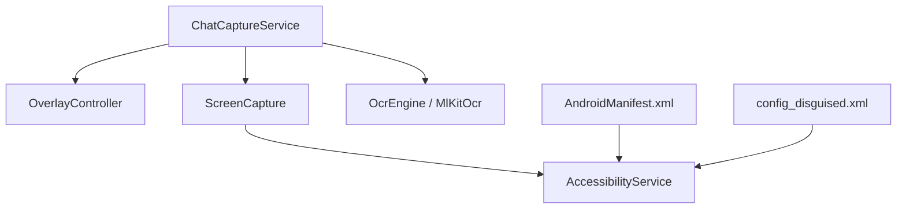

**Diagram sources**
- [ChatCaptureService.kt:188-195](file://app/src/main/java/com/jev/probe/capture/ChatCaptureService.kt#L188-L195)
- [ScreenCapture.kt:35-39](file://app/src/main/java/com/jev/probe/capture/ocr/ScreenCapture.kt#L35-L39)
- [OverlayController.kt:353-355](file://app/src/main/java/com/jev/probe/overlay/OverlayController.kt#L353-L355)
- [MlKitOcr.kt:26-35](file://app/src/main/java/com/jev/probe/capture/ocr/MlKitOcr.kt#L26-L35)
- [AndroidManifest.xml:38-48](file://app/src/main/AndroidManifest.xml#L38-L48)
- [config_disguised.xml:1-9](file://app/src/main/res/xml/config_disguised.xml#L1-L9)

**Section sources**
- [ScreenCapture.kt:14-34](file://app/src/main/java/com/jev/probe/capture/ocr/ScreenCapture.kt#L14-L34)
- [ChatCaptureService.kt:188-195](file://app/src/main/java/com/jev/probe/capture/ChatCaptureService.kt#L188-L195)
- [AndroidManifest.xml:38-48](file://app/src/main/AndroidManifest.xml#L38-L48)
- [config_disguised.xml:1-9](file://app/src/main/res/xml/config_disguised.xml#L1-L9)

## Core Components
- `ScreenCapture`: One-shot screenshot controller. It hides the overlay, chooses between API 34+ window-specific capture and whole-display fallback, manages throttling and backoff, converts hardware buffers to bitmaps, and returns scaled coordinates plus origin offsets.
- `ChatCaptureService`: Main accessibility service. It detects conversations, falls back to OCR when the tree is empty, invokes `ScreenCapture`, and routes results to the overlay or analysis pipeline.
- `OverlayController`: Floating UI. It exposes `setHiddenForShot` so the bubble is invisible during capture but remains attached to the window hierarchy.
- `MlKitOcr`: OCR engine implementing `OcrEngine`. It crops bitmap regions, runs recognition, and transforms bounding boxes back to screen coordinates using scale factors and origin offsets provided by `ScreenCapture`.
- `OcrEngine`: Contract for OCR implementations.
- Configuration files: The manifest registers a disguised accessibility service; the XML config enables `canTakeScreenshot="true"`.

**Section sources**
- [ScreenCapture.kt:35-61](file://app/src/main/java/com/jev/probe/capture/ocr/ScreenCapture.kt#L35-L61)
- [ChatCaptureService.kt:188-195](file://app/src/main/java/com/jev/probe/capture/ChatCaptureService.kt#L188-L195)
- [OverlayController.kt:353-355](file://app/src/main/java/com/jev/probe/overlay/OverlayController.kt#L353-L355)
- [MlKitOcr.kt:26-35](file://app/src/main/java/com/jev/probe/capture/ocr/MlKitOcr.kt#L26-L35)
- [OcrEngine.kt:6-22](file://app/src/main/java/com/jev/probe/capture/ocr/OcrEngine.kt#L6-L22)
- [AndroidManifest.xml:38-48](file://app/src/main/AndroidManifest.xml#L38-L48)
- [config_disguised.xml:1-9](file://app/src/main/res/xml/config_disguised.xml#L1-L9)

## Architecture Overview
The OCR fallback flow starts when the accessibility service observes a chat window whose node tree contains no message text. Instead of giving up, it triggers a screenshot, recognizes text, and feeds the result into the normal analysis pipeline.

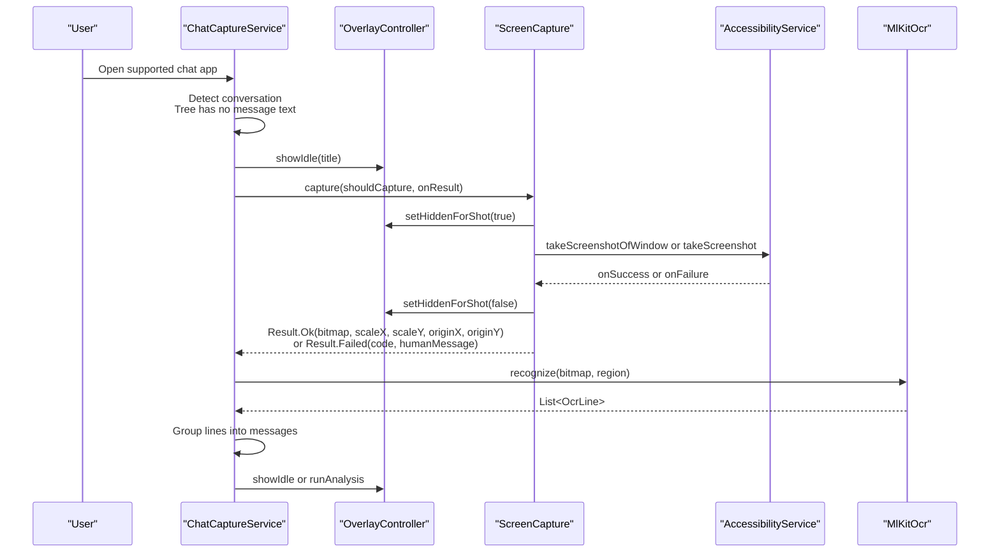

**Diagram sources**
- [ChatCaptureService.kt:305-327](file://app/src/main/java/com/jev/probe/capture/ChatCaptureService.kt#L305-L327)
- [ChatCaptureService.kt:548-587](file://app/src/main/java/com/jev/probe/capture/ChatCaptureService.kt#L548-L587)
- [ScreenCapture.kt:66-93](file://app/src/main/java/com/jev/probe/capture/ocr/ScreenCapture.kt#L66-L93)
- [ScreenCapture.kt:95-147](file://app/src/main/java/com/jev/probe/capture/ocr/ScreenCapture.kt#L95-L147)
- [OverlayController.kt:353-355](file://app/src/main/java/com/jev/probe/overlay/OverlayController.kt#L353-L355)
- [MlKitOcr.kt:39-95](file://app/src/main/java/com/jev/probe/capture/ocr/MlKitOcr.kt#L39-L95)

## Detailed Component Analysis

### ScreenCapture Class Architecture
`ScreenCapture` encapsulates one screenshot attempt. Its public contract is simple: call `capture` on the main thread and receive exactly one callback on the main thread with either a successful bitmap or a failure code plus a human-readable message. Internally, it coordinates three platform-sensitive concerns:

1. Hardware buffer lifecycle: The system returns a `HardwareBuffer`; it must be copied into an ARGB_8888 bitmap and closed immediately to avoid compositor starvation.
2. Throttling and backoff: The system may reject frequent screenshots; the class enforces a minimum interval and increases the required interval after repeated failures, capped at a maximum.
3. Overlay visibility: The floating panel would otherwise appear in the screenshot, so the caller provides hide and restore callbacks.

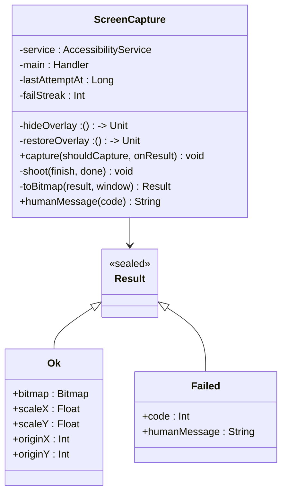

**Diagram sources**
- [ScreenCapture.kt:35-61](file://app/src/main/java/com/jev/probe/capture/ocr/ScreenCapture.kt#L35-L61)
- [ScreenCapture.kt:155-176](file://app/src/main/java/com/jev/probe/capture/ocr/ScreenCapture.kt#L155-L176)
- [ScreenCapture.kt:178-218](file://app/src/main/java/com/jev/probe/capture/ocr/ScreenCapture.kt#L178-L218)

#### Screenshot Capture Process
`capture` performs these steps:

1. Check throttling against the last attempt time and computed required interval.
2. Record the current timestamp as the latest attempt.
3. Wrap the final callback to ensure it runs once, restores the overlay, and updates the failure streak.
4. Hide the overlay, wait briefly for the compositor to drop the bubble, then verify the session is still valid before shooting.
5. Choose between API 34+ window-specific capture and whole-display fallback.
6. Set a timeout to recover if the system never calls back.
7. Convert the hardware buffer to a software bitmap and compute scale factors and origin offsets.

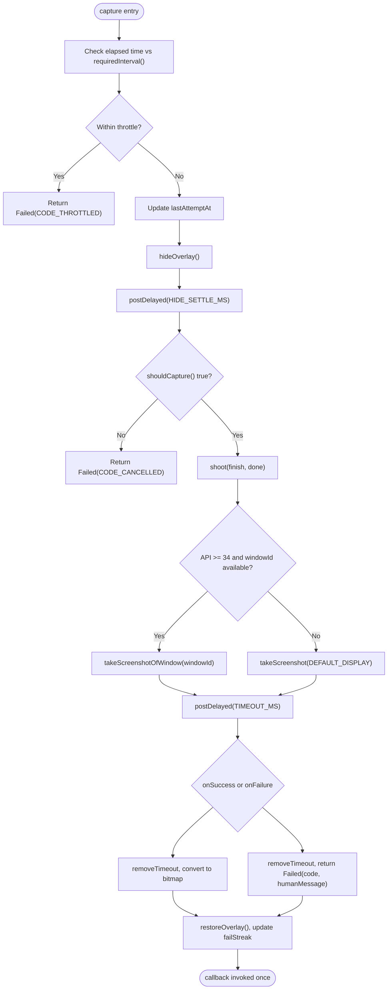

**Diagram sources**
- [ScreenCapture.kt:66-93](file://app/src/main/java/com/jev/probe/capture/ocr/ScreenCapture.kt#L66-L93)
- [ScreenCapture.kt:95-147](file://app/src/main/java/com/jev/probe/capture/ocr/ScreenCapture.kt#L95-L147)
- [ScreenCapture.kt:155-176](file://app/src/main/java/com/jev/probe/capture/ocr/ScreenCapture.kt#L155-L176)

#### API 34+ Window-Specific Capture Versus Whole-Display Fallback
On Android 14+, `ScreenCapture` tries to capture only the active window using `takeScreenshotOfWindow`. This is cheaper and sometimes required on OEM builds that refuse whole-display captures. If the window ID is unavailable or the method throws, it falls back to `takeScreenshot(Display.DEFAULT_DISPLAY)`.

When capturing a window, the code records the window bounds in screen coordinates. When capturing the whole display, the captured area equals the display size. This distinction is critical for coordinate transformation.

**Section sources**
- [ScreenCapture.kt:119-147](file://app/src/main/java/com/jev/probe/capture/ocr/ScreenCapture.kt#L119-L147)

#### Permission Handling System
Screenshot capture requires the accessibility service to declare `android:canTakeScreenshot="true"`. The application registers a disguised accessibility service in the manifest and points to the XML configuration where this flag is enabled. The comment in `ScreenCapture` also notes that changing this capability only takes effect after the user disables and re-enables the accessibility service.

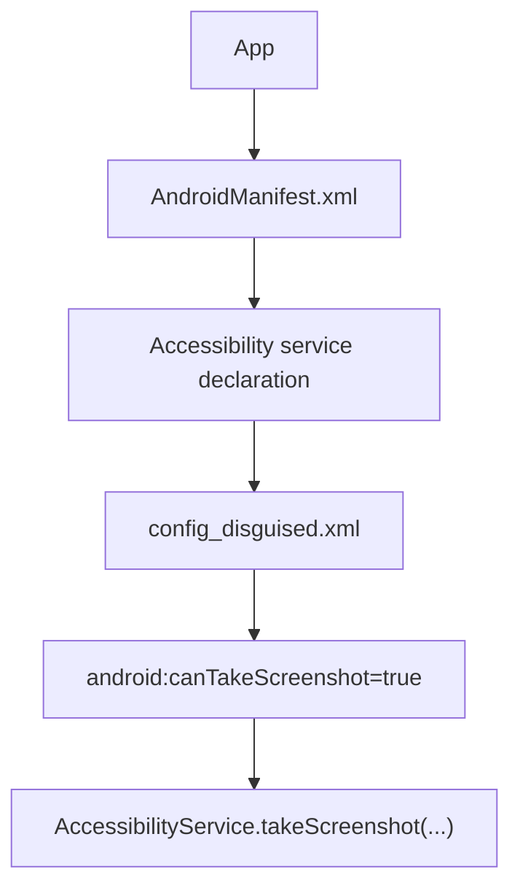

**Diagram sources**
- [AndroidManifest.xml:38-48](file://app/src/main/AndroidManifest.xml#L38-L48)
- [config_disguised.xml:1-9](file://app/src/main/res/xml/config_disguised.xml#L1-L9)
- [ScreenCapture.kt:14-18](file://app/src/main/java/com/jev/probe/capture/ocr/ScreenCapture.kt#L14-L18)

**Section sources**
- [AndroidManifest.xml:38-48](file://app/src/main/AndroidManifest.xml#L38-L48)
- [config_disguised.xml:1-9](file://app/src/main/res/xml/config_disguised.xml#L1-L9)
- [ScreenCapture.kt:14-18](file://app/src/main/java/com/jev/probe/capture/ocr/ScreenCapture.kt#L14-L18)

#### Throttling Mechanism
`ScreenCapture` prevents excessive screenshot attempts through two layers:

- Minimum interval: At least 1 second between attempts under normal conditions.
- Exponential backoff: After each failure, the required interval doubles until it reaches a maximum of 30 seconds. The failure streak resets only when a successful screenshot occurs.

This protects the system and the app from turning every content-changed event into a screenshot burst, especially for apps whose tree reads empty repeatedly.

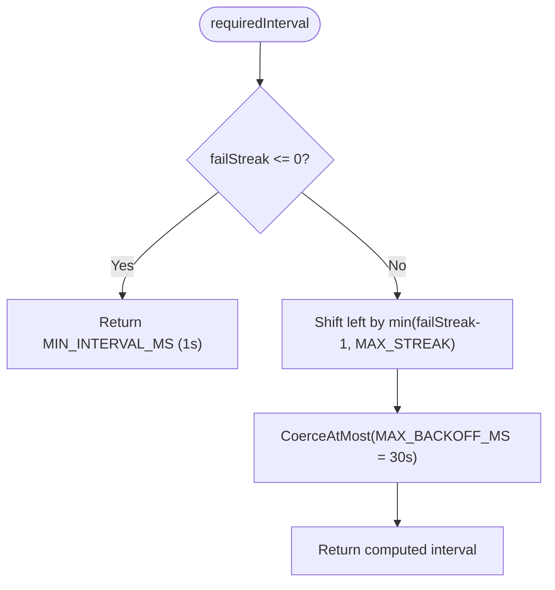

**Diagram sources**
- [ScreenCapture.kt:188-206](file://app/src/main/java/com/jev/probe/capture/ocr/ScreenCapture.kt#L188-L206)

**Section sources**
- [ScreenCapture.kt:188-206](file://app/src/main/java/com/jev/probe/capture/ocr/ScreenCapture.kt#L188-L206)

#### Overlay Hiding and Showing Lifecycle
To prevent the floating panel from appearing in screenshots, `ChatCaptureService` passes `OverlayController.setHiddenForShot(true)` before capture and `setHiddenForShot(false)` after completion. The overlay is set to `INVISIBLE`, not removed, so the window and its children survive the round trip.

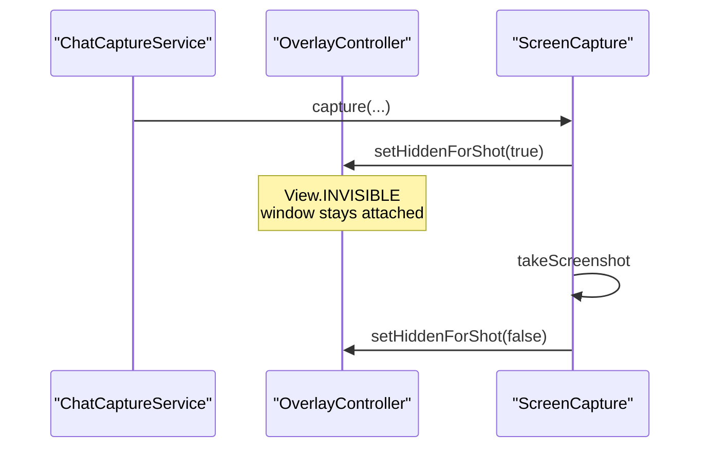

**Diagram sources**
- [ChatCaptureService.kt:190-194](file://app/src/main/java/com/jev/probe/capture/ChatCaptureService.kt#L190-L194)
- [OverlayController.kt:353-355](file://app/src/main/java/com/jev/probe/overlay/OverlayController.kt#L353-L355)
- [ScreenCapture.kt:76-92](file://app/src/main/java/com/jev/probe/capture/ocr/ScreenCapture.kt#L76-L92)

**Section sources**
- [ChatCaptureService.kt:190-194](file://app/src/main/java/com/jev/probe/capture/ChatCaptureService.kt#L190-L194)
- [OverlayController.kt:353-355](file://app/src/main/java/com/jev/probe/overlay/OverlayController.kt#L353-L355)
- [ScreenCapture.kt:76-92](file://app/src/main/java/com/jev/probe/capture/ocr/ScreenCapture.kt#L76-L92)

#### Error Handling for Protected Windows, Timeouts, and Internal Failures
`ScreenCapture` handles several error scenarios:

- Protected windows: Error code 6 indicates the window is invisible or protected (`FLAG_SECURE`). The human message tells the user that such screens cannot be captured.
- Timeouts: If the system never calls back, a watchdog timer fires and returns a timeout failure. This prevents the overlay from staying hidden and the caller from remaining busy indefinitely.
- Internal errors: Buffer conversion failures, invalid dimensions, or unexpected exceptions are wrapped as internal failures.
- Platform codes: Codes 1, 2, 3, 4, and 6 map to human-readable messages. Code 2 specifically instructs the user to toggle the accessibility service because the capability was not declared.

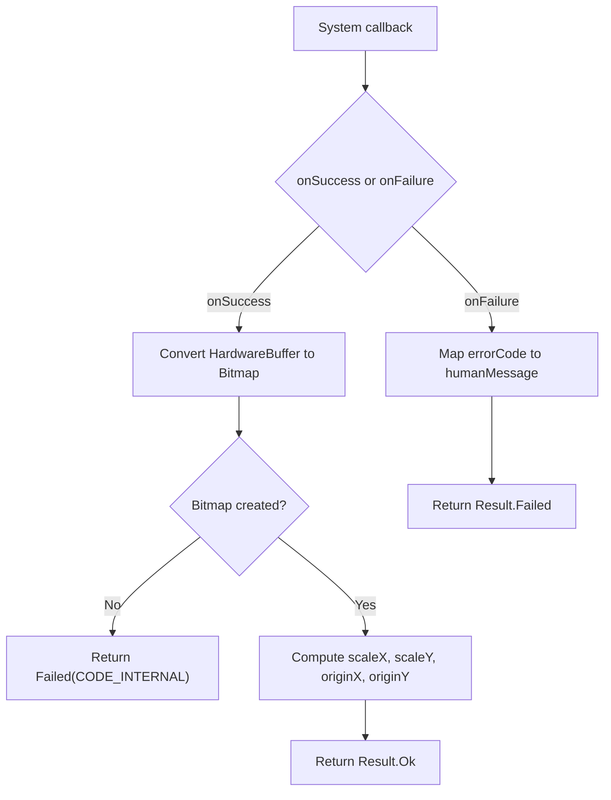

**Diagram sources**
- [ScreenCapture.kt:105-116](file://app/src/main/java/com/jev/probe/capture/ocr/ScreenCapture.kt#L105-L116)
- [ScreenCapture.kt:155-176](file://app/src/main/java/com/jev/probe/capture/ocr/ScreenCapture.kt#L155-L176)
- [ScreenCapture.kt:208-218](file://app/src/main/java/com/jev/probe/capture/ocr/ScreenCapture.kt#L208-L218)

**Section sources**
- [ScreenCapture.kt:105-116](file://app/src/main/java/com/jev/probe/capture/ocr/ScreenCapture.kt#L105-L116)
- [ScreenCapture.kt:155-176](file://app/src/main/java/com/jev/probe/capture/ocr/ScreenCapture.kt#L155-L176)
- [ScreenCapture.kt:208-218](file://app/src/main/java/com/jev/probe/capture/ocr/ScreenCapture.kt#L208-L218)

#### Hardware Buffer Memory Leak Prevention
The screenshot result arrives as a `HardwareBuffer`. `ScreenCapture` wraps it into a bitmap, copies it into an ARGB_8888 software bitmap, recycles the wrapper, and closes the original buffer in a `finally` block. This prevents leaking native compositor resources after repeated screenshots.

Additionally, `ChatCaptureService` ensures the returned bitmap is recycled after OCR processing, and `MlKitOcr` recycles temporary cropped bitmaps when necessary.

**Section sources**
- [ScreenCapture.kt:155-176](file://app/src/main/java/com/jev/probe/capture/ocr/ScreenCapture.kt#L155-L176)
- [ChatCaptureService.kt:601-608](file://app/src/main/java/com/jev/probe/capture/ChatCaptureService.kt#L601-L608)
- [ChatCaptureService.kt:614-622](file://app/src/main/java/com/jev/probe/capture/ChatCaptureService.kt#L614-L622)
- [MlKitOcr.kt:44-58](file://app/src/main/java/com/jev/probe/capture/ocr/MlKitOcr.kt#L44-L58)
- [MlKitOcr.kt:86-94](file://app/src/main/java/com/jev/probe/capture/ocr/MlKitOcr.kt#L86-L94)

#### Coordinate Transformation System
`ScreenCapture.Result.Ok` carries four mapping fields:

- `scaleX` and `scaleY`: bitmap size divided by captured area size.
- `originX` and `originY`: where the captured area starts on the screen.

For a window shot, the captured area may be smaller than the display and offset from `(0,0)`. For a whole-display fallback, the origin is `(0,0)` and the size equals the display metrics.

`ChatCaptureService` uses these values to transform node rectangle coordinates into bitmap coordinates before passing them to OCR. `MlKitOcr` then reverses the transformation: it adds crop offsets, divides by scale factors, and adds the origin to produce screen coordinates.

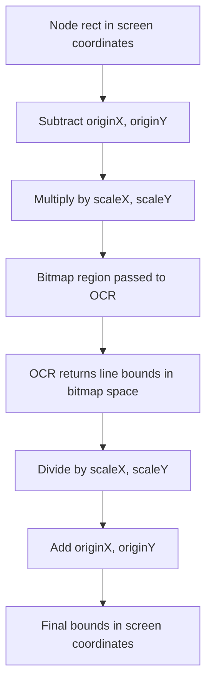

**Diagram sources**
- [ScreenCapture.kt:42-59](file://app/src/main/java/com/jev/probe/capture/ocr/ScreenCapture.kt#L42-L59)
- [ScreenCapture.kt:164-169](file://app/src/main/java/com/jev/probe/capture/ocr/ScreenCapture.kt#L164-L169)
- [ChatCaptureService.kt:590-611](file://app/src/main/java/com/jev/probe/capture/ChatCaptureService.kt#L590-L611)
- [MlKitOcr.kt:60-84](file://app/src/main/java/com/jev/probe/capture/ocr/MlKitOcr.kt#L60-L84)

**Section sources**
- [ScreenCapture.kt:42-59](file://app/src/main/java/com/jev/probe/capture/ocr/ScreenCapture.kt#L42-L59)
- [ScreenCapture.kt:164-169](file://app/src/main/java/com/jev/probe/capture/ocr/ScreenCapture.kt#L164-L169)
- [ChatCaptureService.kt:590-611](file://app/src/main/java/com/jev/probe/capture/ChatCaptureService.kt#L590-L611)
- [MlKitOcr.kt:60-84](file://app/src/main/java/com/jev/probe/capture/ocr/MlKitOcr.kt#L60-L84)

### Integration with ChatCaptureService
`ChatCaptureService` creates `ScreenCapture` lazily and wires the overlay hide/restore callbacks. When a conversation snapshot has no messages, it computes an OCR signature based on package, title, and bubble rectangles. If the signature differs from the previous one and OCR is not already busy, it triggers `ocrCapture`.

After `ScreenCapture` returns:

- On failure, it clears the OCR signature for automatic retries unless the failure is transient.
- On success, it sets `scaleX`, `scaleY`, `originX`, and `originY` on the OCR engine.
- If known bubble rectangles exist, it recognizes each region separately.
- Otherwise, it recognizes the whole screen minus top and bottom crop areas.
- Recognized lines are grouped into pseudo-bubbles and fed into the normal analysis pipeline.

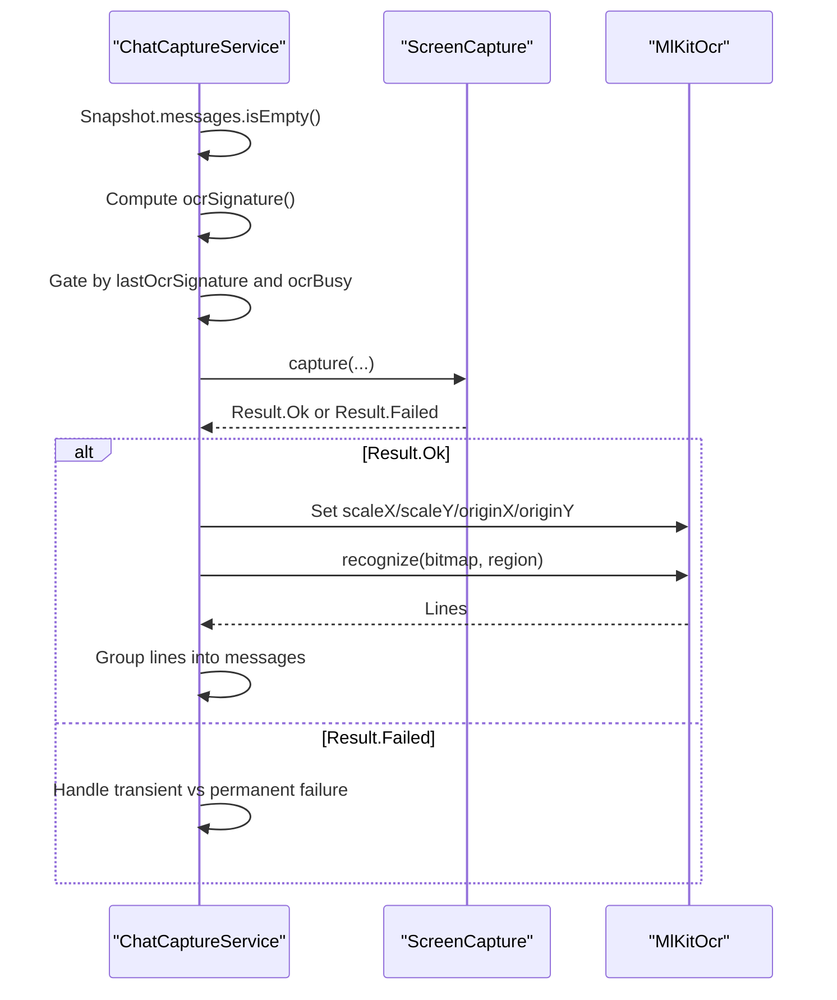

**Diagram sources**
- [ChatCaptureService.kt:305-327](file://app/src/main/java/com/jev/probe/capture/ChatCaptureService.kt#L305-L327)
- [ChatCaptureService.kt:548-587](file://app/src/main/java/com/jev/probe/capture/ChatCaptureService.kt#L548-L587)
- [ChatCaptureService.kt:589-623](file://app/src/main/java/com/jev/probe/capture/ChatCaptureService.kt#L589-L623)

**Section sources**
- [ChatCaptureService.kt:188-195](file://app/src/main/java/com/jev/probe/capture/ChatCaptureService.kt#L188-L195)
- [ChatCaptureService.kt:305-327](file://app/src/main/java/com/jev/probe/capture/ChatCaptureService.kt#L305-L327)
- [ChatCaptureService.kt:548-623](file://app/src/main/java/com/jev/probe/capture/ChatCaptureService.kt#L548-L623)

### Usage Patterns
Common usage patterns include:

- Automatic OCR fallback: Triggered when a recognized chat window has no message text in the accessibility tree.
- Manual OCR capture: Triggered by the overlay menu “截图识别一次”. It works on any foreground app, even if the tree cannot be read.
- Region-aware OCR: When bubble rectangles are known, OCR is performed per bubble to preserve sender side information.
- Whole-screen OCR: Used for manual captures or unknown apps; lines are grouped by vertical gaps and labeled as coming from the other person.

These patterns are implemented in `ChatCaptureService` and rely on `ScreenCapture` for safe, throttled, and correctly mapped screenshots.

**Section sources**
- [ChatCaptureService.kt:465-499](file://app/src/main/java/com/jev/probe/capture/ChatCaptureService.kt#L465-L499)
- [ChatCaptureService.kt:589-623](file://app/src/main/java/com/jev/probe/capture/ChatCaptureService.kt#L589-L623)

## Dependency Analysis
The screen capture subsystem has clear boundaries:

- `ChatCaptureService` depends on `ScreenCapture` and `OverlayController`.
- `ScreenCapture` depends on `AccessibilityService` and the Android platform APIs.
- `ChatCaptureService` depends on `MlKitOcr`, which implements `OcrEngine`.
- Configuration flows from `AndroidManifest.xml` to `config_disguised.xml`.

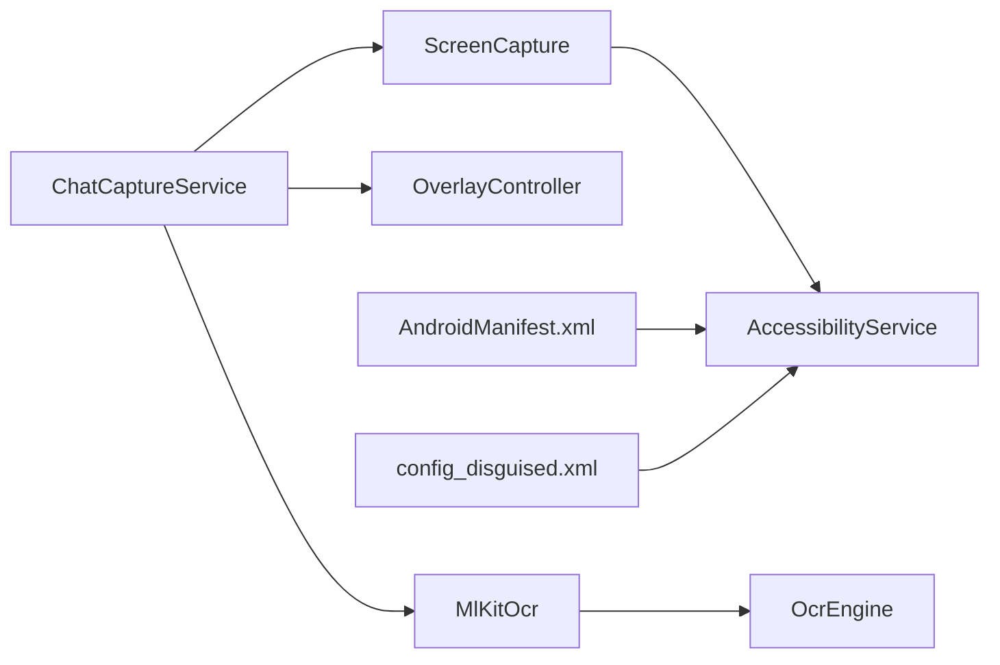

**Diagram sources**
- [ChatCaptureService.kt:188-195](file://app/src/main/java/com/jev/probe/capture/ChatCaptureService.kt#L188-L195)
- [ScreenCapture.kt:35-39](file://app/src/main/java/com/jev/probe/capture/ocr/ScreenCapture.kt#L35-L39)
- [MlKitOcr.kt:26-35](file://app/src/main/java/com/jev/probe/capture/ocr/MlKitOcr.kt#L26-L35)
- [OcrEngine.kt:20-22](file://app/src/main/java/com/jev/probe/capture/ocr/OcrEngine.kt#L20-L22)
- [AndroidManifest.xml:38-48](file://app/src/main/AndroidManifest.xml#L38-L48)
- [config_disguised.xml:1-9](file://app/src/main/res/xml/config_disguised.xml#L1-L9)

**Section sources**
- [ChatCaptureService.kt:188-195](file://app/src/main/java/com/jev/probe/capture/ChatCaptureService.kt#L188-L195)
- [ScreenCapture.kt:35-39](file://app/src/main/java/com/jev/probe/capture/ocr/ScreenCapture.kt#L35-L39)
- [MlKitOcr.kt:26-35](file://app/src/main/java/com/jev/probe/capture/ocr/MlKitOcr.kt#L26-L35)
- [OcrEngine.kt:20-22](file://app/src/main/java/com/jev/probe/capture/ocr/OcrEngine.kt#L20-L22)
- [AndroidManifest.xml:38-48](file://app/src/main/AndroidManifest.xml#L38-L48)
- [config_disguised.xml:1-9](file://app/src/main/res/xml/config_disguised.xml#L1-L9)

## Performance Considerations
- Prefer API 34+ window-specific capture when possible: it reduces the amount of pixel data processed and avoids capturing unrelated parts of the display.
- Use bubble-region OCR when rectangles are available: it limits OCR work to relevant message areas instead of scanning the entire screen.
- Keep the minimum screenshot interval at 1 second and allow exponential backoff up to 30 seconds to avoid overwhelming the system compositor.
- Always close hardware buffers and recycle bitmaps promptly to prevent memory pressure and compositor starvation.
- Warm up the OCR recognizer off the main thread so the first screenshot callback does not pay model-loading costs on the UI thread.

[No sources needed since this section provides general guidance]

## Troubleshooting Guide
Common issues and their meanings:

- “截屏太频繁”: The request was throttled internally or rejected by the platform due to too-frequent attempts. Wait and retry later.
- “截屏超时”: The system did not call back within the timeout window. This can happen during transitions or when landing on protected windows.
- “无障碍服务未声明截屏能力”: The accessibility service lacks `canTakeScreenshot="true"`. Toggle the service off and on after enabling it in the configuration.
- “间隔太短，等一秒再试”: The platform explicitly rejected the screenshot because it was too soon.
- “窗口不可见或受保护（FLAG_SECURE）”: The target window is protected and cannot be captured.
- Internal errors: Indicate problems converting the screenshot buffer or unexpected platform behavior.

Recommended actions:

1. Verify `android:canTakeScreenshot="true"` in the accessibility service configuration.
2. Restart the accessibility service after changing the configuration.
3. Avoid rapid repeated captures; rely on the built-in throttling and backoff.
4. If OCR fails but the screenshot succeeds, check whether the bitmap region is valid and whether the OCR engine is warmed up.
5. Monitor logs for protected-window cases and guide users accordingly.

**Section sources**
- [ScreenCapture.kt:208-218](file://app/src/main/java/com/jev/probe/capture/ocr/ScreenCapture.kt#L208-L218)
- [ChatCaptureService.kt:559-571](file://app/src/main/java/com/jev/probe/capture/ChatCaptureService.kt#L559-L571)

## Conclusion
`ScreenCapture` is a focused component that makes screenshot-based OCR reliable on Android despite platform restrictions. It abstracts away hardware buffer management, throttling, overlay visibility, API version differences, and coordinate mapping. `ChatCaptureService` integrates it into the broader accessibility-driven workflow, ensuring that unreadable chat trees can still be analyzed through OCR while keeping the system stable and the user experience predictable. Proper configuration of `canTakeScreenshot`, careful handling of protected windows, and disciplined resource cleanup are essential for robust operation.

[No sources needed since this section summarizes without analyzing specific files]