# Performance Optimization Strategies

<cite>
**Referenced Files in This Document**
- [ChatCaptureService.kt](file://app/src/main/java/com/jev/probe/capture/ChatCaptureService.kt)
- [ConversationSession.kt](file://app/src/main/java/com/jev/probe/capture/ConversationSession.kt)
- [ScreenCapture.kt](file://app/src/main/java/com/jev/probe/capture/ocr/ScreenCapture.kt)
- [MlKitOcr.kt](file://app/src/main/java/com/jev/probe/capture/ocr/MlKitOcr.kt)
- [CaptureRules.kt](file://app/src/main/java/com/jev/probe/capture/CaptureRules.kt)
</cite>

## Table of Contents
1. [Introduction](#introduction)
2. [Project Structure](#project-structure)
3. [Core Components](#core-components)
4. [Architecture Overview](#architecture-overview)
5. [Detailed Component Analysis](#detailed-component-analysis)
6. [Dependency Analysis](#dependency-analysis)
7. [Performance Considerations](#performance-considerations)
8. [Troubleshooting Guide](#troubleshooting-guide)
9. [Conclusion](#conclusion)

## Introduction
This document explains the performance optimization strategies used by the message capture system. It focuses on how bursts of accessibility events are debounced, how redundant analysis is avoided through signature-based deduplication, how background work is executed safely with a fixed-size thread pool, and how memory, battery, session state, OCR rate limiting, and failure backoff are handled. The goal is to make these optimizations understandable for both developers and product-oriented readers while preserving precise code-level references.

## Project Structure
The relevant performance-critical code lives under the capture package:
- ChatCaptureService orchestrates event handling, conversation sessions, overlay interaction, and background analysis.
- ConversationSession tracks active conversations and prevents stale callbacks.
- ScreenCapture manages screenshot acquisition, throttling, and backoff.
- MlKitOcr performs on-device text recognition efficiently.
- CaptureRules centralizes decision logic for manual operations and foreground exclusions.

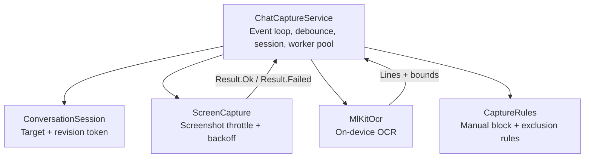

**Diagram sources**
- [ChatCaptureService.kt:43-170](file://app/src/main/java/com/jev/probe/capture/ChatCaptureService.kt#L43-L170)
- [ConversationSession.kt:4-35](file://app/src/main/java/com/jev/probe/capture/ConversationSession.kt#L4-L35)
- [ScreenCapture.kt:35-93](file://app/src/main/java/com/jev/probe/capture/ocr/ScreenCapture.kt#L35-L93)
- [MlKitOcr.kt:26-95](file://app/src/main/java/com/jev/probe/capture/ocr/MlKitOcr.kt#L26-L95)
- [CaptureRules.kt:12-56](file://app/src/main/java/com/jev/probe/capture/CaptureRules.kt#L12-L56)

**Section sources**
- [ChatCaptureService.kt:43-170](file://app/src/main/java/com/jev/probe/capture/ChatCaptureService.kt#L43-L170)
- [ConversationSession.kt:4-35](file://app/src/main/java/com/jev/probe/capture/ConversationSession.kt#L4-L35)
- [ScreenCapture.kt:35-93](file://app/src/main/java/com/jev/probe/capture/ocr/ScreenCapture.kt#L35-L93)
- [MlKitOcr.kt:26-95](file://app/src/main/java/com/jev/probe/capture/ocr/MlKitOcr.kt#L26-L95)
- [CaptureRules.kt:12-56](file://app/src/main/java/com/jev/probe/capture/CaptureRules.kt#L12-L56)

## Core Components
- Debouncing: A main-thread handler schedules analysis after a delay to collapse rapid content-changed events into one analysis pass.
- Signature-based deduplication: Both tree snapshots and OCR results compute a stable signature; identical signatures skip redundant analysis or UI updates.
- Worker thread pool: A fixed-size executor runs analysis tasks off the main thread, with graceful rejection handling during teardown.
- Memory management: Bitmaps from screenshots and cropped regions are explicitly recycled; hardware buffers are closed promptly.
- Battery optimization: Screenshot frequency is limited, OCR is gated, and expensive work is deferred or warmed up ahead of time.
- Session state: A lightweight target + revision token ensures only live requests proceed and stale work is abandoned.
- OCR rate limiting and backoff: Global throttling enforces a minimum interval and exponential backoff on repeated failures.

**Section sources**
- [ChatCaptureService.kt:45-59](file://app/src/main/java/com/jev/probe/capture/ChatCaptureService.kt#L45-L59)
- [ChatCaptureService.kt:178-180](file://app/src/main/java/com/jev/probe/capture/ChatCaptureService.kt#L178-L180)
- [ChatCaptureService.kt:331-359](file://app/src/main/java/com/jev/probe/capture/ChatCaptureService.kt#L331-L359)
- [ChatCaptureService.kt:548-622](file://app/src/main/java/com/jev/probe/capture/ChatCaptureService.kt#L548-L622)
- [ScreenCapture.kt:188-206](file://app/src/main/java/com/jev/probe/capture/ocr/ScreenCapture.kt#L188-L206)
- [MlKitOcr.kt:100-111](file://app/src/main/java/com/jev/probe/capture/ocr/MlKitOcr.kt#L100-L111)

## Architecture Overview
The capture pipeline connects accessibility events to either direct chat-app adapters or an OCR fallback path. All user-facing UI updates happen on the main thread, while heavy work runs on background executors.

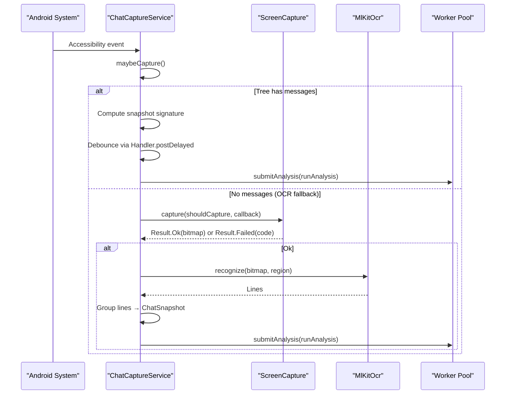

**Diagram sources**
- [ChatCaptureService.kt:239-359](file://app/src/main/java/com/jev/probe/capture/ChatCaptureService.kt#L239-L359)
- [ChatCaptureService.kt:389-455](file://app/src/main/java/com/jev/probe/capture/ChatCaptureService.kt#L389-L455)
- [ChatCaptureService.kt:548-622](file://app/src/main/java/com/jev/probe/capture/ChatCaptureService.kt#L548-L622)
- [ScreenCapture.kt:66-93](file://app/src/main/java/com/jev/probe/capture/ocr/ScreenCapture.kt#L66-L93)
- [MlKitOcr.kt:39-95](file://app/src/main/java/com/jev/probe/capture/ocr/MlKitOcr.kt#L39-L95)

## Detailed Component Analysis

### Debouncing Mechanism Using Handler.postDelayed
Rapid accessibility events can cause many captures. The service defers actual analysis by posting a Runnable to the main thread’s handler after a short delay. Before scheduling, it removes any pending debounce task so only the latest event triggers analysis.

Key behaviors:
- Collapses bursts of TYPE_WINDOW_CONTENT_CHANGED and related events.
- Ensures only one analysis per meaningful change window.
- Cancels previous pending work when the conversation changes.

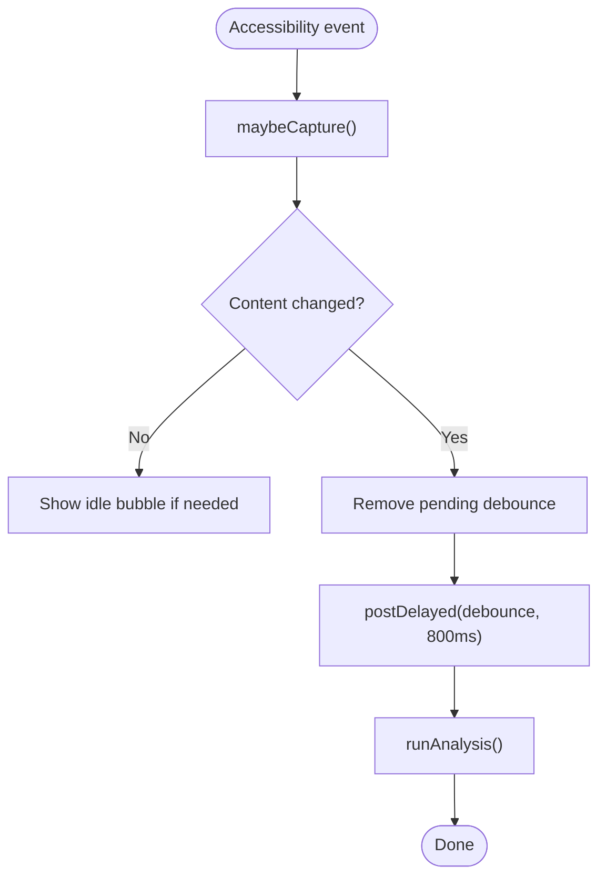

**Diagram sources**
- [ChatCaptureService.kt:357-359](file://app/src/main/java/com/jev/probe/capture/ChatCaptureService.kt#L357-L359)
- [ChatCaptureService.kt:389-455](file://app/src/main/java/com/jev/probe/capture/ChatCaptureService.kt#L389-L455)

**Section sources**
- [ChatCaptureService.kt:178-180](file://app/src/main/java/com/jev/probe/capture/ChatCaptureService.kt#L178-L180)
- [ChatCaptureService.kt:357-359](file://app/src/main/java/com/jev/probe/capture/ChatCaptureService.kt#L357-L359)
- [ChatCaptureService.kt:389-455](file://app/src/main/java/com/jev/probe/capture/ChatCaptureService.kt#L389-L455)

### Signature-Based Deduplication
To avoid redundant analysis when conversation content has not changed, the system computes signatures at two levels:
- Tree snapshot signature: Based on the current app package, title, and message list characteristics.
- OCR signature: Based on package, title, and bubble rectangle positions/sides; falls back to package+title when no rectangles are available.

Deduplication rules:
- If the same signature is detected and the overlay is already showing, skip re-analysis.
- If the same signature is detected but the overlay is gone, restore the idle bubble without re-analyzing.
- When switching apps, reset the signature to prevent cross-app false positives.

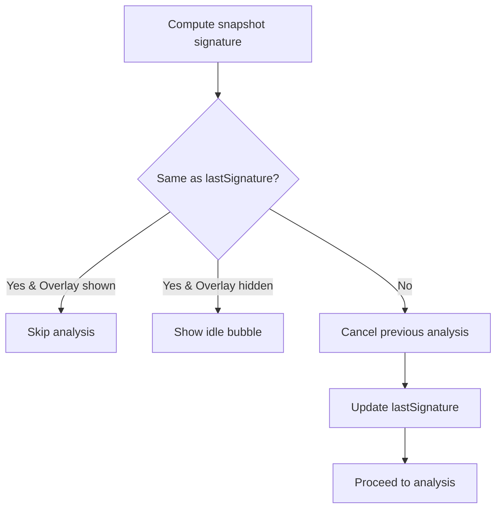

**Diagram sources**
- [ChatCaptureService.kt:331-349](file://app/src/main/java/com/jev/probe/capture/ChatCaptureService.kt#L331-L349)
- [ChatCaptureService.kt:680-691](file://app/src/main/java/com/jev/probe/capture/ChatCaptureService.kt#L680-L691)

**Section sources**
- [ChatCaptureService.kt:331-349](file://app/src/main/java/com/jev/probe/capture/ChatCaptureService.kt#L331-L349)
- [ChatCaptureService.kt:535-541](file://app/src/main/java/com/jev/probe/capture/ChatCaptureService.kt#L535-L541)
- [ChatCaptureService.kt:680-691](file://app/src/main/java/com/jev/probe/capture/ChatCaptureService.kt#L680-L691)

### Worker Thread Pool Configuration and Rejection Handling
Background analysis uses a fixed-size executor with two threads. Tasks are submitted via a helper that catches RejectedExecutionException, ensuring that teardown does not crash the process.

Important aspects:
- Fixed pool size limits concurrent analysis to two tasks.
- Stale overlay callbacks are ignored after service destruction.
- During onDestroy, the pool is shut down and all pending tasks are cancelled.

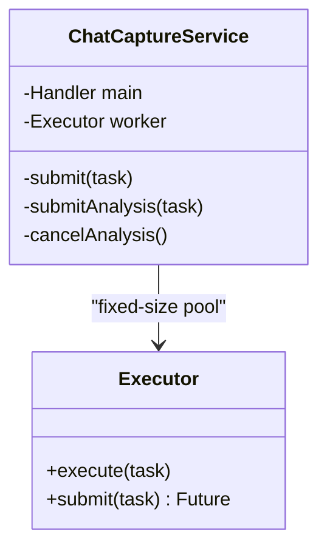

**Diagram sources**
- [ChatCaptureService.kt:45-59](file://app/src/main/java/com/jev/probe/capture/ChatCaptureService.kt#L45-L59)
- [ChatCaptureService.kt:169-171](file://app/src/main/java/com/jev/probe/capture/ChatCaptureService.kt#L169-L171)
- [ChatCaptureService.kt:79-87](file://app/src/main/java/com/jev/probe/capture/ChatCaptureService.kt#L79-L87)
- [ChatCaptureService.kt:800-814](file://app/src/main/java/com/jev/probe/capture/ChatCaptureService.kt#L800-L814)

**Section sources**
- [ChatCaptureService.kt:45-59](file://app/src/main/java/com/jev/probe/capture/ChatCaptureService.kt#L45-L59)
- [ChatCaptureService.kt:169-171](file://app/src/main/java/com/jev/probe/capture/ChatCaptureService.kt#L169-L171)
- [ChatCaptureService.kt:79-87](file://app/src/main/java/com/jev/probe/capture/ChatCaptureService.kt#L79-L87)
- [ChatCaptureService.kt:800-814](file://app/src/main/java/com/jev/probe/capture/ChatCaptureService.kt#L800-L814)

### Memory Management Strategies
- Bitmap recycling: After OCR completes, bitmaps are explicitly recycled to free native memory. Cropped bitmaps created for specific regions are also recycled promptly.
- Hardware buffer lifecycle: Screenshot results wrap a hardware buffer; the implementation copies it into a software bitmap and closes the buffer immediately to avoid compositor leaks.
- GC considerations: By minimizing long-lived large objects and closing resources in finally blocks, the system reduces pressure on the garbage collector and avoids out-of-memory conditions during repeated screenshots.

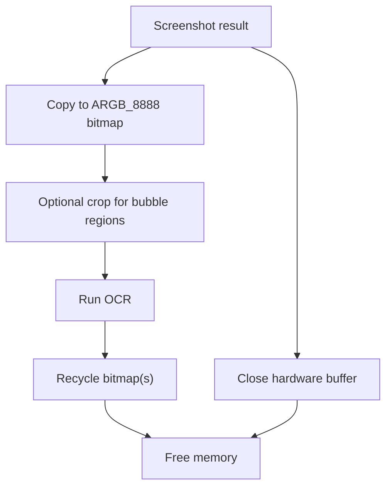

**Diagram sources**
- [ScreenCapture.kt:155-176](file://app/src/main/java/com/jev/probe/capture/ocr/ScreenCapture.kt#L155-L176)
- [ChatCaptureService.kt:605-607](file://app/src/main/java/com/jev/probe/capture/ChatCaptureService.kt#L605-L607)
- [ChatCaptureService.kt:617-618](file://app/src/main/java/com/jev/probe/capture/ChatCaptureService.kt#L617-L618)
- [MlKitOcr.kt:49-55](file://app/src/main/java/com/jev/probe/capture/ocr/MlKitOcr.kt#L49-L55)
- [MlKitOcr.kt:86-93](file://app/src/main/java/com/jev/probe/capture/ocr/MlKitOcr.kt#L86-L93)

**Section sources**
- [ScreenCapture.kt:155-176](file://app/src/main/java/com/jev/probe/capture/ocr/ScreenCapture.kt#L155-L176)
- [ChatCaptureService.kt:605-607](file://app/src/main/java/com/jev/probe/capture/ChatCaptureService.kt#L605-L607)
- [ChatCaptureService.kt:617-618](file://app/src/main/java/com/jev/probe/capture/ChatCaptureService.kt#L617-L618)
- [MlKitOcr.kt:49-55](file://app/src/main/java/com/jev/probe/capture/ocr/MlKitOcr.kt#L49-L55)
- [MlKitOcr.kt:86-93](file://app/src/main/java/com/jev/probe/capture/ocr/MlKitOcr.kt#L86-L93)

### Battery Optimization Techniques
- Reducing screen capture frequency:
  - Global screenshot throttle enforces a minimum interval between attempts.
  - Exponential backoff increases intervals after repeated failures, capped at a maximum.
  - OCR fallback is gated by a signature check so repeated content-changed events do not trigger constant screenshots.
- Minimizing accessibility tree traversals:
  - Early exits when there is no adapter or no readable title.
  - Bounded traversal loops with guards when scanning nodes for debugging or input fields.
- Efficient notification/UI updates:
  - Only update the overlay when the signature changes or the bubble is missing.
  - Avoid unnecessary re-analysis when the same content is detected.

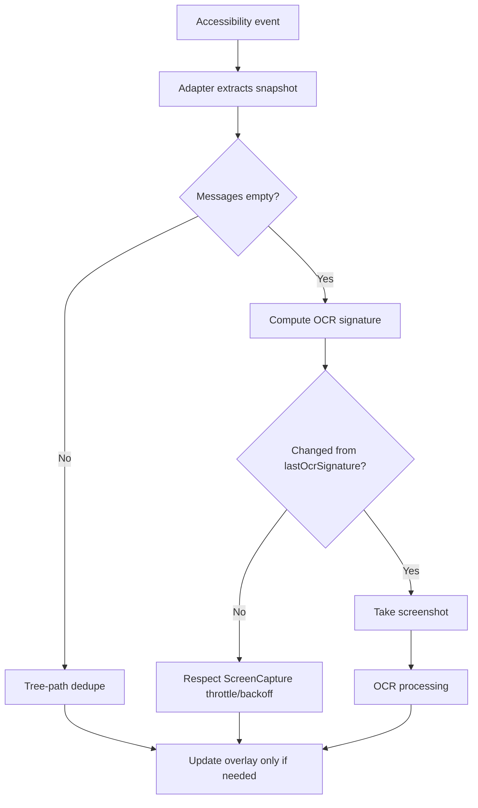

**Diagram sources**
- [ChatCaptureService.kt:308-327](file://app/src/main/java/com/jev/probe/capture/ChatCaptureService.kt#L308-L327)
- [ChatCaptureService.kt:331-359](file://app/src/main/java/com/jev/probe/capture/ChatCaptureService.kt#L331-L359)
- [ScreenCapture.kt:66-93](file://app/src/main/java/com/jev/probe/capture/ocr/ScreenCapture.kt#L66-L93)
- [ScreenCapture.kt:188-206](file://app/src/main/java/com/jev/probe/capture/ocr/ScreenCapture.kt#L188-L206)

**Section sources**
- [ChatCaptureService.kt:308-327](file://app/src/main/java/com/jev/probe/capture/ChatCaptureService.kt#L308-L327)
- [ChatCaptureService.kt:331-359](file://app/src/main/java/com/jev/probe/capture/ChatCaptureService.kt#L331-L359)
- [ScreenCapture.kt:66-93](file://app/src/main/java/com/jev/probe/capture/ocr/ScreenCapture.kt#L66-L93)
- [ScreenCapture.kt:188-206](file://app/src/main/java/com/jev/probe/capture/ocr/ScreenCapture.kt#L188-L206)

### Conversation Session State Management
A lightweight session object tracks the active conversation target and revision number. Tokens carry the target plus a revision; checks ensure only live tokens proceed. When the target changes or the service is torn down, old tasks are invalidated and UI state is reset.

Benefits:
- Prevents stale analysis after app switching.
- Avoids resource leaks by cancelling pending work and clearing overlays.
- Supports both automatic and manual capture paths with appropriate liveness rules.

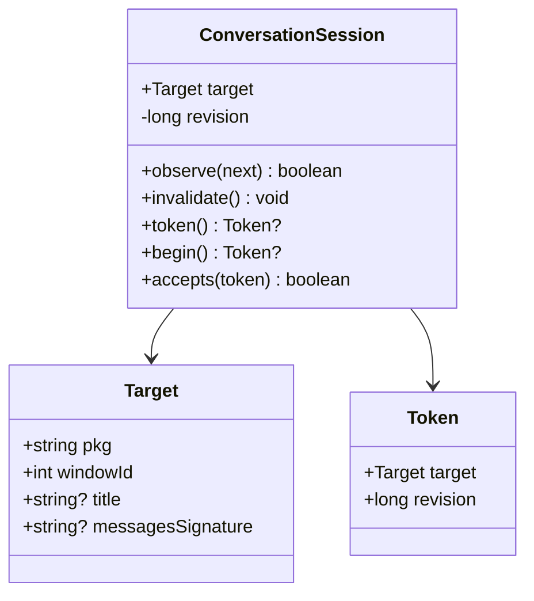

**Diagram sources**
- [ConversationSession.kt:4-35](file://app/src/main/java/com/jev/probe/capture/ConversationSession.kt#L4-L35)
- [ChatCaptureService.kt:63-68](file://app/src/main/java/com/jev/probe/capture/ChatCaptureService.kt#L63-L68)
- [ChatCaptureService.kt:89-104](file://app/src/main/java/com/jev/probe/capture/ChatCaptureService.kt#L89-L104)
- [ChatCaptureService.kt:389-455](file://app/src/main/java/com/jev/probe/capture/ChatCaptureService.kt#L389-L455)

**Section sources**
- [ConversationSession.kt:4-35](file://app/src/main/java/com/jev/probe/capture/ConversationSession.kt#L4-L35)
- [ChatCaptureService.kt:63-68](file://app/src/main/java/com/jev/probe/capture/ChatCaptureService.kt#L63-L68)
- [ChatCaptureService.kt:89-104](file://app/src/main/java/com/jev/probe/capture/ChatCaptureService.kt#L89-L104)
- [ChatCaptureService.kt:389-455](file://app/src/main/java/com/jev/probe/capture/ChatCaptureService.kt#L389-L455)

### Rate Limiting Mechanisms for OCR Operations
- Per-capture gating:
  - Manual OCR is blocked while another OCR is in flight.
  - Automatic OCR is gated by a signature comparison to avoid repeated shots when the visible bubbles have not moved.
- Global throttling and backoff:
  - Minimum interval between screenshot attempts.
  - Exponential backoff on consecutive failures, capped at a maximum interval.
- Timeout protection:
  - A watchdog cancels stalled screenshot callbacks to avoid hanging states.

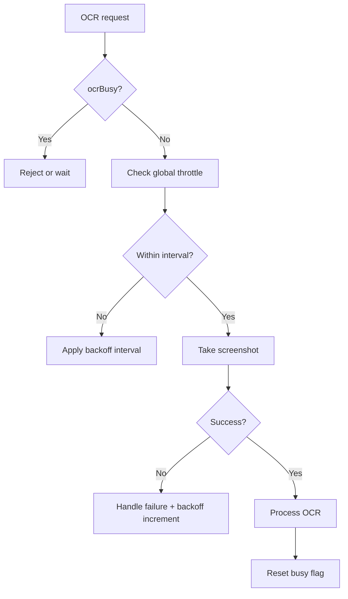

**Diagram sources**
- [ChatCaptureService.kt:465-499](file://app/src/main/java/com/jev/probe/capture/ChatCaptureService.kt#L465-L499)
- [ChatCaptureService.kt:548-587](file://app/src/main/java/com/jev/probe/capture/ChatCaptureService.kt#L548-L587)
- [ScreenCapture.kt:66-93](file://app/src/main/java/com/jev/probe/capture/ocr/ScreenCapture.kt#L66-L93)
- [ScreenCapture.kt:188-206](file://app/src/main/java/com/jev/probe/capture/ocr/ScreenCapture.kt#L188-L206)

**Section sources**
- [ChatCaptureService.kt:465-499](file://app/src/main/java/com/jev/probe/capture/ChatCaptureService.kt#L465-L499)
- [ChatCaptureService.kt:548-587](file://app/src/main/java/com/jev/probe/capture/ChatCaptureService.kt#L548-L587)
- [ScreenCapture.kt:66-93](file://app/src/main/java/com/jev/probe/capture/ocr/ScreenCapture.kt#L66-L93)
- [ScreenCapture.kt:188-206](file://app/src/main/java/com/jev/probe/capture/ocr/ScreenCapture.kt#L188-L206)

### Backoff Strategies for Failed Screenshot Attempts
When screenshots fail repeatedly, the system increases the required interval exponentially until it reaches a cap. Successful screenshots reset the streak. This prevents continuous retries on protected windows or unsupported configurations.

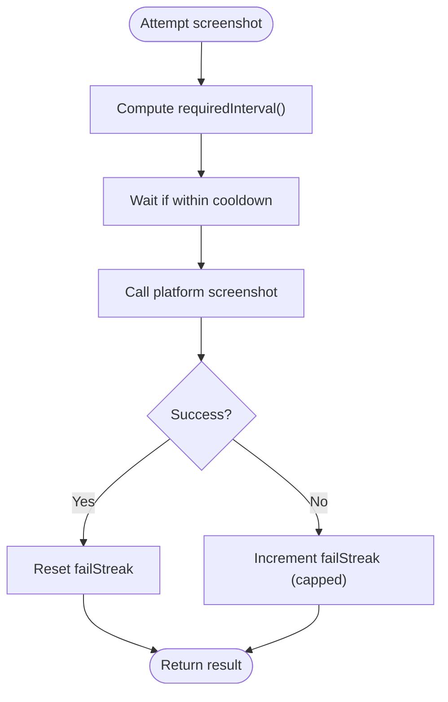

**Diagram sources**
- [ScreenCapture.kt:66-93](file://app/src/main/java/com/jev/probe/capture/ocr/ScreenCapture.kt#L66-L93)
- [ScreenCapture.kt:188-206](file://app/src/main/java/com/jev/probe/capture/ocr/ScreenCapture.kt#L188-L206)

**Section sources**
- [ScreenCapture.kt:66-93](file://app/src/main/java/com/jev/probe/capture/ocr/ScreenCapture.kt#L66-L93)
- [ScreenCapture.kt:188-206](file://app/src/main/java/com/jev/probe/capture/ocr/ScreenCapture.kt#L188-L206)

## Dependency Analysis
The capture service depends on several components:
- ConversationSession for stateful tracking.
- ScreenCapture for safe, throttled screenshots.
- MlKitOcr for efficient on-device text recognition.
- CaptureRules for consistent decision-making around manual operations and foreground exclusions.

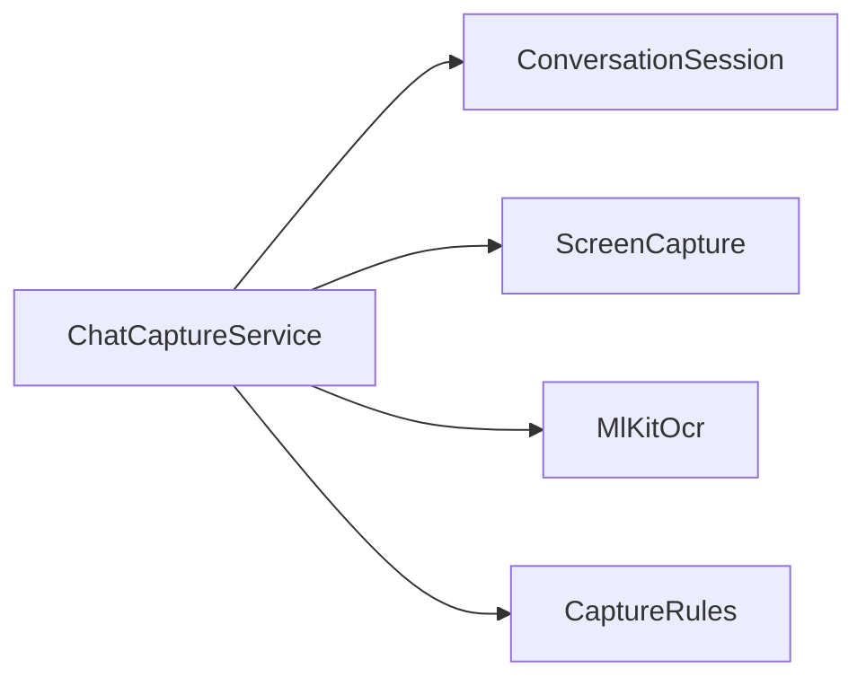

**Diagram sources**
- [ChatCaptureService.kt:43-170](file://app/src/main/java/com/jev/probe/capture/ChatCaptureService.kt#L43-L170)
- [ConversationSession.kt:4-35](file://app/src/main/java/com/jev/probe/capture/ConversationSession.kt#L4-L35)
- [ScreenCapture.kt:35-93](file://app/src/main/java/com/jev/probe/capture/ocr/ScreenCapture.kt#L35-L93)
- [MlKitOcr.kt:26-95](file://app/src/main/java/com/jev/probe/capture/ocr/MlKitOcr.kt#L26-L95)
- [CaptureRules.kt:12-56](file://app/src/main/java/com/jev/probe/capture/CaptureRules.kt#L12-L56)

**Section sources**
- [ChatCaptureService.kt:43-170](file://app/src/main/java/com/jev/probe/capture/ChatCaptureService.kt#L43-L170)
- [ConversationSession.kt:4-35](file://app/src/main/java/com/jev/probe/capture/ConversationSession.kt#L4-L35)
- [ScreenCapture.kt:35-93](file://app/src/main/java/com/jev/probe/capture/ocr/ScreenCapture.kt#L35-L93)
- [MlKitOcr.kt:26-95](file://app/src/main/java/com/jev/probe/capture/ocr/MlKitOcr.kt#L26-L95)
- [CaptureRules.kt:12-56](file://app/src/main/java/com/jev/probe/capture/CaptureRules.kt#L12-L56)

## Performance Considerations
- Prefer tree-based extraction over OCR whenever possible to avoid screenshots and OCR costs.
- Keep the overlay idle when content has not changed to reduce UI churn.
- Warm up the OCR recognizer early to avoid first-use latency on the main thread.
- Use bounded traversals and guards when walking the accessibility tree to prevent excessive CPU usage.
- Ensure all large bitmaps and hardware buffers are released promptly to minimize memory pressure.

[No sources needed since this section provides general guidance]

## Troubleshooting Guide
Common issues and their likely causes:
- Screenshot too frequent: The system throttles repeated attempts; wait for the backoff interval to expire.
- Protected window: Some screens cannot be captured; the error message indicates the condition.
- Service not allowed to screenshot: Requires enabling the accessibility service’s screenshot capability and toggling it off/on.
- Stale overlay callbacks: The service clears overlay callbacks during teardown to avoid crashes.

Relevant diagnostics:
- Manual analyze blocked reasons are centralized and surfaced to users.
- Foreground exclusions prevent capturing launcher/system UI.
- Debug logs include node id inventories (without sensitive text) to help diagnose adapter mismatches.

**Section sources**
- [ScreenCapture.kt:208-218](file://app/src/main/java/com/jev/probe/capture/ocr/ScreenCapture.kt#L208-L218)
- [CaptureRules.kt:19-25](file://app/src/main/java/com/jev/probe/capture/CaptureRules.kt#L19-L25)
- [CaptureRules.kt:32-38](file://app/src/main/java/com/jev/probe/capture/CaptureRules.kt#L32-L38)
- [CaptureRules.kt:48-56](file://app/src/main/java/com/jev/probe/capture/CaptureRules.kt#L48-L56)
- [ChatCaptureService.kt:800-814](file://app/src/main/java/com/jev/probe/capture/ChatCaptureService.kt#L800-L814)

## Conclusion
The message capture system employs a layered set of performance optimizations: debouncing bursts of events, deduplicating based on stable signatures, running analysis on a bounded worker pool, carefully managing memory, and applying aggressive throttling and backoff to screenshots. Session state ensures that only live requests proceed, preventing resource leaks during app switches. Together, these strategies keep the system responsive, battery-friendly, and robust across diverse Android environments.

[No sources needed since this section summarizes without analyzing specific files]