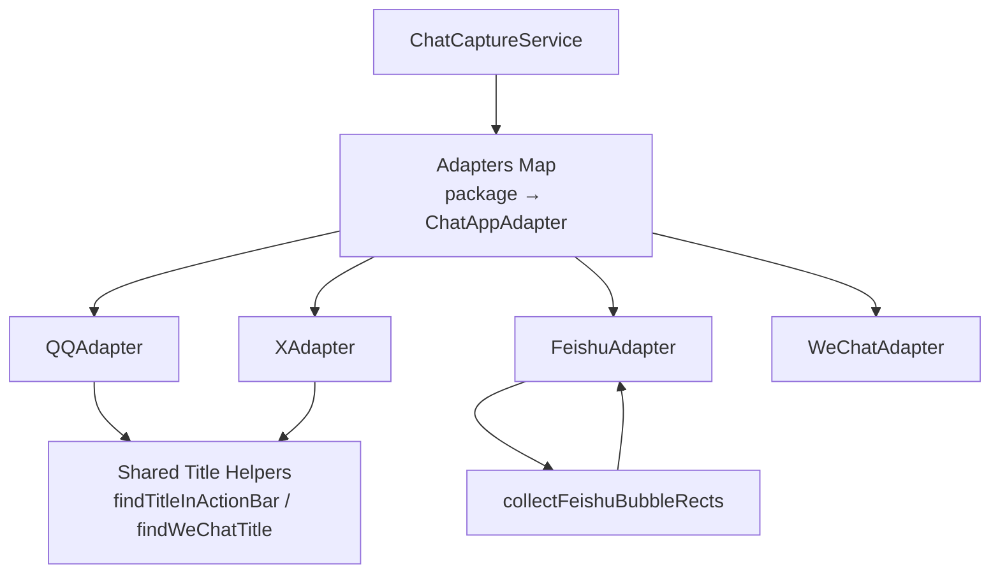
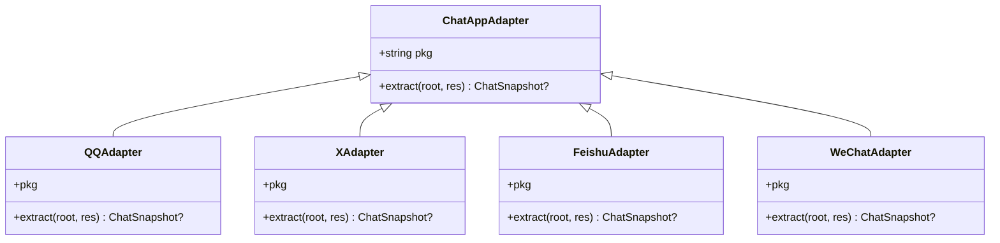
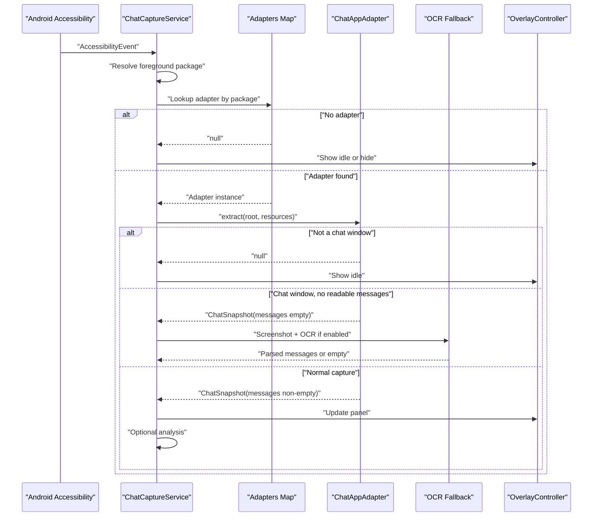
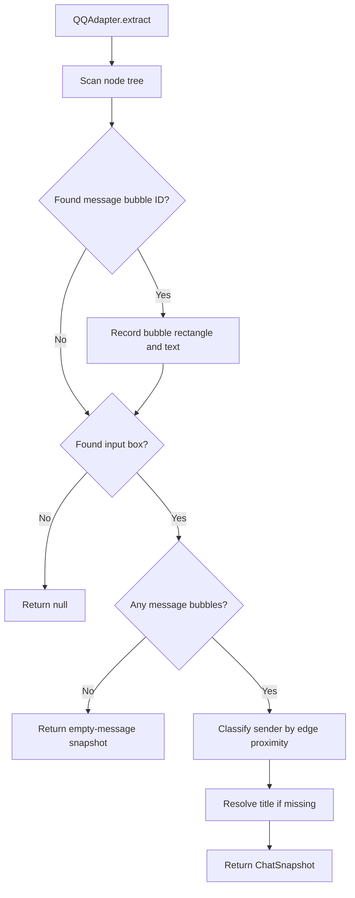
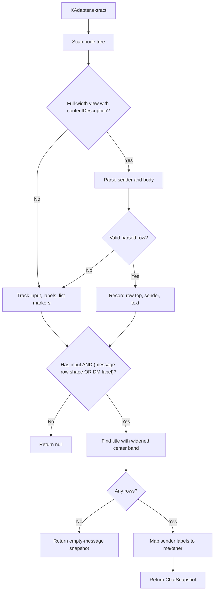
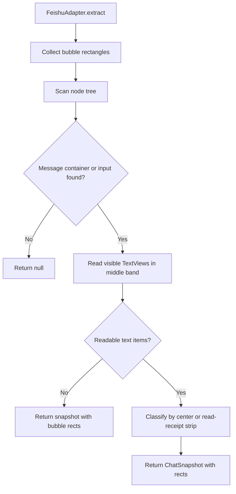
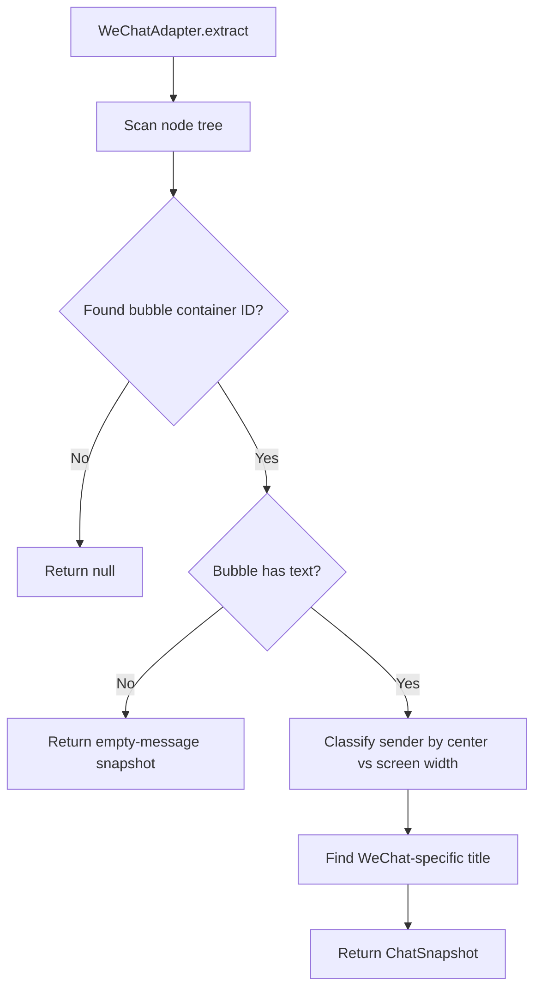
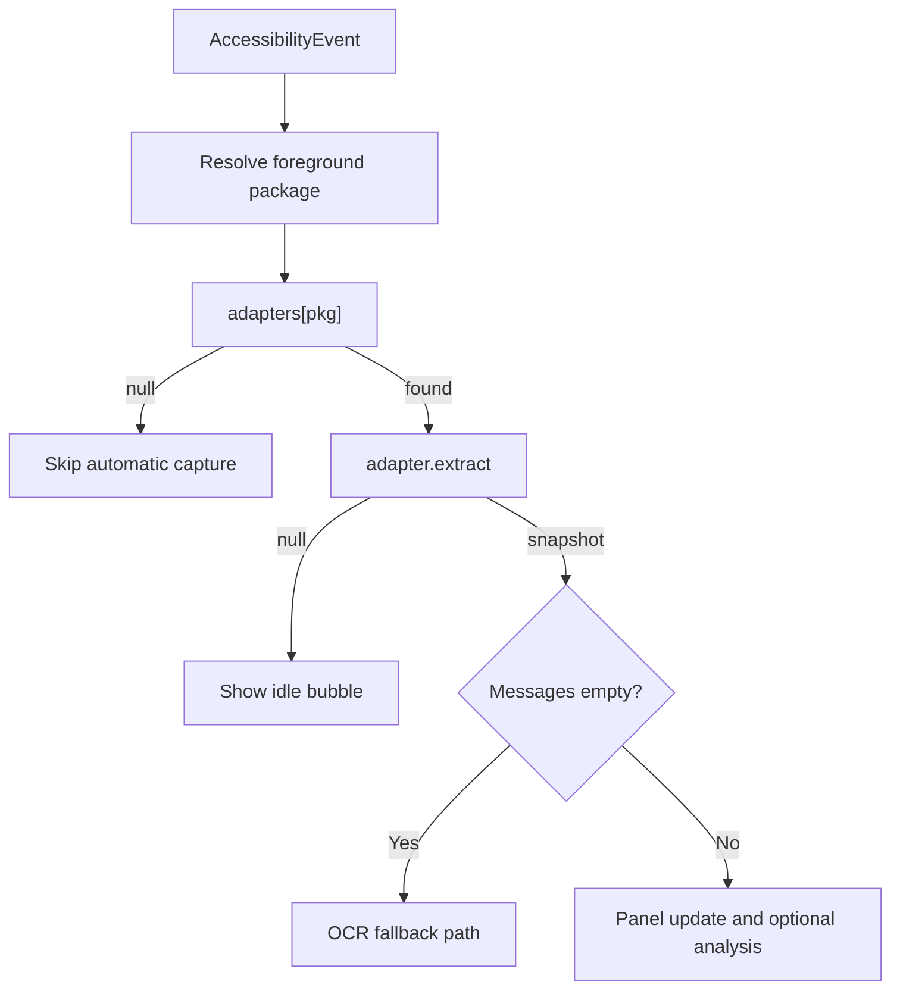
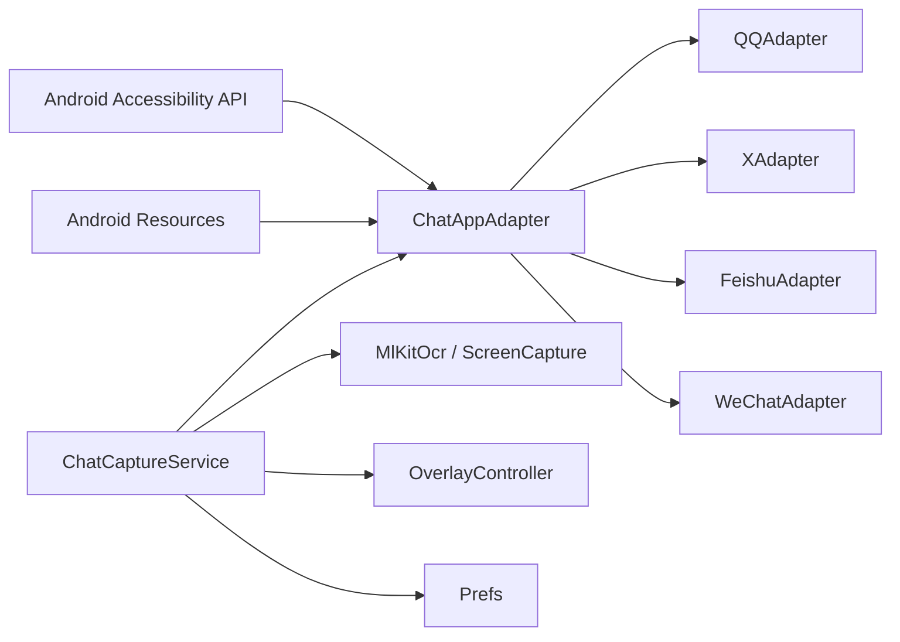

# Platform Adapters

<cite>
**Referenced Files in This Document**
- [ChatAppAdapter.kt](file://app/src/main/java/com/jev/probe/capture/ChatAppAdapter.kt)
- [ChatCaptureService.kt](file://app/src/main/java/com/jev/probe/capture/ChatCaptureService.kt)
- [CaptureRulesTest.kt](file://app/test/java/com/jev/probe/capture/CaptureRulesTest.kt)
</cite>

## Table of Contents
1. [Introduction](#introduction)
2. [Project Structure](#project-structure)
3. [Core Components](#core-components)
4. [Architecture Overview](#architecture-overview)
5. [Detailed Component Analysis](#detailed-component-analysis)
6. [Dependency Analysis](#dependency-analysis)
7. [Performance Considerations](#performance-considerations)
8. [Troubleshooting Guide](#troubleshooting-guide)
9. [Conclusion](#conclusion)
10. [Appendices](#appendices)

## Introduction
This document explains the platform adapters sub-component that lets the capture service support multiple chat applications through a single abstraction. The design centers on the `ChatAppAdapter` interface: each supported app provides an adapter that turns its accessibility node tree into a neutral `ChatSnapshot`. The service then dispatches to the correct adapter based on the foreground application package name, runs OCR fallback when needed, and drives the overlay UI without knowing anything about the underlying chat app.

The current implementation includes four platform-specific adapters:
- QQ: uses stable resource IDs for message bubbles and input fields.
- X/Twitter: parses Compose message rows from `contentDescription`.
- Feishu/Lark: extracts bubble rectangles and relies on OCR because message text is drawn rather than exposed as views.
- WeChat: reads disguised accessibility nodes and falls back to OCR when text is stripped.

## Project Structure
The platform adapters live under the capture module alongside the service that owns them:
- `ChatAppAdapter.kt` defines the adapter interface, shared title helpers, and all platform-specific adapters.
- `ChatCaptureService.kt` registers adapters, selects the active one by package name, orchestrates capture, OCR, analysis, and overlay state.
- `CaptureRulesTest.kt` contains tests for foreground exclusion rules used by the service.

**Diagram sources**
- [ChatCaptureService.kt:48-53](file://app/src/main/java/com/jev/probe/capture/ChatCaptureService.kt#L48-L53)
- [ChatAppAdapter.kt:27-30](file://app/src/main/java/com/jev/probe/capture/ChatAppAdapter.kt#L27-L30)
- [ChatAppAdapter.kt:45-74](file://app/src/main/java/com/jev/probe/capture/ChatAppAdapter.kt#L45-L74)
- [ChatAppAdapter.kt:93-128](file://app/src/main/java/com/jev/probe/capture/ChatAppAdapter.kt#L93-L128)
- [ChatAppAdapter.kt:276-301](file://app/src/main/java/com/jev/probe/capture/ChatAppAdapter.kt#L276-L301)

**Section sources**
- [ChatAppAdapter.kt:1-30](file://app/src/main/java/com/jev/probe/capture/ChatAppAdapter.kt#L1-L30)
- [ChatCaptureService.kt:29-53](file://app/src/main/java/com/jev/probe/capture/ChatCaptureService.kt#L29-L53)

## Core Components
The adapter pattern is implemented around a small contract:
- Each adapter exposes its target package name.
- Each adapter implements `extract`, which receives the root accessibility node and Android resources.
- `extract` returns:
  - `null` when the current window is not a chat window.
  - A `ChatSnapshot` with no messages when the adapter recognizes a chat but cannot read message text.
  - A `ChatSnapshot` with messages when normal parsing succeeds.

This three-way contract lets the service distinguish “not a chat,” “chat but unreadable,” and “normal capture.” It also enables OCR fallback only when necessary.

**Diagram sources**
- [ChatAppAdapter.kt:27-30](file://app/src/main/java/com/jev/probe/capture/ChatAppAdapter.kt#L27-L30)
- [ChatAppAdapter.kt:139-179](file://app/src/main/java/com/jev/probe/capture/ChatAppAdapter.kt#L139-L179)
- [ChatAppAdapter.kt:197-247](file://app/src/main/java/com/jev/probe/capture/ChatAppAdapter.kt#L197-L247)
- [ChatAppAdapter.kt:319-376](file://app/src/main/java/com/jev/probe/capture/ChatAppAdapter.kt#L319-L376)
- [ChatAppAdapter.kt:440-510](file://app/src/main/java/com/jev/probe/capture/ChatAppAdapter.kt#L440-L510)

**Section sources**
- [ChatAppAdapter.kt:10-30](file://app/src/main/java/com/jev/probe/capture/ChatAppAdapter.kt#L10-L30)

## Architecture Overview
The service owns the adapter registry and dispatches based on the foreground package. The flow is:
1. An accessibility event indicates a possible change in the active window or content.
2. The service resolves the active window’s package name.
3. If the package has no registered adapter, automatic capture is skipped; the idle bubble may still be shown so manual OCR remains reachable.
4. If the package has an adapter, the service calls `adapter.extract`.
5. If extraction returns `null`, the session leaves the conversation unless it was manually held.
6. If extraction returns a snapshot with no messages, the service can trigger OCR fallback.
7. If extraction returns messages, the service deduplicates, updates the overlay, and optionally starts analysis.

**Diagram sources**
- [ChatCaptureService.kt:239-273](file://app/src/main/java/com/jev/probe/capture/ChatCaptureService.kt#L239-L273)
- [ChatCaptureService.kt:275-360](file://app/src/main/java/com/jev/probe/capture/ChatCaptureService.kt#L275-L360)
- [ChatCaptureService.kt:308-329](file://app/src/main/java/com/jev/probe/capture/ChatCaptureService.kt#L308-L329)

**Section sources**
- [ChatCaptureService.kt:239-360](file://app/src/main/java/com/jev/probe/capture/ChatCaptureService.kt#L239-L360)

## Detailed Component Analysis

### ChatAppAdapter Interface Design
The interface is intentionally minimal:
- `pkg`: identifies the target application package.
- `extract`: converts the app’s accessibility tree into a neutral snapshot.

The documentation comment describes the three-way return contract and notes that the disguised accessibility service allows reading node trees from apps like WeChat that otherwise obfuscate them. Shared helpers such as `findTitleInActionBar` and `findWeChatTitle` provide reusable title detection logic.

Key responsibilities:
- Decide whether the current window is a chat window.
- Extract conversation title when available.
- Extract ordered messages with sender side.
- Provide bubble geometry when text is unavailable but layout is known.

**Section sources**
- [ChatAppAdapter.kt:10-30](file://app/src/main/java/com/jev/probe/capture/ChatAppAdapter.kt#L10-L30)
- [ChatAppAdapter.kt:45-74](file://app/src/main/java/com/jev/probe/capture/ChatAppAdapter.kt#L45-L74)
- [ChatAppAdapter.kt:93-128](file://app/src/main/java/com/jev/probe/capture/ChatAppAdapter.kt#L93-L128)

### QQ Adapter: Accessibility Node Parsing
QQ uses non-obfuscated nodes. Message bodies are identified by a stable resource ID, while timestamps, sender names, and system notices have different IDs and are excluded. The adapter also detects the input box to confirm a chat window. Sender side is determined by comparing the bubble’s position relative to avatar columns near the left and right edges.

Important behaviors:
- Returns `null` when there is no input box and no message body.
- Returns an empty-message snapshot when the input exists but no message body is found.
- Uses a generic title helper when the dedicated title ID is absent.

**Diagram sources**
- [ChatAppAdapter.kt:197-247](file://app/src/main/java/com/jev/probe/capture/ChatAppAdapter.kt#L197-L247)

**Section sources**
- [ChatAppAdapter.kt:181-247](file://app/src/main/java/com/jev/probe/capture/ChatAppAdapter.kt#L181-L247)

### X/Twitter Adapter: Compose Content Description Parsing
X’s direct message thread is built with Compose. Message rows are plain views without resource IDs and expose their full content through `contentDescription`. The adapter splits this description into sender and body using separator patterns, strips trailing read receipts and timestamps, and ignores list-only signals.

Important behaviors:
- Requires both an editable input and at least one valid message row shape or placeholder label.
- Rejects DM-list-only screens even if they contain an editable search field.
- Uses a wider center band for title detection because X left-aligns the thread title.

**Diagram sources**
- [ChatAppAdapter.kt:399-419](file://app/src/main/java/com/jev/probe/capture/ChatAppAdapter.kt#L399-L419)
- [ChatAppAdapter.kt:440-510](file://app/src/main/java/com/jev/probe/capture/ChatAppAdapter.kt#L440-L510)

**Section sources**
- [ChatAppAdapter.kt:378-419](file://app/src/main/java/com/jev/probe/capture/ChatAppAdapter.kt#L378-L419)
- [ChatAppAdapter.kt:421-510](file://app/src/main/java/com/jev/probe/capture/ChatAppAdapter.kt#L421-L510)

### Feishu/Lark Adapter: OCR-Based Text Extraction
Feishu draws message bodies instead of exposing them as text-bearing views. The adapter therefore reports what it can read from the tree and always supplies bubble rectangles for the service to OCR. Bubble side is inferred from a read-receipt strip that only appears on sent bubbles.

Important behaviors:
- Detects a chat window by looking for message containers, bubble containers, or the rich-text input.
- Exposes bubble rectangles through a shared helper so the service can re-measure them after screenshot timing delays.
- Falls back to geometry-based side classification only when text is present; otherwise relies on OCR.

**Diagram sources**
- [ChatAppAdapter.kt:249-265](file://app/src/main/java/com/jev/probe/capture/ChatAppAdapter.kt#L249-L265)
- [ChatAppAdapter.kt:276-301](file://app/src/main/java/com/jev/probe/capture/ChatAppAdapter.kt#L276-L301)
- [ChatAppAdapter.kt:319-376](file://app/src/main/java/com/jev/probe/capture/ChatAppAdapter.kt#L319-L376)

**Section sources**
- [ChatAppAdapter.kt:249-301](file://app/src/main/java/com/jev/probe/capture/ChatAppAdapter.kt#L249-L301)
- [ChatAppAdapter.kt:303-376](file://app/src/main/java/com/jev/probe/capture/ChatAppAdapter.kt#L303-L376)

### WeChat Adapter: Disguised Accessibility Service
WeChat hides node text from ordinary services. The service is registered under a disguised class name so WeChat exposes its node tree. The adapter looks for a stable bubble container ID; even when text is stripped, the presence of that container proves a chat window. When text is available, sender side is determined by horizontal position relative to screen width.

Important behaviors:
- Returns `null` when the bubble container is absent.
- Returns an empty-message snapshot when the container exists but text is stripped.
- Uses a specialized title helper that avoids treating Chinese punctuation sentences or pinned announcements as titles.

**Diagram sources**
- [ChatAppAdapter.kt:130-179](file://app/src/main/java/com/jev/probe/capture/ChatAppAdapter.kt#L130-L179)
- [ChatAppAdapter.kt:93-128](file://app/src/main/java/com/jev/probe/capture/ChatAppAdapter.kt#L93-L128)

**Section sources**
- [ChatAppAdapter.kt:130-179](file://app/src/main/java/com/jev/probe/capture/ChatAppAdapter.kt#L130-L179)

### Adapter Registration and Dispatch Logic
The service maintains a map from package name to adapter instance. Dispatch occurs in two main places:
- Event-driven capture: the service resolves the active window package, looks up the adapter, extracts a snapshot, and either shows an idle bubble or proceeds to analysis.
- Manual OCR: the service attempts adapter extraction first, logs tree IDs when an adapted app reports no chat window, and falls back to whole-screen OCR when needed.

**Diagram sources**
- [ChatCaptureService.kt:48-53](file://app/src/main/java/com/jev/probe/capture/ChatCaptureService.kt#L48-L53)
- [ChatCaptureService.kt:275-360](file://app/src/main/java/com/jev/probe/capture/ChatCaptureService.kt#L275-L360)
- [ChatCaptureService.kt:489-499](file://app/src/main/java/com/jev/probe/capture/ChatCaptureService.kt#L489-L499)

**Section sources**
- [ChatCaptureService.kt:48-53](file://app/src/main/java/com/jev/probe/capture/ChatCaptureService.kt#L48-L53)
- [ChatCaptureService.kt:275-360](file://app/src/main/java/com/jev/probe/capture/ChatCaptureService.kt#L275-L360)
- [ChatCaptureService.kt:489-524](file://app/src/main/java/com/jev/probe/capture/ChatCaptureService.kt#L489-L524)

### Guidelines for Developing New Platform Adapters
When adding a new adapter, follow these steps:

1. Identify the target package name.
   - Use the package string returned by the accessibility node.
   - Confirm it matches the app you intend to support.

2. Analyze the UI structure.
   - Determine how the app represents a chat window versus a list, profile, settings, or loading screen.
   - Prefer stable resource IDs when available.
   - If the app uses Compose or custom drawing, identify alternative anchors such as `contentDescription`, view classes, or container layouts.

3. Implement the three-way contract.
   - Return `null` when not in a chat window.
   - Return a snapshot with no messages when in a chat window but text is unreadable.
   - Return a snapshot with messages when normal parsing works.

4. Extract conversation title safely.
   - Use `findTitleInActionBar` when the app follows a standard action bar layout.
   - Implement a specialized title resolver when the app misuses centered short text for announcements or group titles.

5. Determine sender side reliably.
   - Prefer explicit indicators such as sender labels or read-receipt strips.
   - Fall back to geometry only when the app consistently positions bubbles differently by sender.

6. Handle edge cases.
   - Loading placeholders and transient titles.
   - Group chats, pinned announcements, and system notices.
   - Apps that obfuscate node text or draw message bodies.
   - Screens where an editable field exists but is not part of a chat thread.

7. Register the adapter.
   - Add the adapter instance to the service’s adapter list keyed by package name.

8. Validate behavior.
   - Test list screens, empty threads, loaded threads, scrolling, keyboard appearance, and app updates.
   - Verify that OCR fallback triggers only when appropriate.

**Section sources**
- [ChatAppAdapter.kt:10-30](file://app/src/main/java/com/jev/probe/capture/ChatAppAdapter.kt#L10-L30)
- [ChatAppAdapter.kt:45-74](file://app/src/main/java/com/jev/probe/capture/ChatAppAdapter.kt#L45-L74)
- [ChatAppAdapter.kt:93-128](file://app/src/main/java/com/jev/probe/capture/ChatAppAdapter.kt#L93-L128)
- [ChatCaptureService.kt:48-53](file://app/src/main/java/com/jev/probe/capture/ChatCaptureService.kt#L48-L53)

### Testing Strategies for Adapter Validation
Use the existing test style as a reference for validating adapter-related decisions:
- Write unit tests for pure decision functions such as foreground exclusion and manual analyze blocking.
- For adapters, validate:
  - Package matching.
  - Chat-window detection.
  - Title extraction.
  - Message ordering.
  - Sender classification.
  - OCR fallback conditions.

Recommended test categories:
- Positive cases: real chat windows with readable messages.
- Negative cases: conversation lists, profiles, settings, loading screens.
- Edge cases: empty threads, group titles, pinned announcements, obscured text, long messages crossing mid-screen.
- OCR cases: unreadable text, moved bubbles, failed screenshots, throttled captures.

Debugging techniques:
- Use the service’s tree logging path when an adapted app reports no chat window.
- Inspect resource IDs, view classes, bounds, and text availability.
- Avoid logging raw message content; rely on counts, lengths, and structural identifiers.

**Section sources**
- [CaptureRulesTest.kt:9-59](file://app/test/java/com/jev/probe/capture/CaptureRulesTest.kt#L9-L59)
- [ChatCaptureService.kt:507-524](file://app/src/main/java/com/jev/probe/capture/ChatCaptureService.kt#L507-L524)

## Dependency Analysis
The adapters depend on Android accessibility APIs and shared helpers. The service depends on the adapters, OCR components, overlay controller, preference store, and background workers.

**Diagram sources**
- [ChatAppAdapter.kt:1-9](file://app/src/main/java/com/jev/probe/capture/ChatAppAdapter.kt#L1-L9)
- [ChatCaptureService.kt:1-27](file://app/src/main/java/com/jev/probe/capture/ChatCaptureService.kt#L1-L27)
- [ChatCaptureService.kt:190-196](file://app/src/main/java/com/jev/probe/capture/ChatCaptureService.kt#L190-L196)

**Section sources**
- [ChatAppAdapter.kt:1-30](file://app/src/main/java/com/jev/probe/capture/ChatAppAdapter.kt#L1-L30)
- [ChatCaptureService.kt:1-53](file://app/src/main/java/com/jev/probe/capture/ChatCaptureService.kt#L1-L53)

## Performance Considerations
- Guarded traversal: adapters limit node-tree scans with guard counters to avoid hanging on large or deeply nested trees.
- Debounce: the service debounces rapid content changes before analysis.
- Deduplication: snapshots are compared by signature so repeated events do not trigger redundant work.
- OCR gating: OCR is throttled by screen capture limits, failure backoff, and a signature that changes only when bubble geometry or package/title changes.
- Background execution: analysis and entitlement refresh run off the main thread.
- Resource cleanup: bitmaps are recycled after OCR, and worker threads are shut down on destroy.

[No sources needed since this section provides general guidance]

## Troubleshooting Guide
Common issues and how to diagnose them:

- Adapter returns `null` unexpectedly:
  - The app may have updated and changed resource IDs or UI structure.
  - Use the manual OCR path to log tree IDs and view counts.
  - Compare the logged IDs with the adapter’s expected constants.

- OCR does not trigger:
  - Check whether the adapter returned a non-null snapshot with messages.
  - Verify OCR fallback is enabled in preferences.
  - Inspect OCR signature logic and whether the screen changed enough to invalidate the previous signature.

- Wrong sender classification:
  - Review geometry assumptions: center point, avatar column, or read-receipt strip.
  - For Compose-based apps, verify `contentDescription` parsing and separator handling.

- Title confusion:
  - Ensure transient loading titles are filtered.
  - Use the app-specific title resolver when generic centered-title detection picks up announcements or pinned messages.

- Manual capture blocked:
  - Check master switch, busy state, and whether a snapshot exists.
  - Review manual block rules and overlay error feedback.

**Section sources**
- [ChatCaptureService.kt:507-524](file://app/src/main/java/com/jev/probe/capture/ChatCaptureService.kt#L507-L524)
- [ChatCaptureService.kt:362-370](file://app/src/main/java/com/jev/probe/capture/ChatCaptureService.kt#L362-L370)
- [ChatCaptureService.kt:377-387](file://app/src/main/java/com/jev/probe/capture/ChatCaptureService.kt#L377-L387)

## Conclusion
The platform adapters sub-component cleanly separates per-app UI knowledge from the rest of the capture pipeline. The `ChatAppAdapter` interface enforces a consistent contract, while the service handles registration, dispatch, OCR fallback, and overlay coordination. Existing adapters demonstrate several robust strategies: stable ID parsing for QQ, Compose description parsing for X/Twitter, geometry plus OCR for Feishu/Lark, and disguised accessibility access for WeChat. Adding a new platform requires careful UI analysis, strict adherence to the three-way contract, and thorough testing across normal, empty, and edge-case screens.

[No sources needed since this section summarizes without analyzing specific files]

## Appendices

### Adapter Registration Checklist
- Define `pkg` as the exact target package.
- Implement `extract` with clear chat-window detection.
- Return `null` outside a chat window.
- Return empty-message snapshot when chat is recognized but text is unreadable.
- Return populated snapshot when text is available.
- Register the adapter in the service’s adapter list.
- Add tests for positive, negative, and OCR-triggering scenarios.

**Section sources**
- [ChatAppAdapter.kt:27-30](file://app/src/main/java/com/jev/probe/capture/ChatAppAdapter.kt#L27-L30)
- [ChatCaptureService.kt:48-53](file://app/src/main/java/com/jev/probe/capture/ChatCaptureService.kt#L48-L53)