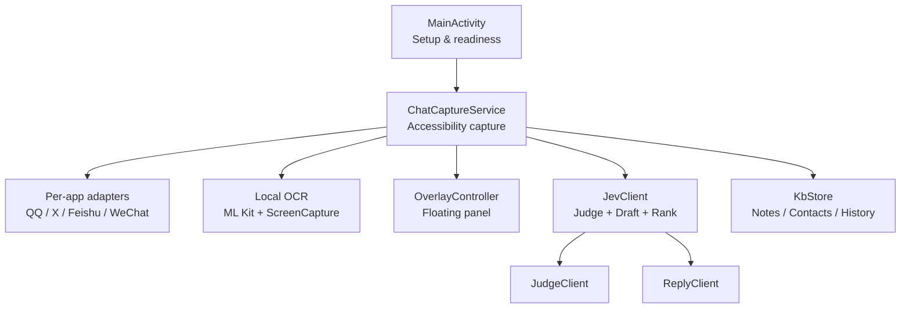
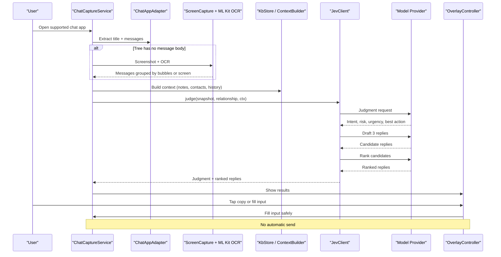
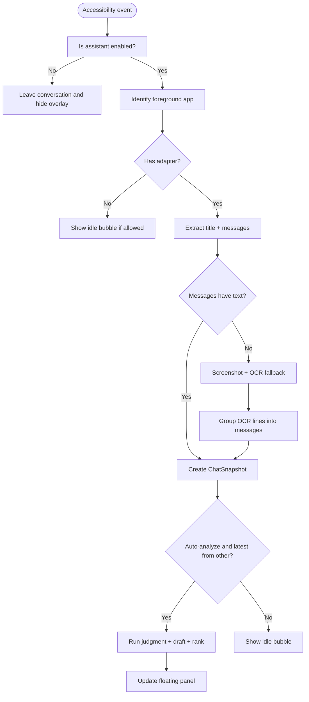
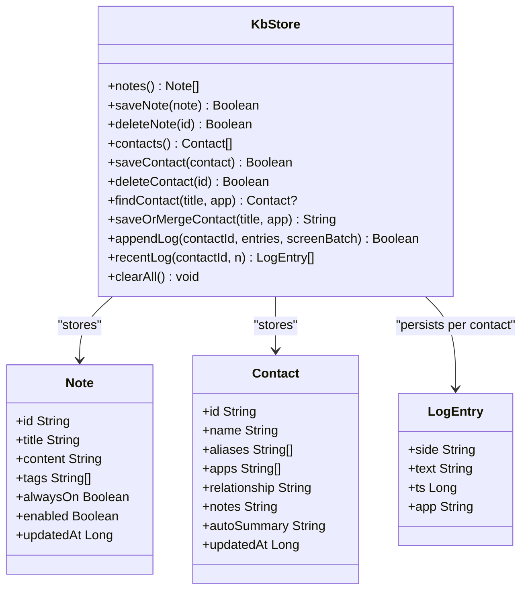
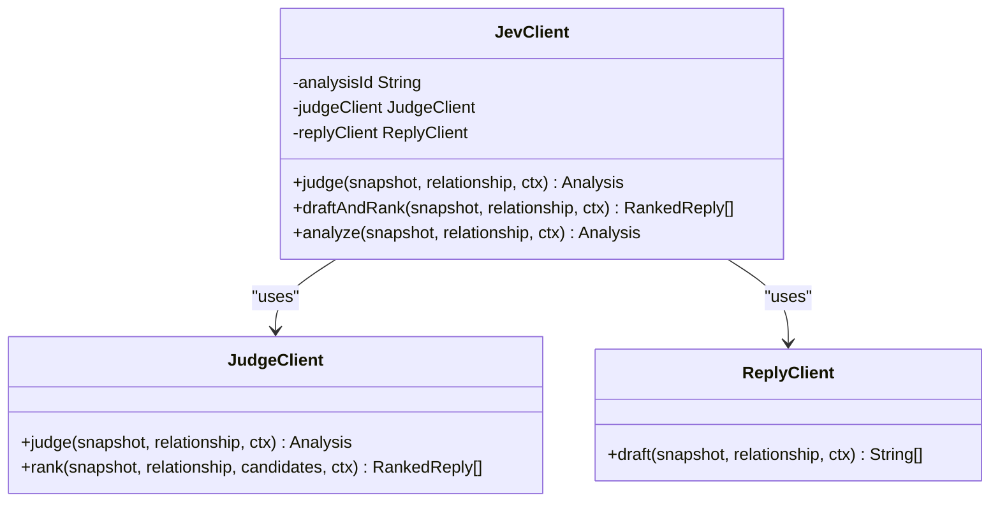
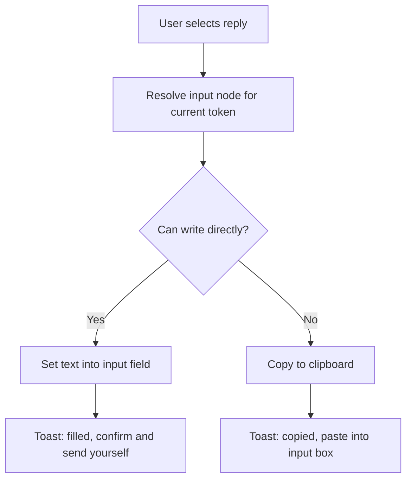
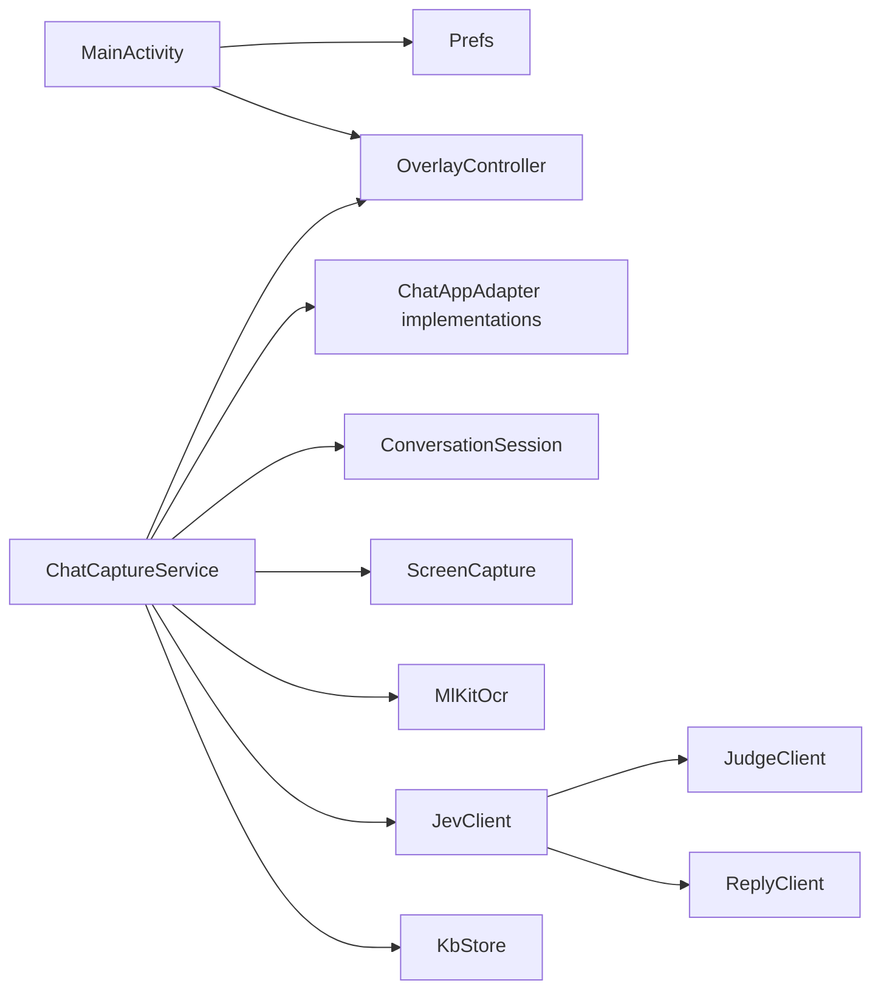

# Project Overview

<cite>
**Referenced Files in This Document**
- [README.md](file://README.md)
- [MainActivity.kt](file://app/src/main/java/com/jev/probe/MainActivity.kt)
- [ChatCaptureService.kt](file://app/src/main/java/com/jev/probe/capture/ChatCaptureService.kt)
- [KbStore.kt](file://app/src/main/java/com/jev/probe/core/kb/KbStore.kt)
- [JevClient.kt](file://app/src/main/java/com/jev/probe/jev/JevClient.kt)
</cite>

## Table of Contents
1. [Introduction](#introduction)
2. [Project Structure](#project-structure)
3. [Core Components](#core-components)
4. [Architecture Overview](#architecture-overview)
5. [Detailed Component Analysis](#detailed-component-analysis)
6. [Dependency Analysis](#dependency-analysis)
7. [Performance Considerations](#performance-considerations)
8. [Troubleshooting Guide](#troubleshooting-guide)
9. [Conclusion](#conclusion)

## Introduction
Jev Chat Jarvis is an AI-powered conversation co-pilot for Android that reads the chat content currently visible on your screen and provides intelligent reply suggestions without automatically sending them. Its core value proposition is privacy-first processing: it does not hook into apps, modify their packages, or access their databases; instead, it uses Android’s accessibility services to read what is already displayed, performs local OCR when needed, and sends only the text you choose to analyze to model providers you configure.

The project supports multiple platforms through a unified architecture: QQ, X/Twitter, Feishu/Lark, and WeChat are explicitly adapted, while unadapted apps can still be analyzed via manual screenshot OCR. It also integrates a local knowledge base and optional chat history so replies stay consistent with your notes, contacts, and prior conversations.

Target audience includes:
- Professionals who need AI assistance in business communications across messaging apps.
- Users seeking privacy-focused AI tools that avoid automatic sending and keep screenshots and keys under local control.
- Developers who want to extend platform support by implementing a small adapter for a new chat app.

Key differentiators from other AI chat assistants:
- The system first evaluates intent, risk, and whether a reply is appropriate before drafting candidates.
- Sending is always manual; the app fills the input field but never presses send.
- Platform support is built around accessibility nodes plus offline OCR fallback rather than app hooks.
- A local knowledge base and contact archive enrich analysis without requiring cloud-only storage.

**Section sources**
- [README.md:62-84](file://README.md#L62-L84)
- [README.md:104-137](file://README.md#L104-L137)
- [README.md:190-221](file://README.md#L190-L221)

## Project Structure
At a high level, the Android application is organized by responsibility:
- `capture/` handles live reading of chat windows, per-app adapters, OCR, and session management.
- `jev/` wraps the judgment, reply, and vision model clients.
- `core/kb/` stores notes, contacts, and optional chat history locally.
- `overlay/` manages the floating analysis panel.
- `MainActivity` and `SettingsActivity` provide setup, permissions, and configuration.
- `KnowledgeActivity` manages the knowledge base UI.

**Diagram sources**
- [MainActivity.kt:26-31](file://app/src/main/java/com/jev/probe/MainActivity.kt#L26-L31)
- [ChatCaptureService.kt:29-42](file://app/src/main/java/com/jev/probe/capture/ChatCaptureService.kt#L29-L42)
- [ChatCaptureService.kt:48-53](file://app/src/main/java/com/jev/probe/capture/ChatCaptureService.kt#L48-L53)
- [ChatCaptureService.kt:188-196](file://app/src/main/java/com/jev/probe/capture/ChatCaptureService.kt#L188-L196)
- [JevClient.kt:9-18](file://app/src/main/java/com/jev/probe/jev/JevClient.kt#L9-L18)
- [KbStore.kt:12-23](file://app/src/main/java/com/jev/probe/core/kb/KbStore.kt#L12-L23)

**Section sources**
- [README.md:223-241](file://README.md#L223-L241)
- [MainActivity.kt:26-31](file://app/src/main/java/com/jev/probe/MainActivity.kt#L26-L31)
- [ChatCaptureService.kt:29-42](file://app/src/main/java/com/jev/probe/capture/ChatCaptureService.kt#L29-L42)

## Core Components
This section summarizes the main building blocks that make Jev work as a privacy-first, multi-platform AI reply assistant.

- **Main entry and readiness UI**: `MainActivity` shows whether accessibility, overlay, and API access are ready, guides users through permissions, and exposes settings and hosted-mode options.
- **Live capture service**: `ChatCaptureService` is an accessibility service that watches the active window, delegates each supported app to a small adapter, detects incoming messages, runs analysis off the main thread, and drives the floating overlay.
- **OCR fallback**: When the accessibility tree has no message body, the service captures the screen and uses ML Kit offline OCR. For Feishu, it targets known bubble rectangles; for unknown apps, it groups whole-screen OCR lines into pseudo-bubbles.
- **Model client facade**: `JevClient` centralizes calls to the judgment route, the draft route, and ranking, sharing one analysis ID so hosted billing can group related calls.
- **Local knowledge base**: `KbStore` persists notes, contacts, and optional per-contact chat history in the app’s private directory, with atomic writes and deduplication logic.

**Section sources**
- [MainActivity.kt:26-31](file://app/src/main/java/com/jev/probe/MainActivity.kt#L26-L31)
- [ChatCaptureService.kt:29-42](file://app/src/main/java/com/jev/probe/capture/ChatCaptureService.kt#L29-L42)
- [ChatCaptureService.kt:188-196](file://app/src/main/java/com/jev/probe/capture/ChatCaptureService.kt#L188-L196)
- [JevClient.kt:9-18](file://app/src/main/java/com/jev/probe/jev/JevClient.kt#L9-L18)
- [KbStore.kt:12-23](file://app/src/main/java/com/jev/probe/core/kb/KbStore.kt#L12-L23)

## Architecture Overview
Jev follows a clear separation between data collection, analysis, and user interaction:

1. **Collection**: An accessibility service observes the current window. Per-app adapters extract a title and message list. If the tree has no text, the service falls back to screenshot-based OCR.
2. **Context enrichment**: Before calling models, the service builds context from the knowledge base and optional recent history.
3. **Analysis**: The judgment model evaluates intent, risk, urgency, and best action. The reply model drafts three candidate responses, which are then ranked.
4. **User control**: Results appear in a floating panel. The user copies or fills the input box; sending remains entirely manual.

**Diagram sources**
- [ChatCaptureService.kt:29-42](file://app/src/main/java/com/jev/probe/capture/ChatCaptureService.kt#L29-L42)
- [ChatCaptureService.kt:188-196](file://app/src/main/java/com/jev/probe/capture/ChatCaptureService.kt#L188-L196)
- [ChatCaptureService.kt:389-455](file://app/src/main/java/com/jev/probe/capture/ChatCaptureService.kt#L389-L455)
- [JevClient.kt:22-42](file://app/src/main/java/com/jev/probe/jev/JevClient.kt#L22-L42)

## Detailed Component Analysis

### Privacy-First Accessibility Architecture
Jev’s design philosophy is to read screen content through Android’s accessibility services rather than hooking into apps. This means:
- No root, no Xposed, no package modification.
- No direct use of the target app’s internal APIs or account systems.
- Only the content currently visible on screen is considered.
- Screenshots used for OCR remain local unless the user explicitly configures a hosted gateway.

The service distinguishes between:
- Adapted apps where node extraction works well.
- Apps like Feishu where bodies are self-drawn and require OCR.
- Unadapted apps where the user manually triggers “screenshot and recognize once.”

**Diagram sources**
- [ChatCaptureService.kt:239-273](file://app/src/main/java/com/jev/probe/capture/ChatCaptureService.kt#L239-L273)
- [ChatCaptureService.kt:275-360](file://app/src/main/java/com/jev/probe/capture/ChatCaptureService.kt#L275-L360)
- [ChatCaptureService.kt:457-702](file://app/src/main/java/com/jev/probe/capture/ChatCaptureService.kt#L457-L702)

**Section sources**
- [README.md:62-70](file://README.md#L62-L70)
- [README.md:148-158](file://README.md#L148-L158)
- [ChatCaptureService.kt:29-42](file://app/src/main/java/com/jev/probe/capture/ChatCaptureService.kt#L29-L42)
- [ChatCaptureService.kt:275-360](file://app/src/main/java/com/jev/probe/capture/ChatCaptureService.kt#L275-L360)

### Multi-Platform Support Matrix
The project documents explicit platform status, capture method, and caveats.

| Platform | Status | Capture Method | Notes |
|---|---|---|---|
| WeChat Android | Supported with caution | Disguised accessibility service reads nodes; falls back to screenshot OCR when nodes are empty | Reading WeChat may trigger its risk-control mechanisms; use at your own risk |
| QQ Android | Fully supported | Accessibility node parsing | Tested on specific versions; group chats supported |
| X / Twitter DMs | Fully supported | Parses Compose node metadata | Verified on Chinese interface |
| Feishu / Lark | Supported with OCR fallback | Reads bubble rectangles and uses offline OCR for message bodies | Bodies are self-drawn and not in the accessibility tree |
| Other unadapted apps | Manual mode | Floating menu triggers one-time full-screen OCR | Does not distinguish sender side automatically |
| macOS / Windows | Provided by sibling projects | See respective repositories | Separate desktop implementations |
| Web | Planned | Not yet available | No web version yet |

**Section sources**
- [README.md:72-84](file://README.md#L72-L84)
- [README.md:210-217](file://README.md#L210-L217)

### Knowledge Base Integration
The knowledge base helps replies stay grounded in your real relationships and notes:
- Notes can be tagged, pinned, and matched against conversation titles or recent messages.
- Contacts store names, aliases, relationships, and notes; they can be created manually from a conversation.
- Optional chat history records recent screens per contact with deduplication and size limits.
- All data lives in the app’s private directory and can be cleared from settings.

**Diagram sources**
- [KbStore.kt:9-23](file://app/src/main/java/com/jev/probe/core/kb/KbStore.kt#L9-L23)
- [KbStore.kt:44-96](file://app/src/main/java/com/jev/probe/core/kb/KbStore.kt#L44-L96)
- [KbStore.kt:106-145](file://app/src/main/java/com/jev/probe/core/kb/KbStore.kt#L106-L145)
- [KbStore.kt:147-241](file://app/src/main/java/com/jev/probe/core/kb/KbStore.kt#L147-L241)

**Section sources**
- [README.md:112-120](file://README.md#L112-L120)
- [KbStore.kt:12-23](file://app/src/main/java/com/jev/probe/core/kb/KbStore.kt#L12-L23)
- [KbStore.kt:147-241](file://app/src/main/java/com/jev/probe/core/kb/KbStore.kt#L147-L241)

### Model Routing and Analysis Flow
`JevClient` is a thin facade that coordinates three model routes:
- Judgment: evaluates intent, danger level, urgency, and recommended action.
- Reply: drafts three candidate responses.
- Ranking: orders the candidates by suitability.

**Diagram sources**
- [JevClient.kt:9-42](file://app/src/main/java/com/jev/probe/jev/JevClient.kt#L9-L42)

**Section sources**
- [JevClient.kt:9-42](file://app/src/main/java/com/jev/probe/jev/JevClient.kt#L9-L42)
- [ChatCaptureService.kt:389-455](file://app/src/main/java/com/jev/probe/capture/ChatCaptureService.kt#L389-L455)

### Input Filling and Safety Guarantees
A key safety boundary is that Jev never sends messages automatically. When the user selects a suggested reply:
- The service tries to set text directly into the chat input field.
- If direct writing fails, it copies the text to the clipboard and asks the user to paste it.
- The write path re-validates the target window and input node to avoid writing into unrelated editors.

**Diagram sources**
- [ChatCaptureService.kt:704-792](file://app/src/main/java/com/jev/probe/capture/ChatCaptureService.kt#L704-L792)

**Section sources**
- [README.md:104-111](file://README.md#L104-L111)
- [ChatCaptureService.kt:704-792](file://app/src/main/java/com/jev/probe/capture/ChatCaptureService.kt#L704-L792)

## Dependency Analysis
The runtime dependencies among core components can be summarized as follows:

**Diagram sources**
- [MainActivity.kt:26-31](file://app/src/main/java/com/jev/probe/MainActivity.kt#L26-L31)
- [ChatCaptureService.kt:48-53](file://app/src/main/java/com/jev/probe/capture/ChatCaptureService.kt#L48-L53)
- [ChatCaptureService.kt:188-196](file://app/src/main/java/com/jev/probe/capture/ChatCaptureService.kt#L188-L196)
- [ChatCaptureService.kt:389-455](file://app/src/main/java/com/jev/probe/capture/ChatCaptureService.kt#L389-L455)
- [JevClient.kt:9-42](file://app/src/main/java/com/jev/probe/jev/JevClient.kt#L9-L42)
- [KbStore.kt:12-23](file://app/src/main/java/com/jev/probe/core/kb/KbStore.kt#L12-L23)

**Section sources**
- [ChatCaptureService.kt:29-42](file://app/src/main/java/com/jev/probe/capture/ChatCaptureService.kt#L29-L42)
- [JevClient.kt:9-42](file://app/src/main/java/com/jev/probe/jev/JevClient.kt#L9-L42)

## Performance Considerations
- **Debounced analysis**: Content-change events are debounced to avoid repeated analysis during rapid UI updates.
- **Deduplication**: Snapshots are compared by signature so identical conversations do not re-run analysis unnecessarily.
- **OCR throttling**: Automatic screenshot and OCR paths include throttling and failure backoff to prevent constant capture loops.
- **Background workers**: Analysis and entitlement refresh run off the main thread using worker pools.
- **Local OCR model warm-up**: The offline OCR model is warmed up after service connection to reduce first-use latency.
- **History limits**: Optional chat history is bounded per contact to avoid unbounded growth.

[No sources needed since this section provides general guidance]

## Troubleshooting Guide
Common operational issues and their causes:
- **Floating ball disappears or messages are not read**: Often caused by manufacturer ROMs freezing background processes. Ensure accessibility, overlay, auto-start, and battery optimization settings are configured correctly.
- **Feishu cannot read message bodies**: Message bodies are self-drawn and not present in the accessibility tree; OCR is required.
- **Unadapted apps**: Use the floating menu’s “screenshot and recognize once” option. The result will treat all recognized text as coming from the other party.
- **WeChat behavior**: Reading WeChat may trigger risk-control mechanisms; the README explicitly warns users to accept this risk.
- **OCR failures**: May occur when the system denies screenshot permission, protected windows block capture, or the screen contains no readable text.

**Section sources**
- [README.md:139-187](file://README.md#L139-L187)
- [README.md:243-254](file://README.md#L243-L254)
- [ChatCaptureService.kt:457-702](file://app/src/main/java/com/jev/probe/capture/ChatCaptureService.kt#L457-L702)

## Conclusion
Jev Chat Jarvis positions itself as a privacy-conscious AI conversation co-pilot for Android. It avoids invasive app hooks, keeps screenshots and keys local, and leaves every send decision to the user. Its architecture separates accessibility-based capture, OCR fallback, knowledge-base context, and model routing behind a simple overlay-driven workflow. With explicit support for QQ, X/Twitter, Feishu/Lark, and cautious WeChat integration, plus a documented path for extending platform support, it targets professionals, privacy-aware users, and developers who want a safe, extensible foundation for AI-assisted chat.

[No sources needed since this section summarizes without analyzing specific files]