# Security & Privacy

<cite>
**Referenced Files in This Document**
- [AndroidManifest.xml](file://app/src/main/AndroidManifest.xml)
- [ChatCaptureService.kt](file://app/src/main/java/com/jev/probe/capture/ChatCaptureService.kt)
- [ScreenCapture.kt](file://app/src/main/java/com/jev/probe/capture/ocr/ScreenCapture.kt)
- [MlKitOcr.kt](file://app/src/main/java/com/jev/probe/capture/ocr/MlKitOcr.kt)
- [OcrEngine.kt](file://app/src/main/java/com/jev/probe/capture/ocr/OcrEngine.kt)
- [Prefs.kt](file://app/src/main/java/com/jev/probe/core/Prefs.kt)
- [KbStore.kt](file://app/src/main/java/com/jev/probe/core/kb/KbStore.kt)
- [JevClient.kt](file://app/src/main/java/com/jev/probe/jev/JevClient.kt)
- [VisionClient.kt](file://app/src/main/java/com/jev/probe/jev/VisionClient.kt)
- [GuardedInputWriter.kt](file://app/src/main/java/com/jev/probe/capture/GuardedInputWriter.kt)
- [SettingsActivity.kt](file://app/src/main/java/com/jev/probe/SettingsActivity.kt)
- [privacy.html](file://site/privacy.html)
</cite>

## Table of Contents
1. [Introduction](#introduction)
2. [Project Structure](#project-structure)
3. [Core Components](#core-components)
4. [Architecture Overview](#architecture-overview)
5. [Detailed Component Analysis](#detailed-component-analysis)
6. [Dependency Analysis](#dependency-analysis)
7. [Performance Considerations](#performance-considerations)
8. [Troubleshooting Guide](#troubleshooting-guide)
9. [Conclusion](#conclusion)

## Introduction
This document explains the security and privacy design of the Android assistant app, focusing on its privacy-first architecture: OCR runs locally on the device, sensitive data remains in app-private storage, API keys are stored securely, and user controls govern what is processed locally versus sent to external AI providers. It also covers Android accessibility permissions, sandbox isolation, consent for hosted mode, third-party provider responsibilities, and user-facing data management features such as knowledge base cleanup, chat history retention, and complete data removal.

## Project Structure
The security-relevant code spans capture services, OCR, local storage, configuration, network clients, and settings UI. The key files are:

- Capture and overlay: `ChatCaptureService`, `ScreenCapture`, `GuardedInputWriter`
- OCR engine: `OcrEngine`, `MlKitOcr`
- Configuration and secrets: `Prefs`
- Local knowledge and history: `KbStore`
- External AI integration: `JevClient`, `VisionClient`
- User controls and policy link: `SettingsActivity`
- Platform permissions: `AndroidManifest.xml`
- Public privacy statement: `privacy.html`

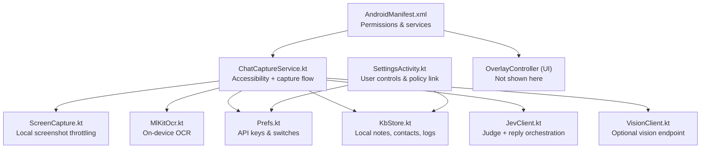

**Diagram sources**
- [AndroidManifest.xml:1-61](file://app/src/main/AndroidManifest.xml#L1-L61)
- [ChatCaptureService.kt:29-42](file://app/src/main/java/com/jev/probe/capture/ChatCaptureService.kt#L29-L42)
- [ScreenCapture.kt:14-34](file://app/src/main/java/com/jev/probe/capture/ocr/ScreenCapture.kt#L14-L34)
- [MlKitOcr.kt:13-25](file://app/src/main/java/com/jev/probe/capture/ocr/MlKitOcr.kt#L13-L25)
- [Prefs.kt:6-16](file://app/src/main/java/com/jev/probe/core/Prefs.kt#L6-L16)
- [KbStore.kt:12-23](file://app/src/main/java/com/jev/probe/core/kb/KbStore.kt#L12-L23)
- [JevClient.kt:9-18](file://app/src/main/java/com/jev/probe/jev/JevClient.kt#L9-L18)
- [VisionClient.kt:10-25](file://app/src/main/java/com/jev/probe/jev/VisionClient.kt#L10-L25)
- [SettingsActivity.kt:392-401](file://app/src/main/java/com/jev/probe/SettingsActivity.kt#L392-L401)

**Section sources**
- [AndroidManifest.xml:1-61](file://app/src/main/AndroidManifest.xml#L1-L61)
- [ChatCaptureService.kt:29-42](file://app/src/main/java/com/jev/probe/capture/ChatCaptureService.kt#L29-L42)
- [SettingsActivity.kt:392-401](file://app/src/main/java/com/jev/probe/SettingsActivity.kt#L392-L401)

## Core Components
This section summarizes the components that implement privacy and security.

- **Privacy-first OCR**: Screenshot capture and text recognition run entirely on the device using ML Kit’s bundled Chinese recognizer. Screenshots are not uploaded; only recognized text may be used for analysis.
- **App-private storage**: API keys, endpoints, model names, relationship descriptions, conversation whitelist, knowledge-base notes, contacts, and optional per-contact chat history are stored in app-private SharedPreferences or under `filesDir/kb`.
- **Controlled access patterns**: Only conversations matching the user’s whitelist are analyzed. Automatic analysis can be disabled so the assistant only acts when the user explicitly taps “Analyze.”
- **External AI routing**: In bring-your-own-key mode, requests go directly to the user-configured provider. In hosted mode, a gateway forwards requests after explicit user consent.
- **User controls**: Users can clear knowledge base and history, adjust history retention, change providers, enable/disable auto-analysis, and uninstall the app to remove all local data.

**Section sources**
- [MlKitOcr.kt:13-25](file://app/src/main/java/com/jev/probe/capture/ocr/MlKitOcr.kt#L13-L25)
- [Prefs.kt:6-16](file://app/src/main/java/com/jev/probe/core/Prefs.kt#L6-L16)
- [Prefs.kt:135-174](file://app/src/main/java/com/jev/probe/core/Prefs.kt#L135-L174)
- [Prefs.kt:218-271](file://app/src/main/java/com/jev/probe/core/Prefs.kt#L218-L271)
- [KbStore.kt:12-23](file://app/src/main/java/com/jev/probe/core/kb/KbStore.kt#L12-L23)
- [SettingsActivity.kt:341-357](file://app/src/main/java/com/jev/probe/SettingsActivity.kt#L341-L357)

## Architecture Overview
The privacy architecture separates local processing from external AI calls.

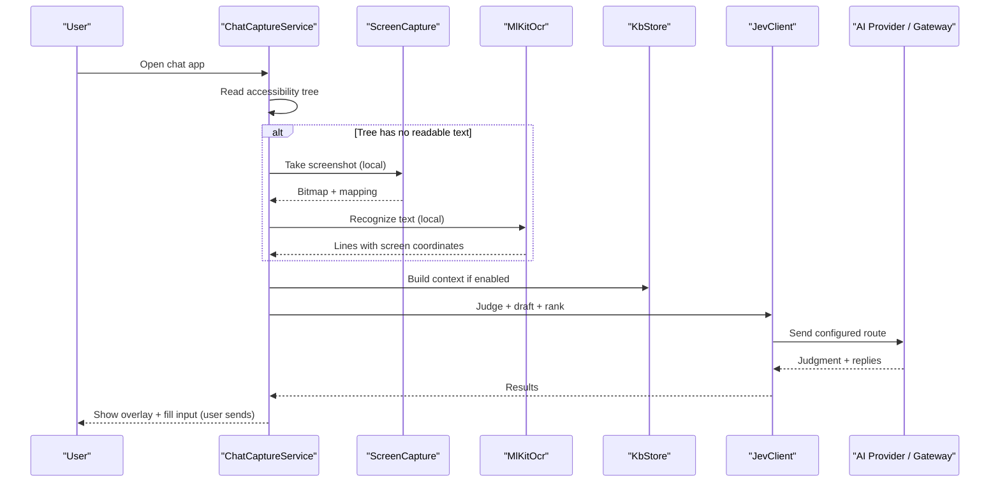

**Diagram sources**
- [ChatCaptureService.kt:239-360](file://app/src/main/java/com/jev/probe/capture/ChatCaptureService.kt#L239-L360)
- [ChatCaptureService.kt:389-455](file://app/src/main/java/com/jev/probe/capture/ChatCaptureService.kt#L389-L455)
- [ScreenCapture.kt:65-93](file://app/src/main/java/com/jev/probe/capture/ocr/ScreenCapture.kt#L65-L93)
- [MlKitOcr.kt:39-95](file://app/src/main/java/com/jev/probe/capture/ocr/MlKitOcr.kt#L39-L95)
- [KbStore.kt:172-220](file://app/src/main/java/com/jev/probe/core/kb/KbStore.kt#L172-L220)
- [JevClient.kt:22-42](file://app/src/main/java/com/jev/probe/jev/JevClient.kt#L22-L42)

## Detailed Component Analysis

### Privacy-First OCR Pipeline
The OCR path is designed to keep screenshots off the network and limit repeated captures.

- **Local-only recognition**: The ML Kit implementation uses a bundled Chinese recognizer that ships inside the APK. It does not require Google Play services and does not download models at runtime.
- **Coordinate handling**: OCR boxes are converted from bitmap space back to screen coordinates so they align with the accessibility node bounds.
- **Throttling and safety**: `ScreenCapture` enforces a minimum interval between screenshots, backs off on repeated failures, hides the overlay before capturing, and recycles buffers to avoid leaking system compositor resources.
- **No upload contract**: Screenshots are processed in memory and discarded; only recognized text proceeds to analysis.

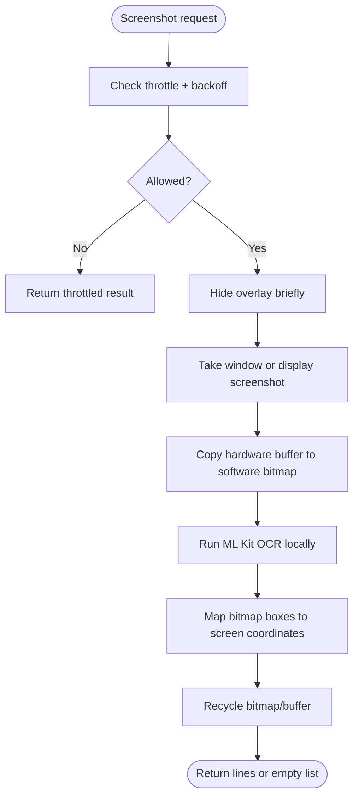

**Diagram sources**
- [ScreenCapture.kt:65-93](file://app/src/main/java/com/jev/probe/capture/ocr/ScreenCapture.kt#L65-L93)
- [ScreenCapture.kt:95-147](file://app/src/main/java/com/jev/probe/capture/ocr/ScreenCapture.kt#L95-L147)
- [ScreenCapture.kt:155-176](file://app/src/main/java/com/jev/probe/capture/ocr/ScreenCapture.kt#L155-L176)
- [MlKitOcr.kt:39-95](file://app/src/main/java/com/jev/probe/capture/ocr/MlKitOcr.kt#L39-L95)

**Section sources**
- [MlKitOcr.kt:13-25](file://app/src/main/java/com/jev/probe/capture/ocr/MlKitOcr.kt#L13-L25)
- [MlKitOcr.kt:39-95](file://app/src/main/java/com/jev/probe/capture/ocr/MlKitOcr.kt#L39-L95)
- [ScreenCapture.kt:14-34](file://app/src/main/java/com/jev/probe/capture/ocr/ScreenCapture.kt#L14-L34)
- [ScreenCapture.kt:65-93](file://app/src/main/java/com/jev/probe/capture/ocr/ScreenCapture.kt#L65-L93)
- [ScreenCapture.kt:155-176](file://app/src/main/java/com/jev/probe/capture/ocr/ScreenCapture.kt#L155-L176)

### Secure Storage of API Keys and Preferences
Configuration is stored in app-private SharedPreferences. The class documents that real config migrates safely, key lengths may be logged but never secret values, and keys are never written into code or git.

Key protections include:
- Private SharedPreferences file.
- Separate fields for judge, reply, and vision routes.
- Optional hosted mode token treated like an API key.
- Clear defaults and fallbacks without exposing secrets.
- Endpoint builders that select provider-specific paths.

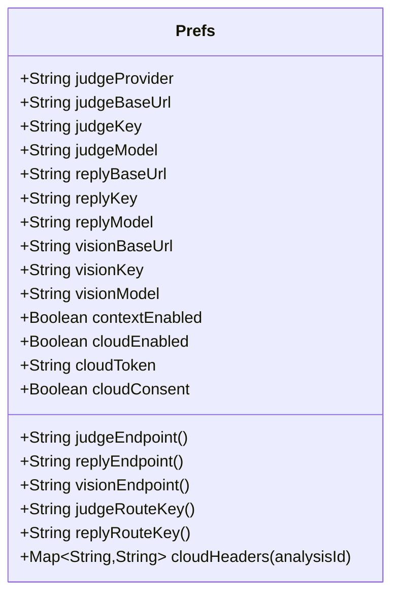

**Diagram sources**
- [Prefs.kt:71-131](file://app/src/main/java/com/jev/probe/core/Prefs.kt#L71-L131)
- [Prefs.kt:218-303](file://app/src/main/java/com/jev/probe/core/Prefs.kt#L218-L303)

**Section sources**
- [Prefs.kt:6-16](file://app/src/main/java/com/jev/probe/core/Prefs.kt#L6-L16)
- [Prefs.kt:26-41](file://app/src/main/java/com/jev/probe/core/Prefs.kt#L26-L41)
- [Prefs.kt:71-131](file://app/src/main/java/com/jev/probe/core/Prefs.kt#L71-L131)
- [Prefs.kt:218-303](file://app/src/main/java/com/jev/probe/core/Prefs.kt#L218-L303)

### Controlled Data Access Patterns
Access control is enforced at multiple layers:

- **Whitelist filtering**: Only conversations whose titles match the user’s whitelist are analyzed.
- **Auto-analysis gate**: Automatic analysis only triggers when the latest message is from the other person and the auto-analyze switch is enabled.
- **Session liveness**: The service validates that the current window still belongs to the expected conversation before writing input or continuing analysis.
- **Manual write guard**: Input filling uses a guarded sequence that re-validates the live session and falls back to clipboard copy if the target changes.

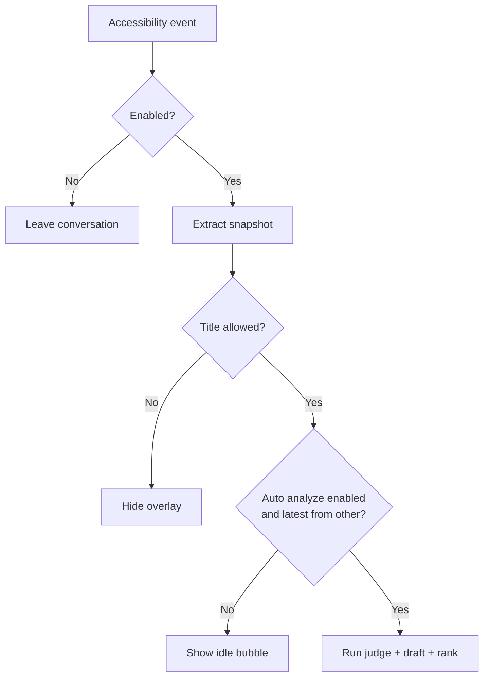

**Diagram sources**
- [ChatCaptureService.kt:303-360](file://app/src/main/java/com/jev/probe/capture/ChatCaptureService.kt#L303-L360)
- [ChatCaptureService.kt:704-763](file://app/src/main/java/com/jev/probe/capture/ChatCaptureService.kt#L704-L763)
- [Prefs.kt:305-316](file://app/src/main/java/com/jev/probe/core/Prefs.kt#L305-L316)

**Section sources**
- [ChatCaptureService.kt:303-360](file://app/src/main/java/com/jev/probe/capture/ChatCaptureService.kt#L303-L360)
- [ChatCaptureService.kt:704-763](file://app/src/main/java/com/jev/probe/capture/ChatCaptureService.kt#L704-L763)
- [Prefs.kt:305-316](file://app/src/main/java/com/jev/probe/core/Prefs.kt#L305-L316)

### Privacy Policy Compliance
The public privacy policy clarifies what leaves the device, where it goes, and how users retain control.

Highlights:
- Default mode sends chat text only to the user-configured model endpoint.
- Hosted mode requires explicit consent and routes through the operator’s gateway.
- Screenshots are not uploaded; OCR is local.
- API keys, settings, knowledge base, and chat history remain on the device.
- No ads, no third-party analytics SDKs, no cookies or advertising identifiers.
- Third-party provider policies apply to the selected endpoints.

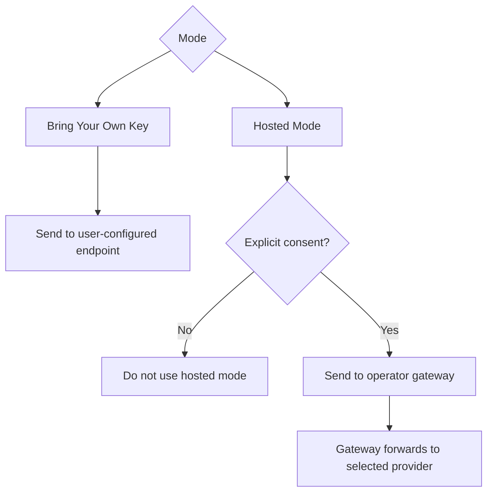

**Diagram sources**
- [privacy.html:122-144](file://site/privacy.html#L122-L144)
- [privacy.html:192-218](file://site/privacy.html#L192-L218)
- [privacy.html:220-275](file://site/privacy.html#L220-L275)
- [privacy.html:317-339](file://site/privacy.html#L317-L339)

**Section sources**
- [privacy.html:122-144](file://site/privacy.html#L122-L144)
- [privacy.html:192-218](file://site/privacy.html#L192-L218)
- [privacy.html:220-275](file://site/privacy.html#L220-L275)
- [privacy.html:317-339](file://site/privacy.html#L317-L339)

### Security Considerations Around Accessibility Services, Permissions, and Sandbox Isolation
The app declares and uses specific Android permissions and services:

- **Internet**: Required to reach the configured AI provider or hosted gateway.
- **SYSTEM_ALERT_WINDOW**: Required to draw the floating analysis panel.
- **FOREGROUND_SERVICE and FOREGROUND_SERVICE_SPECIAL_USE**: Keep the service alive against aggressive OEM power management.
- **POST_NOTIFICATIONS**: Used for foreground service notification.
- **BIND_ACCESSIBILITY_SERVICE**: Binds the accessibility service that reads the UI tree and optionally takes screenshots.

Security implications:
- The service is registered with a disguised class name to improve compatibility with certain chat apps while still being subject to Android’s accessibility permission model.
- The app states it does not send messages automatically; the only write action is filling the input box, and the user must press send.
- App-private storage isolates secrets and user data from other apps.
- Uninstalling the app removes local data.

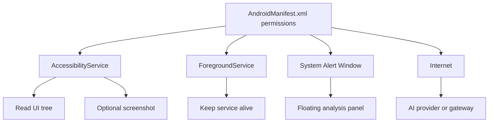

**Diagram sources**
- [AndroidManifest.xml:4-8](file://app/src/main/AndroidManifest.xml#L4-L8)
- [AndroidManifest.xml:38-57](file://app/src/main/AndroidManifest.xml#L38-L57)
- [ChatCaptureService.kt:29-42](file://app/src/main/java/com/jev/probe/capture/ChatCaptureService.kt#L29-L42)

**Section sources**
- [AndroidManifest.xml:4-8](file://app/src/main/AndroidManifest.xml#L4-L8)
- [AndroidManifest.xml:38-57](file://app/src/main/AndroidManifest.xml#L38-L57)
- [ChatCaptureService.kt:29-42](file://app/src/main/java/com/jev/probe/capture/ChatCaptureService.kt#L29-L42)

### Data Flow: Local Processing vs External AI Providers
The app processes screenshots and OCR locally, then optionally sends structured chat context to external endpoints.

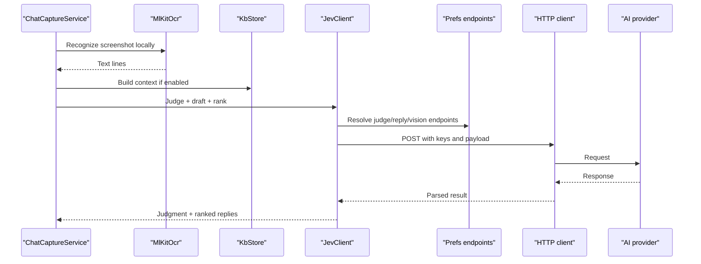

**Diagram sources**
- [ChatCaptureService.kt:389-455](file://app/src/main/java/com/jev/probe/capture/ChatCaptureService.kt#L389-L455)
- [MlKitOcr.kt:39-95](file://app/src/main/java/com/jev/probe/capture/ocr/MlKitOcr.kt#L39-L95)
- [KbStore.kt:172-220](file://app/src/main/java/com/jev/probe/core/kb/KbStore.kt#L172-L220)
- [JevClient.kt:22-42](file://app/src/main/java/com/jev/probe/jev/JevClient.kt#L22-L42)
- [Prefs.kt:281-303](file://app/src/main/java/com/jev/probe/core/Prefs.kt#L281-L303)

**Section sources**
- [ChatCaptureService.kt:389-455](file://app/src/main/java/com/jev/probe/capture/ChatCaptureService.kt#L389-L455)
- [JevClient.kt:22-42](file://app/src/main/java/com/jev/probe/jev/JevClient.kt#L22-L42)
- [Prefs.kt:281-303](file://app/src/main/java/com/jev/probe/core/Prefs.kt#L281-L303)

### User Controls for Data Management
Users have explicit controls over data collection and retention:

- **Knowledge base cleanup**: A one-tap option clears notes, contacts, and per-contact history under `filesDir/kb` without affecting API keys or other settings.
- **Chat history retention**: History recording is opt-in by default. When enabled, each contact’s log is capped at a maximum number of entries.
- **Complete data removal**: Uninstalling the app deletes all local data. For hosted mode, additional records may exist on the gateway side and require contacting the operator.
- **Provider selection**: Users can choose among preset providers or supply a custom OpenAI-compatible endpoint.

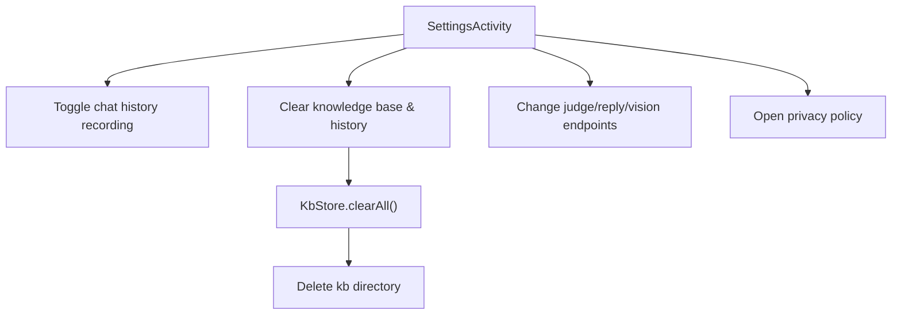

**Diagram sources**
- [SettingsActivity.kt:341-357](file://app/src/main/java/com/jev/probe/SettingsActivity.kt#L341-L357)
- [SettingsActivity.kt:392-401](file://app/src/main/java/com/jev/probe/SettingsActivity.kt#L392-L401)
- [KbStore.kt:278-290](file://app/src/main/java/com/jev/probe/core/kb/KbStore.kt#L278-L290)

**Section sources**
- [SettingsActivity.kt:341-357](file://app/src/main/java/com/jev/probe/SettingsActivity.kt#L341-L357)
- [SettingsActivity.kt:392-401](file://app/src/main/java/com/jev/probe/SettingsActivity.kt#L392-L401)
- [KbStore.kt:147-220](file://app/src/main/java/com/jev/probe/core/kb/KbStore.kt#L147-L220)
- [KbStore.kt:278-290](file://app/src/main/java/com/jev/probe/core/kb/KbStore.kt#L278-L290)

### Third-Party Service Privacy Policies and User Responsibility
The app delegates trust decisions to the selected provider:

- In bring-your-own-key mode, the user chooses the endpoint and bears responsibility for reviewing that provider’s privacy policy.
- In hosted mode, the operator’s gateway selects the provider and forwards requests; the app does not store chat bodies on the gateway but may store hashed identifiers, quota state, and order records.
- The app does not integrate payment SDKs; payments occur on web pages operated by the payment platform.

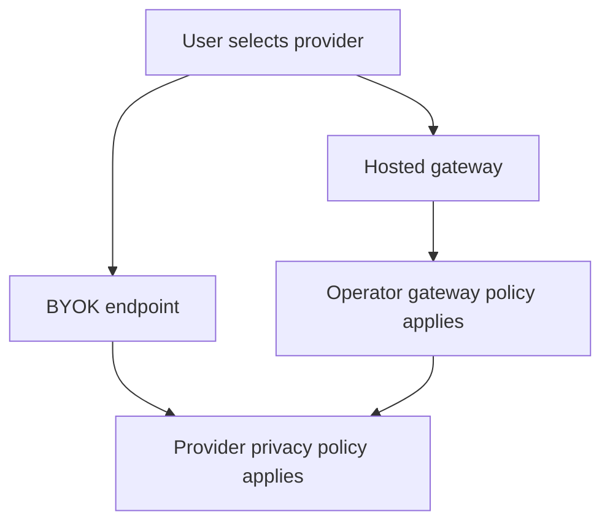

**Diagram sources**
- [privacy.html:183-190](file://site/privacy.html#L183-L190)
- [privacy.html:192-218](file://site/privacy.html#L192-L218)
- [privacy.html:338-339](file://site/privacy.html#L338-L339)

**Section sources**
- [privacy.html:183-190](file://site/privacy.html#L183-L190)
- [privacy.html:192-218](file://site/privacy.html#L192-L218)
- [privacy.html:338-339](file://site/privacy.html#L338-L339)

## Dependency Analysis
The following diagram shows how security-sensitive modules depend on each other.

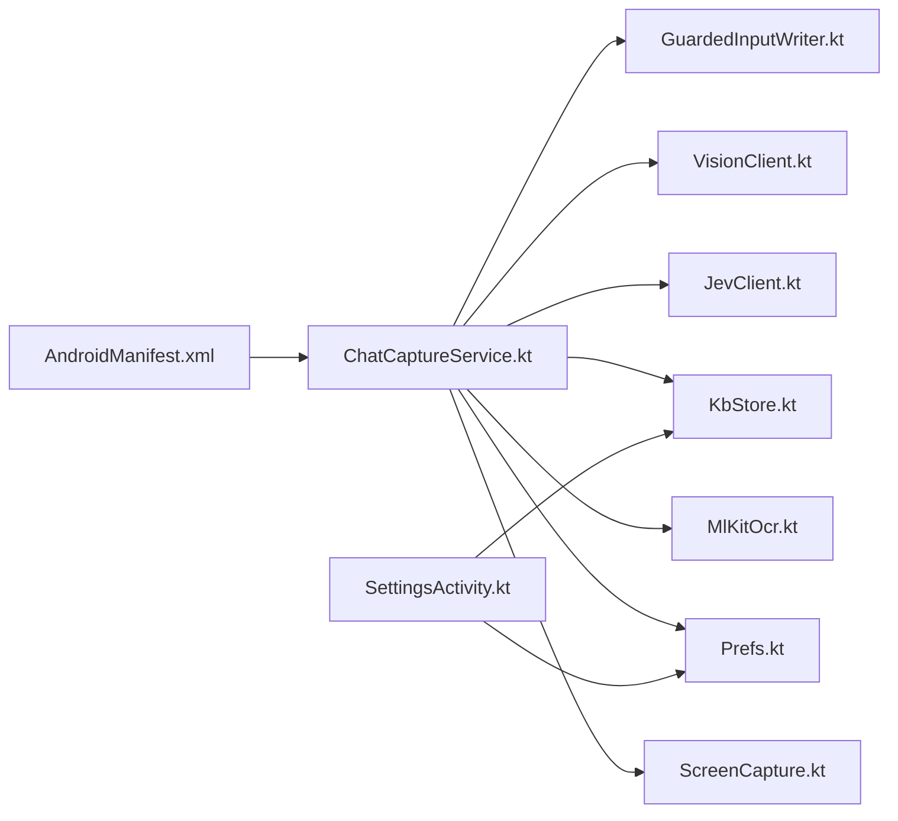

**Diagram sources**
- [AndroidManifest.xml:1-61](file://app/src/main/AndroidManifest.xml#L1-L61)
- [ChatCaptureService.kt:29-42](file://app/src/main/java/com/jev/probe/capture/ChatCaptureService.kt#L29-L42)
- [ScreenCapture.kt:14-34](file://app/src/main/java/com/jev/probe/capture/ocr/ScreenCapture.kt#L14-L34)
- [MlKitOcr.kt:13-25](file://app/src/main/java/com/jev/probe/capture/ocr/MlKitOcr.kt#L13-L25)
- [Prefs.kt:6-16](file://app/src/main/java/com/jev/probe/core/Prefs.kt#L6-L16)
- [KbStore.kt:12-23](file://app/src/main/java/com/jev/probe/core/kb/KbStore.kt#L12-L23)
- [JevClient.kt:9-18](file://app/src/main/java/com/jev/probe/jev/JevClient.kt#L9-L18)
- [VisionClient.kt:10-25](file://app/src/main/java/com/jev/probe/jev/VisionClient.kt#L10-L25)
- [GuardedInputWriter.kt:3-15](file://app/src/main/java/com/jev/probe/capture/GuardedInputWriter.kt#L3-L15)
- [SettingsActivity.kt:341-357](file://app/src/main/java/com/jev/probe/SettingsActivity.kt#L341-L357)

**Section sources**
- [ChatCaptureService.kt:29-42](file://app/src/main/java/com/jev/probe/capture/ChatCaptureService.kt#L29-L42)
- [SettingsActivity.kt:341-357](file://app/src/main/java/com/jev/probe/SettingsActivity.kt#L341-L357)

## Performance Considerations
From a security-performance perspective, the app avoids unnecessary network exposure and expensive operations:

- **Local OCR reduces network risk**: By recognizing text on-device, the app avoids uploading raw screenshots.
- **Screenshot throttling prevents abuse**: Repeated content-changed events cannot turn the app into a screenshot machine gun.
- **Bundled OCR model avoids runtime downloads**: The first use loads the model once; warm-up is triggered off the main thread.
- **Minimal logging of sensitive data**: Logs record counts, lengths, and exception class names rather than chat content.

[No sources needed since this section provides general guidance]

## Troubleshooting Guide
Common security-related issues and their handling:

- **Accessibility screenshot denied**: The app surfaces human-readable error codes and messages, including cases where the service lacks screenshot capability or the window is protected.
- **Overlay interference**: The overlay is hidden during capture and restored afterward to prevent capturing the panel itself.
- **Input write failure**: If the target input changes or cannot be reliably filled, the app copies the generated reply to the clipboard instead of risking a wrong write.
- **Data deletion verification**: The settings UI confirms what will be deleted and performs a recursive delete of the knowledge base directory.

**Section sources**
- [ScreenCapture.kt:208-218](file://app/src/main/java/com/jev/probe/capture/ocr/ScreenCapture.kt#L208-L218)
- [ChatCaptureService.kt:732-763](file://app/src/main/java/com/jev/probe/capture/ChatCaptureService.kt#L732-L763)
- [SettingsActivity.kt:341-357](file://app/src/main/java/com/jev/probe/SettingsActivity.kt#L341-L357)

## Conclusion
The app implements a privacy-first design by keeping OCR local, storing secrets and user data in app-private storage, enforcing controlled access through whitelists and manual actions, and clearly separating local processing from external AI provider calls. Users retain strong control over data retention, provider selection, and data deletion. The accessibility and overlay permissions are necessary for functionality but are bounded by explicit user consent, sandbox isolation, and careful error handling. Third-party provider privacy policies remain the user’s responsibility to review, especially when selecting endpoints or enabling hosted mode.

[No sources needed since this section summarizes without analyzing specific files]