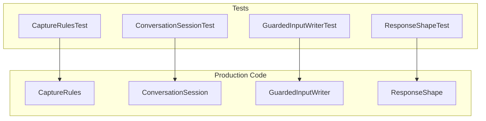
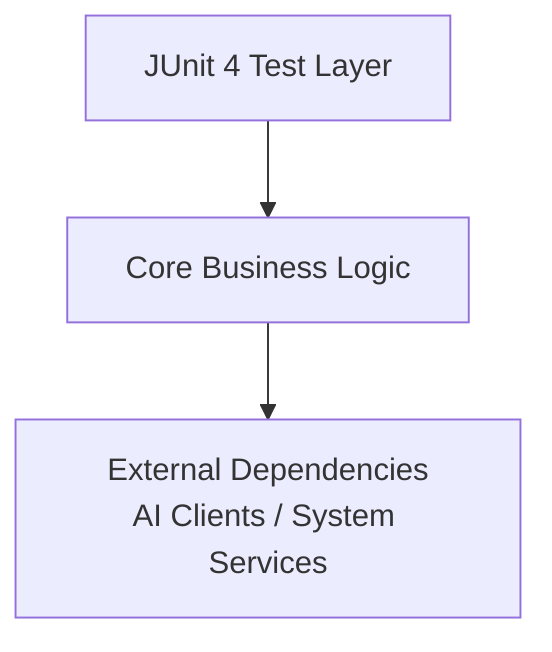
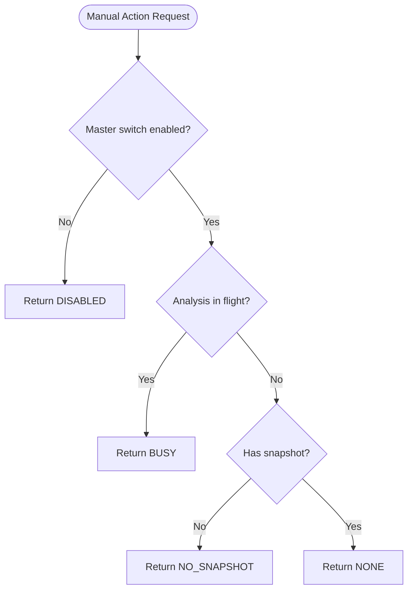
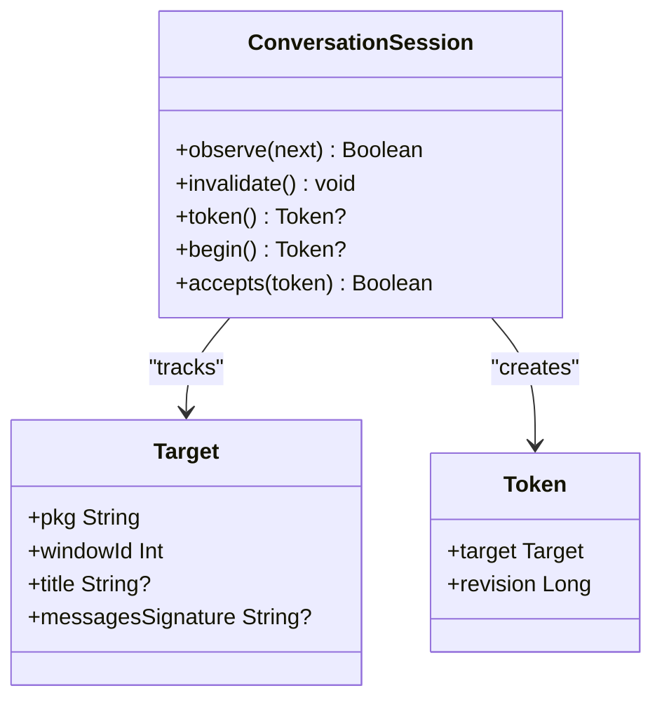
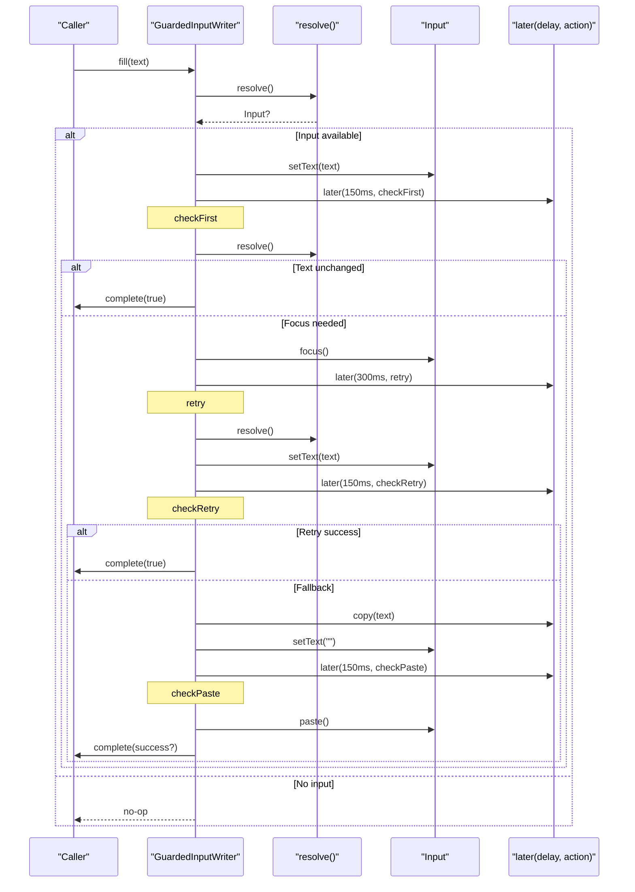
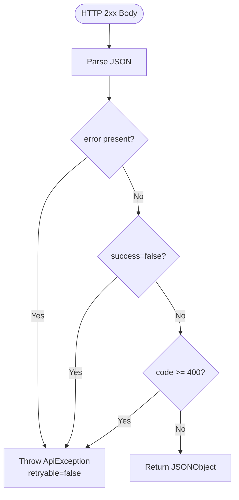
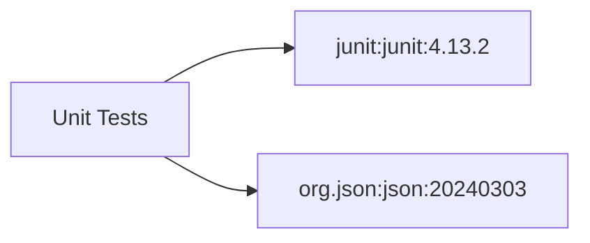

# Testing Strategy

<cite>
**Referenced Files in This Document**
- [CaptureRulesTest.kt](file://app/src/test/java/com/jev/probe/capture/CaptureRulesTest.kt)
- [ConversationSessionTest.kt](file://app/src/test/java/com/jev/probe/capture/ConversationSessionTest.kt)
- [GuardedInputWriterTest.kt](file://app/src/test/java/com/jev/probe/capture/GuardedInputWriterTest.kt)
- [ResponseShapeTest.kt](file://app/src/test/java/com/jev/probe/jev/ResponseShapeTest.kt)
- [CaptureRules.kt](file://app/src/main/java/com/jev/probe/capture/CaptureRules.kt)
- [ConversationSession.kt](file://app/src/main/java/com/jev/probe/capture/ConversationSession.kt)
- [GuardedInputWriter.kt](file://app/src/main/java/com/jev/probe/capture/GuardedInputWriter.kt)
- [ResponseShape.kt](file://app/src/main/java/com/jev/probe/jev/ResponseShape.kt)
- [build.gradle.kts](file://app/build.gradle.kts)
</cite>

## Table of Contents
1. Introduction
2. Project Structure
3. Core Components
4. Architecture Overview
5. Detailed Component Analysis
6. Dependency Analysis
7. Performance Considerations
8. Troubleshooting Guide
9. Conclusion

## Introduction
This document describes the testing strategy for core business logic components in the project, focusing on unit tests built with JUnit 4. It explains how capture rules validation, conversation session management, guarded input writing safety mechanisms, and response shape serialization/deserialization are tested. It also documents mocking strategies for external dependencies, test data fixtures and helpers for simulating chat scenarios, performance considerations for OCR and network operations, continuous integration setup, and Android accessibility service testing challenges with practical workarounds.

## Project Structure
The testing surface is organized under app-level unit tests:
- Capture domain tests validate foreground exclusion, manual action blocking, and diagnostic inventory formatting.
- Conversation session tests verify request lifecycle, invalidation, and target identity semantics.
- Guarded input writer tests simulate asynchronous input flows and session changes to ensure safe writes.
- Response shape tests cover JSON parsing, error envelope detection, route-specific extraction, and retryability.

**Diagram sources**
- [CaptureRulesTest.kt:1-122](file://app/src/test/java/com/jev/probe/capture/CaptureRulesTest.kt#L1-L122)
- [ConversationSessionTest.kt:1-89](file://app/src/test/java/com/jev/probe/capture/ConversationSessionTest.kt#L1-L89)
- [GuardedInputWriterTest.kt:1-104](file://app/src/test/java/com/jev/probe/capture/GuardedInputWriterTest.kt#L1-L104)
- [ResponseShapeTest.kt:1-165](file://app/src/test/java/com/jev/probe/jev/ResponseShapeTest.kt#L1-L165)
- [CaptureRules.kt:1-69](file://app/src/main/java/com/jev/probe/capture/CaptureRules.kt#L1-L69)
- [ConversationSession.kt:1-36](file://app/src/main/java/com/jev/probe/capture/ConversationSession.kt#L1-L36)
- [GuardedInputWriter.kt:1-45](file://app/src/main/java/com/jev/probe/capture/GuardedInputWriter.kt#L1-L45)
- [ResponseShape.kt:1-141](file://app/src/main/java/com/jev/probe/jev/ResponseShape.kt#L1-L141)

**Section sources**
- [CaptureRulesTest.kt:1-122](file://app/src/test/java/com/jev/probe/capture/CaptureRulesTest.kt#L1-L122)
- [ConversationSessionTest.kt:1-89](file://app/src/test/java/com/jev/probe/capture/ConversationSessionTest.kt#L1-L89)
- [GuardedInputWriterTest.kt:1-104](file://app/src/test/java/com/jev/probe/capture/GuardedInputWriterTest.kt#L1-L104)
- [ResponseShapeTest.kt:1-165](file://app/src/test/java/com/jev/probe/jev/ResponseShapeTest.kt#L1-L165)

## Core Components
- Capture rules: Pure decision functions for foreground exclusion, manual action blocking, and resource ID inventory diagnostics. Tests assert deterministic behavior without Android dependencies.
- Conversation session: Thread-safe-ish state machine that tracks current target and request tokens, ensuring stale requests are rejected after switches or invalidations.
- Guarded input writer: Non-blocking sequence that performs text set, focus, retry, clipboard fallback, and completion callbacks while guarding against session changes.
- Response shape: Strict JSON contract enforcement across three routes, including error envelope detection, content extraction, candidate list normalization, and exception classification.

**Section sources**
- [CaptureRules.kt:1-69](file://app/src/main/java/com/jev/probe/capture/CaptureRules.kt#L1-L69)
- [ConversationSession.kt:1-36](file://app/src/main/java/com/jev/probe/capture/ConversationSession.kt#L1-L36)
- [GuardedInputWriter.kt:1-45](file://app/src/main/java/com/jev/probe/capture/GuardedInputWriter.kt#L1-L45)
- [ResponseShape.kt:1-141](file://app/src/main/java/com/jev/probe/jev/ResponseShape.kt#L1-L141)

## Architecture Overview
The testing architecture isolates pure logic from Android runtime by using JUnit 4 tests and local JVM dependencies. External services (AI clients, system services) are not directly invoked in these tests; instead, collaborators are injected via function parameters or interfaces, enabling deterministic simulation.

[No sources needed since this diagram shows conceptual workflow, not actual code structure]

## Detailed Component Analysis

### Capture Rules Validation
Capture rules define foreground exclusion, manual action blocking, and diagnostic inventory formatting. The tests cover:
- Foreground package filtering for own app, system UI, launchers, and chat apps.
- Manual block enumeration with actionable messages.
- Resource ID inventory deduplication, sorting, truncation, and empty-case messaging.

**Diagram sources**
- [CaptureRules.kt:32-38](file://app/src/main/java/com/jev/probe/capture/CaptureRules.kt#L32-L38)

**Section sources**
- [CaptureRulesTest.kt:23-47](file://app/src/test/java/com/jev/probe/capture/CaptureRulesTest.kt#L23-L47)
- [CaptureRulesTest.kt:51-86](file://app/src/test/java/com/jev/probe/capture/CaptureRulesTest.kt#L51-L86)
- [CaptureRulesTest.kt:90-120](file://app/src/test/java/com/jev/probe/capture/CaptureRulesTest.kt#L90-L120)
- [CaptureRules.kt:19-56](file://app/src/main/java/com/jev/probe/capture/CaptureRules.kt#L19-L56)

### Conversation Session Management
Conversation sessions track a current target and invalidate prior requests when the target changes or an explicit invalidation occurs. Tests verify:
- Acceptance of callbacks for unchanged conversations.
- Rejection of old results after switching chats, titles, windows, or message signatures.
- Behavior when returning to original chat does not revive old requests.
- Invalidation effects on both screenshot tokens and request tokens.

**Diagram sources**
- [ConversationSession.kt:4-35](file://app/src/main/java/com/jev/probe/capture/ConversationSession.kt#L4-L35)

**Section sources**
- [ConversationSessionTest.kt:10-87](file://app/src/test/java/com/jev/probe/capture/ConversationSessionTest.kt#L10-L87)
- [ConversationSession.kt:4-35](file://app/src/main/java/com/jev/probe/capture/ConversationSession.kt#L4-L35)

### Guarded Input Writing Safety Mechanisms
Guarded input writer implements a non-blocking fill sequence with retries and clipboard fallback, always re-resolving the live input to guard against session changes. Tests simulate:
- Successful write without extra actions.
- Cancellation when session switches before click or during focus delay.
- Clipboard fallback when initial set fails but session remains unchanged.
- Draft preservation when invalidation happens before paste.

**Diagram sources**
- [GuardedInputWriter.kt:17-43](file://app/src/main/java/com/jev/probe/capture/GuardedInputWriter.kt#L17-L43)

**Section sources**
- [GuardedInputWriterTest.kt:41-102](file://app/src/test/java/com/jev/probe/capture/GuardedInputWriterTest.kt#L41-L102)
- [GuardedInputWriter.kt:4-43](file://app/src/main/java/com/jev/probe/capture/GuardedInputWriter.kt#L4-L43)

### Response Shape Serialization/Deserialization
Response shape enforces strict contracts for three routes, rejecting malformed or semantically incorrect bodies and throwing typed exceptions with retryability flags. Tests cover:
- Gateway soft failures with HTTP 200 status but error bodies.
- Error envelope variants (object, string, null).
- Chat content extraction and Anthropic format rejection.
- Candidate list normalization and padding.
- Transport vs business failure retryability.

**Diagram sources**
- [ResponseShape.kt:35-43](file://app/src/main/java/com/jev/probe/jev/ResponseShape.kt#L35-L43)
- [ResponseShape.kt:99-116](file://app/src/main/java/com/jev/probe/jev/ResponseShape.kt#L99-L116)

**Section sources**
- [ResponseShapeTest.kt:23-81](file://app/src/test/java/com/jev/probe/jev/ResponseShapeTest.kt#L23-L81)
- [ResponseShapeTest.kt:85-113](file://app/src/test/java/com/jev/probe/jev/ResponseShapeTest.kt#L85-L113)
- [ResponseShapeTest.kt:117-156](file://app/src/test/java/com/jev/probe/jev/ResponseShapeTest.kt#L117-L156)
- [ResponseShapeTest.kt:160-163](file://app/src/test/java/com/jev/probe/jev/ResponseShapeTest.kt#L160-L163)
- [ResponseShape.kt:35-94](file://app/src/main/java/com/jev/probe/jev/ResponseShape.kt#L35-L94)
- [ResponseShape.kt:99-140](file://app/src/main/java/com/jev/probe/jev/ResponseShape.kt#L99-L140)

## Dependency Analysis
Testing dependencies are minimal and focused on JUnit and JSON parsing:
- JUnit 4 provides the test framework and assertions.
- org.json is included for unit tests to parse real JSON responses outside Android’s mockable android.jar.

**Diagram sources**
- [build.gradle.kts:83-87](file://app/build.gradle.kts#L83-L87)

**Section sources**
- [build.gradle.kts:83-87](file://app/build.gradle.kts#L83-L87)

## Performance Considerations
- OCR operations: The project uses ML Kit Chinese text recognition bundled model. Unit tests do not invoke OCR directly; however, performance-sensitive paths should be benchmarked separately using device-based tests or micro-benchmarks to avoid overhead in CI.
- Network requests: Response shape tests validate parsing and error handling but do not measure latency. For performance testing, consider stubbing network layers and measuring throughput and retry behavior under load.

[No sources needed since this section provides general guidance]

## Troubleshooting Guide
Common issues and mitigations:
- Silent failures due to wrong response shapes: Ensure all routes use ResponseShape.ok and route-specific extractors to throw ApiException with descriptive messages. Tests demonstrate expected behaviors for malformed bodies and gateway errors.
- Stale session state: Use ConversationSession.begin and token checks to reject outdated callbacks after target changes or explicit invalidation.
- Unsafe input writes: Always re-resolve the input handle before each step in GuardedInputWriter to prevent writes to the wrong window or after navigation.

**Section sources**
- [ResponseShapeTest.kt:23-81](file://app/src/test/java/com/jev/probe/jev/ResponseShapeTest.kt#L23-L81)
- [ConversationSessionTest.kt:19-87](file://app/src/test/java/com/jev/probe/capture/ConversationSessionTest.kt#L19-L87)
- [GuardedInputWriterTest.kt:57-93](file://app/src/test/java/com/jev/probe/capture/GuardedInputWriterTest.kt#L57-L93)

## Conclusion
The testing strategy centers on deterministic unit tests for pure business logic, leveraging JUnit 4 and local JSON parsing. Capture rules, conversation sessions, guarded input writers, and response shape parsers are thoroughly validated through targeted tests that simulate realistic failure modes. External dependencies are isolated via injection and interfaces, enabling robust coverage without Android runtime constraints. For OCR and network performance, additional device-based benchmarks and load tests are recommended beyond unit tests. Continuous integration can rely on Gradle’s test tasks, with environment variables for signing and optional hosted-mode features.