# Floating Overlay System

<cite>
**Referenced Files in This Document**
- [OverlayController.kt](file://app/src/main/java/com/jev/probe/overlay/OverlayController.kt)
- [ChatModels.kt](file://app/src/main/java/com/jev/probe/core/ChatModels.kt)
- [Prefs.kt](file://app/src/main/java/com/jev/probe/core/Prefs.kt)
- [ScreenCapture.kt](file://app/src/main/java/com/jev/probe/capture/ocr/ScreenCapture.kt)
- [config_disguised.xml](file://app/src/main/res/xml/config_disguised.xml)
- [AndroidManifest.xml](file://app/src/main/AndroidManifest.xml)
</cite>

## Table of Contents
1. [Introduction](#introduction)
2. [Project Structure](#project-structure)
3. [Core Components](#core-components)
4. [Architecture Overview](#architecture-overview)
5. [Detailed Component Analysis](#detailed-component-analysis)
6. [Dependency Analysis](#dependency-analysis)
7. [Performance Considerations](#performance-considerations)
8. [Troubleshooting Guide](#troubleshooting-guide)
9. [Conclusion](#conclusion)

## Introduction
This document explains the floating overlay system that displays AI analysis results non-intrusively over other applications. The system centers on a small draggable bubble that expands into a translucent panel showing:
- A danger-level badge
- An intent headline with confidence
- Secondary signals such as needs, recommended action, and reply timing
- Ranked candidate replies with copy-to-clipboard and text-input population

The overlay is implemented as an Android `WindowManager` application overlay. It does not take focus, does not send messages for the user, and keeps the underlying chat visible through adjustable panel opacity.

## Project Structure
The overlay lives under the `overlay` package and depends on core data models and shared preferences. Related screenshot behavior is documented in the OCR capture layer because the overlay must be hidden during screenshots to avoid being captured.

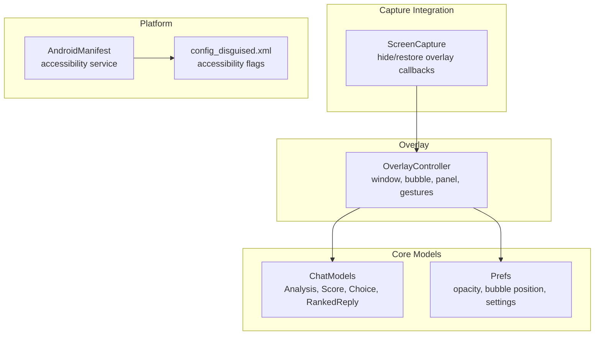

**Diagram sources**
- [OverlayController.kt:38-122](file://app/src/main/java/com/jev/probe/overlay/OverlayController.kt#L38-L122)
- [ChatModels.kt:40-58](file://app/src/main/java/com/jev/probe/core/ChatModels.kt#L40-L58)
- [Prefs.kt:196-209](file://app/src/main/java/com/jev/probe/core/Prefs.kt#L196-L209)
- [ScreenCapture.kt:35-39](file://app/src/main/java/com/jev/probe/capture/ocr/ScreenCapture.kt#L35-L39)
- [AndroidManifest.xml:38-48](file://app/src/main/AndroidManifest.xml#L38-L48)
- [config_disguised.xml:1-9](file://app/src/main/res/xml/config_disguised.xml#L1-L9)

**Section sources**
- [OverlayController.kt:29-37](file://app/src/main/java/com/jev/probe/overlay/OverlayController.kt#L29-L37)
- [AndroidManifest.xml:38-57](file://app/src/main/AndroidManifest.xml#L38-L57)
- [config_disguised.xml:1-9](file://app/src/main/res/xml/config_disguised.xml#L1-L9)

## Core Components
- `OverlayController`: owns the overlay window, bubble, translucent panel, touch handling, state transitions, and rendering of analysis results.
- `Analysis`, `Score`, `Choice`, `RankedReply`: model the AI judgment and ranked replies rendered by the overlay.
- `Prefs`: stores overlay opacity, bubble position, and app-wide configuration used by the overlay.
- `ScreenCapture`: coordinates screenshot capture and asks the overlay to hide temporarily so it is not included in the screenshot.

Key responsibilities:
- Window lifecycle and permission gating
- Bubble positioning and persistence
- Panel expansion and scrollable content
- Gesture handling for drag, tap, and long press
- Rendering idle, loading, error, paywall, notice, and result states
- Danger visualization, intent display, and ranked reply cards

**Section sources**
- [OverlayController.kt:38-78](file://app/src/main/java/com/jev/probe/overlay/OverlayController.kt#L38-L78)
- [ChatModels.kt:40-58](file://app/src/main/java/com/jev/probe/core/ChatModels.kt#L40-L58)
- [Prefs.kt:196-209](file://app/src/main/java/com/jev/probe/core/Prefs.kt#L196-L209)
- [ScreenCapture.kt:35-39](file://app/src/main/java/com/jev/probe/capture/ocr/ScreenCapture.kt#L35-L39)

## Architecture Overview
The overlay is a single-window UI layer above all apps. It is created lazily when first needed and removed explicitly when hidden. The bubble is always present; the panel is expanded or collapsed based on user interaction.

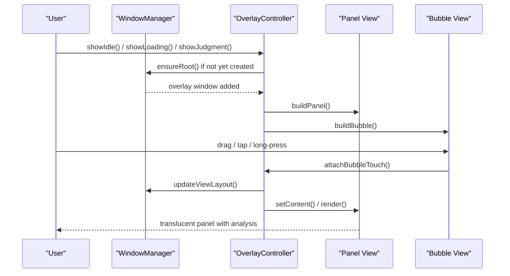

**Diagram sources**
- [OverlayController.kt:97-122](file://app/src/main/java/com/jev/probe/overlay/OverlayController.kt#L97-L122)
- [OverlayController.kt:124-150](file://app/src/main/java/com/jev/probe/overlay/OverlayController.kt#L124-L150)
- [OverlayController.kt:153-187](file://app/src/main/java/com/jev/probe/overlay/OverlayController.kt#L153-L187)
- [OverlayController.kt:198-233](file://app/src/main/java/com/jev/probe/overlay/OverlayController.kt#L198-L233)
- [OverlayController.kt:428-483](file://app/src/main/java/com/jev/probe/overlay/OverlayController.kt#L428-L483)

## Detailed Component Analysis

### OverlayController Class Architecture
`OverlayController` encapsulates:
- Window management via `WindowManager.LayoutParams` and `TYPE_APPLICATION_OVERLAY`
- Bubble construction with a circular background and a danger indicator dot
- Translucent panel with rounded corners, elevation, header controls, and a scrollable content area
- Touch handling for dragging, tapping, and long-press menu
- State methods: idle, loading, error, paywall, notice, judgment, replies, and hiding

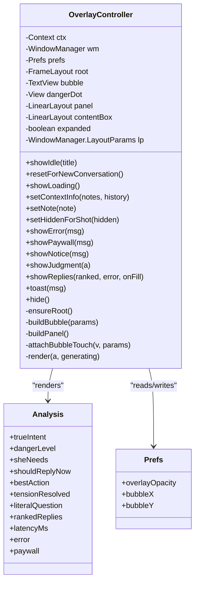

**Diagram sources**
- [OverlayController.kt:38-78](file://app/src/main/java/com/jev/probe/overlay/OverlayController.kt#L38-L78)
- [OverlayController.kt:97-122](file://app/src/main/java/com/jev/probe/overlay/OverlayController.kt#L97-L122)
- [OverlayController.kt:124-150](file://app/src/main/java/com/jev/probe/overlay/OverlayController.kt#L124-L150)
- [OverlayController.kt:153-187](file://app/src/main/java/com/jev/probe/overlay/OverlayController.kt#L153-L187)
- [OverlayController.kt:288-424](file://app/src/main/java/com/jev/probe/overlay/OverlayController.kt#L288-L424)
- [ChatModels.kt:40-58](file://app/src/main/java/com/jev/probe/core/ChatModels.kt#L40-L58)
- [Prefs.kt:196-209](file://app/src/main/java/com/jev/probe/core/Prefs.kt#L196-L209)

**Section sources**
- [OverlayController.kt:38-78](file://app/src/main/java/com/jev/probe/overlay/OverlayController.kt#L38-L78)
- [OverlayController.kt:97-122](file://app/src/main/java/com/jev/probe/overlay/OverlayController.kt#L97-L122)
- [OverlayController.kt:124-150](file://app/src/main/java/com/jev/probe/overlay/OverlayController.kt#L124-L150)
- [OverlayController.kt:153-187](file://app/src/main/java/com/jev/probe/overlay/OverlayController.kt#L153-L187)
- [OverlayController.kt:288-424](file://app/src/main/java/com/jev/probe/overlay/OverlayController.kt#L288-L424)
- [ChatModels.kt:40-58](file://app/src/main/java/com/jev/probe/core/ChatModels.kt#L40-L58)
- [Prefs.kt:196-209](file://app/src/main/java/com/jev/probe/core/Prefs.kt#L196-L209)

### Window Management
- The overlay uses `TYPE_APPLICATION_OVERLAY` and `FLAG_NOT_FOCUSABLE`, so it floats above other apps without stealing input focus.
- Permission is checked via `Settings.canDrawOverlays`. If denied, the controller logs a warning and does not create the view.
- The root `FrameLayout` holds both the panel and the bubble. Adding/removing the root view manages visibility at the window level.
- When hidden for screenshots, the overlay becomes `INVISIBLE` rather than removed, preserving the window across the capture round trip.

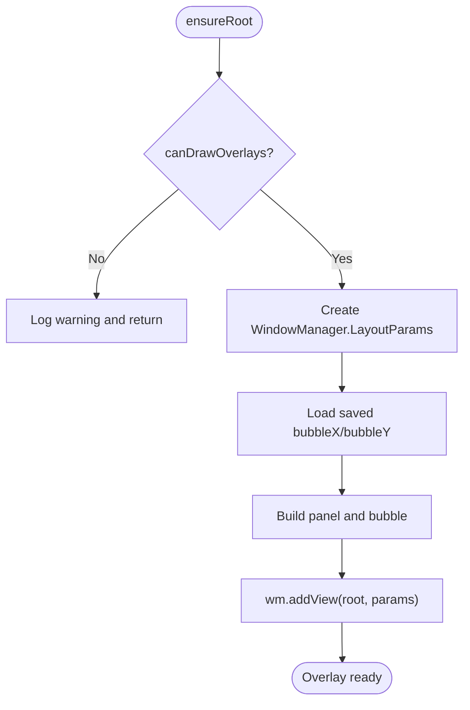

**Diagram sources**
- [OverlayController.kt:78-81](file://app/src/main/java/com/jev/probe/overlay/OverlayController.kt#L78-L81)
- [OverlayController.kt:97-122](file://app/src/main/java/com/jev/probe/overlay/OverlayController.kt#L97-L122)
- [OverlayController.kt:353-355](file://app/src/main/java/com/jev/probe/overlay/OverlayController.kt#L353-L355)

**Section sources**
- [OverlayController.kt:78-81](file://app/src/main/java/com/jev/probe/overlay/OverlayController.kt#L78-L81)
- [OverlayController.kt:97-122](file://app/src/main/java/com/jev/probe/overlay/OverlayController.kt#L97-L122)
- [OverlayController.kt:353-355](file://app/src/main/java/com/jev/probe/overlay/OverlayController.kt#L353-L355)

### Bubble Positioning and Persistence
- The bubble starts at saved coordinates from `Prefs.bubbleX` and `Prefs.bubbleY`; defaults are applied when values are missing or out of bounds.
- Dragging updates `params.x` and `params.y` within safe screen margins.
- On release, if the bubble moved, its new position is persisted to `Prefs`.
- Tapping toggles the panel; long pressing opens the bubble menu.

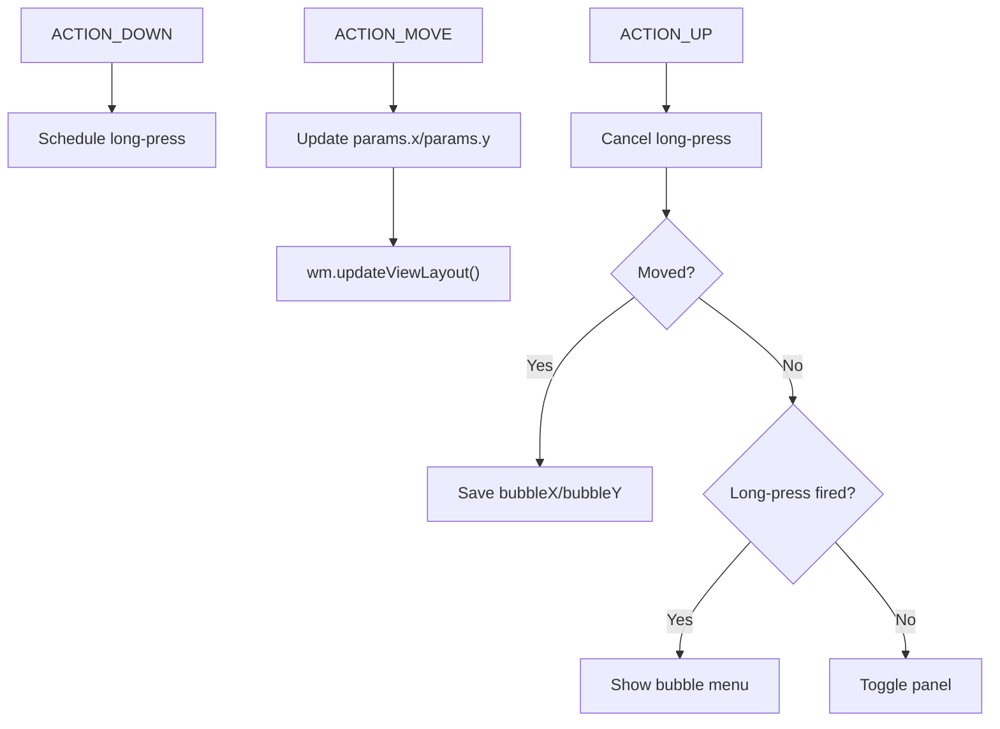

**Diagram sources**
- [OverlayController.kt:198-233](file://app/src/main/java/com/jev/probe/overlay/OverlayController.kt#L198-L233)
- [Prefs.kt:201-209](file://app/src/main/java/com/jev/probe/core/Prefs.kt#L201-L209)

**Section sources**
- [OverlayController.kt:107-110](file://app/src/main/java/com/jev/probe/overlay/OverlayController.kt#L107-L110)
- [OverlayController.kt:198-233](file://app/src/main/java/com/jev/probe/overlay/OverlayController.kt#L198-L233)
- [Prefs.kt:201-209](file://app/src/main/java/com/jev/probe/core/Prefs.kt#L201-L209)

### Draggable Bubble Interface and Long-Press Menu
- Drag threshold avoids accidental movement and prevents MIUI back-gesture conflicts by keeping margins away from extreme edges.
- Long press opens a menu with actions: manual OCR capture, save contact, open settings, hide assistant once, and cancel.
- The menu is part of the overlay view hierarchy and is removed after an action completes.

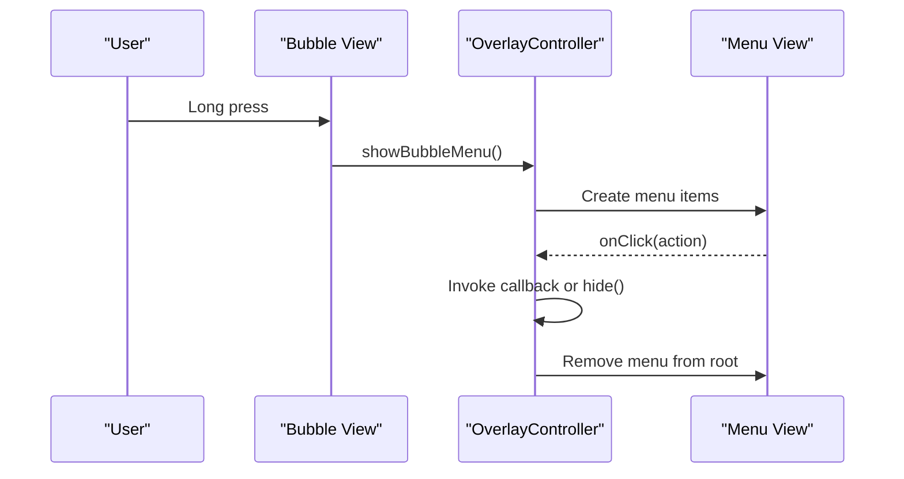

**Diagram sources**
- [OverlayController.kt:201-203](file://app/src/main/java/com/jev/probe/overlay/OverlayController.kt#L201-L203)
- [OverlayController.kt:235-249](file://app/src/main/java/com/jev/probe/overlay/OverlayController.kt#L235-L249)

**Section sources**
- [OverlayController.kt:198-233](file://app/src/main/java/com/jev/probe/overlay/OverlayController.kt#L198-L233)
- [OverlayController.kt:235-249](file://app/src/main/java/com/jev/probe/overlay/OverlayController.kt#L235-L249)

### Translucent Panel System
- The panel background is white with alpha derived from `Prefs.overlayOpacity`, clamped to a readable range.
- The panel has rounded corners, stroke, elevation, and padding.
- Content is wrapped in a `ScrollView` capped at a fraction of screen height to avoid covering input boxes or keyboards.
- Opacity changes are reapplied when rendering to reflect user adjustments.

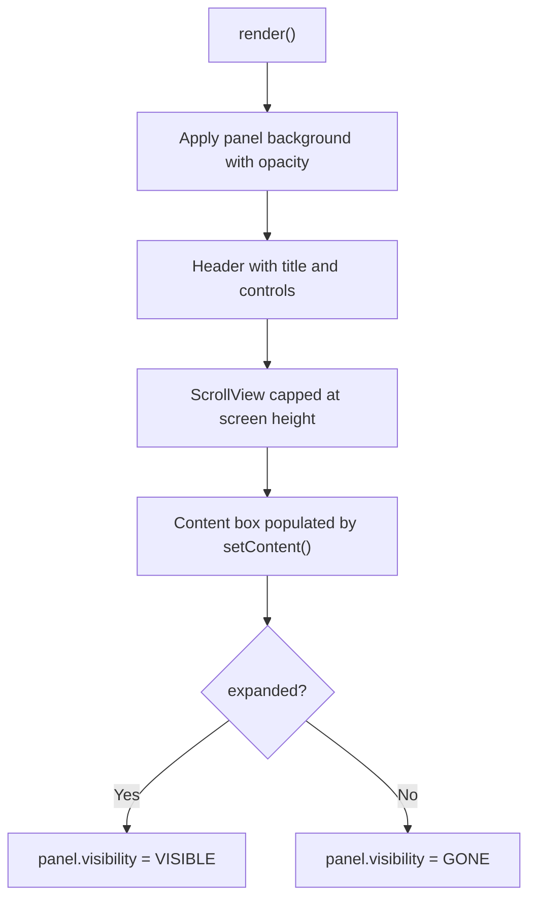

**Diagram sources**
- [OverlayController.kt:83-93](file://app/src/main/java/com/jev/probe/overlay/OverlayController.kt#L83-L93)
- [OverlayController.kt:153-187](file://app/src/main/java/com/jev/probe/overlay/OverlayController.kt#L153-L187)
- [OverlayController.kt:433-435](file://app/src/main/java/com/jev/probe/overlay/OverlayController.kt#L433-L435)
- [Prefs.kt:196-199](file://app/src/main/java/com/jev/probe/core/Prefs.kt#L196-L199)

**Section sources**
- [OverlayController.kt:83-93](file://app/src/main/java/com/jev/probe/overlay/OverlayController.kt#L83-L93)
- [OverlayController.kt:153-187](file://app/src/main/java/com/jev/probe/overlay/OverlayController.kt#L153-L187)
- [OverlayController.kt:433-435](file://app/src/main/java/com/jev/probe/overlay/OverlayController.kt#L433-L435)
- [Prefs.kt:196-199](file://app/src/main/java/com/jev/probe/core/Prefs.kt#L196-L199)

### UI State Management
States exposed by public methods:
- Idle: shows a hint and a manual analyze button when no analysis is parked.
- Loading: clears context counters, shows “analyzing” hint, and expands the panel.
- Error: shows a red error line and message.
- Paywall: explains trial expiration and offers subscription or BYOK flow.
- Notice: shows a non-error notice and expands once.
- Judgment: renders analysis while generating replies.
- Replies: renders ranked reply cards or an error/empty message.

State transitions also manage bubble alpha, panel visibility, and conversation reset to prevent stale data.

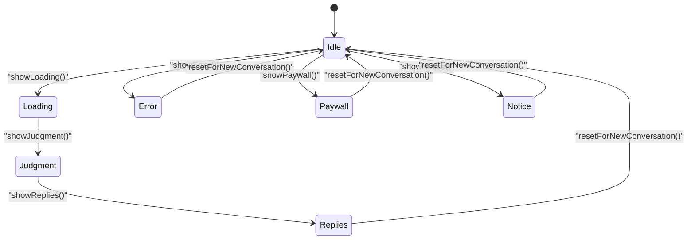

**Diagram sources**
- [OverlayController.kt:288-319](file://app/src/main/java/com/jev/probe/overlay/OverlayController.kt#L288-L319)
- [OverlayController.kt:331-380](file://app/src/main/java/com/jev/probe/overlay/OverlayController.kt#L331-L380)
- [OverlayController.kt:396-416](file://app/src/main/java/com/jev/probe/overlay/OverlayController.kt#L396-L416)

**Section sources**
- [OverlayController.kt:288-319](file://app/src/main/java/com/jev/probe/overlay/OverlayController.kt#L288-L319)
- [OverlayController.kt:331-380](file://app/src/main/java/com/jev/probe/overlay/OverlayController.kt#L331-L380)
- [OverlayController.kt:396-416](file://app/src/main/java/com/jev/probe/overlay/OverlayController.kt#L396-L416)

### Danger Level Visualization
Danger is shown as a color-coded badge with numeric score and descriptive label. The bubble’s danger dot is tinted to match the current risk level.

- Color thresholds map low, medium, and high scores to green, amber, and red.
- Text labels provide quick interpretation.
- The bubble dot is updated whenever a new judgment arrives.

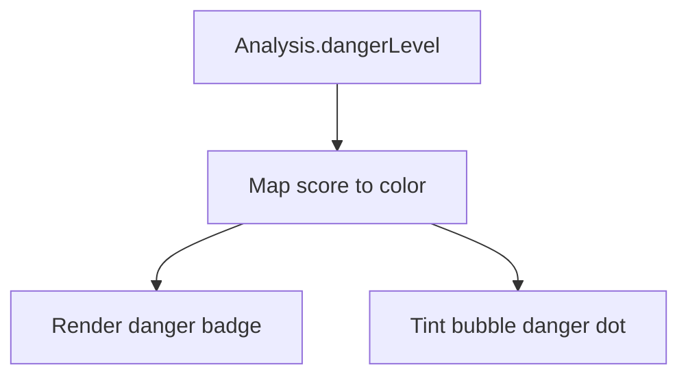

**Diagram sources**
- [OverlayController.kt:446-451](file://app/src/main/java/com/jev/probe/overlay/OverlayController.kt#L446-L451)
- [OverlayController.kt:485-501](file://app/src/main/java/com/jev/probe/overlay/OverlayController.kt#L485-L501)
- [OverlayController.kt:550-555](file://app/src/main/java/com/jev/probe/overlay/OverlayController.kt#L550-L555)
- [OverlayController.kt:581-592](file://app/src/main/java/com/jev/probe/overlay/OverlayController.kt#L581-L592)

**Section sources**
- [OverlayController.kt:446-451](file://app/src/main/java/com/jev/probe/overlay/OverlayController.kt#L446-L451)
- [OverlayController.kt:485-501](file://app/src/main/java/com/jev/probe/overlay/OverlayController.kt#L485-L501)
- [OverlayController.kt:550-555](file://app/src/main/java/com/jev/probe/overlay/OverlayController.kt#L550-L555)
- [OverlayController.kt:581-592](file://app/src/main/java/com/jev/probe/overlay/OverlayController.kt#L581-L592)

### Intent Display and Secondary Signals
The panel shows:
- True intent with mapped label and confidence percentage
- Secondary signals: what the other person needs, best action, and whether to reply with substance now
- Optional tension-resolved indicator

These fields come from `Analysis.trueIntent`, `Analysis.sheNeeds`, `Analysis.bestAction`, and `Analysis.shouldReplyNow`.

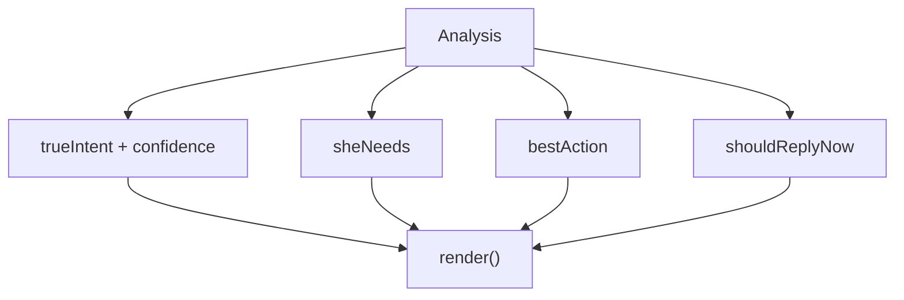

**Diagram sources**
- [OverlayController.kt:452-463](file://app/src/main/java/com/jev/probe/overlay/OverlayController.kt#L452-L463)
- [ChatModels.kt:40-58](file://app/src/main/java/com/jev/probe/core/ChatModels.kt#L40-L58)

**Section sources**
- [OverlayController.kt:452-463](file://app/src/main/java/com/jev/probe/overlay/OverlayController.kt#L452-L463)
- [ChatModels.kt:40-58](file://app/src/main/java/com/jev/probe/core/ChatModels.kt#L40-L58)

### Ranked Reply Cards with Copy and Fill
Each ranked reply card includes:
- Rank number and probability percentage
- Reply text
- Copy button using the system clipboard
- Fill button that invokes a callback to populate the target app’s input field and collapses the panel

If no replies are generated, a hint explains either an API error or absence of candidates.

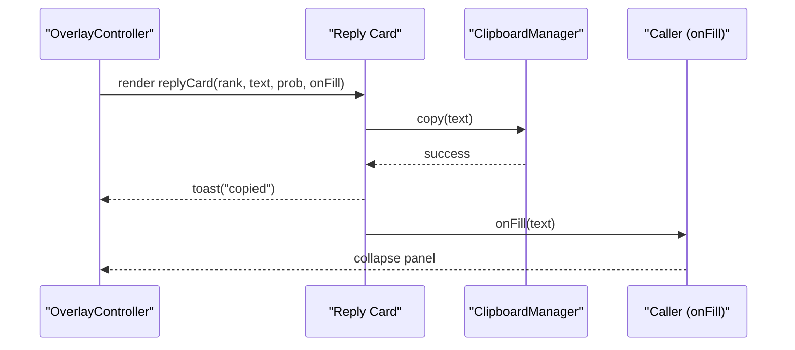

**Diagram sources**
- [OverlayController.kt:504-529](file://app/src/main/java/com/jev/probe/overlay/OverlayController.kt#L504-L529)
- [OverlayController.kt:575-579](file://app/src/main/java/com/jev/probe/overlay/OverlayController.kt#L575-L579)
- [OverlayController.kt:410-416](file://app/src/main/java/com/jev/probe/overlay/OverlayController.kt#L410-L416)

**Section sources**
- [OverlayController.kt:470-478](file://app/src/main/java/com/jev/probe/overlay/OverlayController.kt#L470-L478)
- [OverlayController.kt:504-529](file://app/src/main/java/com/jev/probe/overlay/OverlayController.kt#L504-L529)
- [OverlayController.kt:575-579](file://app/src/main/java/com/jev/probe/overlay/OverlayController.kt#L575-L579)
- [OverlayController.kt:410-416](file://app/src/main/java/com/jev/probe/overlay/OverlayController.kt#L410-L416)

### Screenshot Integration and Cross-App Compatibility
- The overlay must be hidden during screenshots so it is not baked into the captured image.
- `ScreenCapture` accepts hide and restore callbacks; `OverlayController.setHiddenForShot` toggles overlay visibility without destroying the window.
- The accessibility service configuration enables event capture, interactive window retrieval, and screenshot capability.
- The manifest declares the accessibility service and a foreground keep-alive service to mitigate aggressive OEM process killing.

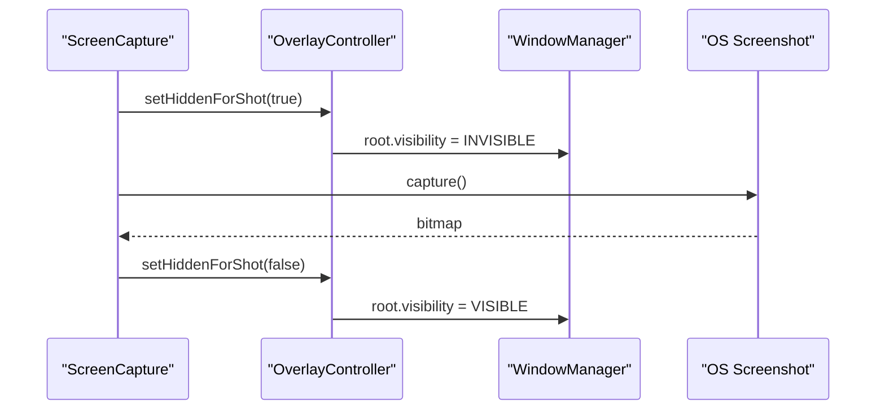

**Diagram sources**
- [OverlayController.kt:353-355](file://app/src/main/java/com/jev/probe/overlay/OverlayController.kt#L353-L355)
- [ScreenCapture.kt:35-39](file://app/src/main/java/com/jev/probe/capture/ocr/ScreenCapture.kt#L35-L39)
- [AndroidManifest.xml:38-57](file://app/src/main/AndroidManifest.xml#L38-L57)
- [config_disguised.xml:1-9](file://app/src/main/res/xml/config_disguised.xml#L1-L9)

**Section sources**
- [OverlayController.kt:353-355](file://app/src/main/java/com/jev/probe/overlay/OverlayController.kt#L353-L355)
- [ScreenCapture.kt:35-39](file://app/src/main/java/com/jev/probe/capture/ocr/ScreenCapture.kt#L35-L39)
- [AndroidManifest.xml:38-57](file://app/src/main/AndroidManifest.xml#L38-L57)
- [config_disguised.xml:1-9](file://app/src/main/res/xml/config_disguised.xml#L1-L9)

## Dependency Analysis
The overlay depends on:
- Core models for analysis output
- Shared preferences for overlay appearance and position
- Platform services for window management, clipboard access, and accessibility permissions
- Screenshot capture integration for cross-app compatibility

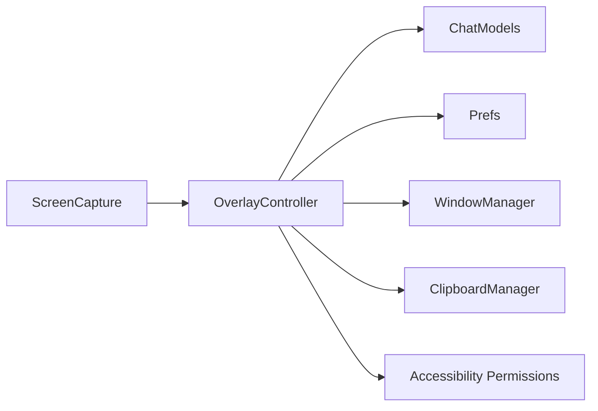

**Diagram sources**
- [OverlayController.kt:3-26](file://app/src/main/java/com/jev/probe/overlay/OverlayController.kt#L3-L26)
- [OverlayController.kt:575-579](file://app/src/main/java/com/jev/probe/overlay/OverlayController.kt#L575-L579)
- [ChatModels.kt:40-58](file://app/src/main/java/com/jev/probe/core/ChatModels.kt#L40-L58)
- [Prefs.kt:196-209](file://app/src/main/java/com/jev/probe/core/Prefs.kt#L196-L209)
- [ScreenCapture.kt:35-39](file://app/src/main/java/com/jev/probe/capture/ocr/ScreenCapture.kt#L35-L39)

**Section sources**
- [OverlayController.kt:3-26](file://app/src/main/java/com/jev/probe/overlay/OverlayController.kt#L3-L26)
- [ChatModels.kt:40-58](file://app/src/main/java/com/jev/probe/core/ChatModels.kt#L40-L58)
- [Prefs.kt:196-209](file://app/src/main/java/com/jev/probe/core/Prefs.kt#L196-L209)
- [ScreenCapture.kt:35-39](file://app/src/main/java/com/jev/probe/capture/ocr/ScreenCapture.kt#L35-L39)

## Performance Considerations
- Avoid unnecessary view rebuilds: `ensureRoot` creates the overlay only once.
- Use `runCatching` around window operations to tolerate platform exceptions without crashing.
- Keep the panel height bounded to a fraction of screen height to reduce layout cost and avoid covering input areas.
- Persist bubble position to avoid recomputing initial placement.
- Reapply panel background on each render to reflect opacity changes efficiently.
- Hide the overlay during screenshots to prevent capturing the overlay itself and to avoid extra compositor work.
- Avoid forcing edge snapping; free positioning reduces gesture conflicts and improves responsiveness on OEM skins.

[No sources needed since this section provides general guidance]

## Troubleshooting Guide
Common issues and remedies:
- Overlay not appearing: check `Settings.canDrawOverlays` and log warnings when disabled.
- Bubble stuck near screen edge: use margin constraints and avoid forced edge snapping to prevent MIUI back-gesture interference.
- Stale analysis data: call `resetForNewConversation()` before switching conversations to clear last judgment, fill callback, note, and reply error.
- Empty panel: ensure `setContent` is called and that `lastJudgment` is not stale; idle state restores the manual analyze button when content is empty.
- Screenshot captures overlay: toggle `setHiddenForShot` around capture calls.
- Panel covers input box: panel top position is constrained and height is capped; expand only when necessary.

**Section sources**
- [OverlayController.kt:78-81](file://app/src/main/java/com/jev/probe/overlay/OverlayController.kt#L78-L81)
- [OverlayController.kt:214-218](file://app/src/main/java/com/jev/probe/overlay/OverlayController.kt#L214-L218)
- [OverlayController.kt:313-319](file://app/src/main/java/com/jev/probe/overlay/OverlayController.kt#L313-L319)
- [OverlayController.kt:295-302](file://app/src/main/java/com/jev/probe/overlay/OverlayController.kt#L295-L302)
- [OverlayController.kt:353-355](file://app/src/main/java/com/jev/probe/overlay/OverlayController.kt#L353-L355)
- [OverlayController.kt:175-181](file://app/src/main/java/com/jev/probe/overlay/OverlayController.kt#L175-L181)

## Conclusion
The floating overlay system provides a lightweight, non-intrusive interface for displaying AI analysis results over any app. Its architecture cleanly separates window management, gesture handling, panel rendering, and data presentation. With adjustable opacity, persistent bubble positioning, robust state transitions, and careful integration with screenshot capture, it balances usability, performance, and cross-app compatibility. For further improvements, consider adding explicit accessibility labels to dynamic views, improving keyboard navigation support where applicable, and centralizing string resources for internationalization.

[No sources needed since this section summarizes without analyzing specific files]