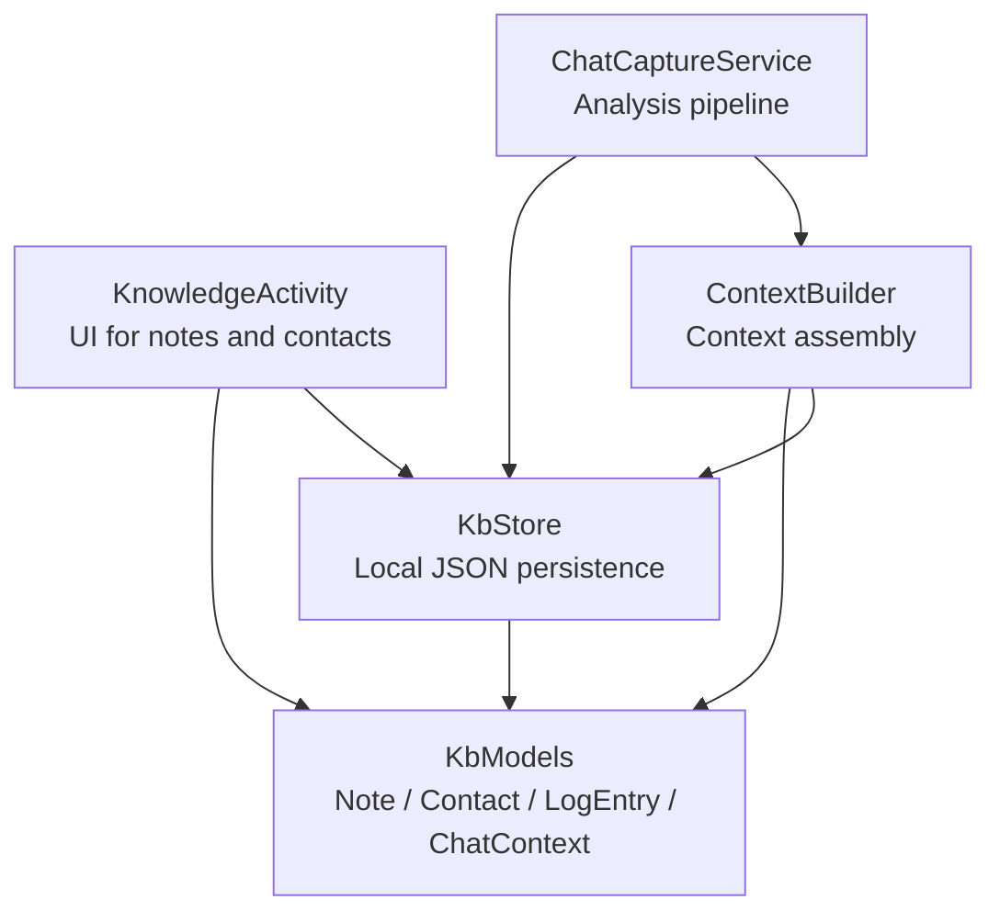
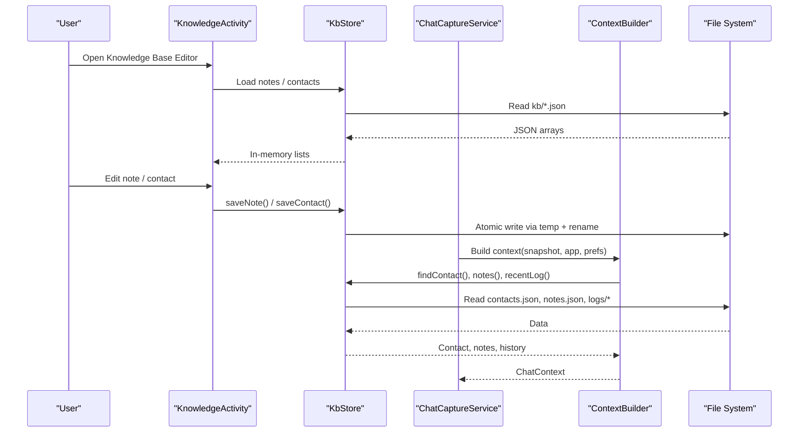
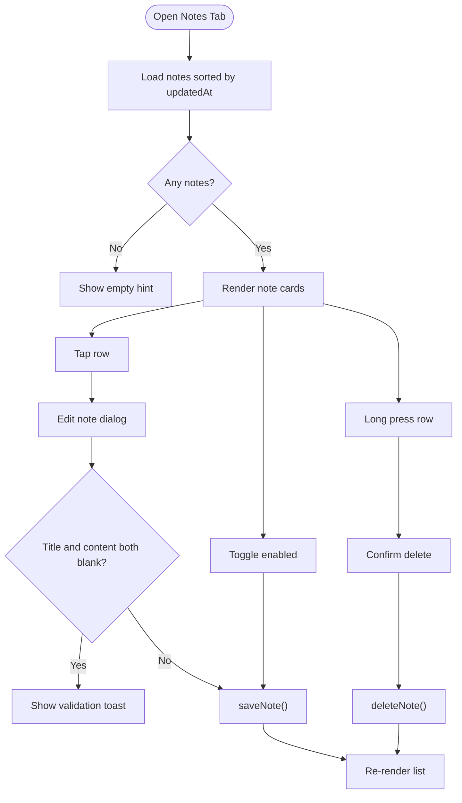
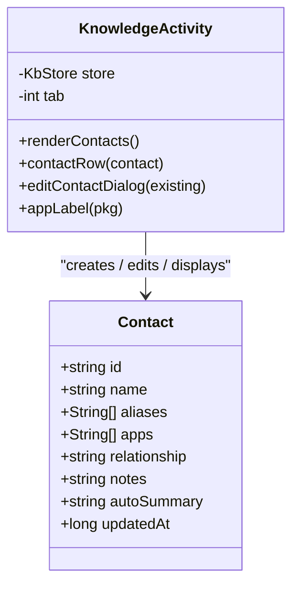
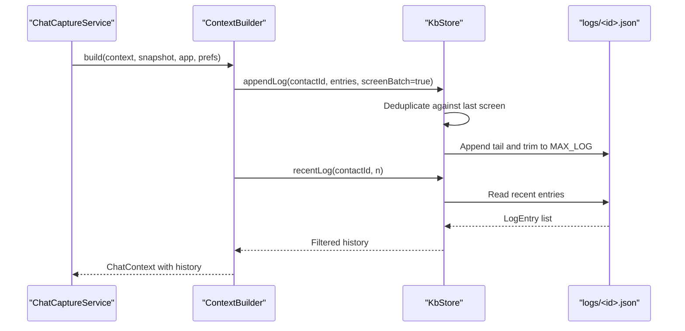
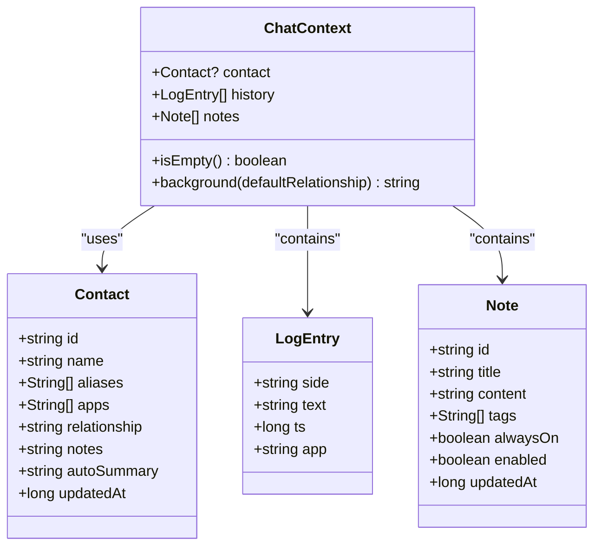
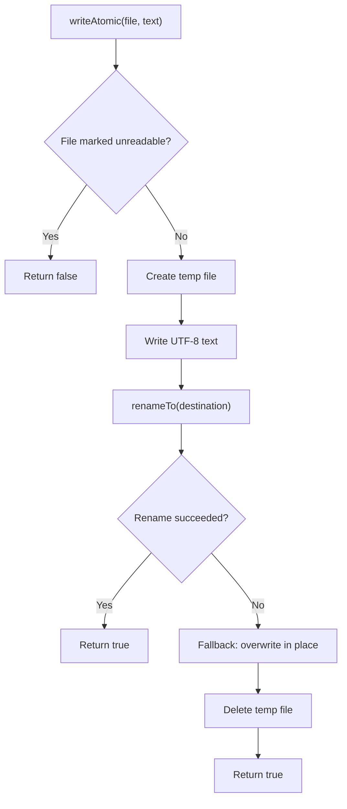
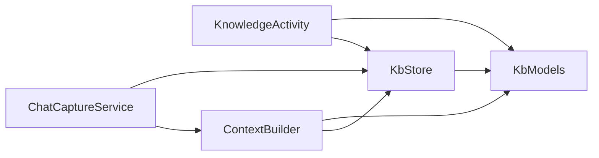

# Knowledge Base Editor

<cite>
**Referenced Files in This Document**
- [KnowledgeActivity.kt](file://app/src/main/java/com/jev/probe/KnowledgeActivity.kt)
- [KbStore.kt](file://app/src/main/java/com/jev/probe/core/kb/KbStore.kt)
- [KbModels.kt](file://app/src/main/java/com/jev/probe/core/kb/KbModels.kt)
- [ContextBuilder.kt](file://app/src/main/java/com/jev/probe/core/kb/ContextBuilder.kt)
- [KbSelfCheck.kt](file://app/src/main/java/com/jev/probe/core/kb/KbSelfCheck.kt)
- [ChatModels.kt](file://app/src/main/java/com/jev/probe/core/ChatModels.kt)
- [ConversationSession.kt](file://app/src/main/java/com/jev/probe/capture/ConversationSession.kt)
- [ChatCaptureService.kt](file://app/src/main/java/com/jev/probe/capture/ChatCaptureService.kt)
</cite>

## Table of Contents
1. [Introduction](#introduction)
2. [Project Structure](#project-structure)
3. [Core Components](#core-components)
4. [Architecture Overview](#architecture-overview)
5. [Detailed Component Analysis](#detailed-component-analysis)
6. [Dependency Analysis](#dependency-analysis)
7. [Performance Considerations](#performance-considerations)
8. [Troubleshooting Guide](#troubleshooting-guide)
9. [Conclusion](#conclusion)
10. [Appendices](#appendices)

## Introduction
The Knowledge Base Editor is the user-facing interface for managing a local knowledge base that improves AI-assisted chat analysis. It lets users:
- Create and edit notes with titles, content, tags, and activation flags.
- Manage contacts, including names, aliases, app sources, relationships, and personal notes.
- Track per-contact chat history captured from conversations.
- Control how much context is injected into AI analysis, including note matching and recent conversation history.

The system is intentionally local: all data lives under the app’s private files directory as JSON files. There is no built-in network sync or external database. The editor provides manual import of plain text notes, but does not expose bulk export/import for JSON or CSV, nor does it provide backup/restore UI. Data integrity is protected by atomic writes and corruption handling.

## Project Structure
The knowledge base spans one UI activity and several core modules:

**Diagram sources**
- [KnowledgeActivity.kt:32-74](file://app/src/main/java/com/jev/probe/KnowledgeActivity.kt#L32-L74)
- [KbStore.kt:12-33](file://app/src/main/java/com/jev/probe/core/kb/KbStore.kt#L12-L33)
- [KbModels.kt:11-52](file://app/src/main/java/com/jev/probe/core/kb/KbModels.kt#L11-L52)
- [ContextBuilder.kt:8-19](file://app/src/main/java/com/jev/probe/core/kb/ContextBuilder.kt#L8-L19)
- [ChatCaptureService.kt:389-416](file://app/src/main/java/com/jev/probe/capture/ChatCaptureService.kt#L389-L416)

**Section sources**
- [KnowledgeActivity.kt:24-31](file://app/src/main/java/com/jev/probe/KnowledgeActivity.kt#L24-L31)
- [KbStore.kt:12-23](file://app/src/main/java/com/jev/probe/core/kb/KbStore.kt#L12-L23)
- [KbModels.kt:1-9](file://app/src/main/java/com/jev/probe/core/kb/KbModels.kt#L1-L9)

## Core Components
- **KnowledgeActivity**: Renders two tabs — Notes and Contacts. It creates, edits, toggles, imports, deletes, and clears entries through KbStore.
- **KbStore**: Thread-safe persistence layer over `filesDir/kb`. It stores notes, contacts, and per-contact logs. It also normalizes names, merges contacts, and manages history deduplication.
- **KbModels**: Defines Note, Contact, LogEntry, and ChatContext, plus background formatting logic used when injecting context into AI prompts.
- **ContextBuilder**: Builds the extra context sent to AI analysis: matched contact, recent history, and matched notes, subject to character budget and windowing rules.
- **KbSelfCheck**: On-device smoke test exercising name normalization, note matching, history deduplication, and context injection.
- **ChatModels and ConversationSession**: Provide chat snapshot and session state consumed by the capture service and context builder.

**Section sources**
- [KnowledgeActivity.kt:32-74](file://app/src/main/java/com/jev/probe/KnowledgeActivity.kt#L32-L74)
- [KbStore.kt:24-41](file://app/src/main/java/com/jev/probe/core/kb/KbStore.kt#L24-L41)
- [KbModels.kt:11-52](file://app/src/main/java/com/jev/probe/core/kb/KbModels.kt#L11-L52)
- [ContextBuilder.kt:8-19](file://app/src/main/java/com/jev/probe/core/kb/ContextBuilder.kt#L8-L19)
- [KbSelfCheck.kt:8-18](file://app/src/main/java/com/jev/probe/core/kb/KbSelfCheck.kt#L8-L18)
- [ChatModels.kt:5-38](file://app/src/main/java/com/jev/probe/core/ChatModels.kt#L5-L38)
- [ConversationSession.kt:3-35](file://app/src/main/java/com/jev/probe/capture/ConversationSession.kt#L3-L35)

## Architecture Overview
The knowledge base has three layers:
1. **User Interface Layer**: KnowledgeActivity renders notes and contacts, validates input, and delegates persistence to KbStore.
2. **Persistence Layer**: KbStore serializes data to JSON files, caches in memory, and protects against partial writes and corrupt files.
3. **Analysis Integration Layer**: ContextBuilder reads current chat snapshots and preferences, then builds ChatContext for AI analysis.

**Diagram sources**
- [KnowledgeActivity.kt:49-74](file://app/src/main/java/com/jev/probe/KnowledgeActivity.kt#L49-L74)
- [KbStore.kt:44-81](file://app/src/main/java/com/jev/probe/core/kb/KbStore.kt#L44-L81)
- [KbStore.kt:438-459](file://app/src/main/java/com/jev/probe/core/kb/KbStore.kt#L438-L459)
- [ContextBuilder.kt:35-63](file://app/src/main/java/com/jev/probe/core/kb/ContextBuilder.kt#L35-L63)
- [ChatCaptureService.kt:389-416](file://app/src/main/java/com/jev/probe/capture/ChatCaptureService.kt#L389-L416)

## Detailed Component Analysis

### KnowledgeActivity: Notes Management
Notes are free-text knowledge items with:
- Title and content.
- Tags used for keyword matching.
- Always-on flag to force inclusion regardless of conversation topic.
- Enabled flag to toggle whether a note participates in matching.

Key behaviors:
- New notes can be created through an inline dialog.
- Existing notes can be edited by tapping their card.
- Long-pressing a note deletes it after confirmation.
- A toggle enables/disables a note without deleting it.
- Plain-text import splits blocks separated by blank lines; the first line becomes the title, remaining lines become content.

Validation rules:
- Both title and content cannot be empty at the same time.
- Tags are split by commas, full-width commas, and enumeration commas, then trimmed and filtered.

Search behavior:
- Notes match if any tag or title appears in the conversation title or the last six messages.
- Always-on notes are always included; other notes are limited by a character budget and hit cap.

**Diagram sources**
- [KnowledgeActivity.kt:102-144](file://app/src/main/java/com/jev/probe/KnowledgeActivity.kt#L102-L144)
- [KnowledgeActivity.kt:146-182](file://app/src/main/java/com/jev/probe/KnowledgeActivity.kt#L146-L182)
- [KnowledgeActivity.kt:184-217](file://app/src/main/java/com/jev/probe/KnowledgeActivity.kt#L184-L217)

**Section sources**
- [KnowledgeActivity.kt:102-217](file://app/src/main/java/com/jev/probe/KnowledgeActivity.kt#L102-L217)
- [KbModels.kt:11-21](file://app/src/main/java/com/jev/probe/core/kb/KbModels.kt#L11-L21)
- [ContextBuilder.kt:93-116](file://app/src/main/java/com/jev/probe/core/kb/ContextBuilder.kt#L93-L116)

### KnowledgeActivity: Contacts Management
Contacts represent people or groups across chat apps. Each contact includes:
- Name.
- Aliases (one per line).
- App package names where the contact was seen.
- Relationship description.
- Personal notes about the person.
- Auto-summary field reserved for future use.

Key behaviors:
- New contacts are created through a dialog.
- Existing contacts are edited by tapping their card.
- Long-pressing a contact deletes it along with its history.
- A “clear history” action removes only the chat log for that contact, keeping the contact profile intact.

Matching behavior:
- A conversation title matches a contact if it equals the contact name or any alias after normalization.
- Normalization removes zero-width characters, trailing group member counts like `(12)` or full-width equivalents, trims whitespace, and lowercases.

**Diagram sources**
- [KbModels.kt:23-39](file://app/src/main/java/com/jev/probe/core/kb/KbModels.kt#L23-L39)
- [KnowledgeActivity.kt:221-317](file://app/src/main/java/com/jev/probe/KnowledgeActivity.kt#L221-L317)

**Section sources**
- [KnowledgeActivity.kt:221-317](file://app/src/main/java/com/jev/probe/KnowledgeActivity.kt#L221-L317)
- [KbStore.kt:98-145](file://app/src/main/java/com/jev/probe/core/kb/KbStore.kt#L98-L145)
- [KbStore.kt:500-537](file://app/src/main/java/com/jev/probe/core/kb/KbStore.kt#L500-L537)

### KnowledgeActivity: Chat History Tracking
Per-contact chat history is stored as a sequence of LogEntry objects:
- Side: “me” or “other”.
- Text: message content.
- Timestamp.
- App package name.

History management:
- History is appended during analysis when enabled in preferences.
- Only the newest 300 lines are kept per contact.
- Recent history for AI analysis is configurable up to 100 lines.
- Messages currently on screen are excluded from injected history to avoid duplication.
- Users can clear a contact’s history without deleting the contact itself.

**Diagram sources**
- [ContextBuilder.kt:70-91](file://app/src/main/java/com/jev/probe/core/kb/ContextBuilder.kt#L70-L91)
- [KbStore.kt:149-241](file://app/src/main/java/com/jev/probe/core/kb/KbStore.kt#L149-L241)
- [ChatCaptureService.kt:389-416](file://app/src/main/java/com/jev/probe/capture/ChatCaptureService.kt#L389-L416)

**Section sources**
- [KbStore.kt:149-241](file://app/src/main/java/com/jev/probe/core/kb/KbStore.kt#L149-L241)
- [ContextBuilder.kt:70-91](file://app/src/main/java/com/jev/probe/core/kb/ContextBuilder.kt#L70-L91)
- [KnowledgeActivity.kt:249-270](file://app/src/main/java/com/jev/probe/KnowledgeActivity.kt#L249-L270)

### Data Model and Context Assembly
The data model separates concerns:
- Note: user-maintained facts.
- Contact: cross-app identity and relationship metadata.
- LogEntry: per-message history.
- ChatContext: assembled context for AI analysis.

ChatContext.background formats the injected context string:
- Relationship.
- Contact notes.
- Reserved auto-summary.
- Matched notes as “title: content”.

**Diagram sources**
- [KbModels.kt:11-85](file://app/src/main/java/com/jev/probe/core/kb/KbModels.kt#L11-L85)

**Section sources**
- [KbModels.kt:11-85](file://app/src/main/java/com/jev/probe/core/kb/KbModels.kt#L11-L85)
- [ContextBuilder.kt:35-63](file://app/src/main/java/com/jev/probe/core/kb/ContextBuilder.kt#L35-L63)

### Persistence and Integrity
KbStore uses:
- A single lock for all operations.
- In-memory caches for notes, contacts, and per-contact logs.
- Atomic file writes using a temporary file followed by rename.
- Corruption handling that moves unreadable files aside instead of silently overwriting them.
- Per-contact log caps at 300 lines.
- Last-screen key tracking to prevent duplicate captures.

**Diagram sources**
- [KbStore.kt:430-459](file://app/src/main/java/com/jev/probe/core/kb/KbStore.kt#L430-L459)

**Section sources**
- [KbStore.kt:19-23](file://app/src/main/java/com/jev/probe/core/kb/KbStore.kt#L19-L23)
- [KbStore.kt:401-459](file://app/src/main/java/com/jev/probe/core/kb/KbStore.kt#L401-L459)

### Self-Check and Validation
KbSelfCheck exercises:
- Name normalization across half-width and full-width parentheses and padding.
- Note keyword matching.
- History deduplication against on-screen messages.
- Background string composition.
- Opt-in history behavior.

It creates temporary data, runs checks, and cleans up afterward.

**Section sources**
- [KbSelfCheck.kt:8-18](file://app/src/main/java/com/jev/probe/core/kb/KbSelfCheck.kt#L8-L18)
- [KbSelfCheck.kt:28-126](file://app/src/main/java/com/jev/probe/core/kb/KbSelfCheck.kt#L28-L126)

## Dependency Analysis
The main dependencies are:

Coupling and cohesion:
- KnowledgeActivity depends only on KbStore and models for UI actions.
- KbStore encapsulates all persistence and normalization logic.
- ContextBuilder depends on KbStore and ChatSnapshot/Prefs to assemble context.
- ChatCaptureService orchestrates analysis and consumes ContextBuilder output.

Potential circular dependencies:
- None observed between these modules; dependencies flow from UI → service → builder → store → models.

External integration points:
- File system for JSON storage.
- Android SharedPreferences via Prefs for feature toggles and configuration.
- No direct network I/O inside the knowledge base modules.

**Section sources**
- [KnowledgeActivity.kt:19-22](file://app/src/main/java/com/jev/probe/KnowledgeActivity.kt#L19-L22)
- [ContextBuilder.kt:3-7](file://app/src/main/java/com/jev/probe/core/kb/ContextBuilder.kt#L3-L7)
- [ChatCaptureService.kt:389-416](file://app/src/main/java/com/jev/probe/capture/ChatCaptureService.kt#L389-L416)

## Performance Considerations
- **Character budget**: ContextBuilder limits injected notes and history to 1500 characters. Always-on notes are exempt from trimming; non-always-on notes are dropped oldest-first after history is trimmed.
- **Note matching window**: Only the last six messages are scanned for note keywords.
- **Hit cap**: At most five non-always-on notes are included.
- **History cap**: Logs are capped at 300 lines per contact; recent history for analysis is capped at 100 lines.
- **Deduplication**: Identical screens are skipped; overlapping tails are detected to avoid duplicating already recorded messages.
- **Caching**: KbStore caches notes, contacts, and per-contact logs to reduce repeated disk reads.
- **Atomic writes**: Temp-file + rename prevents partial JSON documents after crashes.

Optimization recommendations:
- Keep note tags concise and specific to improve substring matching accuracy.
- Use always-on notes sparingly for high-priority facts that should never be omitted.
- Avoid excessively long contact notes or relationship descriptions; they consume the shared character budget.
- Prefer meaningful titles and tags so notes match reliably without needing large content blocks.
- Limit history count to what is useful for your typical conversations to keep context compact.

[No sources needed since this section provides general guidance]

## Troubleshooting Guide
Common issues and resolutions:

- **Name mismatch across apps**:
  - Ensure aliases include alternate display names used in different chat apps.
  - Normalization ignores zero-width characters and trailing group member counts.
  - Use the self-check feature to verify normalization behavior.

- **Notes not matching**:
  - Add relevant tags or include keywords in the note title.
  - Remember that only the last six messages are scanned for matching.
  - Verify the note is enabled.

- **History not appearing**:
  - Confirm context history is enabled in preferences.
  - Check that the contact was matched; history injection requires a known contact.
  - Clearing history removes only logs, not the contact profile.

- **Corrupted knowledge base files**:
  - KbStore preserves damaged files with a `.corrupt.<timestamp>` suffix.
  - Do not manually overwrite unknown corrupt files; inspect them first.
  - Use the settings option to wipe the knowledge base if recovery is not possible.

- **Duplicate entries**:
  - Contacts are merged by name/alias/app; new titles may be added as aliases.
  - Notes are identified by id; saving with the same id replaces the existing entry.

- **Backup and restore**:
  - There is no built-in backup/restore UI.
  - Back up the app’s private files directory if you have device-level access.
  - Restore by placing the backed-up JSON files back into the same location before reinstalling or clearing app data.

**Section sources**
- [KbStore.kt:401-459](file://app/src/main/java/com/jev/probe/core/kb/KbStore.kt#L401-L459)
- [KbStore.kt:278-290](file://app/src/main/java/com/jev/probe/core/kb/KbStore.kt#L278-L290)
- [KbSelfCheck.kt:28-126](file://app/src/main/java/com/jev/probe/core/kb/KbSelfCheck.kt#L28-L126)

## Conclusion
The Knowledge Base Editor provides a focused, local-first way to enrich AI chat analysis with structured notes, cross-app contact identities, and recent conversation history. Its design emphasizes safety, simplicity, and predictability:
- Manual editing through a simple UI.
- Deterministic matching based on normalized names and substring keywords.
- Strict budgets and caps to keep injected context manageable.
- Robust persistence with atomic writes and corruption safeguards.

For best results, maintain concise, well-tagged notes, populate contact aliases accurately, and tune history and budget settings to match your conversation patterns. Since there is no built-in export/import or backup/restore UI, treat the local JSON files as your primary backup target and manage them carefully.

[No sources needed since this section summarizes without analyzing specific files]

## Appendices

### Data Storage Layout
- `filesDir/kb/notes.json`: All notes.
- `filesDir/kb/contacts.json`: All contacts.
- `filesDir/kb/logs/<contactId>.json`: Per-contact chat history.
- `filesDir/kb/logs/<contactId>.screen.json`: Last-screen keys for deduplication.

**Section sources**
- [KbStore.kt:12-17](file://app/src/main/java/com/jev/probe/core/kb/KbStore.kt#L12-L17)
- [KbStore.kt:29-33](file://app/src/main/java/com/jev/probe/core/kb/KbStore.kt#L29-L33)

### Bulk Operations and Formats
- **Import notes**: Supported via plain text with blank-line-separated blocks.
- **Export notes/contacts/history**: Not implemented in code.
- **JSON/CSV bulk operations**: Not implemented in code.
- **Backup/restore**: Not exposed in UI; relies on manual file management.

**Section sources**
- [KnowledgeActivity.kt:184-214](file://app/src/main/java/com/jev/probe/KnowledgeActivity.kt#L184-L214)
- [KbModels.kt:1-9](file://app/src/main/java/com/jev/probe/core/kb/KbModels.kt#L1-L9)