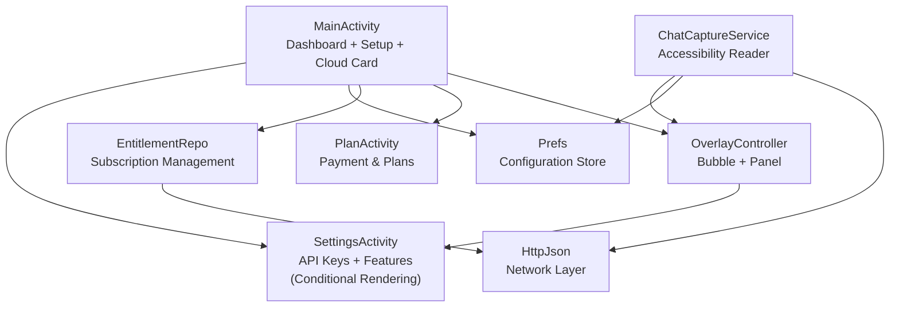
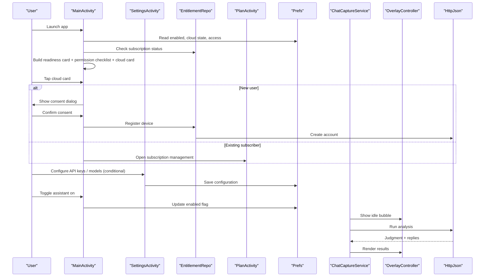
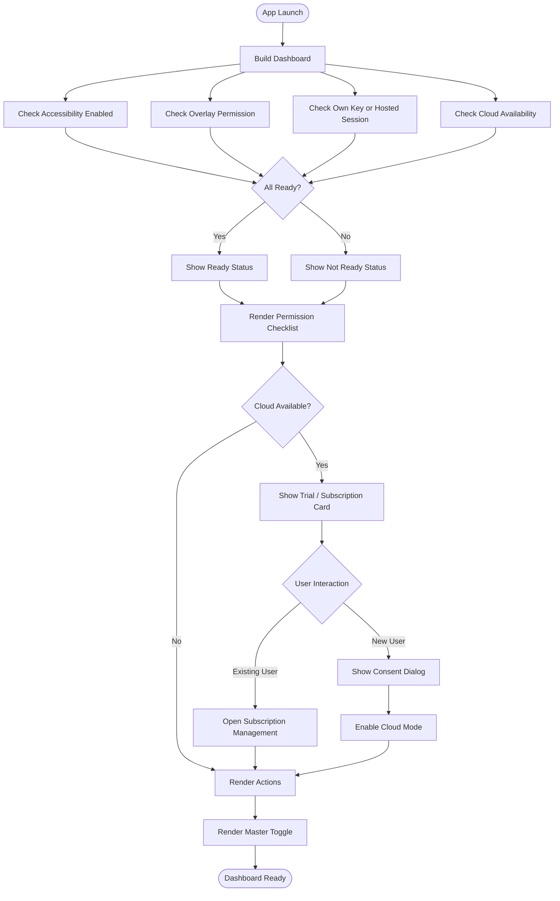
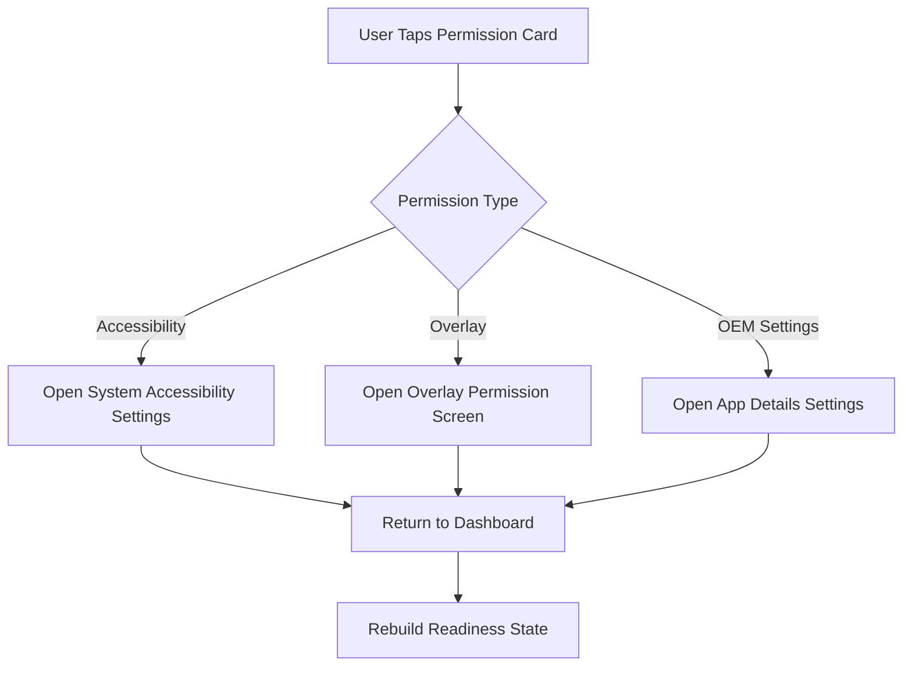
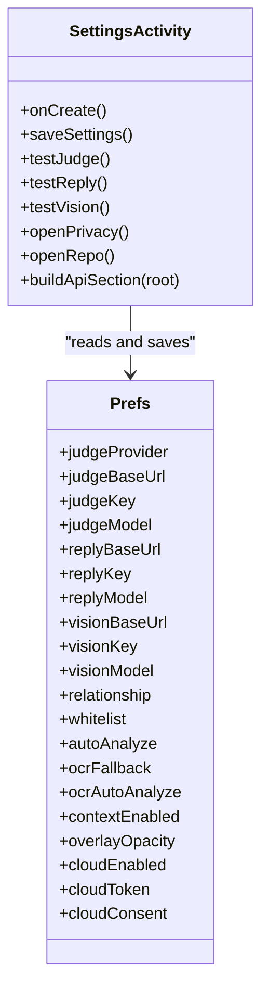
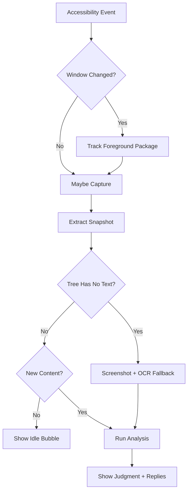
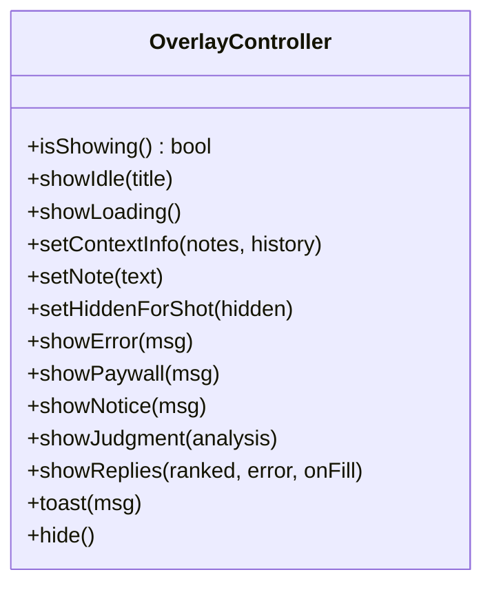
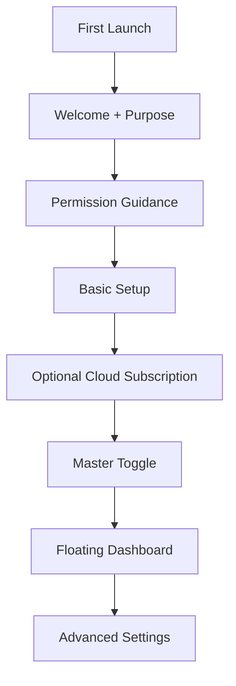
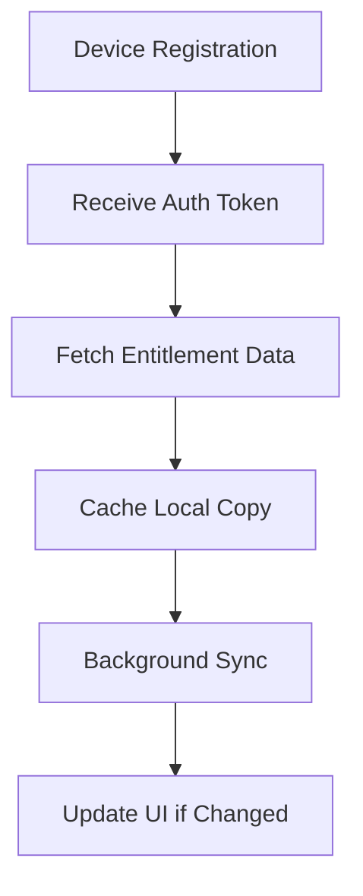
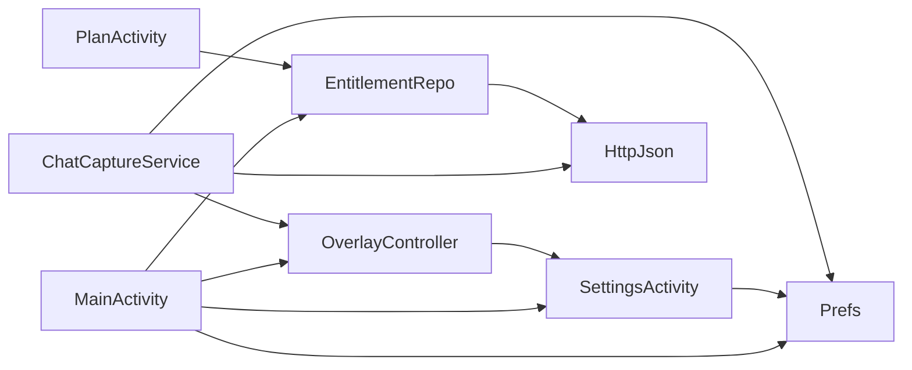

# Main Application Interface

<cite>
**Referenced Files in This Document**
- [MainActivity.kt](file://app/src/main/java/com/jev/probe/MainActivity.kt)
- [SettingsActivity.kt](file://app/src/main/java/com/jev/probe/SettingsActivity.kt)
- [EntitlementRepo.kt](file://app/src/main/java/com/jev/probe/billing/EntitlementRepo.kt)
- [PlanActivity.kt](file://app/src/main/java/com/jev/probe/billing/PlanActivity.kt)
- [AndroidManifest.xml](file://app/src/main/AndroidManifest.xml)
- [Prefs.kt](file://app/src/main/java/com/jev/probe/core/Prefs.kt)
- [ChatCaptureService.kt](file://app/src/main/java/com/jev/probe/capture/ChatCaptureService.kt)
- [OverlayController.kt](file://app/src/main/java/com/jev/probe/overlay/OverlayController.kt)
- [HttpJson.kt](file://app/src/main/java/com/jev/probe/jev/HttpJson.kt)
</cite>

## Update Summary
**Changes Made**
- Updated MainActivity dashboard section to document the sophisticated cloud card system with subscription status, trial offers, and consent dialogs
- Enhanced SettingsActivity configuration surface section to explain conditional API configuration rendering based on build type
- Added new billing integration section covering entitlement management and payment flows
- Updated architecture diagrams to include cloud service components
- Expanded troubleshooting guide with hosted mode specific scenarios

## Table of Contents
1. [Introduction](#introduction)
2. [Project Structure](#project-structure)
3. [Core Components](#core-components)
4. [Architecture Overview](#architecture-overview)
5. [Detailed Component Analysis](#detailed-component-analysis)
6. [Billing Integration](#billing-integration)
7. [Dependency Analysis](#dependency-analysis)
8. [Performance Considerations](#performance-considerations)
9. [Troubleshooting Guide](#troubleshooting-guide)
10. [Conclusion](#conclusion)

## Introduction
This document explains the main application interface that users see when they launch the app. It focuses on:

- The primary entry point and its dashboard-style setup screen with integrated cloud subscription management.
- The initial flow from welcome text to permission guidance, hosted-mode trial enrollment, and master toggle.
- Permission request workflows for accessibility services, overlay permissions, and OEM-specific background behavior.
- The floating overlay dashboard showing analysis status, quick actions, and real-time indicators.
- First-time user onboarding, progressive disclosure of advanced features, and contextual help.
- Error handling for missing permissions, service availability, network errors, and recovery flows.
- Best practices for UX design in complex Android permission scenarios.

The goal is to make both new users and developers understand how the app guides users through setup while keeping sensitive operations safe and transparent, including the new cloud subscription model.

## Project Structure
At a high level, the main interface is composed of:

- A launcher activity that shows the readiness dashboard, permission checklist, cloud subscription card, and master toggle.
- A settings screen where API keys, models, relationship context, OCR options, and appearance are configured (conditionally rendered based on build type).
- An accessibility capture service that reads chat windows and drives the floating overlay.
- An overlay controller that renders the draggable bubble and analysis panel.
- A preferences store that holds configuration, cloud mode state, and feature flags.
- A billing system managing subscriptions, trials, and payments.
- Manifest declarations for permissions, activities, services, and the accessibility service.

**Diagram sources**
- [MainActivity.kt:47-113](file://app/src/main/java/com/jev/probe/MainActivity.kt#L47-L113)
- [SettingsActivity.kt:52-448](file://app/src/main/java/com/jev/probe/SettingsActivity.kt#L52-L448)
- [EntitlementRepo.kt:50-149](file://app/src/main/java/com/jev/probe/billing/EntitlementRepo.kt#L50-L149)
- [PlanActivity.kt:34-209](file://app/src/main/java/com/jev/probe/billing/PlanActivity.kt#L34-L209)
- [ChatCaptureService.kt:202-237](file://app/src/main/java/com/jev/probe/capture/ChatCaptureService.kt#L202-L237)
- [OverlayController.kt:38-87](file://app/src/main/java/com/jev/probe/overlay/OverlayController.kt#L38-L87)
- [Prefs.kt:14-23](file://app/src/main/java/com/jev/probe/core/Prefs.kt#L14-L23)
- [HttpJson.kt:86-130](file://app/src/main/java/com/jev/probe/jev/HttpJson.kt#L86-L130)

**Section sources**
- [AndroidManifest.xml:17-57](file://app/src/main/AndroidManifest.xml#L17-L57)
- [MainActivity.kt:26-31](file://app/src/main/java/com/jev/probe/MainActivity.kt#L26-L31)

## Core Components
The main interface is centered around six core components:

| Component | Responsibility | User-facing role |
|---|---|---|
| `MainActivity` | Builds the home dashboard, checks readiness, presents permission cards, manages hosted-mode consent, subscription status, and toggles the assistant. | Primary setup and control screen with integrated subscription management. |
| `SettingsActivity` | Manages judge/reply/vision endpoints, provider presets, model names, relationship description, whitelist, OCR options, and overlay opacity. Conditionally renders API configuration based on build type. | Advanced configuration and testing with adaptive UI. |
| `EntitlementRepo` | Handles subscription registration, balance synchronization, order creation, and payment polling. | Backend subscription and billing management. |
| `PlanActivity` | Displays subscription plans, current balance, and payment processing through external browser. | Subscription purchase and plan management interface. |
| `ChatCaptureService` | Runs as an accessibility service, detects chat windows, captures messages or screenshots, runs analysis, and updates the overlay. | Background intelligence engine. |
| `OverlayController` | Renders the floating bubble, expands into a translucent panel, shows judgment, candidate replies, errors, paywall, and menu actions. | Real-time dashboard overlay. |
| `Prefs` | Stores all configuration, including API keys, cloud entitlements, feature flags, and UI state. | Persistent configuration backend. |
| `HttpJson` | Handles HTTP requests with retries, throttling detection, and error classification. | Network reliability layer. |

**Section sources**
- [MainActivity.kt:47-113](file://app/src/main/java/com/jev/probe/MainActivity.kt#L47-L113)
- [SettingsActivity.kt:52-448](file://app/src/main/java/com/jev/probe/SettingsActivity.kt#L52-L448)
- [EntitlementRepo.kt:50-149](file://app/src/main/java/com/jev/probe/billing/EntitlementRepo.kt#L50-L149)
- [PlanActivity.kt:34-209](file://app/src/main/java/com/jev/probe/billing/PlanActivity.kt#L34-L209)
- [ChatCaptureService.kt:29-43](file://app/src/main/java/com/jev/probe/capture/ChatCaptureService.kt#L29-L43)
- [OverlayController.kt:29-38](file://app/src/main/java/com/jev/probe/overlay/OverlayController.kt#L29-L38)
- [Prefs.kt:6-13](file://app/src/main/java/com/jev/probe/core/Prefs.kt#L6-L13)
- [HttpJson.kt:86-130](file://app/src/main/java/com/jev/probe/jev/HttpJson.kt#L86-L130)

## Architecture Overview
The main interface follows a layered architecture with integrated subscription management:

1. **UI Layer**: `MainActivity` and `SettingsActivity` provide guided setup and configuration with adaptive rendering.
2. **State Layer**: `Prefs` centralizes configuration and feature flags including cloud subscription state.
3. **Billing Layer**: `EntitlementRepo` and `PlanActivity` manage subscriptions, trials, and payments.
4. **Runtime Layer**: `ChatCaptureService` observes system events and orchestrates capture, OCR, and analysis.
5. **Presentation Layer**: `OverlayController` renders the floating dashboard.
6. **Integration Layer**: `HttpJson` communicates with external AI providers or the hosted gateway.

**Diagram sources**
- [MainActivity.kt:47-113](file://app/src/main/java/com/jev/probe/MainActivity.kt#L47-L113)
- [SettingsActivity.kt:404-448](file://app/src/main/java/com/jev/probe/SettingsActivity.kt#L404-L448)
- [EntitlementRepo.kt:79-112](file://app/src/main/java/com/jev/probe/billing/EntitlementRepo.kt#L79-L112)
- [PlanActivity.kt:85-127](file://app/src/main/java/com/jev/probe/billing/PlanActivity.kt#L85-L127)
- [ChatCaptureService.kt:389-455](file://app/src/main/java/com/jev/probe/capture/ChatCaptureService.kt#L389-L455)
- [OverlayController.kt:405-483](file://app/src/main/java/com/jev/probe/overlay/OverlayController.kt#L405-L483)
- [HttpJson.kt:86-130](file://app/src/main/java/com/jev/probe/jev/HttpJson.kt#L86-L130)

## Detailed Component Analysis

### MainActivity Dashboard and Setup Flow
`MainActivity` is the primary entry point with enhanced cloud subscription management. It builds a scrollable dashboard containing:

- App title and short explanation.
- Readiness card showing whether accessibility, overlay, and access (own key or hosted session) are ready.
- Privacy hint linking to the privacy policy.
- Sophisticated cloud subscription card displaying trial offers, subscription status, and consent dialogs.
- Permission checklist for accessibility, overlay, and OEM-specific auto-start/power-limit settings.
- Quick action row opening `SettingsActivity`.
- Master toggle enabling or disabling the assistant.

**Diagram sources**
- [MainActivity.kt:47-113](file://app/src/main/java/com/jev/probe/MainActivity.kt#L47-L113)
- [MainActivity.kt:117-136](file://app/src/main/java/com/jev/probe/MainActivity.kt#L117-L136)
- [MainActivity.kt:144-180](file://app/src/main/java/com/jev/probe/MainActivity.kt#L144-L180)
- [MainActivity.kt:207-232](file://app/src/main/java/com/jev/probe/MainActivity.kt#L207-L232)

#### Permission Request Workflow
The permission workflow is explicit and user-guided:

- **Accessibility permission**: Opens system accessibility settings so the user can enable the service.
- **Overlay permission**: Opens overlay permission management for the current package.
- **OEM-specific settings**: Opens app details settings for Xiaomi/HyperOS auto-start and power-limit controls.
- **Hosted-mode consent**: Before sending data to the operator's gateway, the app asks for explicit confirmation and remembers consent per install.

**Diagram sources**
- [MainActivity.kt:86-98](file://app/src/main/java/com/jev/probe/MainActivity.kt#L86-L98)
- [MainActivity.kt:204-228](file://app/src/main/java/com/jev/probe/MainActivity.kt#L204-L228)

#### Cloud Subscription Management
The sophisticated cloud card system provides three distinct experiences:

1. **Active subscribers**: Shows current subscription status, renewal options, and ability to switch back to personal API keys.
2. **Trial users**: Displays remaining trial attempts and upgrade prompts.
3. **New users**: Offers free trial enrollment with detailed consent explanation.

The consent flow ensures users explicitly agree before their chat data is sent to the operator's gateway, with clear explanations about data handling and privacy implications.

**Section sources**
- [MainActivity.kt:144-180](file://app/src/main/java/com/jev/probe/MainActivity.kt#L144-L180)
- [MainActivity.kt:207-232](file://app/src/main/java/com/jev/probe/MainActivity.kt#L207-L232)
- [Prefs.kt:218-258](file://app/src/main/java/com/jev/probe/core/Prefs.kt#L218-L258)

### SettingsActivity Configuration Surface
`SettingsActivity` is the advanced configuration surface with conditional rendering based on build type. It exposes:

- **Conditional API Configuration**: In hosted-only builds, the entire API configuration section is hidden since users cannot configure their own endpoints.
- **Full API Configuration**: In open-source builds, provides complete judge endpoint configuration with provider presets and manual URL/model editing.
- Reply endpoint configuration with OpenAI-compatible base URLs and model selection.
- Vision endpoint configuration for OCR fallback.
- Relationship description and conversation whitelist.
- Auto-analyze, OCR fallback, OCR auto-analyze, and context history toggles.
- Overlay opacity slider.
- Test buttons for each endpoint that run offline-safe smoke tests.
- Knowledge base and contact management navigation.
- Version label, privacy policy link, and repository link.

**Diagram sources**
- [SettingsActivity.kt:52-448](file://app/src/main/java/com/jev/probe/SettingsActivity.kt#L52-L448)
- [Prefs.kt:71-131](file://app/src/main/java/com/jev/probe/core/Prefs.kt#L71-L131)
- [Prefs.kt:178-214](file://app/src/main/java/com/jev/probe/core/Prefs.kt#L178-L214)
- [Prefs.kt:218-258](file://app/src/main/java/com/jev/probe/core/Prefs.kt#L218-L258)

**Section sources**
- [SettingsActivity.kt:52-448](file://app/src/main/java/com/jev/probe/SettingsActivity.kt#L52-L448)
- [SettingsActivity.kt:455-516](file://app/src/main/java/com/jev/probe/SettingsActivity.kt#L455-L516)
- [SettingsActivity.kt:547-608](file://app/src/main/java/com/jev/probe/SettingsActivity.kt#L547-L608)

### ChatCaptureService Runtime Behavior
`ChatCaptureService` is the runtime engine behind the dashboard. Its responsibilities include:

- Detecting adapted chat apps and extracting conversation snapshots.
- Handling apps whose message bodies cannot be read from the view tree by falling back to screenshot-based OCR.
- Debouncing rapid content changes.
- Running analysis off the main thread.
- Updating the overlay with loading, judgment, replies, errors, and paywall states.
- Managing knowledge-base context injection and conversation lifecycle.

**Diagram sources**
- [ChatCaptureService.kt:239-360](file://app/src/main/java/com/jev/probe/capture/ChatCaptureService.kt#L239-L360)
- [ChatCaptureService.kt:389-455](file://app/src/main/java/com/jev/probe/capture/ChatCaptureService.kt#L389-L455)
- [ChatCaptureService.kt:465-587](file://app/src/main/java/com/jev/probe/capture/ChatCaptureService.kt#L465-L587)

**Section sources**
- [ChatCaptureService.kt:29-43](file://app/src/main/java/com/jev/probe/capture/ChatCaptureService.kt#L29-L43)
- [ChatCaptureService.kt:202-237](file://app/src/main/java/com/jev/probe/capture/ChatCaptureService.kt#L202-L237)
- [ChatCaptureService.kt:239-360](file://app/src/main/java/com/jev/probe/capture/ChatCaptureService.kt#L239-L360)
- [ChatCaptureService.kt:389-455](file://app/src/main/java/com/jev/probe/capture/ChatCaptureService.kt#L389-L455)

### OverlayController Dashboard Presentation
`OverlayController` renders the floating dashboard:

- Draggable bubble with optional danger indicator.
- Expandable translucent panel.
- Context notes and capture caveats.
- Danger badge, intent headline, secondary hints.
- Ranked candidate reply cards with copy and fill actions.
- Loading, error, paywall, notice, and idle states.
- Menu actions for manual OCR, saving contacts, opening settings, and hiding temporarily.

**Diagram sources**
- [OverlayController.kt:38-87](file://app/src/main/java/com/jev/probe/overlay/OverlayController.kt#L38-L87)
- [OverlayController.kt:286-424](file://app/src/main/java/com/jev/probe/overlay/OverlayController.kt#L286-L424)
- [OverlayController.kt:433-483](file://app/src/main/java/com/jev/probe/overlay/OverlayController.kt#L433-L483)

**Section sources**
- [OverlayController.kt:29-38](file://app/src/main/java/com/jev/probe/overlay/OverlayController.kt#L29-L38)
- [OverlayController.kt:97-122](file://app/src/main/java/com/jev/probe/overlay/OverlayController.kt#L97-L122)
- [OverlayController.kt:198-249](file://app/src/main/java/com/jev/probe/overlay/OverlayController.kt#L198-L249)
- [OverlayController.kt:286-424](file://app/src/main/java/com/jev/probe/overlay/OverlayController.kt#L286-L424)
- [OverlayController.kt:433-483](file://app/src/main/java/com/jev/probe/overlay/OverlayController.kt#L433-L483)

### Conceptual Overview
The main interface is designed around progressive disclosure with integrated subscription management:

- New users see a simple dashboard explaining what the app does and what permissions are needed.
- Basic setup is completed through one-tap links to system settings.
- Optional cloud subscription enrollment with clear consent and privacy explanations.
- Advanced configuration is hidden behind the settings screen (conditionally rendered).
- Runtime behavior is shown through the floating overlay rather than forcing users into complex screens.
- Errors are surfaced as actionable messages, not crashes.

[No sources needed since this diagram shows conceptual workflow, not actual code structure]

## Billing Integration

### Entitlement Management
The billing system provides comprehensive subscription management through `EntitlementRepo`:

- **Device Registration**: Creates unique device identifiers that survive app reinstalls to prevent trial abuse.
- **Balance Synchronization**: Regularly syncs subscription status, trial credits, and usage limits from the server.
- **Order Management**: Handles payment order creation and status polling for Alipay and WeChat payments.
- **Graceful Degradation**: Maintains cached entitlement data even when network calls fail.

**Diagram sources**
- [EntitlementRepo.kt:79-112](file://app/src/main/java/com/jev/probe/billing/EntitlementRepo.kt#L79-L112)

### Payment Processing
`PlanActivity` handles the complete subscription purchase flow:

- **Plan Display**: Shows current subscription status, daily usage limits, and available plans.
- **Payment Integration**: Redirects users to external payment systems (Alipay/WeChat) without requiring payment SDKs.
- **Order Polling**: Monitors payment completion and automatically updates subscription status.
- **Error Handling**: Provides clear feedback for failed payments and support contact information.

**Section sources**
- [EntitlementRepo.kt:50-149](file://app/src/main/java/com/jev/probe/billing/EntitlementRepo.kt#L50-L149)
- [PlanActivity.kt:34-209](file://app/src/main/java/com/jev/probe/billing/PlanActivity.kt#L34-L209)

## Dependency Analysis
The main interface depends on several layers with enhanced billing integration:

- `MainActivity` depends on `Prefs` for configuration, `EntitlementRepo` for subscription management, and system settings for permission navigation.
- `SettingsActivity` depends on `Prefs` for reading and writing configuration and on client classes for testing endpoints.
- `ChatCaptureService` depends on `Prefs`, `OverlayController`, OCR components, and network clients.
- `OverlayController` depends on `Prefs` for UI state and opens other activities via explicit class names.
- `EntitlementRepo` depends on `HttpJson` for network communication with the billing gateway.
- `HttpJson` provides retry logic and error classification used by higher-level clients.

**Diagram sources**
- [MainActivity.kt:47-113](file://app/src/main/java/com/jev/probe/MainActivity.kt#L47-L113)
- [SettingsActivity.kt:52-448](file://app/src/main/java/com/jev/probe/SettingsActivity.kt#L52-L448)
- [ChatCaptureService.kt:202-237](file://app/src/main/java/com/jev/probe/capture/ChatCaptureService.kt#L202-L237)
- [OverlayController.kt:256-262](file://app/src/main/java/com/jev/probe/overlay/OverlayController.kt#L256-L262)
- [EntitlementRepo.kt:82-92](file://app/src/main/java/com/jev/probe/billing/EntitlementRepo.kt#L82-L92)
- [HttpJson.kt:86-130](file://app/src/main/java/com/jev/probe/jev/HttpJson.kt#L86-L130)

**Section sources**
- [AndroidManifest.xml:1-8](file://app/src/main/AndroidManifest.xml#L1-L8)
- [AndroidManifest.xml:17-57](file://app/src/main/AndroidManifest.xml#L17-L57)

## Performance Considerations
The main interface avoids heavy work during setup with enhanced billing optimization:

- Dashboard building is lightweight and recomputed on resume.
- Hosted-mode balance refresh runs on a background thread and only rebuilds if state changes.
- Settings test buttons use scratch preference files so they do not mutate real configuration.
- The capture service debounces content changes and cancels stale analysis tasks.
- OCR paths throttle screenshots and avoid repeated work using signatures.
- Network requests use retries with exponential backoff and distinguish transient failures from permanent errors.
- Billing operations are optimized with caching and background synchronization.

Best practices derived from the implementation:

- Keep setup screens fast and readable.
- Move long-running operations off the main thread.
- Avoid blocking users on optional features.
- Use clear status indicators instead of silent failures.
- Preserve user progress across configuration changes.
- Cache expensive operations like subscription data.

[No sources needed since this section provides general guidance]

## Troubleshooting Guide

### Missing Accessibility Permission
**Symptoms**:
- Readiness card shows accessibility as not enabled.
- Floating bubble does not appear or stops updating.
- Manual OCR fails because the view tree cannot be read.

**Recovery steps**:
1. Open the accessibility permission card in `MainActivity`.
2. Enable the service in system settings.
3. Return to the app; the dashboard rebuilds and shows updated status.
4. If the service restarts unexpectedly, allow the app to re-show the bubble automatically.

**Section sources**
- [MainActivity.kt:86-90](file://app/src/main/java/com/jev/probe/MainActivity.kt#L86-L90)
- [ChatCaptureService.kt:232-236](file://app/src/main/java/com/jev/probe/capture/ChatCaptureService.kt#L232-L236)
- [ChatCaptureService.kt:465-479](file://app/src/main/java/com/jev/probe/capture/ChatCaptureService.kt#L465-L479)

### Missing Overlay Permission
**Symptoms**:
- Readiness card shows overlay as not enabled.
- Floating panel does not render.
- Overlay creation logs indicate `canDrawOverlays=false`.

**Recovery steps**:
1. Open the overlay permission card in `MainActivity`.
2. Grant overlay permission for the app.
3. Restart or reopen the app so the overlay can be created.

**Section sources**
- [MainActivity.kt:91-93](file://app/src/main/java/com/jev/probe/MainActivity.kt#L91-L93)
- [OverlayController.kt:78-99](file://app/src/main/java/com/jev/probe/overlay/OverlayController.kt#L78-L99)

### Missing API Key or Invalid Endpoint
**Symptoms**:
- Readiness card shows access as not configured.
- Analysis shows an error about missing judge key.
- Settings test button reports failure.

**Recovery steps**:
1. Open settings from the dashboard.
2. Fill judge endpoint, key, and model.
3. Use the test button to verify connectivity.
4. Save settings and return to the dashboard.

**Section sources**
- [MainActivity.kt:74-80](file://app/src/main/java/com/jev/probe/MainActivity.kt#L74-L80)
- [ChatCaptureService.kt:399-400](file://app/src/main/java/com/jev/probe/capture/ChatCaptureService.kt#L399-L400)
- [SettingsActivity.kt:157-194](file://app/src/main/java/com/jev/probe/SettingsActivity.kt#L157-L194)

### Network Errors and Throttling
**Symptoms**:
- Analysis fails with a network error.
- Hosted mode shows paywall or expired trial.
- Some requests succeed after retries.

**Recovery steps**:
1. Check whether hosted mode is active or whether a custom provider is configured.
2. For hosted mode, open the plan page or switch back to your own key.
3. Retry later if the error indicates throttling or temporary server issues.
4. Verify endpoint configuration in settings.

**Section sources**
- [HttpJson.kt:86-130](file://app/src/main/java/com/jev/probe/jev/HttpJson.kt#L86-L130)
- [OverlayController.kt:364-387](file://app/src/main/java/com/jev/probe/overlay/OverlayController.kt#L364-L387)
- [ChatCaptureService.kt:423-435](file://app/src/main/java/com/jev/probe/capture/ChatCaptureService.kt#L423-L435)

### OEM Power Management Freezing the Service
**Symptoms**:
- Service stops reading messages after some time.
- Xiaomi/HyperOS devices require extra configuration.
- Dashboard mentions auto-start and power-limit settings.

**Recovery steps**:
1. Open the OEM settings card in `MainActivity`.
2. Enable auto-start and disable battery restrictions for the app.
3. Ensure the accessibility service remains enabled.
4. Restart the app if necessary.

**Section sources**
- [MainActivity.kt:94-98](file://app/src/main/java/com/jev/probe/MainActivity.kt#L94-L98)
- [AndroidManifest.xml:50-57](file://app/src/main/AndroidManifest.xml#L50-L57)

### Cloud Subscription Issues
**Symptoms**:
- Cloud card shows "syncing..." indefinitely.
- Trial credits not appearing after registration.
- Payment completed but subscription not activated.

**Recovery steps**:
1. Check internet connection and try again.
2. For payment issues, note the order ID and contact support.
3. Clear app cache and restart if subscription state appears corrupted.
4. Verify that consent was properly granted during initial setup.

**Section sources**
- [EntitlementRepo.kt:79-112](file://app/src/main/java/com/jev/probe/billing/EntitlementRepo.kt#L79-L112)
- [PlanActivity.kt:161-181](file://app/src/main/java/com/jev/probe/billing/PlanActivity.kt#L161-L181)

### Conditional Settings Not Appearing
**Symptoms**:
- API configuration section missing in hosted-only builds.
- Settings screen looks different between builds.

**Explanation**:
In hosted-only builds (`BuildConfig.HOSTED_ONLY = true`), the API configuration section is intentionally hidden since users cannot configure their own endpoints. This is expected behavior for subscription-only versions.

**Section sources**
- [SettingsActivity.kt:69-70](file://app/src/main/java/com/jev/probe/SettingsActivity.kt#L69-L70)

## Conclusion
The main application interface is a guided, dashboard-driven entry point that balances simplicity with powerful capabilities, now enhanced with sophisticated subscription management. It introduces users to the app's purpose, walks them through required permissions, offers optional hosted-mode onboarding with clear consent mechanisms, and exposes advanced configuration through a dedicated settings screen with adaptive rendering. At runtime, the floating overlay provides real-time feedback, quick actions, and contextual help without overwhelming the user.

The implementation emphasizes:

- Clear readiness indicators with integrated subscription status.
- Explicit permission explanations and consent mechanisms.
- Progressive disclosure of advanced features with conditional UI rendering.
- Safe defaults and opt-in behaviors for both permissions and subscriptions.
- Robust error handling and recovery paths for both technical and billing issues.
- A design that keeps the user in control of sensitive actions like sending messages and sharing data.
- Seamless integration of subscription management without disrupting core functionality.

For future improvements, consider adding more localized strings, richer onboarding animations, additional contextual tips inside the overlay, and enhanced subscription analytics. However, the current approach already provides a solid foundation for complex permission scenarios, sustained user engagement during setup, and seamless subscription management.